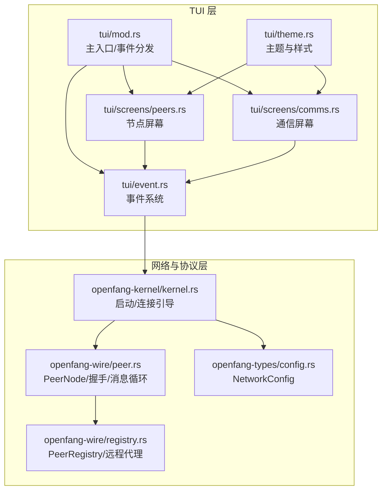
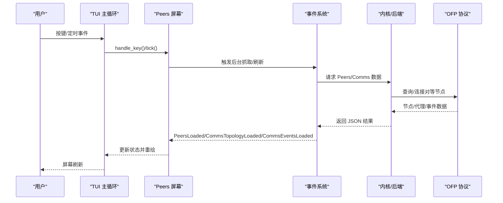
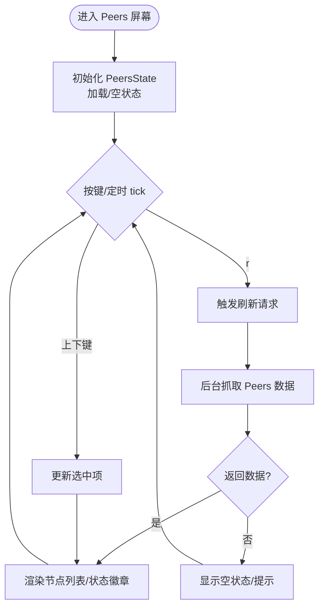
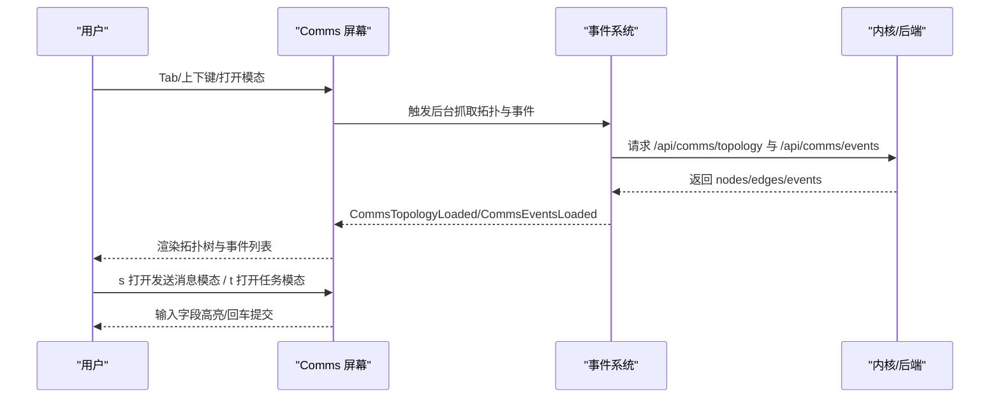
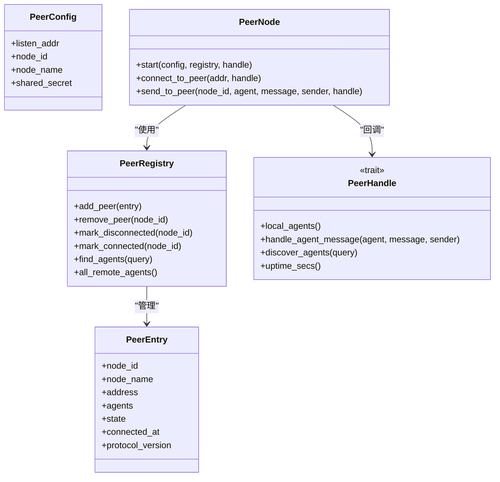
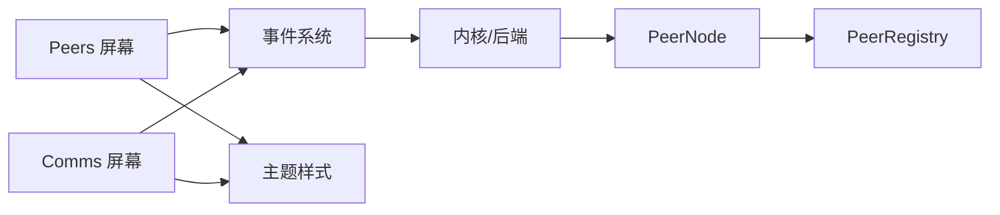

# 节点屏幕

<cite>
**本文档引用的文件**
- [peers.rs](file://crates/openfang-cli/src/tui/screens/peers.rs)
- [comms.rs](file://crates/openfang-cli/src/tui/screens/comms.rs)
- [mod.rs](file://crates/openfang-cli/src/tui/mod.rs)
- [theme.rs](file://crates/openfang-cli/src/tui/theme.rs)
- [event.rs](file://crates/openfang-cli/src/tui/event.rs)
- [config.rs](file://crates/openfang-types/src/config.rs)
- [registry.rs](file://crates/openfang-wire/src/registry.rs)
- [peer.rs](file://crates/openfang-wire/src/peer.rs)
- [kernel.rs](file://crates/openfang-kernel/src/kernel.rs)
</cite>

## 目录
1. [简介](#简介)
2. [项目结构](#项目结构)
3. [核心组件](#核心组件)
4. [架构总览](#架构总览)
5. [详细组件分析](#详细组件分析)
6. [依赖关系分析](#依赖关系分析)
7. [性能考虑](#性能考虑)
8. [故障排除指南](#故障排除指南)
9. [结论](#结论)

## 简介
本文件面向 OpenFang TUI 的“节点屏幕”（Peers）与“通信屏幕”（Comms），系统性阐述节点管理功能：节点列表、节点状态、节点通信、网络拓扑、节点发现机制、连接管理、状态监控、通信协议等。文档同时记录界面设计、交互元素（导航、刷新、提示）、以及节点网络的配置指南、连接优化与故障排除方法，帮助用户高效运维与排障。

## 项目结构
- TUI 屏幕模块位于 openfang-cli 的 tui/screens 子目录，包含 peers.rs（节点屏幕）与 comms.rs（通信屏幕）。
- 主 TUI 入口与事件分发在 tui/mod.rs 中定义，负责 Tab 切换、事件路由与屏幕状态管理。
- 主题样式在 tui/theme.rs 中统一管理，确保视觉一致性。
- 事件系统在 tui/event.rs 中定义，负责后台数据抓取与事件派发。
- 节点网络与通信协议由 openfang-wire 提供，包括 PeerNode、PeerRegistry、Wire 协议与安全机制。
- 配置项在网络层通过 openfang-types 的 NetworkConfig 定义，kernel 在启动时根据配置初始化 OFP 节点。

图表来源
- [mod.rs:1-200](file://crates/openfang-cli/src/tui/mod.rs#L1-L200)
- [peers.rs:1-217](file://crates/openfang-cli/src/tui/screens/peers.rs#L1-L217)
- [comms.rs:1-763](file://crates/openfang-cli/src/tui/screens/comms.rs#L1-L763)
- [event.rs:1-2785](file://crates/openfang-cli/src/tui/event.rs#L1-L2785)
- [peer.rs:1-800](file://crates/openfang-wire/src/peer.rs#L1-L800)
- [registry.rs:1-352](file://crates/openfang-wire/src/registry.rs#L1-L352)
- [config.rs:1511-1557](file://crates/openfang-types/src/config.rs#L1511-L1557)
- [kernel.rs:4290-4489](file://crates/openfang-kernel/src/kernel.rs#L4290-L4489)

章节来源
- [mod.rs:1-200](file://crates/openfang-cli/src/tui/mod.rs#L1-L200)
- [peers.rs:1-217](file://crates/openfang-cli/src/tui/screens/peers.rs#L1-L217)
- [comms.rs:1-763](file://crates/openfang-cli/src/tui/screens/comms.rs#L1-L763)
- [event.rs:1-2785](file://crates/openfang-cli/src/tui/event.rs#L1-L2785)
- [peer.rs:1-800](file://crates/openfang-wire/src/peer.rs#L1-L800)
- [registry.rs:1-352](file://crates/openfang-wire/src/registry.rs#L1-L352)
- [config.rs:1511-1557](file://crates/openfang-types/src/config.rs#L1511-L1557)
- [kernel.rs:4290-4489](file://crates/openfang-kernel/src/kernel.rs#L4290-L4489)

## 核心组件
- 节点屏幕（Peers）
  - 数据模型：PeerInfo（节点 ID、名称、地址、状态、代理数量、协议版本）
  - 状态管理：PeersState（节点列表、选中项、加载状态、自动刷新计数）
  - 交互：上下移动、刷新、控制键退出
  - 渲染：标题栏、表头、节点列表、状态提示与自动刷新逻辑
- 通信屏幕（Comms）
  - 数据模型：CommsNode（节点/代理）、CommsEdge（父子/同级关系）、CommsEventItem（事件）
  - 状态管理：CommsState（节点/边/事件、焦点切换、模态框、状态消息）
  - 交互：Tab 切换焦点、发送消息/发布任务模态、上下滚动事件列表、刷新
  - 渲染：拓扑树、事件流、模态框与状态提示
- 事件系统
  - 后台抓取：PeersLoaded、CommsTopologyLoaded、CommsEventsLoaded 等
  - 自动刷新：基于 tick 计数的周期触发
  - 错误处理：FetchError 统一路由到当前 Tab 的状态消息
- 主入口与主题
  - Tab 导航：F1-F12、Tab/Shift+Tab、Ctrl+方向键
  - 主题：颜色语义、选中高亮、提示样式、旋转器动画帧

章节来源
- [peers.rs:13-84](file://crates/openfang-cli/src/tui/screens/peers.rs#L13-L84)
- [comms.rs:13-121](file://crates/openfang-cli/src/tui/screens/comms.rs#L13-L121)
- [event.rs:42-203](file://crates/openfang-cli/src/tui/event.rs#L42-L203)
- [mod.rs:64-114](file://crates/openfang-cli/src/tui/mod.rs#L64-L114)
- [theme.rs:1-140](file://crates/openfang-cli/src/tui/theme.rs#L1-L140)

## 架构总览
节点屏幕与通信屏幕均通过事件系统从后端拉取数据并驱动 UI 更新。Peers 屏幕展示 OFP 节点网络中的对等节点；Comms 屏幕展示本地与远端代理的拓扑关系与实时事件流。两者共享统一的主题与布局策略，并通过自动刷新维持数据新鲜度。

图表来源
- [mod.rs:226-610](file://crates/openfang-cli/src/tui/mod.rs#L226-L610)
- [event.rs:2640-2690](file://crates/openfang-cli/src/tui/event.rs#L2640-L2690)
- [peer.rs:490-648](file://crates/openfang-wire/src/peer.rs#L490-L648)
- [registry.rs:56-206](file://crates/openfang-wire/src/registry.rs#L56-L206)

## 详细组件分析

### 节点屏幕（Peers）分析
- 数据模型与渲染
  - 使用 PeerInfo 表示单个节点，渲染时根据状态生成徽章（连接中/已连接/断开）
  - 支持截断显示长 ID/地址，提升可读性
- 自动刷新与交互
  - 基于 tick 计数每约 15 秒刷新一次（20fps）
  - 支持手动 r 键刷新；支持上下键选择列表项
- 状态与提示
  - 加载中显示旋转器与“发现节点”提示
  - 无节点时提示需在配置中启用网络

图表来源
- [peers.rs:38-84](file://crates/openfang-cli/src/tui/screens/peers.rs#L38-L84)
- [peers.rs:88-205](file://crates/openfang-cli/src/tui/screens/peers.rs#L88-L205)

章节来源
- [peers.rs:1-217](file://crates/openfang-cli/src/tui/screens/peers.rs#L1-L217)

### 通信屏幕（Comms）分析
- 拓扑与事件
  - CommsNode/CommsEdge 描述本地与远端代理的层次与关系
  - CommsEventItem 记录实时事件（消息、任务、生命周期等）
- 焦点与模态
  - Tab 在“拓扑树”和“事件列表”间切换
  - 发送消息与发布任务采用模态输入，支持字段切换与回车提交
- 自动刷新与渲染
  - 每约 5 秒刷新一次拓扑与事件
  - 焦点高亮、状态颜色、事件类型着色增强可读性

图表来源
- [comms.rs:88-175](file://crates/openfang-cli/src/tui/screens/comms.rs#L88-L175)
- [comms.rs:324-423](file://crates/openfang-cli/src/tui/screens/comms.rs#L324-L423)
- [event.rs:2640-2690](file://crates/openfang-cli/src/tui/event.rs#L2640-L2690)

章节来源
- [comms.rs:1-763](file://crates/openfang-cli/src/tui/screens/comms.rs#L1-L763)
- [event.rs:2640-2690](file://crates/openfang-cli/src/tui/event.rs#L2640-L2690)

### 事件系统与后台抓取
- 事件类型
  - PeersLoaded：节点列表
  - CommsTopologyLoaded/CommsEventsLoaded：拓扑与事件
  - FetchError：通用错误路由至当前 Tab
- 抓取流程
  - 通过 spawn_fetch_* 函数在后台线程发起 HTTP 请求
  - 解析 JSON 并通过 AppEvent 分发给对应屏幕
- 自动刷新
  - PeersState/CommsState 内部维护 poll_tick，达到阈值后触发 should_poll

章节来源
- [event.rs:42-203](file://crates/openfang-cli/src/tui/event.rs#L42-L203)
- [event.rs:2640-2690](file://crates/openfang-cli/src/tui/event.rs#L2640-L2690)
- [mod.rs:505-531](file://crates/openfang-cli/src/tui/mod.rs#L505-L531)

### 节点网络与通信协议
- 配置
  - NetworkConfig：监听地址、引导节点、mDNS 开关、最大连接数、共享密钥
- 启动与连接
  - Kernel 在启动时创建 PeerRegistry 与 PeerNode，绑定监听地址
  - 连接引导：解析 bootstrap_peers 并尝试连接
- 协议与安全
  - PeerNode 实现 HMAC-SHA256 握手、会话密钥派生、消息认证
  - PeerRegistry 维护对等节点与代理列表，支持查询与通知处理
- 通信流程
  - 握手后进入消息循环，支持 Ping、Discover、AgentMessage 等请求
  - 未完成握手前拒绝非握手消息，防止未授权访问

图表来源
- [peer.rs:110-158](file://crates/openfang-wire/src/peer.rs#L110-L158)
- [peer.rs:160-352](file://crates/openfang-wire/src/peer.rs#L160-L352)
- [registry.rs:31-48](file://crates/openfang-wire/src/registry.rs#L31-L48)
- [registry.rs:50-206](file://crates/openfang-wire/src/registry.rs#L50-L206)
- [config.rs:1511-1557](file://crates/openfang-types/src/config.rs#L1511-L1557)
- [kernel.rs:4290-4489](file://crates/openfang-kernel/src/kernel.rs#L4290-L4489)

章节来源
- [config.rs:1511-1557](file://crates/openfang-types/src/config.rs#L1511-L1557)
- [peer.rs:1-800](file://crates/openfang-wire/src/peer.rs#L1-L800)
- [registry.rs:1-352](file://crates/openfang-wire/src/registry.rs#L1-L352)
- [kernel.rs:4290-4489](file://crates/openfang-kernel/src/kernel.rs#L4290-L4489)

## 依赖关系分析
- 屏幕到事件系统：PeersState/CommsState 通过 AppEvent 触发后台抓取
- 事件系统到后端：通过 Daemon 或 InProcess 后端抓取数据
- 事件系统到网络层：Kernel 启动 PeerNode，PeerNode 与 PeerRegistry 协作
- 主题与样式：theme.rs 提供统一配色与样式，被 Peers/Comms 共享

图表来源
- [mod.rs:182-222](file://crates/openfang-cli/src/tui/mod.rs#L182-L222)
- [event.rs:527-581](file://crates/openfang-cli/src/tui/event.rs#L527-L581)
- [peer.rs:176-213](file://crates/openfang-wire/src/peer.rs#L176-L213)
- [registry.rs:50-68](file://crates/openfang-wire/src/registry.rs#L50-L68)
- [theme.rs:1-140](file://crates/openfang-cli/src/tui/theme.rs#L1-L140)

章节来源
- [mod.rs:182-222](file://crates/openfang-cli/src/tui/mod.rs#L182-L222)
- [event.rs:527-581](file://crates/openfang-cli/src/tui/event.rs#L527-L581)
- [peer.rs:176-213](file://crates/openfang-wire/src/peer.rs#L176-L213)
- [registry.rs:50-68](file://crates/openfang-wire/src/registry.rs#L50-L68)
- [theme.rs:1-140](file://crates/openfang-cli/src/tui/theme.rs#L1-L140)

## 性能考虑
- 自动刷新频率
  - Peers：约 15 秒（20fps tick，300 tick 一轮）
  - Comms：约 5 秒（20fps tick，100 tick 一轮）
- 网络层优化
  - 合理设置 bootstrap_peers，避免过多无效连接
  - 控制 max_peers，限制资源占用
  - 使用 mDNS 仅限本地网络环境，避免跨网段广播风暴
- UI 渲染
  - 截断长文本与状态徽章减少渲染开销
  - 滚动列表与焦点高亮降低不必要的重绘

## 故障排除指南
- 节点列表为空
  - 检查配置中的 [network] shared_secret 是否设置
  - 确认 bootstrap_peers 地址格式正确且可达
  - 查看日志中 OFP 启动失败或连接失败信息
- 握手失败/认证错误
  - 核对 shared_secret 是否一致
  - 检查时间窗内 nonce 重复导致的拒绝
  - 确保两端协议版本匹配
- 通信异常
  - 使用 Comms 屏幕的“发送消息/发布任务”模态进行最小化验证
  - 关注事件列表中的错误类型与时间戳
- 连接不稳定
  - 减少 bootstrap_peers 数量，优先使用稳定节点
  - 调整 max_peers，避免资源耗尽
  - 检查防火墙与 NAT 设置，确保端口可达

章节来源
- [peer.rs:183-188](file://crates/openfang-wire/src/peer.rs#L183-L188)
- [peer.rs:269-274](file://crates/openfang-wire/src/peer.rs#L269-L274)
- [peer.rs:530-540](file://crates/openfang-wire/src/peer.rs#L530-L540)
- [config.rs:1511-1557](file://crates/openfang-types/src/config.rs#L1511-L1557)
- [kernel.rs:4309-4334](file://crates/openfang-kernel/src/kernel.rs#L4309-L4334)

## 结论
节点屏幕与通信屏幕共同构成 OpenFang TUI 的节点管理与通信视图。前者聚焦对等节点的发现、连接状态与自动刷新，后者聚焦代理拓扑与事件流的可视化。二者通过统一的事件系统与主题体系集成，配合 openfang-wire 的安全协议与 kernel 的启动流程，形成完整的节点网络管理闭环。建议在生产环境中合理配置网络参数、定期检查握手与连接状态，并利用自动刷新与事件流快速定位问题。