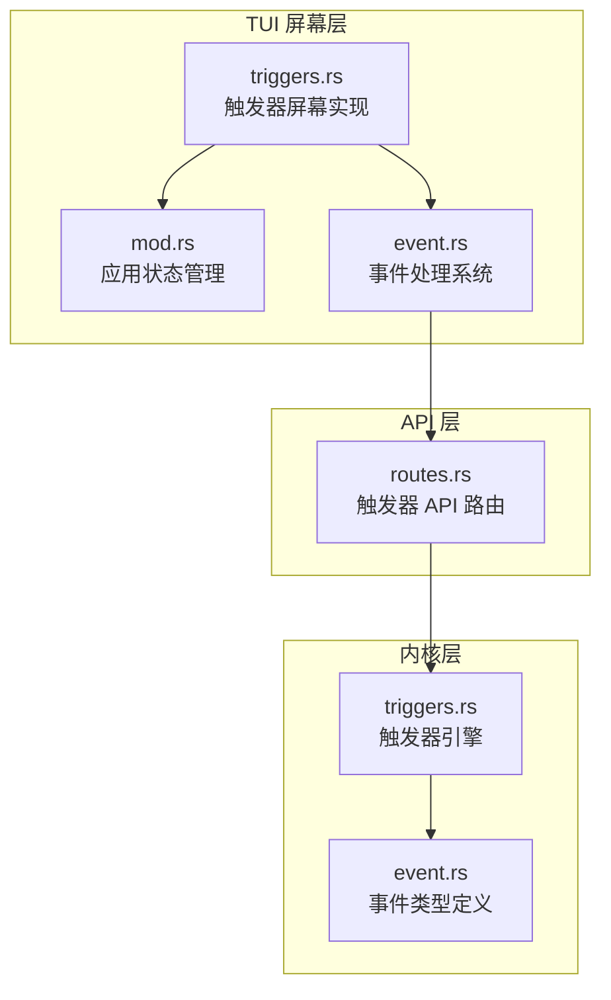
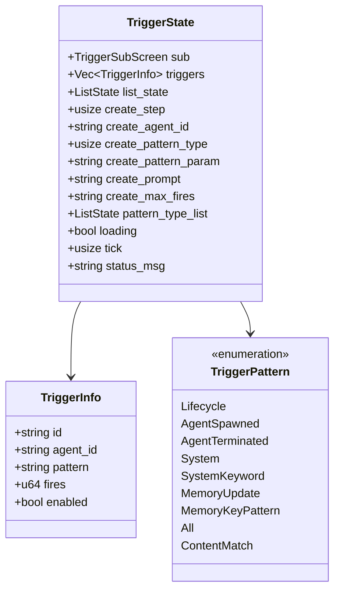
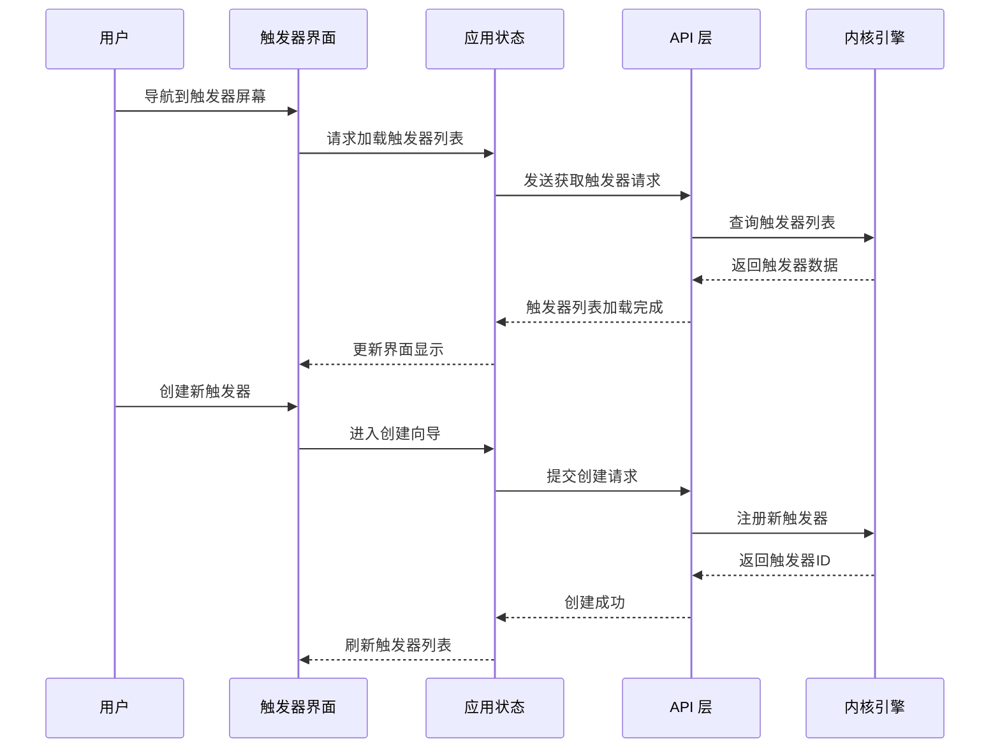
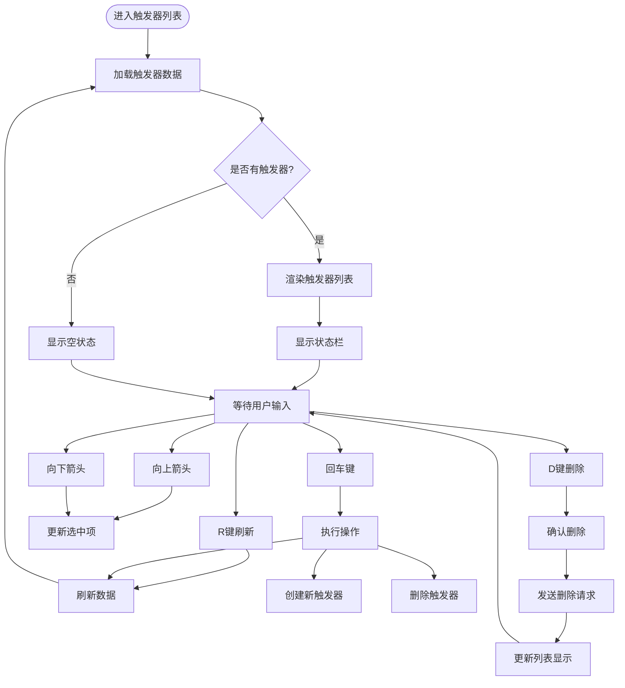
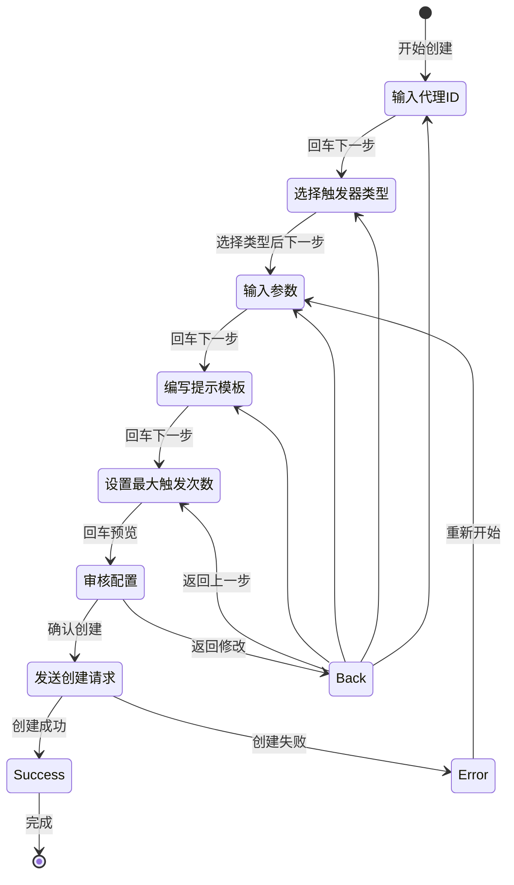
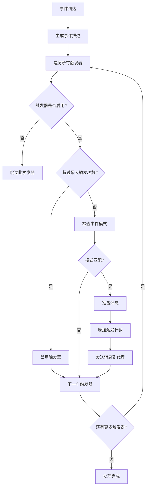
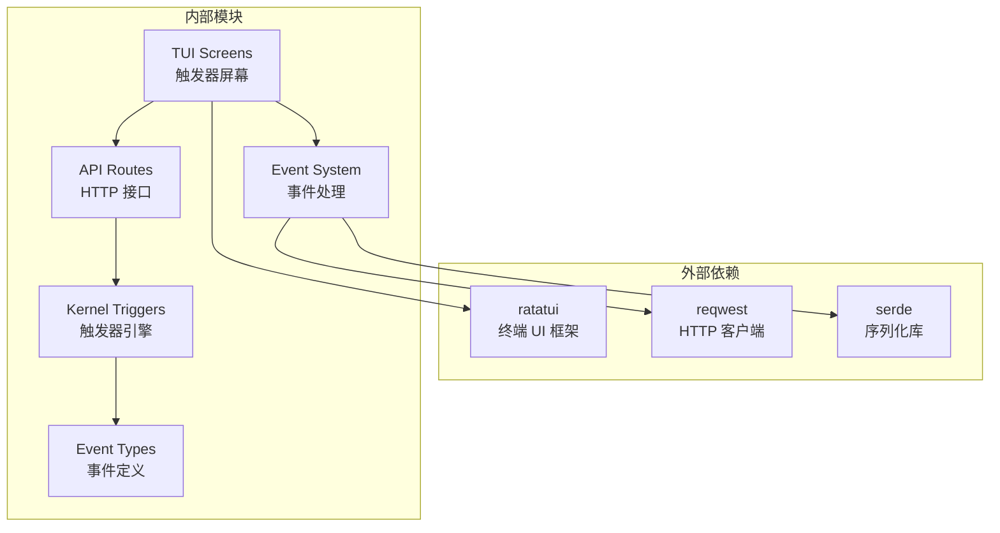

# 触发器屏幕

<cite>
**本文档引用的文件**
- [triggers.rs](file://crates/openfang-cli/src/tui/screens/triggers.rs)
- [mod.rs](file://crates/openfang-cli/src/tui/mod.rs)
- [event.rs](file://crates/openfang-cli/src/tui/event.rs)
- [routes.rs](file://crates/openfang-api/src/routes.rs)
- [triggers.rs](file://crates/openfang-kernel/src/triggers.rs)
- [event.rs](file://crates/openfang-types/src/event.rs)
</cite>

## 目录
1. [简介](#简介)
2. [项目结构](#项目结构)
3. [核心组件](#核心组件)
4. [架构概览](#架构概览)
5. [详细组件分析](#详细组件分析)
6. [依赖关系分析](#依赖关系分析)
7. [性能考虑](#性能考虑)
8. [故障排除指南](#故障排除指南)
9. [结论](#结论)
10. [附录](#附录)

## 简介

触发器屏幕是 OpenFang TUI 中用于管理和配置事件驱动触发器的核心界面。该屏幕提供了完整的触发器生命周期管理功能，包括触发器列表展示、创建向导、条件配置、动作管理等。

触发器系统基于事件驱动架构，允许用户定义特定事件模式，当系统中发生匹配的事件时自动激活相应的代理。支持多种触发器类型，包括生命周期事件、内容匹配、系统事件等，并提供灵活的条件表达式和动作配置选项。

## 项目结构

触发器屏幕位于 OpenFang CLI 的 TUI 模块中，采用模块化设计：

**图表来源**
- [triggers.rs:1-558](file://crates/openfang-cli/src/tui/screens/triggers.rs#L1-L558)
- [mod.rs:1-800](file://crates/openfang-cli/src/tui/mod.rs#L1-L800)
- [event.rs:1-200](file://crates/openfang-cli/src/tui/event.rs#L1-L200)

**章节来源**
- [triggers.rs:1-50](file://crates/openfang-cli/src/tui/screens/triggers.rs#L1-L50)
- [mod.rs:42-84](file://crates/openfang-cli/src/tui/mod.rs#L42-L84)

## 核心组件

### 触发器数据模型

触发器系统的核心数据结构包括触发器信息和触发器模式：

**图表来源**
- [triggers.rs:13-86](file://crates/openfang-cli/src/tui/screens/triggers.rs#L13-L86)
- [triggers.rs:38-80](file://crates/openfang-kernel/src/triggers.rs#L38-L80)

### 触发器类型分类

系统支持以下触发器类型：

| 类型 | 描述 | 参数 | 使用场景 |
|------|------|------|----------|
| Lifecycle | 代理生命周期事件 | 无 | 监控代理启动、停止、崩溃等状态变化 |
| AgentSpawned | 特定代理被创建 | name_pattern | 当指定名称的代理被创建时触发 |
| AgentTerminated | 代理终止或崩溃 | 无 | 监控代理异常退出 |
| System | 系统级事件 | 无 | 监听系统健康状态、配额警告等 |
| SystemKeyword | 关键词匹配系统事件 | keyword | 搜索特定关键词的系统事件 |
| MemoryUpdate | 内存更新事件 | 无 | 监听内存数据变化 |
| MemoryKeyPattern | 内存键模式匹配 | key_pattern | 基于键名模式监听内存变化 |
| All | 匹配所有事件 | 无 | 全局事件监听（谨慎使用） |
| ContentMatch | 内容子串匹配 | substring | 基于事件内容的文本匹配 |

**章节来源**
- [triggers.rs:38-59](file://crates/openfang-kernel/src/triggers.rs#L38-L59)

## 架构概览

触发器屏幕采用分层架构设计，实现了清晰的关注点分离：

**图表来源**
- [mod.rs:290-304](file://crates/openfang-cli/src/tui/mod.rs#L290-L304)
- [event.rs:842-875](file://crates/openfang-cli/src/tui/event.rs#L842-L875)
- [routes.rs:1193-1219](file://crates/openfang-api/src/routes.rs#L1193-L1219)

## 详细组件分析

### 触发器列表界面

触发器列表界面提供了直观的表格视图，显示关键信息并支持基本操作：

**图表来源**
- [triggers.rs:102-142](file://crates/openfang-cli/src/tui/screens/triggers.rs#L102-L142)

#### 界面元素说明

| 元素 | 功能 | 快捷键 | 显示内容 |
|------|------|--------|----------|
| 表头 | 显示列标题 | - | Agent、Pattern、Fires、Enabled |
| 触发器行 | 显示触发器详情 | - | 代理ID、模式类型、触发次数、启用状态 |
| 新建项 | 创建新触发器 | Enter | "+ Create new trigger" |
| 状态栏 | 显示操作提示 | - | 当前操作状态和提示信息 |

**章节来源**
- [triggers.rs:272-361](file://crates/openfang-cli/src/tui/screens/triggers.rs#L272-L361)

### 创建向导流程

创建向导采用多步骤设计，确保用户能够正确配置触发器：

**图表来源**
- [triggers.rs:144-248](file://crates/openfang-cli/src/tui/screens/triggers.rs#L144-L248)

#### 向导步骤详解

1. **代理ID输入** (`step 0`)
   - 输入目标代理的唯一标识符
   - 支持字符输入和退格删除
   - 验证格式有效性

2. **触发器类型选择** (`step 1`)
   - 使用上下箭头导航
   - 支持键盘快捷键 k/j 上下移动
   - Enter 键确认选择

3. **参数配置** (`step 2`)
   - 根据所选类型输入相应参数
   - Lifecycle 类型：无需参数
   - AgentSpawned 类型：输入代理名称模式
   - ContentMatch 类型：输入内容匹配字符串

4. **提示模板编辑** (`step 3`)
   - 编写触发时发送给代理的消息模板
   - 支持 `{{event}}` 占位符自动替换

5. **最大触发次数设置** (`step 4`)
   - 输入数字限制触发次数
   - 0 表示无限次触发
   - 自动验证数字格式

6. **配置审核** (`step 5`)
   - 显示最终配置摘要
   - 确认无误后提交创建

**章节来源**
- [triggers.rs:389-450](file://crates/openfang-cli/src/tui/screens/triggers.rs#L389-L450)

### 触发器引擎核心逻辑

触发器引擎负责实际的事件匹配和触发执行：

**图表来源**
- [triggers.rs:272-308](file://crates/openfang-kernel/src/triggers.rs#L272-L308)

#### 模式匹配算法

触发器引擎使用专门的模式匹配函数来判断事件是否符合触发条件：

| 模式类型 | 匹配逻辑 | 示例 |
|----------|----------|------|
| Lifecycle | 检查事件负载是否为生命周期事件 | 监听代理启动、停止、崩溃 |
| AgentSpawned | 检查代理名称是否匹配模式 | `"coder"` 匹配包含 "coder" 的代理 |
| AgentTerminated | 检查是否为终止或崩溃事件 | 监听代理异常退出 |
| System | 检查是否为系统事件 | 监听系统健康状态 |
| SystemKeyword | 检查关键字是否出现在系统事件中 | 搜索 "quota" 关键字 |
| MemoryUpdate | 检查是否为内存更新事件 | 监听内存数据变化 |
| MemoryKeyPattern | 检查内存键是否匹配模式 | `"config.*"` 匹配配置相关键 |
| All | 匹配所有事件 | 全局事件监听 |
| ContentMatch | 检查事件描述是否包含子串 | 不区分大小写的文本匹配 |

**章节来源**
- [triggers.rs:322-366](file://crates/openfang-kernel/src/triggers.rs#L322-L366)

## 依赖关系分析

触发器屏幕的依赖关系体现了清晰的分层架构：

**图表来源**
- [triggers.rs:1-10](file://crates/openfang-cli/src/tui/screens/triggers.rs#L1-L10)
- [event.rs:1-28](file://crates/openfang-cli/src/tui/event.rs#L1-L28)

### 关键依赖说明

1. **UI 框架依赖**
   - ratatui 提供终端界面渲染和事件处理
   - 支持键盘导航、列表选择、状态显示

2. **网络通信依赖**
   - reqwest 用于与 API 服务器通信
   - 支持异步请求处理和错误恢复

3. **数据序列化依赖**
   - serde 实现 JSON 和结构化数据的序列化
   - 支持触发器配置的传输和存储

4. **内核集成依赖**
   - 直接调用内核触发器引擎
   - 获取实时触发器状态和统计数据

**章节来源**
- [mod.rs:10-25](file://crates/openfang-cli/src/tui/mod.rs#L10-L25)
- [event.rs:30-37](file://crates/openfang-cli/src/tui/event.rs#L30-L37)

## 性能考虑

触发器系统的性能优化主要体现在以下几个方面：

### 1. 并发处理优化

- **异步请求处理**：使用独立线程处理 API 请求，避免阻塞 UI 线程
- **并发数据访问**：使用 DashMap 实现线程安全的触发器存储
- **批量操作支持**：支持一次性获取多个触发器的配置

### 2. 内存使用优化

- **延迟加载**：仅在需要时加载触发器详细信息
- **数据压缩**：对触发器描述进行适当的截断处理
- **缓存机制**：避免重复的网络请求

### 3. 网络通信优化

- **超时控制**：为每个 API 请求设置合理的超时时间
- **错误重试**：在网络不稳定时提供有限的重试机制
- **连接复用**：复用 HTTP 连接减少建立开销

### 4. UI 响应性优化

- **状态更新**：使用增量更新而非全量刷新
- **动画效果**：使用轻量级的加载指示器
- **输入验证**：在客户端进行基本的数据验证

## 故障排除指南

### 常见问题及解决方案

#### 1. 触发器创建失败

**症状**：创建触发器时出现错误提示

**可能原因**：
- 代理ID无效或不存在
- 触发器模式配置错误
- 网络连接问题

**解决步骤**：
1. 验证代理ID格式正确
2. 检查触发器模式参数
3. 确认网络连接正常
4. 查看详细的错误信息

#### 2. 触发器不生效

**症状**：配置了触发器但未触发

**排查步骤**：
1. 检查触发器状态是否为启用
2. 验证事件模式与实际事件匹配
3. 确认代理处于运行状态
4. 查看触发器计数是否递增

#### 3. 列表加载缓慢

**症状**：触发器列表加载时间过长

**优化建议**：
1. 减少同时运行的代理数量
2. 清理不必要的触发器
3. 检查网络带宽和延迟
4. 考虑分页加载大量触发器

**章节来源**
- [event.rs:842-875](file://crates/openfang-cli/src/tui/event.rs#L842-L875)
- [routes.rs:1130-1191](file://crates/openfang-api/src/routes.rs#L1130-L1191)

### 调试工具和技巧

1. **日志分析**：查看触发器引擎的日志输出
2. **状态监控**：监控触发器计数和状态变化
3. **事件追踪**：使用事件总线追踪触发器相关事件
4. **性能分析**：监控内存使用和响应时间

## 结论

触发器屏幕为 OpenFang 提供了强大而直观的事件驱动管理能力。通过清晰的界面设计、灵活的配置选项和高效的执行机制，用户可以轻松地创建和管理各种类型的触发器。

系统的主要优势包括：
- **直观的界面设计**：采用表格和向导结合的方式
- **丰富的触发器类型**：覆盖大多数使用场景
- **强大的匹配能力**：支持复杂的条件表达式
- **良好的性能表现**：优化的并发处理和内存使用
- **完善的错误处理**：提供详细的错误信息和恢复机制

未来可以考虑的功能增强包括：
- 导入导出触发器配置
- 批量操作支持
- 更高级的条件表达式
- 触发器测试和验证工具

## 附录

### 最佳实践建议

1. **触发器设计原则**
   - 从简单开始，逐步增加复杂度
   - 使用明确的代理ID和模式名称
   - 合理设置最大触发次数
   - 定期清理不再使用的触发器

2. **性能优化建议**
   - 避免创建过多的全局触发器
   - 使用具体的模式而不是通配符
   - 定期监控触发器性能指标
   - 合理配置触发器优先级

3. **安全考虑**
   - 限制触发器的权限范围
   - 定期审查触发器配置
   - 使用最小权限原则
   - 监控异常触发行为

### 快速参考

| 操作 | 快捷键 | 说明 |
|------|--------|------|
| 导航 | ↑/↓ 或 k/j | 在列表中移动选择 |
| 选择 | Enter | 执行当前选中项操作 |
| 删除 | d | 删除选中的触发器 |
| 刷新 | r | 重新加载触发器列表 |
| 返回 | Esc | 退出当前界面或步骤 |
| 下一步 | Enter | 进入向导下一步 |
| 上一步 | Esc | 返回向导上一步 |