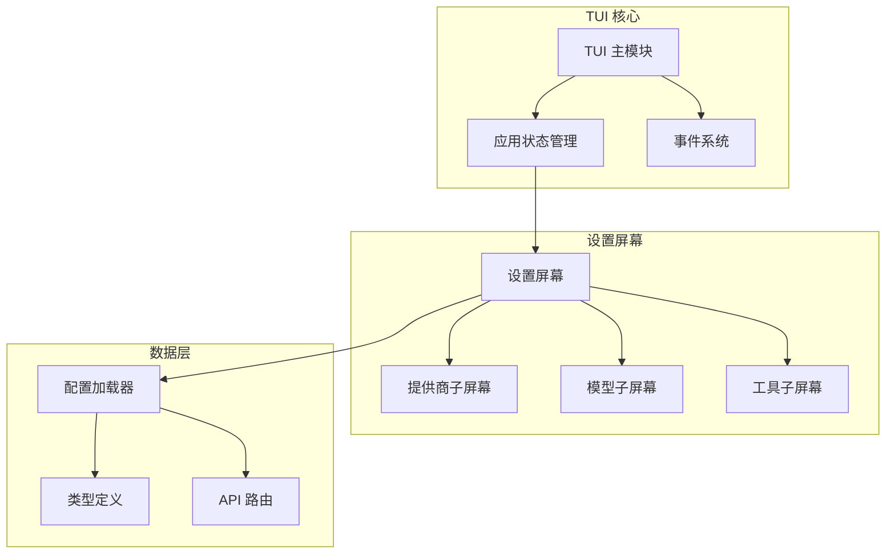
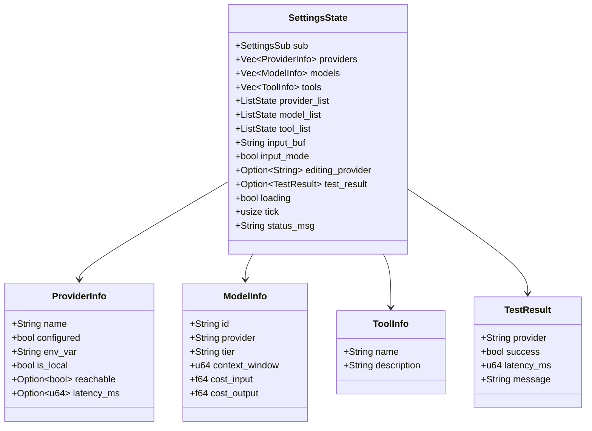
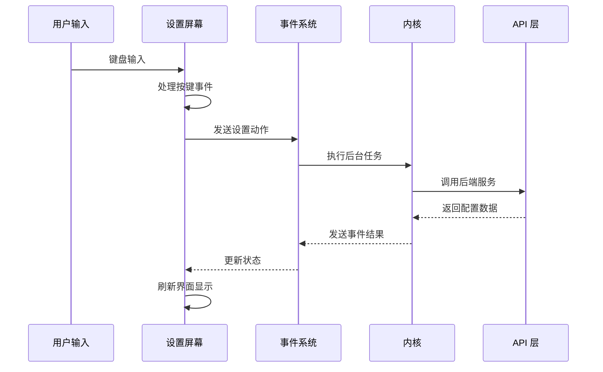
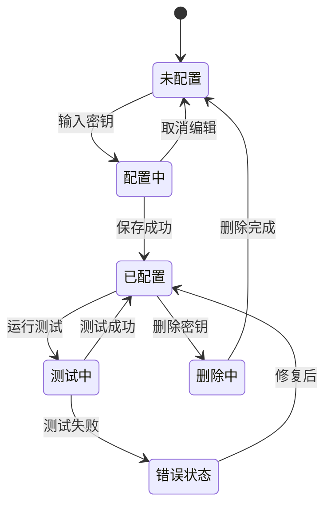
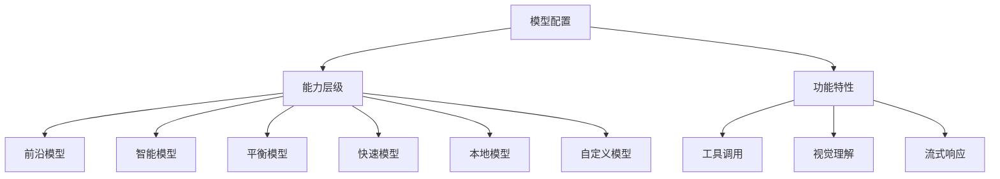
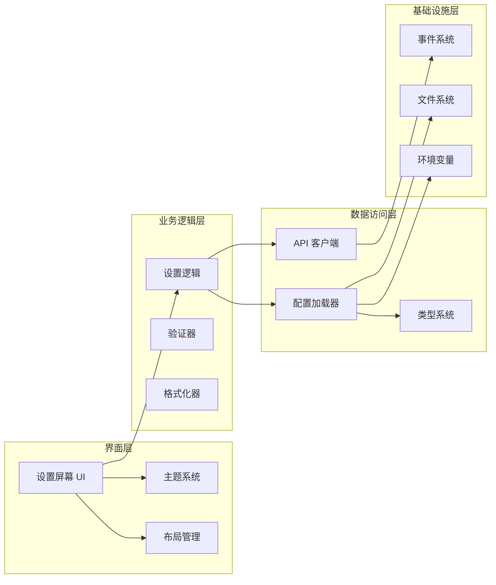

# 设置屏幕

<cite>
**本文档引用的文件**
- [settings.rs](file://crates/openfang-cli/src/tui/screens/settings.rs)
- [mod.rs](file://crates/openfang-cli/src/tui/mod.rs)
- [event.rs](file://crates/openfang-cli/src/tui/event.rs)
- [config.rs](file://crates/openfang-kernel/src/config.rs)
- [config.rs](file://crates/openfang-types/src/config.rs)
- [model_catalog.rs](file://crates/openfang-types/src/model_catalog.rs)
- [routes.rs](file://crates/openfang-api/src/routes.rs)
- [settings.js](file://crates/openfang-api/static/js/pages/settings.js)
- [openfang.toml.example](file://openfang.toml.example)
</cite>

## 目录
1. [简介](#简介)
2. [项目结构](#项目结构)
3. [核心组件](#核心组件)
4. [架构概览](#架构概览)
5. [详细组件分析](#详细组件分析)
6. [依赖关系分析](#依赖关系分析)
7. [性能考虑](#性能考虑)
8. [故障排除指南](#故障排除指南)
9. [结论](#结论)
10. [附录](#附录)

## 简介

OpenFang TUI 设置屏幕是用户与系统配置交互的核心界面，提供了对提供商密钥管理、模型目录浏览、工具列表查看以及全局设置配置的完整解决方案。该屏幕支持三种主要配置类别：提供商设置（API 密钥管理）、模型配置（模型目录和选择）和工具配置（可用工具和服务）。

设置屏幕采用分层架构设计，通过 TUI（文本用户界面）提供直观的键盘导航体验，支持快速的配置管理和实时验证反馈。界面设计遵循现代化的终端应用标准，提供清晰的状态指示、错误处理和用户反馈机制。

## 项目结构

OpenFang 设置屏幕位于命令行界面的模块化架构中，采用分层组织方式：

**图表来源**
- [mod.rs:138-180](file://crates/openfang-cli/src/tui/mod.rs#L138-L180)
- [settings.rs:59-74](file://crates/openfang-cli/src/tui/screens/settings.rs#L59-L74)

**章节来源**
- [mod.rs:138-180](file://crates/openfang-cli/src/tui/mod.rs#L138-L180)
- [settings.rs:1-623](file://crates/openfang-cli/src/tui/screens/settings.rs#L1-L623)

## 核心组件

设置屏幕由三个主要子组件构成，每个都针对特定的配置领域：

### 数据结构定义

设置屏幕使用精心设计的数据结构来表示配置信息：

**图表来源**
- [settings.rs:59-74](file://crates/openfang-cli/src/tui/screens/settings.rs#L59-L74)
- [settings.rs:13-48](file://crates/openfang-cli/src/tui/screens/settings.rs#L13-L48)

### 子屏幕分类

设置屏幕采用标签式导航，支持三种主要配置类别：

| 子屏幕 | 功能描述 | 快捷键 | 主要用途 |
|--------|----------|--------|----------|
| Providers | 提供商密钥管理 | 1 | 配置和测试 API 密钥 |
| Models | 模型目录浏览 | 2 | 查看和选择模型配置 |
| Tools | 工具列表查看 | 3 | 浏览可用工具和服务 |

**章节来源**
- [settings.rs:52-57](file://crates/openfang-cli/src/tui/screens/settings.rs#L52-L57)
- [settings.rs:325-342](file://crates/openfang-cli/src/tui/screens/settings.rs#L325-L342)

## 架构概览

设置屏幕采用事件驱动的架构模式，通过统一的事件系统协调各个组件之间的交互：

**图表来源**
- [event.rs:42-203](file://crates/openfang-cli/src/tui/event.rs#L42-L203)
- [settings.rs:110-143](file://crates/openfang-cli/src/tui/screens/settings.rs#L110-L143)

### 状态管理机制

设置屏幕实现了完整的状态管理模式，支持以下核心功能：

1. **动态数据加载**：支持按需加载提供商、模型和工具数据
2. **实时状态更新**：通过事件系统实现状态同步
3. **输入验证**：在用户输入过程中提供即时反馈
4. **错误处理**：优雅处理各种配置错误和网络问题

**章节来源**
- [settings.rs:86-108](file://crates/openfang-cli/src/tui/screens/settings.rs#L86-L108)
- [event.rs:140-151](file://crates/openfang-cli/src/tui/event.rs#L140-L151)

## 详细组件分析

### 提供商配置组件

提供商配置是设置屏幕的核心功能之一，负责管理各种外部服务的认证信息：

#### 提供商状态管理

**图表来源**
- [settings.rs:174-221](file://crates/openfang-cli/src/tui/screens/settings.rs#L174-L221)

#### 提供商类型识别

系统支持多种类型的提供商，每种都有特定的配置要求：

| 提供商类型 | 特征 | 配置要求 | 环境变量 |
|------------|------|----------|----------|
| 云端提供商 | 需要 API 密钥 | 必须配置密钥 | PROVIDER_API_KEY |
| 本地提供商 | 无需密钥 | 需要本地服务 | 无 |
| 自定义提供商 | 支持自定义 URL | 可配置基础 URL | 无 |

**章节来源**
- [settings.rs:174-221](file://crates/openfang-cli/src/tui/screens/settings.rs#L174-L221)
- [model_catalog.rs:169-200](file://crates/openfang-types/src/model_catalog.rs#L169-L200)

### 模型配置组件

模型配置组件提供了对可用模型的完整管理功能：

#### 模型分类体系

**图表来源**
- [model_catalog.rs:65-95](file://crates/openfang-types/src/model_catalog.rs#L65-L95)
- [model_catalog.rs:120-148](file://crates/openfang-types/src/model_catalog.rs#L120-L148)

#### 模型信息展示

模型配置界面提供详细的模型信息展示，包括：
- 基本标识信息（ID、显示名称）
- 性能指标（上下文窗口、输出限制）
- 成本信息（输入/输出成本）
- 功能支持（工具调用、视觉理解、流式响应）

**章节来源**
- [settings.rs:481-555](file://crates/openfang-cli/src/tui/screens/settings.rs#L481-L555)
- [model_catalog.rs:120-148](file://crates/openfang-types/src/model_catalog.rs#L120-L148)

### 工具配置组件

工具配置组件管理所有可用的工具和服务，为用户提供扩展功能：

#### 工具分类

| 工具类别 | 描述 | 典型用途 |
|----------|------|----------|
| 搜索工具 | 网络搜索、内容检索 | 信息查询、知识获取 |
| 开发工具 | 代码分析、调试辅助 | 编程支持、代码审查 |
| 媒体工具 | 图像生成、音频处理 | 创意内容制作 |
| 集成工具 | 第三方服务连接 | 自动化工作流 |

**章节来源**
- [settings.rs:558-601](file://crates/openfang-cli/src/tui/screens/settings.rs#L558-L601)

## 依赖关系分析

设置屏幕的依赖关系体现了清晰的关注点分离和模块化设计：

**图表来源**
- [settings.rs:1-10](file://crates/openfang-cli/src/tui/screens/settings.rs#L1-L10)
- [event.rs:30-37](file://crates/openfang-cli/src/tui/event.rs#L30-L37)

### 关键依赖关系

1. **配置加载依赖**：设置屏幕依赖于内核配置加载器来获取系统配置信息
2. **类型系统依赖**：使用共享类型定义确保配置数据的一致性和完整性
3. **事件系统依赖**：通过统一事件系统实现异步数据加载和状态更新
4. **API 层依赖**：与后端 API 交互以获取实时配置数据

**章节来源**
- [config.rs:18-110](file://crates/openfang-kernel/src/config.rs#L18-L110)
- [config.rs:1-800](file://crates/openfang-types/src/config.rs#L1-L800)

## 性能考虑

设置屏幕在设计时充分考虑了性能优化，特别是在大数据集和频繁更新场景下的表现：

### 渲染优化策略

1. **增量渲染**：仅重新渲染发生变化的界面元素
2. **虚拟滚动**：对于大量数据项使用虚拟化技术
3. **防抖处理**：对频繁的用户输入进行防抖处理
4. **缓存机制**：缓存已加载的配置数据避免重复请求

### 内存管理

- **状态压缩**：最小化存储在内存中的配置数据量
- **懒加载**：延迟加载非当前活跃的数据
- **垃圾回收**：及时释放不再使用的资源

### 网络优化

- **批量请求**：合并多个小请求为批量操作
- **连接复用**：重用现有的网络连接
- **超时控制**：合理设置请求超时时间

## 故障排除指南

### 常见问题及解决方案

#### 配置加载失败

**症状**：设置屏幕无法加载配置数据
**可能原因**：
- 配置文件格式错误
- 权限不足访问配置文件
- 环境变量缺失

**解决步骤**：
1. 验证配置文件语法正确性
2. 检查文件权限设置
3. 确认必需的环境变量已设置

#### 提供商密钥验证失败

**症状**：保存的提供商密钥无法通过验证
**可能原因**：
- 密钥格式不正确
- 网络连接问题
- 服务端认证失败

**解决步骤**：
1. 重新输入并验证密钥格式
2. 检查网络连接状态
3. 查看服务端日志获取详细错误信息

#### 模型数据加载异常

**症状**：模型列表显示为空或加载缓慢
**可能原因**：
- 模型目录服务不可用
- 网络超时
- 缓存数据过期

**解决步骤**：
1. 检查模型目录服务状态
2. 增加网络超时设置
3. 清除并重建缓存数据

**章节来源**
- [settings.rs:473-493](file://crates/openfang-cli/src/tui/screens/settings.rs#L473-L493)
- [event.rs:98-100](file://crates/openfang-cli/src/tui/event.rs#L98-L100)

### 调试技巧

1. **启用详细日志**：增加日志级别以获取更多信息
2. **检查事件流**：监控事件系统的正常运行
3. **验证数据流**：确认数据在各层之间的正确传递
4. **性能分析**：使用性能分析工具识别瓶颈

## 结论

OpenFang TUI 设置屏幕提供了一个功能完整、用户体验优秀的配置管理界面。通过精心设计的架构和实现，它成功地将复杂的配置管理任务简化为直观的交互流程。

该屏幕的主要优势包括：
- **模块化设计**：清晰的职责分离便于维护和扩展
- **用户友好**：直观的界面设计和快捷键支持
- **实时反馈**：即时的状态更新和错误提示
- **性能优化**：高效的渲染和数据管理机制

未来可以考虑的功能增强包括：
- 更丰富的配置模板支持
- 批量配置导入导出功能
- 配置版本管理和回滚机制
- 更高级的搜索和过滤功能

## 附录

### 配置最佳实践

#### 提供商配置最佳实践

1. **密钥管理**
   - 使用环境变量存储敏感信息
   - 定期轮换 API 密钥
   - 为不同环境使用独立的密钥

2. **URL 配置**
   - 对于本地提供商使用正确的端口
   - 为自定义提供商设置合适的超时值
   - 验证 URL 格式的正确性

#### 模型配置最佳实践

1. **模型选择策略**
   - 根据任务复杂度选择合适的模型层级
   - 考虑成本和性能的平衡
   - 定期评估模型效果并进行调整

2. **成本控制**
   - 监控使用量和相关费用
   - 设置合理的使用限额
   - 利用缓存减少不必要的调用

#### 工具配置最佳实践

1. **工具选择原则**
   - 优先选择稳定可靠的工具
   - 考虑工具的兼容性和集成难度
   - 定期评估工具的有效性

2. **安全考虑**
   - 限制工具的权限范围
   - 定期更新工具版本
   - 监控工具的使用情况

### 参数调优建议

#### 性能调优参数

| 参数类别 | 关键参数 | 默认值 | 调优建议 |
|----------|----------|--------|----------|
| 网络设置 | 请求超时 | 30秒 | 根据网络状况调整 |
| 缓存设置 | 缓存大小 | 100MB | 根据内存容量调整 |
| 并发设置 | 最大连接数 | 10 | 根据服务器性能调整 |
| 日志设置 | 日志级别 | info | 生产环境建议 warn |

#### 用户体验调优参数

| 参数类别 | 关键参数 | 默认值 | 调优建议 |
|----------|----------|--------|----------|
| 界面设置 | 字体大小 | 12px | 根据显示器调整 |
| 动画设置 | 动画速度 | 20fps | 根据性能调整 |
| 提示设置 | 提示延迟 | 500ms | 根据用户习惯调整 |
| 响应设置 | 响应时间 | 33ms | 根据网络状况调整 |

### 配置文件参考

完整的配置文件示例可参考项目提供的示例文件，其中包含了各种配置选项的注释说明和使用示例。

**章节来源**
- [openfang.toml.example:1-49](file://openfang.toml.example#L1-L49)