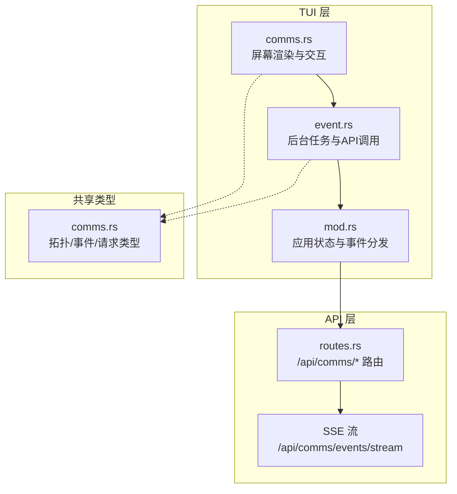
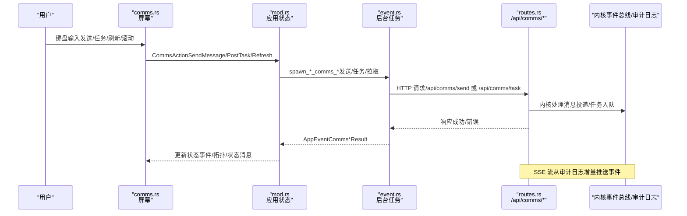
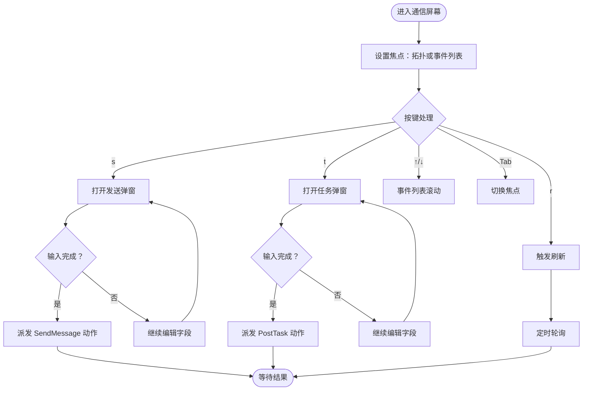
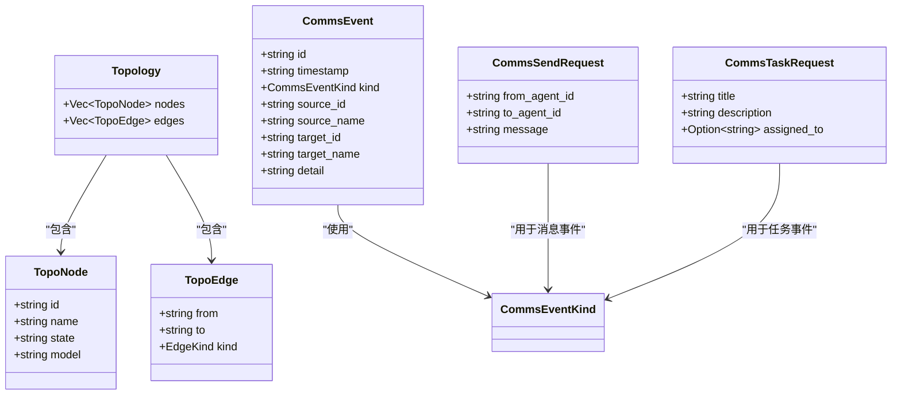
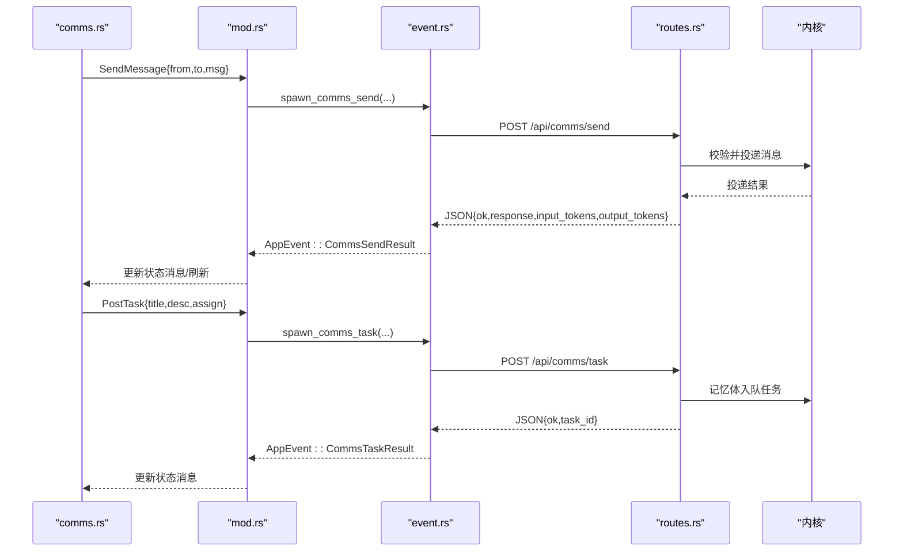
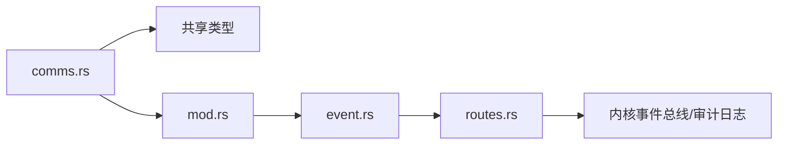

# 通信屏幕

<cite>
**本文档引用的文件**
- [crates/openfang-cli/src/tui/screens/comms.rs](file://crates/openfang-cli/src/tui/screens/comms.rs)
- [crates/openfang-types/src/comms.rs](file://crates/openfang-types/src/comms.rs)
- [crates/openfang-cli/src/tui/mod.rs](file://crates/openfang-cli/src/tui/mod.rs)
- [crates/openfang-cli/src/tui/event.rs](file://crates/openfang-cli/src/tui/event.rs)
- [crates/openfang-api/src/routes.rs](file://crates/openfang-api/src/routes.rs)
- [crates/openfang-api/static/js/pages/comms.js](file://crates/openfang-api/static/js/pages/comms.js)
</cite>

## 目录
1. [简介](#简介)
2. [项目结构](#项目结构)
3. [核心组件](#核心组件)
4. [架构总览](#架构总览)
5. [详细组件分析](#详细组件分析)
6. [依赖关系分析](#依赖关系分析)
7. [性能考虑](#性能考虑)
8. [故障排除指南](#故障排除指南)
9. [结论](#结论)
10. [附录](#附录)

## 简介
本文件为 OpenFang TUI 通信屏幕（Comms）的权威技术文档，面向开发者与运维人员，系统性阐述以下内容：
- 通信功能：事件查看、消息发送、任务发布、通信监控、网络状态显示
- 事件模型与消息格式：拓扑节点/边、通信事件、发送/任务请求载荷
- 发送机制与接收处理：REST API 调用、SSE 实时流、本地轮询回退
- 界面设计与交互：拓扑树、事件列表、发送/任务弹窗、焦点切换与滚动
- 操作流程：消息发送、任务发布、事件过滤与调试
- 配置指南、调试技巧与性能优化建议

## 项目结构
通信屏幕位于 TUI 子系统中，采用“屏幕模块 + 共享类型 + 事件调度 + API 后端”的分层组织方式：
- 屏幕模块：负责渲染与用户交互（键盘输入、模态框、布局）
- 共享类型：定义拓扑、事件、请求载荷的跨端数据结构
- 事件调度：封装后端访问、轮询与 SSE 流，桥接 UI 与 API
- API 后端：提供拓扑、事件、消息发送、任务发布的 REST 接口

图表来源
- [crates/openfang-cli/src/tui/screens/comms.rs](file://crates/openfang-cli/src/tui/screens/comms.rs)
- [crates/openfang-cli/src/tui/event.rs](file://crates/openfang-cli/src/tui/event.rs)
- [crates/openfang-types/src/comms.rs](file://crates/openfang-types/src/comms.rs)
- [crates/openfang-api/src/routes.rs](file://crates/openfang-api/src/routes.rs)

章节来源
- [crates/openfang-cli/src/tui/screens/comms.rs](file://crates/openfang-cli/src/tui/screens/comms.rs)
- [crates/openfang-types/src/comms.rs](file://crates/openfang-types/src/comms.rs)
- [crates/openfang-cli/src/tui/mod.rs](file://crates/openfang-cli/src/tui/mod.rs)
- [crates/openfang-cli/src/tui/event.rs](file://crates/openfang-cli/src/tui/event.rs)
- [crates/openfang-api/src/routes.rs](file://crates/openfang-api/src/routes.rs)

## 核心组件
- 通信屏幕状态与渲染
  - 状态结构：节点集合、边集合、事件列表、焦点、加载标志、定时器、模态框状态
  - 渲染布局：顶部标题、拓扑树区域、事件列表、提示行；支持发送/任务弹窗叠加
- 事件模型与消息格式
  - 拓扑节点/边：标识、名称、状态、模型、父子/对等关系
  - 通信事件：时间戳、事件类型、源/目标标识与名称、详情文本
  - 请求载荷：消息发送、任务发布
- 事件调度与刷新
  - 定时轮询：每约 5 秒自动刷新一次
  - SSE 实时流：监听审计日志增量，实时推送事件
  - 错误回退：SSE 失败时回退到轮询

章节来源
- [crates/openfang-cli/src/tui/screens/comms.rs](file://crates/openfang-cli/src/tui/screens/comms.rs)
- [crates/openfang-types/src/comms.rs](file://crates/openfang-types/src/comms.rs)
- [crates/openfang-api/static/js/pages/comms.js](file://crates/openfang-api/static/js/pages/comms.js)

## 架构总览
通信屏幕的端到端工作流如下：

图表来源
- [crates/openfang-cli/src/tui/screens/comms.rs](file://crates/openfang-cli/src/tui/screens/comms.rs)
- [crates/openfang-cli/src/tui/mod.rs](file://crates/openfang-cli/src/tui/mod.rs)
- [crates/openfang-cli/src/tui/event.rs](file://crates/openfang-cli/src/tui/event.rs)
- [crates/openfang-api/src/routes.rs](file://crates/openfang-api/src/routes.rs)

## 详细组件分析

### 通信屏幕状态与交互
- 焦点管理：拓扑树与事件列表之间通过 Tab 切换
- 模态框：发送消息与发布任务的表单式输入
- 滚动控制：事件列表上下键循环滚动
- 自动刷新：每 100 tick（约 5 秒）触发一次轮询

图表来源
- [crates/openfang-cli/src/tui/screens/comms.rs](file://crates/openfang-cli/src/tui/screens/comms.rs)

章节来源
- [crates/openfang-cli/src/tui/screens/comms.rs](file://crates/openfang-cli/src/tui/screens/comms.rs)

### 事件模型与消息格式
- 拓扑模型
  - 节点：包含 agent ID、名称、状态、模型
  - 边：父子关系（父spawn子）与对等关系（消息对等）
  - 拓扑：节点集 + 边集
- 通信事件
  - 事件种类：消息、spawn、terminate、任务发布/认领/完成
  - 事件字段：唯一 ID、ISO 时间戳、种类、源/目标标识与名称、详情
- 请求载荷
  - 发送消息：from_agent_id、to_agent_id、message
  - 发布任务：title、description、可选 assigned_to

图表来源
- [crates/openfang-types/src/comms.rs](file://crates/openfang-types/src/comms.rs)

章节来源
- [crates/openfang-types/src/comms.rs](file://crates/openfang-types/src/comms.rs)

### 发送机制与接收处理
- 发送消息
  - UI 触发：CommsAction::SendMessage
  - 后台任务：spawn_comms_send（HTTP POST /api/comms/send）
  - 服务端校验：源/目标存在性、消息长度限制
  - 返回：成功时返回响应与用量统计，失败返回错误信息
- 发布任务
  - UI 触发：CommsAction::PostTask
  - 后台任务：spawn_comms_task（HTTP POST /api/comms/task）
  - 服务端校验：标题必填，可选分配给某 agent
  - 返回：成功返回任务 ID，失败返回错误
- 事件获取
  - 轮询：/api/comms/events?limit=N
  - SSE：/api/comms/events/stream，按审计日志增量推送
  - 拓扑更新：spawn/terminate 事件触发拓扑刷新

图表来源
- [crates/openfang-cli/src/tui/mod.rs](file://crates/openfang-cli/src/tui/mod.rs)
- [crates/openfang-cli/src/tui/event.rs](file://crates/openfang-cli/src/tui/event.rs)
- [crates/openfang-api/src/routes.rs](file://crates/openfang-api/src/routes.rs)

章节来源
- [crates/openfang-cli/src/tui/mod.rs](file://crates/openfang-cli/src/tui/mod.rs)
- [crates/openfang-cli/src/tui/event.rs](file://crates/openfang-cli/src/tui/event.rs)
- [crates/openfang-api/src/routes.rs](file://crates/openfang-api/src/routes.rs)

### 界面设计与交互元素
- 布局分区
  - 标题区：显示“Agent Topology”及节点/边数量
  - 分隔线：视觉分隔
  - 拓扑树：根节点（无父节点）+ 子节点层级展示，标注状态与模型；对等关系以箭头标注
  - 事件列表：按时间倒序展示，含时间、类型、源/目标、摘要
  - 提示行：快捷键提示与状态消息
- 模态框
  - 发送消息：From/To/Message 三段式输入，Tab 切换字段，Enter 发送，Esc 取消
  - 发布任务：Title/Description/Assign 三段式输入，Tab 切换字段，Enter 发布，Esc 取消
- 状态与样式
  - 状态颜色：Running/Green、Suspended/Yellow、Terminated/Crashed/Red
  - 事件类型颜色：消息/Spawn/Terminate/任务等
  - 选择高亮：事件列表当前项高亮符号

章节来源
- [crates/openfang-cli/src/tui/screens/comms.rs](file://crates/openfang-cli/src/tui/screens/comms.rs)

### 事件查看与过滤
- 事件来源
  - 主要：内核事件总线历史（含完整源/目标上下文）
  - 次要：审计日志（始终记录，覆盖更广）
- 过滤与去重
  - 仅保留消息、spawn、terminate 等与通信相关事件
  - 使用事件 ID 去重，避免重复
- 实时性
  - SSE 每 500ms 轮询审计日志增量
  - spawn/terminate 事件会触发拓扑刷新

章节来源
- [crates/openfang-api/src/routes.rs](file://crates/openfang-api/src/routes.rs)
- [crates/openfang-api/static/js/pages/comms.js](file://crates/openfang-api/static/js/pages/comms.js)

## 依赖关系分析
- 组件耦合
  - comms.rs 依赖共享类型（拓扑/事件/请求）
  - event.rs 将 UI 动作解耦为后台任务，避免阻塞 UI
  - mod.rs 作为中枢，将 AppEvent 转换为 UI 状态更新
- 外部依赖
  - API 服务提供 REST 与 SSE
  - 内核事件总线与审计日志作为事件数据源
- 潜在环路
  - 无直接循环依赖；事件流经后台任务与 AppEvent，最终回到 UI

图表来源
- [crates/openfang-cli/src/tui/screens/comms.rs](file://crates/openfang-cli/src/tui/screens/comms.rs)
- [crates/openfang-cli/src/tui/mod.rs](file://crates/openfang-cli/src/tui/mod.rs)
- [crates/openfang-cli/src/tui/event.rs](file://crates/openfang-cli/src/tui/event.rs)
- [crates/openfang-api/src/routes.rs](file://crates/openfang-api/src/routes.rs)

章节来源
- [crates/openfang-cli/src/tui/mod.rs](file://crates/openfang-cli/src/tui/mod.rs)
- [crates/openfang-cli/src/tui/event.rs](file://crates/openfang-cli/src/tui/event.rs)
- [crates/openfang-api/src/routes.rs](file://crates/openfang-api/src/routes.rs)

## 性能考虑
- 轮询频率
  - 通信屏幕每 100 tick（约 5 秒）自动刷新，平衡实时性与资源消耗
- 事件截断
  - 事件详情与时间戳截断，避免超长文本影响渲染性能
- SSE 回退
  - SSE 连接异常时自动回退轮询，保证可用性
- 服务端限流与大小限制
  - 消息长度上限、审计日志增量轮询间隔，降低服务端压力

章节来源
- [crates/openfang-cli/src/tui/screens/comms.rs](file://crates/openfang-cli/src/tui/screens/comms.rs)
- [crates/openfang-api/src/routes.rs](file://crates/openfang-api/src/routes.rs)

## 故障排除指南
- 发送消息失败
  - 检查源/目标 agent ID 是否有效
  - 确认消息长度未超过限制
  - 查看返回的错误信息（如“Send failed”或具体原因）
- 发布任务失败
  - 确保标题非空
  - 检查分配目标是否存在
- 事件不更新
  - 确认 SSE 连接正常；若断开，系统会自动回退轮询
  - 检查审计日志是否正常写入
- 拓扑不正确
  - spawn/terminate 事件会触发拓扑刷新；确认相关事件已产生

章节来源
- [crates/openfang-cli/src/tui/event.rs](file://crates/openfang-cli/src/tui/event.rs)
- [crates/openfang-api/src/routes.rs](file://crates/openfang-api/src/routes.rs)

## 结论
通信屏幕通过清晰的状态机、稳定的后台任务与可靠的 SSE/轮询机制，提供了实时可观测的代理通信视图。其事件模型与消息格式统一于共享类型，确保前后端一致性；界面交互简洁直观，便于日常运维与调试。

## 附录

### 快捷键一览
- s：打开发送消息弹窗
- t：打开发布任务弹窗
- r：手动刷新
- Tab / Shift+Tab：在拓扑与事件列表间切换焦点
- ↑ / ↓ 或 k/j：在事件列表中滚动

章节来源
- [crates/openfang-cli/src/tui/screens/comms.rs](file://crates/openfang-cli/src/tui/screens/comms.rs)