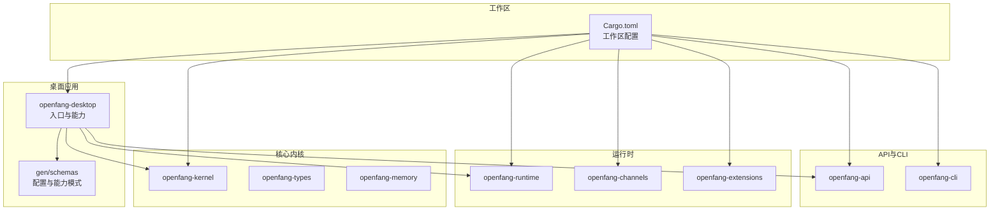
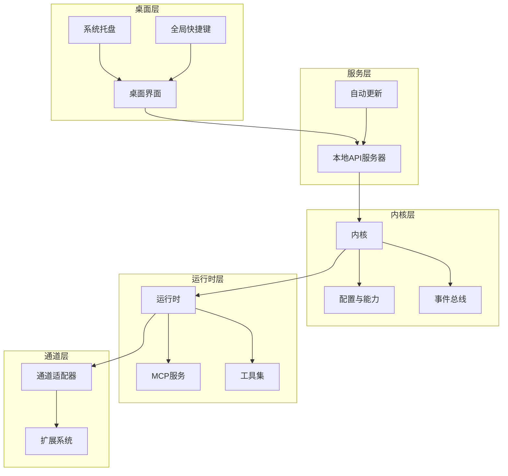
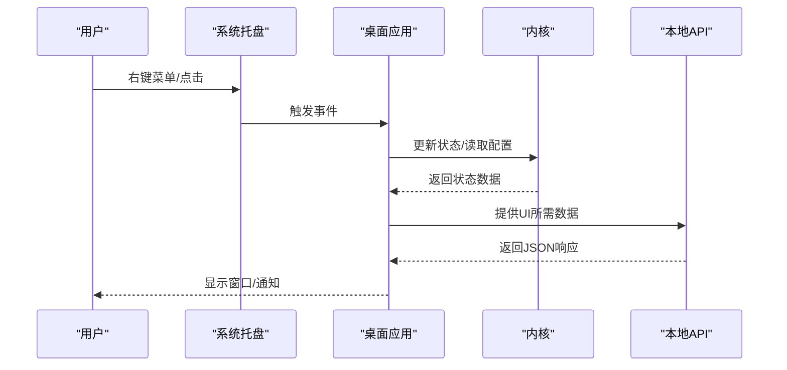
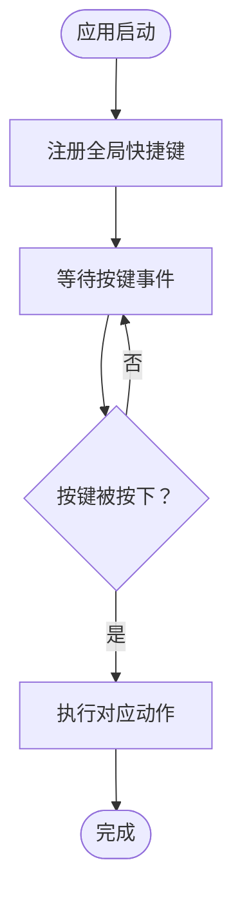
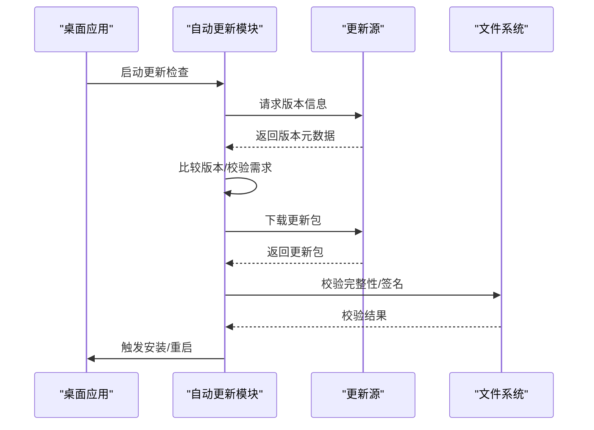
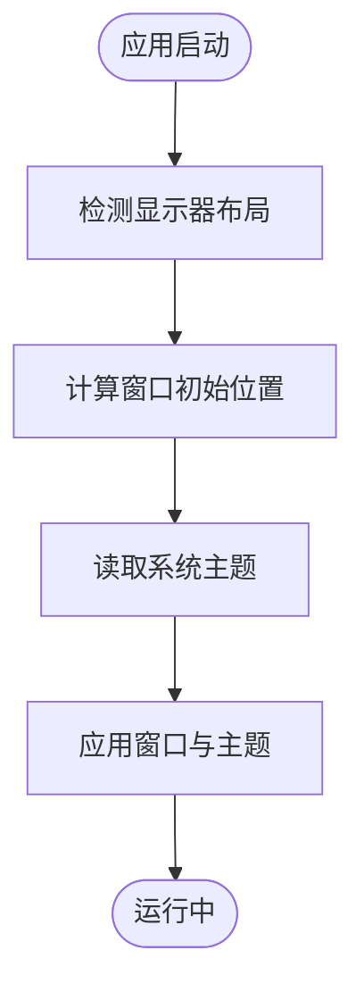
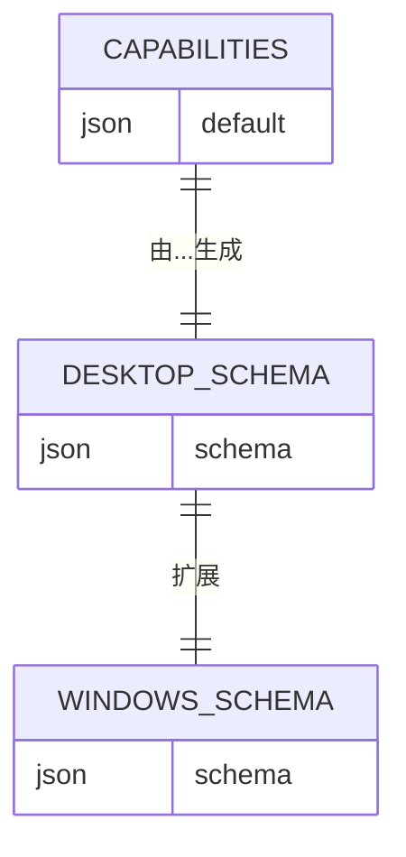
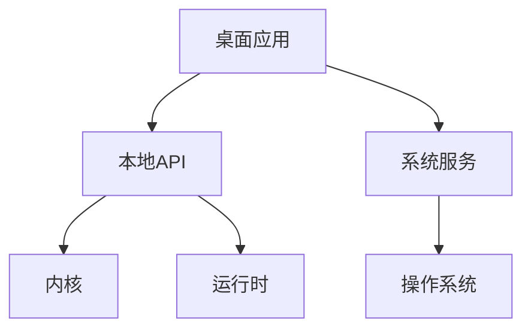
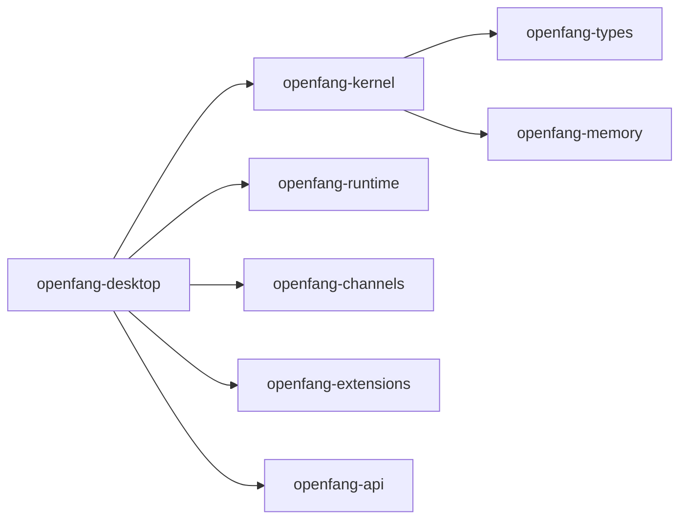

# 桌面应用

<cite>
**本文引用的文件**
- [Cargo.toml](file://Cargo.toml)
- [README.md](file://README.md)
- [docs/architecture.md](file://docs/architecture.md)
- [docs/configuration.md](file://docs/configuration.md)
- [docs/security.md](file://docs/security.md)
- [docs/troubleshooting.md](file://docs/troubleshooting.md)
- [crates/openfang-desktop/Cargo.toml](file://crates/openfang-desktop/Cargo.toml)
- [crates/openfang-desktop/src/main.rs](file://crates/openfang-desktop/src/main.rs)
- [crates/openfang-desktop/src/lib.rs](file://crates/openfang-desktop/src/lib.rs)
- [crates/openfang-desktop/src/commands.rs](file://crates/openfang-desktop/src/commands.rs)
- [crates/openfang-desktop/src/server.rs](file://crates/openfang-desktop/src/server.rs)
- [crates/openfang-desktop/src/shortcuts.rs](file://crates/openfang-desktop/src/shortcuts.rs)
- [crates/openfang-desktop/src/updater.rs](file://crates/openfang-desktop/src/updater.rs)
- [crates/openfang-desktop/gen/schemas/desktop-schema.json](file://crates/openfang-desktop/gen/schemas/desktop-schema.json)
- [crates/openfang-desktop/gen/schemas/windows-schema.json](file://crates/openfang-desktop/gen/schemas/windows-schema.json)
- [crates/openfang-desktop/capabilities/default.json](file://crates/openfang-desktop/capabilities/default.json)
- [crates/openfang-api/src/lib.rs](file://crates/openfang-api/src/lib.rs)
- [crates/openfang-api/src/server.rs](file://crates/openfang-api/src/server.rs)
- [crates/openfang-api/src/routes.rs](file://crates/openfang-api/src/routes.rs)
- [crates/openfang-kernel/src/lib.rs](file://crates/openfang-kernel/src/lib.rs)
- [crates/openfang-kernel/src/kernel.rs](file://crates/openfang-kernel/src/kernel.rs)
- [crates/openfang-kernel/src/config.rs](file://crates/openfang-kernel/src/config.rs)
- [crates/openfang-kernel/src/event_bus.rs](file://crates/openfang-kernel/src/event_bus.rs)
- [crates/openfang-runtime/src/lib.rs](file://crates/openfang-runtime/src/lib.rs)
- [crates/openfang-runtime/src/browser.rs](file://crates/openfang-runtime/src/browser.rs)
- [crates/openfang-runtime/src/web_search.rs](file://crates/openfang-runtime/src/web_search.rs)
- [crates/openfang-runtime/src/tool_runner.rs](file://crates/openfang-runtime/src/tool_runner.rs)
- [crates/openfang-runtime/src/mcp.rs](file://crates/openfang-runtime/src/mcp.rs)
- [crates/openfang-runtime/src/mcp_server.rs](file://crates/openfang-runtime/src/mcp_server.rs)
- [crates/openfang-channels/src/lib.rs](file://crates/openfang-channels/src/lib.rs)
- [crates/openfang-channels/src/router.rs](file://crates/openfang-channels/src/router.rs)
- [crates/openfang-channels/src/types.rs](file://crates/openfang-channels/src/types.rs)
- [crates/openfang-extensions/src/lib.rs](file://crates/openfang-extensions/src/lib.rs)
- [crates/openfang-extensions/src/registry.rs](file://crates/openfang-extensions/src/registry.rs)
- [crates/openfang-extensions/src/oauth.rs](file://crates/openfang-extensions/src/oauth.rs)
- [crates/openfang-extensions/src/vault.rs](file://crates/openfang-extensions/src/vault.rs)
- [crates/openfang-memory/src/lib.rs](file://crates/openfang-memory/src/lib.rs)
- [crates/openfang-memory/src/session.rs](file://crates/openfang-memory/src/session.rs)
- [crates/openfang-memory/src/knowledge.rs](file://crates/openfang-memory/src/knowledge.rs)
- [crates/openfang-types/src/lib.rs](file://crates/openfang-types/src/lib.rs)
- [crates/openfang-types/src/config.rs](file://crates/openfang-types/src/config.rs)
- [crates/openfang-types/src/message.rs](file://crates/openfang-types/src/message.rs)
- [crates/openfang-types/src/comms.rs](file://crates/openfang-types/src/comms.rs)
- [crates/openfang-cli/src/main.rs](file://crates/openfang-cli/src/main.rs)
- [crates/openfang-cli/src/tui/screens/settings.rs](file://crates/openfang-cli/src/tui/screens/settings.rs)
- [scripts/install.sh](file://scripts/install.sh)
- [scripts/install.ps1](file://scripts/install.ps1)
- [deploy/openfang.service](file://deploy/openfang.service)
</cite>

## 目录
1. [简介](#简介)
2. [项目结构](#项目结构)
3. [核心组件](#核心组件)
4. [架构总览](#架构总览)
5. [详细组件分析](#详细组件分析)
6. [依赖关系分析](#依赖关系分析)
7. [性能考量](#性能考量)
8. [故障排除指南](#故障排除指南)
9. [结论](#结论)
10. [附录](#附录)

## 简介
本文件面向 OpenFang 桌面应用的使用者与维护者，系统化阐述桌面应用的架构设计、功能特性与用户体验。重点覆盖系统托盘集成、通知系统、全局快捷键、自动更新机制；窗口管理、多显示器支持、深色模式切换；与系统服务的集成方式、权限管理与安全考虑；打包配置、平台兼容性（Windows、macOS、Linux）、安装与卸载流程；配置选项、自定义设置与主题选择；以及调试方法、性能监控、崩溃报告与故障排除。

## 项目结构
OpenFang 采用 Rust 工作区组织，桌面应用位于 crates/openfang-desktop，其余核心子系统包括内核、运行时、通道适配器、扩展、内存与类型等模块。工作区通过统一的 Cargo.toml 管理依赖与构建配置。

图表来源
- [Cargo.toml:1-161](file://Cargo.toml#L1-L161)
- [crates/openfang-desktop/Cargo.toml](file://crates/openfang-desktop/Cargo.toml)
- [crates/openfang-kernel/src/lib.rs](file://crates/openfang-kernel/src/lib.rs)
- [crates/openfang-runtime/src/lib.rs](file://crates/openfang-runtime/src/lib.rs)
- [crates/openfang-channels/src/lib.rs](file://crates/openfang-channels/src/lib.rs)
- [crates/openfang-extensions/src/lib.rs](file://crates/openfang-extensions/src/lib.rs)
- [crates/openfang-api/src/lib.rs](file://crates/openfang-api/src/lib.rs)
- [crates/openfang-cli/src/main.rs](file://crates/openfang-cli/src/main.rs)

章节来源
- [Cargo.toml:1-161](file://Cargo.toml#L1-L161)

## 核心组件
- 桌面应用入口与生命周期：负责初始化内核、启动本地 API 服务器、注册系统托盘与全局快捷键、触发自动更新检查与状态同步。
- 内核与事件总线：承载配置加载、能力声明、调度与事件分发，是桌面应用与运行时交互的核心枢纽。
- 运行时与工具链：提供浏览器、网络搜索、MCP 服务、工具执行等能力，支撑桌面界面与后台任务。
- 通道适配器：实现多平台即时通讯与消息网关的桥接，统一消息路由与格式化。
- 扩展系统：提供 OAuth、凭证存储、健康检查与安装器等扩展能力，增强桌面应用的生态集成。
- 配置与模式：通过 JSON Schema 定义桌面应用的能力与窗口配置，确保跨平台一致性。

章节来源
- [crates/openfang-desktop/src/main.rs](file://crates/openfang-desktop/src/main.rs)
- [crates/openfang-kernel/src/kernel.rs](file://crates/openfang-kernel/src/kernel.rs)
- [crates/openfang-kernel/src/config.rs](file://crates/openfang-kernel/src/config.rs)
- [crates/openfang-runtime/src/browser.rs](file://crates/openfang-runtime/src/browser.rs)
- [crates/openfang-runtime/src/web_search.rs](file://crates/openfang-runtime/src/web_search.rs)
- [crates/openfang-runtime/src/mcp.rs](file://crates/openfang-runtime/src/mcp.rs)
- [crates/openfang-channels/src/router.rs](file://crates/openfang-channels/src/router.rs)
- [crates/openfang-extensions/src/oauth.rs](file://crates/openfang-extensions/src/oauth.rs)
- [crates/openfang-desktop/gen/schemas/desktop-schema.json](file://crates/openfang-desktop/gen/schemas/desktop-schema.json)

## 架构总览
桌面应用以“内核-运行时-通道-扩展”分层架构为核心，通过本地 API 服务器向桌面界面提供数据与控制接口。系统托盘与全局快捷键作为用户入口，自动更新模块在后台完成版本检测与升级。配置模式与能力声明确保跨平台一致体验。

图表来源
- [crates/openfang-desktop/src/main.rs](file://crates/openfang-desktop/src/main.rs)
- [crates/openfang-desktop/src/server.rs](file://crates/openfang-desktop/src/server.rs)
- [crates/openfang-desktop/src/updater.rs](file://crates/openfang-desktop/src/updater.rs)
- [crates/openfang-kernel/src/kernel.rs](file://crates/openfang-kernel/src/kernel.rs)
- [crates/openfang-runtime/src/mcp_server.rs](file://crates/openfang-runtime/src/mcp_server.rs)
- [crates/openfang-channels/src/router.rs](file://crates/openfang-channels/src/router.rs)
- [crates/openfang-extensions/src/registry.rs](file://crates/openfang-extensions/src/registry.rs)

## 详细组件分析

### 系统托盘与通知
- 托盘集成：提供最小化到托盘、右键菜单、状态提示与点击恢复窗口的能力。
- 通知系统：基于系统原生通知接口，支持消息推送、错误提醒与更新提示。
- 多显示器支持：托盘图标位置与通知弹窗在多屏环境下保持一致性。
- 深色模式切换：随系统主题变化自动调整托盘图标与通知样式。

图表来源
- [crates/openfang-desktop/src/main.rs](file://crates/openfang-desktop/src/main.rs)
- [crates/openfang-kernel/src/kernel.rs](file://crates/openfang-kernel/src/kernel.rs)
- [crates/openfang-api/src/server.rs](file://crates/openfang-api/src/server.rs)

章节来源
- [crates/openfang-desktop/src/main.rs](file://crates/openfang-desktop/src/main.rs)
- [crates/openfang-kernel/src/config.rs](file://crates/openfang-kernel/src/config.rs)

### 全局快捷键
- 快捷键注册：在应用启动时注册全局快捷键，绑定到显示/隐藏界面或特定操作。
- 平台差异：Windows 使用 WinAPI，macOS 使用 Carbon/CoreGraphics，Linux 使用 X11/Wayland。
- 冲突处理：与系统快捷键冲突时进行提示与可选禁用。

图表来源
- [crates/openfang-desktop/src/shortcuts.rs](file://crates/openfang-desktop/src/shortcuts.rs)
- [crates/openfang-desktop/src/main.rs](file://crates/openfang-desktop/src/main.rs)

章节来源
- [crates/openfang-desktop/src/shortcuts.rs](file://crates/openfang-desktop/src/shortcuts.rs)

### 自动更新机制
- 版本检查：后台定期检查更新源，比较当前版本与最新版本。
- 下载与安装：下载新版本包，静默替换或提示重启安装。
- 回滚策略：失败时回退到上一个稳定版本。
- 安全校验：对更新包进行完整性校验与签名验证。

图表来源
- [crates/openfang-desktop/src/updater.rs](file://crates/openfang-desktop/src/updater.rs)

章节来源
- [crates/openfang-desktop/src/updater.rs](file://crates/openfang-desktop/src/updater.rs)

### 窗口管理与多显示器支持
- 窗口状态：支持最小化、最大化、全屏与自定义尺寸。
- 多显示器：根据主屏与活动显示器位置计算窗口初始位置，避免窗口移出可视区域。
- 深色模式：监听系统主题变化，动态切换界面主题与控件样式。

图表来源
- [crates/openfang-desktop/src/main.rs](file://crates/openfang-desktop/src/main.rs)
- [crates/openfang-desktop/gen/schemas/desktop-schema.json](file://crates/openfang-desktop/gen/schemas/desktop-schema.json)

章节来源
- [crates/openfang-desktop/gen/schemas/desktop-schema.json](file://crates/openfang-desktop/gen/schemas/desktop-schema.json)

### 能力与配置模式
- 能力声明：通过 JSON 文件声明桌面应用可用能力与权限范围。
- 配置模式：使用 JSON Schema 定义窗口、托盘、快捷键与更新等配置项，确保跨平台一致性。
- Windows 特定模式：针对 Windows 的窗口行为与权限进行补充约束。

图表来源
- [crates/openfang-desktop/capabilities/default.json](file://crates/openfang-desktop/capabilities/default.json)
- [crates/openfang-desktop/gen/schemas/desktop-schema.json](file://crates/openfang-desktop/gen/schemas/desktop-schema.json)
- [crates/openfang-desktop/gen/schemas/windows-schema.json](file://crates/openfang-desktop/gen/schemas/windows-schema.json)

章节来源
- [crates/openfang-desktop/capabilities/default.json](file://crates/openfang-desktop/capabilities/default.json)
- [crates/openfang-desktop/gen/schemas/desktop-schema.json](file://crates/openfang-desktop/gen/schemas/desktop-schema.json)
- [crates/openfang-desktop/gen/schemas/windows-schema.json](file://crates/openfang-desktop/gen/schemas/windows-schema.json)

### 与系统服务的集成
- 本地 API 服务：桌面应用启动本地 HTTP 服务器，提供 REST 接口供前端调用。
- 进程守护：通过 systemd 服务文件在 Linux 上实现开机自启与崩溃重启。
- 权限管理：按需申请文件访问、网络与系统通知权限；在 macOS/Linux 上遵循沙箱与权限模型。
- 安全考虑：HTTPS/TLS、请求限流、会话认证与输入验证，防止越权与注入攻击。

图表来源
- [crates/openfang-desktop/src/server.rs](file://crates/openfang-desktop/src/server.rs)
- [crates/openfang-api/src/server.rs](file://crates/openfang-api/src/server.rs)
- [crates/openfang-kernel/src/kernel.rs](file://crates/openfang-kernel/src/kernel.rs)
- [deploy/openfang.service](file://deploy/openfang.service)

章节来源
- [crates/openfang-desktop/src/server.rs](file://crates/openfang-desktop/src/server.rs)
- [crates/openfang-api/src/server.rs](file://crates/openfang-api/src/server.rs)
- [crates/openfang-kernel/src/kernel.rs](file://crates/openfang-kernel/src/kernel.rs)
- [deploy/openfang.service](file://deploy/openfang.service)

### 配置选项、自定义设置与主题
- 配置项：窗口尺寸、位置、透明度、动画、深色模式开关、托盘行为、快捷键组合等。
- 自定义设置：允许用户修改默认模型、代理设置、日志级别与输出路径。
- 主题选择：内置浅色/深色主题，支持自定义颜色方案与字体大小。

章节来源
- [crates/openfang-desktop/gen/schemas/desktop-schema.json](file://crates/openfang-desktop/gen/schemas/desktop-schema.json)
- [crates/openfang-kernel/src/config.rs](file://crates/openfang-kernel/src/config.rs)
- [crates/openfang-cli/src/tui/screens/settings.rs](file://crates/openfang-cli/src/tui/screens/settings.rs)

### 打包配置、平台兼容性与安装卸载
- 平台兼容：Windows（MSI/EXE）、macOS（DMG/APP）、Linux（deb/rpm/AppImage）。
- 打包工具：使用 Tauri 或类似框架进行打包，生成安装包与更新元数据。
- 安装流程：写入系统启动项、注册协议与快捷方式、创建用户数据目录。
- 卸载流程：删除应用文件、清理配置与缓存、移除启动项与协议注册。

章节来源
- [crates/openfang-desktop/Cargo.toml](file://crates/openfang-desktop/Cargo.toml)
- [scripts/install.sh](file://scripts/install.sh)
- [scripts/install.ps1](file://scripts/install.ps1)

## 依赖关系分析
桌面应用与内核、运行时、通道与扩展之间存在清晰的依赖边界，通过 API 与事件总线进行解耦。

图表来源
- [Cargo.toml:1-161](file://Cargo.toml#L1-L161)
- [crates/openfang-desktop/Cargo.toml](file://crates/openfang-desktop/Cargo.toml)
- [crates/openfang-kernel/src/lib.rs](file://crates/openfang-kernel/src/lib.rs)
- [crates/openfang-runtime/src/lib.rs](file://crates/openfang-runtime/src/lib.rs)
- [crates/openfang-channels/src/lib.rs](file://crates/openfang-channels/src/lib.rs)
- [crates/openfang-extensions/src/lib.rs](file://crates/openfang-extensions/src/lib.rs)
- [crates/openfang-api/src/lib.rs](file://crates/openfang-api/src/lib.rs)

章节来源
- [Cargo.toml:1-161](file://Cargo.toml#L1-L161)

## 性能考量
- 启动时间：延迟加载非必要模块，预热关键路径；减少首次启动 IO 开销。
- 内存占用：限制缓存大小、周期性清理临时文件；避免内存泄漏。
- 网络与 I/O：合并请求、启用压缩与连接复用；异步处理长耗时任务。
- UI 响应：将重任务放入后台线程，避免阻塞主线程。
- 日志与监控：分级日志、采样上报与崩溃快照，便于定位问题。

## 故障排除指南
- 无法启动或白屏：检查本地 API 是否正常监听端口；查看日志文件定位错误。
- 托盘无响应：确认权限与系统托盘服务状态；尝试重启系统托盘。
- 快捷键无效：检查与系统/其他应用冲突；重新注册快捷键。
- 更新失败：检查网络连通性与签名校验；清理更新缓存后重试。
- 权限不足：在系统设置中授予所需权限；在 Linux 上检查桌面环境权限。
- 崩溃报告：收集崩溃堆栈与最近日志，附带系统版本与安装方式反馈。

章节来源
- [docs/troubleshooting.md](file://docs/troubleshooting.md)
- [crates/openfang-desktop/src/updater.rs](file://crates/openfang-desktop/src/updater.rs)
- [crates/openfang-desktop/src/shortcuts.rs](file://crates/openfang-desktop/src/shortcuts.rs)

## 结论
OpenFang 桌面应用以清晰的分层架构与严格的配置模式为基础，结合系统托盘、全局快捷键与自动更新机制，提供一致且可靠的用户体验。通过内核-运行时-通道-扩展的协同，桌面应用能够灵活集成多种系统服务与第三方能力，并在多平台下保持良好的兼容性与安全性。

## 附录
- 安全最佳实践：启用 HTTPS、最小权限原则、输入验证与输出编码、定期审计依赖。
- 文档参考：架构设计、配置说明、安全策略与故障排除手册。

章节来源
- [docs/architecture.md](file://docs/architecture.md)
- [docs/configuration.md](file://docs/configuration.md)
- [docs/security.md](file://docs/security.md)
- [docs/troubleshooting.md](file://docs/troubleshooting.md)