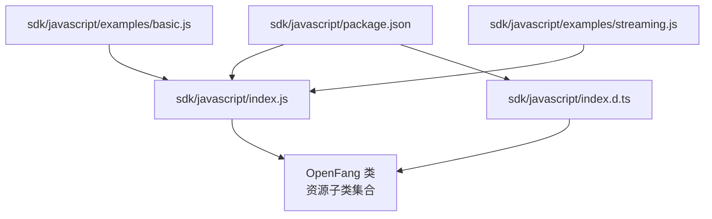
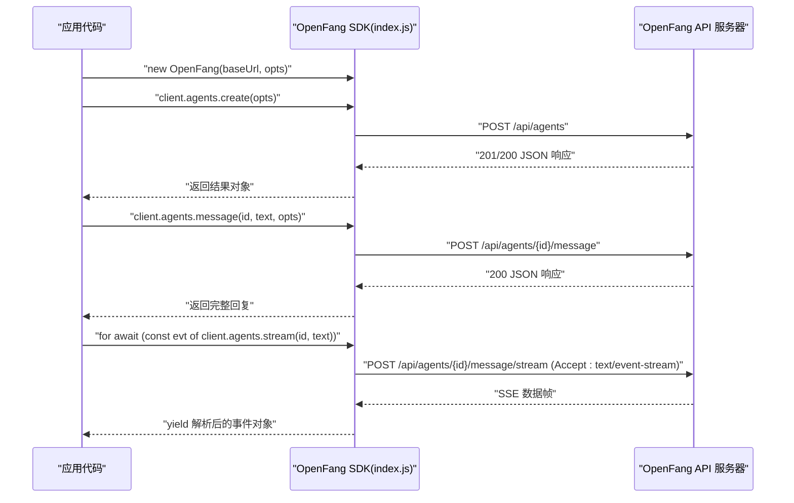
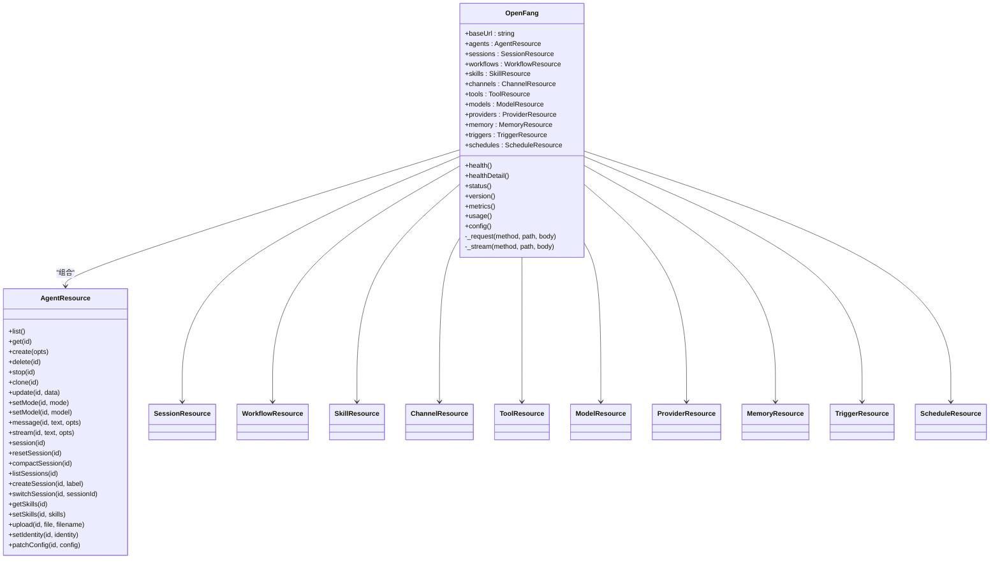
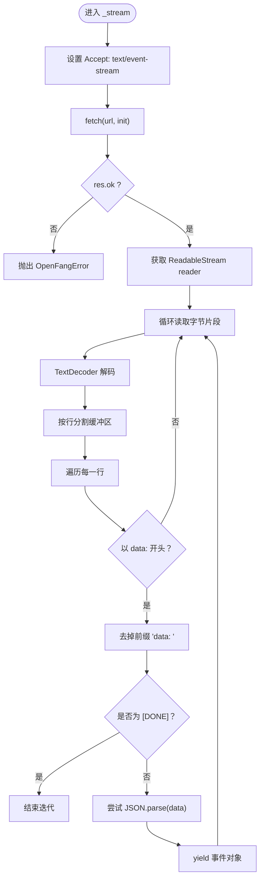
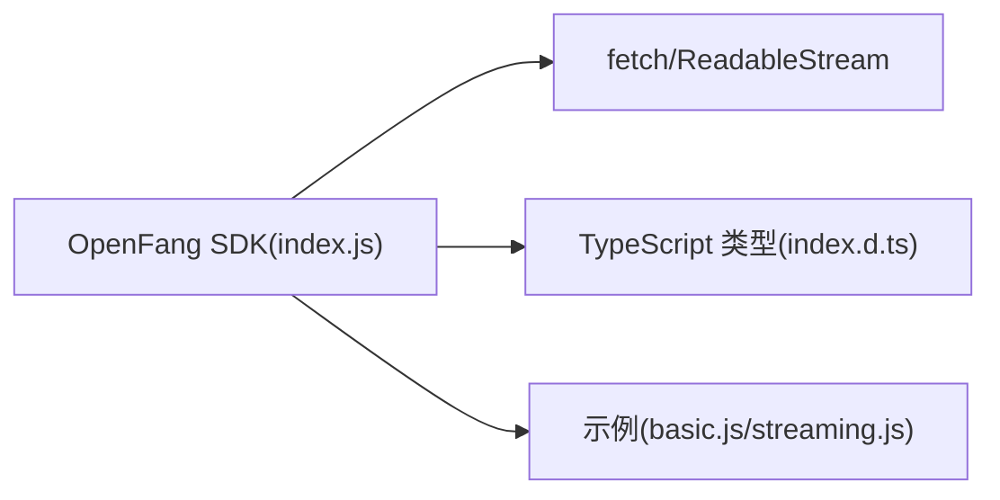

# JavaScript SDK

<cite>
**本文引用的文件**
- [package.json](file://sdk/javascript/package.json)
- [index.js](file://sdk/javascript/index.js)
- [index.d.ts](file://sdk/javascript/index.d.ts)
- [basic.js](file://sdk/javascript/examples/basic.js)
- [streaming.js](file://sdk/javascript/examples/streaming.js)
- [README.md](file://README.md)
- [getting-started.md](file://docs/getting-started.md)
- [api-reference.md](file://docs/api-reference.md)
- [troubleshooting.md](file://docs/troubleshooting.md)
</cite>

## 目录
1. [简介](#简介)
2. [项目结构](#项目结构)
3. [核心组件](#核心组件)
4. [架构总览](#架构总览)
5. [详细组件分析](#详细组件分析)
6. [依赖关系分析](#依赖关系分析)
7. [性能与最佳实践](#性能与最佳实践)
8. [故障排查指南](#故障排查指南)
9. [结论](#结论)
10. [附录](#附录)

## 简介
本文件为 OpenFang JavaScript SDK 的完整使用文档，面向希望在 Node.js 或浏览器环境中通过 REST API 与 OpenFang Agent OS 进行交互的开发者。内容涵盖：
- 安装与环境要求（Node.js 版本、浏览器兼容性）
- 客户端初始化与认证配置
- 基础 API 调用方法与资源分组
- 核心功能：智能体管理、消息发送、流式响应处理、错误处理
- TypeScript 类型定义与接口规范
- 实战示例路径与最佳实践
- 调试工具与常见问题解决

## 项目结构
SDK 模块位于仓库的 sdk/javascript 目录，核心文件如下：
- package.json：包元数据、Node.js 引擎要求、导出入口与类型声明
- index.js：SDK 主实现，包含 OpenFang 类、各资源子类、底层请求与 SSE 流封装
- index.d.ts：TypeScript 类型声明，定义 OpenFang、各资源类与接口
- examples/basic.js：基础示例（健康检查、列出智能体、创建智能体、消息对话、删除智能体）
- examples/streaming.js：流式响应示例（逐字节事件消费）

图表来源
- [package.json:1-18](file://sdk/javascript/package.json#L1-L18)
- [index.js:29-48](file://sdk/javascript/index.js#L29-L48)
- [index.d.ts:26-49](file://sdk/javascript/index.d.ts#L26-L49)

章节来源
- [package.json:1-18](file://sdk/javascript/package.json#L1-L18)
- [index.js:1-141](file://sdk/javascript/index.js#L1-L141)
- [index.d.ts:1-141](file://sdk/javascript/index.d.ts#L1-L141)

## 核心组件
- OpenFang 类：SDK 入口，负责构造基础 URL、统一请求头、封装通用 HTTP 请求与 SSE 流式读取，并提供系统级健康检查等便捷方法。
- 资源子类：按领域划分的资源集合，如 AgentResource、SessionResource、WorkflowResource、SkillResource、ChannelResource、ToolResource、ModelResource、ProviderResource、MemoryResource、TriggerResource、ScheduleResource。每个资源类持有对父级 OpenFang 实例的引用，内部通过 _request/_stream 方法访问后端 API。
- 错误类型：OpenFangError，继承自原生 Error，携带状态码与响应体文本，便于上层捕获与诊断。

章节来源
- [index.js:29-48](file://sdk/javascript/index.js#L29-L48)
- [index.js:145-271](file://sdk/javascript/index.js#L145-L271)
- [index.js:20-27](file://sdk/javascript/index.js#L20-L27)
- [index.d.ts:26-49](file://sdk/javascript/index.d.ts#L26-L49)

## 架构总览
SDK 通过 fetch 发起 HTTP 请求，支持 JSON 响应与纯文本响应；对于 SSE 流，SDK 自行解析 text/event-stream 数据帧，将每条 data 行反序列化为 JSON 并产出异步迭代器。OpenFang 后端提供 REST API、WebSocket 与 SSE 端点，SDK 专注于 REST 与 SSE 的封装。

图表来源
- [index.js:52-68](file://sdk/javascript/index.js#L52-L68)
- [index.js:70-105](file://sdk/javascript/index.js#L70-L105)
- [index.js:196-210](file://sdk/javascript/index.js#L196-L210)

章节来源
- [index.js:52-105](file://sdk/javascript/index.js#L52-L105)

## 详细组件分析

### OpenFang 类与资源子类
- OpenFang 类
  - 构造函数接收 baseUrl 与可选 opts（如 headers），去除尾部斜杠，合并默认 Content-Type 头，初始化各资源子类实例。
  - 提供 _request 与 _stream 两个底层方法，分别用于常规 JSON 文本请求与 SSE 流式读取。
  - 提供 health、healthDetail、status、version、metrics、usage、config 等系统级查询方法。
- 资源子类
  - AgentResource：智能体生命周期管理、会话管理、技能管理、身份与配置更新、文件上传等。
  - SessionResource：会话列表、删除、标签设置。
  - WorkflowResource：工作流列表、创建、运行、历史查询。
  - SkillResource：技能列表、安装、卸载、市场搜索。
  - ChannelResource：通道列表、配置、移除、测试。
  - ToolResource：工具清单。
  - ModelResource：模型目录、详情、别名。
  - ProviderResource：提供商列表、密钥设置/删除、测试。
  - MemoryResource：键值读写。
  - TriggerResource：触发器列表、创建、更新、删除。
  - ScheduleResource：计划任务列表、创建、更新、删除、手动执行。

图表来源
- [index.js:29-48](file://sdk/javascript/index.js#L29-L48)
- [index.js:145-271](file://sdk/javascript/index.js#L145-L271)
- [index.js:275-289](file://sdk/javascript/index.js#L275-L289)
- [index.js:293-311](file://sdk/javascript/index.js#L293-L311)
- [index.js:315-333](file://sdk/javascript/index.js#L315-L333)
- [index.js:337-355](file://sdk/javascript/index.js#L337-L355)
- [index.js:359-365](file://sdk/javascript/index.js#L359-L365)
- [index.js:369-383](file://sdk/javascript/index.js#L369-L383)
- [index.js:387-405](file://sdk/javascript/index.js#L387-L405)
- [index.js:409-427](file://sdk/javascript/index.js#L409-L427)
- [index.js:431-449](file://sdk/javascript/index.js#L431-L449)
- [index.js:453-475](file://sdk/javascript/index.js#L453-L475)

章节来源
- [index.js:29-48](file://sdk/javascript/index.js#L29-L48)
- [index.js:145-271](file://sdk/javascript/index.js#L145-L271)

### 流式响应处理（SSE）
- SDK 使用 fetch 打开 SSE 流，设置 Accept: text/event-stream，读取响应体的 ReadableStream，按行解析 data: 开头的数据帧，遇到 [DONE] 结束。
- 事件对象可能为 JSON 对象或原始字符串包装对象，SDK 统一产出异步迭代器，便于 for-await-of 遍历。
- 该能力对应后端 /api/agents/{id}/message/stream 端点。

图表来源
- [index.js:70-105](file://sdk/javascript/index.js#L70-L105)

章节来源
- [index.js:70-105](file://sdk/javascript/index.js#L70-L105)

### 错误处理机制
- OpenFangError：继承自 Error，包含 status 与 body 字段，便于上层区分错误类型与内容。
- _request 在非 2xx 响应时读取响应体文本并抛出 OpenFangError。
- _stream 在非 2xx 响应时同样抛出 OpenFangError。
- 建议在业务层捕获 OpenFangError 并根据 status 与 body 进行重试、降级或提示。

章节来源
- [index.js:20-27](file://sdk/javascript/index.js#L20-L27)
- [index.js:59-61](file://sdk/javascript/index.js#L59-L61)
- [index.js:79-81](file://sdk/javascript/index.js#L79-L81)

### TypeScript 类型定义与接口规范
- OpenFangError：status、body 字段。
- OpenFang：baseUrl、各资源属性、构造函数签名、系统查询方法签名。
- AgentCreateOpts：模板、名称、模型等可选字段。
- MessageOpts：附件数组等可选字段。
- StreamEvent：type/delta/raw 等可选字段。
- 各资源类方法签名：Promise 返回值类型、AsyncGenerator 类型（流式）等。

章节来源
- [index.d.ts:1-5](file://sdk/javascript/index.d.ts#L1-L5)
- [index.d.ts:7-17](file://sdk/javascript/index.d.ts#L7-L17)
- [index.d.ts:19-24](file://sdk/javascript/index.d.ts#L19-L24)
- [index.d.ts:26-49](file://sdk/javascript/index.d.ts#L26-L49)
- [index.d.ts:51-74](file://sdk/javascript/index.d.ts#L51-L74)
- [index.d.ts:76-80](file://sdk/javascript/index.d.ts#L76-L80)
- [index.d.ts:82-87](file://sdk/javascript/index.d.ts#L82-L87)
- [index.d.ts:89-94](file://sdk/javascript/index.d.ts#L89-L94)
- [index.d.ts:96-101](file://sdk/javascript/index.d.ts#L96-L101)
- [index.d.ts:103-105](file://sdk/javascript/index.d.ts#L103-L105)
- [index.d.ts:107-111](file://sdk/javascript/index.d.ts#L107-L111)
- [index.d.ts:113-118](file://sdk/javascript/index.d.ts#L113-L118)
- [index.d.ts:120-125](file://sdk/javascript/index.d.ts#L120-L125)
- [index.d.ts:127-132](file://sdk/javascript/index.d.ts#L127-L132)
- [index.d.ts:134-140](file://sdk/javascript/index.d.ts#L134-L140)

### 安装与配置

- npm 安装
  - 包名为 @openfang/sdk，主入口为 index.js，类型声明为 index.d.ts。
  - 参考路径：[package.json:1-18](file://sdk/javascript/package.json#L1-L18)

- Node.js 版本要求
  - engines.node >= 18.0.0。
  - 参考路径：[package.json:13-15](file://sdk/javascript/package.json#L13-L15)

- 浏览器兼容性
  - SDK 内部使用 fetch 与 TextDecoder，这些 API 在现代浏览器中可用。
  - 若需在旧版浏览器运行，建议引入 polyfill（如 fetch 与 TextDecoder）。
  - 参考路径：[index.js:52-68](file://sdk/javascript/index.js#L52-L68)

- 认证配置
  - SDK 默认在所有请求头中附加 Content-Type: application/json。
  - 如需全局添加额外头部（如 Authorization），可在构造函数 opts.headers 中传入。
  - 参考路径：[index.js:35-38](file://sdk/javascript/index.js#L35-L38)

章节来源
- [package.json:1-18](file://sdk/javascript/package.json#L1-L18)
- [index.js:35-38](file://sdk/javascript/index.js#L35-L38)

### 基础 API 调用方法

- 初始化客户端
  - 示例：new OpenFang("http://localhost:3000", { headers: { "Authorization": "Bearer ..." } })
  - 参考路径：[index.js:35-38](file://sdk/javascript/index.js#L35-L38)

- 健康检查与系统信息
  - health(), healthDetail(), status(), version(), metrics(), usage(), config()
  - 参考路径：[index.js:108-140](file://sdk/javascript/index.js#L108-L140)

- 智能体管理
  - 列表、详情、创建、删除、停止、克隆、更新、模式切换、模型切换、会话管理、技能管理、身份与配置更新、文件上传
  - 参考路径：[index.js:149-271](file://sdk/javascript/index.js#L149-L271)

- 工作流与触发器
  - 工作流：list/create/run/runs
  - 触发器：list/create/update/delete
  - 参考路径：[index.js:296-311](file://sdk/javascript/index.js#L296-L311)
  - 参考路径：[index.js:434-448](file://sdk/javascript/index.js#L434-L448)

- 通道与提供商
  - 通道：list/configure/remove/test
  - 提供商：list/setKey/deleteKey/test
  - 参考路径：[index.js:340-355](file://sdk/javascript/index.js#L340-L355)
  - 参考路径：[index.js:390-404](file://sdk/javascript/index.js#L390-L404)

- 内存与计划任务
  - 内存：getAll/get/set/delete
  - 计划：list/create/update/delete/run
  - 参考路径：[index.js:412-427](file://sdk/javascript/index.js#L412-L427)
  - 参考路径：[index.js:456-475](file://sdk/javascript/index.js#L456-L475)

章节来源
- [index.js:35-38](file://sdk/javascript/index.js#L35-L38)
- [index.js:108-140](file://sdk/javascript/index.js#L108-L140)
- [index.js:149-271](file://sdk/javascript/index.js#L149-L271)
- [index.js:296-311](file://sdk/javascript/index.js#L296-L311)
- [index.js:434-448](file://sdk/javascript/index.js#L434-L448)
- [index.js:340-355](file://sdk/javascript/index.js#L340-L355)
- [index.js:390-404](file://sdk/javascript/index.js#L390-L404)
- [index.js:412-427](file://sdk/javascript/index.js#L412-L427)
- [index.js:456-475](file://sdk/javascript/index.js#L456-L475)

### 流式响应处理（实战示例）
- 示例路径：[streaming.js:1-34](file://sdk/javascript/examples/streaming.js#L1-L34)
- 说明：通过 client.agents.stream(id, text) 获取异步迭代器，遍历事件对象，按事件类型输出增量文本、工具调用信息或完成信号。

章节来源
- [streaming.js:1-34](file://sdk/javascript/examples/streaming.js#L1-L34)

### 基础调用与批量操作
- 基础调用示例路径：[basic.js:1-35](file://sdk/javascript/examples/basic.js#L1-L35)
- 批量操作建议：
  - 使用循环顺序调用同一资源的多个方法（如批量创建智能体、批量运行工作流）。
  - 对于高并发场景，结合后端限流策略与指数退避重试逻辑，避免触发 GCRA 速率限制。
  - 参考后端速率限制与错误处理章节。

章节来源
- [basic.js:1-35](file://sdk/javascript/examples/basic.js#L1-L35)

### 参数验证与类型约束
- TypeScript 接口定义了各方法的参数与返回值类型，有助于在编译期发现类型不匹配问题。
- 建议在运行时对必填字段进行校验（如 agent id、message 文本、文件上传等），并在失败时抛出明确的错误信息。

章节来源
- [index.d.ts:7-17](file://sdk/javascript/index.d.ts#L7-L17)
- [index.d.ts:19-24](file://sdk/javascript/index.d.ts#L19-L24)

## 依赖关系分析
- SDK 依赖浏览器/Node.js 环境中的 fetch 与 TextDecoder。
- SDK 通过统一的 _request 与 _stream 方法抽象网络层，降低耦合度。
- 各资源子类仅依赖 OpenFang 实例提供的底层方法，职责清晰。

图表来源
- [index.js:52-68](file://sdk/javascript/index.js#L52-L68)
- [index.js:70-105](file://sdk/javascript/index.js#L70-L105)
- [index.d.ts:1-141](file://sdk/javascript/index.d.ts#L1-L141)
- [basic.js:1-35](file://sdk/javascript/examples/basic.js#L1-L35)
- [streaming.js:1-34](file://sdk/javascript/examples/streaming.js#L1-L34)

章节来源
- [index.js:52-105](file://sdk/javascript/index.js#L52-L105)
- [index.d.ts:1-141](file://sdk/javascript/index.d.ts#L1-L141)

## 性能与最佳实践
- 选择合适的模型与提供商：根据任务复杂度与成本预算选择模型与提供商，必要时使用模型别名。
- 控制上下文长度：定期 compact 会话，避免超出模型上下文窗口导致的性能下降。
- 合理使用流式响应：在需要实时反馈的场景启用流式，减少等待时间。
- 重试与退避：对 429/5xx 错误采用指数退避重试，避免雪崩效应。
- 并发控制：限制同时运行的智能体数量与 API 调用并发度，结合后端限流策略。
- 日志与监控：结合后端 metrics 与 usage 接口，持续观察系统负载与资源消耗。

[本节为通用指导，无需特定文件来源]

## 故障排查指南
- 无法连接到后端
  - 症状：抛出 Cannot connect to daemon — is openfang running? 错误。
  - 排查：确认 OpenFang 守护进程已启动，监听地址与端口正确。
  - 参考路径：[index.js:191-197](file://sdk/javascript/index.js#L191-L197)

- 401 未授权
  - 症状：后端要求 Bearer Token。
  - 排查：在 SDK 构造函数 opts.headers 中添加 Authorization: Bearer <token>。
  - 参考路径：[api-reference.md:33-51](file://docs/api-reference.md#L33-L51)

- 429 速率限制
  - 症状：GCRA 速率限制触发。
  - 排查：增加重试间隔，降低请求频率，或调整后端速率限制配置。
  - 参考路径：[troubleshooting.md:353-361](file://docs/troubleshooting.md#L353-L361)

- CORS 跨域错误
  - 症状：浏览器从不同源访问 API 报错。
  - 排查：在后端配置允许的 CORS Origins。
  - 参考路径：[troubleshooting.md:363-371](file://docs/troubleshooting.md#L363-L371)

- WebSocket 断连
  - 症状：长连接中断。
  - 排查：实现指数退避重连，检查网络稳定性与代理设置。
  - 参考路径：[troubleshooting.md:373-380](file://docs/troubleshooting.md#L373-L380)

- OpenAI 兼容 API 不生效
  - 症状：工具无法识别或模型不匹配。
  - 排查：确保使用 POST /v1/chat/completions，模型设置为 openfang:agent-name，开启 stream。
  - 参考路径：[troubleshooting.md:382-389](file://docs/troubleshooting.md#L382-L389)

- 健康检查与诊断
  - 使用 health/healthDetail/status/version 等接口快速定位问题。
  - 参考路径：[index.js:108-125](file://sdk/javascript/index.js#L108-L125)

章节来源
- [index.js:191-197](file://sdk/javascript/index.js#L191-L197)
- [api-reference.md:33-51](file://docs/api-reference.md#L33-L51)
- [troubleshooting.md:353-389](file://docs/troubleshooting.md#L353-L389)
- [index.js:108-125](file://sdk/javascript/index.js#L108-L125)

## 结论
OpenFang JavaScript SDK 以简洁的类与资源模型封装了 OpenFang Agent OS 的 REST 与 SSE 能力，配合 TypeScript 类型定义与完善的错误处理，能够满足从基础调用到流式响应、从单智能体到多资源协同的多种场景需求。建议在生产环境中结合速率限制、重试与日志监控，确保稳定与可观测性。

[本节为总结，无需特定文件来源]

## 附录

### 快速开始（示例路径）
- 基础示例：[basic.js:1-35](file://sdk/javascript/examples/basic.js#L1-L35)
- 流式示例：[streaming.js:1-34](file://sdk/javascript/examples/streaming.js#L1-L34)

### API 参考（后端端点）
- 系统端点：health、health/detail、status、version、shutdown、config、metrics、usage
- 智能体端点：agents 列表、详情、创建、删除、停止、克隆、更新、模式/模型设置、消息、会话、技能、身份与配置更新、文件上传
- 工作流与触发器：workflows/list/create/run/runs；triggers/list/create/update/delete
- 通道与提供商：channels/list/configure/remove/test；providers/list/setKey/deleteKey/test
- 内存与计划：memory/kv；schedules/list/create/update/delete/run
- 参考路径：
  - [api-reference.md:622-800](file://docs/api-reference.md#L622-L800)
  - [api-reference.md:60-233](file://docs/api-reference.md#L60-L233)

章节来源
- [api-reference.md:622-800](file://docs/api-reference.md#L622-L800)
- [api-reference.md:60-233](file://docs/api-reference.md#L60-L233)