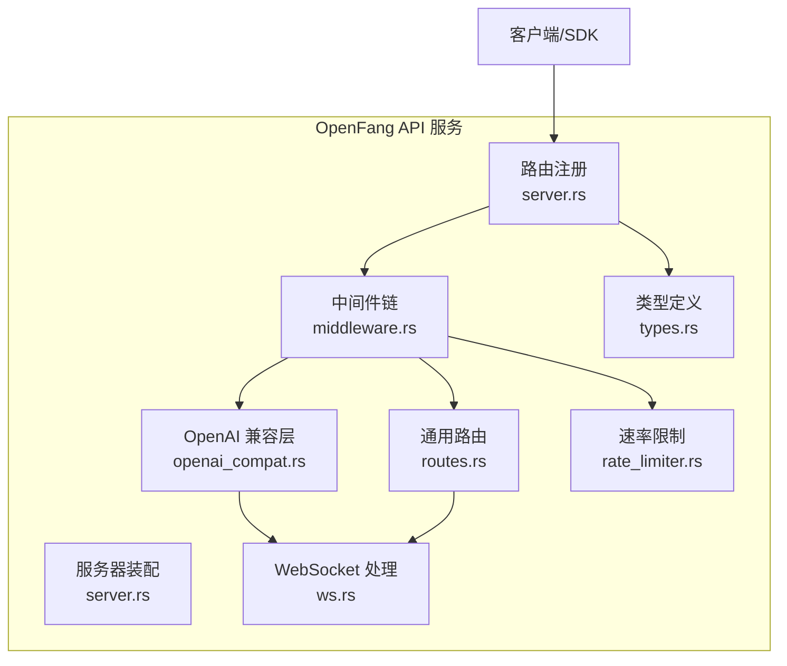
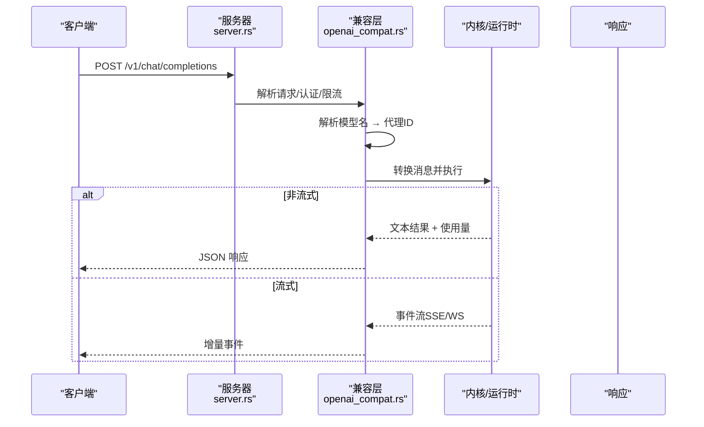
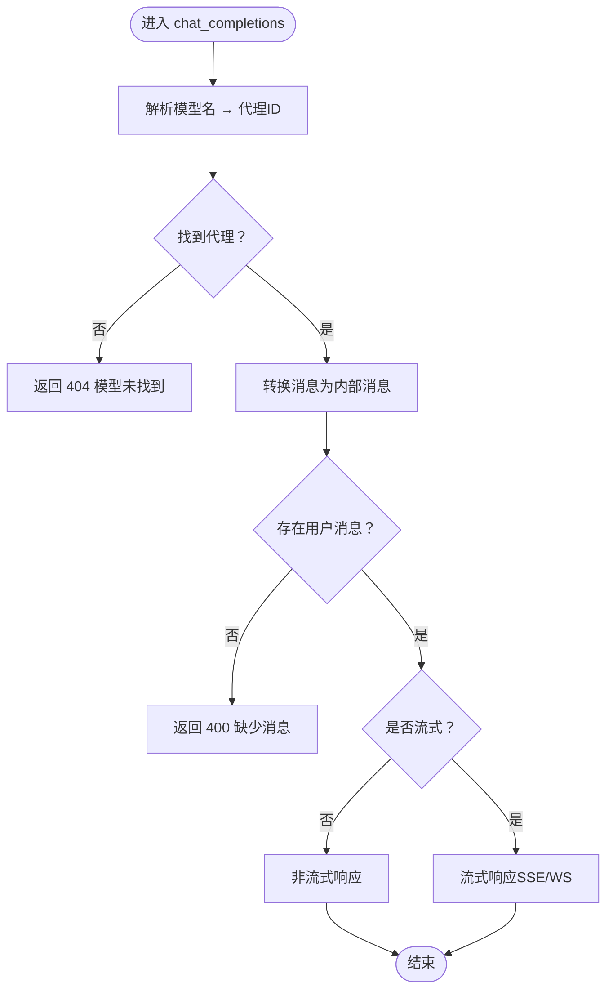
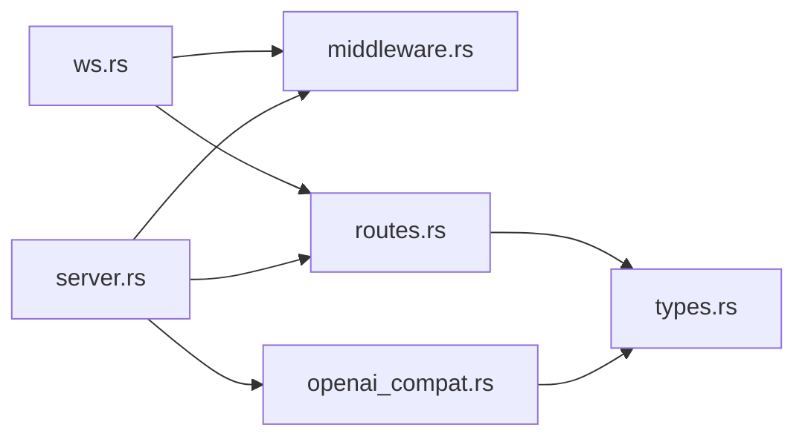

# OpenAI 兼容 API

<cite>
**本文档引用的文件**
- [lib.rs](file://crates/openfang-api/src/lib.rs)
- [openai_compat.rs](file://crates/openfang-api/src/openai_compat.rs)
- [routes.rs](file://crates/openfang-api/src/routes.rs)
- [server.rs](file://crates/openfang-api/src/server.rs)
- [middleware.rs](file://crates/openfang-api/src/middleware.rs)
- [rate_limiter.rs](file://crates/openfang-api/src/rate_limiter.rs)
- [types.rs](file://crates/openfang-api/src/types.rs)
- [ws.rs](file://crates/openfang-api/src/ws.rs)
- [webchat.rs](file://crates/openfang-api/src/webchat.rs)
- [api_integration_test.rs](file://crates/openfang-api/tests/api_integration_test.rs)
- [embedding.rs](file://crates/openfang-runtime/src/embedding.rs)
- [model_catalog.rs](file://crates/openfang-runtime/src/model_catalog.rs)
- [model_catalog_types.rs](file://crates/openfang-types/src/model_catalog.rs)
</cite>

## 目录
1. [简介](#简介)
2. [项目结构](#项目结构)
3. [核心组件](#核心组件)
4. [架构总览](#架构总览)
5. [详细组件分析](#详细组件分析)
6. [依赖关系分析](#依赖关系分析)
7. [性能考虑](#性能考虑)
8. [故障排除指南](#故障排除指南)
9. [结论](#结论)
10. [附录](#附录)

## 简介
本文件为 OpenFang 的 OpenAI 兼容 API 规范文档，覆盖以下内容：
- 兼容性规范与端点映射
- 请求/响应格式与参数映射
- 支持的 OpenAI API 端点（聊天完成、模型列表）
- 认证机制、速率限制、版本控制
- 与原生 OpenAI API 的差异点与迁移建议
- 性能对比、最佳实践与故障排除

OpenFang 在 HTTP 层提供 OpenAI 兼容的 `/v1/chat/completions` 与 `/v1/models` 端点，将 OpenAI 风格的消息与模型名解析到内部代理（Agent）系统，并通过统一的内核与运行时驱动完成推理与工具调用。

## 项目结构
OpenFang API 子系统位于 `crates/openfang-api`，核心模块包括：
- 路由与控制器：定义 HTTP 端点与业务逻辑
- 中间件：日志、认证、安全头、速率限制
- OpenAI 兼容层：将 OpenAI 风格请求映射到代理
- 服务器装配：Axum 路由器构建、CORS、压缩、追踪
- WebSocket：实时聊天通道
- 类型定义：请求/响应结构体
- 测试：集成测试验证端到端行为

图表来源
- [server.rs:37-712](file://crates/openfang-api/src/server.rs#L37-L712)
- [middleware.rs:14-270](file://crates/openfang-api/src/middleware.rs#L14-L270)
- [openai_compat.rs:1-774](file://crates/openfang-api/src/openai_compat.rs#L1-L774)
- [routes.rs:1-11274](file://crates/openfang-api/src/routes.rs#L1-L11274)
- [ws.rs:1-1372](file://crates/openfang-api/src/ws.rs#L1-L1372)
- [types.rs:1-94](file://crates/openfang-api/src/types.rs#L1-L94)
- [rate_limiter.rs:1-98](file://crates/openfang-api/src/rate_limiter.rs#L1-L98)

章节来源
- [lib.rs:1-18](file://crates/openfang-api/src/lib.rs#L1-L18)
- [server.rs:37-712](file://crates/openfang-api/src/server.rs#L37-L712)

## 核心组件
- OpenAI 兼容处理器：负责 `/v1/chat/completions` 与 `/v1/models`，将 OpenAI 消息转换为内部消息并调用内核执行
- 通用路由：提供代理生命周期管理、会话读取、工作流、技能、渠道等丰富 API
- 中间件：请求 ID 注入、结构化日志、认证（Bearer/X-API-Key）、安全头、CSP、XSS/Frame 等防护
- 速率限制：基于 GCRA 的按操作成本的限流，按 IP 维度配额
- WebSocket：实时双向通信，支持打字指示、文本增量、工具调用事件
- 类型系统：统一的请求/响应结构体，确保对外接口一致性

章节来源
- [openai_compat.rs:1-774](file://crates/openfang-api/src/openai_compat.rs#L1-L774)
- [routes.rs:1-11274](file://crates/openfang-api/src/routes.rs#L1-L11274)
- [middleware.rs:14-270](file://crates/openfang-api/src/middleware.rs#L14-L270)
- [rate_limiter.rs:1-98](file://crates/openfang-api/src/rate_limiter.rs#L1-L98)
- [ws.rs:1-1372](file://crates/openfang-api/src/ws.rs#L1-L1372)
- [types.rs:1-94](file://crates/openfang-api/src/types.rs#L1-L94)

## 架构总览
OpenFang 的 OpenAI 兼容 API 采用“OpenAI 风格请求 → 内部代理系统”的映射架构。关键流程：
- 客户端发送 OpenAI 风格的 `/v1/chat/completions` 请求
- 服务器解析模型名（支持 openfang: 前缀、UUID、名称），定位代理
- 将消息转换为内部消息结构，调用内核执行
- 支持非流式与流式两种响应；流式通过 SSE 或 WebSocket 实现
- 返回符合 OpenAI 格式的响应或增量事件

图表来源
- [server.rs:683-691](file://crates/openfang-api/src/server.rs#L683-L691)
- [openai_compat.rs:245-367](file://crates/openfang-api/src/openai_compat.rs#L245-L367)
- [ws.rs:217-781](file://crates/openfang-api/src/ws.rs#L217-L781)

## 详细组件分析

### OpenAI 兼容层（/v1/chat/completions 与 /v1/models）
- 模型解析策略
  - 支持前缀 `openfang:` 明确代理名称
  - 支持 UUID 精确匹配
  - 支持纯字符串作为代理名称
- 消息转换
  - 角色映射：user/assistant/system
  - 内容支持文本与图片（data URI）
- 响应格式
  - 非流式：chat.completion，包含 choices 与 usage
  - 流式：chat.completion.chunk，首帧携带角色，后续增量文本与工具调用
- 错误处理
  - 模型不存在返回 404
  - 缺少用户消息返回 400
  - 内部错误返回 500

图表来源
- [openai_compat.rs:162-367](file://crates/openfang-api/src/openai_compat.rs#L162-L367)

章节来源
- [openai_compat.rs:245-559](file://crates/openfang-api/src/openai_compat.rs#L245-L559)

### 通用路由与代理管理
- 列表/创建/删除/重启代理
- 代理会话读取与历史清理
- 工具、技能、MCP 服务器、身份、配置等管理
- 文件上传与下载、频道集成、审计日志、使用统计等

章节来源
- [routes.rs:45-765](file://crates/openfang-api/src/routes.rs#L45-L765)

### 中间件与安全
- 请求 ID 注入与结构化日志
- 认证：Bearer Token 或 X-API-Key，支持查询参数 token
- 安全头：CSP、X-Frame-Options、X-XSS-Protection、Strict-Transport-Security 等
- 公开端点白名单：健康检查、状态、模型列表、部分只读接口等
- WebSocket 升级独立鉴权与连接数限制

章节来源
- [middleware.rs:18-215](file://crates/openfang-api/src/middleware.rs#L18-L215)
- [ws.rs:140-207](file://crates/openfang-api/src/ws.rs#L140-L207)

### 速率限制（GCRA）
- 操作成本：不同端点分配不同成本（如 health=1、spawn=50、message=30 等）
- 配额：每分钟 500 令牌
- 按 IP 维度检查，超限返回 429 并带 retry-after

章节来源
- [rate_limiter.rs:14-79](file://crates/openfang-api/src/rate_limiter.rs#L14-L79)

### WebSocket 实时聊天
- 协议：JSON 消息类型（message、typing、text_delta、response、error、agents_updated、silent_complete、canvas 等）
- 连接限制：每 IP 最多 5 个并发连接
- 空闲超时：30 分钟无活动自动关闭
- 打字指示与文本增量：支持去抖动与批量刷新
- 工具调用事件：在流中映射为前端可消费的事件

章节来源
- [ws.rs:1-800](file://crates/openfang-api/src/ws.rs#L1-L800)

### 类型系统与请求/响应
- 通用请求/响应类型：Spawn、Message、SkillInstall 等
- OpenAI 兼容请求/响应：ChatCompletionRequest、Choice、UsageInfo、Chunk 等

章节来源
- [types.rs:1-94](file://crates/openfang-api/src/types.rs#L1-L94)
- [openai_compat.rs:26-158](file://crates/openfang-api/src/openai_compat.rs#L26-L158)

## 依赖关系分析
- 服务器装配依赖中间件、路由与状态对象
- OpenAI 兼容层依赖通用路由中的 AppState 与内核句柄
- WebSocket 依赖中间件的认证与速率限制策略
- 类型系统被多个模块共享

图表来源
- [server.rs:37-712](file://crates/openfang-api/src/server.rs#L37-L712)
- [middleware.rs:14-270](file://crates/openfang-api/src/middleware.rs#L14-L270)
- [openai_compat.rs:1-774](file://crates/openfang-api/src/openai_compat.rs#L1-L774)
- [routes.rs:1-11274](file://crates/openfang-api/src/routes.rs#L1-L11274)
- [ws.rs:1-1372](file://crates/openfang-api/src/ws.rs#L1-L1372)
- [types.rs:1-94](file://crates/openfang-api/src/types.rs#L1-L94)

章节来源
- [lib.rs:1-18](file://crates/openfang-api/src/lib.rs#L1-L18)

## 性能考虑
- 流式传输：SSE/WS 提供低延迟增量输出，适合长文本生成与工具调用过程展示
- 速率限制：GCRA 令牌桶算法避免突发流量冲击，按端点成本精细化控制
- 压缩：开启 gzip/deflate 压缩减少网络传输
- CORS 与安全头：生产环境默认严格配置，降低跨域与注入风险
- WebSocket 去抖动：文本增量缓冲与定时刷新平衡实时性与带宽
- 嵌入向量化：OpenAI 兼容的 /v1/embeddings 接口，支持多种提供商，注意外部 API 发送敏感文本的风险提示

章节来源
- [rate_limiter.rs:1-98](file://crates/openfang-api/src/rate_limiter.rs#L1-L98)
- [ws.rs:300-781](file://crates/openfang-api/src/ws.rs#L300-L781)
- [server.rs:706-708](file://crates/openfang-api/src/server.rs#L706-L708)
- [embedding.rs:1-276](file://crates/openfang-runtime/src/embedding.rs#L1-L276)

## 故障排除指南
- 认证失败
  - 确认 Authorization: Bearer 或 X-API-Key 设置正确
  - 若使用浏览器 WebSocket，可通过 ?token= 参数传递密钥
- 404 模型未找到
  - 检查模型名是否为 openfang: 名称、UUID 或已存在的代理名称
- 400 缺少用户消息
  - 确保请求包含有效的用户消息
- 429 速率限制
  - 降低请求频率或等待 retry-after 秒后重试
- WebSocket 连接被拒
  - 检查每 IP 连接上限（默认 5），或确认认证参数
- 嵌入外部 API 风险
  - 外部提供商可能将文本内容发送至第三方，需谨慎配置

章节来源
- [openai_compat.rs:250-288](file://crates/openfang-api/src/openai_compat.rs#L250-L288)
- [middleware.rs:136-215](file://crates/openfang-api/src/middleware.rs#L136-L215)
- [rate_limiter.rs:66-76](file://crates/openfang-api/src/rate_limiter.rs#L66-L76)
- [ws.rs:181-190](file://crates/openfang-api/src/ws.rs#L181-L190)
- [embedding.rs:229-239](file://crates/openfang-runtime/src/embedding.rs#L229-L239)

## 结论
OpenFang 的 OpenAI 兼容 API 在保持与 OpenAI 生态一致的请求/响应格式的同时，提供了更丰富的代理管理能力与企业级安全与性能特性。通过明确的端点映射、严格的认证与限流策略、以及实时的流式传输，开发者可以平滑迁移现有 OpenAI 应用至 OpenFang 平台。

## 附录

### 支持的 OpenAI API 端点
- POST /v1/chat/completions
  - 功能：聊天完成（支持流式与非流式）
  - 参数映射：model → 代理解析；messages → 内部消息；stream → 流式开关
  - 响应：chat.completion 或 chat.completion.chunk
- GET /v1/models
  - 功能：列出可用代理（以模型形式暴露）
  - 响应：包含 openfang: 前缀的代理名称

章节来源
- [openai_compat.rs:245-559](file://crates/openfang-api/src/openai_compat.rs#L245-L559)
- [server.rs:683-691](file://crates/openfang-api/src/server.rs#L683-L691)

### 参数映射与数据格式转换
- OpenAI 消息角色 → 内部角色：user/assistant/system
- OpenAI 内容类型 → 内部内容块：文本与 data URI 图片
- 响应字段：id、object、created、model、choices、usage（prompt/completion/total tokens）

章节来源
- [openai_compat.rs:188-241](file://crates/openfang-api/src/openai_compat.rs#L188-L241)
- [openai_compat.rs:68-158](file://crates/openfang-api/src/openai_compat.rs#L68-L158)

### 认证机制
- Bearer Token：Authorization: Bearer <api_key>
- X-API-Key：请求头或查询参数 token
- 会话 Cookie：当启用仪表盘认证时支持
- WebSocket：独立鉴权，支持查询参数 token

章节来源
- [middleware.rs:145-215](file://crates/openfang-api/src/middleware.rs#L145-L215)
- [ws.rs:148-179](file://crates/openfang-api/src/ws.rs#L148-L179)

### 速率限制
- 成本分配：health=1、spawn=50、message=30、run=100、install=50 等
- 配额：每 IP 每分钟 500 令牌
- 超限时返回 429 与 retry-after

章节来源
- [rate_limiter.rs:14-79](file://crates/openfang-api/src/rate_limiter.rs#L14-L79)

### 版本控制与兼容性
- 版本号来自包元数据，通过 /api/status 与 /api/version 暴露
- 与 OpenAI API 的差异点
  - 模型名解析：支持 openfang: 前缀与 UUID
  - 响应中不包含 cost 字段（OpenAI 兼容响应中 cost_usd 可能为空）
  - 不支持图像 URL（仅支持 data URI）
  - 嵌入接口：/v1/embeddings 与 OpenAI 兼容，但需注意外部 API 风险

章节来源
- [openai_compat.rs:250-367](file://crates/openfang-api/src/openai_compat.rs#L250-L367)
- [server.rs:717-748](file://crates/openfang-api/src/server.rs#L717-L748)
- [embedding.rs:229-239](file://crates/openfang-runtime/src/embedding.rs#L229-L239)

### 迁移注意事项
- 替换模型名：从 OpenAI 模型名迁移到 openfang: 名称或 UUID
- 处理流式：客户端需适配 SSE/WS 的增量事件
- 错误码：404/400/429 的语义与 OpenAI 略有差异，需在客户端处理
- 嵌入：确保 /v1/embeddings 的 base_url 正确（必要时追加 /v1）

章节来源
- [openai_compat.rs:162-184](file://crates/openfang-api/src/openai_compat.rs#L162-L184)
- [embedding.rs:190-227](file://crates/openfang-runtime/src/embedding.rs#L190-L227)

### 兼容性测试方法
- 集成测试覆盖健康检查、代理生命周期、工作流与触发器 CRUD、认证等
- LLM 集成测试需要真实提供商密钥（如 GROQ_API_KEY）

章节来源
- [api_integration_test.rs:1-871](file://crates/openfang-api/tests/api_integration_test.rs#L1-L871)