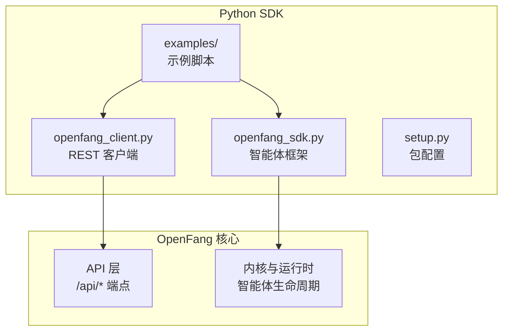
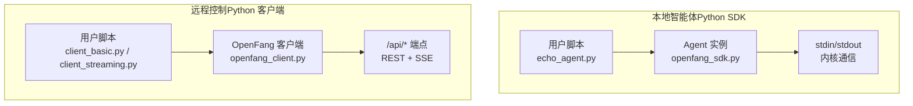
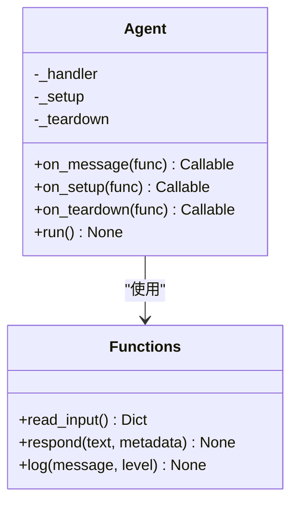
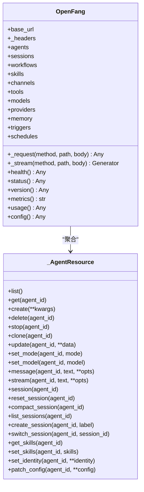
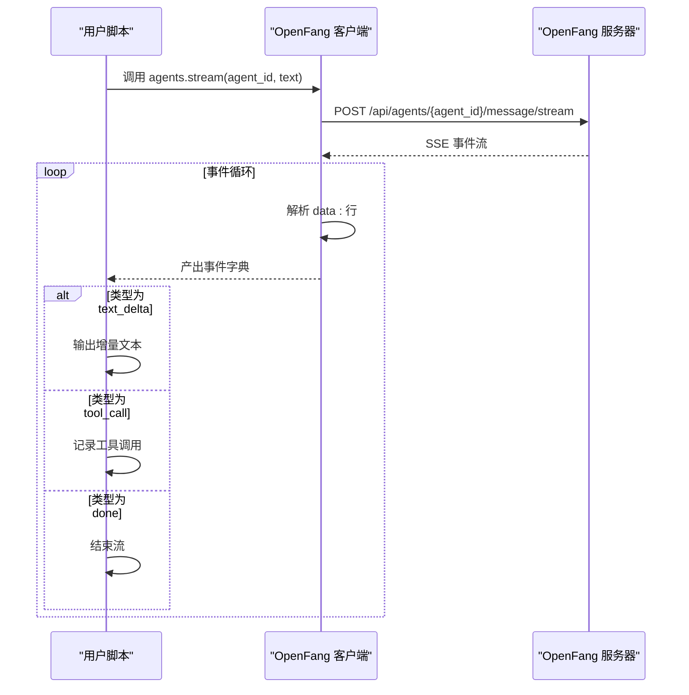
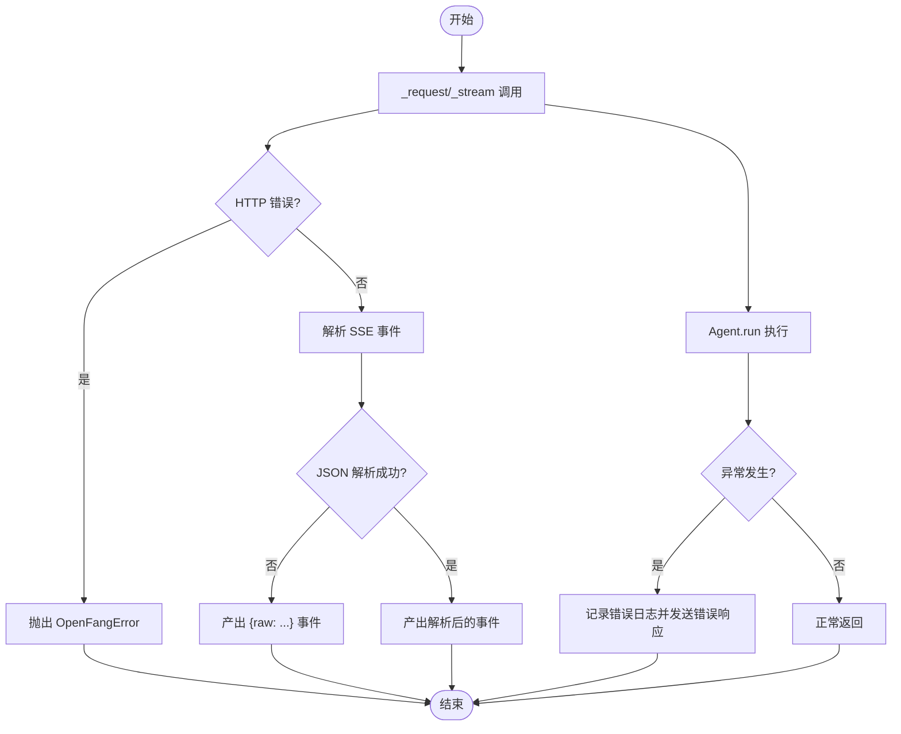
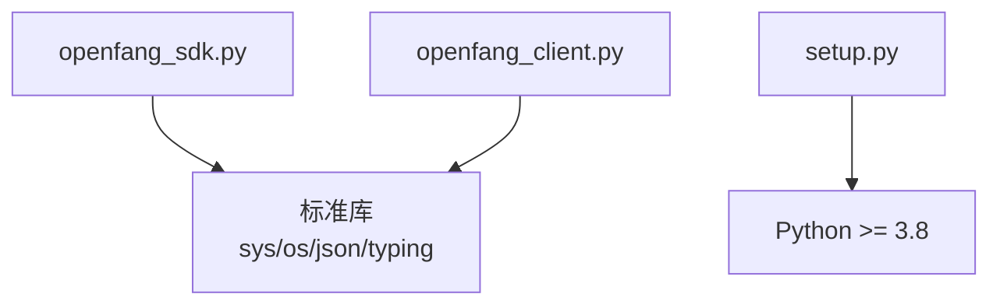

# Python SDK 使用指南

<cite>
**本文档引用的文件**
- [openfang_sdk.py](file://sdk/python/openfang_sdk.py)
- [openfang_client.py](file://sdk/python/openfang_client.py)
- [setup.py](file://sdk/python/setup.py)
- [client_basic.py](file://sdk/python/examples/client_basic.py)
- [client_streaming.py](file://sdk/python/examples/client_streaming.py)
- [echo_agent.py](file://sdk/python/examples/echo_agent.py)
- [README.md](file://README.md)
- [openfang.toml.example](file://openfang.toml.example)
</cite>

## 目录
1. [简介](#简介)
2. [项目结构](#项目结构)
3. [核心组件](#核心组件)
4. [架构概览](#架构概览)
5. [详细组件分析](#详细组件分析)
6. [依赖关系分析](#依赖关系分析)
7. [性能考虑](#性能考虑)
8. [故障排除指南](#故障排除指南)
9. [结论](#结论)
10. [附录](#附录)

## 简介
本指南面向希望使用 OpenFang Python SDK 的开发者，涵盖安装、依赖、虚拟环境配置、客户端初始化、认证设置、连接管理、核心功能模块（智能体操作、消息处理、流式响应、异步调用）、最佳实践、性能优化、内存管理、调试与日志、以及与现有 Python AI 应用的集成方案。SDK 提供两套能力：
- Python SDK（openfang_sdk）：用于在 OpenFang 内部运行的 Python 智能体开发框架，支持装饰器模式的消息处理、输入输出读写、日志记录等。
- Python 客户端（openfang_client）：用于远程控制 OpenFang 的 REST API 客户端，支持智能体 CRUD、消息发送、会话管理、技能管理、模型与提供商配置、内存键值访问、触发器与计划任务等。

## 项目结构
OpenFang 采用多语言混合架构（Rust 核心 + Python SDK），Python SDK 位于 sdk/python 目录，包含以下关键文件：
- openfang_sdk.py：Python 智能体开发框架，提供 Agent 装饰器、消息处理、输入输出、日志等工具函数。
- openfang_client.py：REST API 客户端，封装了对 /api/* 端点的调用，支持 SSE 流式响应。
- setup.py：Python 包元数据与安装脚本。
- examples/：包含基础示例、流式示例与简单 Echo 智能体示例。

**图表来源**
- [openfang_sdk.py:1-148](file://sdk/python/openfang_sdk.py#L1-L148)
- [openfang_client.py:1-368](file://sdk/python/openfang_client.py#L1-L368)
- [setup.py:1-15](file://sdk/python/setup.py#L1-L15)

**章节来源**
- [openfang_sdk.py:1-148](file://sdk/python/openfang_sdk.py#L1-L148)
- [openfang_client.py:1-368](file://sdk/python/openfang_client.py#L1-L368)
- [setup.py:1-15](file://sdk/python/setup.py#L1-L15)

## 核心组件
- openfang_sdk：提供 Agent 类与装饰器（on_message/on_setup/on_teardown）、输入读取 read_input、响应发送 respond、日志输出 log 等。
- openfang_client：提供 OpenFang 主类与资源子类（agents/sessions/workflows/skills/channels/tools/models/providers/memory/triggers/schedules），支持常规请求与 SSE 流式响应。

**章节来源**
- [openfang_sdk.py:60-130](file://sdk/python/openfang_sdk.py#L60-L130)
- [openfang_client.py:46-135](file://sdk/python/openfang_client.py#L46-L135)

## 架构概览
OpenFang 的 Python SDK 通过两种方式与系统交互：
- 在 OpenFang 内部运行的 Python 智能体：通过标准输入/输出与内核通信，使用 openfang_sdk 的 Agent 装饰器模式处理消息。
- 远程控制 OpenFang：通过 HTTP REST API 与 SSE 流式接口，使用 openfang_client 发送消息、创建智能体、管理会话与技能等。

**图表来源**
- [echo_agent.py:1-21](file://sdk/python/examples/echo_agent.py#L1-L21)
- [openfang_sdk.py:97-130](file://sdk/python/openfang_sdk.py#L97-L130)
- [client_basic.py:1-36](file://sdk/python/examples/client_basic.py#L1-L36)
- [client_streaming.py:1-34](file://sdk/python/examples/client_streaming.py#L1-L34)
- [openfang_client.py:168-179](file://sdk/python/openfang_client.py#L168-L179)

## 详细组件分析

### openfang_sdk：Python 智能体框架
- Agent 类
  - 装饰器注册：on_message/on_setup/on_teardown，分别注册消息处理、初始化与清理回调。
  - run 方法：读取输入、调用处理器、发送响应、异常处理与收尾。
- 工具函数
  - read_input：从标准输入读取 JSON，或回退到环境变量。
  - respond：向标准输出发送响应 JSON。
  - log：向标准错误输出日志，级别可选。

**图表来源**
- [openfang_sdk.py:60-130](file://sdk/python/openfang_sdk.py#L60-L130)

**章节来源**
- [openfang_sdk.py:31-57](file://sdk/python/openfang_sdk.py#L31-L57)
- [openfang_sdk.py:60-130](file://sdk/python/openfang_sdk.py#L60-L130)

### openfang_client：REST API 客户端
- OpenFang 主类
  - 初始化：base_url 与自定义请求头；聚合资源子类。
  - 请求方法：_request（通用 HTTP 请求，自动解析 JSON 或文本）。
  - 流式方法：_stream（SSE 解析，逐条事件产出）。
  - 健康检查与状态：health、health_detail、status、version、metrics、usage、config。
- 资源子类
  - agents：列表、查询、创建、删除、停止、克隆、更新、切换模式/模型、消息、流式消息、会话管理、技能、身份、配置。
  - sessions：列表、删除、标签。
  - workflows：列表、创建、运行、查看运行历史。
  - skills：列出、安装、卸载、搜索。
  - channels：列出、配置、移除、测试。
  - tools：列出。
  - models：列出、查询、别名。
  - providers：列出、设置/删除密钥、测试。
  - memory：按智能体的键值读写。
  - triggers：列出、创建/更新/删除。
  - schedules：列出、创建/更新/删除、运行。

**图表来源**
- [openfang_client.py:46-135](file://sdk/python/openfang_client.py#L46-L135)
- [openfang_client.py:139-210](file://sdk/python/openfang_client.py#L139-L210)

**章节来源**
- [openfang_client.py:46-135](file://sdk/python/openfang_client.py#L46-L135)
- [openfang_client.py:139-210](file://sdk/python/openfang_client.py#L139-L210)

### 流式响应处理流程
客户端通过 SSE 接收事件，逐条解析并产出事件字典。典型事件类型包括 text_delta、tool_call、done 等。

**图表来源**
- [openfang_client.py:82-114](file://sdk/python/openfang_client.py#L82-L114)
- [openfang_client.py:172-179](file://sdk/python/openfang_client.py#L172-L179)

**章节来源**
- [openfang_client.py:82-114](file://sdk/python/openfang_client.py#L82-L114)
- [client_streaming.py:21-31](file://sdk/python/examples/client_streaming.py#L21-L31)

### 错误处理与异常
- OpenFangError：封装 HTTP 错误，包含状态码与响应体。
- _request：捕获 HTTPError 并抛出 OpenFangError。
- _stream：SSE 解析失败时回退为原始字符串事件。
- Agent.run：捕获异常并记录错误日志，随后发送错误响应并退出。

**图表来源**
- [openfang_client.py:34-81](file://sdk/python/openfang_client.py#L34-L81)
- [openfang_client.py:82-114](file://sdk/python/openfang_client.py#L82-L114)
- [openfang_sdk.py:120-130](file://sdk/python/openfang_sdk.py#L120-L130)

**章节来源**
- [openfang_client.py:34-81](file://sdk/python/openfang_client.py#L34-L81)
- [openfang_sdk.py:120-130](file://sdk/python/openfang_sdk.py#L120-L130)

## 依赖关系分析
- Python SDK 仅依赖标准库（sys、os、json、typing），零外部依赖。
- Python 客户端同样仅依赖标准库（urllib.request/parse/error 及 typing），零外部依赖。
- setup.py 指定最低 Python 版本为 3.8。

**图表来源**
- [openfang_sdk.py:25-28](file://sdk/python/openfang_sdk.py#L25-L28)
- [openfang_client.py:27-31](file://sdk/python/openfang_client.py#L27-L31)
- [setup.py:8](file://sdk/python/setup.py#L8)

**章节来源**
- [openfang_sdk.py:25-28](file://sdk/python/openfang_sdk.py#L25-L28)
- [openfang_client.py:27-31](file://sdk/python/openfang_client.py#L27-L31)
- [setup.py:8](file://sdk/python/setup.py#L8)

## 性能考虑
- 流式处理：优先使用 SSE 流式接口以降低延迟并提升用户体验。
- 输入输出：避免频繁打印与缓冲区刷新，合理批量输出增量文本。
- 异常处理：在 Agent 中捕获异常并快速返回错误响应，减少无效计算。
- 资源管理：在 on_teardown 中释放资源，确保进程退出前完成清理。

[本节为通用指导，无需特定文件来源]

## 故障排除指南
- 认证与授权
  - 服务端可通过配置启用 Bearer Token 认证，客户端需在请求头中携带 Authorization: Bearer <api_key> 或通过查询参数 token=...。
  - 若未设置 api_key，则所有端点公开；如设置了 api_key，则需要正确的凭据。
- 健康检查
  - 使用 health/health_detail/status/version/metrics/usage/config 等端点进行诊断。
- 日志与调试
  - 使用 log(level) 将日志输出到标准错误，便于在守护进程日志中查看。
  - 在 Agent.run 中捕获异常并记录错误信息，同时向内核返回错误响应。
- 环境变量
  - 智能体运行时可从环境变量读取 OPENFANG_AGENT_ID、OPENFANG_MESSAGE 等上下文信息。

**章节来源**
- [openfang_client.py:115-135](file://sdk/python/openfang_client.py#L115-L135)
- [openfang_sdk.py:55-57](file://sdk/python/openfang_sdk.py#L55-L57)
- [openfang_sdk.py:97-130](file://sdk/python/openfang_sdk.py#L97-L130)
- [openfang.toml.example:4-6](file://openfang.toml.example#L4-L6)

## 结论
OpenFang Python SDK 提供了简洁高效的智能体开发与远程控制能力。通过 openfang_sdk 可快速构建在 OpenFang 内部运行的 Python 智能体，通过 openfang_client 可远程管理智能体、会话、技能与系统资源。其零依赖设计与完善的流式处理机制，使其易于集成到现有 Python AI 应用中，并具备良好的可维护性与可观测性。

[本节为总结性内容，无需特定文件来源]

## 附录

### 安装与依赖
- Python 版本：>= 3.8
- 依赖：无（仅标准库）
- 安装方式：将 sdk/python 目录加入 Python 路径后直接导入 openfang_sdk 或 openfang_client。

**章节来源**
- [setup.py:8](file://sdk/python/setup.py#L8)

### 虚拟环境配置
- 建议使用 Python 3.8+ 的虚拟环境隔离依赖。
- 将 sdk/python 目录添加到 PYTHONPATH，以便直接导入 openfang_sdk 与 openfang_client。

[本节为通用指导，无需特定文件来源]

### 客户端初始化与认证
- 初始化：OpenFang(base_url, headers)
- 认证：在请求头中设置 Authorization: Bearer <api_key>，或通过查询参数 token=...
- 健康检查：client.health()

**章节来源**
- [openfang_client.py:49-54](file://sdk/python/openfang_client.py#L49-L54)
- [openfang_client.py:115-119](file://sdk/python/openfang_client.py#L115-L119)
- [openfang.toml.example:4-6](file://openfang.toml.example#L4-L6)

### 连接管理
- 基础 URL：以 / 结尾的 base_url 会被规范化。
- 请求头：默认 Content-Type: application/json，可传入自定义头覆盖。
- SSE 流：Accept: text/event-stream，按 data: 行解析事件。

**章节来源**
- [openfang_client.py:50-54](file://sdk/python/openfang_client.py#L50-L54)
- [openfang_client.py:86-88](file://sdk/python/openfang_client.py#L86-L88)
- [openfang_client.py:105-112](file://sdk/python/openfang_client.py#L105-L112)

### 核心功能模块
- 智能体操作：agents.list/get/create/delete/stop/clone/update/set_mode/set_model/message/stream/session/*
- 会话管理：sessions.list/delete/set_label
- 工作流：workflows.list/create/run/runs
- 技能：skills.list/install/uninstall/search
- 渠道：channels.list/configure/remove/test
- 工具：tools.list
- 模型：models.list/get/aliases
- 提供商：providers.list/set_key/delete_key/test
- 内存：memory.get_all/get/set/delete
- 触发器：triggers.list/create/update/delete
- 计划任务：schedules.list/create/update/delete/run

**章节来源**
- [openfang_client.py:139-210](file://sdk/python/openfang_client.py#L139-L210)
- [openfang_client.py:214-224](file://sdk/python/openfang_client.py#L214-L224)
- [openfang_client.py:228-241](file://sdk/python/openfang_client.py#L228-L241)
- [openfang_client.py:245-258](file://sdk/python/openfang_client.py#L245-L258)
- [openfang_client.py:262-275](file://sdk/python/openfang_client.py#L262-L275)
- [openfang_client.py:279-283](file://sdk/python/openfang_client.py#L279-L283)
- [openfang_client.py:287-297](file://sdk/python/openfang_client.py#L287-L297)
- [openfang_client.py:301-314](file://sdk/python/openfang_client.py#L301-L314)
- [openfang_client.py:318-331](file://sdk/python/openfang_client.py#L318-L331)
- [openfang_client.py:335-348](file://sdk/python/openfang_client.py#L335-L348)
- [openfang_client.py:352-367](file://sdk/python/openfang_client.py#L352-L367)

### 代码示例路径
- 基础示例（创建智能体、聊天、清理）：[client_basic.py:1-36](file://sdk/python/examples/client_basic.py#L1-L36)
- 流式示例（逐 token 输出、工具调用事件）：[client_streaming.py:1-34](file://sdk/python/examples/client_streaming.py#L1-L34)
- Echo 智能体（装饰器模式、运行）：[echo_agent.py:1-21](file://sdk/python/examples/echo_agent.py#L1-L21)

**章节来源**
- [client_basic.py:15-35](file://sdk/python/examples/client_basic.py#L15-L35)
- [client_streaming.py:23-31](file://sdk/python/examples/client_streaming.py#L23-L31)
- [echo_agent.py:14-20](file://sdk/python/examples/echo_agent.py#L14-L20)

### 最佳实践
- 使用 SSE 流式接口提升实时性与用户体验。
- 在 Agent 中统一处理异常并记录日志，确保错误信息清晰可追踪。
- 合理使用会话重置与压缩，控制上下文长度与成本。
- 对敏感配置使用环境变量与提供商密钥管理，避免硬编码。

[本节为通用指导，无需特定文件来源]

### 性能优化技巧
- 减少不必要的网络往返：合并请求、批量操作。
- 控制流式输出频率：适当合并增量文本，避免过度刷新。
- 使用合适的模型与提供商：根据任务复杂度选择最优路由与模型。

[本节为通用指导，无需特定文件来源]

### 内存管理建议
- 在 on_teardown 中释放资源，确保进程退出前完成清理。
- 避免在消息处理中持有大对象引用，及时释放临时数据。

**章节来源**
- [openfang_sdk.py:124-130](file://sdk/python/openfang_sdk.py#L124-L130)

### 调试方法与日志配置
- 使用 log(level) 输出到标准错误，便于在守护进程日志中查看。
- 健康检查与状态接口用于快速定位服务可用性问题。
- 在 Agent.run 中捕获异常并记录错误，同时返回错误响应。

**章节来源**
- [openfang_sdk.py:55-57](file://sdk/python/openfang_sdk.py#L55-L57)
- [openfang_client.py:115-135](file://sdk/python/openfang_client.py#L115-L135)
- [openfang_sdk.py:120-130](file://sdk/python/openfang_sdk.py#L120-L130)

### 与现有 Python AI 应用的集成
- 将 SDK 的 Agent 装饰器模式与现有应用的消息分发逻辑结合，实现统一的智能体入口。
- 使用 openfang_client 将现有应用的外部调用接入 OpenFang 的智能体与工作流体系。
- 利用 SSE 流式接口实现实时对话与工具调用反馈，提升交互体验。

[本节为概念性内容，无需特定文件来源]