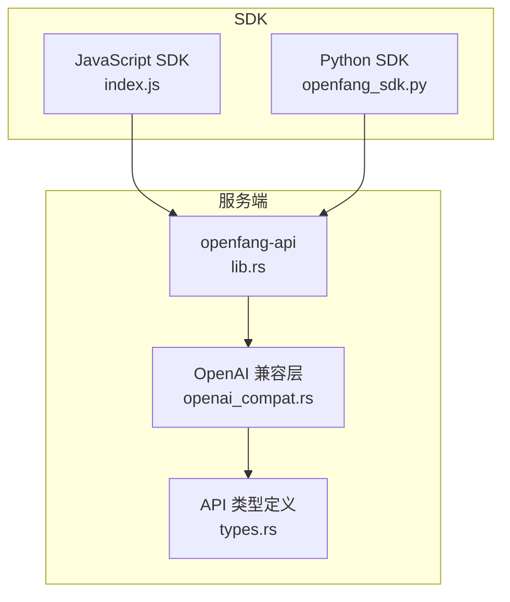
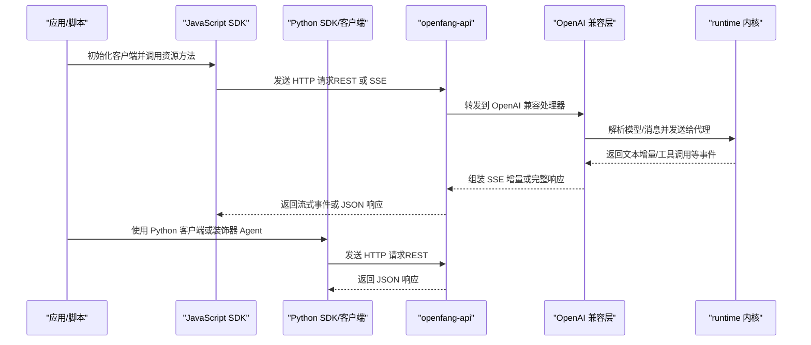
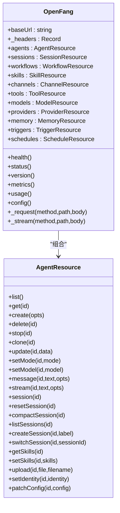
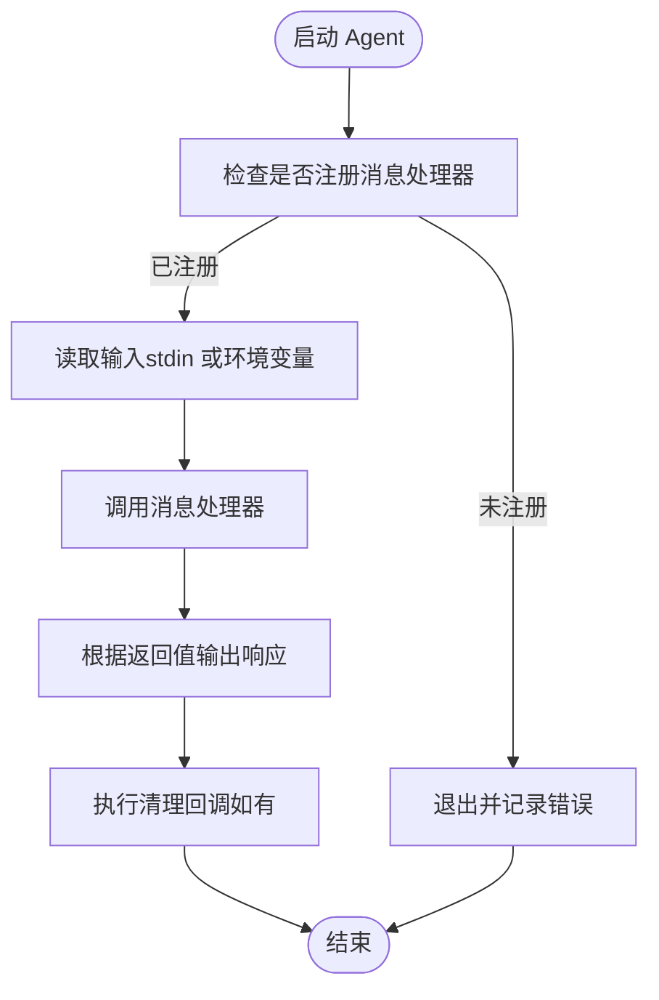
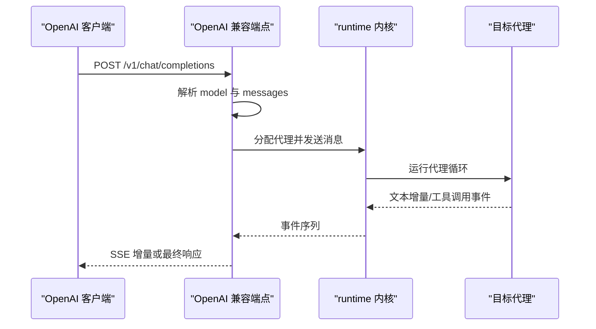
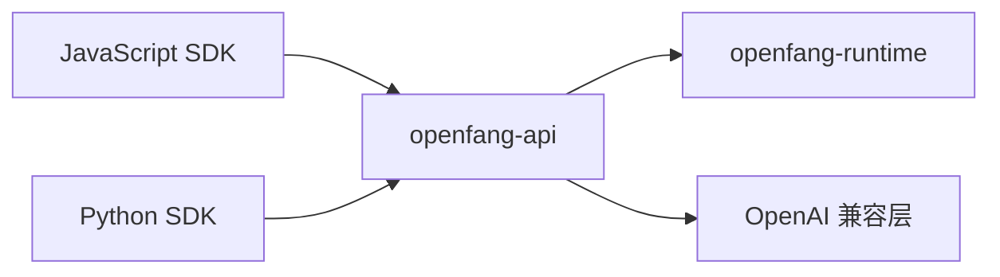

# SDK 和集成

<cite>
**本文引用的文件**
- [README.md](file://README.md)
- [sdk/javascript/package.json](file://sdk/javascript/package.json)
- [sdk/javascript/index.js](file://sdk/javascript/index.js)
- [sdk/javascript/examples/basic.js](file://sdk/javascript/examples/basic.js)
- [sdk/javascript/examples/streaming.js](file://sdk/javascript/examples/streaming.js)
- [sdk/python/setup.py](file://sdk/python/setup.py)
- [sdk/python/openfang_sdk.py](file://sdk/python/openfang_sdk.py)
- [sdk/python/examples/client_basic.py](file://sdk/python/examples/client_basic.py)
- [sdk/python/examples/client_streaming.py](file://sdk/python/examples/client_streaming.py)
- [sdk/python/examples/echo_agent.py](file://sdk/python/examples/echo_agent.py)
- [crates/openfang-api/src/lib.rs](file://crates/openfang-api/src/lib.rs)
- [crates/openfang-api/src/openai_compat.rs](file://crates/openfang-api/src/openai_compat.rs)
- [crates/openfang-api/src/types.rs](file://crates/openfang-api/src/types.rs)
</cite>

## 目录
1. [简介](#简介)
2. [项目结构](#项目结构)
3. [核心组件](#核心组件)
4. [架构总览](#架构总览)
5. [详细组件分析](#详细组件分析)
6. [依赖分析](#依赖分析)
7. [性能考虑](#性能考虑)
8. [故障排除指南](#故障排除指南)
9. [结论](#结论)
10. [附录](#附录)

## 简介
本文件面向需要在 OpenFang Agent OS 上进行 SDK 集成与第三方对接的开发者，覆盖以下内容：
- JavaScript 与 Python SDK 的安装、配置与使用
- OpenAI 兼容 API 的完整规范、参数映射与响应格式
- SDK 核心能力：客户端初始化、智能体管理、消息发送、流式响应、错误处理
- 与现有 OpenAI 应用的迁移指南与兼容性注意事项
- 第三方集成方案（Webhook、回调）、测试与调试工具、故障排除

## 项目结构
OpenFang 采用多 Crate 的 Rust 工程组织，同时提供官方 JavaScript 与 Python SDK。核心模块包括：
- openfang-api：HTTP/WebSocket/API 服务器，包含 OpenAI 兼容接口
- openfang-runtime：运行时内核、代理循环、工具与驱动
- openfang-types：核心数据类型与协议
- SDK：JavaScript 与 Python 客户端库及示例

图表来源
- [sdk/javascript/index.js:1-480](file://sdk/javascript/index.js#L1-L480)
- [sdk/python/openfang_sdk.py:1-148](file://sdk/python/openfang_sdk.py#L1-L148)
- [crates/openfang-api/src/lib.rs:1-19](file://crates/openfang-api/src/lib.rs#L1-L19)
- [crates/openfang-api/src/openai_compat.rs:1-774](file://crates/openfang-api/src/openai_compat.rs#L1-L774)
- [crates/openfang-api/src/types.rs:1-110](file://crates/openfang-api/src/types.rs#L1-L110)

章节来源
- [README.md:389-404](file://README.md#L389-L404)
- [sdk/javascript/package.json:1-18](file://sdk/javascript/package.json#L1-L18)
- [sdk/python/setup.py:1-15](file://sdk/python/setup.py#L1-L15)

## 核心组件
- JavaScript SDK：提供 OpenFang 客户端类与资源子模块（agents、sessions、workflows、skills、channels、tools、models、providers、memory、triggers、schedules），支持健康检查、版本查询、指标与用量统计，并内置 SSE 流式迭代器。
- Python SDK：提供基础 Agent 装饰器框架与读取输入/输出响应的辅助函数；另提供 Python 客户端库用于调用 REST API。
- OpenAI 兼容 API：实现 /v1/chat/completions 与 /v1/models，支持非流式与 SSE 流式响应，消息内容支持文本与图片（data URI）。

章节来源
- [sdk/javascript/index.js:29-141](file://sdk/javascript/index.js#L29-L141)
- [sdk/javascript/index.js:145-271](file://sdk/javascript/index.js#L145-L271)
- [sdk/javascript/index.js:275-475](file://sdk/javascript/index.js#L275-L475)
- [sdk/python/openfang_sdk.py:60-130](file://sdk/python/openfang_sdk.py#L60-L130)
- [crates/openfang-api/src/openai_compat.rs:24-158](file://crates/openfang-api/src/openai_compat.rs#L24-L158)

## 架构总览
下图展示从 SDK 到服务端 API 的交互路径，以及 OpenAI 兼容层如何将请求转发至内核并返回结果或流式事件。

图表来源
- [sdk/javascript/index.js:52-105](file://sdk/javascript/index.js#L52-L105)
- [sdk/javascript/index.js:207-210](file://sdk/javascript/index.js#L207-L210)
- [crates/openfang-api/src/openai_compat.rs:245-367](file://crates/openfang-api/src/openai_compat.rs#L245-L367)
- [crates/openfang-api/src/openai_compat.rs:369-532](file://crates/openfang-api/src/openai_compat.rs#L369-L532)

## 详细组件分析

### JavaScript SDK 组件分析
- 客户端类 OpenFang
  - 提供健康检查、状态、版本、Prometheus 指标、用量统计、配置等通用接口
  - 内置 _request 与 _stream 方法，分别处理 JSON 响应与 SSE 流式事件
- 资源模块
  - agents：列表、创建、删除、停止、克隆、更新、模式/模型设置、消息发送、会话管理、技能管理、文件上传、身份与配置补丁
  - sessions、workflows、skills、channels、tools、models、providers、memory、triggers、schedules：对应 REST 资源的 CRUD 与特定操作
- 错误处理
  - 自定义 OpenFangError，封装状态码与响应体，便于上层捕获与诊断

图表来源
- [sdk/javascript/index.js:29-141](file://sdk/javascript/index.js#L29-L141)
- [sdk/javascript/index.js:145-271](file://sdk/javascript/index.js#L145-L271)

章节来源
- [sdk/javascript/index.js:29-141](file://sdk/javascript/index.js#L29-L141)
- [sdk/javascript/index.js:145-271](file://sdk/javascript/index.js#L145-L271)
- [sdk/javascript/index.js:275-475](file://sdk/javascript/index.js#L275-L475)

### Python SDK 组件分析
- openfang_sdk.py
  - read_input：从 stdin 或环境变量读取输入
  - respond：向 stdout 输出 JSON 响应
  - log：向 stderr 输出日志
  - Agent 装饰器：注册消息/设置/清理回调，统一运行流程
- 示例脚本
  - client_basic.py、client_streaming.py：演示通过 Python 客户端调用 REST API
  - echo_agent.py：演示基于装饰器的 Agent 编写方式

图表来源
- [sdk/python/openfang_sdk.py:97-130](file://sdk/python/openfang_sdk.py#L97-L130)

章节来源
- [sdk/python/openfang_sdk.py:31-57](file://sdk/python/openfang_sdk.py#L31-L57)
- [sdk/python/openfang_sdk.py:60-130](file://sdk/python/openfang_sdk.py#L60-L130)
- [sdk/python/examples/client_basic.py:1-36](file://sdk/python/examples/client_basic.py#L1-L36)
- [sdk/python/examples/client_streaming.py:1-34](file://sdk/python/examples/client_streaming.py#L1-L34)
- [sdk/python/examples/echo_agent.py:1-21](file://sdk/python/examples/echo_agent.py#L1-L21)

### OpenAI 兼容 API 组件分析
- 端点
  - POST /v1/chat/completions：支持非流式与 SSE 流式
  - GET /v1/models：列出可用“模型”（以 openfang:<name> 形式映射到代理）
- 请求/响应模型
  - ChatCompletionRequest：model、messages、stream、max_tokens、temperature
  - 响应：choices[].message.content/tool_calls、usage、finish_reason
  - 流式：SSE，首帧含角色，后续增量包含文本与工具调用参数
- 消息转换
  - 支持 role 映射（user/assistant/system），content 支持纯文本与多部分（文本+data URI 图片）

图表来源
- [crates/openfang-api/src/openai_compat.rs:245-367](file://crates/openfang-api/src/openai_compat.rs#L245-L367)
- [crates/openfang-api/src/openai_compat.rs:369-532](file://crates/openfang-api/src/openai_compat.rs#L369-L532)

章节来源
- [crates/openfang-api/src/openai_compat.rs:24-158](file://crates/openfang-api/src/openai_compat.rs#L24-L158)
- [crates/openfang-api/src/openai_compat.rs:245-367](file://crates/openfang-api/src/openai_compat.rs#L245-L367)
- [crates/openfang-api/src/openai_compat.rs:369-532](file://crates/openfang-api/src/openai_compat.rs#L369-L532)
- [crates/openfang-api/src/types.rs:5-62](file://crates/openfang-api/src/types.rs#L5-L62)

## 依赖分析
- JavaScript SDK
  - 无外部运行时依赖，仅使用浏览器/Node 的 fetch 与 SSE
  - 包描述文件声明 Node 引擎版本要求
- Python SDK
  - 无第三方运行时依赖，仅标准库
  - setup.py 声明最低 Python 版本
- 服务端
  - openfang-api 作为 HTTP 服务器，内部依赖 openfang-runtime 执行代理逻辑
  - openai_compat 将 OpenAI 风格请求映射到代理系统

图表来源
- [sdk/javascript/package.json:13-16](file://sdk/javascript/package.json#L13-L16)
- [sdk/python/setup.py:8-8](file://sdk/python/setup.py#L8-L8)
- [crates/openfang-api/src/lib.rs:6-18](file://crates/openfang-api/src/lib.rs#L6-L18)

章节来源
- [sdk/javascript/package.json:1-18](file://sdk/javascript/package.json#L1-L18)
- [sdk/python/setup.py:1-15](file://sdk/python/setup.py#L1-L15)
- [crates/openfang-api/src/lib.rs:1-19](file://crates/openfang-api/src/lib.rs#L1-L19)

## 性能考虑
- 流式传输优先：在长对话或大文本生成场景中，优先使用流式接口以降低首字节延迟并提升用户体验
- 合理设置超时与重试：对网络不稳定环境，建议在客户端实现指数退避重试与超时控制
- 控制并发：避免在同一代理上同时发起多个长时间流式请求，防止上下文膨胀与资源竞争
- 模型选择与温度：根据任务稳定性需求调整 temperature 与 max_tokens，平衡质量与成本
- 日志与监控：利用服务端指标与用量接口进行性能观测与容量规划

## 故障排除指南
- 常见错误与定位
  - HTTP 非 2xx：检查服务端健康状态与认证头，确认请求体格式正确
  - SSE 流中断：确认客户端网络稳定与服务端 keep-alive 设置
  - OpenAI 兼容错误：检查 model 名称解析（openfang:<name>、UUID、名称）与 messages 结构
- 调试建议
  - 使用 SDK 的 health、status、metrics、usage 接口快速判断服务状态
  - 在 Python Agent 中使用 log 辅助输出调试信息
  - 对照示例脚本逐步验证请求与响应
- 常见问题
  - 图片输入：仅支持 data URI 格式，URL 图片不被接受
  - 工具调用：SSE 中工具调用分步增量，需按事件顺序拼接参数

章节来源
- [sdk/javascript/index.js:59-68](file://sdk/javascript/index.js#L59-L68)
- [sdk/javascript/index.js:79-82](file://sdk/javascript/index.js#L79-L82)
- [crates/openfang-api/src/openai_compat.rs:250-265](file://crates/openfang-api/src/openai_compat.rs#L250-L265)
- [sdk/python/openfang_sdk.py:55-57](file://sdk/python/openfang_sdk.py#L55-L57)

## 结论
OpenFang 提供了与 OpenAI 生态无缝兼容的 REST 与 SSE 接口，配合简洁直观的 JavaScript 与 Python SDK，可快速完成从本地开发到生产集成的全链路落地。通过本文档的规范指引与最佳实践，可在保证安全与性能的前提下，高效完成第三方集成与迁移工作。

## 附录

### 安装与配置
- JavaScript SDK
  - 通过包管理器安装后，在 Node.js 环境中引入并初始化客户端
  - 参考包元信息中的引擎版本要求
- Python SDK
  - 直接导入 openfang_sdk 或 openfang_client 使用
  - 注意最低 Python 版本要求

章节来源
- [sdk/javascript/package.json:1-18](file://sdk/javascript/package.json#L1-L18)
- [sdk/python/setup.py:1-15](file://sdk/python/setup.py#L1-L15)

### 使用示例（路径）
- JavaScript
  - 基础示例：[basic.js:1-35](file://sdk/javascript/examples/basic.js#L1-L35)
  - 流式示例：[streaming.js:1-34](file://sdk/javascript/examples/streaming.js#L1-L34)
- Python
  - 基础客户端示例：[client_basic.py:1-36](file://sdk/python/examples/client_basic.py#L1-L36)
  - 流式客户端示例：[client_streaming.py:1-34](file://sdk/python/examples/client_streaming.py#L1-L34)
  - 装饰器 Agent 示例：[echo_agent.py:1-21](file://sdk/python/examples/echo_agent.py#L1-L21)

### OpenAI 兼容 API 规范要点
- 端点
  - POST /v1/chat/completions：支持 stream 参数
  - GET /v1/models：返回 openfang:<name> 形式的模型列表
- 请求字段
  - model：支持 openfang:<name>、UUID、名称
  - messages：支持 role 与 content（文本或 data URI 图片）
  - 其他：stream、max_tokens、temperature
- 响应字段
  - choices[].message.content/tool_calls
  - usage：prompt_tokens、completion_tokens、total_tokens
  - 流式：SSE，首帧含角色，后续增量包含文本与工具调用参数

章节来源
- [crates/openfang-api/src/openai_compat.rs:24-158](file://crates/openfang-api/src/openai_compat.rs#L24-L158)
- [crates/openfang-api/src/openai_compat.rs:534-559](file://crates/openfang-api/src/openai_compat.rs#L534-L559)

### 迁移指南与兼容性
- 与现有 OpenAI 应用的迁移
  - 将 OpenAI 客户端指向 OpenFang 服务地址，model 字段使用 openfang:<name>
  - 保持 messages 结构不变，注意图片使用 data URI
- 兼容性注意事项
  - 工具调用在流式中分步到达，需按事件顺序处理
  - 非工具调用场景下，tool_calls 字段可能省略以保持向后兼容

章节来源
- [README.md:389-404](file://README.md#L389-L404)
- [crates/openfang-api/src/openai_compat.rs:755-772](file://crates/openfang-api/src/openai_compat.rs#L755-L772)