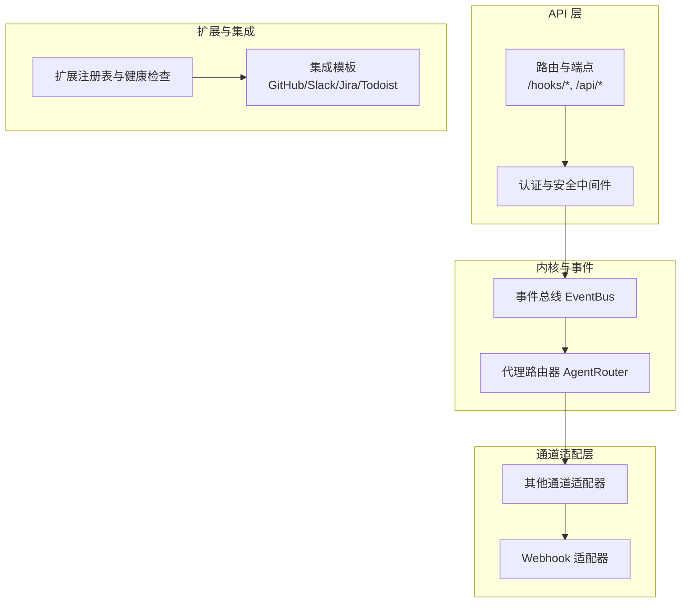
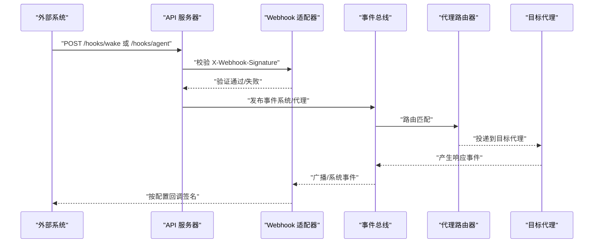
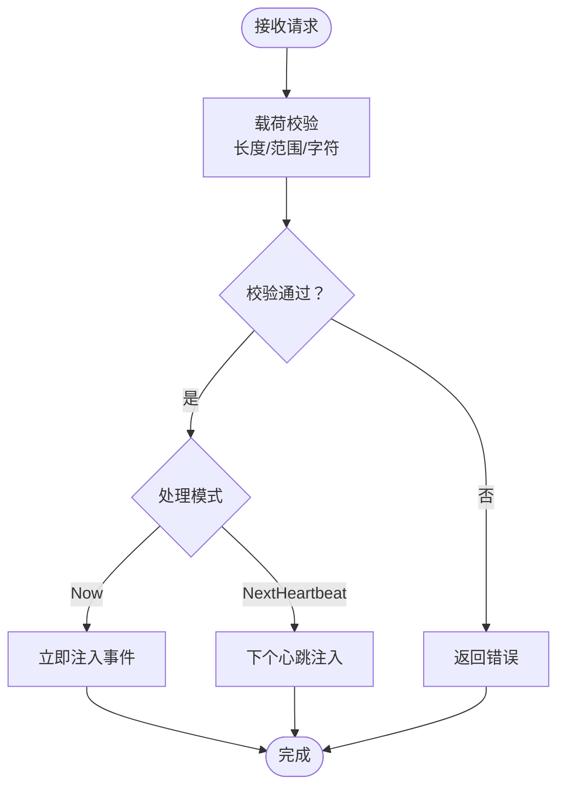
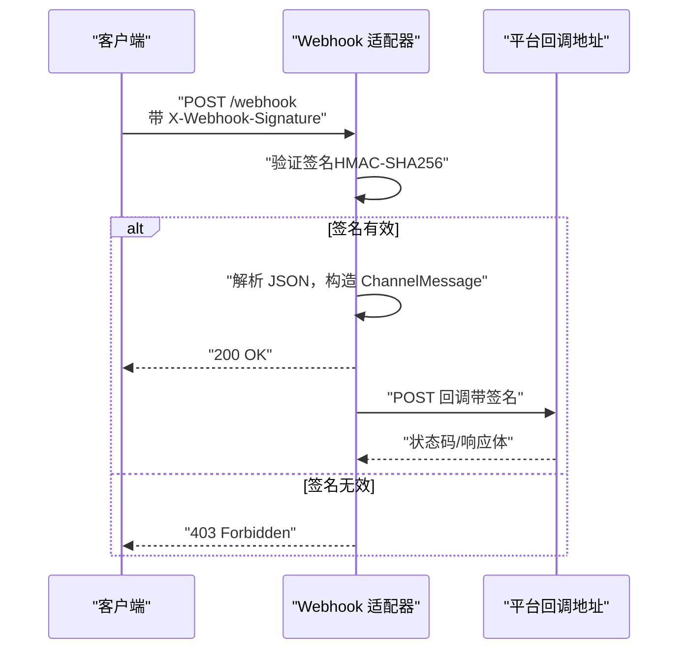
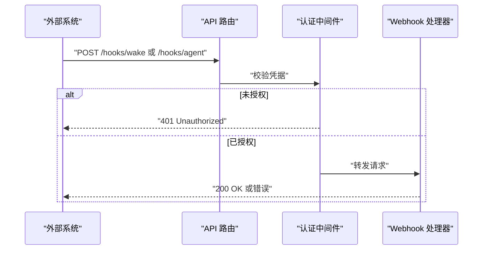
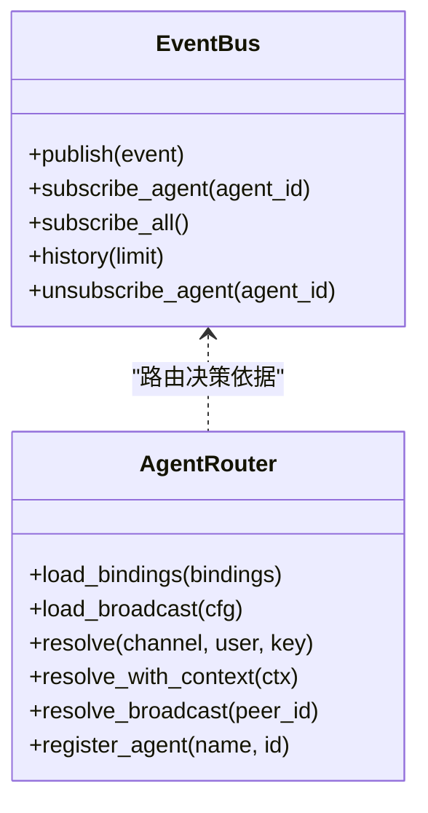
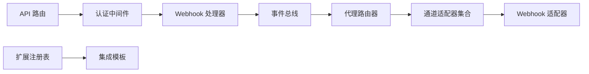

# 第三方集成

<cite>
**本文引用的文件**
- [webhook.rs](file://crates/openfang-types/src/webhook.rs)
- [webhook.rs](file://crates/openfang-channels/src/webhook.rs)
- [routes.rs](file://crates/openfang-api/src/routes.rs)
- [server.rs](file://crates/openfang-api/src/server.rs)
- [middleware.rs](file://crates/openfang-api/src/middleware.rs)
- [event_bus.rs](file://crates/openfang-kernel/src/event_bus.rs)
- [event.rs](file://crates/openfang-types/src/event.rs)
- [types.rs](file://crates/openfang-channels/src/types.rs)
- [router.rs](file://crates/openfang-channels/src/router.rs)
- [lib.rs](file://crates/openfang-channels/src/lib.rs)
- [lib.rs](file://crates/openfang-extensions/src/lib.rs)
- [github.toml](file://crates/openfang-extensions/integrations/github.toml)
- [slack.toml](file://crates/openfang-extensions/integrations/slack.toml)
- [jira.toml](file://crates/openfang-extensions/integrations/jira.toml)
- [todoist.toml](file://crates/openfang-extensions/integrations/todoist.toml)
</cite>

## 目录
1. [简介](#简介)
2. [项目结构](#项目结构)
3. [核心组件](#核心组件)
4. [架构总览](#架构总览)
5. [详细组件分析](#详细组件分析)
6. [依赖关系分析](#依赖关系分析)
7. [性能考量](#性能考量)
8. [故障排查指南](#故障排查指南)
9. [结论](#结论)
10. [附录](#附录)

## 简介
本指南面向需要在 OpenFang 中进行第三方集成的工程师与平台运维人员，系统阐述 Webhook 机制、回调处理、事件订阅与路由策略，并覆盖外部应用通知、实时数据同步、自动化工作流等典型场景。文档同时给出集成协议、数据格式、安全验证机制、与常见第三方服务（支付网关、CRM、项目管理工具）的对接方案，以及安全、认证、加密、访问控制、集成测试、调试与监控、版本兼容与变更处理等实践建议。

## 项目结构
OpenFang 的第三方集成能力由多模块协同实现：
- 类型与事件层：定义统一事件模型、Webhook 触发载荷与通道消息类型。
- 通道适配层：提供多种消息渠道适配器，其中通用 Webhook 适配器支持双向 HTTP/Webhook 集成。
- API 层：暴露 Webhook 触发端点、认证与安全中间件、通道与集成管理接口。
- 内核与路由：通过事件总线与代理路由器实现消息路由与广播。
- 扩展与集成模板：内置 MCP 服务器模板与一键安装能力，覆盖 GitHub、Slack、Jira、Todoist 等。

图表来源
- [server.rs:579-582](file://crates/openfang-api/src/server.rs#L579-L582)
- [routes.rs:10078-10137](file://crates/openfang-api/src/routes.rs#L10078-L10137)
- [event_bus.rs:14-73](file://crates/openfang-kernel/src/event_bus.rs#L14-L73)
- [router.rs:25-140](file://crates/openfang-channels/src/router.rs#L25-L140)
- [webhook.rs:24-64](file://crates/openfang-channels/src/webhook.rs#L24-L64)
- [lib.rs:1-329](file://crates/openfang-extensions/src/lib.rs#L1-L329)

章节来源
- [server.rs:579-582](file://crates/openfang-api/src/server.rs#L579-L582)
- [routes.rs:10078-10137](file://crates/openfang-api/src/routes.rs#L10078-L10137)
- [event_bus.rs:14-73](file://crates/openfang-kernel/src/event_bus.rs#L14-L73)
- [router.rs:25-140](file://crates/openfang-channels/src/router.rs#L25-L140)
- [webhook.rs:24-64](file://crates/openfang-channels/src/webhook.rs#L24-L64)
- [lib.rs:1-329](file://crates/openfang-extensions/src/lib.rs#L1-L329)

## 核心组件
- Webhook 触发载荷与校验
  - WakePayload：用于注入系统事件，支持立即处理或下个心跳周期处理。
  - AgentHookPayload：用于触发独立代理回合，支持目标代理、交付到频道、模型覆盖与超时控制。
  - 载荷长度与字符限制、超时边界、通道名长度限制与严格校验。
- 通用 Webhook 适配器
  - 支持双向集成：入站请求签名验证（HMAC-SHA256），出站消息按需回调。
  - 入站 JSON 结构化消息解析，支持命令式消息识别。
  - 出站消息分片发送与延迟控制，避免速率限制。
- API 路由与 Webhook 端点
  - /hooks/wake：注入系统事件。
  - /hooks/agent：触发独立代理回合。
- 认证与安全中间件
  - 支持 Bearer Token 与 X-API-Key，常量时间比较防时序攻击；可选会话 Cookie 登录。
  - 安全响应头、CORS 策略、请求日志与追踪。
- 事件总线与代理路由
  - 事件总线支持广播、系统事件与历史环形缓冲。
  - 代理路由器支持绑定规则、直接路由、用户默认、频道默认与系统默认，优先级明确。
- 扩展与集成模板
  - 提供 GitHub、Slack、Jira、Todoist 等 MCP 服务器模板，含传输方式、所需环境变量、OAuth 配置与健康检查。

章节来源
- [webhook.rs:5-131](file://crates/openfang-types/src/webhook.rs#L5-L131)
- [webhook.rs:24-368](file://crates/openfang-channels/src/webhook.rs#L24-L368)
- [routes.rs:10078-10137](file://crates/openfang-api/src/routes.rs#L10078-L10137)
- [middleware.rs:54-215](file://crates/openfang-api/src/middleware.rs#L54-L215)
- [event_bus.rs:14-98](file://crates/openfang-kernel/src/event_bus.rs#L14-L98)
- [router.rs:25-341](file://crates/openfang-channels/src/router.rs#L25-L341)
- [lib.rs:146-239](file://crates/openfang-extensions/src/lib.rs#L146-L239)
- [github.toml:1-35](file://crates/openfang-extensions/integrations/github.toml#L1-L35)
- [slack.toml:1-42](file://crates/openfang-extensions/integrations/slack.toml#L1-L42)
- [jira.toml:1-43](file://crates/openfang-extensions/integrations/jira.toml#L1-L43)
- [todoist.toml:1-29](file://crates/openfang-extensions/integrations/todoist.toml#L1-L29)

## 架构总览
OpenFang 的第三方集成采用“事件驱动 + 通道适配 + 统一路由”的架构：
- 外部系统通过 Webhook 或 MCP 服务器接入。
- Webhook 入站经签名验证后转换为统一 ChannelMessage，写入事件总线。
- 事件总线根据目标类型（广播/系统/特定代理）分发，代理路由器决定具体代理实例。
- 出站消息通过通道适配器回传，Webhook 适配器支持回调 URL 与签名回传。

图表来源
- [server.rs:579-582](file://crates/openfang-api/src/server.rs#L579-L582)
- [routes.rs:10078-10137](file://crates/openfang-api/src/routes.rs#L10078-L10137)
- [webhook.rs:187-299](file://crates/openfang-channels/src/webhook.rs#L187-L299)
- [event_bus.rs:35-73](file://crates/openfang-kernel/src/event_bus.rs#L35-L73)
- [router.rs:138-187](file://crates/openfang-channels/src/router.rs#L138-L187)

## 详细组件分析

### Webhook 触发与载荷校验
- WakePayload
  - 文本长度上限、禁止控制字符（除换行）、处理时机（立即/下一心跳）。
- AgentHookPayload
  - 消息长度上限、超时范围、可选交付目标与模型覆盖。
- 校验逻辑
  - 字符串长度与范围检查、通道名长度限制、默认值与序列化兼容性测试完备。

图表来源
- [webhook.rs:68-131](file://crates/openfang-types/src/webhook.rs#L68-L131)

章节来源
- [webhook.rs:5-131](file://crates/openfang-types/src/webhook.rs#L5-L131)

### 通用 Webhook 适配器（入站/出站）
- 入站
  - 监听指定端口与路径，校验 X-Webhook-Signature（HMAC-SHA256）。
  - 解析 JSON 载荷，识别命令式消息，构造统一 ChannelMessage 并推送事件总线。
- 出站
  - 若配置回调 URL，则以相同签名回传；支持消息分片与延迟，避免限流。
- 安全
  - 常量时间签名比较，零化敏感密钥，严格 JSON 解析与错误处理。

图表来源
- [webhook.rs:187-368](file://crates/openfang-channels/src/webhook.rs#L187-L368)

章节来源
- [webhook.rs:24-368](file://crates/openfang-channels/src/webhook.rs#L24-L368)

### API 路由与 Webhook 端点
- /hooks/wake：注入系统事件，支持立即或延后处理。
- /hooks/agent：触发独立代理回合，支持目标代理、交付到频道、模型覆盖与超时。
- 认证中间件：支持 Bearer Token、X-API-Key 与会话 Cookie，常量时间比较，拒绝未授权访问。

图表来源
- [server.rs:579-582](file://crates/openfang-api/src/server.rs#L579-L582)
- [routes.rs:10078-10137](file://crates/openfang-api/src/routes.rs#L10078-L10137)
- [middleware.rs:54-215](file://crates/openfang-api/src/middleware.rs#L54-L215)

章节来源
- [server.rs:579-582](file://crates/openfang-api/src/server.rs#L579-L582)
- [routes.rs:10078-10137](file://crates/openfang-api/src/routes.rs#L10078-L10137)
- [middleware.rs:54-215](file://crates/openfang-api/src/middleware.rs#L54-L215)

### 事件总线与代理路由
- 事件总线
  - 广播/系统/特定代理/模式匹配；维护历史环形缓冲，便于审计与回溯。
- 代理路由
  - 绑定规则（最具体优先）> 直接路由 > 用户默认 > 频道默认 > 系统默认。
  - 支持广播策略与多代理并行路由。

图表来源
- [event_bus.rs:14-98](file://crates/openfang-kernel/src/event_bus.rs#L14-L98)
- [router.rs:25-341](file://crates/openfang-channels/src/router.rs#L25-L341)

章节来源
- [event_bus.rs:14-98](file://crates/openfang-kernel/src/event_bus.rs#L14-L98)
- [router.rs:25-341](file://crates/openfang-channels/src/router.rs#L25-L341)

### 通道类型与内容模型
- ChannelType：Telegram、Discord、Slack、WhatsApp、Signal、Matrix、Email、Teams、Mattermost、WebChat、CLI、自定义。
- ChannelContent：文本、图片、文件、语音、位置、命令。
- ChannelMessage：统一消息载体，携带元数据、线程 ID、是否群聊等。

章节来源
- [types.rs:12-96](file://crates/openfang-channels/src/types.rs#L12-L96)

### 扩展与集成模板
- 集成模板结构：传输方式（stdio/SSE）、所需环境变量、OAuth 配置、健康检查、标签与分类。
- 示例模板：GitHub（MCP）、Slack（MCP）、Jira（Atlassian MCP）、Todoist（MCP）。
- 扩展注册表：提供安装、重连、健康监控与一键添加能力。

章节来源
- [lib.rs:146-239](file://crates/openfang-extensions/src/lib.rs#L146-L239)
- [github.toml:1-35](file://crates/openfang-extensions/integrations/github.toml#L1-L35)
- [slack.toml:1-42](file://crates/openfang-extensions/integrations/slack.toml#L1-L42)
- [jira.toml:1-43](file://crates/openfang-extensions/integrations/jira.toml#L1-L43)
- [todoist.toml:1-29](file://crates/openfang-extensions/integrations/todoist.toml#L1-L29)

## 依赖关系分析
- API 层依赖认证中间件与路由处理器，路由处理器进一步依赖事件总线与代理路由器。
- 通道适配层与扩展层相互独立，但共同服务于统一事件模型与路由策略。
- Webhook 适配器既作为入站网关，也可作为出站回调端点，形成闭环。

图表来源
- [server.rs:579-582](file://crates/openfang-api/src/server.rs#L579-L582)
- [middleware.rs:54-215](file://crates/openfang-api/src/middleware.rs#L54-L215)
- [routes.rs:10078-10137](file://crates/openfang-api/src/routes.rs#L10078-L10137)
- [event_bus.rs:14-73](file://crates/openfang-kernel/src/event_bus.rs#L14-L73)
- [router.rs:25-140](file://crates/openfang-channels/src/router.rs#L25-L140)
- [lib.rs:1-329](file://crates/openfang-extensions/src/lib.rs#L1-L329)

章节来源
- [server.rs:579-582](file://crates/openfang-api/src/server.rs#L579-L582)
- [middleware.rs:54-215](file://crates/openfang-api/src/middleware.rs#L54-L215)
- [routes.rs:10078-10137](file://crates/openfang-api/src/routes.rs#L10078-L10137)
- [event_bus.rs:14-73](file://crates/openfang-kernel/src/event_bus.rs#L14-L73)
- [router.rs:25-140](file://crates/openfang-channels/src/router.rs#L25-L140)
- [lib.rs:1-329](file://crates/openfang-extensions/src/lib.rs#L1-L329)

## 性能考量
- 消息分片与延迟：长消息自动分片并插入微小延迟，降低下游限流风险。
- 事件总线容量：广播通道与历史缓冲大小可控，避免内存膨胀。
- 路由优先级：绑定规则排序与缓存减少匹配开销。
- 认证与安全中间件：常量时间比较与最小化日志开销，避免成为瓶颈。

## 故障排查指南
- Webhook 签名失败
  - 检查共享密钥一致性与请求体完整性；确认 X-Webhook-Signature 头正确传递。
- 回调失败
  - 查看回调 URL 返回状态码与响应体；关注网络连通性与平台限流。
- 路由不生效
  - 检查绑定规则优先级与用户/频道默认设置；确认代理名称缓存与 UUID 一致性。
- 认证失败
  - 确认 Bearer Token/X-API-Key 与会话 Cookie；注意常量时间比较导致的潜在误判。
- 事件未到达
  - 检查事件总线订阅与目标类型；查看历史缓冲与 TTL 设置。

章节来源
- [webhook.rs:100-112](file://crates/openfang-channels/src/webhook.rs#L100-L112)
- [router.rs:138-187](file://crates/openfang-channels/src/router.rs#L138-L187)
- [middleware.rs:159-215](file://crates/openfang-api/src/middleware.rs#L159-L215)
- [event_bus.rs:89-98](file://crates/openfang-kernel/src/event_bus.rs#L89-L98)

## 结论
OpenFang 的第三方集成以统一事件模型为核心，结合 Webhook 适配器与 MCP 服务器模板，提供了灵活、安全且可扩展的外部系统接入能力。通过严格的认证与安全中间件、完善的路由与广播策略，以及可热加载的配置与扩展机制，能够满足从外部通知、实时同步到复杂自动化工作流的多样化需求。

## 附录

### 集成场景与最佳实践
- 外部应用通知
  - 使用 /hooks/wake 注入系统事件，配合事件总线与代理路由实现即时响应。
- 实时数据同步
  - Webhook 入站 + 事件总线 + 代理工具链，实现数据拉取、清洗与存储。
- 自动化工作流
  - 通过 /hooks/agent 触发独立代理回合，结合 MCP 工具与通道适配器完成跨系统编排。

### 协议与数据格式
- Webhook 入站 JSON 字段
  - 必填：message；可选：sender_id、sender_name、thread_id、is_group、metadata。
- Webhook 出站 JSON 字段
  - 必填：sender_id、sender_name、recipient_id、recipient_name、message、timestamp。
- 认证头
  - X-Webhook-Signature：sha256=<hex>；Authorization: Bearer <token> 或 X-API-Key。

章节来源
- [webhook.rs:36-51](file://crates/openfang-channels/src/webhook.rs#L36-L51)
- [webhook.rs:323-330](file://crates/openfang-channels/src/webhook.rs#L323-L330)
- [middleware.rs:145-182](file://crates/openfang-api/src/middleware.rs#L145-L182)

### 安全与访问控制
- 签名验证：HMAC-SHA256，常量时间比较。
- 认证：Bearer Token、X-API-Key、会话 Cookie，支持白名单与 CORS 限制。
- 响应头：XSS/Frame/STS/Referrer/Cache-Control 等强化安全。
- 凭据管理：扩展注册表支持凭证加密存储与 OAuth 流程。

章节来源
- [webhook.rs:85-112](file://crates/openfang-channels/src/webhook.rs#L85-L112)
- [middleware.rs:232-259](file://crates/openfang-api/src/middleware.rs#L232-L259)
- [lib.rs:1-329](file://crates/openfang-extensions/src/lib.rs#L1-L329)

### 常见第三方服务对接方案
- GitHub
  - MCP 服务器模板，支持仓库、问题、拉取请求与组织访问；需 PAT。
- Slack
  - MCP 服务器模板，支持频道、消息与用户访问；需 Bot Token 与 Team ID。
- Jira
  - Atlassian MCP 服务器模板，支持问题、项目、看板与冲刺；需 API Token 与实例 URL。
- Todoist
  - MCP 服务器模板，支持任务、项目与标签；需 API Key。

章节来源
- [github.toml:1-35](file://crates/openfang-extensions/integrations/github.toml#L1-L35)
- [slack.toml:1-42](file://crates/openfang-extensions/integrations/slack.toml#L1-L42)
- [jira.toml:1-43](file://crates/openfang-extensions/integrations/jira.toml#L1-L43)
- [todoist.toml:1-29](file://crates/openfang-extensions/integrations/todoist.toml#L1-L29)

### 集成测试与调试
- 集成测试
  - 使用 Webhook 适配器本地回环测试，验证签名计算与验证、JSON 解析与错误处理。
  - 通过 /api/health 与 /api/status 检查服务健康与运行状态。
- 调试工具
  - 请求日志中间件输出请求 ID、路径、状态与耗时；事件总线历史便于回溯。
  - SSE 日志流与 Prometheus 指标端点辅助运行时观测。

章节来源
- [webhook.rs:370-478](file://crates/openfang-channels/src/webhook.rs#L370-L478)
- [middleware.rs:17-44](file://crates/openfang-api/src/middleware.rs#L17-L44)
- [server.rs:128-131](file://crates/openfang-api/src/server.rs#L128-L131)

### 版本兼容与变更处理
- 向后兼容
  - 载荷默认值与序列化兼容性测试覆盖；通道适配器接口稳定。
- API 变更
  - 严格遵循最小变更原则；新增端点与中间件不影响既有行为。
- 配置热重载
  - 通道与集成配置支持热重载，减少停机时间。

章节来源
- [webhook.rs:356-420](file://crates/openfang-types/src/webhook.rs#L356-L420)
- [server.rs:728-757](file://crates/openfang-api/src/server.rs#L728-L757)
- [lib.rs:1-329](file://crates/openfang-extensions/src/lib.rs#L1-L329)