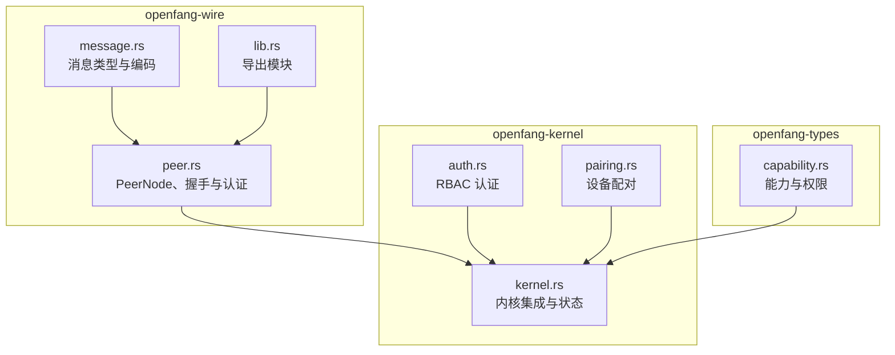
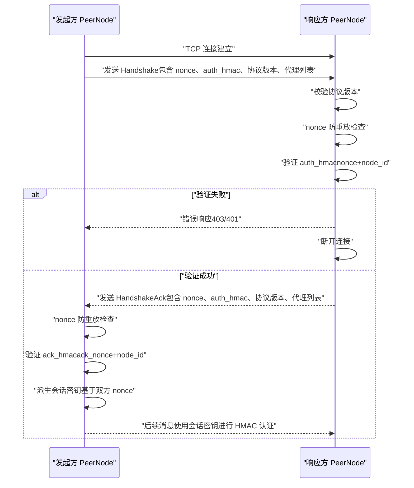
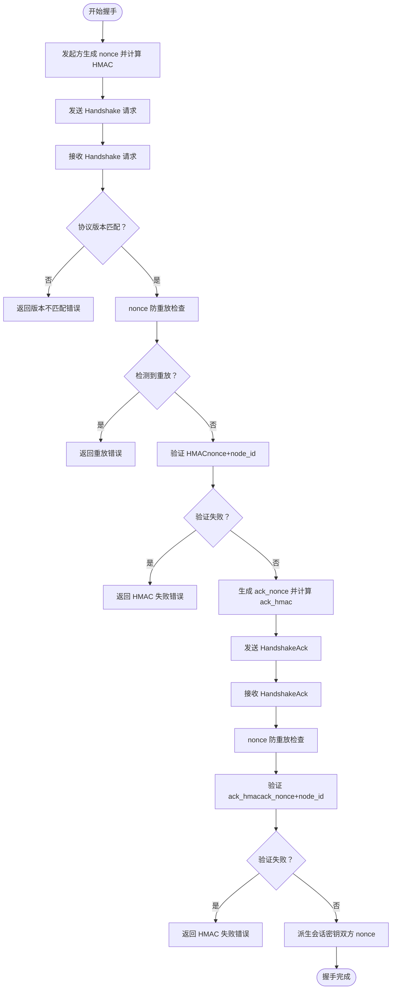
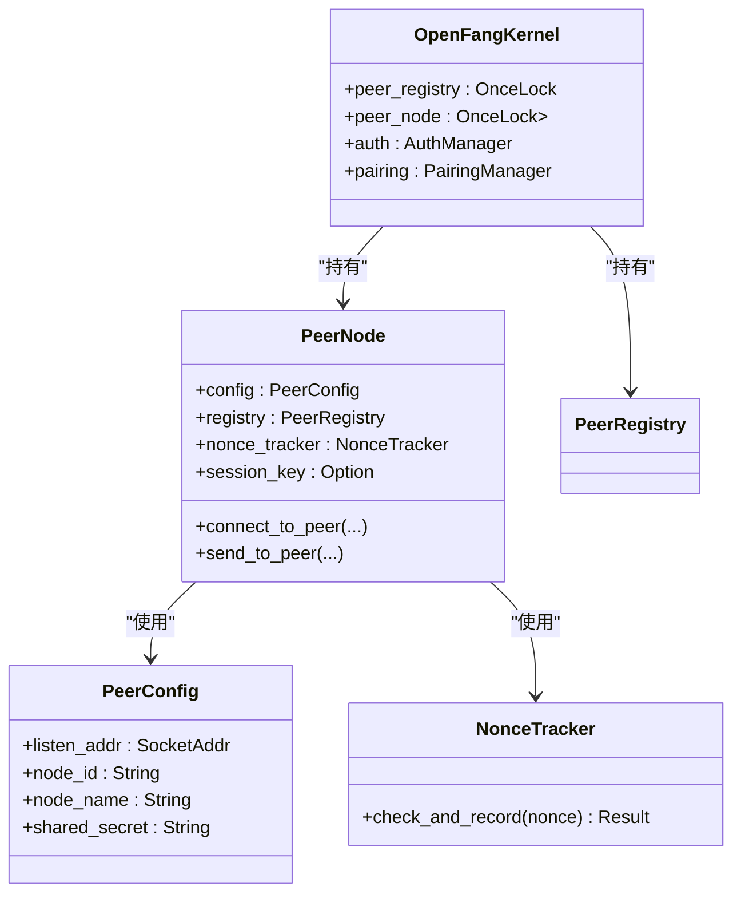

# OFP 互认证协议

<cite>
**本文档引用的文件**
- [crates/openfang-wire/src/message.rs](file://crates/openfang-wire/src/message.rs)
- [crates/openfang-wire/src/peer.rs](file://crates/openfang-wire/src/peer.rs)
- [crates/openfang-wire/src/lib.rs](file://crates/openfang-wire/src/lib.rs)
- [crates/openfang-kernel/src/kernel.rs](file://crates/openfang-kernel/src/kernel.rs)
- [crates/openfang-kernel/src/auth.rs](file://crates/openfang-kernel/src/auth.rs)
- [crates/openfang-kernel/src/pairing.rs](file://crates/openfang-kernel/src/pairing.rs)
- [crates/openfang-types/src/capability.rs](file://crates/openfang-types/src/capability.rs)
</cite>

## 目录
1. [简介](#简介)
2. [项目结构](#项目结构)
3. [核心组件](#核心组件)
4. [架构总览](#架构总览)
5. [详细组件分析](#详细组件分析)
6. [依赖关系分析](#依赖关系分析)
7. [性能考虑](#性能考虑)
8. [故障排除指南](#故障排除指南)
9. [结论](#结论)
10. [附录](#附录)

## 简介
本文件系统性阐述 OpenFang 的 OFP（OpenFang Wire Protocol）互认证协议，重点覆盖以下方面：
- 基于 HMAC-SHA256 的预共享密钥认证机制
- 握手协议流程：发起方 nonce 生成、响应方验证、确认方回执
- HMAC 签名算法与常量时间比较，防止时序攻击
- 握手消息结构：Handshake、HandshakeAck 包含 node_id、node_name、protocol_version、agents、nonce、auth_hmac
- 协议版本检查与消息大小限制
- 认证失败处理、重放攻击防护、安全配置要求
- OFP 协议在节点发现、代理通信、分布式部署中的应用场景与实现要点

## 项目结构
OFP 协议位于 openfang-wire 子系统，负责跨机器的代理发现、认证与通信；kernel 将其集成到主内核中，并通过 API 暴露网络状态。

**图表来源**
- [crates/openfang-wire/src/message.rs:1-293](file://crates/openfang-wire/src/message.rs#L1-L293)
- [crates/openfang-wire/src/peer.rs:1-200](file://crates/openfang-wire/src/peer.rs#L1-L200)
- [crates/openfang-wire/src/lib.rs:1-20](file://crates/openfang-wire/src/lib.rs#L1-L20)
- [crates/openfang-kernel/src/kernel.rs:140-165](file://crates/openfang-kernel/src/kernel.rs#L140-L165)
- [crates/openfang-types/src/capability.rs:146-187](file://crates/openfang-types/src/capability.rs#L146-L187)

**章节来源**
- [crates/openfang-wire/src/lib.rs:1-20](file://crates/openfang-wire/src/lib.rs#L1-L20)
- [crates/openfang-kernel/src/kernel.rs:140-165](file://crates/openfang-kernel/src/kernel.rs#L140-L165)

## 核心组件
- WireMessage/WireRequest/WireResponse：统一的消息模型，支持请求、响应与通知三类消息，采用 JSON 编码并以 4 字节长度前缀帧式传输。
- PeerNode：本地网络节点，负责监听入站连接、主动连接远端节点、执行握手与认证、进入消息分发循环。
- PeerConfig：节点配置，包含监听地址、节点 ID/名称、预共享密钥等。
- NonceTracker：基于时间窗口的 nonce 追踪器，用于防重放攻击。
- HMAC-SHA256：使用预共享密钥对数据进行签名与验证，采用常量时间比较避免时序侧信道。

**章节来源**
- [crates/openfang-wire/src/message.rs:1-293](file://crates/openfang-wire/src/message.rs#L1-L293)
- [crates/openfang-wire/src/peer.rs:1-200](file://crates/openfang-wire/src/peer.rs#L1-L200)
- [crates/openfang-wire/src/peer.rs:28-88](file://crates/openfang-wire/src/peer.rs#L28-L88)
- [crates/openfang-wire/src/peer.rs:107-122](file://crates/openfang-wire/src/peer.rs#L107-L122)

## 架构总览
OFP 在节点间建立 TCP 连接后，先进行基于 HMAC-SHA256 的双向认证握手，随后进入消息分发循环。所有消息均以 JSON 帧式传输，支持最大单条消息大小限制。

**图表来源**
- [crates/openfang-wire/src/peer.rs:240-294](file://crates/openfang-wire/src/peer.rs#L240-L294)
- [crates/openfang-wire/src/peer.rs:500-647](file://crates/openfang-wire/src/peer.rs#L500-L647)

## 详细组件分析

### 握手协议与认证流程
- 发起方（客户端）生成随机 nonce，计算 HMAC-SHA256 并随 Handshake 请求发送；同时携带协议版本与本地代理信息。
- 响应方（服务端）收到请求后：
  - 检查协议版本是否匹配；
  - 使用 NonceTracker 检测 nonce 是否重复；
  - 使用预共享密钥对“收到的 nonce + 自身 node_id”进行 HMAC 验证；
  - 若验证通过，生成自己的 nonce 与 HMAC，返回 HandshakeAck；
  - 否则返回错误响应并断开连接。
- 发起方收到 HandshakeAck 后：
  - 再次检查 nonce 防重放；
  - 验证 ack_hmac（ack_nonce + 对端 node_id）；
  - 派生会话密钥（基于双方 nonce），用于后续消息的 HMAC 认证。

**图表来源**
- [crates/openfang-wire/src/peer.rs:240-294](file://crates/openfang-wire/src/peer.rs#L240-L294)
- [crates/openfang-wire/src/peer.rs:500-647](file://crates/openfang-wire/src/peer.rs#L500-L647)

**章节来源**
- [crates/openfang-wire/src/peer.rs:240-294](file://crates/openfang-wire/src/peer.rs#L240-L294)
- [crates/openfang-wire/src/peer.rs:500-647](file://crates/openfang-wire/src/peer.rs#L500-L647)

### 消息结构与协议版本
- 握手消息（Handshake）字段：
  - node_id：对端唯一标识
  - node_name：对端人类可读名称
  - protocol_version：协议版本号
  - agents：对端可用代理列表
  - nonce：随机数，用于 HMAC 认证
  - auth_hmac：HMAC-SHA256（预共享密钥，数据为 nonce+node_id）
- 握手确认（HandshakeAck）字段：
  - node_id、node_name、protocol_version、agents
  - nonce：随机数
  - auth_hmac：HMAC-SHA256（预共享密钥，数据为 nonce+node_id）

协议版本常量与消息编解码逻辑由消息模块提供，确保版本一致性与序列化正确性。

**章节来源**
- [crates/openfang-wire/src/message.rs:33-117](file://crates/openfang-wire/src/message.rs#L33-L117)
- [crates/openfang-wire/src/message.rs:151-172](file://crates/openfang-wire/src/message.rs#L151-L172)

### HMAC 签名与常量时间比较
- HMAC-SHA256 使用预共享密钥对指定数据进行签名，输出十六进制字符串。
- 验证采用常量时间比较，避免时序侧信道泄露，降低时序攻击风险。
- 会话密钥派生：基于双方 nonce 计算 HMAC-SHA256，确保每次连接的会话密钥唯一。

**章节来源**
- [crates/openfang-wire/src/peer.rs:77-88](file://crates/openfang-wire/src/peer.rs#L77-L88)
- [crates/openfang-wire/src/peer.rs:806-814](file://crates/openfang-wire/src/peer.rs#L806-L814)

### 非法消息与未认证请求处理
- 任何非 Handshake 的初始消息将被拒绝，并返回“需要先完成 HMAC 握手”的错误。
- 这一策略确保只有通过认证的连接才能继续发送业务消息。

**章节来源**
- [crates/openfang-wire/src/peer.rs:608-629](file://crates/openfang-wire/src/peer.rs#L608-L629)

### 重放攻击防护
- NonceTracker 维护一个固定时间窗口内的已见 nonce 集合，过期自动清理。
- 握手阶段双方均对收到的 nonce 执行防重放检查，一旦检测到重放即返回错误并断开连接。

**章节来源**
- [crates/openfang-wire/src/peer.rs:28-69](file://crates/openfang-wire/src/peer.rs#L28-L69)
- [crates/openfang-wire/src/peer.rs:276-279](file://crates/openfang-wire/src/peer.rs#L276-L279)
- [crates/openfang-wire/src/peer.rs:529-540](file://crates/openfang-wire/src/peer.rs#L529-L540)

### 协议版本检查与消息大小限制
- 协议版本必须严格匹配，否则返回版本不匹配错误。
- 单条消息最大大小限制为 16MB，超过将触发“消息过大”错误。

**章节来源**
- [crates/openfang-wire/src/peer.rs:269-274](file://crates/openfang-wire/src/peer.rs#L269-L274)
- [crates/openfang-wire/src/peer.rs:402-407](file://crates/openfang-wire/src/peer.rs#L402-L407)
- [crates/openfang-wire/src/peer.rs:511-527](file://crates/openfang-wire/src/peer.rs#L511-L527)
- [crates/openfang-wire/src/peer.rs:107-108](file://crates/openfang-wire/src/peer.rs#L107-L108)

### 安全配置要求
- 必须配置预共享密钥（PeerConfig.shared_secret），否则 OFP 拒绝启动。
- 建议：
  - 密钥长度足够长且随机，定期轮换
  - 仅在受信任网络或通过安全通道（如 VPN）部署
  - 限制监听地址与端口，避免暴露至公网
  - 结合内核的 RBAC 与能力控制，最小权限原则

**章节来源**
- [crates/openfang-wire/src/peer.rs:119-122](file://crates/openfang-wire/src/peer.rs#L119-L122)
- [crates/openfang-wire/src/peer.rs:184-188](file://crates/openfang-wire/src/peer.rs#L184-L188)

### 应用场景与实现示例
- 节点发现：通过 HandshakeAck 中的 agents 字段同步远端代理清单，便于按需路由与调度。
- 代理通信：握手完成后，后续消息使用会话密钥进行 HMAC 认证，确保机密性与完整性。
- 分布式部署：多节点通过 OFP 形成网格，结合内核的注册表与事件总线，实现跨节点协作。

**章节来源**
- [crates/openfang-wire/src/message.rs:76-117](file://crates/openfang-wire/src/message.rs#L76-L117)
- [crates/openfang-wire/src/peer.rs:562-606](file://crates/openfang-wire/src/peer.rs#L562-L606)

## 依赖关系分析
OFP 与内核的集成点：
- 内核持有 OnceLock 初始化的 PeerRegistry 与 PeerNode，用于维护连接状态与节点信息。
- 内核还集成了 RBAC 与设备配对等安全能力，与 OFP 的预共享密钥认证共同构成纵深防御。

**图表来源**
- [crates/openfang-wire/src/peer.rs:110-174](file://crates/openfang-wire/src/peer.rs#L110-L174)
- [crates/openfang-kernel/src/kernel.rs:144-147](file://crates/openfang-kernel/src/kernel.rs#L144-L147)

**章节来源**
- [crates/openfang-kernel/src/kernel.rs:144-147](file://crates/openfang-kernel/src/kernel.rs#L144-L147)

## 性能考虑
- 握手阶段仅进行一次 HMAC 计算与一次 JSON 序列化，开销极低。
- 消息大小限制为 16MB，适合大文本与工具调用结果传输。
- 建议：
  - 控制并发连接数量，避免资源耗尽
  - 对频繁的代理查询使用本地缓存与去重
  - 合理设置监听地址与端口，减少不必要的连接

## 故障排除指南
常见问题与处理建议：
- 握手失败（401/403）：检查预共享密钥是否一致、是否已过期、nonce 是否重复
- 版本不匹配：确保两端协议版本一致
- 消息过大：拆分消息或调整业务逻辑
- 重放攻击：检查 nonce 时间窗口与去重策略

**章节来源**
- [crates/openfang-wire/src/peer.rs:97-105](file://crates/openfang-wire/src/peer.rs#L97-L105)
- [crates/openfang-wire/src/peer.rs:276-279](file://crates/openfang-wire/src/peer.rs#L276-L279)
- [crates/openfang-wire/src/peer.rs:529-540](file://crates/openfang-wire/src/peer.rs#L529-L540)

## 结论
OFP 通过预共享密钥与 HMAC-SHA256 实现强健的互认证，配合 nonce 防重放与常量时间比较，有效抵御多种攻击。握手流程简洁高效，消息模型统一，适用于节点发现、代理通信与分布式部署等多种场景。结合内核的 RBAC 与能力控制，可进一步提升整体安全性与可控性。

## 附录
- 协议版本：当前版本常量为 1
- 最大消息大小：16MB
- 配置项：PeerConfig.shared_secret 必填

**章节来源**
- [crates/openfang-wire/src/message.rs:151-152](file://crates/openfang-wire/src/message.rs#L151-L152)
- [crates/openfang-wire/src/peer.rs:107-108](file://crates/openfang-wire/src/peer.rs#L107-L108)
- [crates/openfang-wire/src/peer.rs:119-122](file://crates/openfang-wire/src/peer.rs#L119-L122)