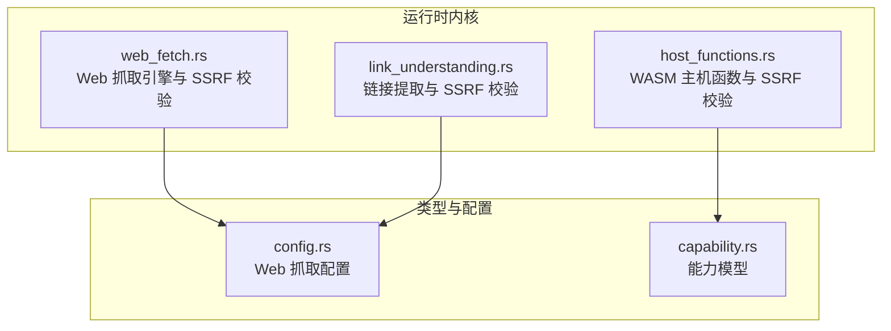
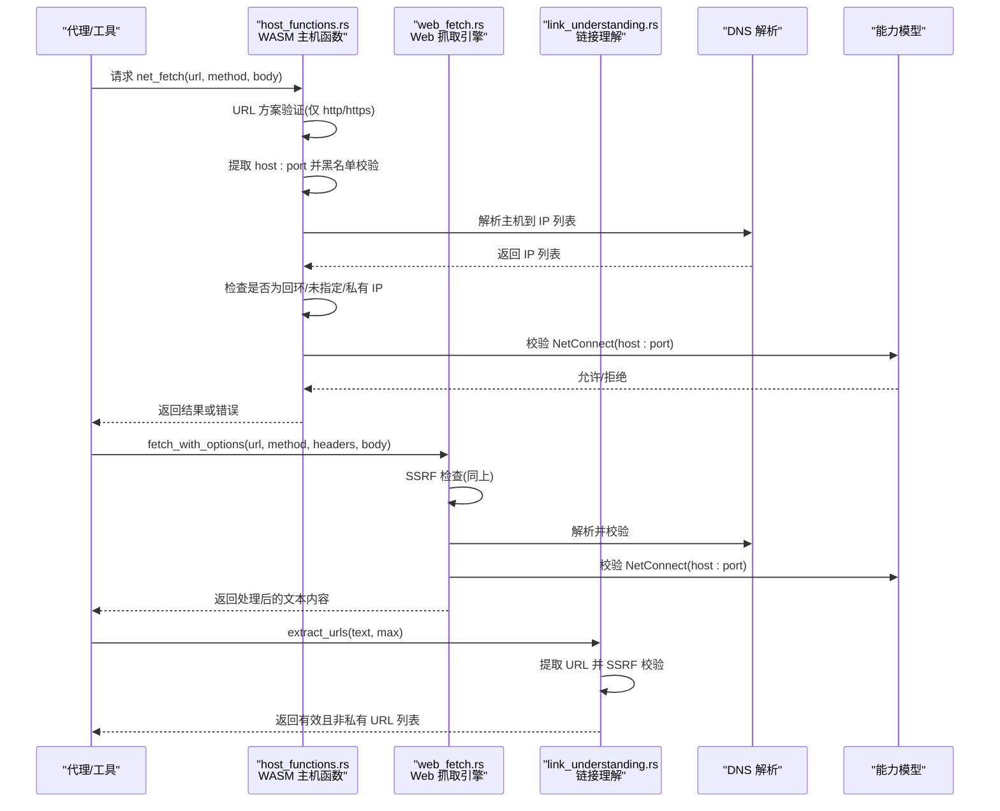
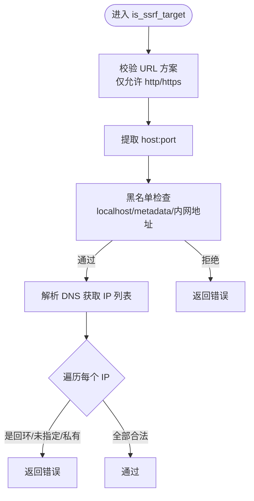
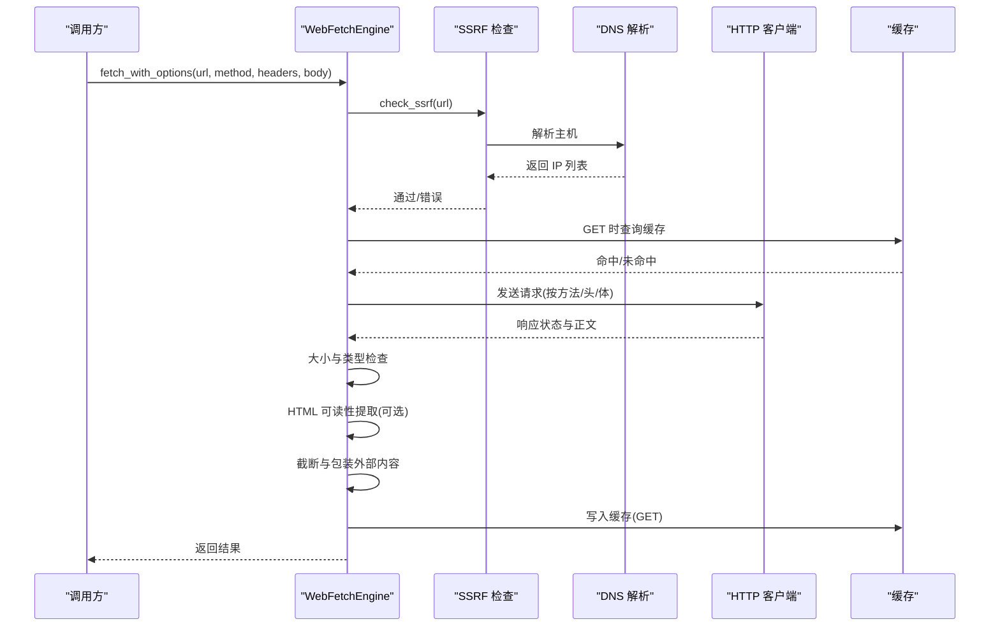
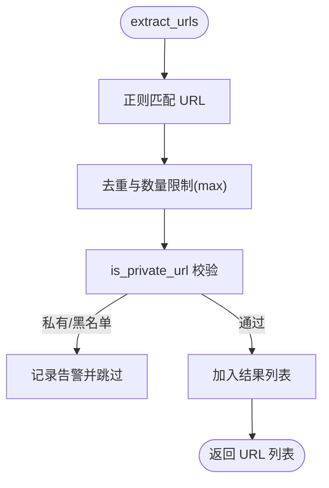
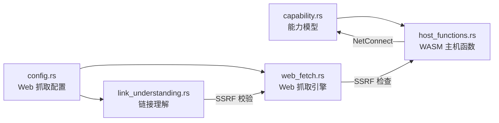

# SSRF 防护机制

<cite>
**本文档引用的文件**
- [host_functions.rs](file://crates/openfang-runtime/src/host_functions.rs)
- [web_fetch.rs](file://crates/openfang-runtime/src/web_fetch.rs)
- [link_understanding.rs](file://crates/openfang-runtime/src/link_understanding.rs)
- [config.rs](file://crates/openfang-types/src/config.rs)
- [capability.rs](file://crates/openfang-types/src/capability.rs)
- [SECURITY.md](file://SECURITY.md)
- [README.md](file://README.md)
</cite>

## 目录
1. [简介](#简介)
2. [项目结构](#项目结构)
3. [核心组件](#核心组件)
4. [架构总览](#架构总览)
5. [详细组件分析](#详细组件分析)
6. [依赖关系分析](#依赖关系分析)
7. [性能考量](#性能考量)
8. [故障排除指南](#故障排除指南)
9. [结论](#结论)
10. [附录](#附录)

## 简介
本文件系统性阐述 OpenFang 的服务器端请求伪造（SSRF）防护机制，覆盖 URL 方案验证、主机名黑名单、DNS 解析后 IP 地址验证（含私有地址范围检测）、主机提取算法、IPv4/IPv6 私有地址识别规则、DNS 重绑定攻击防护，以及网络请求拦截流程、错误处理机制与安全配置选项。同时给出 SSRF 防护在 Web 抓取、API 调用、外部服务集成中的应用示例。

## 项目结构
OpenFang 将 SSRF 防护分布在运行时内核与类型定义中：
- 运行时内核：提供 WASM 沙箱内的网络访问控制与 Web 抓取管道的安全检查
- 类型定义：提供能力模型与配置项，支撑 SSRF 防护的策略落地

图表来源
- [host_functions.rs:1-669](file://crates/openfang-runtime/src/host_functions.rs#L1-L669)
- [web_fetch.rs:1-378](file://crates/openfang-runtime/src/web_fetch.rs#L1-L378)
- [link_understanding.rs:1-241](file://crates/openfang-runtime/src/link_understanding.rs#L1-L241)
- [config.rs:284-307](file://crates/openfang-types/src/config.rs#L284-L307)
- [capability.rs:10-72](file://crates/openfang-types/src/capability.rs#L10-L72)

章节来源
- [host_functions.rs:123-160](file://crates/openfang-runtime/src/host_functions.rs#L123-L160)
- [web_fetch.rs:188-235](file://crates/openfang-runtime/src/web_fetch.rs#L188-L235)
- [link_understanding.rs:54-104](file://crates/openfang-runtime/src/link_understanding.rs#L54-L104)

## 核心组件
- URL 方案验证：仅允许 http/https，拒绝 file/gopher/ftp 等非外网协议
- 主机名黑名单：阻止 localhost、metadata 服务域名与常见内网地址
- DNS 解析与 IP 校验：解析目标主机到所有 IP，逐一检查是否为回环/未指定/私有地址
- 主机提取算法：从 URL 中提取 host:port，支持 IPv6 带括号表示法
- 私有地址识别：IPv4 RFC1918 与部分 IPv6（ULA/Link-local）判定
- DNS 重绑定防护：通过“解析后 IP 校验”而非仅基于主机名判断
- 能力门控：结合 NetConnect 能力，限制可访问的目标主机
- 配置化参数：最大字符数、响应大小上限、超时、可选 HTML 可读性提取

章节来源
- [host_functions.rs:123-160](file://crates/openfang-runtime/src/host_functions.rs#L123-L160)
- [web_fetch.rs:188-252](file://crates/openfang-runtime/src/web_fetch.rs#L188-L252)
- [link_understanding.rs:54-104](file://crates/openfang-runtime/src/link_understanding.rs#L54-L104)
- [config.rs:284-307](file://crates/openfang-types/src/config.rs#L284-L307)
- [capability.rs:19-23](file://crates/openfang-types/src/capability.rs#L19-L23)

## 架构总览
下图展示 SSRF 防护在不同入口处的拦截流程与相互关系：

图表来源
- [host_functions.rs:271-328](file://crates/openfang-runtime/src/host_functions.rs#L271-L328)
- [web_fetch.rs:46-166](file://crates/openfang-runtime/src/web_fetch.rs#L46-L166)
- [link_understanding.rs:21-52](file://crates/openfang-runtime/src/link_understanding.rs#L21-L52)

## 详细组件分析

### 组件 A：WASM 主机函数中的 SSRF 校验（host_functions.rs）
- 功能要点
  - URL 方案验证：仅允许 http/https
  - 主机提取：支持 IPv6 带括号 host:port
  - 黑名单：localhost、metadata 服务域名、特定内网地址
  - DNS 解析：对每个解析出的 IP 进行回环/未指定/私有地址检查
  - 错误返回：统一以 JSON 结构返回错误信息
  - 能力门控：基于 NetConnect(host:port) 进行访问控制

图表来源
- [host_functions.rs:123-160](file://crates/openfang-runtime/src/host_functions.rs#L123-L160)
- [host_functions.rs:314-328](file://crates/openfang-runtime/src/host_functions.rs#L314-L328)

章节来源
- [host_functions.rs:123-160](file://crates/openfang-runtime/src/host_functions.rs#L123-L160)
- [host_functions.rs:271-328](file://crates/openfang-runtime/src/host_functions.rs#L271-L328)

### 组件 B：Web 抓取引擎中的 SSRF 校验（web_fetch.rs）
- 功能要点
  - 在发送任何网络请求前执行 SSRF 检查
  - 支持 GET/POST/PUT/PATCH/DELETE 方法
  - 对 HTML 内容进行可读性提取（可配置）
  - 响应大小与字符数限制，防止资源滥用
  - 缓存命中直接返回，减少重复请求
  - IPv6 带括号的 host:port 提取与默认端口推断

图表来源
- [web_fetch.rs:46-166](file://crates/openfang-runtime/src/web_fetch.rs#L46-L166)
- [web_fetch.rs:188-252](file://crates/openfang-runtime/src/web_fetch.rs#L188-L252)

章节来源
- [web_fetch.rs:46-166](file://crates/openfang-runtime/src/web_fetch.rs#L46-L166)
- [web_fetch.rs:188-252](file://crates/openfang-runtime/src/web_fetch.rs#L188-L252)

### 组件 C：链接理解中的 SSRF 校验（link_understanding.rs）
- 功能要点
  - 从消息文本中提取 URL（正则）
  - 去重与数量限制
  - 对每个 URL 执行 SSRF 校验（黑名单+私有范围）
  - 记录被拒绝的私有/SSRF URL 并告警

图表来源
- [link_understanding.rs:21-52](file://crates/openfang-runtime/src/link_understanding.rs#L21-L52)
- [link_understanding.rs:54-104](file://crates/openfang-runtime/src/link_understanding.rs#L54-L104)

章节来源
- [link_understanding.rs:21-52](file://crates/openfang-runtime/src/link_understanding.rs#L21-L52)
- [link_understanding.rs:54-104](file://crates/openfang-runtime/src/link_understanding.rs#L54-L104)

### 组件 D：能力模型与访问控制（capability.rs）
- NetConnect 能力用于限制代理可访问的主机与端口
- 支持通配符与模式匹配，确保最小权限原则
- 子代理能力必须受父代理授权，防止越权

章节来源
- [capability.rs:19-23](file://crates/openfang-types/src/capability.rs#L19-L23)
- [capability.rs:106-166](file://crates/openfang-types/src/capability.rs#L106-L166)

### 组件 E：安全配置项（config.rs）
- WebFetchConfig：最大字符数、响应大小上限、超时、可选 HTML 可读性提取
- clamp_bounds：生产环境边界约束，避免极端配置导致运行时问题

章节来源
- [config.rs:284-307](file://crates/openfang-types/src/config.rs#L284-L307)
- [config.rs:3477-3509](file://crates/openfang-types/src/config.rs#L3477-L3509)

## 依赖关系分析
- host_functions.rs 与 capability.rs：WASM 沙箱内的网络访问受 NetConnect 能力约束
- web_fetch.rs 与 config.rs：Web 抓取行为由配置驱动，包含 SSRF 检查前置
- link_understanding.rs 与 config.rs：链接提取与 SSRF 校验在消息处理阶段生效

图表来源
- [capability.rs:10-72](file://crates/openfang-types/src/capability.rs#L10-L72)
- [host_functions.rs:288-291](file://crates/openfang-runtime/src/host_functions.rs#L288-L291)
- [web_fetch.rs:55-56](file://crates/openfang-runtime/src/web_fetch.rs#L55-L56)
- [link_understanding.rs:39-43](file://crates/openfang-runtime/src/link_understanding.rs#L39-L43)

章节来源
- [capability.rs:10-72](file://crates/openfang-types/src/capability.rs#L10-L72)
- [host_functions.rs:288-291](file://crates/openfang-runtime/src/host_functions.rs#L288-L291)
- [web_fetch.rs:55-56](file://crates/openfang-runtime/src/web_fetch.rs#L55-L56)
- [link_understanding.rs:39-43](file://crates/openfang-runtime/src/link_understanding.rs#L39-L43)

## 性能考量
- DNS 解析成本：对每个 URL 执行一次 DNS 解析，可能带来额外延迟；建议配合缓存与合理超时
- 主机提取与正则匹配：链接提取使用正则，注意在高并发场景下的正则复杂度
- HTML 可读性提取：仅在 GET 且为 HTML 时启用，避免对 API 响应造成不必要开销
- 响应大小与字符截断：防止大响应占用过多内存与带宽

## 故障排除指南
- 常见错误
  - 非 http/https 方案：被拒绝
  - localhost/metadata/内网地址：被拒绝
  - 解析到私有/回环/未指定 IP：被拒绝
  - 超时/响应过大：返回相应错误信息
- 排查步骤
  - 确认 URL 方案为 http/https
  - 使用公网域名或明确的外网 IP
  - 检查本地 hosts 或代理是否影响 DNS 解析
  - 调整 WebFetchConfig 的超时与大小限制
  - 确认代理具备 NetConnect 能力

章节来源
- [host_functions.rs:123-160](file://crates/openfang-runtime/src/host_functions.rs#L123-L160)
- [web_fetch.rs:188-235](file://crates/openfang-runtime/src/web_fetch.rs#L188-L235)
- [web_fetch.rs:105-113](file://crates/openfang-runtime/src/web_fetch.rs#L105-L113)

## 结论
OpenFang 的 SSRF 防护采用“方案验证 + 主机黑名单 + DNS 解析后 IP 校验”的多层策略，并通过能力模型与配置项实现可插拔与可调优的安全控制。该机制有效阻断了针对内网与元数据服务的攻击路径，同时兼顾了 DNS 重绑定攻击的防护与性能开销的平衡。

## 附录

### 私有地址识别规则
- IPv4（RFC1918）
  - 10.0.0.0/8
  - 172.16.0.0/12
  - 192.168.0.0/16
  - 特殊内联网地址 169.254.0.0/16
- IPv6
  - ULA（Unique Local Address）：以 fc00::/7 开头
  - 链路本地地址：以 fe80::/12 开头

章节来源
- [host_functions.rs:162-176](file://crates/openfang-runtime/src/host_functions.rs#L162-L176)
- [web_fetch.rs:237-252](file://crates/openfang-runtime/src/web_fetch.rs#L237-L252)

### 主机提取算法要点
- 支持 IPv6 字面量的方括号表示法 [::1]:8080
- 无端口号时根据 URL 方案推断默认端口（http:80, https:443）
- 从 authority 部分提取 host:port

章节来源
- [host_functions.rs:314-328](file://crates/openfang-runtime/src/host_functions.rs#L314-L328)
- [web_fetch.rs:254-281](file://crates/openfang-runtime/src/web_fetch.rs#L254-L281)
- [link_understanding.rs:56-72](file://crates/openfang-runtime/src/link_understanding.rs#L56-L72)

### 安全配置选项
- WebFetchConfig
  - max_chars：最大字符数
  - max_response_bytes：响应体大小上限
  - timeout_secs：HTTP 超时
  - readability：是否启用 HTML 可读性提取
- clamp_bounds：生产环境边界约束，防止极端配置

章节来源
- [config.rs:284-307](file://crates/openfang-types/src/config.rs#L284-L307)
- [config.rs:3477-3509](file://crates/openfang-types/src/config.rs#L3477-L3509)

### SSRF 防护在典型场景的应用
- Web 抓取
  - 使用 WebFetchEngine.fetch_with_options 执行 SSRF 检查后再抓取
  - 适合对外部网页进行内容提取与摘要
- API 调用
  - 通过 host_functions.rs 的 net_fetch 能力门控与 SSRF 校验
  - 适用于代理对外部服务的受限访问
- 外部服务集成
  - 通过能力模型声明 NetConnect(host:port)，确保最小权限
  - 结合配置项控制超时与大小，避免资源滥用

章节来源
- [web_fetch.rs:46-166](file://crates/openfang-runtime/src/web_fetch.rs#L46-L166)
- [host_functions.rs:271-328](file://crates/openfang-runtime/src/host_functions.rs#L271-L328)
- [capability.rs:19-23](file://crates/openfang-types/src/capability.rs#L19-L23)