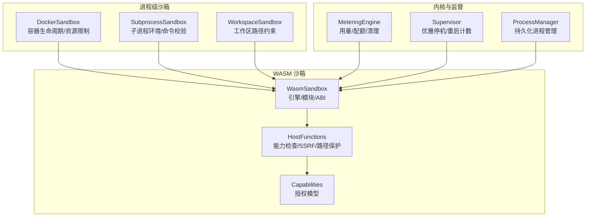
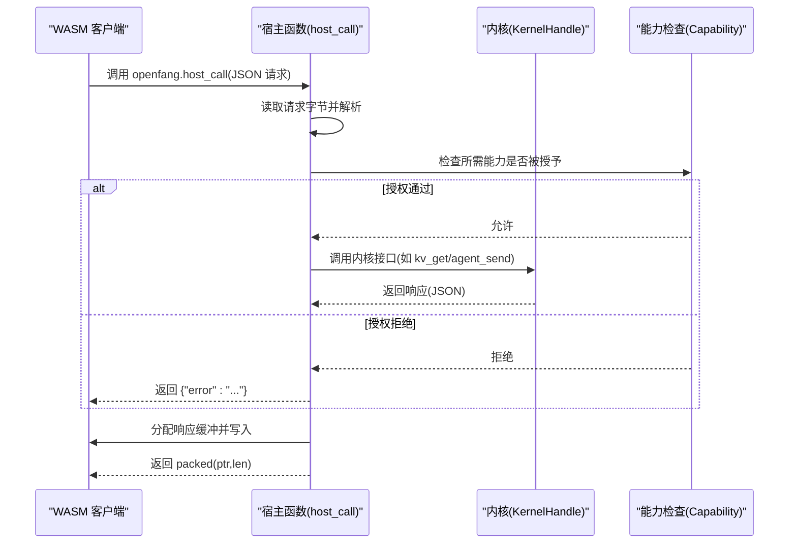
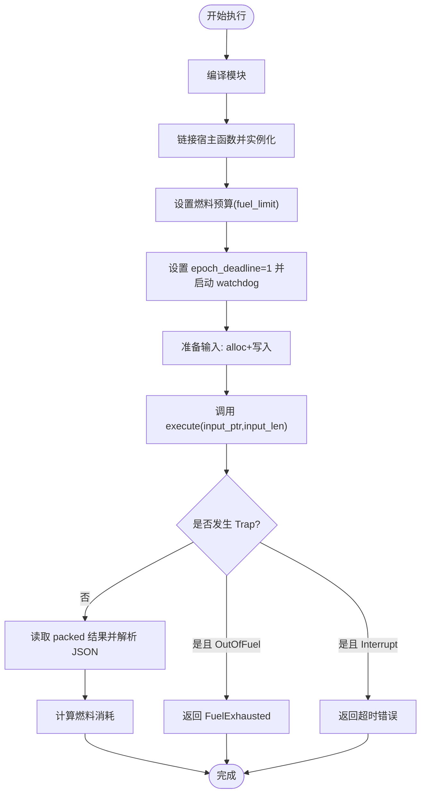
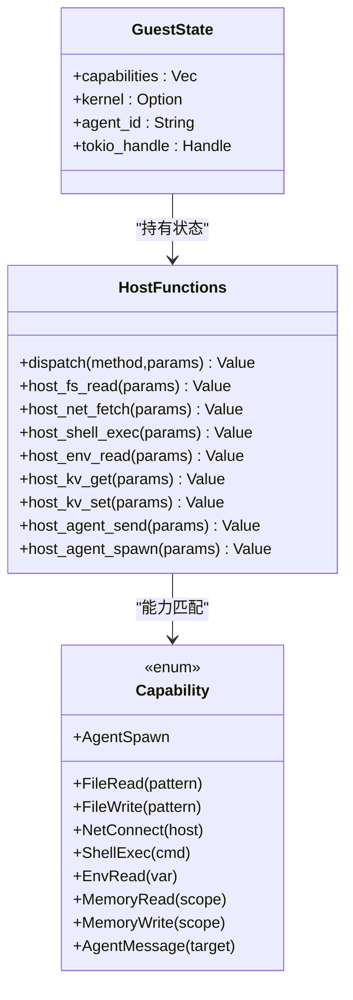
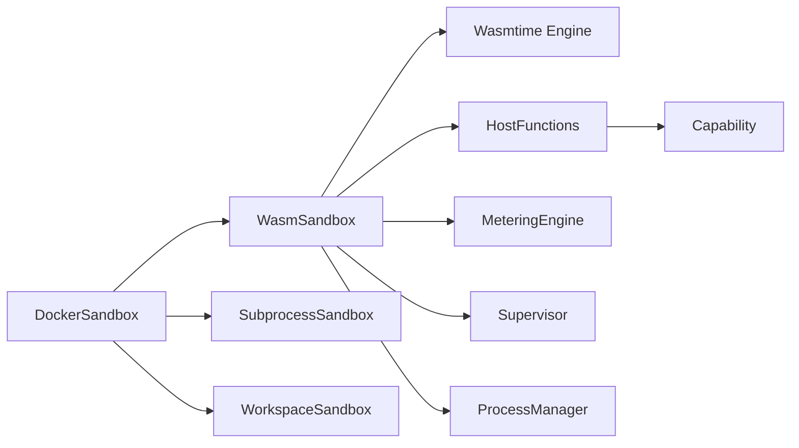

# WASM 沙箱隔离

<cite>
**本文引用的文件**
- [sandbox.rs](file://crates/openfang-runtime/src/sandbox.rs)
- [host_functions.rs](file://crates/openfang-runtime/src/host_functions.rs)
- [capability.rs](file://crates/openfang-types/src/capability.rs)
- [docker_sandbox.rs](file://crates/openfang-runtime/src/docker_sandbox.rs)
- [subprocess_sandbox.rs](file://crates/openfang-runtime/src/subprocess_sandbox.rs)
- [workspace_sandbox.rs](file://crates/openfang-runtime/src/workspace_sandbox.rs)
- [metering.rs](file://crates/openfang-kernel/src/metering.rs)
- [supervisor.rs](file://crates/openfang-kernel/src/supervisor.rs)
- [process_manager.rs](file://crates/openfang-runtime/src/process_manager.rs)
</cite>

## 目录
1. [简介](#简介)
2. [项目结构](#项目结构)
3. [核心组件](#核心组件)
4. [架构总览](#架构总览)
5. [详细组件分析](#详细组件分析)
6. [依赖关系分析](#依赖关系分析)
7. [性能考量](#性能考量)
8. [故障排查指南](#故障排查指南)
9. [结论](#结论)

## 简介
本文件面向 OpenFang 的 WASM 沙箱隔离系统，系统性阐述双重计量机制（燃料计量与时间片中断）的设计理念与实现细节，覆盖 Wasmtime 执行环境配置、内存限制、超时控制；深入解析沙箱配置参数（fuel_limit、max_memory_bytes、capabilities、timeout_secs）的作用与调优策略；记录错误处理机制（SandboxError 枚举）、执行陷阱类型、资源回收策略；并提供沙箱初始化、模块加载、执行监控的完整流程说明，以及进程级沙箱与 WASM 沙箱的协同工作机制。

## 项目结构
OpenFang 将“进程级沙箱”与“WASM 沙箱”分层设计：
- 进程级沙箱：通过 Docker 容器提供 OS 级别的隔离与资源限制，适合需要系统级工具或网络访问的场景。
- WASM 沙箱：在用户态虚拟机中运行插件/技能，基于 Wasmtime 提供细粒度的 CPU 与内存计量、能力授权与 ABI 调用。

图表来源
- [docker_sandbox.rs:94-173](file://crates/openfang-runtime/src/docker_sandbox.rs#L94-L173)
- [subprocess_sandbox.rs:30-64](file://crates/openfang-runtime/src/subprocess_sandbox.rs#L30-L64)
- [workspace_sandbox.rs:8-69](file://crates/openfang-runtime/src/workspace_sandbox.rs#L8-L69)
- [sandbox.rs:94-143](file://crates/openfang-runtime/src/sandbox.rs#L94-L143)
- [host_functions.rs:16-49](file://crates/openfang-runtime/src/host_functions.rs#L16-L49)
- [capability.rs:9-72](file://crates/openfang-types/src/capability.rs#L9-L72)
- [metering.rs:14-62](file://crates/openfang-kernel/src/metering.rs#L14-L62)
- [supervisor.rs:9-44](file://crates/openfang-kernel/src/supervisor.rs#L9-L44)
- [process_manager.rs:49-93](file://crates/openfang-runtime/src/process_manager.rs#L49-L93)

章节来源
- [sandbox.rs:1-608](file://crates/openfang-runtime/src/sandbox.rs#L1-L608)
- [docker_sandbox.rs:1-636](file://crates/openfang-runtime/src/docker_sandbox.rs#L1-L636)
- [subprocess_sandbox.rs:1-906](file://crates/openfang-runtime/src/subprocess_sandbox.rs#L1-L906)
- [workspace_sandbox.rs:1-148](file://crates/openfang-runtime/src/workspace_sandbox.rs#L1-L148)
- [host_functions.rs:1-669](file://crates/openfang-runtime/src/host_functions.rs#L1-L669)
- [capability.rs:1-317](file://crates/openfang-types/src/capability.rs#L1-L317)
- [metering.rs:1-807](file://crates/openfang-kernel/src/metering.rs#L1-L807)
- [supervisor.rs:1-227](file://crates/openfang-kernel/src/supervisor.rs#L1-L227)
- [process_manager.rs:49-93](file://crates/openfang-runtime/src/process_manager.rs#L49-L93)

## 核心组件
- WasmSandbox：封装 Wasmtime 引擎与执行流程，负责编译、实例化、ABI 调用、燃料与时间片中断、结果回传与燃料统计。
- HostFunctions：在 WASM 客户端侧发起的“宿主调用”统一入口，按方法名分发到具体能力检查与实现。
- SandboxConfig：沙箱配置对象，包含 fuel_limit、max_memory_bytes、capabilities、timeout_secs。
- SandboxError：沙箱操作的错误类型，涵盖编译、实例化、执行、燃料耗尽、ABI 违规等。
- DockerSandbox：进程级沙箱，提供容器生命周期、资源限制、网络隔离、只读根文件系统、tmpfs 挂载等。
- SubprocessSandbox：子进程安全沙箱，清理环境变量、命令白名单/黑名单、metacharacter 注入防护、进程树杀。
- WorkspaceSandbox：工作区路径约束，防止路径穿越与越权访问。
- MeteringEngine：内核侧计量引擎，跟踪使用成本并强制配额限制。
- Supervisor/ProcessManager：内核监督与进程管理，支持优雅停机、重启计数、持久化进程上限。

章节来源
- [sandbox.rs:33-92](file://crates/openfang-runtime/src/sandbox.rs#L33-L92)
- [host_functions.rs:16-49](file://crates/openfang-runtime/src/host_functions.rs#L16-L49)
- [docker_sandbox.rs:94-173](file://crates/openfang-runtime/src/docker_sandbox.rs#L94-L173)
- [subprocess_sandbox.rs:30-64](file://crates/openfang-runtime/src/subprocess_sandbox.rs#L30-L64)
- [workspace_sandbox.rs:8-69](file://crates/openfang-runtime/src/workspace_sandbox.rs#L8-L69)
- [metering.rs:14-62](file://crates/openfang-kernel/src/metering.rs#L14-L62)
- [supervisor.rs:9-44](file://crates/openfang-kernel/src/supervisor.rs#L9-L44)
- [process_manager.rs:49-93](file://crates/openfang-runtime/src/process_manager.rs#L49-L93)

## 架构总览
WASM 沙箱以“能力授权 + 双重重度机制”为核心隔离策略：
- 能力授权：所有宿主调用均需满足授予的能力，未授权直接拒绝。
- 双重重度机制：
  - 燃料计量（CPU 指令预算）：Wasmtime consume_fuel，按指令消耗扣减，耗尽触发 OutOfFuel。
  - 时间片中断（墙钟超时）：Wasmtime epoch_interruption，设置 epoch_deadline 并由 watchdog 线程在超时后 increment_epoch 触发 Interrupt。
- 执行 ABI：WASM 必须导出 memory、alloc、execute；宿主提供 openfang.host_call 与 openfang.host_log，并通过 packed i64 返回结果指针与长度。

图表来源
- [sandbox.rs:277-387](file://crates/openfang-runtime/src/sandbox.rs#L277-L387)
- [host_functions.rs:16-49](file://crates/openfang-runtime/src/host_functions.rs#L16-L49)
- [capability.rs:100-166](file://crates/openfang-types/src/capability.rs#L100-L166)

章节来源
- [sandbox.rs:145-275](file://crates/openfang-runtime/src/sandbox.rs#L145-L275)
- [host_functions.rs:16-49](file://crates/openfang-runtime/src/host_functions.rs#L16-L49)

## 详细组件分析

### WasmSandbox 与执行流程
- 初始化：启用 consume_fuel 与 epoch_interruption，创建 Engine。
- 编译与实例化：Module::new + Linker::instantiate，导入 openfang.host_call 与 openfang.host_log。
- 输入输出：序列化输入 JSON，调用 alloc 获取内存，写入输入；调用 execute 获取 packed 结果指针与长度，读取 JSON 输出。
- 计量与中断：
  - 设置 fuel_limit（>0 时生效），用于确定性 CPU 预算。
  - 设置 epoch_deadline=1，并启动 watchdog 线程在 timeout_secs 后 increment_epoch，触发 Interrupt。
- 错误处理：捕获 Trap 并区分 OutOfFuel 与 Interrupt，分别映射为 FuelExhausted 与执行错误；其他异常映射为 Execution。

图表来源
- [sandbox.rs:145-275](file://crates/openfang-runtime/src/sandbox.rs#L145-L275)

章节来源
- [sandbox.rs:94-275](file://crates/openfang-runtime/src/sandbox.rs#L94-L275)

### HostFunctions 与能力检查
- 方法分发：根据 method 名调用对应处理函数（如 fs_read、net_fetch、shell_exec、env_read、kv_get/kv_set、agent_send/spawn 等）。
- 能力检查：每个方法在执行前检查 GuestState 中授予的能力，不匹配则返回错误。
- 安全加固：
  - 文件系统：路径解析严格拒绝 “..” 组件，必要时进行 canonicalize。
  - 网络：仅允许 http/https，对主机名进行白名单检查，并对解析后的 IP 检查私有地址段。
  - Shell：使用 Command::new 直接执行，避免 shell 注入；参数数组直接传递。
  - KV/Agent：依赖 KernelHandle，确保跨代理交互受控。

图表来源
- [host_functions.rs:16-49](file://crates/openfang-runtime/src/host_functions.rs#L16-L49)
- [capability.rs:9-72](file://crates/openfang-types/src/capability.rs#L9-L72)

章节来源
- [host_functions.rs:16-49](file://crates/openfang-runtime/src/host_functions.rs#L16-L49)
- [capability.rs:100-166](file://crates/openfang-types/src/capability.rs#L100-L166)

### 沙箱配置参数与调优策略
- fuel_limit：WASM 指令预算，越大越能容忍复杂计算，但会增加 CPU 成本。建议按技能复杂度与平均执行时间估算，结合 MeteringEngine 的配额进行平衡。
- max_memory_bytes：当前未强制执行，保留未来扩展。建议配合 DockerSandbox 的内存限制共同约束。
- capabilities：精确授予最小权限集合，优先使用通配符与模式匹配，避免授予 ToolAll 或 ShellExec/*。
- timeout_secs：墙钟超时，建议与 fuel_limit 协同设置，避免无限循环或长阻塞等待。

章节来源
- [sandbox.rs:33-56](file://crates/openfang-runtime/src/sandbox.rs#L33-L56)

### 错误处理与执行陷阱
- SandboxError 枚举：
  - Compilation/Instantiation/Execution：编译/实例化/执行阶段的异常。
  - FuelExhausted：燃料耗尽，通常由 OutOfFuel Trap 触发。
  - AbiError：ABI 违规（如未导出 memory/alloc/execute、越界访问）。
- 执行陷阱：
  - OutOfFuel：指令预算耗尽。
  - Interrupt：epoch 中断（超时）。
- 资源回收：
  - 宿主调用中的分配与写入均在 WASM 内存中进行，执行结束后由 Wasmtime 回收。
  - DockerSandbox 在销毁时移除容器，避免资源泄漏。

章节来源
- [sandbox.rs:79-92](file://crates/openfang-runtime/src/sandbox.rs#L79-L92)
- [sandbox.rs:231-247](file://crates/openfang-runtime/src/sandbox.rs#L231-L247)

### 进程级沙箱与 WASM 沙箱的协同
- DockerSandbox：提供 OS 级隔离（capabilities drop、只读根、网络隔离、tmpfs、资源限制），适合需要系统工具或网络访问的场景。
- SubprocessSandbox：对子进程进行环境清理与命令校验，防止注入与越权。
- WorkspaceSandbox：将文件操作限制在工作区目录，防止路径穿越。
- 协同方式：当技能需要系统工具或网络访问时，可选择 DockerSandbox；若仅需轻量执行与能力授权，优先使用 WASM 沙箱。

章节来源
- [docker_sandbox.rs:94-173](file://crates/openfang-runtime/src/docker_sandbox.rs#L94-L173)
- [subprocess_sandbox.rs:30-64](file://crates/openfang-runtime/src/subprocess_sandbox.rs#L30-L64)
- [workspace_sandbox.rs:8-69](file://crates/openfang-runtime/src/workspace_sandbox.rs#L8-L69)

## 依赖关系分析

图表来源
- [sandbox.rs:94-143](file://crates/openfang-runtime/src/sandbox.rs#L94-L143)
- [host_functions.rs:16-49](file://crates/openfang-runtime/src/host_functions.rs#L16-L49)
- [capability.rs:9-72](file://crates/openfang-types/src/capability.rs#L9-L72)
- [docker_sandbox.rs:94-173](file://crates/openfang-runtime/src/docker_sandbox.rs#L94-L173)
- [subprocess_sandbox.rs:30-64](file://crates/openfang-runtime/src/subprocess_sandbox.rs#L30-L64)
- [workspace_sandbox.rs:8-69](file://crates/openfang-runtime/src/workspace_sandbox.rs#L8-L69)
- [metering.rs:14-62](file://crates/openfang-kernel/src/metering.rs#L14-L62)
- [supervisor.rs:9-44](file://crates/openfang-kernel/src/supervisor.rs#L9-L44)
- [process_manager.rs:49-93](file://crates/openfang-runtime/src/process_manager.rs#L49-L93)

章节来源
- [sandbox.rs:94-143](file://crates/openfang-runtime/src/sandbox.rs#L94-L143)
- [host_functions.rs:16-49](file://crates/openfang-runtime/src/host_functions.rs#L16-L49)
- [capability.rs:9-72](file://crates/openfang-types/src/capability.rs#L9-L72)
- [docker_sandbox.rs:94-173](file://crates/openfang-runtime/src/docker_sandbox.rs#L94-L173)
- [subprocess_sandbox.rs:30-64](file://crates/openfang-runtime/src/subprocess_sandbox.rs#L30-L64)
- [workspace_sandbox.rs:8-69](file://crates/openfang-runtime/src/workspace_sandbox.rs#L8-L69)
- [metering.rs:14-62](file://crates/openfang-kernel/src/metering.rs#L14-L62)
- [supervisor.rs:9-44](file://crates/openfang-kernel/src/supervisor.rs#L9-L44)
- [process_manager.rs:49-93](file://crates/openfang-runtime/src/process_manager.rs#L49-L93)

## 性能考量
- 燃料预算与超时协同：过小的 fuel_limit 会导致频繁 FuelExhausted，过大则可能滥用 CPU；timeout_secs 应与 fuel_limit 对齐，避免“空转”浪费。
- 内存与 I/O：WASM 线性内存增长与宿主调用的 JSON 序列化/反序列化存在开销；建议合理设置 max_memory_bytes 与输入大小。
- 线程与异步：WASM 执行在 spawn_blocking 线程池中运行，避免阻塞 Tokio 主事件循环；宿主调用中的网络请求通过异步客户端完成。
- DockerSandbox：容器创建/销毁与资源限制带来额外开销，适合需要系统工具的场景；对高频短任务，优先使用 WASM 沙箱。

## 故障排查指南
- 燃料耗尽（FuelExhausted）
  - 现象：执行报错为 FuelExhausted。
  - 排查：提高 fuel_limit，优化算法复杂度，减少无限循环或深度递归。
- 超时（Interrupt）
  - 现象：执行报错包含 wall-clock 超时信息。
  - 排查：延长 timeout_secs，检查宿主调用是否存在阻塞（网络/磁盘），必要时拆分任务。
- ABI 违规（AbiError）
  - 现象：未导出 memory/alloc/execute，或内存越界。
  - 排查：确认 WASM 导出符号与 ABI，检查输入/输出指针与长度。
- 能力拒绝（Capability Denied）
  - 现象：宿主调用返回错误，提示能力不足。
  - 排查：核对 capabilities 列表，使用通配符或更精确的模式匹配；避免授予 ToolAll/ShellExec/*。
- Docker 相关问题
  - 现象：容器创建失败、资源限制不生效。
  - 排查：检查镜像名称、网络、tmpfs、挂载路径合法性；确认 Docker 可用性与权限。

章节来源
- [sandbox.rs:79-92](file://crates/openfang-runtime/src/sandbox.rs#L79-L92)
- [host_functions.rs:55-67](file://crates/openfang-runtime/src/host_functions.rs#L55-L67)
- [docker_sandbox.rs:77-91](file://crates/openfang-runtime/src/docker_sandbox.rs#L77-L91)

## 结论
OpenFang 的 WASM 沙箱通过“能力授权 + 双重重度机制”，在用户态实现了高隔离与可控的执行环境。Wasmtime 的燃料与 epoch 中断提供了确定性与非确定性的双重保障；HostFunctions 的能力检查与安全加固（路径、SSRF、metacharacter）进一步降低攻击面。结合进程级沙箱（DockerSandbox）与子进程安全（SubprocessSandbox），系统在灵活性与安全性之间取得良好平衡。建议在实际部署中，依据技能复杂度与业务需求，合理设置 fuel_limit 与 timeout_secs，并严格控制 capabilities，以获得最佳的安全与性能表现。