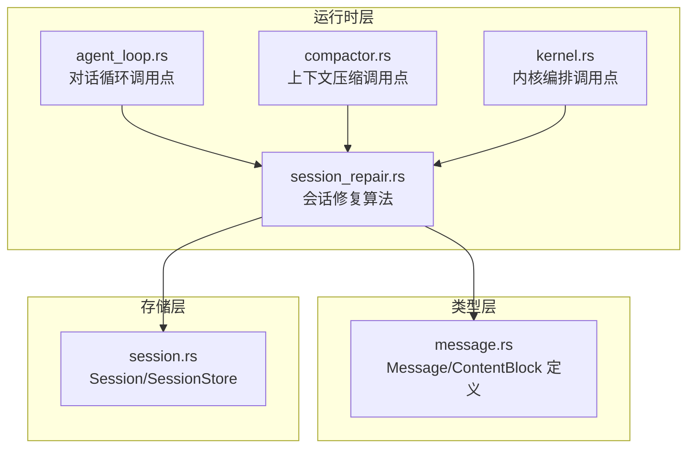
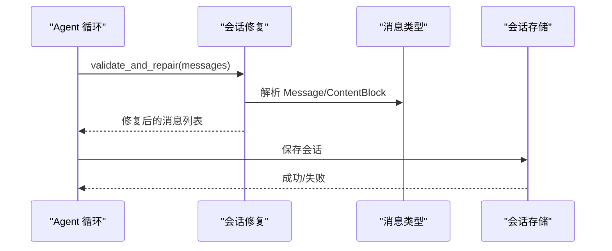
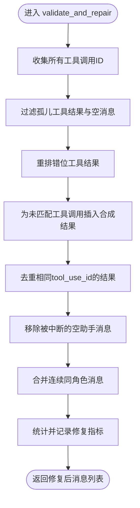
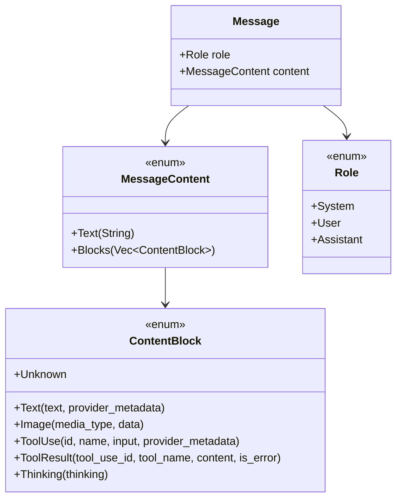
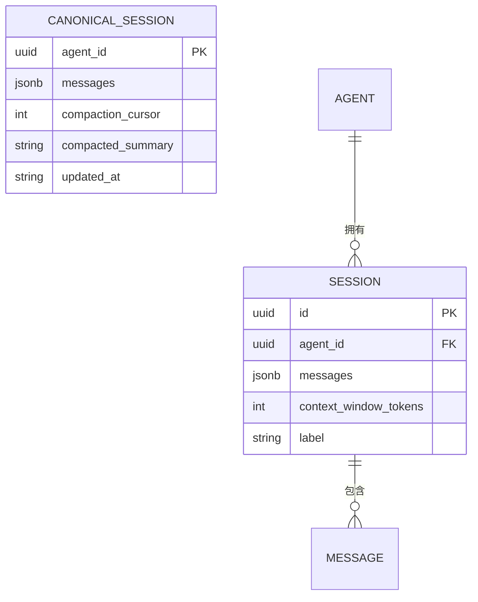
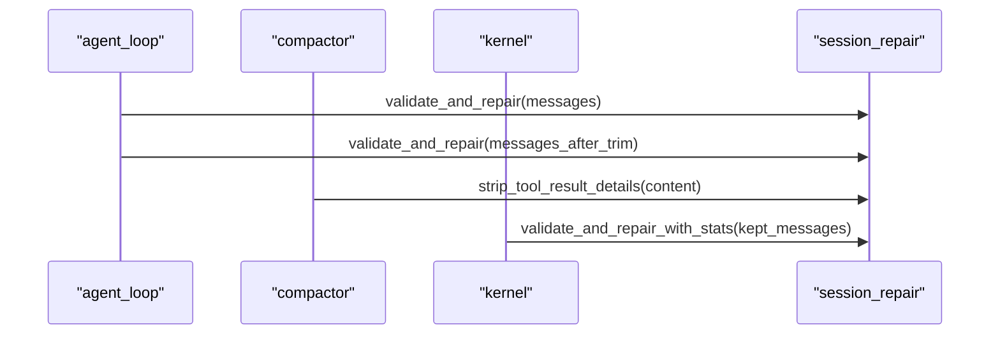
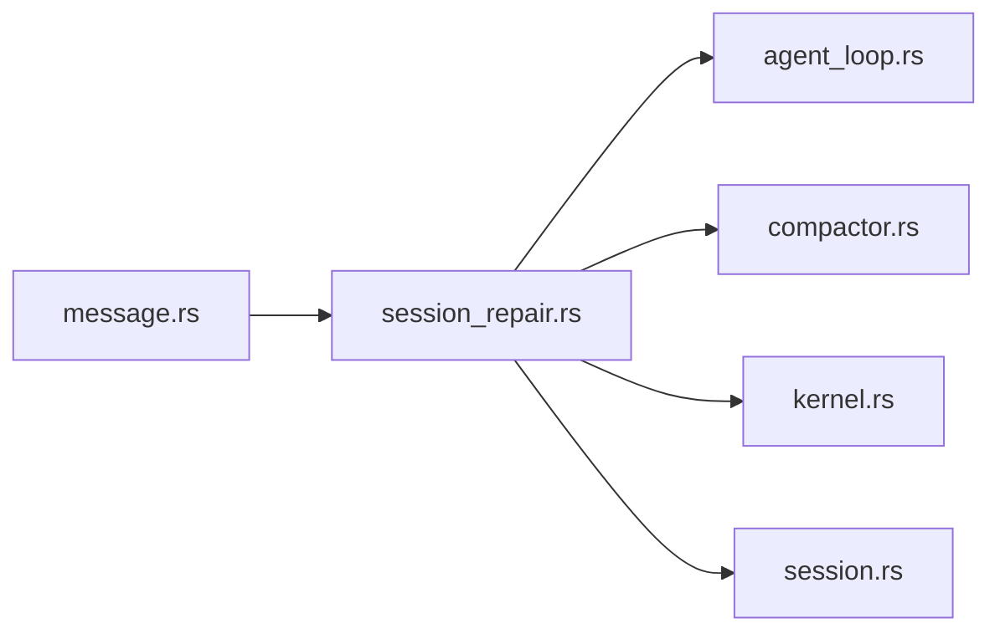

# 会话修复机制

<cite>
**本文档引用的文件**
- [session_repair.rs](file://crates/openfang-runtime/src/session_repair.rs)
- [message.rs](file://crates/openfang-types/src/message.rs)
- [session.rs](file://crates/openfang-memory/src/session.rs)
- [agent_loop.rs](file://crates/openfang-runtime/src/agent_loop.rs)
- [compactor.rs](file://crates/openfang-runtime/src/compactor.rs)
- [kernel.rs](file://crates/openfang-kernel/src/kernel.rs)
- [lib.rs](file://crates/openfang-runtime/src/lib.rs)
- [openfang.toml.example](file://openfang.toml.example)
</cite>

## 目录
1. [引言](#引言)
2. [项目结构](#项目结构)
3. [核心组件](#核心组件)
4. [架构总览](#架构总览)
5. [详细组件分析](#详细组件分析)
6. [依赖关系分析](#依赖关系分析)
7. [性能考量](#性能考量)
8. [故障排查指南](#故障排查指南)
9. [结论](#结论)
10. [附录](#附录)

## 引言
本文件系统性阐述 OpenFang 的会话修复机制，聚焦于对话历史损坏检测与修复策略，覆盖会话状态验证、消息序列完整性检查、历史记录恢复等关键能力。文档详细说明会话修复算法、损坏检测方法、自动修复流程，并记录会话数据结构、状态管理与持久化策略。同时给出会话修复在 LLM 对话、消息传递、状态同步中的应用场景与配置示例，解释其与内存管理、审计日志、数据一致性的关系。

## 项目结构
OpenFang 将会话修复能力集中在运行时模块中，通过统一的消息类型与会话存储实现跨模块协作：
- 运行时层：会话修复算法与调用点（agent_loop、compactor、kernel）
- 类型层：消息与内容块的标准化定义（message.rs）
- 存储层：会话的加载、保存与镜像输出（session.rs）

**图表来源**
- [session_repair.rs:1-1235](file://crates/openfang-runtime/src/session_repair.rs#L1-L1235)
- [agent_loop.rs:287-322](file://crates/openfang-runtime/src/agent_loop.rs#L287-L322)
- [compactor.rs:390-415](file://crates/openfang-runtime/src/compactor.rs#L390-L415)
- [kernel.rs:3120-3156](file://crates/openfang-kernel/src/kernel.rs#L3120-L3156)
- [message.rs:1-341](file://crates/openfang-types/src/message.rs#L1-L341)
- [session.rs:1-814](file://crates/openfang-memory/src/session.rs#L1-L814)

**章节来源**
- [session_repair.rs:1-1235](file://crates/openfang-runtime/src/session_repair.rs#L1-L1235)
- [agent_loop.rs:287-322](file://crates/openfang-runtime/src/agent_loop.rs#L287-L322)
- [compactor.rs:390-415](file://crates/openfang-runtime/src/compactor.rs#L390-L415)
- [kernel.rs:3120-3156](file://crates/openfang-kernel/src/kernel.rs#L3120-L3156)
- [message.rs:1-341](file://crates/openfang-types/src/message.rs#L1-L341)
- [session.rs:1-814](file://crates/openfang-memory/src/session.rs#L1-L814)

## 核心组件
- 会话修复算法（session_repair.rs）：提供 validate_and_repair 及增强版 validate_and_repair_with_stats，负责工具调用/结果对齐、缺失结果补全、重复结果去重、空消息清理、连续同角色消息合并、心跳无回复标记清理、工具结果安全裁剪等。
- 消息类型定义（message.rs）：统一 Role、MessageContent、ContentBlock（含 text、image、tool_use、tool_result、thinking 等），为修复算法提供结构化输入。
- 会话存储（session.rs）：提供 Session/CanonicalSession 的加载、保存、镜像输出，支持标签与跨通道上下文聚合。
- 调用点（agent_loop.rs、compactor.rs、kernel.rs）：在对话循环、上下文压缩、内核编排阶段调用修复算法，确保 LLM 输入的历史合法且高效。

**章节来源**
- [session_repair.rs:35-178](file://crates/openfang-runtime/src/session_repair.rs#L35-L178)
- [message.rs:6-96](file://crates/openfang-types/src/message.rs#L6-L96)
- [session.rs:12-25](file://crates/openfang-memory/src/session.rs#L12-L25)
- [agent_loop.rs:287-322](file://crates/openfang-runtime/src/agent_loop.rs#L287-L322)
- [compactor.rs:390-415](file://crates/openfang-runtime/src/compactor.rs#L390-L415)
- [kernel.rs:3120-3156](file://crates/openfang-kernel/src/kernel.rs#L3120-L3156)

## 架构总览
会话修复贯穿对话生命周期的关键节点，形成“检测-修复-验证-持久化”的闭环：

**图表来源**
- [agent_loop.rs:287-322](file://crates/openfang-runtime/src/agent_loop.rs#L287-L322)
- [session_repair.rs:35-178](file://crates/openfang-runtime/src/session_repair.rs#L35-L178)
- [message.rs:6-96](file://crates/openfang-types/src/message.rs#L6-L96)
- [session.rs:77-101](file://crates/openfang-memory/src/session.rs#L77-L101)

## 详细组件分析

### 会话修复算法（session_repair.rs）
- 主要职责
  - 去除孤儿工具结果（无匹配工具调用）
  - 清理空消息（文本为空或仅包含空白块）
  - 重排错位工具结果（确保用户消息紧随对应助手工具调用）
  - 为未匹配工具调用插入合成错误结果
  - 去重相同 tool_use_id 的多个工具结果
  - 合并连续同角色消息
  - 移除被中断的空助手消息
  - 心跳无回复标记清理（NO_REPLY）
  - 工具结果安全裁剪（长度限制、Base64 大对象替换、注入标记移除）
- 统计指标（RepairStats）
  - orphaned_results_removed、empty_messages_removed、messages_merged、results_reordered、synthetic_results_inserted、duplicates_removed
- 关键函数
  - validate_and_repair / validate_and_repair_with_stats
  - reorder_tool_results
  - insert_synthetic_results
  - deduplicate_tool_results
  - remove_aborted_assistant_messages
  - prune_heartbeat_turns
  - strip_tool_result_details

**图表来源**
- [session_repair.rs:48-178](file://crates/openfang-runtime/src/session_repair.rs#L48-L178)
- [session_repair.rs:180-443](file://crates/openfang-runtime/src/session_repair.rs#L180-L443)
- [session_repair.rs:445-486](file://crates/openfang-runtime/src/session_repair.rs#L445-L486)
- [session_repair.rs:614-663](file://crates/openfang-runtime/src/session_repair.rs#L614-L663)
- [session_repair.rs:503-612](file://crates/openfang-runtime/src/session_repair.rs#L503-L612)

**章节来源**
- [session_repair.rs:35-178](file://crates/openfang-runtime/src/session_repair.rs#L35-L178)
- [session_repair.rs:180-443](file://crates/openfang-runtime/src/session_repair.rs#L180-L443)
- [session_repair.rs:445-486](file://crates/openfang-runtime/src/session_repair.rs#L445-L486)
- [session_repair.rs:503-612](file://crates/openfang-runtime/src/session_repair.rs#L503-L612)
- [session_repair.rs:614-663](file://crates/openfang-runtime/src/session_repair.rs#L614-L663)

### 消息类型与内容块（message.rs）
- 角色（Role）：System、User、Assistant
- 内容（MessageContent）：Text 或 Blocks
- 内容块（ContentBlock）：Text、Image、ToolUse、ToolResult、Thinking、Unknown
- 辅助能力：文本长度计算、文本提取、图像校验（类型与大小）

**图表来源**
- [message.rs:6-96](file://crates/openfang-types/src/message.rs#L6-L96)

**章节来源**
- [message.rs:6-96](file://crates/openfang-types/src/message.rs#L6-L96)

### 会话数据结构与持久化（session.rs）
- 会话（Session）：包含会话 ID、所属 Agent、消息列表、上下文窗口令牌数、可选标签
- 会话存储（SessionStore）：提供加载、保存、删除、按标签查询、列出元数据、写入 JSONL 镜像等
- 标准化序列化：使用 rmp-serde 进行消息数组的二进制序列化
- 跨通道上下文（CanonicalSession）：按 Agent 聚合，支持压缩游标与摘要，提供最近消息窗口

**图表来源**
- [session.rs:12-25](file://crates/openfang-memory/src/session.rs#L12-L25)
- [session.rs:349-360](file://crates/openfang-memory/src/session.rs#L349-L360)

**章节来源**
- [session.rs:12-25](file://crates/openfang-memory/src/session.rs#L12-L25)
- [session.rs:349-360](file://crates/openfang-memory/src/session.rs#L349-L360)
- [session.rs:77-101](file://crates/openfang-memory/src/session.rs#L77-L101)
- [session.rs:493-515](file://crates/openfang-memory/src/session.rs#L493-L515)

### 调用点与集成（agent_loop.rs、compactor.rs、kernel.rs）
- agent_loop.rs：在对话循环中调用 validate_and_repair，必要时在历史修剪后再次修复，以保证工具调用/结果配对不被截断破坏
- compactor.rs：在上下文压缩前对工具结果进行安全裁剪，避免将大体积或潜在恶意内容送入 LLM
- kernel.rs：在完成 LLM 基于摘要的压缩后，对保留消息再次执行修复与统计，确保压缩后会话的一致性

**图表来源**
- [agent_loop.rs:287-322](file://crates/openfang-runtime/src/agent_loop.rs#L287-L322)
- [compactor.rs:390-415](file://crates/openfang-runtime/src/compactor.rs#L390-L415)
- [kernel.rs:3120-3156](file://crates/openfang-kernel/src/kernel.rs#L3120-L3156)

**章节来源**
- [agent_loop.rs:287-322](file://crates/openfang-runtime/src/agent_loop.rs#L287-L322)
- [compactor.rs:390-415](file://crates/openfang-runtime/src/compactor.rs#L390-L415)
- [kernel.rs:3120-3156](file://crates/openfang-kernel/src/kernel.rs#L3120-L3156)

## 依赖关系分析
- 模块耦合
  - session_repair.rs 依赖 message.rs 的消息与内容块定义，确保修复逻辑对结构化内容的正确处理
  - agent_loop.rs、compactor.rs、kernel.rs 作为调用点，将修复算法嵌入到对话、压缩与内核编排流程中
  - session.rs 提供统一的会话存取接口，支撑修复后的消息持久化
- 外部依赖
  - 序列化：rmp-serde 用于消息数组的二进制序列化
  - 数据库：rusqlite 用于会话存储
  - 日志：tracing/warn 用于修复统计与问题告警

**图表来源**
- [lib.rs:45](file://crates/openfang-runtime/src/lib.rs#L45)
- [session_repair.rs:14](file://crates/openfang-runtime/src/session_repair.rs#L14)
- [message.rs:3](file://crates/openfang-types/src/message.rs#L3)
- [session.rs:6](file://crates/openfang-memory/src/session.rs#L6)

**章节来源**
- [lib.rs:45](file://crates/openfang-runtime/src/lib.rs#L45)
- [session_repair.rs:14](file://crates/openfang-runtime/src/session_repair.rs#L14)
- [message.rs:3](file://crates/openfang-types/src/message.rs#L3)
- [session.rs:6](file://crates/openfang-memory/src/session.rs#L6)

## 性能考量
- 时间复杂度
  - validate_and_repair：整体线性于消息数量，包含多轮扫描与哈希映射构建，典型 O(n)
  - 重排与插入：基于索引映射与分组插入，整体仍保持线性
- 空间复杂度
  - 临时向量与哈希集合用于去重与映射，空间开销与消息中工具调用/结果数量相关
- 安全裁剪
  - strip_tool_result_details 在压缩阶段对工具结果进行长度限制与注入标记清理，降低内存占用与注入风险
- 上下文窗口保护
  - agent_loop 中对过长历史进行预修剪，并在修剪后再次修复，防止因截断破坏工具调用/结果配对导致的空响应

[本节为通用性能讨论，无需具体文件分析]

## 故障排查指南
- 常见症状
  - LLM 返回空文本或无工具调用：可能由历史被截断破坏配对导致，需在修剪后调用修复
  - 工具结果丢失或错位：通过重排与合成结果修复
  - 会话中出现大量空消息或心跳无回复标记：通过清理与合并修复
- 排查步骤
  - 检查修复统计（RepairStats）：确认孤儿结果移除、重复结果去重、消息合并数量
  - 校验会话持久化：确认保存成功与序列化无异常
  - 审计日志：在内核压缩后记录修复统计，便于回溯
- 相关实现位置
  - 修复统计与日志：validate_and_repair_with_stats、warn 输出
  - 保存会话：SessionStore.save_session
  - 内核压缩后修复：kernel.rs 中的 validate_and_repair_with_stats 调用

**章节来源**
- [session_repair.rs:165-177](file://crates/openfang-runtime/src/session_repair.rs#L165-L177)
- [session.rs:77-101](file://crates/openfang-memory/src/session.rs#L77-L101)
- [kernel.rs:3120-3156](file://crates/openfang-kernel/src/kernel.rs#L3120-L3156)

## 结论
OpenFang 的会话修复机制通过标准化的消息类型、完善的修复算法与严格的调用点集成，有效保障了对话历史的完整性与一致性。修复流程覆盖工具调用/结果对齐、缺失结果补全、重复结果去重、空消息清理、连续消息合并、心跳无回复清理以及工具结果安全裁剪等关键环节。配合会话存储与审计日志，实现了从检测到持久化的闭环管理，适用于 LLM 对话、消息传递与跨通道状态同步等多种场景。

[本节为总结性内容，无需具体文件分析]

## 附录

### 应用场景与配置示例
- LLM 对话
  - 在 agent_loop 中调用 validate_and_repair，确保每次 LLM 请求的历史合法
  - 在上下文压缩前调用 strip_tool_result_details，避免大体积内容影响模型性能
- 消息传递
  - 使用 SessionStore 保存修复后的消息，支持跨通道会话标签与最近消息窗口
- 状态同步
  - CanonicalSession 聚合跨通道上下文，结合压缩与修复，维持全局一致的历史视图

**章节来源**
- [agent_loop.rs:287-322](file://crates/openfang-runtime/src/agent_loop.rs#L287-L322)
- [compactor.rs:390-415](file://crates/openfang-runtime/src/compactor.rs#L390-L415)
- [session.rs:349-360](file://crates/openfang-memory/src/session.rs#L349-L360)

### 配置参考
- 默认模型与内存配置（示例）
  - default_model.provider、default_model.model、memory.decay_rate 等
  - 可通过 openfang.toml.example 进行定制

**章节来源**
- [openfang.toml.example:1-49](file://openfang.toml.example#L1-L49)