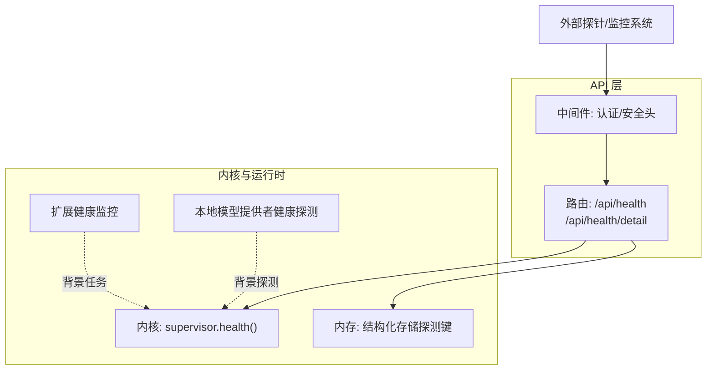
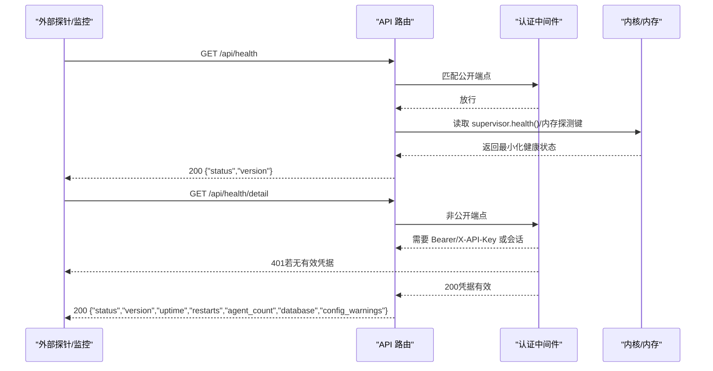
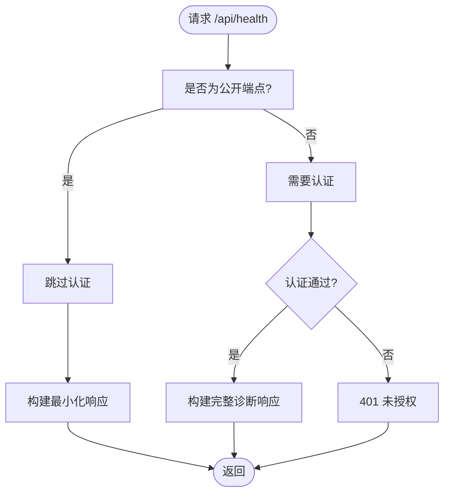
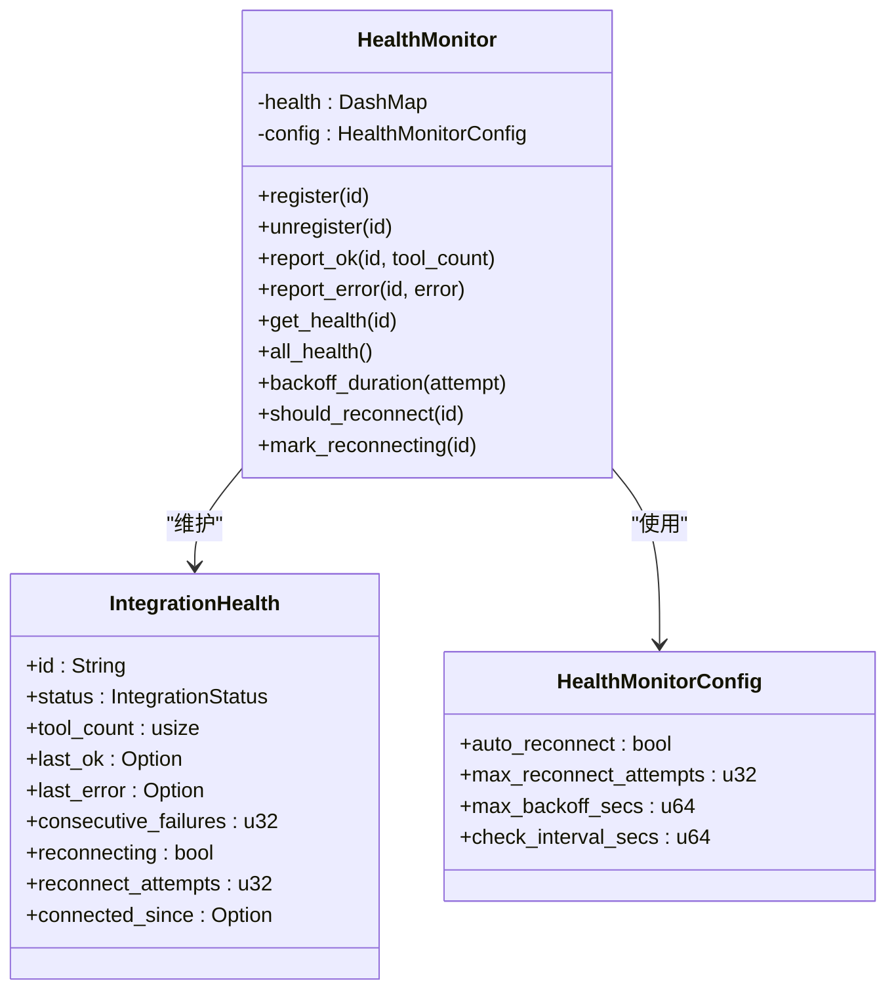
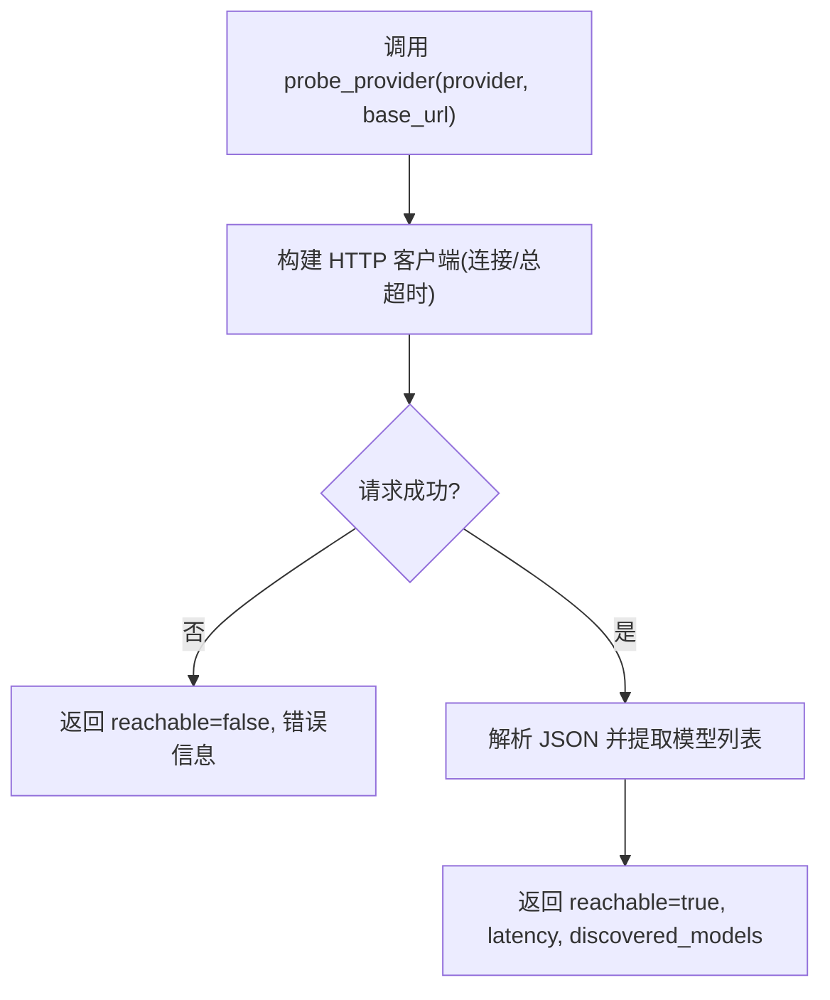
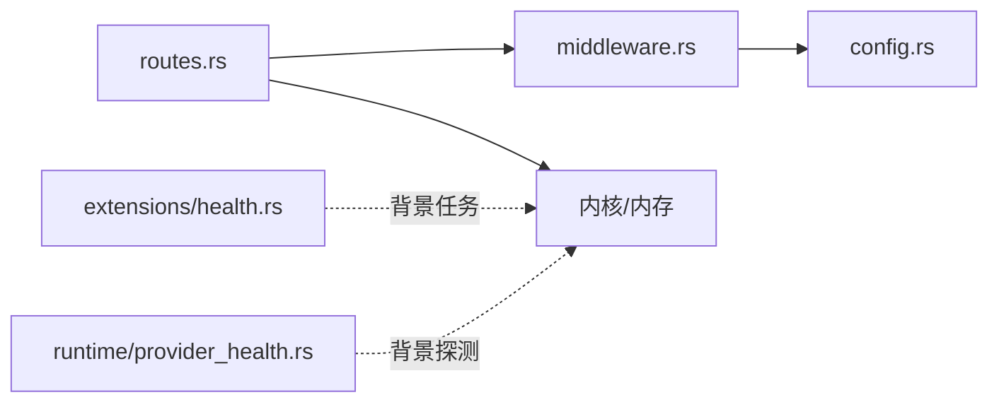

# 健康检查脱敏

<cite>
**本文引用的文件**
- [crates/openfang-api/src/routes.rs](file://crates/openfang-api/src/routes.rs)
- [crates/openfang-api/src/middleware.rs](file://crates/openfang-api/src/middleware.rs)
- [crates/openfang-api/tests/api_integration_test.rs](file://crates/openfang-api/tests/api_integration_test.rs)
- [crates/openfang-api/tests/daemon_lifecycle_test.rs](file://crates/openfang-api/tests/daemon_lifecycle_test.rs)
- [crates/openfang-types/src/config.rs](file://crates/openfang-types/src/config.rs)
- [crates/openfang-extensions/src/health.rs](file://crates/openfang-extensions/src/health.rs)
- [crates/openfang-extensions/src/lib.rs](file://crates/openfang-extensions/src/lib.rs)
- [crates/openfang-runtime/src/provider_health.rs](file://crates/openfang-runtime/src/provider_health.rs)
- [README.md](file://README.md)
</cite>

## 目录
1. [简介](#简介)
2. [项目结构](#项目结构)
3. [核心组件](#核心组件)
4. [架构总览](#架构总览)
5. [详细组件分析](#详细组件分析)
6. [依赖关系分析](#依赖关系分析)
7. [性能考量](#性能考量)
8. [故障排查指南](#故障排查指南)
9. [结论](#结论)
10. [附录](#附录)

## 简介
本文件面向 OpenFang 的“健康检查脱敏”机制，系统性阐述健康检查端点如何通过最小化披露、访问控制与安全头策略，防止信息泄露；并给出响应结构、分级策略、脱敏规则、API 设计与安全配置、监控集成、生产部署与合规实践，以及与 API 安全、信息隐藏、安全运营的关系。

## 项目结构
- 健康检查端点位于 API 层，采用“公开端点最小化 + 私有端点完整诊断”的双层设计：
  - 公开端点：/api/health（无需认证）
  - 私有端点：/api/health/detail（需认证）
- 认证与安全头由中间件统一处理，确保公共暴露面最小化。
- 运行时提供扩展健康监控与本地模型提供者健康探测，作为后台能力支撑整体健康状态。

图表来源
- [crates/openfang-api/src/routes.rs](file://crates/openfang-api/src/routes.rs)
- [crates/openfang-api/src/middleware.rs](file://crates/openfang-api/src/middleware.rs)
- [crates/openfang-extensions/src/health.rs](file://crates/openfang-extensions/src/health.rs)
- [crates/openfang-runtime/src/provider_health.rs](file://crates/openfang-runtime/src/provider_health.rs)

章节来源
- [crates/openfang-api/src/routes.rs](file://crates/openfang-api/src/routes.rs)
- [crates/openfang-api/src/middleware.rs](file://crates/openfang-api/src/middleware.rs)

## 核心组件
- 健康检查端点
  - /api/health：公开、无需认证，返回最小化信息（状态、版本），不包含数据库连接详情、代理数量等敏感字段。
  - /api/health/detail：私有、需认证，返回完整诊断（状态、版本、运行时、重启次数、代理数、数据库连通性、配置告警等）。
- 认证与访问控制
  - 中间件将 /api/health、/api/health/detail、/api/status 等标记为公开端点（GET），允许未认证访问。
  - 其他端点默认要求 Bearer 或 X-API-Key，或会话 Cookie（当启用仪表盘登录）。
- 安全头策略
  - 统一注入安全响应头（X-Content-Type-Options、X-Frame-Options、X-XSS-Protection、Content-Security-Policy、Referrer-Policy、Cache-Control、Strict-Transport-Security）。
- 配置与密钥
  - API 密钥为空时，API 默认开放；设置后，除公开端点外均需认证。
- 扩展健康监控
  - 记录集成健康状态、工具数量、最近成功时间、错误信息、连续失败次数、重连状态等，用于后台自动恢复与可观测性。
- 本地模型提供者健康探测
  - 对本地 LLM 提供者进行轻量探测（列表模型、超时控制、缓存），避免重复探测阻塞。

章节来源
- [crates/openfang-api/src/routes.rs](file://crates/openfang-api/src/routes.rs)
- [crates/openfang-api/src/middleware.rs](file://crates/openfang-api/src/middleware.rs)
- [crates/openfang-types/src/config.rs](file://crates/openfang-types/src/config.rs)
- [crates/openfang-extensions/src/health.rs](file://crates/openfang-extensions/src/health.rs)
- [crates/openfang-runtime/src/provider_health.rs](file://crates/openfang-runtime/src/provider_health.rs)

## 架构总览
健康检查脱敏遵循“最小暴露面 + 强认证 + 安全头”的原则：
- 公共健康端点仅返回必要信息，避免泄露内部拓扑、配置细节与资源规模。
- 详细诊断端点仅对受信主体开放，结合安全头与速率限制，降低攻击面。
- 后台扩展健康监控与本地提供者探测为系统稳定性提供数据基础，但不直接暴露给外部。

图表来源
- [crates/openfang-api/src/routes.rs](file://crates/openfang-api/src/routes.rs)
- [crates/openfang-api/src/middleware.rs](file://crates/openfang-api/src/middleware.rs)

## 详细组件分析

### 健康检查端点与脱敏规则
- 公开端点 /api/health
  - 返回字段：status（字符串）、version（字符串）。
  - 不包含：数据库连接状态、代理数量、重启次数、配置告警等。
  - 用途：容器/负载均衡探活、快速健康判定。
- 私有端点 /api/health/detail
  - 返回字段：status、version、uptime_seconds、panic_count、restart_count、agent_count、database、config_warnings。
  - 用途：运维与审计，需严格访问控制。
- 认证策略
  - /api/health、/api/health/detail、/api/status 等为公开 GET 端点。
  - 其他端点默认需认证；当配置 api_key 为空且未启用仪表盘登录时，API 完全开放。
- 安全头
  - 统一注入安全响应头，防止常见 Web 攻击面。

图表来源
- [crates/openfang-api/src/middleware.rs](file://crates/openfang-api/src/middleware.rs)
- [crates/openfang-api/src/routes.rs](file://crates/openfang-api/src/routes.rs)

章节来源
- [crates/openfang-api/src/routes.rs](file://crates/openfang-api/src/routes.rs)
- [crates/openfang-api/src/middleware.rs](file://crates/openfang-api/src/middleware.rs)
- [crates/openfang-types/src/config.rs](file://crates/openfang-types/src/config.rs)

### 认证与访问控制
- 公开端点清单（GET）：/api/health、/api/health/detail、/api/status、/api/version、/api/agents（GET）、/api/models（GET）、/api/providers（GET）等。
- 非公开端点：POST/PUT/DELETE 一律需要认证；GET 也需认证的端点包括 /api/health/detail。
- 认证方式：Authorization: Bearer <api_key>、X-API-Key、或会话 Cookie（当启用仪表盘登录）。
- 速率限制：健康端点成本极低（例如 1），便于高频探活。

章节来源
- [crates/openfang-api/src/middleware.rs](file://crates/openfang-api/src/middleware.rs)
- [crates/openfang-api/src/rate_limiter.rs](file://crates/openfang-api/src/rate_limiter.rs)

### 安全头与最小化披露
- 安全头策略覆盖所有 API 响应，包括：
  - X-Content-Type-Options: nosniff
  - X-Frame-Options: DENY
  - X-XSS-Protection: 1; mode=block
  - Content-Security-Policy: 限制脚本、样式、字体、图片、连接源
  - Referrer-Policy: strict-origin-when-cross-origin
  - Cache-Control: no-store, no-cache, must-revalidate
  - Strict-Transport-Security: max-age=63072000; includeSubDomains
- 健康检查响应体字段最小化，避免泄露内部拓扑与资源规模。

章节来源
- [crates/openfang-api/src/middleware.rs](file://crates/openfang-api/src/middleware.rs)
- [crates/openfang-api/src/routes.rs](file://crates/openfang-api/src/routes.rs)

### 扩展健康监控（后台）
- 记录每个集成的健康状态、工具数量、最近成功时间、错误信息、连续失败次数、重连状态等。
- 自动重连策略：指数退避（上限与最大尝试次数可配置）。
- 用途：后台自动恢复、可观测性与告警。

图表来源
- [crates/openfang-extensions/src/health.rs](file://crates/openfang-extensions/src/health.rs)

章节来源
- [crates/openfang-extensions/src/health.rs](file://crates/openfang-extensions/src/health.rs)
- [crates/openfang-extensions/src/lib.rs](file://crates/openfang-extensions/src/lib.rs)

### 本地模型提供者健康探测（后台）
- 轻量 HTTP 探测：对本地 Ollama、vLLM、LM Studio 等提供者进行模型列表探测。
- 超时控制：连接超时与总超时分别限制，避免阻塞。
- 缓存：带 TTL 的并发安全缓存，加速重复探测。
- 用途：仪表盘与运行时健康展示，非对外公开端点。

图表来源
- [crates/openfang-runtime/src/provider_health.rs](file://crates/openfang-runtime/src/provider_health.rs)

章节来源
- [crates/openfang-runtime/src/provider_health.rs](file://crates/openfang-runtime/src/provider_health.rs)

## 依赖关系分析
- 路由到中间件：/api/health 与 /api/health/detail 通过认证中间件，前者放行，后者需要凭据。
- 路由到内核/内存：健康端点读取 supervisor.health() 与内存探测键，保证快速返回。
- 中间件到配置：根据 api_key 是否为空决定是否启用认证。
- 扩展健康监控与本地提供者探测作为后台任务，不直接暴露于公网。

图表来源
- [crates/openfang-api/src/routes.rs](file://crates/openfang-api/src/routes.rs)
- [crates/openfang-api/src/middleware.rs](file://crates/openfang-api/src/middleware.rs)
- [crates/openfang-types/src/config.rs](file://crates/openfang-types/src/config.rs)
- [crates/openfang-extensions/src/health.rs](file://crates/openfang-extensions/src/health.rs)
- [crates/openfang-runtime/src/provider_health.rs](file://crates/openfang-runtime/src/provider_health.rs)

章节来源
- [crates/openfang-api/src/routes.rs](file://crates/openfang-api/src/routes.rs)
- [crates/openfang-api/src/middleware.rs](file://crates/openfang-api/src/middleware.rs)
- [crates/openfang-types/src/config.rs](file://crates/openfang-types/src/config.rs)
- [crates/openfang-extensions/src/health.rs](file://crates/openfang-extensions/src/health.rs)
- [crates/openfang-runtime/src/provider_health.rs](file://crates/openfang-runtime/src/provider_health.rs)

## 性能考量
- 健康端点延迟目标：<1s，避免成为探活瓶颈。
- 数据库探测在阻塞线程执行，避免持有异步运行时锁导致探活饥饿。
- 本地提供者探测使用短超时与缓存，减少重复探测对仪表盘加载的影响。
- 速率限制对健康端点成本极低，支持高频率探活。

章节来源
- [crates/openfang-api/tests/daemon_lifecycle_test.rs](file://crates/openfang-api/tests/daemon_lifecycle_test.rs)
- [crates/openfang-api/src/routes.rs](file://crates/openfang-api/src/routes.rs)
- [crates/openfang-runtime/src/provider_health.rs](file://crates/openfang-runtime/src/provider_health.rs)

## 故障排查指南
- 公共健康端点返回异常
  - 检查 /api/health 是否被正确放行（GET）。
  - 确认探针未携带认证头；若携带，可能被误判为非公开端点。
- 详细健康端点返回 401
  - 确认已设置 api_key 或启用了仪表盘登录。
  - 使用正确的 Authorization: Bearer <api_key> 或会话 Cookie。
- 健康端点响应缓慢
  - 确认数据库探测在阻塞线程执行。
  - 检查是否存在大量并发探活导致 CPU 抢占。
- 本地提供者探测失败
  - 检查连接超时与总超时设置。
  - 确认提供者地址与端口可达。
  - 查看缓存是否命中，避免重复探测阻塞。

章节来源
- [crates/openfang-api/src/middleware.rs](file://crates/openfang-api/src/middleware.rs)
- [crates/openfang-api/src/routes.rs](file://crates/openfang-api/src/routes.rs)
- [crates/openfang-runtime/src/provider_health.rs](file://crates/openfang-runtime/src/provider_health.rs)
- [crates/openfang-api/tests/api_integration_test.rs](file://crates/openfang-api/tests/api_integration_test.rs)
- [crates/openfang-api/tests/daemon_lifecycle_test.rs](file://crates/openfang-api/tests/daemon_lifecycle_test.rs)

## 结论
OpenFang 的健康检查脱敏通过“公开端点最小化 + 私有端点完整诊断 + 强认证 + 安全头 + 背景探测”的组合，实现了在生产环境中的安全与可观测性平衡。公开端点仅暴露必要信息，防止信息泄露；详细诊断仅对受信主体开放，并辅以速率限制与安全头，降低攻击面。后台扩展健康监控与本地提供者探测为系统稳定性提供数据基础，同时不直接暴露于公网。

## 附录

### 健康检查 API 设计要点
- 公开端点
  - 方法：GET
  - 路径：/api/health
  - 认证：无需
  - 响应字段：status、version
- 私有端点
  - 方法：GET
  - 路径：/api/health/detail
  - 认证：需要 Bearer/X-API-Key 或会话 Cookie
  - 响应字段：status、version、uptime_seconds、panic_count、restart_count、agent_count、database、config_warnings

章节来源
- [crates/openfang-api/src/routes.rs](file://crates/openfang-api/src/routes.rs)
- [crates/openfang-api/src/middleware.rs](file://crates/openfang-api/src/middleware.rs)

### 生产部署与合规建议
- 默认关闭 api_key 仅用于本地开发；生产环境务必设置 api_key。
- 将 /api/health 作为容器/负载均衡探活端点，/api/health/detail 仅限内部运维访问。
- 结合安全头策略与速率限制，降低高频探活带来的风险。
- 在监控系统中区分公开与私有端点，避免将私有端点暴露给第三方监控。
- 定期审计公开端点清单，确保仅保留必要的 GET 端点。

章节来源
- [crates/openfang-types/src/config.rs](file://crates/openfang-types/src/config.rs)
- [crates/openfang-api/src/middleware.rs](file://crates/openfang-api/src/middleware.rs)
- [README.md](file://README.md)