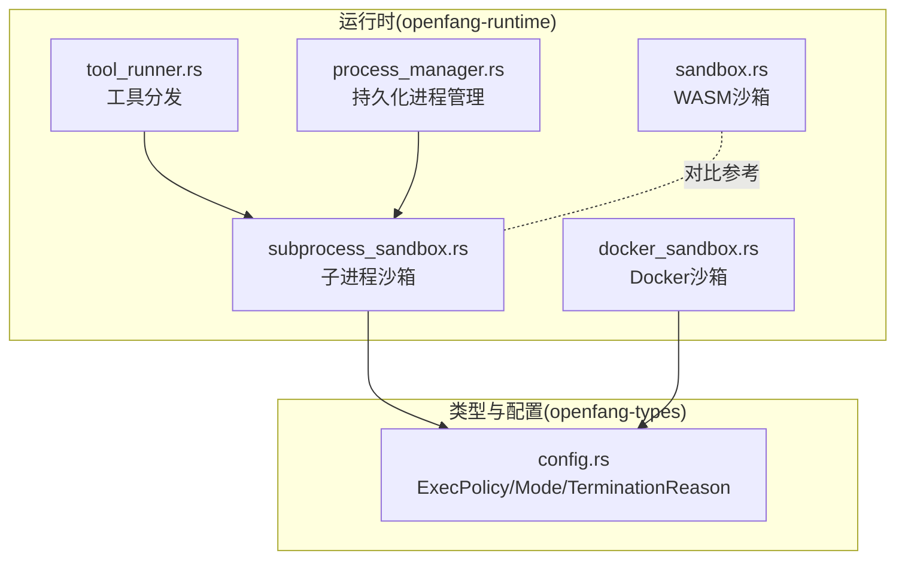
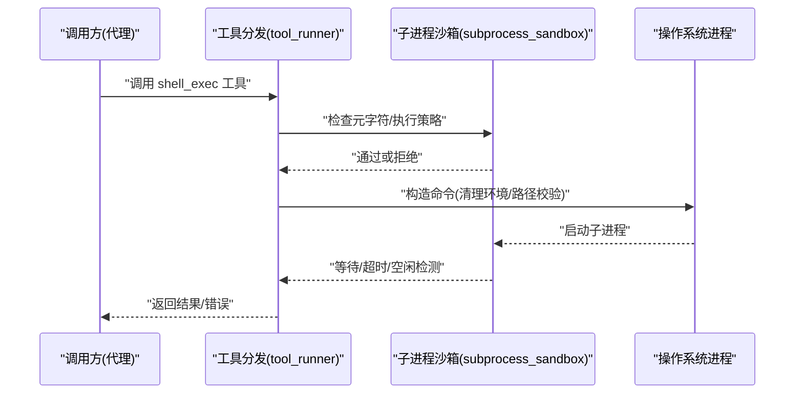
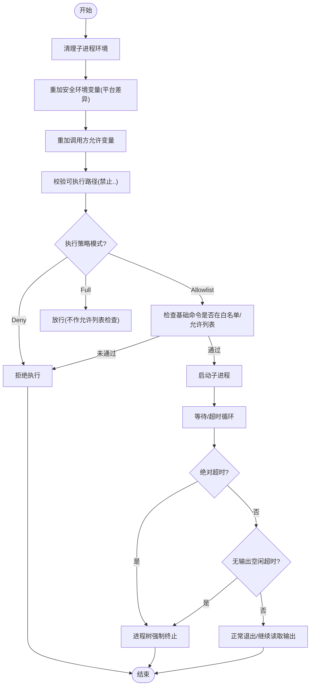
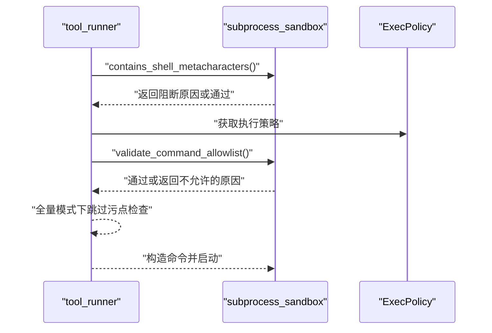
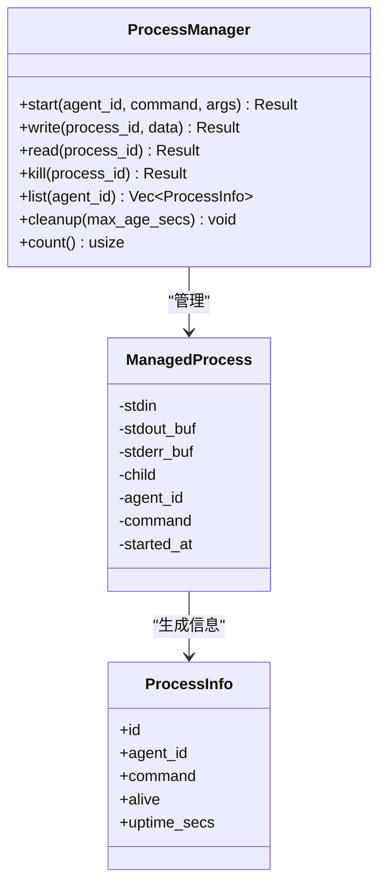
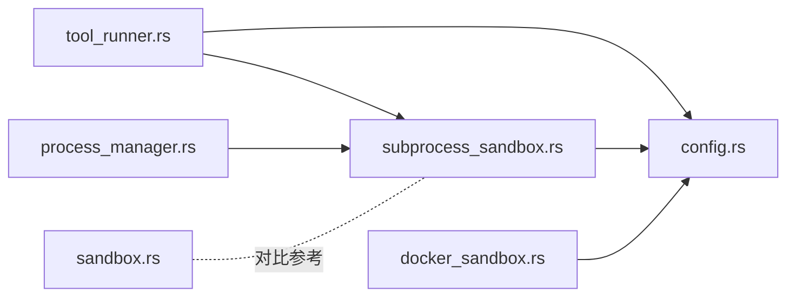

# 子进程沙箱

<cite>
**本文档引用的文件**
- [subprocess_sandbox.rs](file://crates/openfang-runtime/src/subprocess_sandbox.rs)
- [sandbox.rs](file://crates/openfang-runtime/src/sandbox.rs)
- [process_manager.rs](file://crates/openfang-runtime/src/process_manager.rs)
- [config.rs](file://crates/openfang-types/src/config.rs)
- [tool_runner.rs](file://crates/openfang-runtime/src/tool_runner.rs)
- [docker_sandbox.rs](file://crates/openfang-runtime/src/docker_sandbox.rs)
</cite>

## 目录
1. [简介](#简介)
2. [项目结构](#项目结构)
3. [核心组件](#核心组件)
4. [架构总览](#架构总览)
5. [详细组件分析](#详细组件分析)
6. [依赖关系分析](#依赖关系分析)
7. [性能考量](#性能考量)
8. [故障排查指南](#故障排查指南)
9. [结论](#结论)
10. [附录](#附录)

## 简介
本文件系统性阐述 OpenFang 的子进程沙箱机制，覆盖以下关键主题：
- 安全隔离策略：进程创建、环境变量清理、可执行路径校验、允许列表策略
- 进程生命周期管理：超时控制、无输出空闲检测、优雅终止与强制终止、进程树清理
- 权限与能力：环境变量白名单、平台差异（Windows）、跨平台信号与进程树管理
- 应用场景：Shell 命令执行、外部工具调用、批处理任务
- 与主进程隔离与容器化：与 WASM 沙箱、Docker 沙箱的关系与边界

## 项目结构
子进程沙箱相关代码主要分布在运行时与类型定义模块中：
- 运行时沙箱与工具调度：openfang-runtime
  - subprocess_sandbox.rs：子进程环境沙箱、命令允许列表、进程树管理
  - process_manager.rs：持久化进程会话管理
  - sandbox.rs：WASM 沙箱（对比参考）
  - docker_sandbox.rs：Docker 容器沙箱（对比参考）
  - tool_runner.rs：工具分发与 shell_exec 安全检查入口
- 类型与配置：openfang-types
  - config.rs：ExecPolicy、ExecSecurityMode、TerminationReason 等

图表来源
- [subprocess_sandbox.rs:1-906](file://crates/openfang-runtime/src/subprocess_sandbox.rs#L1-L906)
- [process_manager.rs:1-334](file://crates/openfang-runtime/src/process_manager.rs#L1-L334)
- [tool_runner.rs:213-266](file://crates/openfang-runtime/src/tool_runner.rs#L213-L266)
- [docker_sandbox.rs:1-635](file://crates/openfang-runtime/src/docker_sandbox.rs#L1-L635)
- [sandbox.rs:1-608](file://crates/openfang-runtime/src/sandbox.rs#L1-L608)
- [config.rs:800-999](file://crates/openfang-types/src/config.rs#L800-L999)

章节来源
- [subprocess_sandbox.rs:1-906](file://crates/openfang-runtime/src/subprocess_sandbox.rs#L1-L906)
- [process_manager.rs:1-334](file://crates/openfang-runtime/src/process_manager.rs#L1-L334)
- [tool_runner.rs:213-266](file://crates/openfang-runtime/src/tool_runner.rs#L213-L266)
- [docker_sandbox.rs:1-635](file://crates/openfang-runtime/src/docker_sandbox.rs#L1-L635)
- [sandbox.rs:1-608](file://crates/openfang-runtime/src/sandbox.rs#L1-L608)
- [config.rs:800-999](file://crates/openfang-types/src/config.rs#L800-L999)

## 核心组件
- 子进程环境沙箱
  - 清理并重建安全环境变量白名单，支持平台差异（Windows）
  - 可执行路径校验，阻断目录穿越
  - Shell 允许列表策略与元字符注入防护
- 进程树管理与超时控制
  - 跨平台优雅终止与强制终止
  - 绝对超时与“无输出空闲”双重超时
  - 输出收集与终止原因归因
- 工具调度与安全前置
  - shell_exec 工具入口进行元字符检查与执行策略校验
- 持久化进程管理
  - 长时进程会话、标准流缓冲、限额与清理
- 配置与类型
  - ExecPolicy、ExecSecurityMode、TerminationReason 等

章节来源
- [subprocess_sandbox.rs:13-64](file://crates/openfang-runtime/src/subprocess_sandbox.rs#L13-L64)
- [subprocess_sandbox.rs:66-241](file://crates/openfang-runtime/src/subprocess_sandbox.rs#L66-L241)
- [subprocess_sandbox.rs:247-579](file://crates/openfang-runtime/src/subprocess_sandbox.rs#L247-L579)
- [tool_runner.rs:213-266](file://crates/openfang-runtime/src/tool_runner.rs#L213-L266)
- [process_manager.rs:16-32](file://crates/openfang-runtime/src/process_manager.rs#L16-L32)
- [config.rs:800-862](file://crates/openfang-types/src/config.rs#L800-L862)

## 架构总览
下图展示子进程沙箱在工具调用链路中的位置与交互：

图表来源
- [tool_runner.rs:213-266](file://crates/openfang-runtime/src/tool_runner.rs#L213-L266)
- [subprocess_sandbox.rs:30-64](file://crates/openfang-runtime/src/subprocess_sandbox.rs#L30-L64)
- [subprocess_sandbox.rs:408-426](file://crates/openfang-runtime/src/subprocess_sandbox.rs#L408-L426)

## 详细组件分析

### 子进程环境沙箱
- 环境变量清理与重建
  - 清空子进程环境，仅重加安全白名单变量
  - 平台差异：Windows 增加特定安全变量集合
  - 支持调用方显式允许额外变量
- 可执行路径校验
  - 拒绝包含父目录组件的路径，防止目录穿越
- Shell 允许列表与元字符防护
  - 元字符阻断：反引号命令替换、$()/${} 扩展、管道、重定向、大括号扩展、换行、空字节、后台与逻辑连接等
  - 允许列表：按模式（deny/full/allowlist）执行；allowlist 下严格校验基础命令是否在白名单或允许列表
- 进程树管理与超时控制
  - 跨平台优雅终止（Unix: SIGTERM；Windows: taskkill /T），等待宽限期后强制终止（SIGKILL/taskkill /F）
  - 绝对超时与“无输出空闲”超时双轨控制，输出收集与终止原因归类

图表来源
- [subprocess_sandbox.rs:30-64](file://crates/openfang-runtime/src/subprocess_sandbox.rs#L30-L64)
- [subprocess_sandbox.rs:66-241](file://crates/openfang-runtime/src/subprocess_sandbox.rs#L66-L241)
- [subprocess_sandbox.rs:247-579](file://crates/openfang-runtime/src/subprocess_sandbox.rs#L247-L579)

章节来源
- [subprocess_sandbox.rs:13-64](file://crates/openfang-runtime/src/subprocess_sandbox.rs#L13-L64)
- [subprocess_sandbox.rs:66-241](file://crates/openfang-runtime/src/subprocess_sandbox.rs#L66-L241)
- [subprocess_sandbox.rs:247-579](file://crates/openfang-runtime/src/subprocess_sandbox.rs#L247-L579)

### 工具调度与安全前置
- shell_exec 工具入口
  - 元字符检查优先于执行策略，确保无论何种模式均阻断注入风险
  - 执行策略校验：根据 ExecPolicy.mode 决定放行范围
  - 全量模式下跳过启发式污点检查（便于手工作业）

图表来源
- [tool_runner.rs:213-266](file://crates/openfang-runtime/src/tool_runner.rs#L213-L266)
- [subprocess_sandbox.rs:96-241](file://crates/openfang-runtime/src/subprocess_sandbox.rs#L96-L241)
- [config.rs:800-843](file://crates/openfang-types/src/config.rs#L800-L843)

章节来源
- [tool_runner.rs:213-266](file://crates/openfang-runtime/src/tool_runner.rs#L213-L266)
- [config.rs:800-843](file://crates/openfang-types/src/config.rs#L800-L843)

### 持久化进程管理
- 会话级长时进程
  - 启动时限制每个代理的最大进程数
  - 异步读取 stdout/stderr，缓冲上限与滚动丢弃
  - 提供写入 stdin、轮询输出、杀死进程、列出进程、清理超期进程等能力
  - 杀死进程时优先使用进程树清理

图表来源
- [process_manager.rs:16-32](file://crates/openfang-runtime/src/process_manager.rs#L16-L32)
- [process_manager.rs:50-255](file://crates/openfang-runtime/src/process_manager.rs#L50-L255)

章节来源
- [process_manager.rs:1-334](file://crates/openfang-runtime/src/process_manager.rs#L1-L334)

### 配置与类型
- ExecPolicy
  - mode: deny/allowlist/full
  - safe_bins/allowed_commands: 允许列表
  - timeout_secs/max_output_bytes/no_output_timeout_secs: 执行与输出约束
- ExecSecurityMode
  - 枚举值映射与默认行为
- TerminationReason
  - 正常退出、绝对超时、无输出超时

章节来源
- [config.rs:800-862](file://crates/openfang-types/src/config.rs#L800-L862)

### 与 WASM 沙箱与 Docker 沙箱的关系
- WASM 沙箱
  - 通过 Wasmtime 实现 deny-by-default 的能力授权模型，无文件系统/网络访问除非显式授予
  - 适合插件/技能的轻量隔离
- Docker 沙箱
  - 使用容器提供 OS 级隔离，资源限制、网络隔离、能力降级、只读根文件系统
  - 适合需要更强隔离与系统级工具调用的场景
- 子进程沙箱
  - 在主进程中直接启动子进程，结合环境清理、允许列表与超时控制，提供中间强度的隔离
  - 与 WASM/Docker 形成互补：快速、轻量、可控

章节来源
- [sandbox.rs:1-608](file://crates/openfang-runtime/src/sandbox.rs#L1-L608)
- [docker_sandbox.rs:1-635](file://crates/openfang-runtime/src/docker_sandbox.rs#L1-L635)
- [subprocess_sandbox.rs:1-906](file://crates/openfang-runtime/src/subprocess_sandbox.rs#L1-L906)

## 依赖关系分析
- 工具层依赖子进程沙箱进行安全前置与执行
- 进程管理器依赖子进程沙箱进行进程树清理
- 配置类型被工具层与沙箱共同消费

图表来源
- [tool_runner.rs:213-266](file://crates/openfang-runtime/src/tool_runner.rs#L213-L266)
- [subprocess_sandbox.rs:1-906](file://crates/openfang-runtime/src/subprocess_sandbox.rs#L1-L906)
- [process_manager.rs:1-334](file://crates/openfang-runtime/src/process_manager.rs#L1-L334)
- [docker_sandbox.rs:1-635](file://crates/openfang-runtime/src/docker_sandbox.rs#L1-L635)
- [sandbox.rs:1-608](file://crates/openfang-runtime/src/sandbox.rs#L1-L608)
- [config.rs:800-999](file://crates/openfang-types/src/config.rs#L800-L999)

章节来源
- [tool_runner.rs:213-266](file://crates/openfang-runtime/src/tool_runner.rs#L213-L266)
- [subprocess_sandbox.rs:1-906](file://crates/openfang-runtime/src/subprocess_sandbox.rs#L1-L906)
- [process_manager.rs:1-334](file://crates/openfang-runtime/src/process_manager.rs#L1-L334)
- [docker_sandbox.rs:1-635](file://crates/openfang-runtime/src/docker_sandbox.rs#L1-L635)
- [sandbox.rs:1-608](file://crates/openfang-runtime/src/sandbox.rs#L1-L608)
- [config.rs:800-999](file://crates/openfang-types/src/config.rs#L800-L999)

## 性能考量
- 环境变量重建与路径校验开销极低，主要成本在进程 IO 与超时轮询
- “无输出空闲”超时通过短周期轮询实现，建议根据任务特性调整阈值
- 进程树清理采用跨平台命令调用，避免额外依赖
- 持久化进程的 stdout/stderr 缓冲需注意内存占用，已实现滚动丢弃

## 故障排查指南
- 元字符阻断
  - 症状：shell_exec 被拒绝且提示包含元字符
  - 处理：移除元字符或在全量模式下配置策略（不推荐生产）
- 允许列表拒绝
  - 症状：命令不在白名单或允许列表
  - 处理：将命令加入 safe_bins 或 allowed_commands，或调整 exec_policy.mode
- 路径穿越阻断
  - 症状：使用包含 .. 的路径启动失败
  - 处理：使用相对或绝对但不包含父目录组件的路径
- 超时与无输出空闲
  - 症状：进程被强制终止
  - 处理：增大 timeout_secs 或 no_output_timeout_secs；检查子进程是否产生输出
- 进程树清理失败
  - 症状：僵尸进程或孤儿进程
  - 处理：确认主进程具备相应平台权限；必要时手动清理

章节来源
- [subprocess_sandbox.rs (测试):581-906](file://crates/openfang-runtime/src/subprocess_sandbox.rs#L581-L906)
- [process_manager.rs (测试):263-334](file://crates/openfang-runtime/src/process_manager.rs#L263-L334)

## 结论
OpenFang 的子进程沙箱通过“最小环境+允许列表+元字符阻断+双轨超时”的组合策略，在主进程中实现了高性价比的安全隔离。它与 WASM/Docker 沙箱形成互补，既满足快速、可控的日常工具调用，又能在需要时升级到更强隔离。建议在生产环境中：
- 默认使用 allowlist 模式
- 明确列出允许的基础命令
- 合理设置超时与空闲阈值
- 对持久化进程实施配额与清理策略

## 附录

### 安全配置要点清单
- 环境变量
  - 仅保留 PATH/HOME/LANG/TERM 等基础变量；Windows 增加 USERPROFILE/SYSTEMROOT 等
  - 通过 allowed_env_vars 显式添加业务所需变量
- 可执行路径
  - 禁止包含父目录组件
- Shell 允许列表
  - deny：完全禁用
  - allowlist：仅允许白名单命令
  - full：放行（开发/调试）
- 超时与输出
  - 设置合理的绝对超时与无输出空闲超时
  - 控制最大输出大小，避免内存压力

章节来源
- [subprocess_sandbox.rs:13-64](file://crates/openfang-runtime/src/subprocess_sandbox.rs#L13-L64)
- [subprocess_sandbox.rs:66-241](file://crates/openfang-runtime/src/subprocess_sandbox.rs#L66-L241)
- [config.rs:800-862](file://crates/openfang-types/src/config.rs#L800-L862)