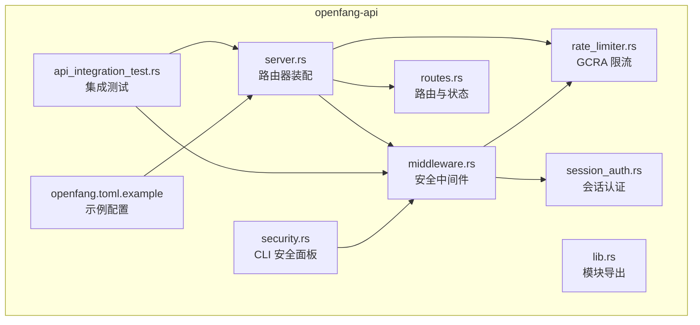
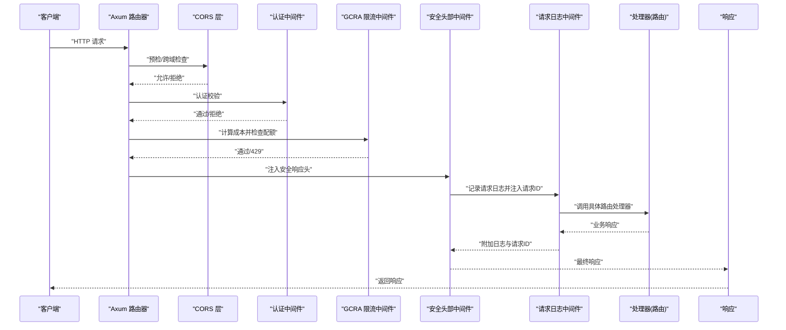
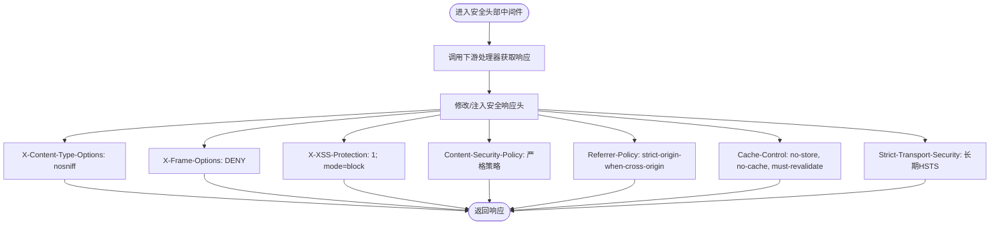
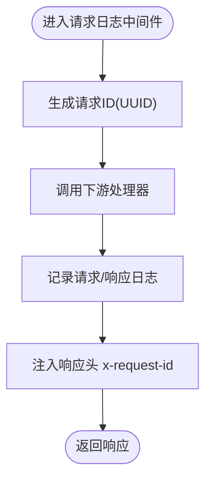
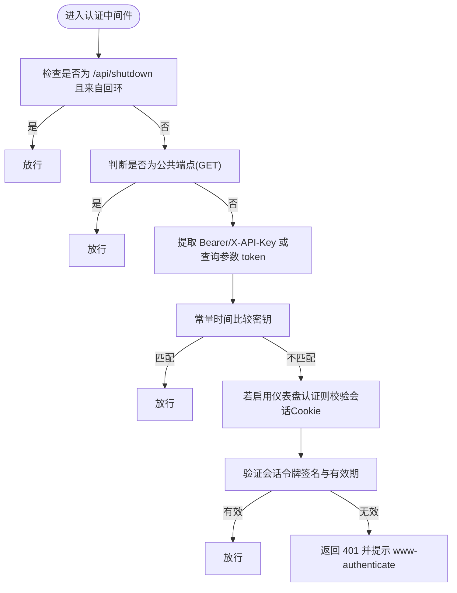
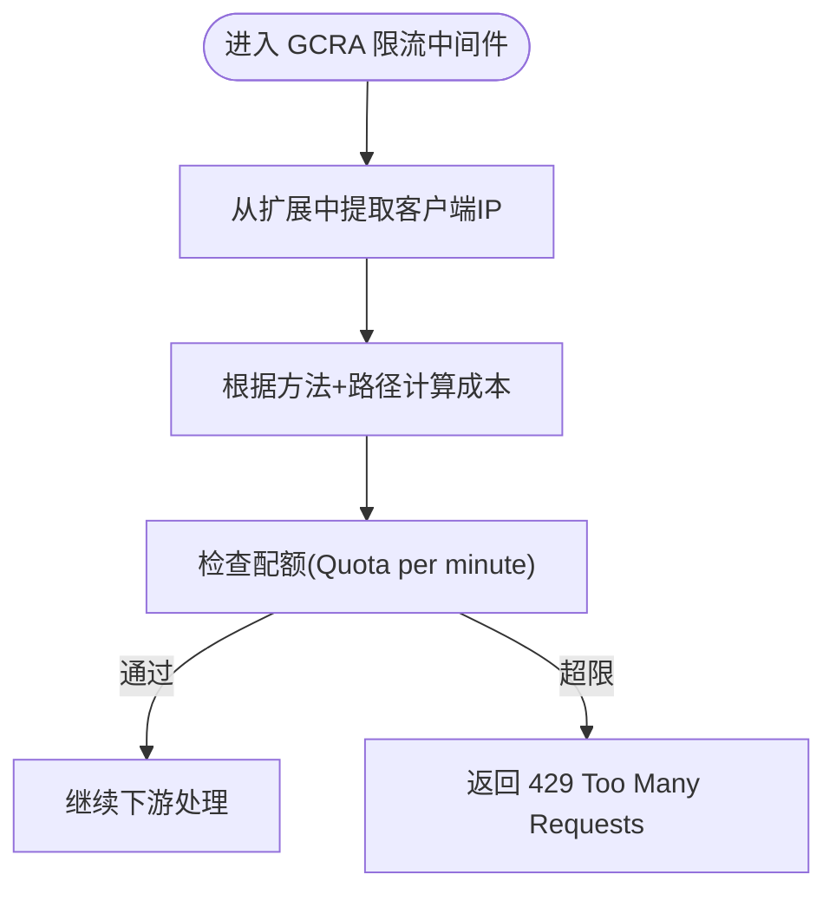
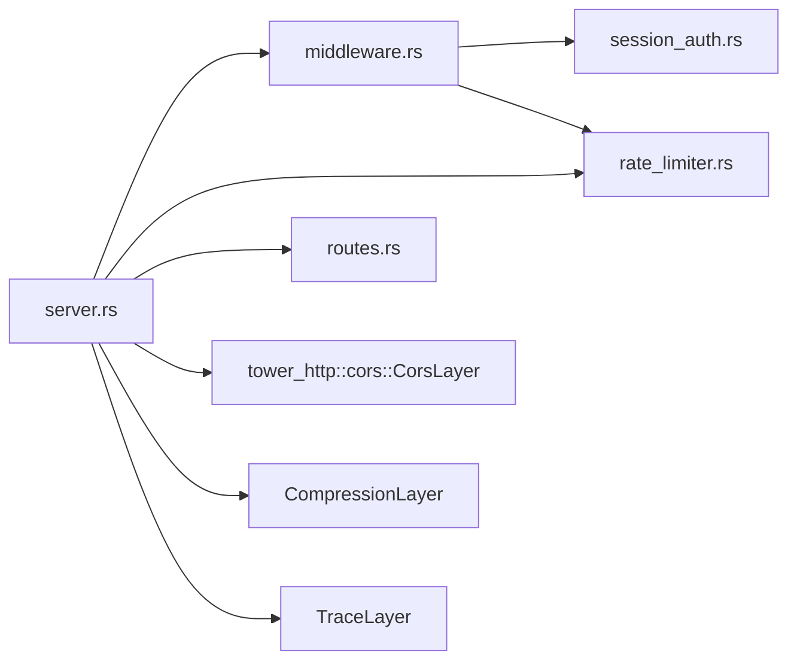

# 安全中间件

<cite>
**本文引用的文件**
- [middleware.rs](file://crates/openfang-api/src/middleware.rs)
- [server.rs](file://crates/openfang-api/src/server.rs)
- [session_auth.rs](file://crates/openfang-api/src/session_auth.rs)
- [rate_limiter.rs](file://crates/openfang-api/src/rate_limiter.rs)
- [lib.rs](file://crates/openfang-api/src/lib.rs)
- [routes.rs](file://crates/openfang-api/src/routes.rs)
- [api_integration_test.rs](file://crates/openfang-api/tests/api_integration_test.rs)
- [openfang.toml.example](file://openfang.toml.example)
- [security.rs](file://crates/openfang-cli/src/tui/screens/security.rs)
</cite>

## 目录
1. [简介](#简介)
2. [项目结构](#项目结构)
3. [核心组件](#核心组件)
4. [架构总览](#架构总览)
5. [详细组件分析](#详细组件分析)
6. [依赖关系分析](#依赖关系分析)
7. [性能考量](#性能考量)
8. [故障排查指南](#故障排查指南)
9. [结论](#结论)
10. [附录](#附录)

## 简介
本文件面向 OpenFang 安全中间件系统，聚焦于 API 安全中间件的实现与配置，涵盖内容安全策略（CSP）、X-Frame-Options、X-Content-Type-Options、X-XSS-Protection、Referrer-Policy、Cache-Control、Strict-Transport-Security 等安全头部的设置与作用；说明中间件执行顺序、请求处理流程、响应头注入机制；记录安全头部的配置选项、自定义策略与兼容性考虑；并阐述安全中间件在 Web 应用防护、API 安全、跨站脚本攻击防护中的具体应用，以及与认证授权、CORS、速率限制等其他安全机制的协同工作方式。

## 项目结构
OpenFang 的安全中间件位于 openfang-api 子模块中，核心文件包括：
- 中间件实现：middleware.rs
- 服务器装配与中间件注册：server.rs
- 会话认证与令牌验证：session_auth.rs
- 速率限制（GCRA）：rate_limiter.rs
- 路由与状态：routes.rs
- 测试与示例配置：api_integration_test.rs、openfang.toml.example
- CLI 安全功能展示：security.rs

**图表来源**
- [server.rs:37-712](file://crates/openfang-api/src/server.rs#L37-L712)
- [middleware.rs:1-270](file://crates/openfang-api/src/middleware.rs#L1-L270)
- [session_auth.rs:1-110](file://crates/openfang-api/src/session_auth.rs#L1-L110)
- [rate_limiter.rs:1-98](file://crates/openfang-api/src/rate_limiter.rs#L1-L98)
- [routes.rs:1-200](file://crates/openfang-api/src/routes.rs#L1-L200)
- [lib.rs:1-18](file://crates/openfang-api/src/lib.rs#L1-L18)
- [api_integration_test.rs:1-200](file://crates/openfang-api/tests/api_integration_test.rs#L1-L200)
- [openfang.toml.example:1-49](file://openfang.toml.example#L1-L49)
- [security.rs:105-136](file://crates/openfang-cli/src/tui/screens/security.rs#L105-L136)

**章节来源**
- [lib.rs:1-18](file://crates/openfang-api/src/lib.rs#L1-L18)
- [server.rs:37-712](file://crates/openfang-api/src/server.rs#L37-L712)

## 核心组件
- 安全头部中间件：对所有 API 响应注入安全相关响应头，统一强化浏览器端安全基线。
- 请求日志与请求 ID 注入：为每条请求生成唯一标识并在响应头中返回，便于追踪与审计。
- 认证中间件：支持 Bearer Token 与 X-API-Key，同时支持基于会话的登录态校验。
- 速率限制中间件（GCRA）：按操作成本进行配额控制，防止滥用与资源耗尽。
- CORS 层：根据是否启用鉴权与监听地址动态配置允许来源，避免宽泛放行带来的风险。

**章节来源**
- [middleware.rs:17-259](file://crates/openfang-api/src/middleware.rs#L17-L259)
- [rate_limiter.rs:46-79](file://crates/openfang-api/src/rate_limiter.rs#L46-L79)
- [server.rs:56-104](file://crates/openfang-api/src/server.rs#L56-L104)

## 架构总览
下图展示了安全中间件在请求生命周期中的位置与调用顺序，以及与认证、CORS、压缩、追踪等层的关系。

**图表来源**
- [server.rs:696-709](file://crates/openfang-api/src/server.rs#L696-L709)
- [middleware.rs:17-44](file://crates/openfang-api/src/middleware.rs#L17-L44)
- [middleware.rs:232-259](file://crates/openfang-api/src/middleware.rs#L232-L259)
- [rate_limiter.rs:51-79](file://crates/openfang-api/src/rate_limiter.rs#L51-L79)

## 详细组件分析

### 安全头部中间件
- 作用范围：应用于所有 API 响应，确保浏览器端具备一致的安全基线。
- 关键响应头：
  - X-Content-Type-Options: nosniff，阻止 MIME 类型嗅探，降低误解析风险。
  - X-Frame-Options: DENY，防止页面被嵌入到第三方 iframe，缓解点击劫持。
  - X-XSS-Protection: 1; mode=block，启用浏览器内置 XSS 过滤（在现代浏览器中已逐步弃用，仍可作为辅助保护）。
  - Content-Security-Policy：严格限制资源来源，仅允许内联脚本与 eval（用于开发场景），允许特定外部字体源，限定连接目标（本地 WebSocket），限制 frame 与对象源，禁止表单外提交等。
  - Referrer-Policy: strict-origin-when-cross-origin，平衡隐私与安全性。
  - Cache-Control: no-store, no-cache, must-revalidate，避免缓存敏感数据。
  - Strict-Transport-Security: max-age=63072000; includeSubDomains，强制 HTTPS，提升传输层安全。
- 注入时机：在 next.run(request).await 后修改响应头，确保覆盖下游处理器的任何响应头变更。

**图表来源**
- [middleware.rs:232-259](file://crates/openfang-api/src/middleware.rs#L232-L259)

**章节来源**
- [middleware.rs:232-259](file://crates/openfang-api/src/middleware.rs#L232-L259)

### 请求日志与请求 ID 注入
- 请求 ID：每次请求生成唯一 UUID，并注入到响应头 x-request-id，便于端到端追踪。
- 日志记录：记录方法、路径、状态码与耗时，统一输出结构化日志。
- 注入位置：在 next.run(request).await 后向响应头追加请求 ID。

**图表来源**
- [middleware.rs:17-44](file://crates/openfang-api/src/middleware.rs#L17-L44)

**章节来源**
- [middleware.rs:17-44](file://crates/openfang-api/src/middleware.rs#L17-L44)

### 认证中间件与会话认证
- 支持的凭据：
  - Authorization: Bearer <api_key>
  - X-API-Key 头
  - 查询参数 token=（SSE/EventSource 场景）
  - Cookie openfang_session（当启用仪表盘登录态时）
- 公共端点：对 GET 请求的若干公开端点免认证（如健康检查、静态资源、部分只读接口），POST/PUT/DELETE 默认要求认证以防止未授权写入。
- 会话校验：使用 HMAC-SHA256 签名的会话令牌，包含用户名与过期时间，常量时间比较防时序攻击。
- 特殊豁免：/api/shutdown 仅允许回环地址访问。

**图表来源**
- [middleware.rs:62-215](file://crates/openfang-api/src/middleware.rs#L62-L215)
- [session_auth.rs:9-56](file://crates/openfang-api/src/session_auth.rs#L9-L56)

**章节来源**
- [middleware.rs:62-215](file://crates/openfang-api/src/middleware.rs#L62-L215)
- [session_auth.rs:9-56](file://crates/openfang-api/src/session_auth.rs#L9-L56)

### 速率限制中间件（GCRA）
- 算法：通用信元速率算法（GCRA），按操作成本分配配额，分钟级配额上限固定。
- 成本映射：不同方法与路径对应不同 token 成本，例如健康检查成本低，创建/运行类操作成本较高。
- 拒绝策略：超出配额返回 429，包含 Retry-After 与 JSON 错误体。
- IP 提取：从 ConnectInfo 扩展中获取客户端 IP，回退为本地回环地址。

**图表来源**
- [rate_limiter.rs:51-79](file://crates/openfang-api/src/rate_limiter.rs#L51-L79)

**章节来源**
- [rate_limiter.rs:14-79](file://crates/openfang-api/src/rate_limiter.rs#L14-L79)

### CORS 层与安全策略
- 无鉴权模式：默认仅允许本地回环来源（含常见开发端口），避免跨域滥用。
- 已启用鉴权或配置了 API Key：在本地回环基础上增加指定前端开发端口，避免生产环境宽泛放行。
- 安全建议：避免使用 permissive 配置，明确列出可信来源，减少 CSRF 与跨域攻击面。

**章节来源**
- [server.rs:56-104](file://crates/openfang-api/src/server.rs#L56-L104)

## 依赖关系分析
- 中间件装配：server.rs 在构建 Router 时按顺序叠加中间件层，确保安全与可观测性前置。
- 组件耦合：
  - 认证中间件依赖会话认证模块进行 Cookie 校验。
  - 速率限制中间件依赖 GCRA 实现与状态存储。
  - 安全头部中间件独立性强，仅依赖标准库 HTTP 头部类型。
- 可能的循环依赖：当前模块间为单向依赖，未见循环导入。

**图表来源**
- [server.rs:696-709](file://crates/openfang-api/src/server.rs#L696-L709)
- [middleware.rs:1-270](file://crates/openfang-api/src/middleware.rs#L1-L270)
- [rate_limiter.rs:1-98](file://crates/openfang-api/src/rate_limiter.rs#L1-L98)
- [session_auth.rs:1-110](file://crates/openfang-api/src/session_auth.rs#L1-L110)

**章节来源**
- [server.rs:696-709](file://crates/openfang-api/src/server.rs#L696-L709)

## 性能考量
- 中间件链路短、开销小：安全头部注入与日志记录均为轻量操作，对吞吐影响有限。
- GCRA 限流：内存态存储（DashMapStateStore）与每分钟配额，适合高并发场景；成本计算为 O(1) 映射。
- 建议：
  - 将安全与日志中间件置于靠近路由层，减少不必要的下游处理。
  - 对高 QPS 接口适当提高配额或调整成本权重，避免误伤正常用户。
  - 在生产环境启用 HSTS 与严格的 CSP，配合 CDN 缓存策略优化加载性能。

## 故障排查指南
- 401 未授权：
  - 检查是否正确设置 Authorization: Bearer <api_key> 或 X-API-Key。
  - 若使用查询参数 token=，确认参数值与服务端配置一致。
  - 若启用仪表盘登录态，确认 Cookie openfang_session 是否存在且未过期。
- 429 请求过多：
  - 查看 Retry-After 头，等待配额恢复。
  - 检查是否命中高成本端点（如运行/安装类），必要时降频或合并请求。
- CORS 跨域失败：
  - 确认前端来源是否在允许列表中；开发模式下仅允许本地回环与常见开发端口。
  - 生产环境请勿使用 permissive 配置。
- 安全头部未生效：
  - 确认安全中间件已在路由层注册且优先级靠前。
  - 检查下游处理器是否覆盖了关键响应头。
- 请求 ID 缺失：
  - 确认请求日志中间件已注册，且响应未被提前短路。

**章节来源**
- [middleware.rs:62-215](file://crates/openfang-api/src/middleware.rs#L62-L215)
- [rate_limiter.rs:66-76](file://crates/openfang-api/src/rate_limiter.rs#L66-L76)
- [server.rs:56-104](file://crates/openfang-api/src/server.rs#L56-L104)

## 结论
OpenFang 的安全中间件通过“安全头部注入 + 认证 + 速率限制 + CORS + 日志追踪”的组合，构建了面向 API 与 Web 应用的纵深防御体系。其设计强调最小侵入、可配置与可观测性，既满足开发调试便利，又能在生产环境提供强健的安全基线。建议在部署时结合实际流量特征调整配额与 CSP 策略，并持续监控安全状态与异常事件。

## 附录

### 安全头部配置与自定义策略
- 内容安全策略（CSP）：
  - 默认仅允许同源脚本与内联/eval（开发用途），样式允许内联与特定字体源，限制图片、媒体、字体与连接目标，严格 frame 与对象源。
  - 自定义建议：生产环境尽量移除 unsafe-inline 与 unsafe-eval，采用哈希或非cesium 策略；对外部资源使用子资源完整性（SRI）。
- X-Frame-Options：建议保持 DENY，除非有明确的 iframe 嵌入需求并具备严格的来源白名单。
- X-Content-Type-Options：建议保持 nosniff，避免 MIME 嗅探导致的错误渲染。
- X-XSS-Protection：现代浏览器已逐步弃用，建议依赖 CSP 与输入输出过滤。
- Referrer-Policy：strict-origin-when-cross-origin 平衡隐私与安全性，适用于大多数场景。
- Cache-Control：no-store/no-cache/must-revalidate 适用于敏感数据，避免缓存泄露。
- Strict-Transport-Security：长期 HSTS 强制 HTTPS，需谨慎评估子域名覆盖范围。

**章节来源**
- [middleware.rs:232-259](file://crates/openfang-api/src/middleware.rs#L232-L259)

### 与认证授权、CORS、速率限制的协同
- 认证优先：在安全头部之前执行，确保未授权请求尽早被拒绝。
- CORS 与认证：CORS 层先于认证层，但受限来源仅对受信任端点开放；认证层进一步细化权限。
- 速率限制：在认证之后、安全头部之前，既能保护公共资源，又能避免对已认证用户过度限流。
- 安全头部：最后注入，确保所有响应均带有统一安全基线。

**章节来源**
- [server.rs:696-709](file://crates/openfang-api/src/server.rs#L696-L709)

### 配置示例与最佳实践
- 示例配置文件：参考 openfang.toml.example，设置 api_key 以启用 Bearer 认证。
- 最佳实践：
  - 生产环境必须设置 api_key 并启用 HTTPS。
  - 使用严格的 CSP，避免 unsafe-inline 与 unsafe-eval。
  - 合理设置 GCRA 配额，区分不同端点的成本权重。
  - CORS 仅允许可信来源，避免 permissive 配置。
  - 定期审查安全头部与 CSP 策略，结合审计日志与监控告警。

**章节来源**
- [openfang.toml.example:1-49](file://openfang.toml.example#L1-L49)