# 安全架构

<cite>
**本文引用的文件**
- [安全架构（security.md）](file://docs/security.md)
- [安全政策（SECURITY.md）](file://SECURITY.md)
- [认证与授权（auth.rs）](file://crates/openfang-kernel/src/auth.rs)
- [能力类型（capability.rs）](file://crates/openfang-types/src/capability.rs)
- [WASM 沙箱（sandbox.rs）](file://crates/openfang-runtime/src/sandbox.rs)
- [主机函数（host_functions.rs）](file://crates/openfang-runtime/src/host_functions.rs)
- [污点跟踪（taint.rs）](file://crates/openfang-types/src/taint.rs)
- [审计日志（audit.rs）](file://crates/openfang-runtime/src/audit.rs)
- [OFP 对等节点（peer.rs）](file://crates/openfang-wire/src/peer.rs)
- [API 中间件（middleware.rs）](file://crates/openfang-api/src/middleware.rs)
- [子进程沙箱（subprocess_sandbox.rs）](file://crates/openfang-runtime/src/subprocess_sandbox.rs)
- [清单签名（manifest_signing.rs）](file://crates/openfang-types/src/manifest_signing.rs)
</cite>

## 目录
1. [简介](#简介)
2. [项目结构](#项目结构)
3. [核心组件](#核心组件)
4. [架构总览](#架构总览)
5. [组件深度解析](#组件深度解析)
6. [依赖关系分析](#依赖关系分析)
7. [性能考量](#性能考量)
8. [故障排查指南](#故障排查指南)
9. [结论](#结论)
10. [附录](#附录)

## 简介
本文件面向 OpenFang 安全架构，系统化阐述 16 层防御体系的设计理念与技术实现，覆盖：
- WASM 双重计量沙箱
- Merkle 哈希链审计
- 信息流污点跟踪
- Ed25519 签名代理清单
- SSRF 保护
- 秘密零化
- OFP 互认证
- 能力门禁
- 认证授权机制
- 沙箱隔离技术
- 审计日志系统
- 监控告警策略
- 威胁模型与缓解
- 安全配置与合规
- 安全事件响应与漏洞管理
- 与系统其他组件的集成关系

## 项目结构
OpenFang 将安全控制点分布于多 crate 与模块中，形成“纵深防御”：
- 类型与策略层：能力模型、污点模型、清单签名
- 运行时隔离层：WASM 沙箱、主机函数检查、子进程沙箱
- 网络与协议层：OFP 互认证、安全头、速率限制
- 审计与可观测层：Merkle 审计链、请求日志、健康端点脱敏
- 平台与访问控制：RBAC 多用户、API 认证中间件

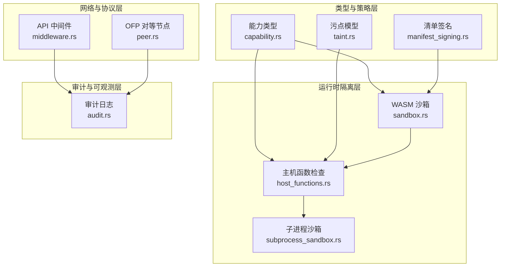

图示来源
- [能力类型（capability.rs）:1-317](file://crates/openfang-types/src/capability.rs#L1-L317)
- [污点跟踪（taint.rs）:1-245](file://crates/openfang-types/src/taint.rs#L1-L245)
- [清单签名（manifest_signing.rs）:1-167](file://crates/openfang-types/src/manifest_signing.rs#L1-L167)
- [WASM 沙箱（sandbox.rs）:1-608](file://crates/openfang-runtime/src/sandbox.rs#L1-L608)
- [主机函数（host_functions.rs）:1-669](file://crates/openfang-runtime/src/host_functions.rs#L1-L669)
- [子进程沙箱（subprocess_sandbox.rs）:1-906](file://crates/openfang-runtime/src/subprocess_sandbox.rs#L1-L906)
- [OFP 对等节点（peer.rs）:1-1285](file://crates/openfang-wire/src/peer.rs#L1-L1285)
- [API 中间件（middleware.rs）:1-270](file://crates/openfang-api/src/middleware.rs#L1-L270)
- [审计日志（audit.rs）:1-423](file://crates/openfang-runtime/src/audit.rs#L1-L423)

章节来源
- [安全架构（security.md）:1-800](file://docs/security.md#L1-L800)
- [安全政策（SECURITY.md）:1-95](file://SECURITY.md#L1-L95)

## 核心组件
- 能力门禁：基于能力模型的“按需授予”，在 WASM 主机调用前进行匹配校验，防止越权操作。
- WASM 双重计量：燃料（指令数）与时间（epoch 中断）双轨计量，抵御 CPU/时钟滥用。
- Merkle 审计链：对关键动作进行链式哈希记录，支持完整性验证与持久化存储。
- 污点跟踪：基于格的传播模型，阻断敏感数据流向不安全汇点，防范注入与泄露。
- Ed25519 清单签名：对代理清单进行签名与校验，抵御供应链攻击。
- SSRF 保护：URL 方案校验、主机黑名单、DNS 解析后私网地址检测。
- 秘密零化：使用零化内存容器，确保敏感字段在生命周期结束后被覆盖。
- OFP 互认证：基于预共享密钥的 HMAC-SHA256 握手，带随机数与重放防护。
- API 安全头与认证：统一安全响应头、Bearer/X-API-Key 认证、会话 Cookie 验证。
- 子进程沙箱：环境变量白名单、可执行路径校验、命令元字符阻断与进程树清理。

章节来源
- [能力类型（capability.rs）:1-317](file://crates/openfang-types/src/capability.rs#L1-L317)
- [WASM 沙箱（sandbox.rs）:1-608](file://crates/openfang-runtime/src/sandbox.rs#L1-L608)
- [主机函数（host_functions.rs）:1-669](file://crates/openfang-runtime/src/host_functions.rs#L1-L669)
- [污点跟踪（taint.rs）:1-245](file://crates/openfang-types/src/taint.rs#L1-L245)
- [审计日志（audit.rs）:1-423](file://crates/openfang-runtime/src/audit.rs#L1-L423)
- [OFP 对等节点（peer.rs）:1-1285](file://crates/openfang-wire/src/peer.rs#L1-L1285)
- [API 中间件（middleware.rs）:1-270](file://crates/openfang-api/src/middleware.rs#L1-L270)
- [子进程沙箱（subprocess_sandbox.rs）:1-906](file://crates/openfang-runtime/src/subprocess_sandbox.rs#L1-L906)
- [清单签名（manifest_signing.rs）:1-167](file://crates/openfang-types/src/manifest_signing.rs#L1-L167)

## 架构总览
下图展示 OpenFang 的安全架构如何通过多层控制点协同工作，形成“纵深防御”。

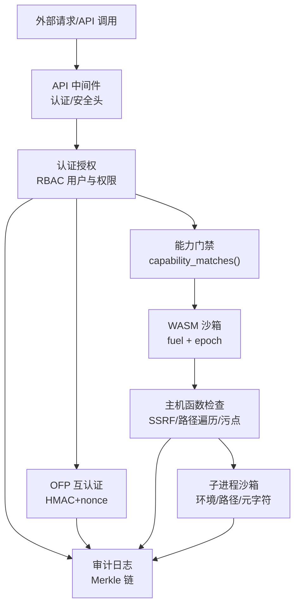

图示来源
- [API 中间件（middleware.rs）:1-270](file://crates/openfang-api/src/middleware.rs#L1-L270)
- [认证与授权（auth.rs）:1-317](file://crates/openfang-kernel/src/auth.rs#L1-L317)
- [能力类型（capability.rs）:1-317](file://crates/openfang-types/src/capability.rs#L1-L317)
- [WASM 沙箱（sandbox.rs）:1-608](file://crates/openfang-runtime/src/sandbox.rs#L1-L608)
- [主机函数（host_functions.rs）:1-669](file://crates/openfang-runtime/src/host_functions.rs#L1-L669)
- [子进程沙箱（subprocess_sandbox.rs）:1-906](file://crates/openfang-runtime/src/subprocess_sandbox.rs#L1-L906)
- [OFP 对等节点（peer.rs）:1-1285](file://crates/openfang-wire/src/peer.rs#L1-L1285)
- [审计日志（audit.rs）:1-423](file://crates/openfang-runtime/src/audit.rs#L1-L423)

## 组件深度解析

### 能力门禁（Capability-Based Security）
- 设计要点
  - 能力枚举覆盖文件、网络、工具、LLM、Agent 交互、内存、Shell、OFP、经济等维度。
  - 匹配规则支持通配符与数值边界，确保最小权限与细粒度控制。
  - 子代能力必须是父代能力的子集，防止权限提升。
- 执行流程
  - WASM 主机调用前，先检查所需能力是否被授予；未匹配则直接拒绝。
  - 文件系统与网络调用均需对应能力，并在执行前进行路径与主机模式校验。

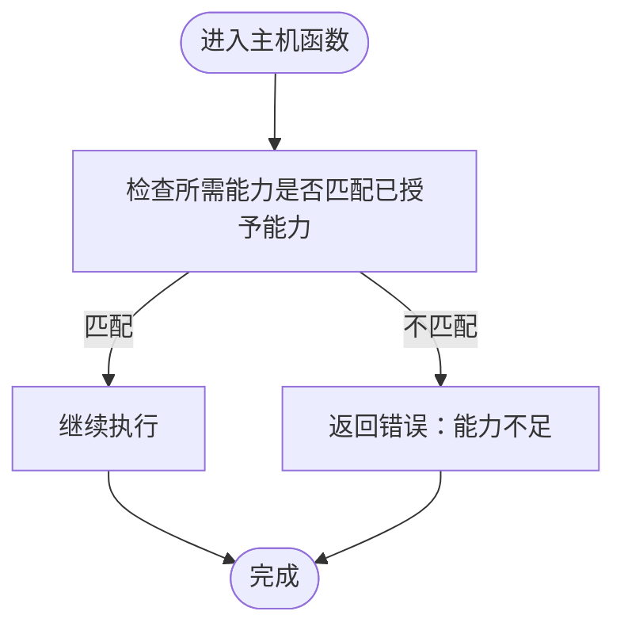

图示来源
- [主机函数（host_functions.rs）:55-67](file://crates/openfang-runtime/src/host_functions.rs#L55-L67)
- [能力类型（capability.rs）:100-166](file://crates/openfang-types/src/capability.rs#L100-L166)

章节来源
- [能力类型（capability.rs）:1-317](file://crates/openfang-types/src/capability.rs#L1-L317)
- [主机函数（host_functions.rs）:1-669](file://crates/openfang-runtime/src/host_functions.rs#L1-L669)

### WASM 双重计量沙箱
- 设计要点
  - 燃料计量：按指令数扣减，耗尽触发 OutOfFuel。
  - 时间计量：看门狗线程推进引擎 epoch，超时触发 Interrupt。
  - 同时启用两种计量，兼顾确定性与抗逃逸。
- 执行流程
  - 创建引擎与实例，设置燃料预算与 epoch 截止。
  - 在同步执行线程中调用 guest 的 execute，捕获陷阱并报告错误类型。

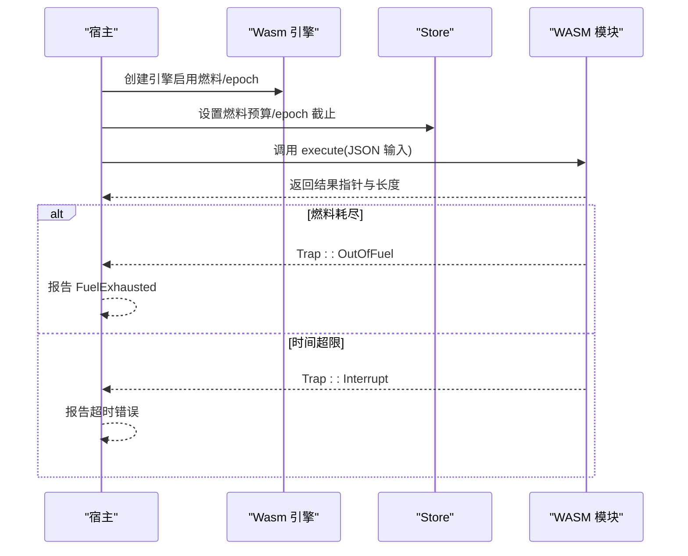

图示来源
- [WASM 沙箱（sandbox.rs）:102-275](file://crates/openfang-runtime/src/sandbox.rs#L102-L275)

章节来源
- [WASM 沙箱（sandbox.rs）:1-608](file://crates/openfang-runtime/src/sandbox.rs#L1-L608)

### Merkle 哈希链审计
- 设计要点
  - 审计动作涵盖工具调用、能力检查、Agent 生命周期、内存/文件/网络访问、Shell 执行、认证尝试、网络连接、配置变更等。
  - 每条目包含序列号、时间戳、Agent ID、动作类别、详情、结果、前一哈希与自身哈希。
  - 支持内存与数据库持久化，启动时加载并验证链路完整性。
- 核心方法
  - record：追加新条目，更新 tip。
  - verify_integrity：逐条重算哈希，检测篡改或链接断裂。
  - recent/tip_hash/len/is_empty：查询接口。

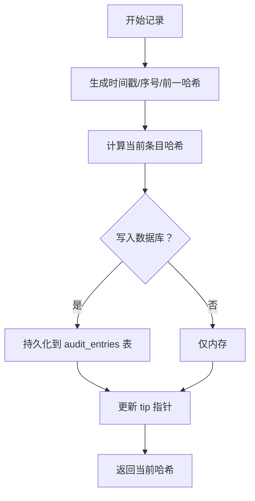

图示来源
- [审计日志（audit.rs）:175-301](file://crates/openfang-runtime/src/audit.rs#L175-L301)

章节来源
- [审计日志（audit.rs）:1-423](file://crates/openfang-runtime/src/audit.rs#L1-L423)

### 信息流污点跟踪
- 设计要点
  - 标签体系：外部网络、用户输入、PII、Secret、不受信 Agent。
  - 汇点模型：对 Shell 执行、网络抓取、Agent 消息等进行标签阻断。
  - 明确降级：仅在显式降级后允许流向受限汇点。
- 关键行为
  - 合并传播：两个值合并时，标签集合取并集。
  - 检查汇点：若存在阻断标签则报违反。
  - 降级处理：移除特定标签后允许流动。

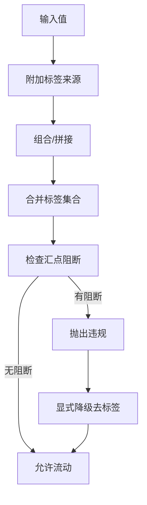

图示来源
- [污点跟踪（taint.rs）:73-112](file://crates/openfang-types/src/taint.rs#L73-L112)

章节来源
- [污点跟踪（taint.rs）:1-245](file://crates/openfang-types/src/taint.rs#L1-L245)

### Ed25519 清单签名
- 设计要点
  - 对原始清单内容计算 SHA-256，再以 Ed25519 对摘要签名。
  - 验证阶段重新计算摘要并与签名核验，任一不一致即失败。
- 应用场景
  - 代理清单加载前进行完整性与来源验证，防止供应链攻击。

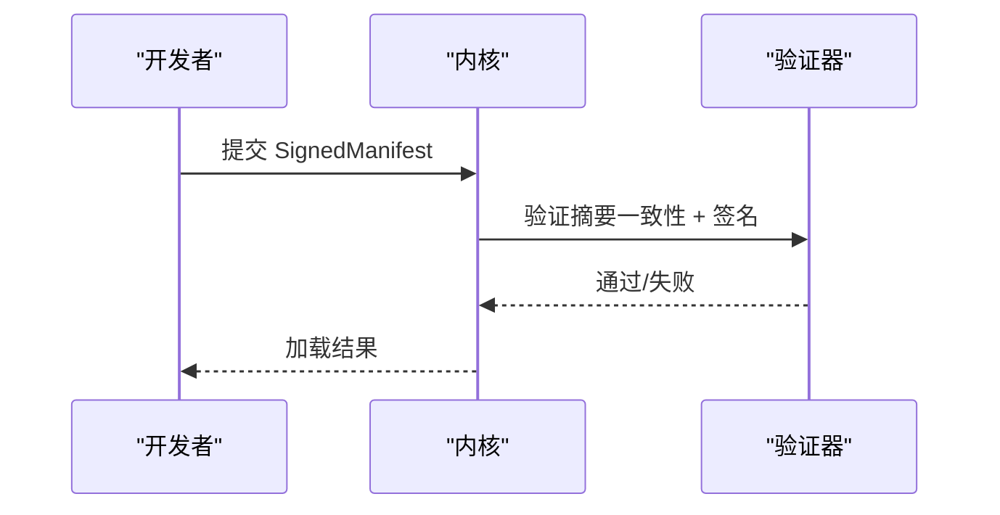

图示来源
- [清单签名（manifest_signing.rs）:69-108](file://crates/openfang-types/src/manifest_signing.rs#L69-L108)

章节来源
- [清单签名（manifest_signing.rs）:1-167](file://crates/openfang-types/src/manifest_signing.rs#L1-L167)

### SSRF 保护
- 设计要点
  - 仅允许 http/https 方案；阻断 file/gopher/ftp 等。
  - 主机黑名单：localhost、metadata.*、169.254.169.254 等。
  - DNS 解析后对每个 IP 地址进行私网范围检测。
  - URL 提取 host:port 用于能力匹配与访问控制。
- 执行位置
  - host_net_fetch 内部调用 is_ssrf_target 与 extract_host_from_url。

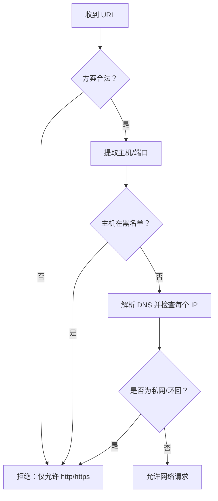

图示来源
- [主机函数（host_functions.rs）:123-160](file://crates/openfang-runtime/src/host_functions.rs#L123-L160)
- [主机函数（host_functions.rs）:314-328](file://crates/openfang-runtime/src/host_functions.rs#L314-L328)

章节来源
- [主机函数（host_functions.rs）:1-669](file://crates/openfang-runtime/src/host_functions.rs#L1-L669)

### 秘密零化
- 设计要点
  - 使用零化智能指针容器，在作用域结束时自动覆盖内存。
  - 全面覆盖 LLM 驱动、通道适配器、Web 搜索、嵌入客户端等模块中的密钥字段。
- 效果
  - 降低内存取证风险，避免凭据在进程生命周期结束后仍残留在内存中。

章节来源
- [安全架构（security.md）:647-713](file://docs/security.md#L647-L713)

### OFP 互认证
- 设计要点
  - 握手阶段使用 HMAC-SHA256，双方证明掌握预共享密钥。
  - 使用随机 UUID nonce，结合重放窗口与追踪器防止重放。
  - 协议版本不匹配直接拒绝，消息大小上限防止内存 DoS。
- 流程
  - 发起方生成 nonce，计算 auth_hmac，发送握手请求。
  - 接收方验证 HMAC 与 nonce，返回握手应答并派生会话密钥。
  - 后续消息采用会话密钥进行认证。

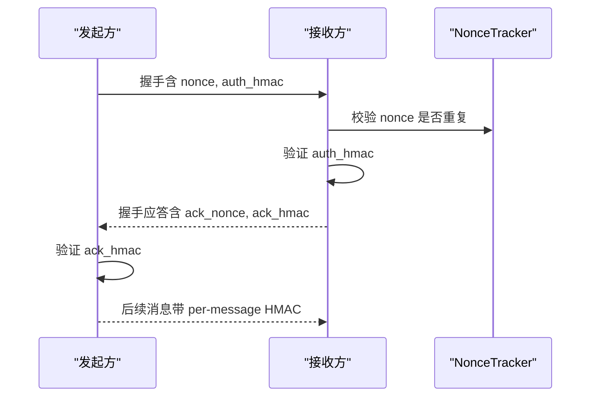

图示来源
- [OFP 对等节点（peer.rs）:230-458](file://crates/openfang-wire/src/peer.rs#L230-L458)
- [OFP 对等节点（peer.rs）:490-647](file://crates/openfang-wire/src/peer.rs#L490-L647)

章节来源
- [OFP 对等节点（peer.rs）:1-1285](file://crates/openfang-wire/src/peer.rs#L1-L1285)

### API 安全头与认证
- 设计要点
  - 统一注入安全响应头：X-Content-Type-Options、X-Frame-Options、X-XSS-Protection、CSP、Referrer-Policy、Cache-Control、HSTS。
  - 认证中间件支持 Bearer Token 与 X-API-Key，支持会话 Cookie 验证。
  - 公共端点限制为只读（GET），写操作（POST/PUT/DELETE）一律需要认证。
  - 本地回环关闭关机端点免认证。
- 实施位置
  - 安全头中间件应用于所有响应。
  - 认证中间件在路由层前置。

章节来源
- [API 中间件（middleware.rs）:232-259](file://crates/openfang-api/src/middleware.rs#L232-L259)
- [API 中间件（middleware.rs）:62-215](file://crates/openfang-api/src/middleware.rs#L62-L215)

### 子进程沙箱
- 设计要点
  - 清空子进程环境，仅重放平台安全变量与显式允许变量。
  - 可执行路径禁止包含 “..” 组件，防止目录遍历逃逸。
  - 允许列表模式下，先阻断所有 shell 元字符（命令替换、管道、重定向、逻辑与/或、后台运行、换行、空字节等），再进行基础命令白名单校验。
  - 进程树清理：优雅终止（SIGTERM/taskkill /T）→等待 → 强制终止（SIGKILL/taskkill /F）。
- 关键接口
  - sandbox_command、validate_executable_path、contains_shell_metacharacters、validate_command_allowlist、kill_process_tree、wait_or_kill_with_idle。

章节来源
- [子进程沙箱（subprocess_sandbox.rs）:1-906](file://crates/openfang-runtime/src/subprocess_sandbox.rs#L1-L906)

### 认证授权机制（RBAC）
- 设计要点
  - 用户角色层级：Viewer、User、Admin、Owner。
  - 动作与角色映射：不同操作需要最低角色阈值。
  - 用户识别：支持从渠道标识绑定到 OpenFang 用户 ID。
  - 权限检查：未知用户拒绝，角色不足拒绝。
- 实施位置
  - AuthManager 提供注册、识别、授权与统计。

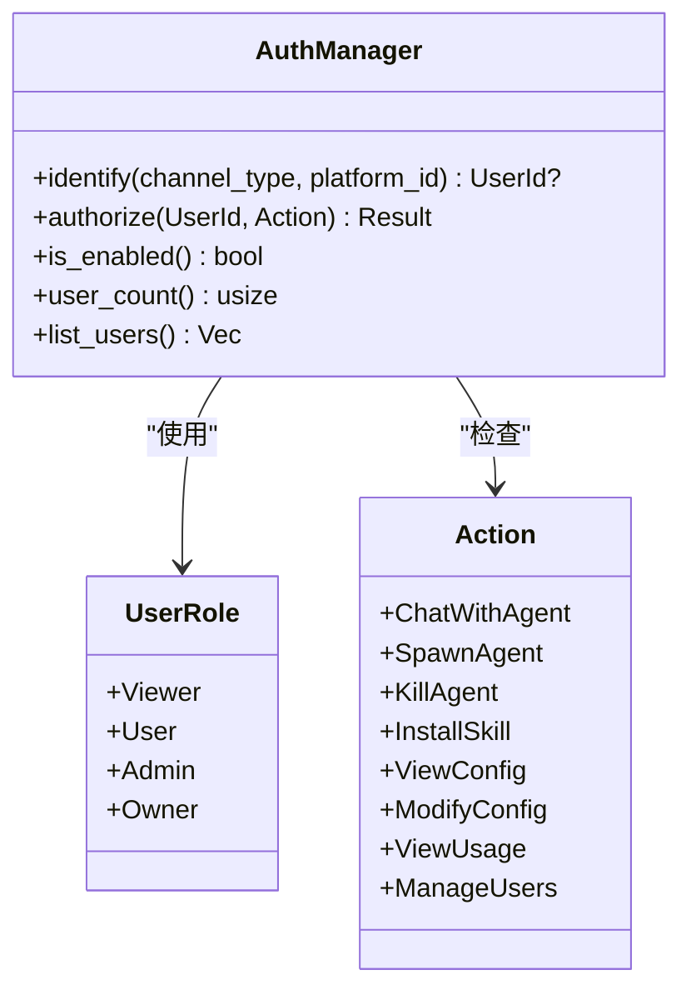

图示来源
- [认证与授权（auth.rs）:14-189](file://crates/openfang-kernel/src/auth.rs#L14-L189)

章节来源
- [认证与授权（auth.rs）:1-317](file://crates/openfang-kernel/src/auth.rs#L1-L317)

## 依赖关系分析
- 组件耦合
  - 能力门禁与主机函数强耦合：前者决定后者是否放行。
  - 污点模型与主机函数耦合：网络/Shell/消息等敏感操作前进行汇点检查。
  - 审计日志贯穿多组件：API、OFP、主机函数调用、子进程执行均产生审计事件。
  - OFP 与审计：网络互连与消息传递同样被记录。
- 外部依赖
  - 安全关键依赖（固定版本）：ed25519-dalek、sha2、hmac、subtle、zeroize、rand、governor 等。

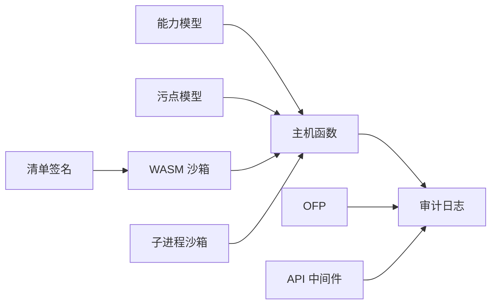

图示来源
- [能力类型（capability.rs）:1-317](file://crates/openfang-types/src/capability.rs#L1-L317)
- [主机函数（host_functions.rs）:1-669](file://crates/openfang-runtime/src/host_functions.rs#L1-L669)
- [污点跟踪（taint.rs）:1-245](file://crates/openfang-types/src/taint.rs#L1-L245)
- [审计日志（audit.rs）:1-423](file://crates/openfang-runtime/src/audit.rs#L1-L423)
- [OFP 对等节点（peer.rs）:1-1285](file://crates/openfang-wire/src/peer.rs#L1-L1285)
- [API 中间件（middleware.rs）:1-270](file://crates/openfang-api/src/middleware.rs#L1-L270)
- [WASM 沙箱（sandbox.rs）:1-608](file://crates/openfang-runtime/src/sandbox.rs#L1-L608)
- [子进程沙箱（subprocess_sandbox.rs）:1-906](file://crates/openfang-runtime/src/subprocess_sandbox.rs#L1-L906)
- [清单签名（manifest_signing.rs）:1-167](file://crates/openfang-types/src/manifest_signing.rs#L1-L167)

章节来源
- [安全政策（SECURITY.md）:82-95](file://SECURITY.md#L82-L95)

## 性能考量
- WASM 双重计量
  - 燃料与 epoch 双重陷阱，可能增加上下文切换成本；建议根据场景调整燃料预算与超时阈值。
- 审计日志
  - 数据库持久化会引入 I/O 开销；建议在高吞吐场景下评估批量写入与索引策略。
- 子进程沙箱
  - 环境变量清理与路径校验开销较小；元字符扫描与命令解析在 Allowlist 模式下较严格，建议合理配置 exec_policy。
- OFP 互认证
  - 握手与会话 HMAC 计算成本低；注意 nonce 追踪的内存占用与垃圾回收频率。

## 故障排查指南
- 能力不足
  - 症状：主机函数返回“能力不足”错误。
  - 排查：确认清单能力与实际调用是否匹配；检查通配符与数值边界。
- WASM 超时/燃料耗尽
  - 症状：执行超时或 OutOfFuel 错误。
  - 排查：提高燃料预算或延长超时；检查是否存在死循环或阻塞调用。
- SSRF 被拒
  - 症状：网络请求被拒绝。
  - 排查：确认 URL 方案、主机是否在黑名单、解析后是否为私网地址。
- 审计链不一致
  - 症状：verify_integrity 报错。
  - 排查：检查数据库完整性、是否被篡改或链接断裂。
- API 认证失败
  - 症状：401 未授权。
  - 排查：确认 Bearer/X-API-Key 或会话 Cookie；检查公共端点是否误用写操作。
- 子进程异常
  - 症状：命令被阻断或进程无法终止。
  - 排查：检查 exec_policy 模式与允许列表；确认元字符阻断规则；必要时增大超时与宽限期。

章节来源
- [主机函数（host_functions.rs）:1-669](file://crates/openfang-runtime/src/host_functions.rs#L1-L669)
- [WASM 沙箱（sandbox.rs）:1-608](file://crates/openfang-runtime/src/sandbox.rs#L1-L608)
- [审计日志（audit.rs）:1-423](file://crates/openfang-runtime/src/audit.rs#L1-L423)
- [API 中间件（middleware.rs）:1-270](file://crates/openfang-api/src/middleware.rs#L1-L270)
- [子进程沙箱（subprocess_sandbox.rs）:1-906](file://crates/openfang-runtime/src/subprocess_sandbox.rs#L1-L906)

## 结论
OpenFang 通过“能力门禁 + WASM 双重计量 + 污点跟踪 + Merkle 审计 + SSRF/子进程/秘密零化 + OFP 互认证 + API 安全头”的 16 层防御体系，构建了从接入、执行、通信到审计的全链路安全。该设计强调最小权限、确定性隔离、可验证性与可观测性，既满足生产可用性，又具备供应链与供应链攻击的抵御能力。

## 附录
- 威胁模型与缓解
  - 典型攻击向量：远程代码执行、权限提升、SSRF、凭据泄露、注入、重放、拒绝服务、供应链攻击。
  - 缓解措施：能力门禁、WASM 双重计量、污点汇点、Merkle 审计、SSRF/子进程/秘密零化、OFP 互认证、API 安全头。
- 安全配置指南
  - 设置预共享密钥（OFP）、启用非空 API Key、配置 exec_policy、限制能力清单、开启审计持久化。
- 合规性要求
  - 供应链完整性（Ed25519 清单签名）、数据最小化（污点模型）、不可否认（Merkle 审计）、访问控制（RBAC）。
- 安全事件响应
  - 快速定位审计链、冻结受影响节点、验证链完整性、回滚/修复、复盘与加固。
- 渗透测试最佳实践
  - 从 API 与 OFP 入手，验证认证绕过与未授权操作；利用污点模型测试注入与泄露；验证 SSRF 与子进程逃逸；评估审计完整性与持久化。

章节来源
- [安全架构（security.md）:1-800](file://docs/security.md#L1-L800)
- [安全政策（SECURITY.md）:1-95](file://SECURITY.md#L1-L95)