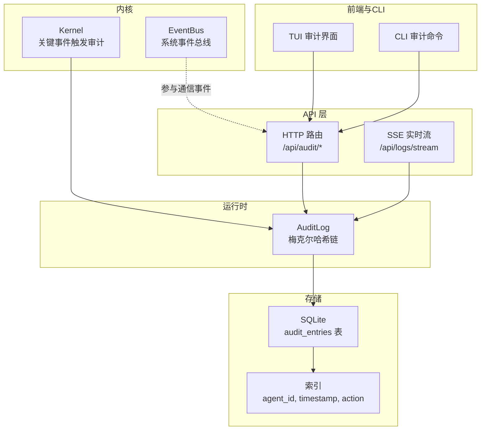
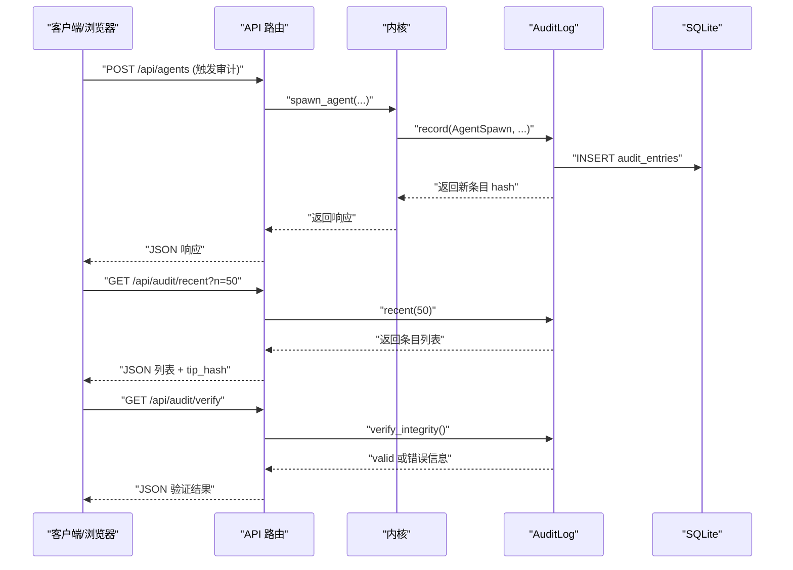
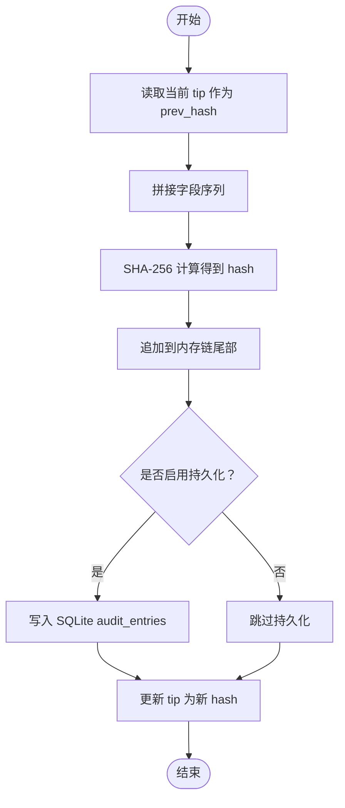
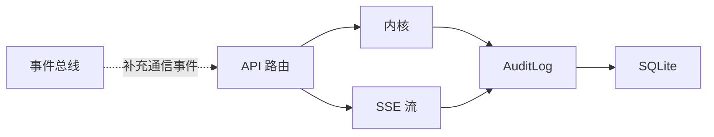

# 审计追踪系统

<cite>
**本文档引用的文件**
- [audit.rs](file://crates/openfang-runtime/src/audit.rs)
- [routes.rs](file://crates/openfang-api/src/routes.rs)
- [kernel.rs](file://crates/openfang-kernel/src/kernel.rs)
- [event_bus.rs](file://crates/openfang-kernel/src/event_bus.rs)
- [migration.rs](file://crates/openfang-memory/src/migration.rs)
- [audit.rs](file://crates/openfang-cli/src/tui/screens/audit.rs)
- [main.rs](file://crates/openfang-cli/src/main.rs)
</cite>

## 目录
1. [简介](#简介)
2. [项目结构](#项目结构)
3. [核心组件](#核心组件)
4. [架构概览](#架构概览)
5. [详细组件分析](#详细组件分析)
6. [依赖关系分析](#依赖关系分析)
7. [性能考量](#性能考量)
8. [故障排查指南](#故障排查指南)
9. [结论](#结论)
10. [附录](#附录)

## 简介
本文件为 OpenFang 审计追踪系统的技术文档，聚焦于基于梅克尔哈希链的不可篡改审计日志设计与实现。系统通过在关键运行时事件中记录审计条目，形成一条以 SHA-256 哈希串联的链式结构，确保任何对历史数据的篡改都能被即时发现。本文将详细阐述：
- 梅克尔哈希链的设计原理与实现细节
- 审计条目结构与哈希计算算法
- 审计动作类型的记录规则
- 完整性验证、链路断裂检测与哈希不匹配处理
- 审计日志 API 使用示例、性能考虑与线程安全机制
- 审计系统与事件总线的集成关系

## 项目结构
审计追踪系统主要分布在以下模块：
- 运行时审计日志：负责生成、存储、校验审计条目
- API 层：提供审计查询、完整性验证与实时流式推送接口
- 内核：在关键生命周期与操作事件中触发审计记录
- 事件总线：提供系统级事件广播与历史回放能力
- 内存与迁移：持久化审计表结构与索引
- CLI 与 TUI：提供审计日志查看、过滤与链路验证功能

图表来源
- [audit.rs:81-90](file://crates/openfang-runtime/src/audit.rs#L81-L90)
- [routes.rs:4874-4908](file://crates/openfang-api/src/routes.rs#L4874-L4908)
- [routes.rs:4939-5034](file://crates/openfang-api/src/routes.rs#L4939-L5034)
- [kernel.rs:1400-1406](file://crates/openfang-kernel/src/kernel.rs#L1400-L1406)
- [migration.rs:306-329](file://crates/openfang-memory/src/migration.rs#L306-L329)
- [audit.rs:1-350](file://crates/openfang-cli/src/tui/screens/audit.rs#L1-L350)
- [main.rs:5779-5831](file://crates/openfang-cli/src/main.rs#L5779-L5831)

章节来源
- [audit.rs:1-10](file://crates/openfang-runtime/src/audit.rs#L1-L10)
- [routes.rs:4870-4937](file://crates/openfang-api/src/routes.rs#L4870-L4937)
- [kernel.rs:1390-1620](file://crates/openfang-kernel/src/kernel.rs#L1390-L1620)
- [event_bus.rs:1-150](file://crates/openfang-kernel/src/event_bus.rs#L1-L150)
- [migration.rs:306-329](file://crates/openfang-memory/src/migration.rs#L306-L329)
- [audit.rs:1-350](file://crates/openfang-cli/src/tui/screens/audit.rs#L1-L350)
- [main.rs:5779-5831](file://crates/openfang-cli/src/main.rs#L5779-L5831)

## 核心组件
- 梅克尔哈希链审计日志（AuditLog）
  - 线程安全：内部使用互斥锁保护状态
  - 可选持久化：支持通过 SQLite 存储 audit_entries 表
  - 核心方法：record、verify_integrity、recent、tip_hash、len
- 审计条目（AuditEntry）
  - 字段：seq、timestamp、agent_id、action、detail、outcome、prev_hash、hash
- 审计动作类型（AuditAction）
  - 包含工具调用、能力检查、代理创建/销毁、消息传递、内存/文件/网络/Shell 访问、认证尝试、网络连接、配置变更等

章节来源
- [audit.rs:16-37](file://crates/openfang-runtime/src/audit.rs#L16-L37)
- [audit.rs:39-58](file://crates/openfang-runtime/src/audit.rs#L39-L58)
- [audit.rs:81-90](file://crates/openfang-runtime/src/audit.rs#L81-L90)
- [audit.rs:175-235](file://crates/openfang-runtime/src/audit.rs#L175-L235)

## 架构概览
审计系统围绕“内核事件触发审计记录 → 运行时日志追加并可选持久化 → API 提供查询与验证 → SSE 实时推送”的主路径构建，并与事件总线协同提供通信事件的补充视图。

图表来源
- [routes.rs:110-168](file://crates/openfang-api/src/routes.rs#L110-L168)
- [routes.rs:4874-4908](file://crates/openfang-api/src/routes.rs#L4874-L4908)
- [routes.rs:4910-4936](file://crates/openfang-api/src/routes.rs#L4910-L4936)
- [kernel.rs:1400-1406](file://crates/openfang-kernel/src/kernel.rs#L1400-L1406)
- [audit.rs:175-235](file://crates/openfang-runtime/src/audit.rs#L175-L235)

## 详细组件分析

### 梅克尔哈希链设计与实现
- 设计要点
  - 每个条目的 prev_hash 指向前一节点的 hash；首个条目 prev_hash 为全零哨兵值
  - 每个条目的 hash 由自身字段拼接后经 SHA-256 计算得出
  - tip 指向当前链末端的 hash，用于快速获取最新链状态
- 关键算法
  - 条目哈希计算：将 seq、timestamp、agent_id、action、detail、outcome、prev_hash 的字节序列拼接后进行 SHA-256 哈希
  - 链完整性验证：顺序遍历条目，逐一比对 prev_hash 与期望值，再重新计算当前条目哈希并与存储值比对
- 线程安全
  - 所有公共方法通过内部互斥锁串行化访问，保证并发安全

图表来源
- [audit.rs:60-79](file://crates/openfang-runtime/src/audit.rs#L60-L79)
- [audit.rs:175-235](file://crates/openfang-runtime/src/audit.rs#L175-L235)
- [audit.rs:237-274](file://crates/openfang-runtime/src/audit.rs#L237-L274)

章节来源
- [audit.rs:60-79](file://crates/openfang-runtime/src/audit.rs#L60-L79)
- [audit.rs:237-274](file://crates/openfang-runtime/src/audit.rs#L237-L274)
- [audit.rs:81-90](file://crates/openfang-runtime/src/audit.rs#L81-L90)

### 审计条目结构与哈希计算
- 结构字段
  - seq：自增序号（从 0 开始）
  - timestamp：ISO-8601 时间戳
  - agent_id：触发或涉及的代理标识
  - action：审计动作类型（枚举）
  - detail：动作详情（如工具名、文件路径等）
  - outcome：结果描述（如 ok、denied、错误信息）
  - prev_hash：前一节点哈希（首节点为全零哨兵）
  - hash：当前节点内容与 prev_hash 的 SHA-256 哈希
- 哈希计算流程
  - 将各字段转换为字节序列并按固定顺序拼接
  - 对拼接后的字节流进行 SHA-256 哈希，输出十六进制字符串

章节来源
- [audit.rs:39-58](file://crates/openfang-runtime/src/audit.rs#L39-L58)
- [audit.rs:60-79](file://crates/openfang-runtime/src/audit.rs#L60-L79)

### 审计动作类型与记录规则
- 动作类型（AuditAction）
  - 工具调用：ToolInvoke
  - 能力检查：CapabilityCheck
  - 代理创建：AgentSpawn
  - 代理销毁：AgentKill
  - 代理消息：AgentMessage
  - 内存访问：MemoryAccess
  - 文件访问：FileAccess
  - 网络访问：NetworkAccess
  - Shell 执行：ShellExec
  - 认证尝试：AuthAttempt
  - 网络连接：WireConnect
  - 配置变更：ConfigChange
- 记录规则（示例）
  - 代理创建：内核在成功创建代理后记录 AgentSpawn
  - 代理销毁：内核在删除代理后记录 AgentKill
  - 代理消息：内核在消息发送成功/失败后分别记录 AgentMessage
  - 配置变更：API 在配置重载/设置时记录 ConfigChange
  - 认证尝试：API 在签名验证失败时记录 AuthAttempt

章节来源
- [audit.rs:16-37](file://crates/openfang-runtime/src/audit.rs#L16-L37)
- [kernel.rs:1400-1406](file://crates/openfang-kernel/src/kernel.rs#L1400-L1406)
- [kernel.rs:1587-1607](file://crates/openfang-kernel/src/kernel.rs#L1587-L1607)
- [kernel.rs:3222-3228](file://crates/openfang-kernel/src/kernel.rs#L3222-L3228)
- [routes.rs:110-131](file://crates/openfang-api/src/routes.rs#L110-L131)
- [routes.rs:9603-9609](file://crates/openfang-api/src/routes.rs#L9603-L9609)
- [routes.rs:9859-9864](file://crates/openfang-api/src/routes.rs#L9859-L9864)

### 完整性验证、链路断裂检测与哈希不匹配处理
- 验证流程
  - 初始化期望 prev_hash 为全零哨兵
  - 逐条比对 prev_hash 与期望值，若不一致则报告链路断裂
  - 重新计算当前条目哈希并与存储值比对，若不一致则报告哈希不匹配
- 处理策略
  - 返回包含具体失败位置与期望/实际值的错误信息
  - API 层将验证结果以 JSON 形式返回给调用方
- 启动时加载验证
  - 从数据库加载已有条目后自动执行完整性检查，记录错误或确认链路有效

章节来源
- [audit.rs:237-274](file://crates/openfang-runtime/src/audit.rs#L237-L274)
- [audit.rs:104-173](file://crates/openfang-runtime/src/audit.rs#L104-L173)
- [routes.rs:4910-4936](file://crates/openfang-api/src/routes.rs#L4910-L4936)

### 审计日志 API 使用示例
- 获取最近条目
  - 方法：GET /api/audit/recent?n=50
  - 返回：条目数组、总数、tip_hash
- 验证链完整性
  - 方法：GET /api/audit/verify
  - 返回：valid、entries 数量、tip_hash（或 error 与警告）
- 实时审计流
  - 方法：GET /api/logs/stream
  - 特性：SSE 推送，支持按级别与文本过滤，首次连接回放历史
- CLI 使用
  - 查看审计：openfang security audit --limit 50 [--json]
  - 验证链：openfang security verify

章节来源
- [routes.rs:4874-4908](file://crates/openfang-api/src/routes.rs#L4874-L4908)
- [routes.rs:4910-4936](file://crates/openfang-api/src/routes.rs#L4910-L4936)
- [routes.rs:4939-5034](file://crates/openfang-api/src/routes.rs#L4939-L5034)
- [main.rs:5779-5831](file://crates/openfang-cli/src/main.rs#L5779-L5831)

### 线程安全机制
- 运行时日志
  - 使用互斥锁保护 entries 与 tip，所有公共方法均串行化访问
- 数据库访问
  - 通过 Arc<Mutex<Connection>> 包装连接，避免并发写入冲突
- SSE 流
  - 使用异步通道与心跳保持连接，避免阻塞主线程

章节来源
- [audit.rs:81-90](file://crates/openfang-runtime/src/audit.rs#L81-L90)
- [audit.rs:104-173](file://crates/openfang-runtime/src/audit.rs#L104-L173)
- [routes.rs:4939-5034](file://crates/openfang-api/src/routes.rs#L4939-L5034)

### 与事件总线的集成关系
- 事件总线提供系统级事件的历史回放与订阅能力
- 审计日志作为补充数据源，与事件总线共同构成通信事件的完整视图
- API 提供的通信事件接口会优先从事件总线获取更丰富的上下文，同时回退到审计日志以确保覆盖面

章节来源
- [event_bus.rs:1-150](file://crates/openfang-kernel/src/event_bus.rs#L1-L150)
- [routes.rs:10855-10896](file://crates/openfang-api/src/routes.rs#L10855-L10896)

## 依赖关系分析
- 组件耦合
  - API 层依赖内核提供的审计日志实例
  - 内核在关键事件中直接调用审计日志记录
  - 审计日志可选依赖 SQLite 进行持久化
- 外部依赖
  - SHA-256 哈希算法
  - SQLite（rusqlite）用于持久化
  - Tokio 异步运行时与广播通道用于 SSE

图表来源
- [routes.rs:4874-4908](file://crates/openfang-api/src/routes.rs#L4874-L4908)
- [kernel.rs:1400-1406](file://crates/openfang-kernel/src/kernel.rs#L1400-L1406)
- [audit.rs:81-90](file://crates/openfang-runtime/src/audit.rs#L81-L90)
- [event_bus.rs:1-150](file://crates/openfang-kernel/src/event_bus.rs#L1-L150)

章节来源
- [routes.rs:4874-4908](file://crates/openfang-api/src/routes.rs#L4874-L4908)
- [kernel.rs:1400-1406](file://crates/openfang-kernel/src/kernel.rs#L1400-L1406)
- [audit.rs:81-90](file://crates/openfang-runtime/src/audit.rs#L81-L90)
- [event_bus.rs:1-150](file://crates/openfang-kernel/src/event_bus.rs#L1-L150)

## 性能考量
- 哈希计算
  - 单条记录仅涉及少量字符串拼接与一次 SHA-256 哈希，开销极低
- 内存占用
  - 审计条目以 Vec 存储，建议限制查询窗口（如 recent(200)）以控制内存
- 数据库写入
  - 插入操作为单行写入，索引已覆盖常用查询维度
- 并发模型
  - 互斥锁串行化访问，避免锁竞争；SSE 使用异步通道避免阻塞
- 索引优化
  - audit_entries 表已建立 agent_id、timestamp、action 索引，提升查询效率

章节来源
- [audit.rs:295-300](file://crates/openfang-runtime/src/audit.rs#L295-L300)
- [migration.rs:306-329](file://crates/openfang-memory/src/migration.rs#L306-L329)
- [routes.rs:4939-5034](file://crates/openfang-api/src/routes.rs#L4939-L5034)

## 故障排查指南
- 链完整性验证失败
  - 现象：verify 返回 valid=false，并包含错误信息
  - 排查：检查 prev_hash 是否与期望值一致；重新计算哈希并与存储值对比
- 空审计日志
  - 现象：verify 返回 valid=true 但 entries=0
  - 说明：系统尚未记录任何审计事件，属于正常状态
- SSE 连接断开
  - 现象：客户端无法接收新事件
  - 排查：检查服务端日志与心跳设置；确认客户端具备正确鉴权方式
- CLI 验证失败
  - 现象：security verify 输出失败提示
  - 排查：使用 security audit --json 查看条目详情，定位异常条目

章节来源
- [routes.rs:4910-4936](file://crates/openfang-api/src/routes.rs#L4910-L4936)
- [main.rs:5818-5831](file://crates/openfang-cli/src/main.rs#L5818-L5831)

## 结论
OpenFang 的审计追踪系统通过梅克尔哈希链实现了对关键运行时事件的不可篡改记录。系统在内核层触发审计，在运行时日志中追加并可选持久化，通过 API 提供查询、验证与实时流式推送能力，并与事件总线协同完善通信事件视图。其设计兼顾了安全性、可追溯性与可运维性，适合在生产环境中提供强大的审计保障。

## 附录
- 数据库模式（V8）
  - 表：audit_entries
  - 字段：seq、timestamp、agent_id、action、detail、outcome、prev_hash、hash
  - 索引：agent_id、timestamp、action
- CLI 常用命令
  - openfang security audit --limit N [--json]
  - openfang security verify

章节来源
- [migration.rs:306-329](file://crates/openfang-memory/src/migration.rs#L306-L329)
- [main.rs:5779-5831](file://crates/openfang-cli/src/main.rs#L5779-L5831)