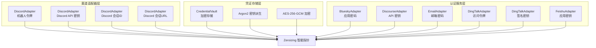
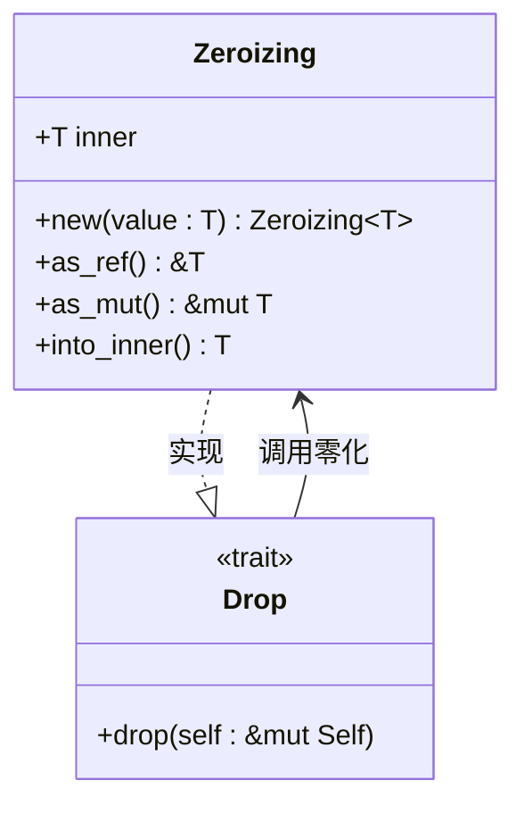
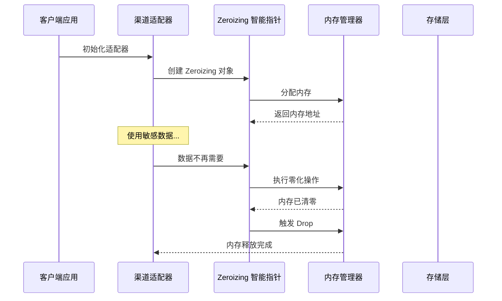
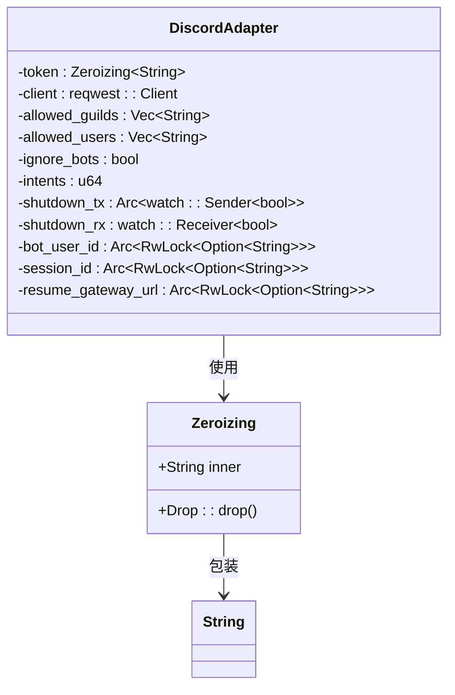
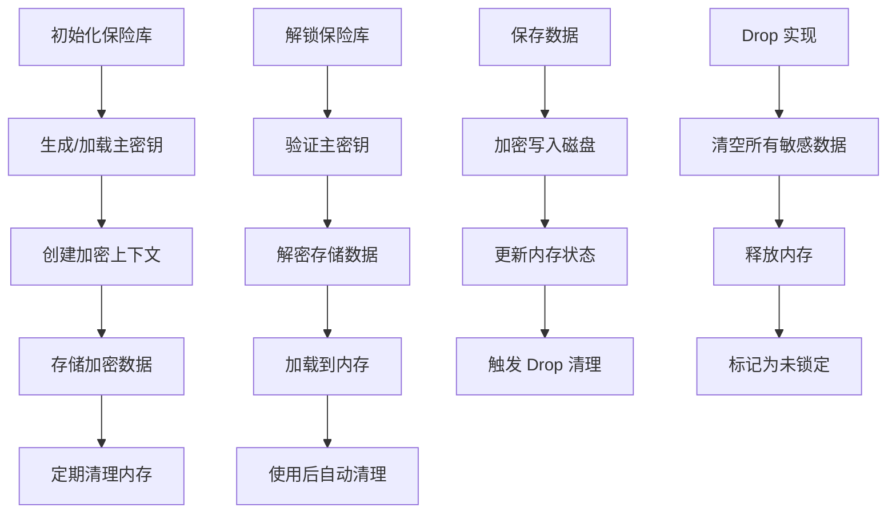
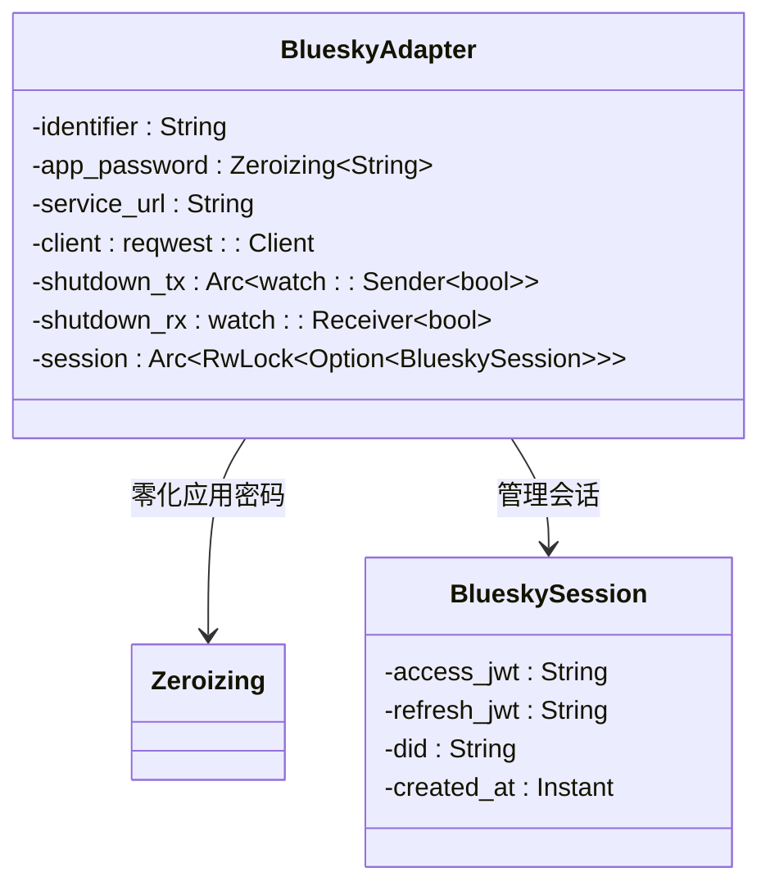
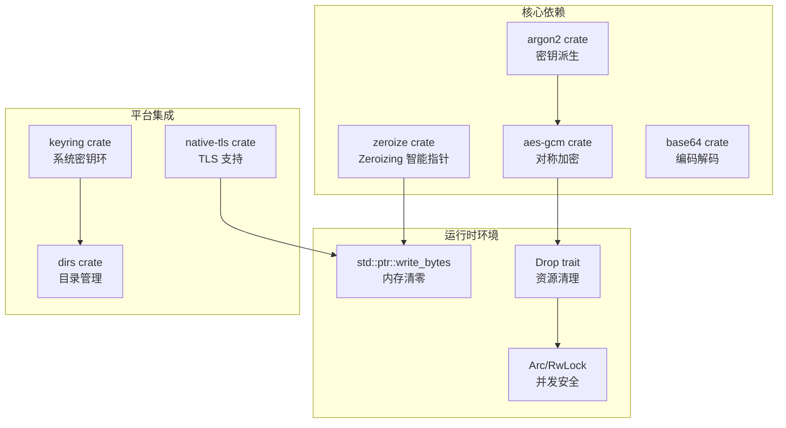

# 密钥零化机制

<cite>
**本文档引用的文件**
- [bluesky.rs](file://crates/openfang-channels/src/bluesky.rs)
- [discord.rs](file://crates/openfang-channels/src/discord.rs)
- [dingtalk.rs](file://crates/openfang-channels/src/dingtalk.rs)
- [discourse.rs](file://crates/openfang-channels/src/discourse.rs)
- [email.rs](file://crates/openfang-channels/src/email.rs)
- [feishu.rs](file://crates/openfang-channels/src/feishu.rs)
- [vault.rs](file://crates/openfang-extensions/src/vault.rs)
- [security.rs](file://crates/openfang-cli/src/tui/screens/security.rs)
- [routes.rs](file://crates/openfang-api/src/routes.rs)
</cite>

## 目录
1. [简介](#简介)
2. [项目结构](#项目结构)
3. [核心组件](#核心组件)
4. [架构概览](#架构概览)
5. [详细组件分析](#详细组件分析)
6. [依赖关系分析](#依赖关系分析)
7. [性能考量](#性能考量)
8. [故障排除指南](#故障排除指南)
9. [结论](#结论)

## 简介

OpenFang 项目实现了全面的密钥零化机制，通过 `zeroize` crate 提供的 `Zeroizing` 智能指针确保敏感数据在内存中的安全处理。该机制在多个关键组件中得到应用，包括：

- **渠道适配器**：Discord 机器人令牌、Discourse API 密钥、邮箱密码、钉钉机器人访问令牌等
- **认证服务**：Bluesky 应用密码、飞书/企业微信应用密钥
- **凭证存储**：加密凭证保险库，支持 AES-256-GCM 加密和 Argon2 密钥派生

零化机制的核心目标是防止敏感信息在内存中残留，降低内存取证攻击的风险，确保 API 密钥、令牌等敏感数据在不再需要时能够被彻底清除。

## 项目结构

OpenFang 的密钥零化机制分布在以下主要模块中：

**图表来源**
- [discord.rs:37-53](file://crates/openfang-channels/src/discord.rs#L37-L53)
- [vault.rs:56-65](file://crates/openfang-extensions/src/vault.rs#L56-L65)
- [bluesky.rs:40-54](file://crates/openfang-channels/src/bluesky.rs#L40-L54)

**章节来源**
- [discord.rs:37-53](file://crates/openfang-channels/src/discord.rs#L37-L53)
- [vault.rs:56-65](file://crates/openfang-extensions/src/vault.rs#L56-L65)
- [bluesky.rs:40-54](file://crates/openfang-channels/src/bluesky.rs#L40-L54)

## 核心组件

### Zeroizing 智能指针

`Zeroizing` 是 `zeroize` crate 提供的智能指针类型，它实现了 `Drop` trait，在对象被销毁时自动将内存清零：

**图表来源**
- [vault.rs:56-65](file://crates/openfang-extensions/src/vault.rs#L56-L65)
- [discord.rs:37-53](file://crates/openfang-channels/src/discord.rs#L37-L53)

### 渠道适配器中的零化应用

每个渠道适配器都使用 `Zeroizing` 包装敏感数据：

| 组件 | 敏感数据类型 | 零化位置 |
|------|-------------|----------|
| DiscordAdapter | 机器人令牌 | token 字段 |
| DiscordAdapter | API 密钥 | 会话相关字段 |
| DiscordAdapter | 会话ID | session_id 字段 |
| DiscordAdapter | 会话URL | resume_gateway_url 字段 |
| BlueskyAdapter | 应用密码 | app_password 字段 |
| DiscourseAdapter | API 密钥 | api_key 字段 |
| EmailAdapter | 邮箱密码 | password 字段 |
| DingTalkAdapter | 访问令牌 | access_token 字段 |
| DingTalkAdapter | 签名密钥 | secret 字段 |
| FeishuAdapter | 应用密钥 | app_secret 字段 |

**章节来源**
- [discord.rs:37-53](file://crates/openfang-channels/src/discord.rs#L37-L53)
- [bluesky.rs:40-54](file://crates/openfang-channels/src/bluesky.rs#L40-L54)
- [discourse.rs:28-44](file://crates/openfang-channels/src/discourse.rs#L28-L44)
- [email.rs:46-70](file://crates/openfang-channels/src/email.rs#L46-L70)
- [dingtalk.rs:28-40](file://crates/openfang-channels/src/dingtalk.rs#L28-L40)
- [feishu.rs:123-151](file://crates/openfang-channels/src/feishu.rs#L123-L151)

## 架构概览

OpenFang 的密钥零化架构采用分层设计，确保敏感数据在整个生命周期中得到保护：

**图表来源**
- [vault.rs:390-397](file://crates/openfang-extensions/src/vault.rs#L390-L397)
- [discord.rs:37-53](file://crates/openfang-channels/src/discord.rs#L37-L53)

## 详细组件分析

### Discord 渠道适配器

Discord 适配器实现了全面的零化保护：

**图表来源**
- [discord.rs:37-53](file://crates/openfang-channels/src/discord.rs#L37-L53)

#### 关键零化点

1. **机器人令牌零化**：在 `Drop` 实现中自动清零
2. **会话数据零化**：会话ID和恢复URL在适配器销毁时清零
3. **配置数据零化**：允许的服务器列表和用户列表在内存中安全存储

**章节来源**
- [discord.rs:37-53](file://crates/openfang-channels/src/discord.rs#L37-L53)
- [discord.rs:390-436](file://crates/openfang-channels/src/discord.rs#L390-L436)

### 凭证保险库系统

凭证保险库提供了持久化的安全存储解决方案：

**图表来源**
- [vault.rs:67-76](file://crates/openfang-extensions/src/vault.rs#L67-L76)
- [vault.rs:132-149](file://crates/openfang-extensions/src/vault.rs#L132-L149)

#### 安全特性

1. **AES-256-GCM 加密**：使用硬件加速的对称加密算法
2. **Argon2 密钥派生**：抗暴力破解的密钥派生函数
3. **内存自动清理**：实现 `Drop` trait 自动清零敏感数据
4. **文件格式版本控制**：支持向后兼容的加密格式

**章节来源**
- [vault.rs:67-76](file://crates/openfang-extensions/src/vault.rs#L67-L76)
- [vault.rs:132-149](file://crates/openfang-extensions/src/vault.rs#L132-L149)
- [vault.rs:390-397](file://crates/openfang-extensions/src/vault.rs#L390-L397)

### 其他渠道适配器

#### Bluesky 适配器

Bluesky 适配器专注于应用密码的安全处理：

**图表来源**
- [bluesky.rs:40-66](file://crates/openfang-channels/src/bluesky.rs#L40-L66)

#### Discourse 适配器

Discourse 适配器提供 API 密钥的安全管理：

**章节来源**
- [discourse.rs:28-44](file://crates/openfang-channels/src/discourse.rs#L28-L44)

#### 钉钉适配器

钉钉适配器实现双重零化保护：

**章节来源**
- [dingtalk.rs:28-40](file://crates/openfang-channels/src/dingtalk.rs#L28-L40)

#### 邮件适配器

邮件适配器处理复杂的认证场景：

**章节来源**
- [email.rs:46-70](file://crates/openfang-channels/src/email.rs#L46-L70)

#### 飞书适配器

飞书适配器支持多区域部署的安全令牌管理：

**章节来源**
- [feishu.rs:123-151](file://crates/openfang-channels/src/feishu.rs#L123-L151)

## 依赖关系分析

OpenFang 的密钥零化机制依赖于以下关键组件：

**图表来源**
- [vault.rs:8-19](file://crates/openfang-extensions/src/vault.rs#L8-L19)
- [discord.rs:17-17](file://crates/openfang-channels/src/discord.rs#L17-L17)

### 外部依赖

1. **zeroize**：提供 `Zeroizing` 智能指针和内存清零功能
2. **argon2**：实现安全的密钥派生函数
3. **aes-gcm**：提供硬件加速的对称加密
4. **keyring**：访问操作系统密钥环服务
5. **native-tls**：处理 TLS 连接的加密通信

**章节来源**
- [vault.rs:8-19](file://crates/openfang-extensions/src/vault.rs#L8-L19)
- [discord.rs:17-17](file://crates/openfang-channels/src/discord.rs#L17-L17)

## 性能考量

### 内存开销

- **Zeroizing 包装**：额外的内存开销约为 8-16 字节（取决于数据类型）
- **Drop 实现**：每次销毁时执行内存清零操作，CPU 开销极小
- **并发安全**：使用 `Arc` 和 `RwLock` 增加少量内存开销

### 性能影响

1. **初始化阶段**：零化包装的创建几乎无性能影响
2. **运行时阶段**：零化操作仅在对象销毁时发生
3. **内存管理**：零化机制不会显著影响垃圾回收性能

### 优化建议

1. **批量处理**：对于大量敏感数据，考虑使用批量零化
2. **延迟初始化**：只在真正需要时创建敏感数据对象
3. **内存池**：对于高频创建的对象，考虑使用内存池减少分配开销

## 故障排除指南

### 常见问题

#### 零化不生效

**症状**：敏感数据仍然存在于内存中

**排查步骤**：
1. 确认使用了 `Zeroizing` 包装敏感数据
2. 检查对象是否正确实现了 `Drop` trait
3. 验证内存清理是否在适当的生命周期结束时发生

#### 内存泄漏

**症状**：敏感数据在进程退出后仍然存在

**解决方案**：
1. 确保所有敏感数据都在作用域结束时被销毁
2. 检查循环引用是否阻止了 `Drop` 的执行
3. 使用工具如 Valgrind 或 AddressSanitizer 进行检测

#### 性能问题

**症状**：应用程序响应变慢

**诊断方法**：
1. 监控内存使用情况
2. 检查零化操作的频率
3. 分析垃圾回收行为

### 调试技巧

1. **使用调试器**：检查内存中的实际值
2. **日志记录**：添加零化事件的日志
3. **单元测试**：编写测试验证零化行为

**章节来源**
- [vault.rs:390-397](file://crates/openfang-extensions/src/vault.rs#L390-L397)
- [discord.rs:390-436](file://crates/openfang-channels/src/discord.rs#L390-L436)

## 结论

OpenFang 的密钥零化机制通过 `Zeroizing` 智能指针提供了全面的内存安全保护。该机制在多个层面得到应用，从单个适配器到整个凭证存储系统，确保敏感数据在整个生命周期中都得到妥善处理。

### 主要优势

1. **自动化**：零化过程完全自动化，无需手动干预
2. **完整性**：确保敏感数据在所有情况下都被正确清理
3. **可维护性**：统一的零化模式简化了代码维护
4. **安全性**：有效防止内存取证攻击和敏感数据泄露

### 最佳实践

1. **始终使用 Zeroizing**：对所有敏感数据使用智能指针包装
2. **及时清理**：在不需要敏感数据时立即释放内存
3. **定期审计**：定期检查代码中敏感数据的处理方式
4. **监控告警**：建立监控机制检测异常的内存使用模式

通过实施这些措施，OpenFang 能够为用户提供高度安全的密钥管理和存储解决方案，有效防止 API 密钥泄露和内存取证攻击。