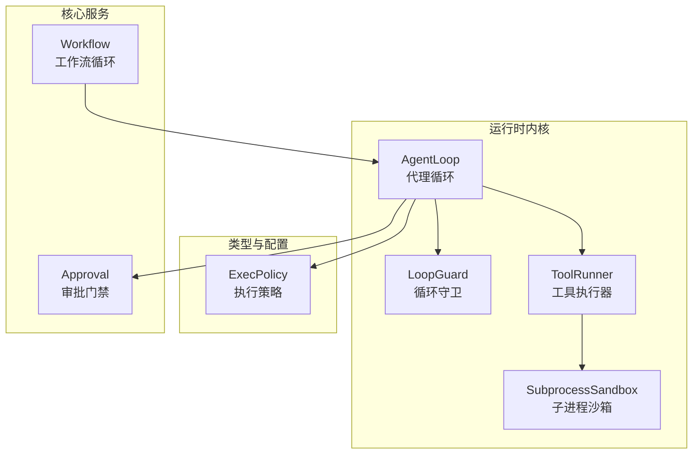
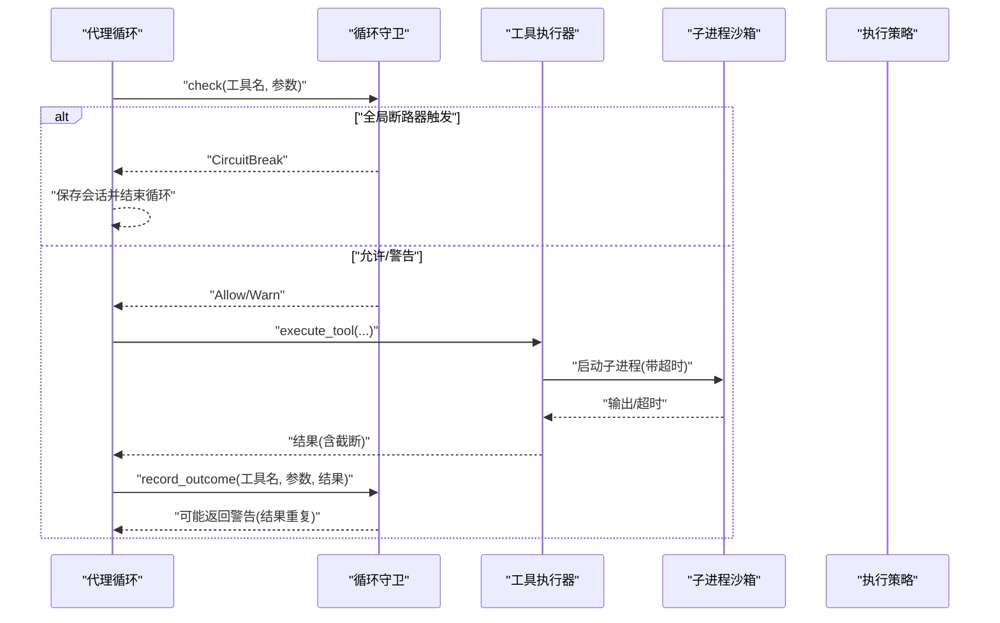
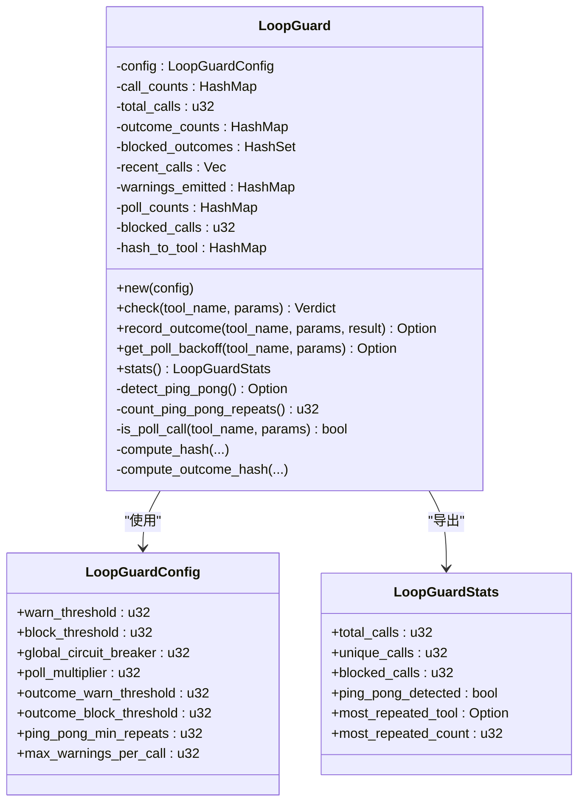
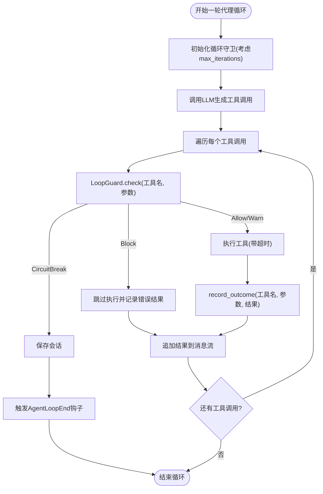
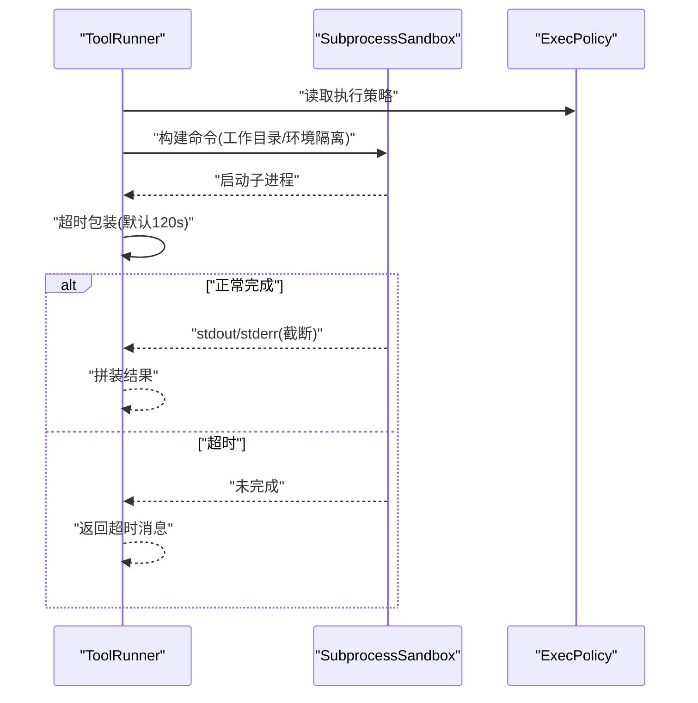
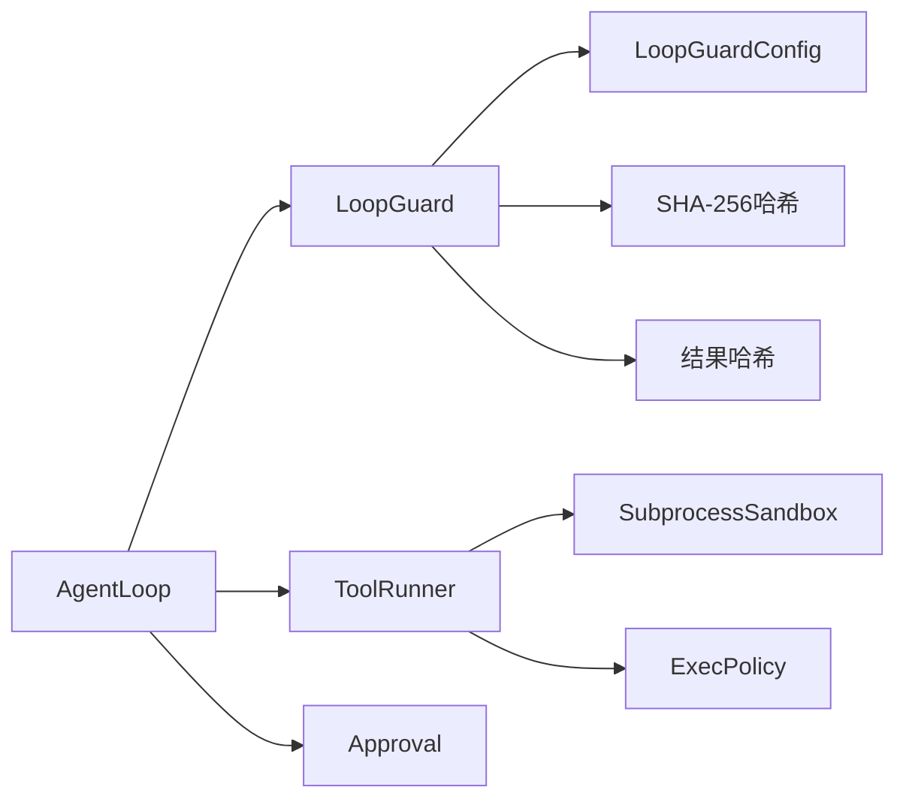

# 循环防护机制

<cite>
**本文档引用的文件**
- [loop_guard.rs](file://crates/openfang-runtime/src/loop_guard.rs)
- [agent_loop.rs](file://crates/openfang-runtime/src/agent_loop.rs)
- [tool_runner.rs](file://crates/openfang-runtime/src/tool_runner.rs)
- [subprocess_sandbox.rs](file://crates/openfang-runtime/src/subprocess_sandbox.rs)
- [config.rs](file://crates/openfang-types/src/config.rs)
- [auth_cooldown.rs](file://crates/openfang-runtime/src/auth_cooldown.rs)
- [approval.rs](file://crates/openfang-kernel/src/approval.rs)
- [workflow.rs](file://crates/openfang-kernel/src/workflow.rs)
</cite>

## 目录
1. [简介](#简介)
2. [项目结构](#项目结构)
3. [核心组件](#核心组件)
4. [架构总览](#架构总览)
5. [详细组件分析](#详细组件分析)
6. [依赖关系分析](#依赖关系分析)
7. [性能考量](#性能考量)
8. [故障排查指南](#故障排查指南)
9. [结论](#结论)
10. [附录](#附录)

## 简介
本文件系统化阐述 OpenFang 的循环防护机制，覆盖无限循环与卡死循环的检测与防护策略，包括：
- 循环计数器与哈希去重
- 执行时间监控与工具调用超时检测
- 工具执行监控与循环检测算法
- 循环守卫（LoopGuard）工作原理、阈值配置与异常处理
- 自动恢复策略与回退建议
- 在工具调用、智能体执行、长时间运行任务中的应用与配置示例
- 与资源限制、超时控制、错误恢复的关系

## 项目结构
循环防护机制主要分布在以下模块：
- 运行时内核：循环守卫、代理循环、工具执行器、子进程沙箱
- 类型定义：执行策略与超时配置
- 核心服务：审批门禁与工作流循环终止

**图表来源**
- [agent_loop.rs:145-917](file://crates/openfang-runtime/src/agent_loop.rs#L145-L917)
- [loop_guard.rs:101-526](file://crates/openfang-runtime/src/loop_guard.rs#L101-L526)
- [tool_runner.rs:99-526](file://crates/openfang-runtime/src/tool_runner.rs#L99-L526)
- [subprocess_sandbox.rs:660-767](file://crates/openfang-runtime/src/subprocess_sandbox.rs#L660-L767)
- [config.rs:801-824](file://crates/openfang-types/src/config.rs#L801-L824)
- [approval.rs:329-467](file://crates/openfang-kernel/src/approval.rs#L329-L467)
- [workflow.rs:730-755](file://crates/openfang-kernel/src/workflow.rs#L730-L755)

**章节来源**
- [agent_loop.rs:145-917](file://crates/openfang-runtime/src/agent_loop.rs#L145-L917)
- [loop_guard.rs:101-526](file://crates/openfang-runtime/src/loop_guard.rs#L101-L526)

## 核心组件
- 循环守卫（LoopGuard）
  - 基于 SHA-256 的工具名+参数哈希进行去重计数
  - 支持“结果感知”（outcome-aware）检测：当相同调用产生相同结果时，更快升级为警告或阻断
  - 支持“乒乓模式”检测：识别 A-B-A-B 或 A-B-C-A-B-C 的交替循环
  - 支持轮询工具（如 shell_exec 的状态检查）阈值放宽与回退建议
  - 警告桶（warning bucket）防止刷屏并可升级为阻断
  - 全局电路断路器（global circuit breaker）按总调用次数保护整次循环
- 代理循环（AgentLoop）
  - 在每次工具调用前执行 LoopGuard 检查
  - 对超时工具调用返回“超时”消息而非阻塞
  - 钩子事件触发与会话保存在循环中断时进行
- 工具执行器（ToolRunner）
  - shell_exec 使用子进程沙箱与超时控制
  - 统一输出截断，避免内存问题
- 执行策略（ExecPolicy）
  - 定义安全模式、命令白名单、超时与输出大小限制
- 审批门禁（Approval）
  - 对高风险工具（如 shell_exec）要求人工审批，防止滥用
- 工作流循环（Workflow）
  - 在工作流步骤中支持 until 条件终止，避免无限循环

**章节来源**
- [loop_guard.rs:35-122](file://crates/openfang-runtime/src/loop_guard.rs#L35-L122)
- [agent_loop.rs:629-753](file://crates/openfang-runtime/src/agent_loop.rs#L629-L753)
- [tool_runner.rs:1500-1578](file://crates/openfang-runtime/src/tool_runner.rs#L1500-L1578)
- [config.rs:801-824](file://crates/openfang-types/src/config.rs#L801-L824)
- [approval.rs:329-467](file://crates/openfang-kernel/src/approval.rs#L329-L467)
- [workflow.rs:730-755](file://crates/openfang-kernel/src/workflow.rs#L730-L755)

## 架构总览
循环防护贯穿“代理循环 → 工具调用 → 子进程执行”的全链路。

**图表来源**
- [agent_loop.rs:629-753](file://crates/openfang-runtime/src/agent_loop.rs#L629-L753)
- [loop_guard.rs:141-244](file://crates/openfang-runtime/src/loop_guard.rs#L141-L244)
- [tool_runner.rs:1500-1578](file://crates/openfang-runtime/src/tool_runner.rs#L1500-L1578)
- [subprocess_sandbox.rs:660-767](file://crates/openfang-runtime/src/subprocess_sandbox.rs#L660-L767)

## 详细组件分析

### 循环守卫（LoopGuard）工作原理
- 哈希与计数
  - 使用 SHA-256 对“(工具名 | 序列化参数)”生成唯一键，统计相同调用次数
  - 同时维护“最近历史”环形缓冲区，用于乒乓模式检测
- 阈值与分级响应
  - 警告阈值（warn_threshold）：达到后发出警告
  - 阻断阈值（block_threshold）：达到后阻止该调用
  - 全局断路器（global_circuit_breaker）：整次循环超过上限直接断路
- 结果感知（Outcome-Aware）
  - 对“(调用哈希 | 结果截断)”再次哈希，统计相同“调用+结果”对出现次数
  - 达到阈值后，下一次 check 即刻阻断，提示“当前方法无效”
- 乒乓模式检测
  - 从最近 HISTORY_SIZE 步中识别长度为 2 或 3 的重复模式
  - 达到最小重复次数（ping_pong_min_repeats）即阻断；否则仅警告
- 轮询工具处理
  - 对已知轮询工具（如 shell_exec 的状态检查）采用乘数放宽阈值
  - 提供回退建议（backoff schedule），随调用次数递增等待时间
- 警告桶（Warning Bucket）
  - 防止同一调用被反复警告刷屏
  - 超过最大警告次数后直接升级为阻断
- 统计快照
  - 暴露 total_calls、unique_calls、blocked_calls、most_repeated_tool 等指标

**图表来源**
- [loop_guard.rs:35-122](file://crates/openfang-runtime/src/loop_guard.rs#L35-L122)
- [loop_guard.rs:101-526](file://crates/openfang-runtime/src/loop_guard.rs#L101-L526)

**章节来源**
- [loop_guard.rs:101-526](file://crates/openfang-runtime/src/loop_guard.rs#L101-L526)

### 代理循环中的循环防护集成
- 初始化与扩展
  - 根据代理的最大迭代次数动态调整全局断路器阈值
- 工具调用前检查
  - 每个工具调用前执行 LoopGuard.check，根据返回值决定是否执行
  - 若返回 CircuitBreak，立即保存会话并结束循环
- 超时与结果处理
  - 工具执行使用超时包装，超时返回统一格式消息
  - 动态截断工具结果，避免上下文溢出
  - 若 LoopGuard 返回 Warn，将警告附加到结果文本
- 钩子与会话持久化
  - 在循环中断（含断路）时触发钩子事件并保存会话

**图表来源**
- [agent_loop.rs:331-798](file://crates/openfang-runtime/src/agent_loop.rs#L331-L798)
- [loop_guard.rs:246-281](file://crates/openfang-runtime/src/loop_guard.rs#L246-L281)

**章节来源**
- [agent_loop.rs:331-798](file://crates/openfang-runtime/src/agent_loop.rs#L331-L798)

### 工具执行监控与超时控制
- shell_exec 执行流程
  - 命令注入检测与沙箱隔离
  - 设置工作目录、环境变量隔离、UTF-8 输出
  - 使用超时包装（默认 120 秒），超时返回统一格式消息
  - 输出截断（默认 100KB），避免内存问题
- 执行策略（ExecPolicy）
  - 安全模式：deny（全部阻断）、allowlist（仅允许列表）、full（全部允许，不推荐）
  - 超时与输出大小限制：timeout_secs、max_output_bytes
  - 无输出空转超时：no_output_timeout_secs

**图表来源**
- [tool_runner.rs:1500-1578](file://crates/openfang-runtime/src/tool_runner.rs#L1500-L1578)
- [subprocess_sandbox.rs:660-767](file://crates/openfang-runtime/src/subprocess_sandbox.rs#L660-L767)
- [config.rs:801-824](file://crates/openfang-types/src/config.rs#L801-L824)

**章节来源**
- [tool_runner.rs:1500-1578](file://crates/openfang-runtime/src/tool_runner.rs#L1500-L1578)
- [subprocess_sandbox.rs:660-767](file://crates/openfang-runtime/src/subprocess_sandbox.rs#L660-L767)
- [config.rs:801-824](file://crates/openfang-types/src/config.rs#L801-L824)

### 审批门禁与循环防护协同
- 高风险工具（如 shell_exec）需要人工审批
- 审批拒绝或超时不会导致无限重试循环，代理会在工具结果中注入指导性文本，避免重复尝试
- 循环守卫仍会按调用次数与结果重复度进行防护

**章节来源**
- [approval.rs:329-467](file://crates/openfang-kernel/src/approval.rs#L329-L467)
- [agent_loop.rs:790-811](file://crates/openfang-runtime/src/agent_loop.rs#L790-L811)

### 工作流循环中的终止条件
- 工作流步骤支持 until 条件，当输出包含特定关键词时提前终止，避免无限循环
- 与循环守卫配合，形成“条件终止 + 计数防护”的双重保障

**章节来源**
- [workflow.rs:730-755](file://crates/openfang-kernel/src/workflow.rs#L730-L755)

## 依赖关系分析
- 循环守卫依赖
  - 配置：LoopGuardConfig（阈值、倍率、最小重复次数等）
  - 工具定义：通过工具名与参数哈希定位调用
  - 结果哈希：基于结果截断后的哈希，避免大结果影响性能
- 代理循环依赖
  - 循环守卫：在工具调用前决策
  - 工具执行器：实际执行工具并返回结果
  - 执行策略：约束工具执行行为
  - 审批门禁：对高风险工具进行准入控制
- 工具执行器依赖
  - 子进程沙箱：命令注入检测、环境隔离、超时控制
  - 执行策略：安全模式与超时限制

**图表来源**
- [loop_guard.rs:35-122](file://crates/openfang-runtime/src/loop_guard.rs#L35-L122)
- [agent_loop.rs:145-917](file://crates/openfang-runtime/src/agent_loop.rs#L145-L917)
- [tool_runner.rs:99-526](file://crates/openfang-runtime/src/tool_runner.rs#L99-L526)
- [subprocess_sandbox.rs:660-767](file://crates/openfang-runtime/src/subprocess_sandbox.rs#L660-L767)
- [config.rs:801-824](file://crates/openfang-types/src/config.rs#L801-L824)
- [approval.rs:329-467](file://crates/openfang-kernel/src/approval.rs#L329-L467)

**章节来源**
- [loop_guard.rs:35-122](file://crates/openfang-runtime/src/loop_guard.rs#L35-L122)
- [agent_loop.rs:145-917](file://crates/openfang-runtime/src/agent_loop.rs#L145-L917)
- [tool_runner.rs:99-526](file://crates/openfang-runtime/src/tool_runner.rs#L99-L526)

## 性能考量
- 哈希与截断
  - 调用与结果均进行哈希，避免大对象比较开销
  - 结果截断（默认 100KB）降低内存占用与哈希成本
- 环形缓冲区
  - 最近历史固定容量（默认 30），避免长期累积导致的检测开销
- 阈值放宽与回退
  - 轮询工具采用乘数放宽阈值，减少误报
  - 回退建议按指数增长，避免频繁轮询造成资源浪费
- 警告桶
  - 控制告警频率，避免刷屏与额外 IO

[本节为通用性能讨论，无需具体文件分析]

## 故障排查指南
- 症状：代理循环被断路
  - 可能原因：总调用次数超过全局断路器阈值
  - 处理：检查 max_iterations 与工具调用逻辑，必要时提升阈值或优化循环
- 症状：工具被阻断
  - 可能原因：相同调用次数达到阻断阈值；或结果重复达到阈值；或检测到乒乓模式
  - 处理：变更参数、切换工具、引入随机性或等待时间；检查是否误判轮询工具
- 症状：工具执行超时
  - 可能原因：命令耗时过长、网络阻塞、I/O 等待
  - 处理：调整 ExecPolicy.timeout_secs；检查子进程沙箱策略；优化命令
- 症状：审批拒绝导致循环
  - 可能原因：高风险工具需要人工审批且被拒绝
  - 处理：在配置中启用自动审批或引导用户批准；避免重复尝试

**章节来源**
- [agent_loop.rs:635-655](file://crates/openfang-runtime/src/agent_loop.rs#L635-L655)
- [loop_guard.rs:195-216](file://crates/openfang-runtime/src/loop_guard.rs#L195-L216)
- [tool_runner.rs:1541-1578](file://crates/openfang-runtime/src/tool_runner.rs#L1541-L1578)
- [approval.rs:329-467](file://crates/openfang-kernel/src/approval.rs#L329-L467)

## 结论
OpenFang 的循环防护机制通过“调用计数 + 结果感知 + 乒乓检测 + 全局断路 + 警告桶 + 回退建议”形成多层防护，结合代理循环的超时控制与会话保存、工具执行器的沙箱与策略约束，有效避免无限循环与卡死循环带来的资源浪费与系统风险。在工具调用、智能体执行与长时间运行任务中，应合理配置阈值与策略，确保安全与稳定性。

[本节为总结性内容，无需具体文件分析]

## 附录

### 配置示例与最佳实践
- 配置循环守卫阈值
  - 警告阈值：warn_threshold（默认 3）
  - 阻断阈值：block_threshold（默认 5）
  - 全局断路器：global_circuit_breaker（默认 30，会随 max_iterations 动态扩大）
  - 轮询工具乘数：poll_multiplier（默认 3）
  - 结果感知阈值：outcome_warn_threshold/outcome_block_threshold（默认 2/3）
  - 乒乓最小重复：ping_pong_min_repeats（默认 3）
  - 警告桶上限：max_warnings_per_call（默认 3）
- 配置工具执行策略
  - 安全模式：deny/allowlist/full
  - 超时：timeout_secs（默认 30，代理循环默认 120）
  - 输出大小：max_output_bytes（默认 100KB）
  - 无输出空转超时：no_output_timeout_secs（默认 30）

**章节来源**
- [loop_guard.rs:56-69](file://crates/openfang-runtime/src/loop_guard.rs#L56-L69)
- [agent_loop.rs:43-45](file://crates/openfang-runtime/src/agent_loop.rs#L43-L45)
- [config.rs:801-824](file://crates/openfang-types/src/config.rs#L801-L824)