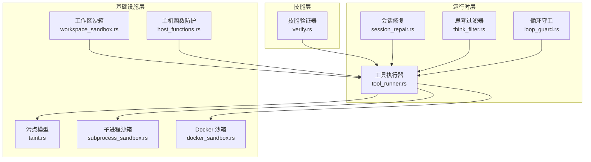
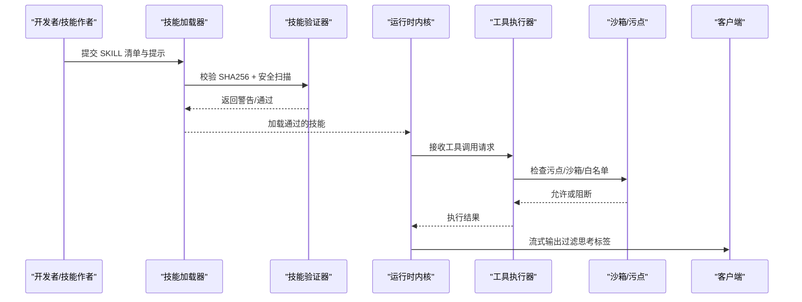
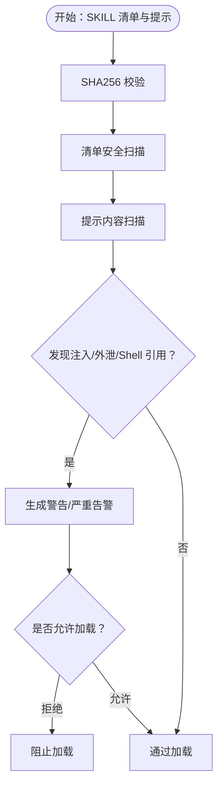
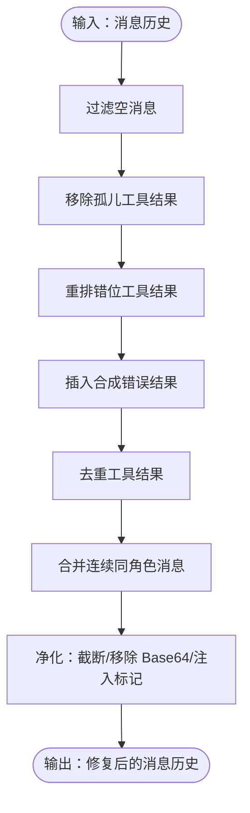
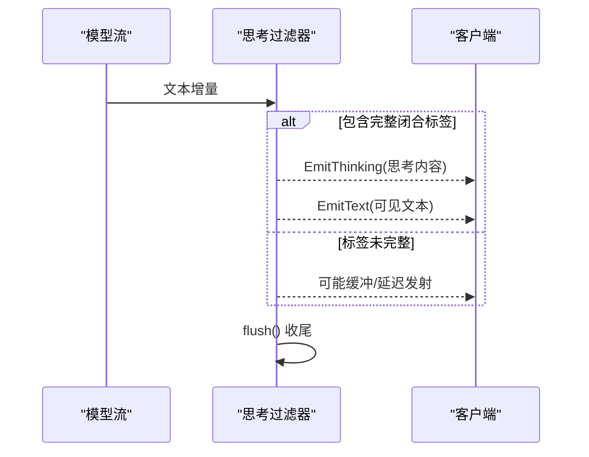
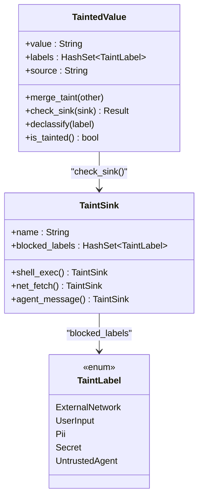
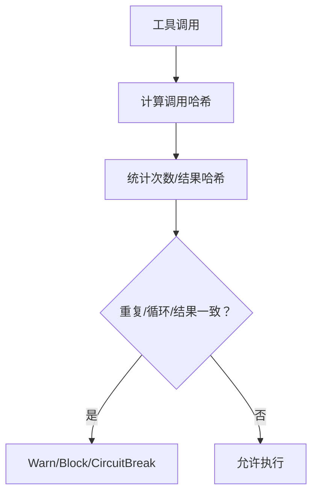
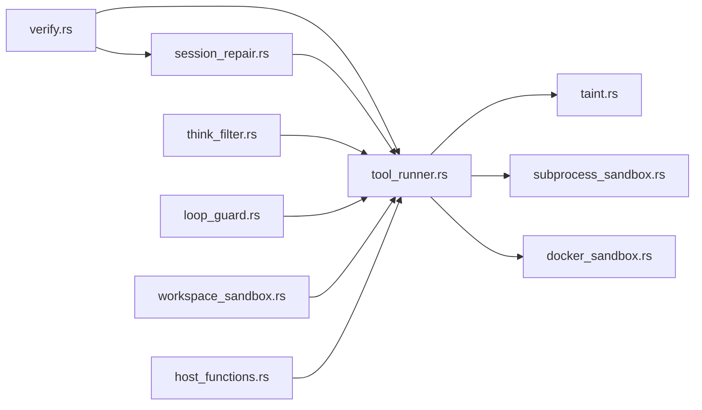

# 提示注入防护

<cite>
**本文档引用的文件**
- [verify.rs](file://crates/openfang-skills/src/verify.rs)
- [think_filter.rs](file://crates/openfang-runtime/src/think_filter.rs)
- [session_repair.rs](file://crates/openfang-runtime/src/session_repair.rs)
- [tool_runner.rs](file://crates/openfang-runtime/src/tool_runner.rs)
- [taint.rs](file://crates/openfang-types/src/taint.rs)
- [subprocess_sandbox.rs](file://crates/openfang-runtime/src/subprocess_sandbox.rs)
- [docker_sandbox.rs](file://crates/openfang-runtime/src/docker_sandbox.rs)
- [loop_guard.rs](file://crates/openfang-runtime/src/loop_guard.rs)
- [workspace_sandbox.rs](file://crates/openfang-runtime/src/workspace_sandbox.rs)
- [host_functions.rs](file://crates/openfang-runtime/src/host_functions.rs)
- [README.md](file://README.md)
- [security.md](file://docs/security.md)
</cite>

## 目录
1. [简介](#简介)
2. [项目结构](#项目结构)
3. [核心组件](#核心组件)
4. [架构总览](#架构总览)
5. [详细组件分析](#详细组件分析)
6. [依赖关系分析](#依赖关系分析)
7. [性能考虑](#性能考虑)
8. [故障排除指南](#故障排除指南)
9. [结论](#结论)
10. [附录](#附录)

## 简介
本技术文档聚焦于 OpenFang 的提示注入防护机制，系统性阐述恶意提示检测与防护策略，涵盖提示注入扫描算法、恶意模式识别、上下文分析；技能加载过程中的安全检查、提示模板验证、参数注入防护；思考过滤器的工作原理、敏感内容检测与输出净化机制。同时给出提示注入防护在技能开发、LLM 交互、内容生成中的具体应用示例，并解释其与内容安全策略、输出过滤、安全编码的关系。

## 项目结构
OpenFang 将提示注入防护贯穿于多个运行时模块与类型定义中：
- 技能安全验证：对技能清单与提示内容进行完整性校验与安全扫描
- 运行时会话修复：清理与修复消息历史，移除潜在注入标记与大体积工具结果
- 工具执行安全：基于污点跟踪与沙箱策略，阻断危险命令与网络请求
- 思考标签过滤：在流式输出中分离可见文本与思考内容，避免注入标签泄露
- 沙箱与环形保护：进程沙箱、工作区限制、循环检测等多层防御

**图表来源**
- [verify.rs:1-295](file://crates/openfang-skills/src/verify.rs#L1-L295)
- [session_repair.rs:1-800](file://crates/openfang-runtime/src/session_repair.rs#L1-L800)
- [think_filter.rs:1-446](file://crates/openfang-runtime/src/think_filter.rs#L1-L446)
- [tool_runner.rs:1-800](file://crates/openfang-runtime/src/tool_runner.rs#L1-L800)
- [taint.rs:1-245](file://crates/openfang-types/src/taint.rs#L1-L245)
- [subprocess_sandbox.rs:1-800](file://crates/openfang-runtime/src/subprocess_sandbox.rs#L1-L800)
- [docker_sandbox.rs:1-635](file://crates/openfang-runtime/src/docker_sandbox.rs#L1-L635)
- [workspace_sandbox.rs:1-148](file://crates/openfang-runtime/src/workspace_sandbox.rs#L1-L148)
- [host_functions.rs:104-132](file://crates/openfang-runtime/src/host_functions.rs#L104-L132)

**章节来源**
- [README.md:206-227](file://README.md#L206-L227)

## 核心组件
- 技能验证器（SkillVerifier）
  - 基于 SHA256 的完整性校验
  - 对技能清单与提示内容进行安全扫描，识别提示覆盖、数据外泄、Shell 命令引用等高危模式
- 会话修复器（SessionRepair）
  - 清理孤儿工具结果、空消息、重复工具结果，重排错位结果，截断超长工具输出，移除注入标记
- 思考过滤器（StreamingThinkFilter）
  - 在流式响应中识别与分离 `<think>...</think>` 标签，确保思考内容不直接暴露给用户
- 工具执行器（ToolRunner）
  - 结合污点跟踪与沙箱策略，阻断危险命令与网络请求，执行前进行能力授权与审批门禁
- 污点模型（TaintTracking）
  - 定义标签与水槽（Sink），在值传播过程中强制阻断敏感数据流向危险目的地
- 沙箱与环形保护
  - 子进程环境隔离、命令白名单、Docker 沙箱、工作区路径限制、SSRF 防护、循环检测

**章节来源**
- [verify.rs:1-295](file://crates/openfang-skills/src/verify.rs#L1-L295)
- [session_repair.rs:1-800](file://crates/openfang-runtime/src/session_repair.rs#L1-L800)
- [think_filter.rs:1-446](file://crates/openfang-runtime/src/think_filter.rs#L1-L446)
- [tool_runner.rs:1-800](file://crates/openfang-runtime/src/tool_runner.rs#L1-L800)
- [taint.rs:1-245](file://crates/openfang-types/src/taint.rs#L1-L245)
- [subprocess_sandbox.rs:1-800](file://crates/openfang-runtime/src/subprocess_sandbox.rs#L1-L800)
- [docker_sandbox.rs:1-635](file://crates/openfang-runtime/src/docker_sandbox.rs#L1-L635)
- [workspace_sandbox.rs:1-148](file://crates/openfang-runtime/src/workspace_sandbox.rs#L1-L148)
- [host_functions.rs:104-132](file://crates/openfang-runtime/src/host_functions.rs#L104-L132)

## 架构总览
提示注入防护在 OpenFang 中形成“输入校验—上下文净化—执行拦截—输出过滤”的闭环：

**图表来源**
- [verify.rs:1-295](file://crates/openfang-skills/src/verify.rs#L1-L295)
- [tool_runner.rs:1-800](file://crates/openfang-runtime/src/tool_runner.rs#L1-L800)
- [think_filter.rs:1-446](file://crates/openfang-runtime/src/think_filter.rs#L1-L446)

## 详细组件分析

### 技能验证与提示注入扫描
- 完整性校验：使用 SHA256 计算数据摘要，支持大小写不敏感比对
- 安全扫描：
  - 提示覆盖尝试：忽略先前指令、系统提示覆盖、新指令等关键词
  - 数据外泄模式：发送到 HTTP/HTTPS、转发全部数据、Base64 编码后发送、上传
  - Shell 命令引用：rm -rf、chmod、sudo 等
  - 大体积内容告警：超过阈值时发出信息级警告
- 清单扫描：Node.js 运行时、ShellExec 能力、NetConnect(*)、危险工具（shell_exec、file_write）等

**图表来源**
- [verify.rs:1-295](file://crates/openfang-skills/src/verify.rs#L1-L295)

**章节来源**
- [verify.rs:1-295](file://crates/openfang-skills/src/verify.rs#L1-L295)

### 会话修复与输出净化
- 修复规则：
  - 移除孤儿工具结果、空消息、重复工具结果
  - 重排错位工具结果，插入合成错误结果填补缺失
  - 合并连续相同角色消息
  - 截断超长工具输出（最大 10KB），移除 Base64 大块（>1000 字符），移除注入标记
- 注入标记清理：系统标记、IM 标记、SYS 标记等

**图表来源**
- [session_repair.rs:1-800](file://crates/openfang-runtime/src/session_repair.rs#L1-L800)

**章节来源**
- [session_repair.rs:1-800](file://crates/openfang-runtime/src/session_repair.rs#L1-L800)

### 思考过滤器（StreamingThinkFilter）
- 功能：在流式响应中识别 `<think>...</think>` 标签，将思考内容作为独立流事件发送，仅在必要时显示可见文本
- 特性：处理标签边界拆分、部分匹配缓冲、流结束时的刷新逻辑

**图表来源**
- [think_filter.rs:1-446](file://crates/openfang-runtime/src/think_filter.rs#L1-L446)

**章节来源**
- [think_filter.rs:1-446](file://crates/openfang-runtime/src/think_filter.rs#L1-L446)

### 工具执行与污点跟踪
- 污点模型：
  - 标签：外部网络、用户输入、个人身份信息、密钥、不受信任代理
  - 水槽：shell_exec、net_fetch、agent_message 等
  - 检查：若值携带被水槽禁止的标签则阻断
- 工具执行安全：
  - 能力授权：仅允许清单授予的能力
  - 审批门禁：需要人工审批的工具
  - Shell 检测：阻断元字符注入；在非 Full 模式下进一步阻断可疑模式（curl、管道、base64 解码、eval）
  - 网络检测：阻断包含密钥、令牌、授权头等的 URL
  - 沙箱：子进程环境隔离、可执行路径校验、Docker 沙箱资源限制与能力裁剪

**图表来源**
- [taint.rs:1-245](file://crates/openfang-types/src/taint.rs#L1-L245)

**章节来源**
- [tool_runner.rs:1-800](file://crates/openfang-runtime/src/tool_runner.rs#L1-L800)
- [taint.rs:1-245](file://crates/openfang-types/src/taint.rs#L1-L245)
- [subprocess_sandbox.rs:1-800](file://crates/openfang-runtime/src/subprocess_sandbox.rs#L1-L800)
- [docker_sandbox.rs:1-635](file://crates/openfang-runtime/src/docker_sandbox.rs#L1-L635)

### 循环检测与安全编码
- 循环守卫：基于 SHA-256 哈希统计工具调用与结果，检测重复调用、相同结果反复、Ping-Pong 循环，提供警告、阻断、全局电路 breaker
- 安全编码实践：
  - 子进程沙箱：仅允许安全环境变量、显式允许的命令白名单
  - 工作区沙箱：路径解析与规范化，拒绝路径穿越与符号链接逃逸
  - SSRF 防护：仅允许 http/https，解析真实地址判断私有网段
  - 主机函数防护：路径解析二次校验，防止文件名穿越

**图表来源**
- [loop_guard.rs:1-800](file://crates/openfang-runtime/src/loop_guard.rs#L1-L800)
- [subprocess_sandbox.rs:1-800](file://crates/openfang-runtime/src/subprocess_sandbox.rs#L1-L800)
- [workspace_sandbox.rs:1-148](file://crates/openfang-runtime/src/workspace_sandbox.rs#L1-L148)
- [host_functions.rs:104-132](file://crates/openfang-runtime/src/host_functions.rs#L104-L132)

**章节来源**
- [loop_guard.rs:1-800](file://crates/openfang-runtime/src/loop_guard.rs#L1-L800)
- [workspace_sandbox.rs:1-148](file://crates/openfang-runtime/src/workspace_sandbox.rs#L1-L148)
- [host_functions.rs:104-132](file://crates/openfang-runtime/src/host_functions.rs#L104-L132)

## 依赖关系分析
- 组件耦合
  - 技能验证器与工具执行器：验证通过后才允许加载，工具执行阶段再进行运行时拦截
  - 会话修复器与思考过滤器：前者净化上下文，后者控制输出可见性
  - 污点模型与工具执行器：前者提供标签与水槽，后者在执行前进行检查
- 外部依赖
  - Docker 与子进程管理：用于容器化与进程隔离
  - 环境变量与路径解析：受平台差异影响，需严格白名单与规范化

**图表来源**
- [verify.rs:1-295](file://crates/openfang-skills/src/verify.rs#L1-L295)
- [tool_runner.rs:1-800](file://crates/openfang-runtime/src/tool_runner.rs#L1-L800)
- [session_repair.rs:1-800](file://crates/openfang-runtime/src/session_repair.rs#L1-L800)
- [think_filter.rs:1-446](file://crates/openfang-runtime/src/think_filter.rs#L1-L446)
- [taint.rs:1-245](file://crates/openfang-types/src/taint.rs#L1-L245)
- [subprocess_sandbox.rs:1-800](file://crates/openfang-runtime/src/subprocess_sandbox.rs#L1-L800)
- [docker_sandbox.rs:1-635](file://crates/openfang-runtime/src/docker_sandbox.rs#L1-L635)
- [loop_guard.rs:1-800](file://crates/openfang-runtime/src/loop_guard.rs#L1-L800)
- [workspace_sandbox.rs:1-148](file://crates/openfang-runtime/src/workspace_sandbox.rs#L1-L148)
- [host_functions.rs:104-132](file://crates/openfang-runtime/src/host_functions.rs#L104-L132)

**章节来源**
- [README.md:206-227](file://README.md#L206-L227)

## 性能考虑
- 提示扫描与会话修复：采用线性扫描与一次性遍历，时间复杂度与输入长度线性相关；对超长内容进行截断与阈值控制
- 污点检查：常数开销，按标签集合大小线性评估
- 流式思考过滤：缓冲与部分匹配，内存占用与标签边界长度相关
- 沙箱与循环检测：哈希表与滑动窗口，整体近似线性

## 故障排除指南
- 技能加载失败
  - 检查 SHA256 校验是否通过，确认清单与提示内容未被篡改
  - 关注安全扫描警告，特别是提示覆盖、数据外泄、Shell 引用等
- 工具执行被阻断
  - 查看污点标签与水槽冲突，确认输入来源与目标是否被禁止
  - 检查执行策略（Deny/Allowlist/Full）与命令白名单配置
- 输出异常
  - 确认思考过滤器是否正确识别标签
  - 检查会话修复器是否截断了过长内容或移除了注入标记
- 循环卡顿
  - 观察循环守卫的统计快照，调整工具调用策略或增加退避

**章节来源**
- [verify.rs:1-295](file://crates/openfang-skills/src/verify.rs#L1-L295)
- [tool_runner.rs:1-800](file://crates/openfang-runtime/src/tool_runner.rs#L1-L800)
- [think_filter.rs:1-446](file://crates/openfang-runtime/src/think_filter.rs#L1-L446)
- [session_repair.rs:1-800](file://crates/openfang-runtime/src/session_repair.rs#L1-L800)
- [loop_guard.rs:1-800](file://crates/openfang-runtime/src/loop_guard.rs#L1-L800)

## 结论
OpenFang 的提示注入防护以“防御纵深”为核心设计，从技能加载、上下文净化、执行拦截到输出过滤形成闭环。通过可扩展的安全扫描、严格的污点跟踪、多层沙箱与循环检测，有效降低提示注入、数据外泄与误执行风险。建议在技能开发与集成中遵循最小权限、显式审批、白名单策略与严格输出净化原则，持续完善内容安全策略与安全编码规范。

## 附录
- 内容安全策略建议
  - 输入验证：在信任边界处进行格式、长度、范围校验
  - 输出净化：对渲染边界进行编码与脱敏
  - 最小权限：认证、授权、文件系统访问、网络连接均遵循最小权限原则
  - 日志监控：启用审计与入侵检测，快速发现与处置异常
- 输出过滤最佳实践
  - 使用 CSP、X-Frame-Options、HSTS 等安全头部
  - 对用户输入进行转义与上下文适配
  - 分离思考内容与可见文本，避免注入标签泄露

**章节来源**
- [README.md:206-227](file://README.md#L206-L227)
- [security.md](file://docs/security.md)