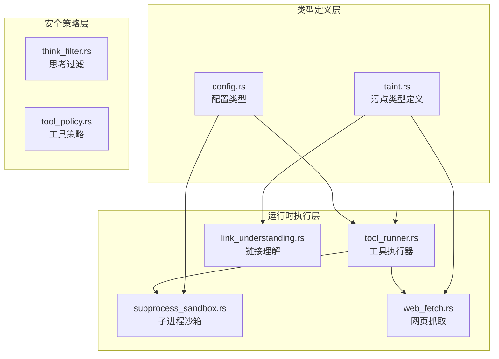
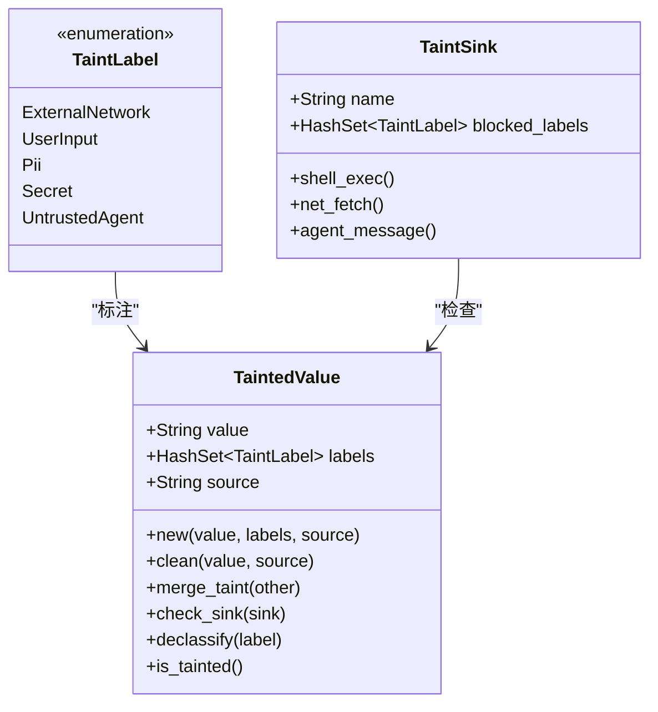
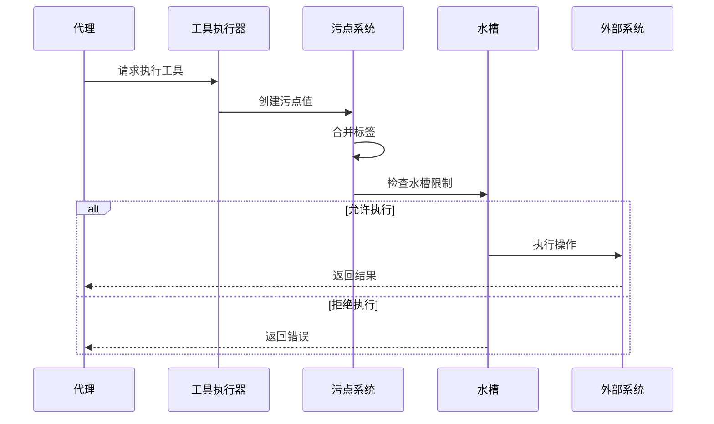
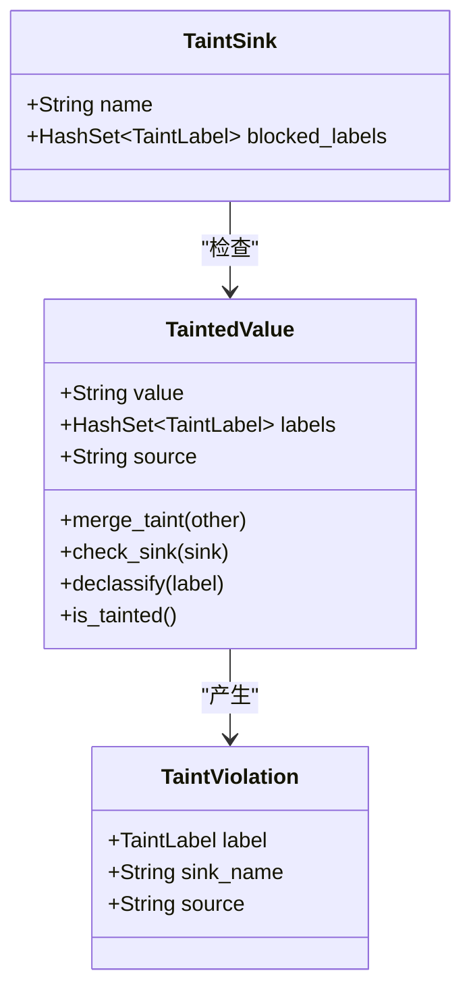
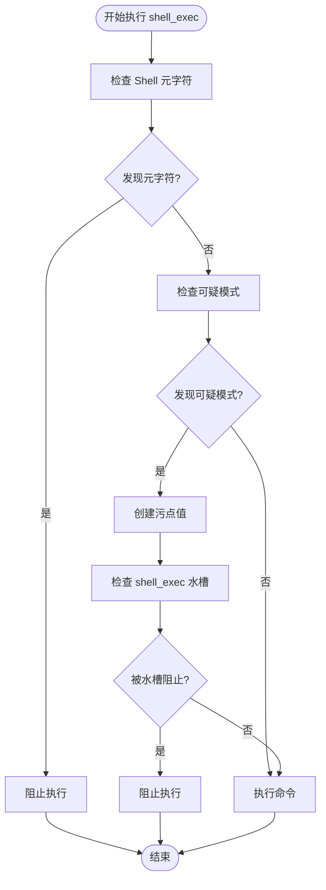
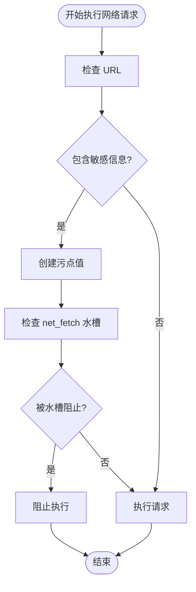
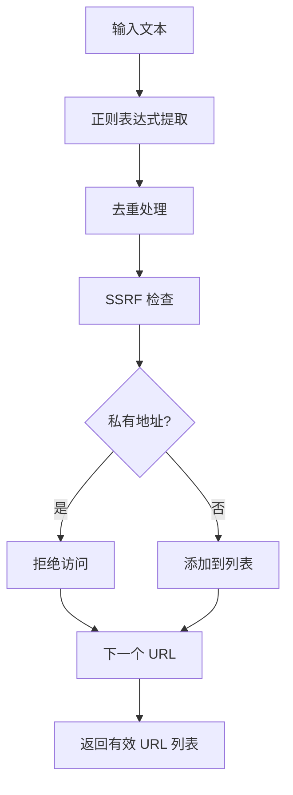
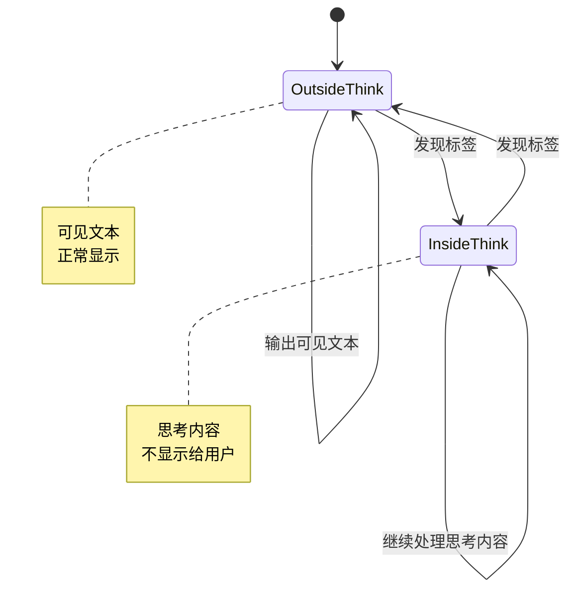
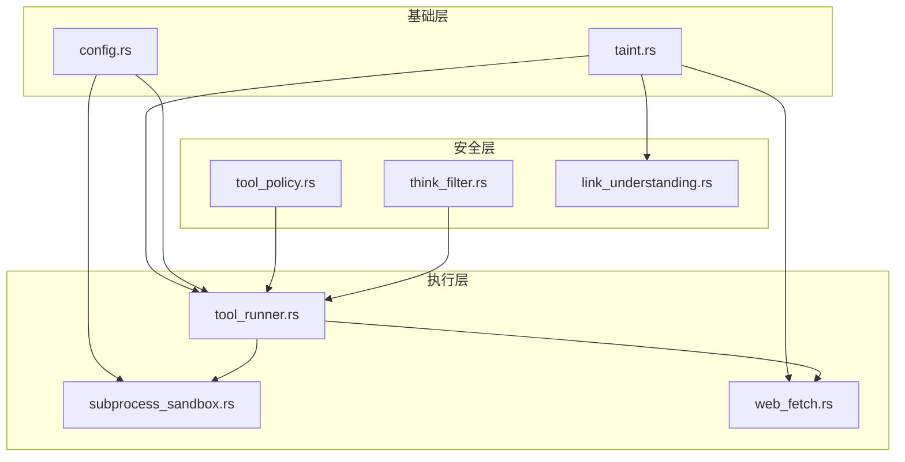

# 污点追踪系统

<cite>
**本文档引用的文件**
- [taint.rs](file://crates/openfang-types/src/taint.rs)
- [tool_runner.rs](file://crates/openfang-runtime/src/tool_runner.rs)
- [link_understanding.rs](file://crates/openfang-runtime/src/link_understanding.rs)
- [think_filter.rs](file://crates/openfang-runtime/src/think_filter.rs)
- [web_fetch.rs](file://crates/openfang-runtime/src/web_fetch.rs)
- [config.rs](file://crates/openfang-types/src/config.rs)
- [subprocess_sandbox.rs](file://crates/openfang-runtime/src/subprocess_sandbox.rs)
- [tool_policy.rs](file://crates/openfang-runtime/src/tool_policy.rs)
- [README.md](file://README.md)
</cite>

## 目录
1. [简介](#简介)
2. [项目结构](#项目结构)
3. [核心组件](#核心组件)
4. [架构概览](#架构概览)
5. [详细组件分析](#详细组件分析)
6. [依赖关系分析](#依赖关系分析)
7. [性能考虑](#性能考虑)
8. [故障排除指南](#故障排除指南)
9. [结论](#结论)
10. [附录](#附录)

## 简介

OpenFang 污点追踪系统是一个基于格的污点传播模型，用于防止敏感数据在系统中不安全地流动。该系统通过标签化数据源、跟踪污点传播路径、实施水槽限制和执行显式去污化决策来提供强大的信息流控制。

该系统的核心目标是保护以下关键资产：
- 外部网络数据（防止注入攻击）
- 用户输入（防止数据泄露）
- 个人身份信息（PII）（防止隐私泄露）
- 密钥和凭证（防止凭据泄露）
- 不受信任代理的数据（防止混淆代理攻击）

## 项目结构

OpenFang 污点追踪系统主要分布在以下模块中：



**图表来源**
- [taint.rs:1-245](file://crates/openfang-types/src/taint.rs#L1-L245)
- [tool_runner.rs:1-800](file://crates/openfang-runtime/src/tool_runner.rs#L1-L800)
- [config.rs:785-800](file://crates/openfang-types/src/config.rs#L785-L800)

**章节来源**
- [README.md:206-227](file://README.md#L206-L227)

## 核心组件

### 污点标签类型

OpenFang 定义了五种核心污点标签，每种标签代表不同类型的敏感数据源：



**图表来源**
- [taint.rs:12-158](file://crates/openfang-types/src/taint.rs#L12-L158)

### 污点传播规则

系统实现了严格的污点传播规则：

1. **合并传播**：当两个值合并时，结果必须携带两个标签集的并集
2. **标签联合**：任何包含敏感标签的数据都必须经过水槽检查
3. **敏感数据流向阻断**：阻止敏感标签流向受限的水槽

### 污点水槽定义

系统定义了三个核心水槽：

| 水槽名称 | 阻止的标签 | 用途 |
|---------|-----------|------|
| shell_exec | ExternalNetwork, UntrustedAgent, UserInput | 防止命令注入攻击 |
| net_fetch | Secret, Pii | 防止数据外泄 |
| agent_message | Secret | 防止凭据泄露 |

**章节来源**
- [taint.rs:114-158](file://crates/openfang-types/src/taint.rs#L114-L158)

## 架构概览

OpenFang 污点追踪系统采用分层架构设计，确保每个组件都有明确的职责边界：



**图表来源**
- [tool_runner.rs:99-526](file://crates/openfang-runtime/src/tool_runner.rs#L99-L526)
- [taint.rs:83-98](file://crates/openfang-types/src/taint.rs#L83-L98)

## 详细组件分析

### 污点类型系统

污点类型系统是整个安全框架的基础，提供了类型安全的污点管理：

#### 数据结构设计



**图表来源**
- [taint.rs:39-182](file://crates/openfang-types/src/taint.rs#L39-L182)

#### 标签传播机制

污点标签通过以下方式传播：
1. **输入标签**：从外部网络、用户输入、不受信任代理获取
2. **合并传播**：字符串拼接、数组合并等操作
3. **条件传播**：根据执行上下文动态添加标签

**章节来源**
- [taint.rs:73-112](file://crates/openfang-types/src/taint.rs#L73-L112)

### 工具执行器集成

工具执行器将污点追踪集成到所有可能产生安全风险的操作中：

#### Shell 命令执行



**图表来源**
- [tool_runner.rs:21-48](file://crates/openfang-runtime/src/tool_runner.rs#L21-L48)

#### 网络请求执行



**图表来源**
- [tool_runner.rs:50-75](file://crates/openfang-runtime/src/tool_runner.rs#L50-L75)

**章节来源**
- [tool_runner.rs:21-75](file://crates/openfang-runtime/src/tool_runner.rs#L21-L75)

### 链接理解与污点追踪

链接理解功能自动提取消息中的 URL，并应用 SSRF 保护：

#### URL 提取流程



**图表来源**
- [link_understanding.rs:21-52](file://crates/openfang-runtime/src/link_understanding.rs#L21-L52)

**章节来源**
- [link_understanding.rs:18-104](file://crates/openfang-runtime/src/link_understanding.rs#L18-L104)

### 思考过滤器与内容安全

思考过滤器确保 LLM 的推理内容不会意外泄露：

#### 流式处理机制



**图表来源**
- [think_filter.rs:23-135](file://crates/openfang-runtime/src/think_filter.rs#L23-L135)

**章节来源**
- [think_filter.rs:1-446](file://crates/openfang-runtime/src/think_filter.rs#L1-L446)

### 子进程沙箱与执行策略

子进程沙箱提供了额外的执行安全保障：

#### 执行模式

| 模式 | 描述 | 安全级别 |
|------|------|----------|
| Deny | 禁用所有 shell 执行 | 最高 |
| Allowlist | 仅允许白名单命令 | 高 |
| Full | 允许所有命令 | 低 |

**章节来源**
- [subprocess_sandbox.rs:200-214](file://crates/openfang-runtime/src/subprocess_sandbox.rs#L200-L214)
- [config.rs:785-800](file://crates/openfang-types/src/config.rs#L785-L800)

## 依赖关系分析

OpenFang 污点追踪系统具有清晰的依赖层次结构：



**图表来源**
- [taint.rs:1-245](file://crates/openfang-types/src/taint.rs#L1-L245)
- [tool_runner.rs:1-116](file://crates/openfang-runtime/src/tool_runner.rs#L1-L116)

**章节来源**
- [tool_policy.rs:36-71](file://crates/openfang-runtime/src/tool_policy.rs#L36-L71)

## 性能考虑

### 污点检查优化

1. **早期短路**：在发现第一个阻塞标签时立即返回
2. **哈希集合优化**：使用 HashSet 进行 O(1) 标签查找
3. **延迟计算**：只在必要时创建污点值

### 内存管理

1. **零拷贝字符串**：使用 String 类型避免不必要的内存分配
2. **智能缓存**：网页抓取结果使用缓存减少重复网络请求
3. **资源清理**：及时释放不再使用的资源

### 并发安全

1. **不可变数据**：污点标签使用不可变结构
2. **线程安全**：所有共享状态都经过适当的同步

## 故障排除指南

### 常见问题诊断

#### 污点违规错误

当遇到污点违规时，系统会返回详细的错误信息：

```rust
// 错误格式示例
TaintViolation {
    label: TaintLabel::ExternalNetwork,
    sink_name: "shell_exec".to_string(),
    source: "http_response".to_string(),
}
```

#### 调试建议

1. **检查标签来源**：确认数据的原始来源是否正确标注
2. **验证水槽配置**：确认目标水槽的阻塞标签设置
3. **审查去污化逻辑**：确保显式去污化决策合理

**章节来源**
- [taint.rs:160-182](file://crates/openfang-types/src/taint.rs#L160-L182)

### 性能问题排查

#### 污点检查过慢

1. **检查标签数量**：过多的标签可能导致检查时间增加
2. **优化数据结构**：考虑使用更高效的数据结构
3. **启用缓存**：对频繁检查的结果进行缓存

#### 内存泄漏

1. **检查资源清理**：确保所有临时资源都被正确释放
2. **监控内存使用**：定期检查内存使用情况
3. **使用内存分析工具**：定位潜在的内存泄漏点

## 结论

OpenFang 污点追踪系统通过其基于格的模型提供了强大的信息流控制能力。系统的设计充分考虑了安全性、性能和可维护性，为现代 AI 代理系统提供了坚实的安全基础。

### 主要优势

1. **完整的覆盖范围**：从输入到输出的全链路保护
2. **灵活的配置**：支持多种执行模式和安全策略
3. **高效的实现**：优化的数据结构和算法
4. **易于集成**：清晰的 API 和模块化设计

### 应用场景扩展

该系统可以应用于更多场景：
- **内容过滤**：防止敏感内容的不当传播
- **合规审计**：跟踪数据的完整流动历史
- **威胁检测**：识别异常的数据流模式
- **安全监控**：实时监控系统的安全状态

## 附录

### 配置选项

#### 执行策略配置

```toml
[exec_policy]
mode = "allowlist"  # deny | allowlist | full
timeout_secs = 30
safe_bins = ["echo", "cat", "ls"]
allowed_commands = []
```

#### 污点追踪配置

```toml
[taint_tracking]
enabled = true
max_label_count = 10
label_cleanup_interval = 3600
```

### 最佳实践

1. **最小权限原则**：只授予必要的工具访问权限
2. **显式去污化**：在移除标签前进行充分的安全评估
3. **定期审计**：定期检查污点标签的准确性和完整性
4. **监控告警**：建立完善的监控和告警机制