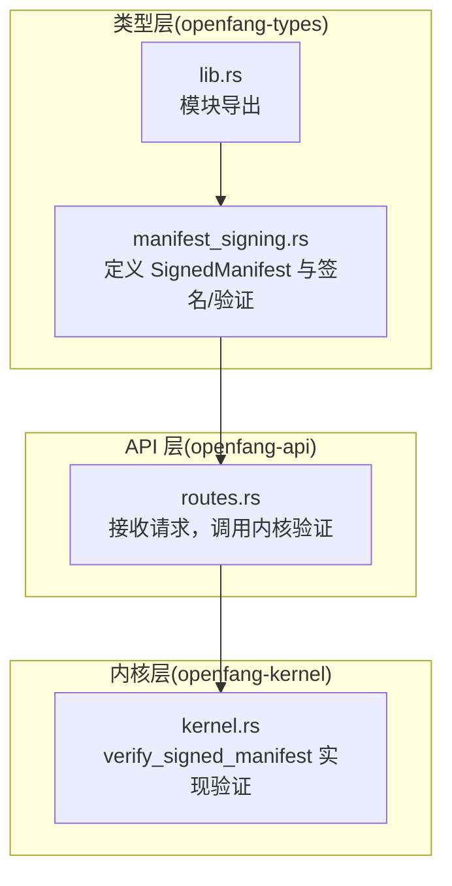
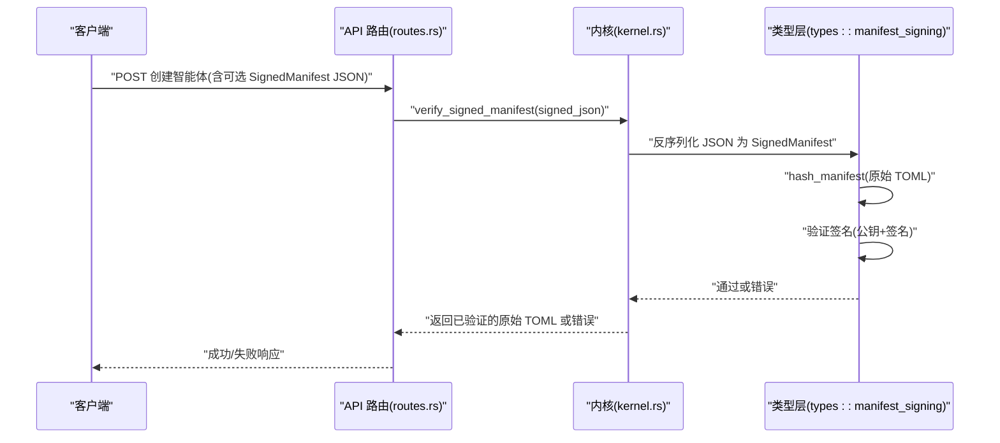
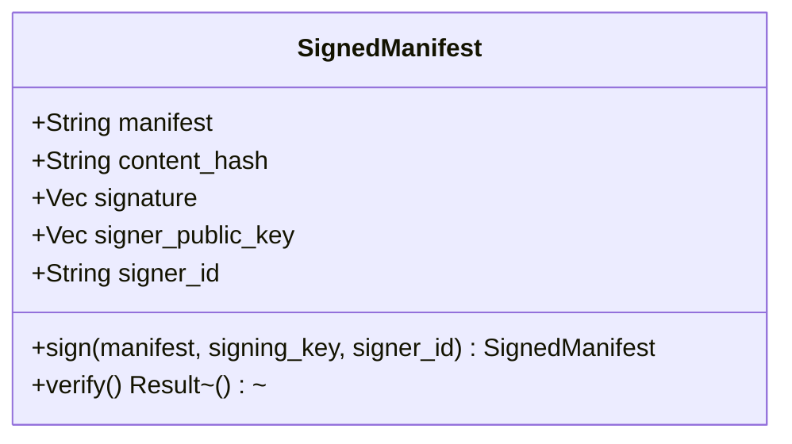
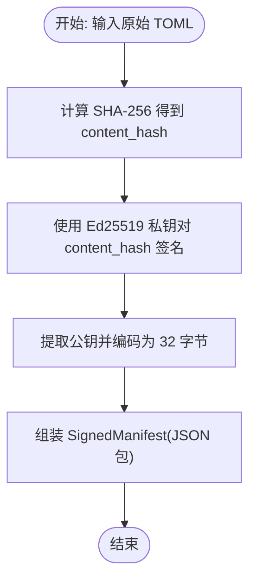
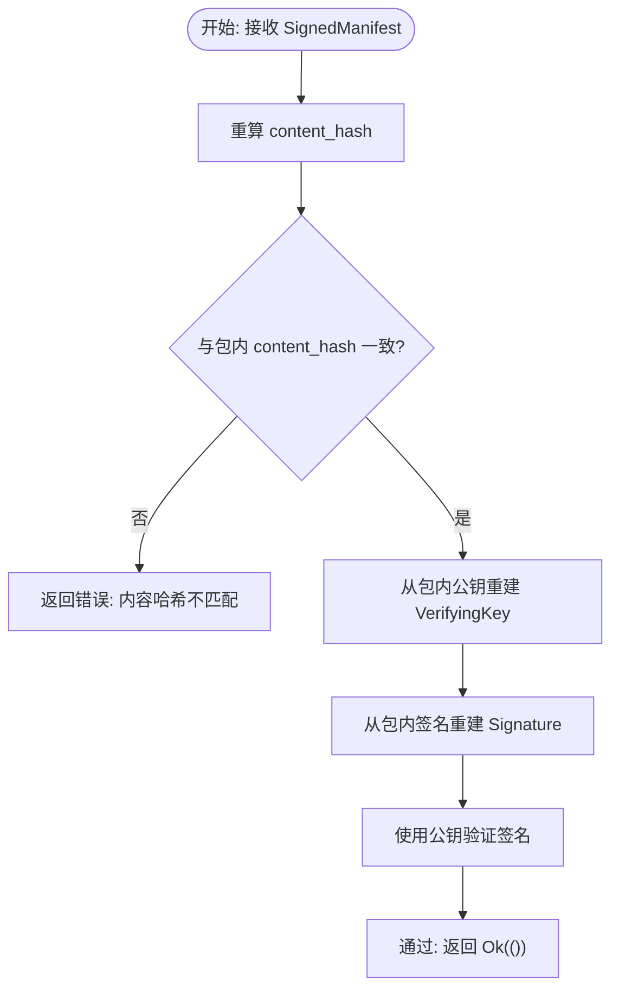
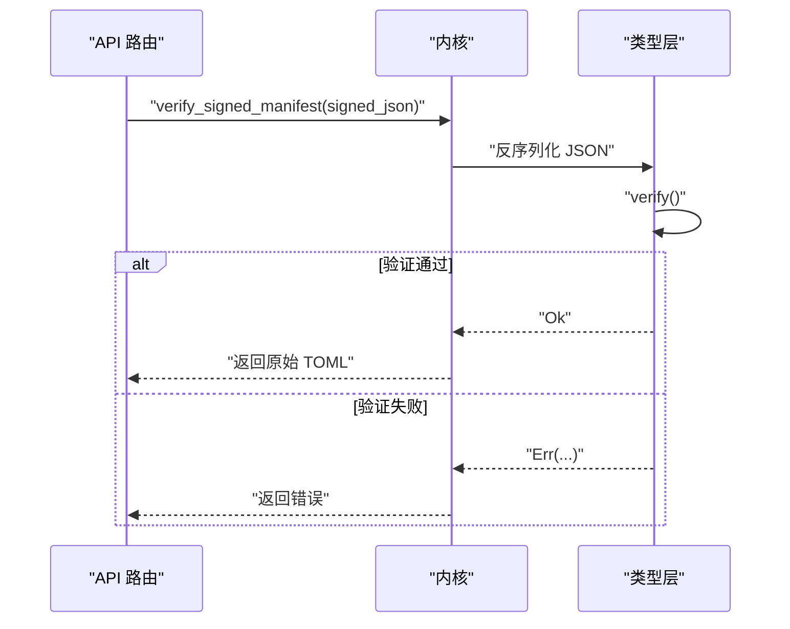
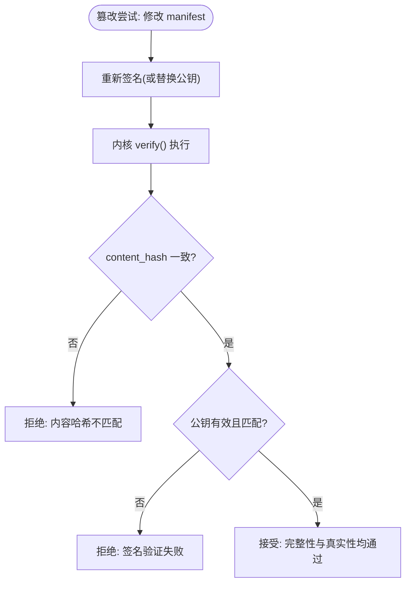
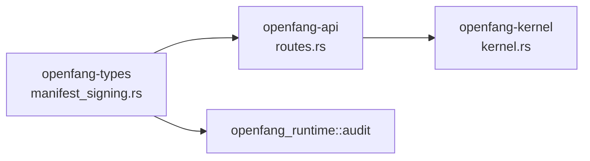

# 清单签名机制

<cite>
**本文引用的文件**
- [manifest_signing.rs](file://crates/openfang-types/src/manifest_signing.rs)
- [lib.rs](file://crates/openfang-types/src/lib.rs)
- [routes.rs](file://crates/openfang-api/src/routes.rs)
- [kernel.rs](file://crates/openfang-kernel/src/kernel.rs)
- [Cargo.toml](file://Cargo.toml)
- [SECURITY.md](file://SECURITY.md)
- [agent.rs](file://crates/openfang-types/src/agent.rs)
</cite>

## 目录
1. [简介](#简介)
2. [项目结构](#项目结构)
3. [核心组件](#核心组件)
4. [架构总览](#架构总览)
5. [详细组件分析](#详细组件分析)
6. [依赖关系分析](#依赖关系分析)
7. [性能考量](#性能考量)
8. [故障排查指南](#故障排查指南)
9. [结论](#结论)
10. [附录](#附录)

## 简介
本文件系统化阐述 OpenFang 智能体清单签名机制，基于 Ed25519 数字签名与 SHA-256 哈希，确保智能体配置的完整性与来源可追溯性，抵御供应链攻击与篡改风险。机制覆盖签名流程（哈希计算、Ed25519 签名、公钥嵌入）、签名数据结构（包含原始 TOML、内容哈希、签名、公钥、签名者标识）、两阶段验证（内容哈希校验、签名验证）、篡改检测与审计记录，并提供密钥管理与安全策略建议。

## 项目结构
OpenFang 将签名能力集中于 openfang-types 类型层，API 层负责接收与前置校验，内核层负责最终验证与加载。关键文件如下：
- openfang-types：定义 SignedManifest 结构与签名/验证逻辑
- openfang-api：接收带签名的清单，调用内核进行验证
- openfang-kernel：执行签名验证并返回原始 TOML
- openfang-types/lib.rs：模块导出入口
- 根 Cargo.toml：声明安全相关依赖（ed25519-dalek、sha2 等）
- SECURITY.md：列出安全关键依赖

**图表来源**
- [manifest_signing.rs:22-108](file://crates/openfang-types/src/manifest_signing.rs#L22-L108)
- [lib.rs:12-13](file://crates/openfang-types/src/lib.rs#L12-L13)
- [routes.rs:103-132](file://crates/openfang-api/src/routes.rs#L103-L132)
- [kernel.rs:1436-1454](file://crates/openfang-kernel/src/kernel.rs#L1436-L1454)

**章节来源**
- [manifest_signing.rs:1-167](file://crates/openfang-types/src/manifest_signing.rs#L1-L167)
- [lib.rs:1-82](file://crates/openfang-types/src/lib.rs#L1-L82)
- [routes.rs:100-168](file://crates/openfang-api/src/routes.rs#L100-L168)
- [kernel.rs:1436-1454](file://crates/openfang-kernel/src/kernel.rs#L1436-L1454)

## 核心组件
- SignedManifest：封装原始 TOML、内容哈希、Ed25519 签名、签名人公钥与标识
- hash_manifest：对原始 TOML 计算 SHA-256 并以十六进制字符串表示
- SignedManifest::sign：使用 Ed25519 私钥对内容哈希签名，生成签名包
- SignedManifest::verify：两阶段验证（内容哈希一致性、签名有效性）
- API 层路由：在创建智能体前执行签名验证
- 内核验证：反序列化 JSON，调用 verify，记录审计日志

**章节来源**
- [manifest_signing.rs:22-108](file://crates/openfang-types/src/manifest_signing.rs#L22-L108)
- [routes.rs:103-132](file://crates/openfang-api/src/routes.rs#L103-L132)
- [kernel.rs:1436-1454](file://crates/openfang-kernel/src/kernel.rs#L1436-L1454)

## 架构总览
下图展示从 API 接收带签名清单到内核完成验证并返回原始 TOML 的端到端流程。

**图表来源**
- [routes.rs:103-132](file://crates/openfang-api/src/routes.rs#L103-L132)
- [kernel.rs:1436-1454](file://crates/openfang-kernel/src/kernel.rs#L1436-L1454)
- [manifest_signing.rs:38-108](file://crates/openfang-types/src/manifest_signing.rs#L38-L108)

## 详细组件分析

### SignedManifest 数据结构与字段语义
- manifest：原始智能体清单文本（通常为 TOML）
- content_hash：manifest 的 SHA-256 十六进制哈希
- signature：Ed25519 对 content_hash 的签名（64 字节）
- signer_public_key：签名人 Ed25519 公钥（32 字节）
- signer_id：人类可读的签名人标识（如邮箱或 Key ID）

**图表来源**
- [manifest_signing.rs:22-108](file://crates/openfang-types/src/manifest_signing.rs#L22-L108)

**章节来源**
- [manifest_signing.rs:22-36](file://crates/openfang-types/src/manifest_signing.rs#L22-L36)

### 签名流程（生成）
- 步骤一：对原始 TOML 文本计算 SHA-256，得到 content_hash
- 步骤二：使用 Ed25519 私钥对 content_hash 进行签名，得到 signature
- 步骤三：提取公钥并嵌入到签名包中，形成 SignedManifest

**图表来源**
- [manifest_signing.rs:45-67](file://crates/openfang-types/src/manifest_signing.rs#L45-L67)

**章节来源**
- [manifest_signing.rs:45-67](file://crates/openfang-types/src/manifest_signing.rs#L45-L67)

### 验证流程（两阶段）
- 第一阶段：重新计算 content_hash 并与包内 content_hash 比较，不一致则拒绝
- 第二阶段：使用包内公钥重建 VerifyingKey，使用包内签名验证对 content_hash 的签名

**图表来源**
- [manifest_signing.rs:69-108](file://crates/openfang-types/src/manifest_signing.rs#L69-L108)

**章节来源**
- [manifest_signing.rs:69-108](file://crates/openfang-types/src/manifest_signing.rs#L69-L108)

### API 与内核集成
- API 层在创建智能体时检查是否提供了 SignedManifest JSON；若存在，则调用内核验证
- 内核验证通过后，返回原始 TOML 文本；同时记录审计日志
- 若验证失败，返回禁止访问状态码并记录审计事件

**图表来源**
- [routes.rs:103-132](file://crates/openfang-api/src/routes.rs#L103-L132)
- [kernel.rs:1436-1454](file://crates/openfang-kernel/src/kernel.rs#L1436-L1454)
- [manifest_signing.rs:69-108](file://crates/openfang-types/src/manifest_signing.rs#L69-L108)

**章节来源**
- [routes.rs:103-132](file://crates/openfang-api/src/routes.rs#L103-L132)
- [kernel.rs:1436-1454](file://crates/openfang-kernel/src/kernel.rs#L1436-L1454)

### 篡改检测与安全边界
- 内容篡改：修改原始 TOML 后再签名，会导致 content_hash 不匹配，验证失败
- 公钥替换：将他人公钥嵌入签名包，签名验证会失败
- API 层额外校验：确保经内核验证的 TOML 与传入的 manifest_toml 完全一致

**图表来源**
- [manifest_signing.rs:76-108](file://crates/openfang-types/src/manifest_signing.rs#L76-L108)
- [routes.rs:107-117](file://crates/openfang-api/src/routes.rs#L107-L117)

**章节来源**
- [manifest_signing.rs:110-166](file://crates/openfang-types/src/manifest_signing.rs#L110-L166)
- [routes.rs:103-132](file://crates/openfang-api/src/routes.rs#L103-L132)

## 依赖关系分析
- 类型层依赖：
  - ed25519-dalek：Ed25519 签名与验证
  - sha2：SHA-256 哈希计算
  - serde：序列化/反序列化
- API 层依赖：
  - serde_json：JSON 反序列化
  - tracing：日志与审计
- 内核层依赖：
  - openfang_types::manifest_signing：签名验证实现
  - openfang_runtime::audit：审计日志

**图表来源**
- [Cargo.toml:100-111](file://Cargo.toml#L100-L111)
- [routes.rs:103-132](file://crates/openfang-api/src/routes.rs#L103-L132)
- [kernel.rs:1436-1454](file://crates/openfang-kernel/src/kernel.rs#L1436-L1454)

**章节来源**
- [Cargo.toml:100-111](file://Cargo.toml#L100-L111)
- [SECURITY.md:82-95](file://SECURITY.md#L82-L95)

## 性能考量
- 哈希与签名开销：SHA-256 与 Ed25519 签名均为常数级 CPU 操作，对 API 创建智能体的延迟影响有限
- 序列化成本：JSON 反序列化与 TOML 解析在同一路径上，整体延迟可控
- 并发与锁：内核在消息处理路径上有并发控制，但签名验证发生在创建阶段，不会影响运行期吞吐

[本节为通用性能讨论，无需特定文件引用]

## 故障排查指南
- 内容哈希不匹配
  - 现象：验证返回“内容哈希不匹配”
  - 排查：确认传入的 manifest_toml 与 SignedManifest 中的 manifest 完全一致；检查编码与空白字符差异
  - 关联实现：[manifest_signing.rs:76-84](file://crates/openfang-types/src/manifest_signing.rs#L76-L84)
- 签名验证失败
  - 现象：验证返回“签名验证失败”
  - 排查：确认公钥与私钥配对；检查签名是否被篡改；确认 content_hash 未被二次修改
  - 关联实现：[manifest_signing.rs:104-107](file://crates/openfang-types/src/manifest_signing.rs#L104-L107)
- JSON 格式错误
  - 现象：API 层提示“无效的签名清单 JSON”
  - 排查：检查 JSON 结构是否符合 SignedManifest；字段是否齐全
  - 关联实现：[kernel.rs:1441-1446](file://crates/openfang-kernel/src/kernel.rs#L1441-L1446)
- 审计与日志
  - 现象：验证失败被记录为审计事件
  - 排查：查看内核审计日志，定位失败原因与时间点
  - 关联实现：[routes.rs:118-131](file://crates/openfang-api/src/routes.rs#L118-L131)

**章节来源**
- [manifest_signing.rs:76-108](file://crates/openfang-types/src/manifest_signing.rs#L76-L108)
- [kernel.rs:1441-1451](file://crates/openfang-kernel/src/kernel.rs#L1441-L1451)
- [routes.rs:118-131](file://crates/openfang-api/src/routes.rs#L118-L131)

## 结论
OpenFang 的清单签名机制以 Ed25519 + SHA-256 为基础，通过两阶段验证确保智能体配置的完整性与来源可信。API 层与内核层协同，在创建阶段完成严格校验，并记录审计事件，有效抵御供应链攻击与篡改风险。配合密钥管理与安全策略，可进一步提升系统的整体安全性。

[本节为总结性内容，无需特定文件引用]

## 附录

### 签名与验证流程参考路径
- 签名生成：[manifest_signing.rs:45-67](file://crates/openfang-types/src/manifest_signing.rs#L45-L67)
- 验证实现：[manifest_signing.rs:69-108](file://crates/openfang-types/src/manifest_signing.rs#L69-L108)
- API 集成：[routes.rs:103-132](file://crates/openfang-api/src/routes.rs#L103-L132)
- 内核验证：[kernel.rs:1436-1454](file://crates/openfang-kernel/src/kernel.rs#L1436-L1454)

### 密钥管理与安全策略建议
- 密钥生成
  - 使用安全随机源生成 Ed25519 密钥对
  - 私钥妥善保管，避免明文存储
  - 公钥用于分发与验证
- 分发与版本
  - 将公钥与签名人标识（signer_id）公开分发，便于验证
  - 采用版本化策略，支持密钥轮换
- 审计与监控
  - 记录所有签名验证事件，异常及时告警
  - 定期审计签名清单来源与变更历史
- 供应链安全
  - 仅信任来自受信渠道的签名清单
  - 对第三方清单实施额外审查与最小权限原则

[本节为通用安全建议，无需特定文件引用]