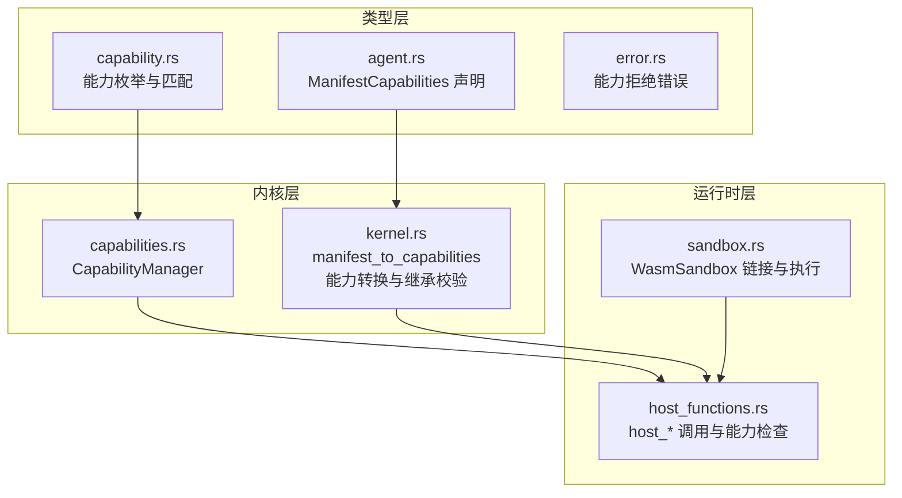
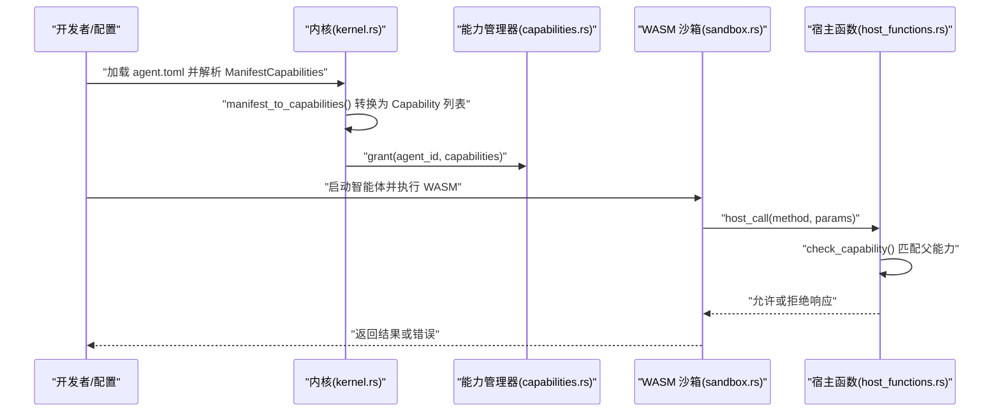
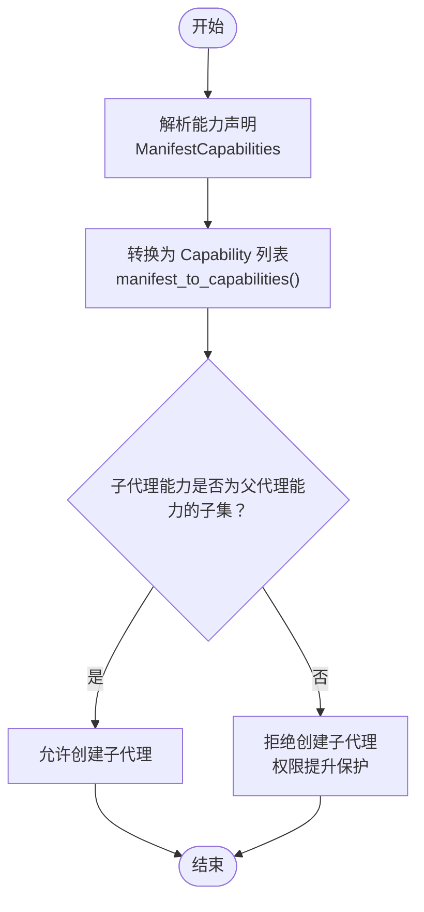
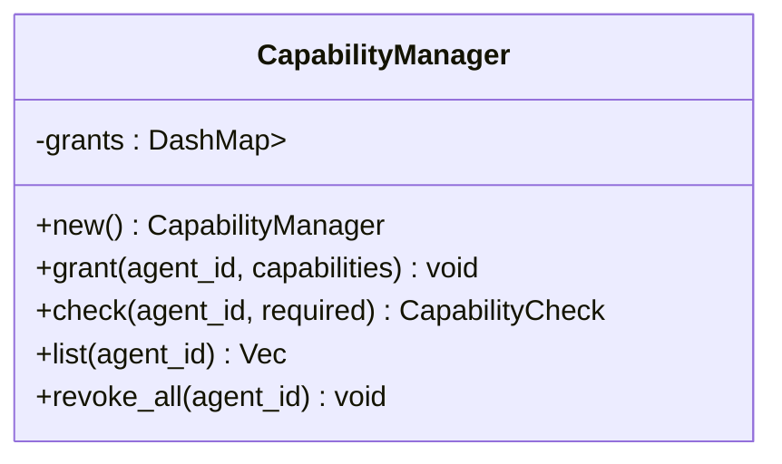
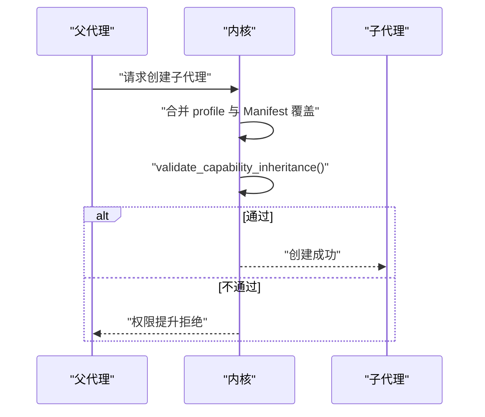
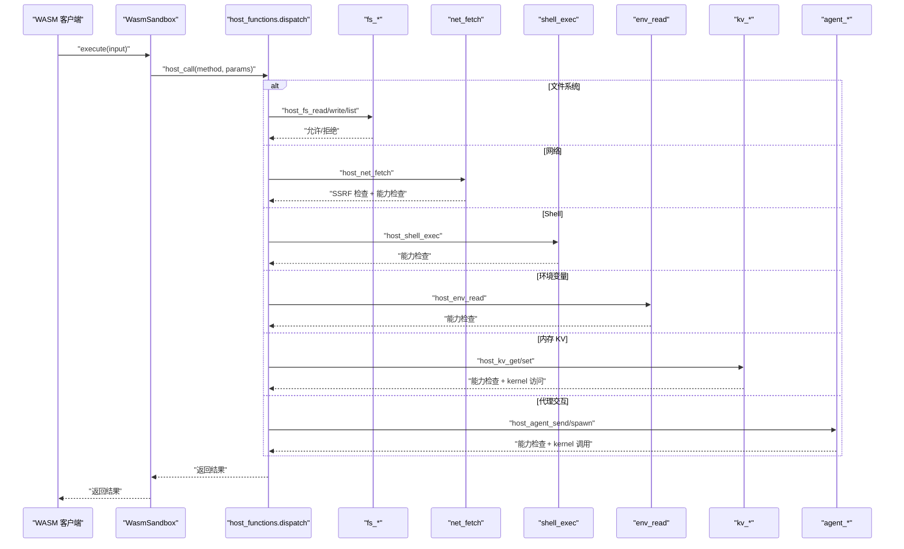
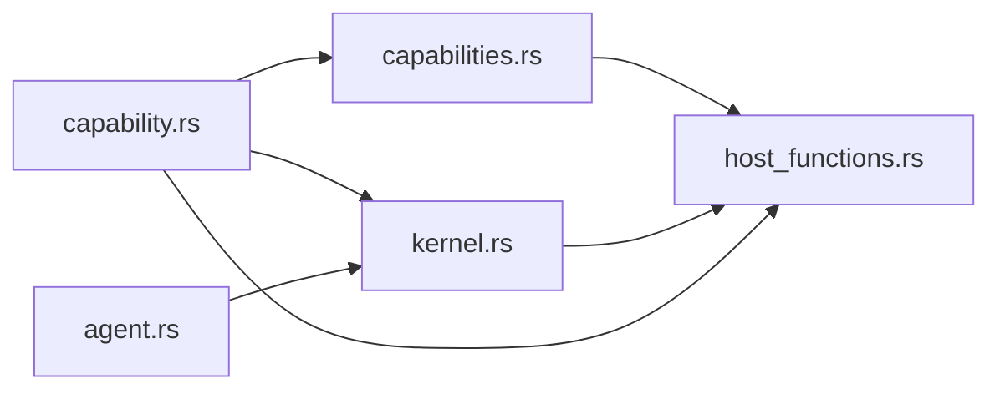

# 能力基础安全

<cite>
**本文引用的文件**
- [crates/openfang-types/src/capability.rs](file://crates/openfang-types/src/capability.rs)
- [crates/openfang-kernel/src/capabilities.rs](file://crates/openfang-kernel/src/capabilities.rs)
- [crates/openfang-kernel/src/kernel.rs](file://crates/openfang-kernel/src/kernel.rs)
- [crates/openfang-runtime/src/host_functions.rs](file://crates/openfang-runtime/src/host_functions.rs)
- [crates/openfang-runtime/src/sandbox.rs](file://crates/openfang-runtime/src/sandbox.rs)
- [crates/openfang-types/src/agent.rs](file://crates/openfang-types/src/agent.rs)
- [crates/openfang-types/src/error.rs](file://crates/openfang-types/src/error.rs)
- [agents/analyst/agent.toml](file://agents/analyst/agent.toml)
- [docs/security.md](file://docs/security.md)
</cite>

## 目录
1. [简介](#简介)
2. [项目结构](#项目结构)
3. [核心组件](#核心组件)
4. [架构总览](#架构总览)
5. [详细组件分析](#详细组件分析)
6. [依赖关系分析](#依赖关系分析)
7. [性能考量](#性能考量)
8. [故障排查指南](#故障排查指南)
9. [结论](#结论)
10. [附录](#附录)

## 简介
本文件系统性阐述 OpenFang 的“能力基础安全”机制，围绕以下目标展开：
- 能力枚举系统：覆盖文件系统、网络、工具、LLM、代理交互、内存、Shell、OFP 协议、经济等能力类型的设计与实现。
- 能力匹配算法：基于 glob 模式匹配的策略与边界条件。
- 继承机制：父代理对子代理能力的子集约束，防止权限提升。
- 强制执行点：在 WASM 沙箱中通过 host 函数进行能力检查与防护。
- 具体示例：能力声明、验证与拒绝流程的代码路径指引。
- 安全目标：防止权限提升与越权访问，并说明能力系统在智能体生命周期中的应用。

## 项目结构
OpenFang 将能力安全贯穿于类型定义、内核管理、运行时沙箱与宿主函数三个层面：
- 类型层：定义能力枚举、匹配规则与继承校验。
- 内核层：集中管理能力授予、查询与列表。
- 运行时层：在 WASM 沙箱中以 host 函数形式执行能力检查与安全控制。

图表来源
- [crates/openfang-types/src/capability.rs:10-187](file://crates/openfang-types/src/capability.rs#L10-L187)
- [crates/openfang-types/src/agent.rs:532-561](file://crates/openfang-types/src/agent.rs#L532-L561)
- [crates/openfang-kernel/src/capabilities.rs:8-62](file://crates/openfang-kernel/src/capabilities.rs#L8-L62)
- [crates/openfang-kernel/src/kernel.rs:5430-5503](file://crates/openfang-kernel/src/kernel.rs#L5430-L5503)
- [crates/openfang-runtime/src/sandbox.rs:186-247](file://crates/openfang-runtime/src/sandbox.rs#L186-L247)
- [crates/openfang-runtime/src/host_functions.rs:16-67](file://crates/openfang-runtime/src/host_functions.rs#L16-L67)

章节来源
- [crates/openfang-types/src/capability.rs:1-317](file://crates/openfang-types/src/capability.rs#L1-L317)
- [crates/openfang-kernel/src/capabilities.rs:1-96](file://crates/openfang-kernel/src/capabilities.rs#L1-L96)
- [crates/openfang-kernel/src/kernel.rs:5430-5503](file://crates/openfang-kernel/src/kernel.rs#L5430-L5503)
- [crates/openfang-runtime/src/host_functions.rs:1-669](file://crates/openfang-runtime/src/host_functions.rs#L1-L669)
- [crates/openfang-runtime/src/sandbox.rs:186-247](file://crates/openfang-runtime/src/sandbox.rs#L186-L247)
- [crates/openfang-types/src/agent.rs:532-561](file://crates/openfang-types/src/agent.rs#L532-L561)

## 核心组件
- 能力枚举与匹配
  - 定义了文件系统、网络、工具、LLM、代理交互、内存、Shell、OFP、经济等能力类型，并提供统一的匹配逻辑与继承校验。
  - 支持通配符与中间通配的 glob 匹配，以及数值型能力的上下界比较。
- 能力管理器
  - 以 AgentId 为键维护每个智能体的能力集合，提供查询、列出与撤销能力。
- 内核能力转换与继承
  - 将 Manifest 中的人类可读能力声明转换为内部 Capability 枚举，并在子智能体创建时执行继承校验，确保子能力是父能力的子集。
- 运行时沙箱与宿主函数
  - 在 WASM 沙箱中注册 host 函数，所有对外操作均需通过能力检查；同时实施路径遍历、SSRF 等纵深防御。

章节来源
- [crates/openfang-types/src/capability.rs:10-187](file://crates/openfang-types/src/capability.rs#L10-L187)
- [crates/openfang-kernel/src/capabilities.rs:22-61](file://crates/openfang-kernel/src/capabilities.rs#L22-L61)
- [crates/openfang-kernel/src/kernel.rs:5430-5503](file://crates/openfang-kernel/src/kernel.rs#L5430-L5503)
- [crates/openfang-runtime/src/host_functions.rs:16-67](file://crates/openfang-runtime/src/host_functions.rs#L16-L67)

## 架构总览
下图展示了从“能力声明”到“运行时执行”的端到端流程，强调能力匹配与继承校验在不同阶段的作用点。

图表来源
- [crates/openfang-kernel/src/kernel.rs:5430-5503](file://crates/openfang-kernel/src/kernel.rs#L5430-L5503)
- [crates/openfang-kernel/src/capabilities.rs:22-48](file://crates/openfang-kernel/src/capabilities.rs#L22-L48)
- [crates/openfang-runtime/src/sandbox.rs:186-247](file://crates/openfang-runtime/src/sandbox.rs#L186-L247)
- [crates/openfang-runtime/src/host_functions.rs:16-67](file://crates/openfang-runtime/src/host_functions.rs#L16-L67)

## 详细组件分析

### 能力枚举与匹配算法
- 能力类型
  - 文件系统：文件读取/写入，支持 glob 模式。
  - 网络：连接主机（含端口），监听端口（数值上限）。
  - 工具：调用特定工具或任意工具（危险，需显式授予）。
  - LLM：模型查询与最大令牌预算。
  - 代理交互：发送消息、创建子代理、终止代理。
  - 内存：KV 读写（按作用域匹配）。
  - Shell：执行命令（支持 glob 模式）。
  - OFP：发现、连接远程节点、服务发布。
  - 经济：消费额度、收款、转账（按目标匹配）。
- 匹配规则
  - 通配符：* 匹配任意；前缀/后缀匹配；中间带 * 的模式匹配。
  - 数值型能力：上限/预算需满足要求。
  - 特殊布尔能力：如 AgentSpawn、OfpDiscover、OfpAdvertise、EconEarn 等直接匹配。
- 继承校验
  - 子能力必须被父能力集合中的某一项所覆盖，否则拒绝创建子代理，防止权限提升。

图表来源
- [crates/openfang-kernel/src/kernel.rs:5430-5503](file://crates/openfang-kernel/src/kernel.rs#L5430-L5503)
- [crates/openfang-types/src/capability.rs:168-187](file://crates/openfang-types/src/capability.rs#L168-L187)

章节来源
- [crates/openfang-types/src/capability.rs:10-187](file://crates/openfang-types/src/capability.rs#L10-L187)
- [crates/openfang-types/src/capability.rs:189-212](file://crates/openfang-types/src/capability.rs#L189-L212)
- [crates/openfang-types/src/capability.rs:168-187](file://crates/openfang-types/src/capability.rs#L168-L187)

### 能力管理器（内核）
- 授权与查询
  - 通过 grant(agent_id, capabilities) 注册能力。
  - 通过 check(agent_id, required) 返回 Granted/Denied。
  - 提供 list 与 revoke_all 辅助运维。
- 设计要点
  - 使用并发映射存储，保证多线程下的能力查询性能。
  - 查询时逐项匹配，命中即放行。

图表来源
- [crates/openfang-kernel/src/capabilities.rs:8-62](file://crates/openfang-kernel/src/capabilities.rs#L8-L62)

章节来源
- [crates/openfang-kernel/src/capabilities.rs:14-61](file://crates/openfang-kernel/src/capabilities.rs#L14-L61)

### 内核：能力转换与继承
- 能力转换
  - 将 ManifestCapabilities 中的 network、tools、memory_*、agent_*、shell、ofp_* 等字段转换为对应的 Capability 枚举。
  - 若存在 profile 且未显式声明 tools，则使用 profile 的隐含能力并保留 Manifest 的覆盖项。
- 继承校验
  - 在创建子代理时，对子代理能力逐一检查是否能被父代理能力匹配，任一不满足则拒绝。

图表来源
- [crates/openfang-kernel/src/kernel.rs:5430-5503](file://crates/openfang-kernel/src/kernel.rs#L5430-L5503)
- [crates/openfang-types/src/capability.rs:168-187](file://crates/openfang-types/src/capability.rs#L168-L187)

章节来源
- [crates/openfang-kernel/src/kernel.rs:5430-5503](file://crates/openfang-kernel/src/kernel.rs#L5430-L5503)
- [crates/openfang-types/src/capability.rs:168-187](file://crates/openfang-types/src/capability.rs#L168-L187)

### 运行时：WASM 沙箱与宿主函数
- 执行入口
  - 创建 Linker 并注册 host 函数，实例化模块后通过导出的内存与函数进行输入输出。
- 能力检查
  - 每个 host_* 方法在执行前调用 check_capability，若无匹配能力则返回错误。
- 安全加固
  - 文件系统：路径解析严格拒绝 “..” 遍历，写入前解析父目录并二次校验。
  - 网络：仅允许 http/https，解析主机名后对解析出的 IP 进行私网/环回地址拦截（SSRF）。
  - Shell：不使用 shell，直接以参数传递避免注入。
  - 内存 KV：通过 kernel 句柄访问，受能力范围限制。
  - 代理交互：消息发送与子代理创建均受能力约束。

图表来源
- [crates/openfang-runtime/src/sandbox.rs:186-247](file://crates/openfang-runtime/src/sandbox.rs#L186-L247)
- [crates/openfang-runtime/src/host_functions.rs:16-67](file://crates/openfang-runtime/src/host_functions.rs#L16-L67)
- [crates/openfang-runtime/src/host_functions.rs:55-67](file://crates/openfang-runtime/src/host_functions.rs#L55-L67)
- [crates/openfang-runtime/src/host_functions.rs:73-117](file://crates/openfang-runtime/src/host_functions.rs#L73-L117)
- [crates/openfang-runtime/src/host_functions.rs:123-176](file://crates/openfang-runtime/src/host_functions.rs#L123-L176)
- [crates/openfang-runtime/src/host_functions.rs:194-239](file://crates/openfang-runtime/src/host_functions.rs#L194-L239)
- [crates/openfang-runtime/src/host_functions.rs:271-328](file://crates/openfang-runtime/src/host_functions.rs#L271-L328)
- [crates/openfang-runtime/src/host_functions.rs:334-368](file://crates/openfang-runtime/src/host_functions.rs#L334-L368)
- [crates/openfang-runtime/src/host_functions.rs:374-386](file://crates/openfang-runtime/src/host_functions.rs#L374-L386)
- [crates/openfang-runtime/src/host_functions.rs:392-437](file://crates/openfang-runtime/src/host_functions.rs#L392-L437)
- [crates/openfang-runtime/src/host_functions.rs:443-492](file://crates/openfang-runtime/src/host_functions.rs#L443-L492)

章节来源
- [crates/openfang-runtime/src/sandbox.rs:186-247](file://crates/openfang-runtime/src/sandbox.rs#L186-L247)
- [crates/openfang-runtime/src/host_functions.rs:16-67](file://crates/openfang-runtime/src/host_functions.rs#L16-L67)
- [crates/openfang-runtime/src/host_functions.rs:73-117](file://crates/openfang-runtime/src/host_functions.rs#L73-L117)
- [crates/openfang-runtime/src/host_functions.rs:123-176](file://crates/openfang-runtime/src/host_functions.rs#L123-L176)

### 能力声明、验证与拒绝示例（代码路径指引）
- 能力声明（示例）
  - 在 agent.toml 的 [capabilities] 中声明网络、工具、内存、Shell 等能力。
  - 示例路径：[agents/analyst/agent.toml:44-50](file://agents/analyst/agent.toml#L44-L50)
- 能力转换
  - 内核将 ManifestCapabilities 转换为 Capability 列表。
  - 示例路径：[crates/openfang-kernel/src/kernel.rs:5430-5503](file://crates/openfang-kernel/src/kernel.rs#L5430-L5503)
- 能力匹配与继承
  - 匹配算法与继承校验。
  - 示例路径：[crates/openfang-types/src/capability.rs:100-187](file://crates/openfang-types/src/capability.rs#L100-L187)
- 运行时拒绝
  - 无能力时返回错误，例如文件系统读取、Shell 执行、环境变量读取等。
  - 示例路径：[crates/openfang-runtime/src/host_functions.rs:194-212](file://crates/openfang-runtime/src/host_functions.rs#L194-L212)
  - 示例路径：[crates/openfang-runtime/src/host_functions.rs:334-368](file://crates/openfang-runtime/src/host_functions.rs#L334-L368)
  - 示例路径：[crates/openfang-runtime/src/host_functions.rs:374-386](file://crates/openfang-runtime/src/host_functions.rs#L374-L386)
- 错误封装
  - CapabilityCheck.require() 将 Denied 转换为 OpenFangError。
  - 示例路径：[crates/openfang-types/src/capability.rs:83-98](file://crates/openfang-types/src/capability.rs#L83-L98)
  - 示例路径：[crates/openfang-types/src/error.rs](file://crates/openfang-types/src/error.rs)

章节来源
- [agents/analyst/agent.toml:44-50](file://agents/analyst/agent.toml#L44-L50)
- [crates/openfang-kernel/src/kernel.rs:5430-5503](file://crates/openfang-kernel/src/kernel.rs#L5430-L5503)
- [crates/openfang-types/src/capability.rs:83-98](file://crates/openfang-types/src/capability.rs#L83-L98)
- [crates/openfang-runtime/src/host_functions.rs:194-212](file://crates/openfang-runtime/src/host_functions.rs#L194-L212)
- [crates/openfang-runtime/src/host_functions.rs:334-368](file://crates/openfang-runtime/src/host_functions.rs#L334-L368)
- [crates/openfang-runtime/src/host_functions.rs:374-386](file://crates/openfang-runtime/src/host_functions.rs#L374-L386)
- [crates/openfang-types/src/error.rs](file://crates/openfang-types/src/error.rs)

## 依赖关系分析
- 类型层依赖
  - capability.rs 为所有能力匹配与继承提供统一语义。
  - agent.rs 的 ManifestCapabilities 是能力声明的入口。
- 内核依赖
  - kernel.rs 依赖 capability.rs 的匹配与继承逻辑，负责将声明转换为内部能力并执行校验。
  - capabilities.rs 依赖 capability.rs 的匹配与继承逻辑，提供查询与授权。
- 运行时依赖
  - host_functions.rs 依赖 capability.rs 的匹配逻辑，作为 WASM 沙箱内的强制执行点。
  - sandbox.rs 作为宿主函数的承载者，负责链接与执行。

图表来源
- [crates/openfang-types/src/capability.rs:10-187](file://crates/openfang-types/src/capability.rs#L10-L187)
- [crates/openfang-types/src/agent.rs:532-561](file://crates/openfang-types/src/agent.rs#L532-L561)
- [crates/openfang-kernel/src/kernel.rs:5430-5503](file://crates/openfang-kernel/src/kernel.rs#L5430-L5503)
- [crates/openfang-kernel/src/capabilities.rs:8-62](file://crates/openfang-kernel/src/capabilities.rs#L8-L62)
- [crates/openfang-runtime/src/host_functions.rs:16-67](file://crates/openfang-runtime/src/host_functions.rs#L16-L67)

章节来源
- [crates/openfang-types/src/capability.rs:10-187](file://crates/openfang-types/src/capability.rs#L10-L187)
- [crates/openfang-types/src/agent.rs:532-561](file://crates/openfang-types/src/agent.rs#L532-L561)
- [crates/openfang-kernel/src/kernel.rs:5430-5503](file://crates/openfang-kernel/src/kernel.rs#L5430-L5503)
- [crates/openfang-kernel/src/capabilities.rs:8-62](file://crates/openfang-kernel/src/capabilities.rs#L8-L62)
- [crates/openfang-runtime/src/host_functions.rs:16-67](file://crates/openfang-runtime/src/host_functions.rs#L16-L67)

## 性能考量
- 能力查询复杂度
  - 查询时对已授予能力列表进行线性扫描，单次查询为 O(n)。由于典型能力数量有限，通常不影响性能。
- 并发与缓存
  - 能力管理器使用并发映射，适合高并发场景下的查询。
- 沙箱执行
  - 能力检查发生在每次 host 调用前，开销极小；路径解析与网络解析为必要安全成本。

## 故障排查指南
- 常见问题与定位
  - 无能力错误：确认 agent.toml 中的 [capabilities] 是否包含所需项；检查 profile 是否覆盖了工具列表。
    - 参考路径：[agents/analyst/agent.toml:44-50](file://agents/analyst/agent.toml#L44-L50)
  - 权限提升拒绝：子代理能力超出父代理能力范围，需调整父代理能力或移除危险授权。
    - 参考路径：[crates/openfang-types/src/capability.rs:168-187](file://crates/openfang-types/src/capability.rs#L168-L187)
  - 路径遍历拒绝：路径包含 “..”，请使用相对路径或受信任的目录。
    - 参考路径：[crates/openfang-runtime/src/host_functions.rs:73-117](file://crates/openfang-runtime/src/host_functions.rs#L73-L117)
  - SSRF 拒绝：目标主机解析到私网/环回地址，或协议不受支持。
    - 参考路径：[crates/openfang-runtime/src/host_functions.rs:123-176](file://crates/openfang-runtime/src/host_functions.rs#L123-L176)
  - Shell 执行失败：命令不存在或参数缺失。
    - 参考路径：[crates/openfang-runtime/src/host_functions.rs:334-368](file://crates/openfang-runtime/src/host_functions.rs#L334-L368)
  - 环境变量读取为空：变量不存在或未授予 EnvRead 能力。
    - 参考路径：[crates/openfang-runtime/src/host_functions.rs:374-386](file://crates/openfang-runtime/src/host_functions.rs#L374-L386)
- 安全相关文档参考
  - [docs/security.md](file://docs/security.md)

章节来源
- [agents/analyst/agent.toml:44-50](file://agents/analyst/agent.toml#L44-L50)
- [crates/openfang-types/src/capability.rs:168-187](file://crates/openfang-types/src/capability.rs#L168-L187)
- [crates/openfang-runtime/src/host_functions.rs:73-117](file://crates/openfang-runtime/src/host_functions.rs#L73-L117)
- [crates/openfang-runtime/src/host_functions.rs:123-176](file://crates/openfang-runtime/src/host_functions.rs#L123-L176)
- [crates/openfang-runtime/src/host_functions.rs:334-368](file://crates/openfang-runtime/src/host_functions.rs#L334-L368)
- [crates/openfang-runtime/src/host_functions.rs:374-386](file://crates/openfang-runtime/src/host_functions.rs#L374-L386)
- [docs/security.md](file://docs/security.md)

## 结论
OpenFang 的能力基础安全以“最小授权”为核心原则：能力在创建时声明并在生命周期内不可变更；运行时通过 WASM 沙箱中的 host 函数进行强制执行；内核在创建子代理时执行继承校验，防止权限提升。该设计在保障灵活性的同时，提供了清晰、可审计、可扩展的安全边界。

## 附录
- 相关安全文档
  - [docs/security.md](file://docs/security.md)