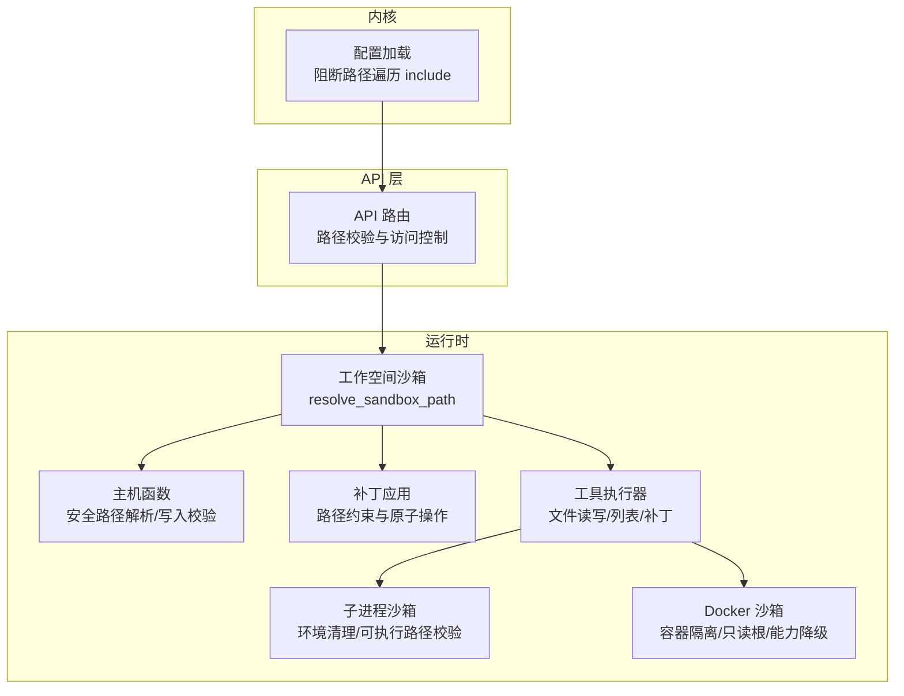
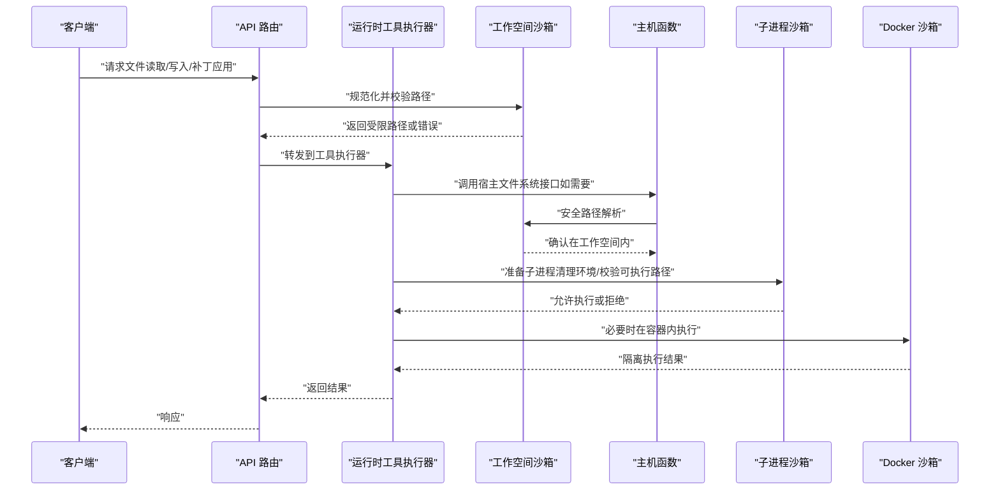
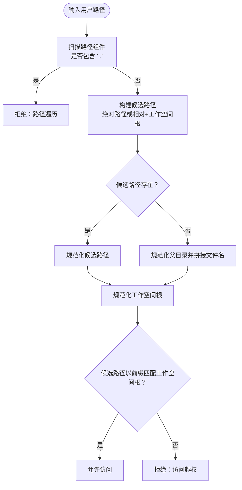
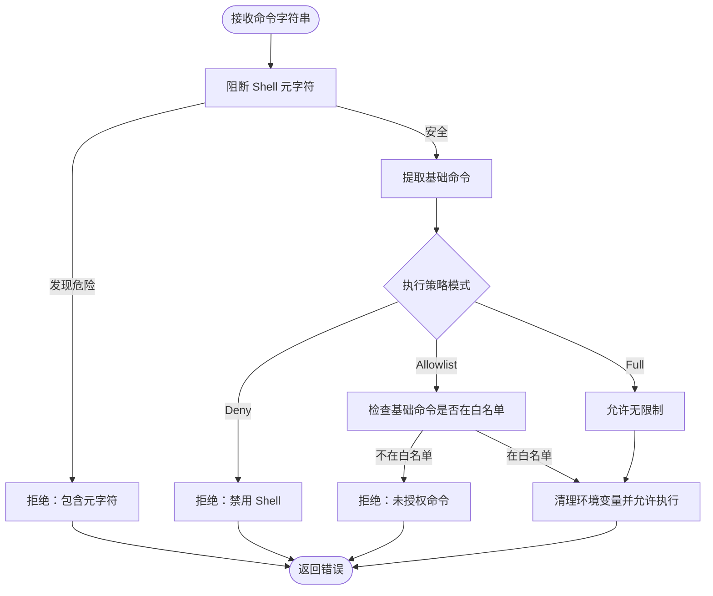
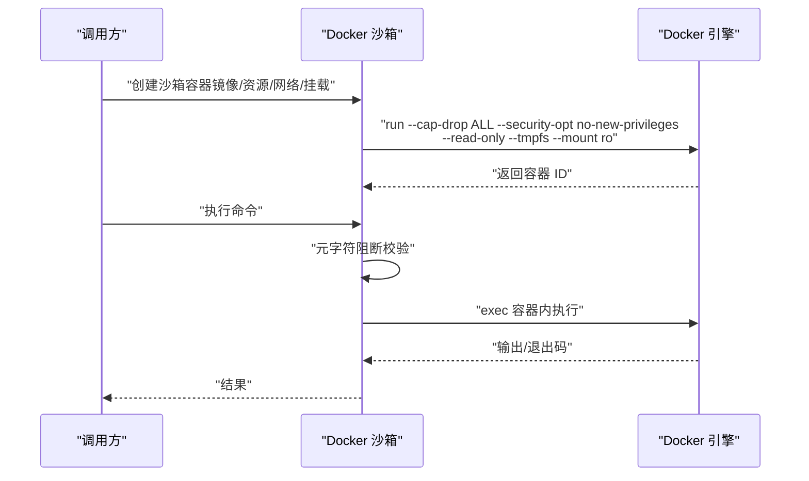
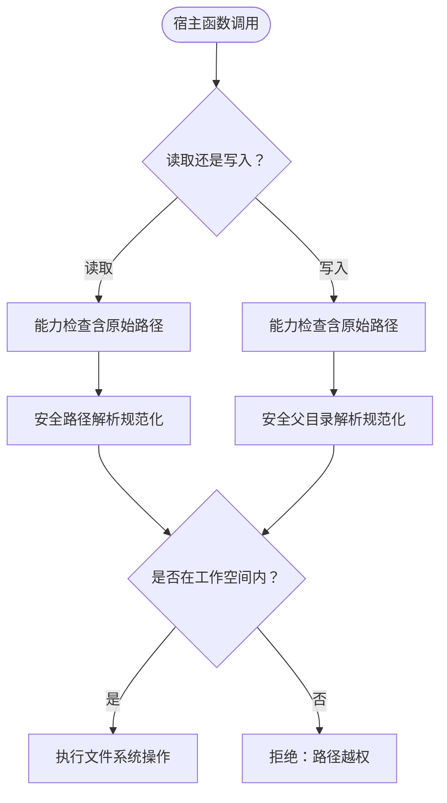
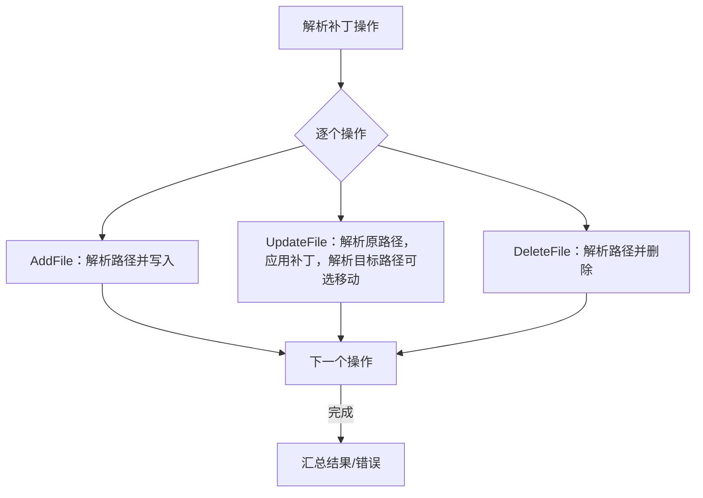
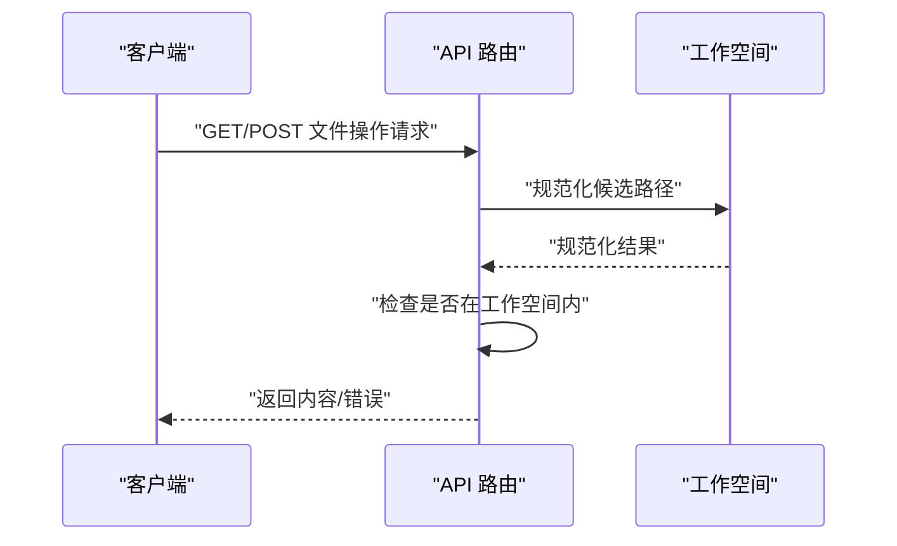
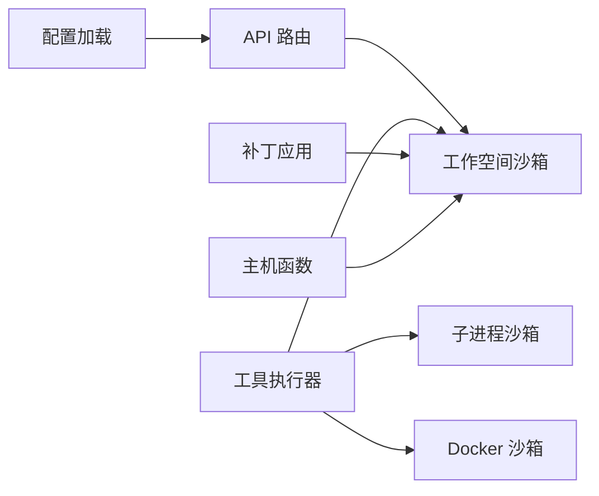

# 路径防护机制

<cite>
**本文档引用的文件**
- [workspace_sandbox.rs](file://crates/openfang-runtime/src/workspace_sandbox.rs)
- [subprocess_sandbox.rs](file://crates/openfang-runtime/src/subprocess_sandbox.rs)
- [docker_sandbox.rs](file://crates/openfang-runtime/src/docker_sandbox.rs)
- [host_functions.rs](file://crates/openfang-runtime/src/host_functions.rs)
- [apply_patch.rs](file://crates/openfang-runtime/src/apply_patch.rs)
- [tool_runner.rs](file://crates/openfang-runtime/src/tool_runner.rs)
- [routes.rs](file://crates/openfang-api/src/routes.rs)
- [config.rs](file://crates/openfang-kernel/src/config.rs)
</cite>

## 目录
1. [简介](#简介)
2. [项目结构](#项目结构)
3. [核心组件](#核心组件)
4. [架构总览](#架构总览)
5. [详细组件分析](#详细组件分析)
6. [依赖关系分析](#依赖关系分析)
7. [性能考虑](#性能考虑)
8. [故障排除指南](#故障排除指南)
9. [结论](#结论)

## 简介
本文件系统性阐述 OpenFang 的路径防护机制，覆盖目录遍历攻击的多层防御策略：路径规范化与校验、相对路径解析、符号链接检测、工作空间隔离；以及在子进程沙箱中的路径限制、工作目录设置与文件系统访问控制。文档还记录了路径验证算法、安全路径检查流程与异常处理机制，并给出在文件上传、下载与工作空间管理中的具体应用示例，最后解释路径防护与容器化、权限分离、最小权限原则的关系。

## 项目结构
OpenFang 将路径防护贯穿于运行时（runtime）、API 层与内核配置加载等模块：
- 运行时（openfang-runtime）：提供工作空间沙箱、子进程沙箱、Docker 沙箱、主机函数（Host Functions）等核心路径防护能力。
- API 层（openfang-api）：对用户请求进行路径校验，防止越权访问。
- 内核（openfang-kernel）：在配置加载阶段阻断包含路径遍历的 include 列表，避免配置注入。

**图表来源**
- [routes.rs:9004-9141](file://crates/openfang-api/src/routes.rs#L9004-L9141)
- [workspace_sandbox.rs:15-69](file://crates/openfang-runtime/src/workspace_sandbox.rs#L15-L69)
- [subprocess_sandbox.rs:40-82](file://crates/openfang-runtime/src/subprocess_sandbox.rs#L40-L82)
- [docker_sandbox.rs:94-173](file://crates/openfang-runtime/src/docker_sandbox.rs#L94-L173)
- [host_functions.rs:75-117](file://crates/openfang-runtime/src/host_functions.rs#L75-L117)
- [apply_patch.rs:274-380](file://crates/openfang-runtime/src/apply_patch.rs#L274-L380)
- [tool_runner.rs:1287-1336](file://crates/openfang-runtime/src/tool_runner.rs#L1287-L1336)
- [config.rs:395-407](file://crates/openfang-kernel/src/config.rs#L395-L407)

**章节来源**
- [workspace_sandbox.rs:1-149](file://crates/openfang-runtime/src/workspace_sandbox.rs#L1-L149)
- [subprocess_sandbox.rs:1-241](file://crates/openfang-runtime/src/subprocess_sandbox.rs#L1-L241)
- [docker_sandbox.rs:1-200](file://crates/openfang-runtime/src/docker_sandbox.rs#L1-L200)
- [host_functions.rs:69-117](file://crates/openfang-runtime/src/host_functions.rs#L69-L117)
- [apply_patch.rs:274-380](file://crates/openfang-runtime/src/apply_patch.rs#L274-L380)
- [tool_runner.rs:1287-1336](file://crates/openfang-runtime/src/tool_runner.rs#L1287-L1336)
- [routes.rs:9004-9141](file://crates/openfang-api/src/routes.rs#L9004-L9141)
- [config.rs:395-407](file://crates/openfang-kernel/src/config.rs#L395-L407)

## 核心组件
- 工作空间沙箱：统一的路径解析与约束，拒绝父目录组件、校验绝对路径、新文件场景下对父目录进行规范化解析，最终确保结果位于工作空间根之下。
- 子进程沙箱：清理继承环境变量、仅允许白名单变量、校验可执行路径不含父目录组件、阻断危险 Shell 元字符以防止命令注入。
- Docker 沙箱：容器级隔离，资源限制、能力降级、网络隔离、只读根文件系统、工作目录设置、绑定挂载的安全校验（绝对路径、父目录组件、黑名单路径、符号链接逃逸）。
- 主机函数：在 WASM 客户端调用宿主文件系统接口前进行路径校验，拒绝遍历组件并尽可能解析符号链接。
- 补丁应用：对补丁操作中的所有路径通过工作空间沙箱解析，保证变更范围可控。
- API 路由：对文件读取/写入等操作进行路径规范化与工作空间边界检查。
- 配置加载：在 include 列表中阻断路径遍历，避免配置注入。

**章节来源**
- [workspace_sandbox.rs:15-69](file://crates/openfang-runtime/src/workspace_sandbox.rs#L15-L69)
- [subprocess_sandbox.rs:40-82](file://crates/openfang-runtime/src/subprocess_sandbox.rs#L40-L82)
- [docker_sandbox.rs:94-173](file://crates/openfang-runtime/src/docker_sandbox.rs#L94-L173)
- [host_functions.rs:75-117](file://crates/openfang-runtime/src/host_functions.rs#L75-L117)
- [apply_patch.rs:274-380](file://crates/openfang-runtime/src/apply_patch.rs#L274-L380)
- [routes.rs:9004-9141](file://crates/openfang-api/src/routes.rs#L9004-L9141)
- [config.rs:395-407](file://crates/openfang-kernel/src/config.rs#L395-L407)

## 架构总览
下图展示了从 API 请求到运行时工具执行再到沙箱隔离的完整路径防护链路：

**图表来源**
- [routes.rs:9004-9141](file://crates/openfang-api/src/routes.rs#L9004-L9141)
- [tool_runner.rs:1287-1336](file://crates/openfang-runtime/src/tool_runner.rs#L1287-L1336)
- [workspace_sandbox.rs:15-69](file://crates/openfang-runtime/src/workspace_sandbox.rs#L15-L69)
- [host_functions.rs:75-117](file://crates/openfang-runtime/src/host_functions.rs#L75-L117)
- [subprocess_sandbox.rs:40-82](file://crates/openfang-runtime/src/subprocess_sandbox.rs#L40-L82)
- [docker_sandbox.rs:94-173](file://crates/openfang-runtime/src/docker_sandbox.rs#L94-L173)

## 详细组件分析

### 工作空间沙箱（路径规范化与隔离）
- 设计目标：将代理的文件操作限制在其工作空间目录内，阻止目录遍历、符号链接逃逸与越权访问。
- 关键策略：
  - 拒绝任何包含父目录组件的路径。
  - 绝对路径：规范化后与工作空间根规范化路径比较，必须以前缀匹配。
  - 相对路径：与工作空间根拼接后规范化，确保落在工作空间内。
  - 新文件：对父目录规范化后再拼接文件名，避免跨目录写入。
- 异常处理：无法解析工作空间根、无法解析候选路径、规范化后越界均返回明确错误信息。

**图表来源**
- [workspace_sandbox.rs:15-69](file://crates/openfang-runtime/src/workspace_sandbox.rs#L15-L69)

**章节来源**
- [workspace_sandbox.rs:15-69](file://crates/openfang-runtime/src/workspace_sandbox.rs#L15-L69)
- [workspace_sandbox.rs:71-148](file://crates/openfang-runtime/src/workspace_sandbox.rs#L71-L148)

### 子进程沙箱（环境与可执行路径）
- 环境变量清理：默认仅保留安全变量（如 PATH、HOME、LANG 等），Windows 平台额外允许特定变量。
- 可执行路径校验：拒绝包含父目录组件的可执行路径，防止通过路径逃逸。
- Shell 元字符阻断：在 Allowlist 模式下，先于命令提取阶段阻断反引号、$()、${}、管道、重定向、逻辑与/或、换行、空字节等危险元字符。
- 命令允许清单：支持“全放行”“禁用”“白名单”三种模式，白名单模式下仅允许预定义安全二进制或显式允许的命令。

**图表来源**
- [subprocess_sandbox.rs:96-241](file://crates/openfang-runtime/src/subprocess_sandbox.rs#L96-L241)
- [subprocess_sandbox.rs:40-82](file://crates/openfang-runtime/src/subprocess_sandbox.rs#L40-L82)

**章节来源**
- [subprocess_sandbox.rs:40-82](file://crates/openfang-runtime/src/subprocess_sandbox.rs#L40-L82)
- [subprocess_sandbox.rs:96-241](file://crates/openfang-runtime/src/subprocess_sandbox.rs#L96-L241)

### Docker 沙箱（容器级隔离与挂载校验）
- 容器创建：设置内存/CPU/PIDs 限制，丢弃全部能力并启用“禁止新特权”，按需添加受控能力；只读根文件系统；网络隔离；tmpfs 挂载；将工作空间以只读方式挂载到指定工作目录。
- 命令执行：对命令进行元字符阻断，再通过 docker exec 在容器内执行。
- 绑定挂载校验：要求绝对路径、拒绝父目录组件、命中黑名单路径（如 /etc、/proc、/sys 等）即拒绝；若挂载点存在则尝试规范化，若规范化结果仍命中黑名单则拒绝，防止符号链接逃逸。

**图表来源**
- [docker_sandbox.rs:94-173](file://crates/openfang-runtime/src/docker_sandbox.rs#L94-L173)
- [docker_sandbox.rs:63-75](file://crates/openfang-runtime/src/docker_sandbox.rs#L63-L75)
- [docker_sandbox.rs:370-418](file://crates/openfang-runtime/src/docker_sandbox.rs#L370-L418)

**章节来源**
- [docker_sandbox.rs:94-173](file://crates/openfang-runtime/src/docker_sandbox.rs#L94-L173)
- [docker_sandbox.rs:370-418](file://crates/openfang-runtime/src/docker_sandbox.rs#L370-L418)

### 主机函数（WASM 宿主接口路径安全）
- 文件读取：先进行能力检查，再对路径进行安全解析（拒绝遍历组件并规范化），确保在工作空间内。
- 文件写入：同样先能力检查，再对父目录进行安全解析，确保新文件写入不会越权。
- 文件列表：能力检查后解析路径，读取目录项。
- 其他：对文件名再次进行“双保险”校验，防止边界情况下的遍历绕过。

**图表来源**
- [host_functions.rs:194-239](file://crates/openfang-runtime/src/host_functions.rs#L194-L239)
- [host_functions.rs:75-117](file://crates/openfang-runtime/src/host_functions.rs#L75-L117)

**章节来源**
- [host_functions.rs:75-117](file://crates/openfang-runtime/src/host_functions.rs#L75-L117)
- [host_functions.rs:194-239](file://crates/openfang-runtime/src/host_functions.rs#L194-L239)

### 补丁应用（路径约束与原子操作）
- 对补丁中的每个操作（新增、更新、删除）都通过工作空间沙箱解析路径，确保变更范围严格限制在工作空间内。
- 更新操作支持移动文件，移动目标同样经过路径解析与约束。
- 失败时收集错误并汇总，避免部分应用导致越权。

**图表来源**
- [apply_patch.rs:274-380](file://crates/openfang-runtime/src/apply_patch.rs#L274-L380)

**章节来源**
- [apply_patch.rs:274-380](file://crates/openfang-runtime/src/apply_patch.rs#L274-L380)

### API 路由（文件上传/下载与工作空间管理）
- 文件读取：对请求的文件名进行规范化与工作空间边界检查，越界直接拒绝。
- 文件写入：对新文件采用父目录规范化策略，确保写入位置合法。
- 其他：对文件 ID 等参数进行类型与格式校验，防止路径遍历。

**图表来源**
- [routes.rs:9004-9141](file://crates/openfang-api/src/routes.rs#L9004-L9141)

**章节来源**
- [routes.rs:9004-9141](file://crates/openfang-api/src/routes.rs#L9004-L9141)

### 配置加载（阻断 include 中的路径遍历）
- 在加载配置 include 列表时，若发现父目录组件或绝对路径，立即触发错误并回退到默认配置，避免被恶意 include 注入系统敏感文件。

**章节来源**
- [config.rs:395-407](file://crates/openfang-kernel/src/config.rs#L395-L407)

## 依赖关系分析
- 工作空间沙箱是多个模块的共同依赖：工具执行器、补丁应用、主机函数、API 路由等均调用其路径解析能力。
- 子进程沙箱与 Docker 沙箱分别负责进程级与容器级隔离，前者在命令执行前进行环境与路径校验，后者在容器启动时设置只读根与网络隔离。
- 主机函数在 WASM 客户端侧提供安全的文件系统接口，前置能力检查与路径解析。
- API 层作为外部入口，负责第一道边界检查与规范化。

**图表来源**
- [workspace_sandbox.rs:15-69](file://crates/openfang-runtime/src/workspace_sandbox.rs#L15-L69)
- [tool_runner.rs:1287-1336](file://crates/openfang-runtime/src/tool_runner.rs#L1287-L1336)
- [apply_patch.rs:274-380](file://crates/openfang-runtime/src/apply_patch.rs#L274-L380)
- [host_functions.rs:75-117](file://crates/openfang-runtime/src/host_functions.rs#L75-L117)
- [subprocess_sandbox.rs:40-82](file://crates/openfang-runtime/src/subprocess_sandbox.rs#L40-L82)
- [docker_sandbox.rs:94-173](file://crates/openfang-runtime/src/docker_sandbox.rs#L94-L173)
- [routes.rs:9004-9141](file://crates/openfang-api/src/routes.rs#L9004-L9141)
- [config.rs:395-407](file://crates/openfang-kernel/src/config.rs#L395-L407)

**章节来源**
- [workspace_sandbox.rs:15-69](file://crates/openfang-runtime/src/workspace_sandbox.rs#L15-L69)
- [tool_runner.rs:1287-1336](file://crates/openfang-runtime/src/tool_runner.rs#L1287-L1336)
- [apply_patch.rs:274-380](file://crates/openfang-runtime/src/apply_patch.rs#L274-L380)
- [host_functions.rs:75-117](file://crates/openfang-runtime/src/host_functions.rs#L75-L117)
- [subprocess_sandbox.rs:40-82](file://crates/openfang-runtime/src/subprocess_sandbox.rs#L40-L82)
- [docker_sandbox.rs:94-173](file://crates/openfang-runtime/src/docker_sandbox.rs#L94-L173)
- [routes.rs:9004-9141](file://crates/openfang-api/src/routes.rs#L9004-L9141)
- [config.rs:395-407](file://crates/openfang-kernel/src/config.rs#L395-L407)

## 性能考虑
- 路径规范化与 canonicalize 操作在高并发场景下可能成为热点，建议：
  - 缓存工作空间根的规范化结果（在容器池或会话生命周期内复用）。
  - 对频繁访问的路径进行本地缓存（注意失效策略）。
  - 在 API 层对路径进行快速预检查（如长度、字符集），减少后续昂贵操作的概率。
- 子进程与容器执行涉及系统调用与 IO，应结合超时与输出大小限制，避免资源耗尽。
- Docker 沙箱的容器池复用可显著降低创建成本，配合清理策略维持稳定性能。

## 故障排除指南
- “路径遍历被拒绝”：检查路径是否包含父目录组件或使用了相对路径穿越；确保通过工作空间沙箱解析。
- “访问越权/拒绝”：确认规范化后的路径确实位于工作空间根之下；排查符号链接指向外部路径的情况。
- “命令被阻断”：在 Allowlist 模式下，命令中不得包含任何 Shell 元字符；调整为 Full 模式或在白名单中添加命令。
- “Docker 执行失败”：检查镜像名称合法性、挂载路径是否为绝对路径且不包含父目录组件、挂载目标是否命中黑名单。
- “配置加载失败”：检查 include 列表中是否存在 ../ 或绝对路径，应改为相对且安全的路径。

**章节来源**
- [workspace_sandbox.rs:15-69](file://crates/openfang-runtime/src/workspace_sandbox.rs#L15-L69)
- [subprocess_sandbox.rs:96-241](file://crates/openfang-runtime/src/subprocess_sandbox.rs#L96-L241)
- [docker_sandbox.rs:370-418](file://crates/openfang-runtime/src/docker_sandbox.rs#L370-L418)
- [config.rs:395-407](file://crates/openfang-kernel/src/config.rs#L395-L407)

## 结论
OpenFang 的路径防护机制通过“工作空间沙箱 + 子进程沙箱 + Docker 沙箱”的分层设计，实现了从入口到执行的全链路安全。其核心在于严格的路径规范化、父目录组件拒绝、符号链接检测与工作空间边界强制，辅以执行策略模式与容器级隔离，有效抵御目录遍历与命令注入等常见攻击面。结合权限分离与最小权限原则，该机制在保障功能可用的同时，最大化地降低了安全风险。