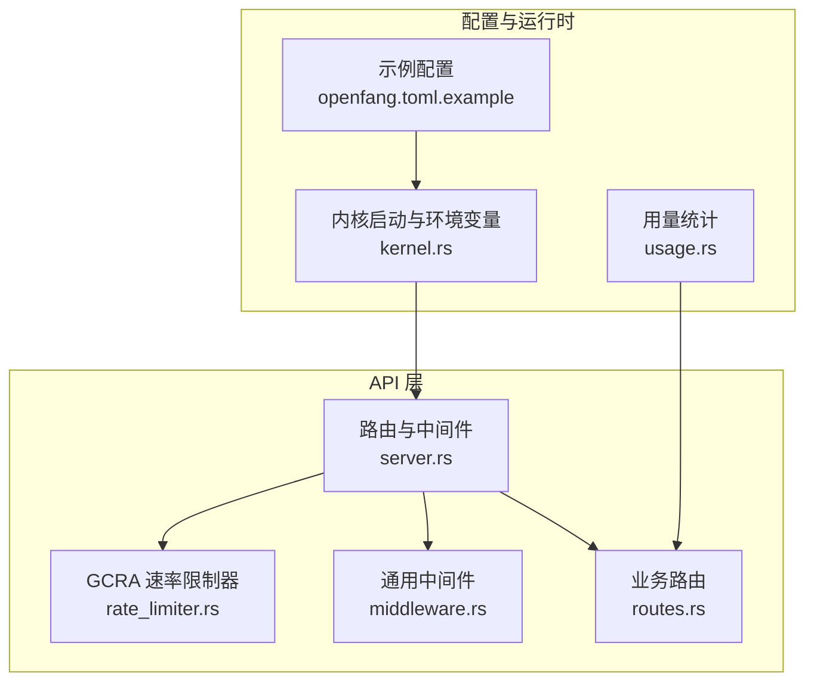
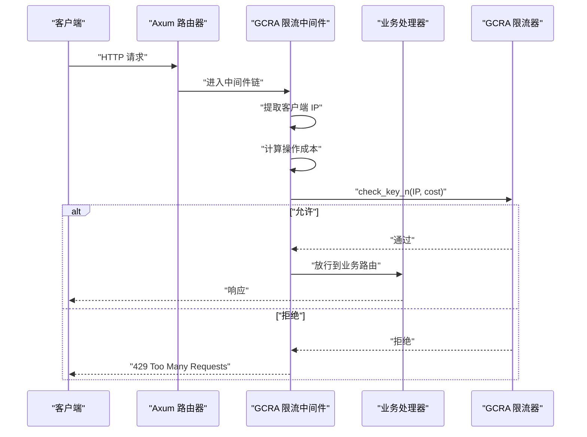
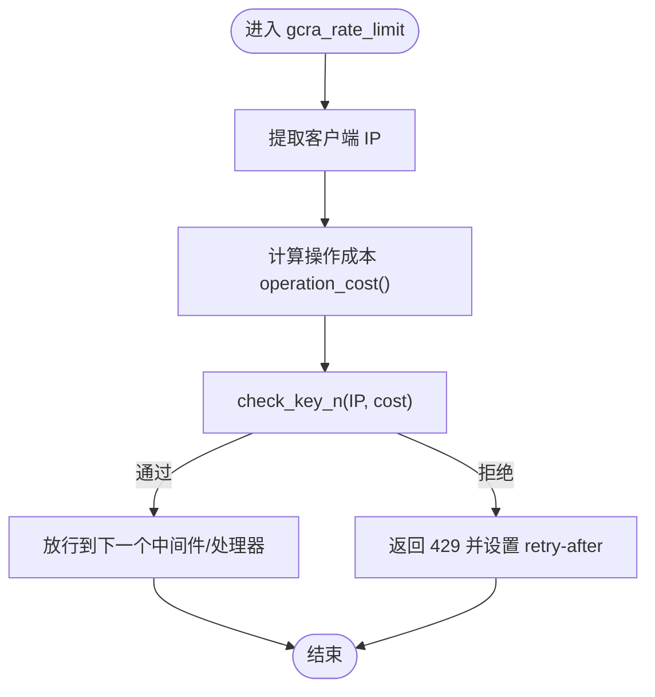
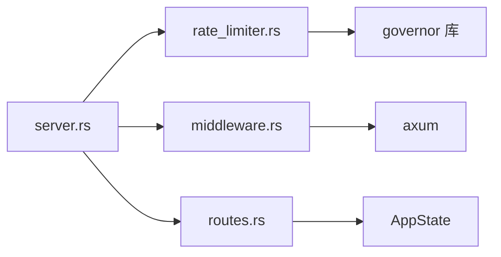

# 速率限制机制

<cite>
**本文档引用的文件**
- [rate_limiter.rs](file://crates/openfang-api/src/rate_limiter.rs)
- [server.rs](file://crates/openfang-api/src/server.rs)
- [middleware.rs](file://crates/openfang-api/src/middleware.rs)
- [routes.rs](file://crates/openfang-api/src/routes.rs)
- [lib.rs](file://crates/openfang-api/src/lib.rs)
- [openfang.toml.example](file://openfang.toml.example)
- [api_integration_test.rs](file://crates/openfang-api/tests/api_integration_test.rs)
- [load_test.rs](file://crates/openfang-api/tests/load_test.rs)
- [usage.rs](file://crates/openfang-memory/src/usage.rs)
- [kernel.rs](file://crates/openfang-kernel/src/kernel.rs)
</cite>

## 目录
1. [简介](#简介)
2. [项目结构](#项目结构)
3. [核心组件](#核心组件)
4. [架构总览](#架构总览)
5. [详细组件分析](#详细组件分析)
6. [依赖关系分析](#依赖关系分析)
7. [性能考量](#性能考量)
8. [故障排查指南](#故障排查指南)
9. [结论](#结论)
10. [附录](#附录)

## 简介
本文件系统性阐述 OpenFang 的速率限制机制，重点围绕 GCRA（通用漏桶算法/Generic Cell Rate Algorithm）在 API 速率限制中的实现与应用。内容涵盖：
- 令牌桶模型与填充速率计算
- 请求成本（cost）分配与检查流程
- 配置与策略：每 IP 每端点限制、滑动窗口思想、突发处理
- 限制策略层级：API 端点级别、用户级别、IP 级别
- 状态管理、过期处理与统计信息收集
- 应用场景：防滥用、DDoS 防护、公平使用
- 与缓存、CDN、负载均衡的协同

## 项目结构
OpenFang 的速率限制位于 openfang-api 子模块中，核心文件如下：
- 速率限制器：crates/openfang-api/src/rate_limiter.rs
- 中间件与服务器装配：crates/openfang-api/src/server.rs、crates/openfang-api/src/middleware.rs
- 路由与状态：crates/openfang-api/src/routes.rs
- 示例配置：openfang.toml.example
- 测试：crates/openfang-api/tests/api_integration_test.rs、crates/openfang-api/tests/load_test.rs
- 使用统计：crates/openfang-memory/src/usage.rs
- 内核启动与环境变量注入：crates/openfang-kernel/src/kernel.rs

图表来源
- [server.rs:37-712](file://crates/openfang-api/src/server.rs#L37-L712)
- [rate_limiter.rs:1-98](file://crates/openfang-api/src/rate_limiter.rs#L1-L98)
- [middleware.rs:1-270](file://crates/openfang-api/src/middleware.rs#L1-L270)
- [routes.rs:21-44](file://crates/openfang-api/src/routes.rs#L21-L44)
- [openfang.toml.example:1-49](file://openfang.toml.example#L1-L49)
- [kernel.rs:505-534](file://crates/openfang-kernel/src/kernel.rs#L505-L534)
- [usage.rs:108-334](file://crates/openfang-memory/src/usage.rs#L108-L334)

章节来源
- [lib.rs:1-18](file://crates/openfang-api/src/lib.rs#L1-L18)
- [server.rs:37-712](file://crates/openfang-api/src/server.rs#L37-L712)

## 核心组件
- GCRA 速率限制器
  - 基于 governor 库的 keyed RateLimiter，按 IP 地址进行限流
  - 默认配额：每分钟 500 个 token
  - 成本函数根据 HTTP 方法与路径动态分配
- 速率限制中间件
  - 提取客户端 IP（ConnectInfo）
  - 计算操作成本
  - 执行 check_key_n 并在超限返回 429
- 服务器装配
  - 在 Router 上注册 GCRA 中间件，确保所有请求在进入业务路由前经过限流
- 配置与环境变量
  - 支持通过环境变量覆盖 API 密钥等参数
  - 示例配置文件提供默认监听地址与模型配置

章节来源
- [rate_limiter.rs:14-79](file://crates/openfang-api/src/rate_limiter.rs#L14-L79)
- [server.rs:119-709](file://crates/openfang-api/src/server.rs#L119-L709)
- [openfang.toml.example:4-12](file://openfang.toml.example#L4-L12)
- [kernel.rs:517-531](file://crates/openfang-kernel/src/kernel.rs#L517-L531)

## 架构总览
GCRA 速率限制在请求生命周期中的位置如下：

图表来源
- [rate_limiter.rs:51-79](file://crates/openfang-api/src/rate_limiter.rs#L51-L79)
- [server.rs:696-703](file://crates/openfang-api/src/server.rs#L696-L703)

## 详细组件分析

### GCRA 速率限制器（rate_limiter.rs）
- 令牌桶模型与填充速率
  - 采用每分钟配额的固定速率模型，对应 GCRA 的填充速率 λ=500 tokens/minute
  - 使用 keyed RateLimiter，以 IP 为键维护各自的状态
- 成本函数 operation_cost
  - 基于方法与路径的细粒度成本分配，例如：
    - GET /api/health、/api/status、/api/version、/api/tools：1 token
    - GET /api/agents、/api/skills、/api/peers、/api/config：2 tokens
    - GET /api/usage：3 tokens
    - GET /api/audit*、/api/marketplace*：5 tokens
    - POST /api/agents：50 tokens
    - POST 包含 /message：30 tokens
    - POST 包含 /run：100 tokens
    - 其他未显式匹配的请求：默认 5 tokens
- 限流检查与拒绝
  - 使用 check_key_n(IP, cost) 进行原子性检查
  - 超限时返回 429，并设置 retry-after 头部
  - 日志记录超限事件，便于审计与调试

图表来源
- [rate_limiter.rs:51-79](file://crates/openfang-api/src/rate_limiter.rs#L51-L79)
- [rate_limiter.rs:14-35](file://crates/openfang-api/src/rate_limiter.rs#L14-L35)

章节来源
- [rate_limiter.rs:14-79](file://crates/openfang-api/src/rate_limiter.rs#L14-L79)

### 服务器装配与中间件链（server.rs）
- 中间件注册顺序
  - 认证中间件（auth）→ GCRA 速率限制中间件（gcra_rate_limit）→ 安全头中间件（security_headers）→ 请求日志中间件（request_logging）
- 限流器实例化
  - create_rate_limiter 创建全局限流器实例并注入到中间件状态
- 路由与状态
  - 构建 Router 并注入 AppState，供业务路由使用

章节来源
- [server.rs:119-709](file://crates/openfang-api/src/server.rs#L119-L709)

### 通用中间件（middleware.rs）
- 请求 ID 注入与结构化日志
  - 生成唯一 x-request-id 并在响应头中回传
  - 统一记录请求/响应状态与耗时
- 安全头中间件
  - 设置多种安全响应头（X-Content-Type-Options、X-Frame-Options、CSP、HSTS 等）

章节来源
- [middleware.rs:17-44](file://crates/openfang-api/src/middleware.rs#L17-L44)
- [middleware.rs:232-259](file://crates/openfang-api/src/middleware.rs#L232-L259)

### 路由与状态（routes.rs）
- 共享应用状态 AppState
  - 包含内核句柄、桥接管理器、通道配置、通知句柄等
- 用量统计接口
  - 提供 /api/usage 及相关聚合接口，用于查看用量与成本统计

章节来源
- [routes.rs:21-44](file://crates/openfang-api/src/routes.rs#L21-L44)
- [usage.rs:108-334](file://crates/openfang-memory/src/usage.rs#L108-L334)

### 配置与环境变量（openfang.toml.example、kernel.rs）
- 示例配置
  - api_key：启用 Bearer Token 认证（推荐）
  - api_listen：HTTP API 绑定地址（可设为 0.0.0.0 对外暴露）
- 环境变量覆盖
  - OPENFANG_API_KEY：当配置文件未设置时，从环境变量注入 API 密钥
  - OPENFANG_LISTEN：覆盖 API 监听地址

章节来源
- [openfang.toml.example:4-12](file://openfang.toml.example#L4-L12)
- [kernel.rs:517-531](file://crates/openfang-kernel/src/kernel.rs#L517-L531)

### 测试与基准（api_integration_test.rs、load_test.rs）
- 集成测试
  - 启动真实内核与 HTTP 服务，验证健康检查、代理生命周期、工作流与触发器等端到端功能
- 负载测试
  - 并发读取、持续负载下的指标采集，验证在高并发下中间件链的稳定性与延迟表现

章节来源
- [api_integration_test.rs:187-230](file://crates/openfang-api/tests/api_integration_test.rs#L187-L230)
- [load_test.rs:247-563](file://crates/openfang-api/tests/load_test.rs#L247-L563)

## 依赖关系分析
- 组件耦合
  - server.rs 依赖 rate_limiter.rs 与 middleware.rs，形成“中间件链”式调用
  - routes.rs 依赖 AppState，间接使用限流器的状态（通过全局实例）
- 外部依赖
  - governor 库提供 GCRA 实现
  - axum 提供中间件与状态注入能力
  - tokio 提供异步运行时支持

图表来源
- [server.rs:37-712](file://crates/openfang-api/src/server.rs#L37-L712)
- [rate_limiter.rs:1-12](file://crates/openfang-api/src/rate_limiter.rs#L1-L12)
- [middleware.rs:1-12](file://crates/openfang-api/src/middleware.rs#L1-L12)

章节来源
- [server.rs:37-712](file://crates/openfang-api/src/server.rs#L37-L712)
- [rate_limiter.rs:1-12](file://crates/openfang-api/src/rate_limiter.rs#L1-L12)
- [middleware.rs:1-12](file://crates/openfang-api/src/middleware.rs#L1-L12)

## 性能考量
- 中间件链开销
  - 限流检查为轻量级内存操作，通常不会成为瓶颈
  - 建议在高并发场景下结合 CDN/反向代理进行首层限流
- 成本分配
  - 将高消耗操作（如 /run、/message）赋予更高成本，有助于抑制滥用
- 缓存与统计
  - 使用内存缓存（如 DashMap）存储限流状态，避免持久化带来的 IO 开销
  - 用量统计接口可用于观察成本分布与异常峰值

[本节为通用指导，无需特定文件来源]

## 故障排查指南
- 429 Too Many Requests
  - 检查客户端是否正确设置 Authorization 或 X-API-Key
  - 确认 retry-after 头部值，避免短时间重复重试
  - 查看日志中关于 GCRA 超限的警告条目
- 认证与中间件顺序
  - 确保认证中间件在限流中间件之前执行，避免对公开端点误限流
- 配置问题
  - 若启用 api_key，请确认 OPENFANG_API_KEY 环境变量或配置文件已正确设置
  - 检查 api_listen 是否被防火墙或容器网络策略阻断

章节来源
- [rate_limiter.rs:66-76](file://crates/openfang-api/src/rate_limiter.rs#L66-L76)
- [middleware.rs:132-215](file://crates/openfang-api/src/middleware.rs#L132-L215)
- [server.rs:696-709](file://crates/openfang-api/src/server.rs#L696-L709)

## 结论
OpenFang 的速率限制基于 GCRA 算法，通过细粒度的成本分配与每 IP 的 keyed 限流，实现了对 API 的高效保护。结合认证中间件、安全头与统一日志，形成了完整的安全与可观测性体系。建议在生产环境中配合 CDN/负载均衡进行首层限流，并依据业务特征调整成本权重与配额。

[本节为总结性内容，无需特定文件来源]

## 附录

### 速率限制配置示例
- 启用 Bearer 认证与对外监听
  - 在配置文件中设置 api_key 与 api_listen
  - 通过环境变量 OPENFANG_API_KEY 注入密钥
- 调整成本权重
  - 根据业务需要修改 operation_cost 中的映射，提高高成本操作的 cost 值

章节来源
- [openfang.toml.example:4-12](file://openfang.toml.example#L4-L12)
- [kernel.rs:517-531](file://crates/openfang-kernel/src/kernel.rs#L517-L531)
- [rate_limiter.rs:14-35](file://crates/openfang-api/src/rate_limiter.rs#L14-L35)

### 速率限制策略层级
- IP 级别（默认）
  - 基于 IP 的 keyed 限流，适用于单机部署
- 用户级别（建议）
  - 在认证中间件之后，结合会话或 API Key 进行用户级限流
- 端点级别（已实现）
  - 通过 operation_cost 对不同端点设置不同成本，实现细粒度控制

章节来源
- [rate_limiter.rs:14-35](file://crates/openfang-api/src/rate_limiter.rs#L14-L35)
- [middleware.rs:62-215](file://crates/openfang-api/src/middleware.rs#L62-L215)

### 与缓存、CDN、负载均衡的配合
- CDN/反向代理
  - 在边缘层进行首层限流与 DDoS 防护，减轻后端压力
- 缓存
  - 对只读端点（如 /api/health、/api/status）进行短期缓存，降低后端负载
- 负载均衡
  - 在多实例部署中，建议使用共享缓存或分布式限流方案，避免单实例状态不一致

[本节为通用指导，无需特定文件来源]