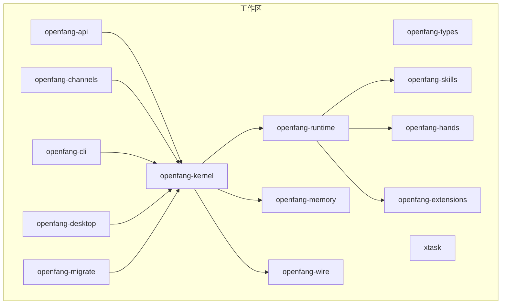
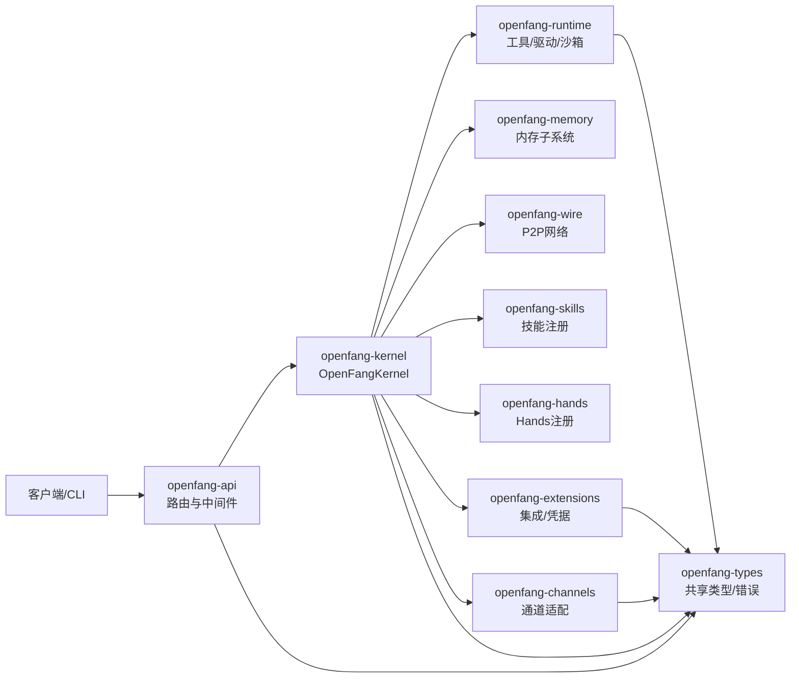
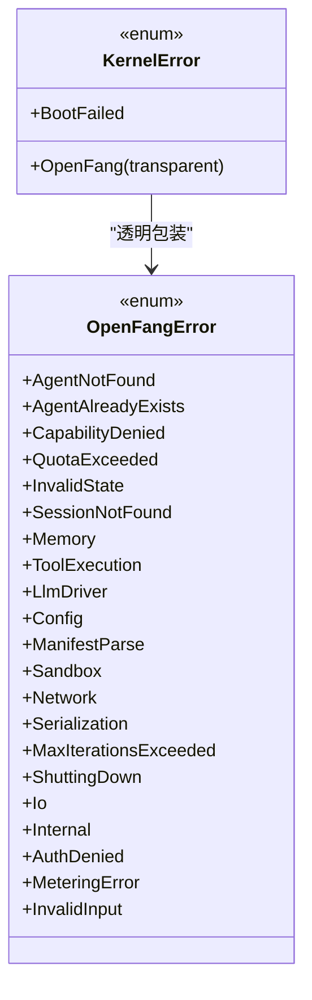
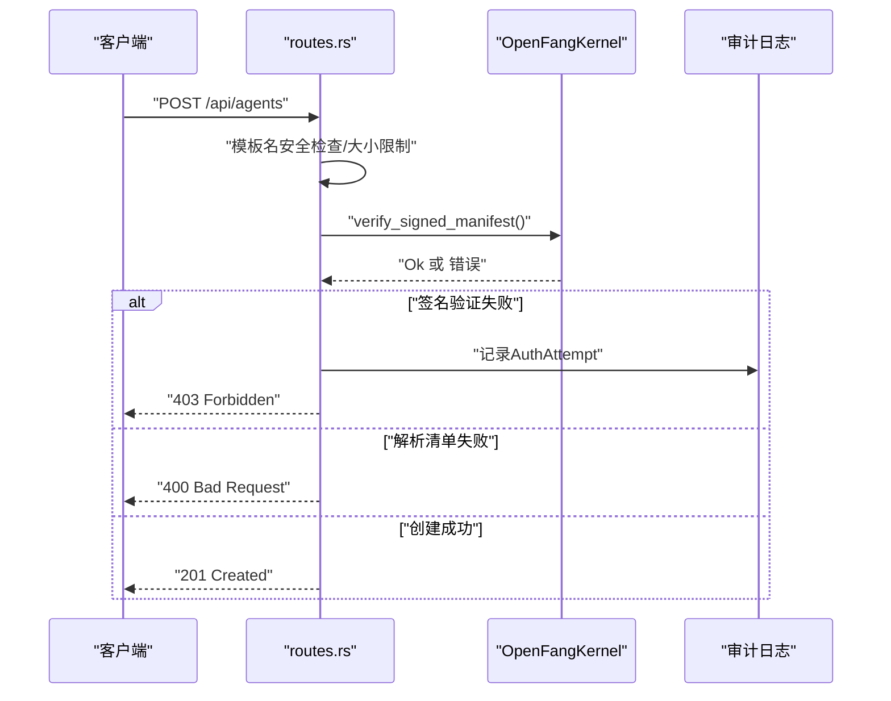
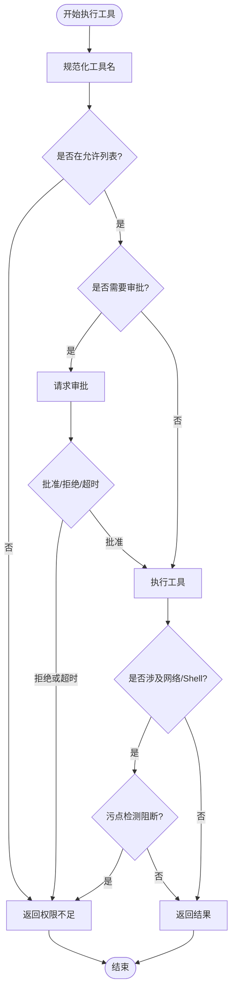
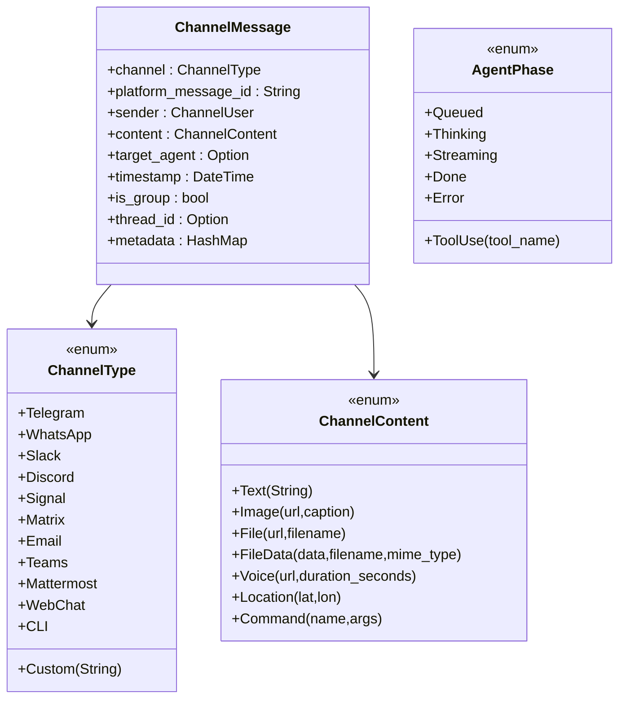
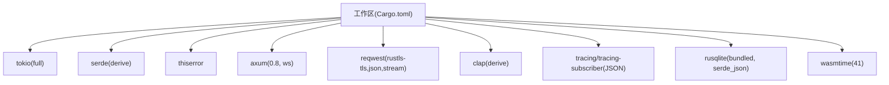

# 代码风格和规范

<cite>
**本文引用的文件**
- [rustfmt.toml](file://rustfmt.toml)
- [Cargo.toml](file://Cargo.toml)
- [CONTRIBUTING.md](file://CONTRIBUTING.md)
- [crates/openfang-types/src/lib.rs](file://crates/openfang-types/src/lib.rs)
- [crates/openfang-types/src/error.rs](file://crates/openfang-types/src/error.rs)
- [crates/openfang-kernel/src/error.rs](file://crates/openfang-kernel/src/error.rs)
- [crates/openfang-kernel/src/kernel.rs](file://crates/openfang-kernel/src/kernel.rs)
- [crates/openfang-runtime/src/lib.rs](file://crates/openfang-runtime/src/lib.rs)
- [crates/openfang-runtime/src/tool_runner.rs](file://crates/openfang-runtime/src/tool_runner.rs)
- [crates/openfang-api/src/lib.rs](file://crates/openfang-api/src/lib.rs)
- [crates/openfang-api/src/routes.rs](file://crates/openfang-api/src/routes.rs)
- [crates/openfang-channels/src/lib.rs](file://crates/openfang-channels/src/lib.rs)
- [crates/openfang-channels/src/types.rs](file://crates/openfang-channels/src/types.rs)
</cite>

## 目录
1. [简介](#简介)
2. [项目结构](#项目结构)
3. [核心组件](#核心组件)
4. [架构总览](#架构总览)
5. [详细组件分析](#详细组件分析)
6. [依赖分析](#依赖分析)
7. [性能考虑](#性能考虑)
8. [故障排查指南](#故障排查指南)
9. [结论](#结论)
10. [附录](#附录)

## 简介
本文件为 OpenFang 项目的代码风格与编码规范，覆盖以下方面：
- Rust 代码格式化规则（基于 rustfmt）
- 命名约定（PascalCase、snake_case、SCREAMING_SNAKE_CASE）
- Linting 要求与 clippy 警告处理策略
- 错误处理模式（thiserror、? 操作符使用）
- 文档注释标准与公共 API 文档要求
- 依赖管理规范与 Serde 配置要求
- 测试编写标准
- 代码审查检查清单与常见错误规避
- IDE 配置建议与插件推荐

本规范以仓库现有配置与代码实践为依据，确保团队协作一致性与代码质量。

## 项目结构
OpenFang 采用 Cargo 工作区组织，包含多个子 crate，按职责分层：
- 类型与共享：openfang-types
- 内核与调度：openfang-kernel
- 运行时与工具：openfang-runtime
- 通道适配层：openfang-channels
- API 服务：openfang-api
- 其他支撑模块：openfang-memory、openfang-wire、openfang-skills、openfang-hands、openfang-extensions、openfang-cli、openfang-desktop、openfang-migrate、xtask

图表来源
- [Cargo.toml:1-161](file://Cargo.toml#L1-L161)
- [crates/openfang-api/src/lib.rs:1-18](file://crates/openfang-api/src/lib.rs#L1-L18)
- [crates/openfang-kernel/src/kernel.rs:1-200](file://crates/openfang-kernel/src/kernel.rs#L1-L200)
- [crates/openfang-runtime/src/lib.rs:1-59](file://crates/openfang-runtime/src/lib.rs#L1-L59)
- [crates/openfang-channels/src/lib.rs:1-55](file://crates/openfang-channels/src/lib.rs#L1-L55)

章节来源
- [Cargo.toml:1-161](file://Cargo.toml#L1-L161)

## 核心组件
- 工作区统一版本与特性：所有 crate 共享版本、edition、rust-version、许可证等元信息；通过根 Cargo.toml 的 workspace.dependencies 统一声明常用依赖。
- 错误模型：openfang-types 定义顶层 OpenFangError，openfang-kernel 在其基础上扩展 KernelError，并广泛使用 thiserror 提供可读、可组合的错误类型。
- 运行时与工具：openfang-runtime 提供工具执行、LLM 驱动抽象、沙箱、会话管理等能力；内置工具通过集中注册表进行安全调用。
- API 层：openfang-api 暴露 REST/WS/SSE 接口，路由中对输入进行安全校验与审计记录。
- 通道层：openfang-channels 提供 40+ 平台适配器，统一消息格式与生命周期状态。

章节来源
- [Cargo.toml:18-148](file://Cargo.toml#L18-L148)
- [crates/openfang-types/src/error.rs:1-105](file://crates/openfang-types/src/error.rs#L1-L105)
- [crates/openfang-kernel/src/error.rs:1-20](file://crates/openfang-kernel/src/error.rs#L1-L20)
- [crates/openfang-runtime/src/lib.rs:1-59](file://crates/openfang-runtime/src/lib.rs#L1-L59)
- [crates/openfang-api/src/lib.rs:1-18](file://crates/openfang-api/src/lib.rs#L1-L18)
- [crates/openfang-channels/src/lib.rs:1-55](file://crates/openfang-channels/src/lib.rs#L1-L55)

## 架构总览
下图展示 API、内核、运行时、通道与类型之间的交互关系，体现错误类型在各层的传递与封装。

图表来源
- [crates/openfang-api/src/routes.rs:1-200](file://crates/openfang-api/src/routes.rs#L1-L200)
- [crates/openfang-kernel/src/kernel.rs:1-200](file://crates/openfang-kernel/src/kernel.rs#L1-L200)
- [crates/openfang-types/src/error.rs:1-105](file://crates/openfang-types/src/error.rs#L1-L105)

## 详细组件分析

### 错误处理与 thiserror 使用
- 统一错误类型：openfang-types 定义 OpenFangError，涵盖代理、会话、内存、工具、LLM、配置、序列化、网络、内部错误等场景。
- 扩展错误类型：openfang-kernel 定义 KernelError，使用透明包装（#[error(transparent)]）复用 OpenFangError，并新增启动失败等上下文错误。
- 使用原则：
  - 库代码中优先使用 ? 操作符进行错误传播，避免 unwrap。
  - 对外暴露的错误应尽量语义明确，必要时在外层包裹一层上下文错误类型。
  - 错误实现 Debug 与 Display，便于日志与调试。

图表来源
- [crates/openfang-types/src/error.rs:1-105](file://crates/openfang-types/src/error.rs#L1-L105)
- [crates/openfang-kernel/src/error.rs:1-20](file://crates/openfang-kernel/src/error.rs#L1-L20)

章节来源
- [crates/openfang-types/src/error.rs:1-105](file://crates/openfang-types/src/error.rs#L1-L105)
- [crates/openfang-kernel/src/error.rs:1-20](file://crates/openfang-kernel/src/error.rs#L1-L20)

### API 路由中的错误处理与安全校验
- 输入校验：对模板名进行路径遍历防护、限制清单大小、签名验证与内容一致性校验。
- 审计与日志：签名失败等事件记录审计日志，便于追踪与取证。
- 错误响应：根据错误类型返回合适的 HTTP 状态码与 JSON 错误体。

图表来源
- [crates/openfang-api/src/routes.rs:45-168](file://crates/openfang-api/src/routes.rs#L45-L168)
- [crates/openfang-kernel/src/kernel.rs:1-200](file://crates/openfang-kernel/src/kernel.rs#L1-L200)

章节来源
- [crates/openfang-api/src/routes.rs:45-168](file://crates/openfang-api/src/routes.rs#L45-L168)

### 工具执行与能力控制
- 工具注册：集中于工具执行入口，按名称分发到具体实现。
- 能力控制：通过 allowed_tools 列表拒绝未授权工具调用。
- 审批门禁：需要人工审批的工具在执行前请求审批。
- 注入检测：对 shell 与网络访问进行污点检测，阻断潜在注入风险。

图表来源
- [crates/openfang-runtime/src/tool_runner.rs:98-171](file://crates/openfang-runtime/src/tool_runner.rs#L98-L171)

章节来源
- [crates/openfang-runtime/src/tool_runner.rs:98-171](file://crates/openfang-runtime/src/tool_runner.rs#L98-L171)

### 通道类型与 Serde 配置
- 统一消息类型：ChannelMessage 将多平台消息抽象为统一结构，支持文本、图片、文件、语音、位置、命令等。
- 生命周期状态：AgentPhase 与 DeliveryStatus 使用 snake_case 序列化，保证前后端一致。
- 可选字段默认值：如 is_group、thread_id 等字段使用 #[serde(default)]，提升向前兼容性。

图表来源
- [crates/openfang-channels/src/types.rs:12-96](file://crates/openfang-channels/src/types.rs#L12-L96)
- [crates/openfang-channels/src/types.rs:98-176](file://crates/openfang-channels/src/types.rs#L98-L176)

章节来源
- [crates/openfang-channels/src/types.rs:12-96](file://crates/openfang-channels/src/types.rs#L12-L96)
- [crates/openfang-channels/src/types.rs:98-176](file://crates/openfang-channels/src/types.rs#L98-L176)

## 依赖分析
- 工作区依赖统一管理：根 Cargo.toml 的 workspace.dependencies 集中声明 tokio、serde、thiserror、axum、reqwest、clap 等核心依赖及其特性。
- 版本策略：优先复用工作区依赖，减少重复与版本漂移；新增依赖需在 PR 中说明理由。
- 性能配置：release 与 release-fast 两种发布配置，兼顾二进制体积与编译速度。

图表来源
- [Cargo.toml:25-148](file://Cargo.toml#L25-L148)

章节来源
- [Cargo.toml:18-161](file://Cargo.toml#L18-L161)

## 性能考虑
- 发布配置：release 使用全量 LTO 与单代码生成单元，适合最终构建；release-fast 使用薄 LTO 与多代码生成单元，适合本地迭代。
- 网络与 IO：API 层对输入进行大小限制与签名验证，降低解析与传输开销；运行时对网络与 Shell 执行进行污点检测，避免高成本或高风险操作。
- 并发与锁：内核使用 DashMap 等并发容器，减少锁竞争；通道适配器与运行时工具执行采用任务隔离与互斥锁，避免竞态。

章节来源
- [Cargo.toml:149-161](file://Cargo.toml#L149-L161)
- [crates/openfang-api/src/routes.rs:94-101](file://crates/openfang-api/src/routes.rs#L94-L101)
- [crates/openfang-kernel/src/kernel.rs:161-161](file://crates/openfang-kernel/src/kernel.rs#L161-L161)

## 故障排查指南
- 格式与 Lint：确保提交前执行 cargo fmt 与 cargo clippy --workspace --all-targets -- -D warnings，CI 强制零警告。
- 错误定位：优先查看 thiserror 包装的底层错误，结合日志与审计记录定位问题。
- API 安全：若出现 403/400，检查签名验证、模板名与清单大小限制。
- 工具执行：若工具被拒绝，确认 agent 的 capabilities 是否包含该工具；若需要审批，检查审批流程状态。

章节来源
- [CONTRIBUTING.md:85-125](file://CONTRIBUTING.md#L85-L125)
- [crates/openfang-api/src/routes.rs:94-132](file://crates/openfang-api/src/routes.rs#L94-L132)

## 结论
本规范以工作区统一依赖、thiserror 错误模型、严格的 lint 与格式化要求为基础，辅以 API 层安全校验与运行时工具治理策略，形成从类型定义到接口实现的一致性约束。遵循本规范有助于提升代码可维护性、安全性与协作效率。

## 附录

### 代码风格与格式化
- rustfmt 规则：最大行长 100 字符。
- 命名约定：
  - 类型：PascalCase（如 OpenFangKernel、AgentManifest）
  - 函数/方法：snake_case（如 spawn_agent、list_agents）
  - 常量：SCREAMING_SNAKE_CASE（如 USER_AGENT）
  - Crate 名称：openfang-{name}（kebab-case）
- 文档注释：所有公共类型与函数必须具备文档注释（///），描述用途、参数、返回值与注意事项。

章节来源
- [rustfmt.toml:1-2](file://rustfmt.toml#L1-L2)
- [CONTRIBUTING.md:111-125](file://CONTRIBUTING.md#L111-L125)
- [crates/openfang-types/src/lib.rs:1-82](file://crates/openfang-types/src/lib.rs#L1-L82)

### Linting 与 clippy 要求
- 必须通过 cargo clippy --workspace --all-targets -- -D warnings，CI 强制零警告。
- 建议在 IDE 中启用 clippy 插件，实时提示。

章节来源
- [CONTRIBUTING.md:85-92](file://CONTRIBUTING.md#L85-L92)

### 错误处理模式
- 使用 thiserror 定义错误类型，提供清晰的错误上下文。
- 库代码中避免 unwrap，优先使用 ? 操作符进行传播。
- 对外错误类型可在外层包裹上下文错误，增强可诊断性。

章节来源
- [crates/openfang-types/src/error.rs:1-105](file://crates/openfang-types/src/error.rs#L1-L105)
- [crates/openfang-kernel/src/error.rs:1-20](file://crates/openfang-kernel/src/error.rs#L1-L20)
- [CONTRIBUTING.md:111-117](file://CONTRIBUTING.md#L111-L117)

### 文档注释与公共 API
- 公共 API 必须具备文档注释（///），说明用途、行为边界与错误情形。
- 示例：openfang-types 的模块与公共函数均提供文档注释。

章节来源
- [CONTRIBUTING.md:111-116](file://CONTRIBUTING.md#L111-L116)
- [crates/openfang-types/src/lib.rs:1-82](file://crates/openfang-types/src/lib.rs#L1-L82)

### 依赖管理规范
- 新增依赖需在 PR 中说明理由，避免重复与漂移。
- 优先复用 workspace.dependencies，保持版本一致。

章节来源
- [CONTRIBUTING.md:121-122](file://CONTRIBUTING.md#L121-L122)
- [Cargo.toml:25-148](file://Cargo.toml#L25-L148)

### 测试编写标准
- 每个新功能必须配套测试，使用 tempfile::TempDir 进行文件系统隔离，随机端口绑定进行网络测试。
- 测试总数超过 1700，合并前必须全部通过。

章节来源
- [CONTRIBUTING.md:75-84](file://CONTRIBUTING.md#L75-L84)
- [CONTRIBUTING.md:123](file://CONTRIBUTING.md#L123)

### Serde 配置要求
- 配置结构体使用 #[serde(default)] 以保证向前兼容。
- 枚举字段使用 #[serde(rename_all = "snake_case")] 保持序列化一致性。
- 可选字段显式标注 #[serde(default)]，避免缺失字段导致解析失败。

章节来源
- [CONTRIBUTING.md:124](file://CONTRIBUTING.md#L124)
- [crates/openfang-channels/src/types.rs:100](file://crates/openfang-channels/src/types.rs#L100)
- [crates/openfang-channels/src/types.rs:166](file://crates/openfang-channels/src/types.rs#L166)

### 代码审查检查清单
- 代码已通过 cargo fmt 与 cargo clippy --workspace --all-targets -- -D warnings。
- 所有公共类型与函数具备文档注释（///）。
- 错误处理使用 thiserror，避免 unwrap。
- 新增依赖已在 PR 中说明理由。
- 测试覆盖新增功能，使用临时目录与随机端口。
- Serde 配置符合默认值与枚举命名规范。

章节来源
- [CONTRIBUTING.md:85-125](file://CONTRIBUTING.md#L85-L125)

### 常见编码错误与规避
- 忘记格式化：提交前执行 cargo fmt --all。
- 忽视 clippy 警告：在 IDE 中启用 clippy 插件，逐条修复。
- 直接 unwrap：替换为 ? 或显式错误处理。
- 缺少文档注释：为公共 API 补充 /// 注释。
- 通道与工具未做能力控制：确保 capabilities 正确配置并进行审批门禁。
- Serde 缺失默认值：为可选字段添加 #[serde(default)]。

章节来源
- [CONTRIBUTING.md:85-125](file://CONTRIBUTING.md#L85-L125)

### IDE 配置建议与插件推荐
- Rust 工具链：rust-analyzer（提供语法、跳转、重命名、内联错误等）。
- Lint：clippy 插件，实时提示。
- 格式化：rustfmt 插件，自动格式化。
- Git：在 IDE 中启用 Git 集成，配合 PR 模板与提交信息规范。
- 日志与调试：启用 tracing 日志输出，结合断点与变量检查。

章节来源
- [CONTRIBUTING.md:85-98](file://CONTRIBUTING.md#L85-L98)