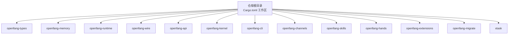
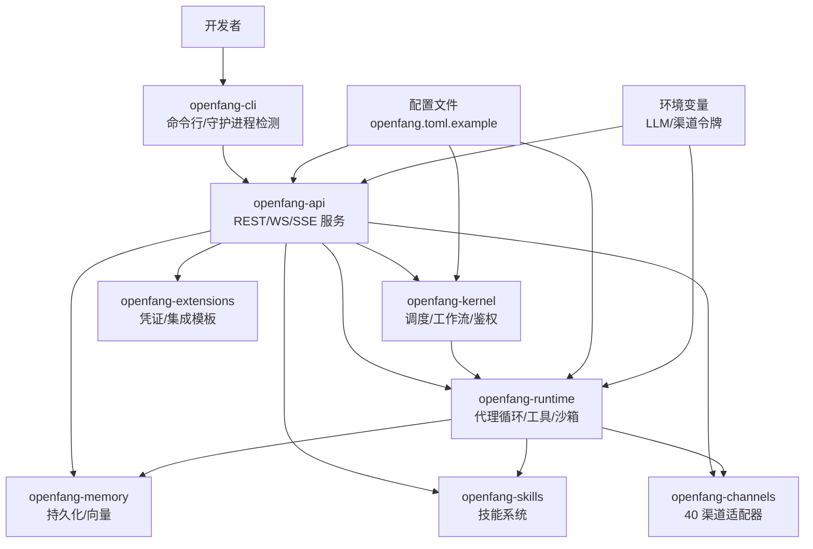
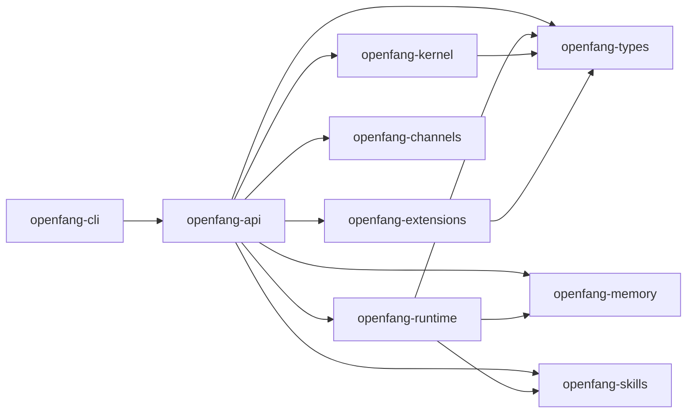

# 开发环境搭建

<cite>
**本文引用的文件**
- [README.md](file://README.md)
- [CONTRIBUTING.md](file://CONTRIBUTING.md)
- [Cargo.toml](file://Cargo.toml)
- [rust-toolchain.toml](file://rust-toolchain.toml)
- [rustfmt.toml](file://rustfmt.toml)
- [openfang.toml.example](file://openfang.toml.example)
- [flake.nix](file://flake.nix)
- [Cross.toml](file://Cross.toml)
- [.cargo/audit.toml](file://.cargo/audit.toml)
- [crates/openfang-cli/Cargo.toml](file://crates/openfang-cli/Cargo.toml)
- [crates/openfang-api/Cargo.toml](file://crates/openfang-api/Cargo.toml)
- [crates/openfang-runtime/Cargo.toml](file://crates/openfang-runtime/Cargo.toml)
</cite>

## 目录
1. [简介](#简介)
2. [项目结构](#项目结构)
3. [核心组件](#核心组件)
4. [架构总览](#架构总览)
5. [详细组件分析](#详细组件分析)
6. [依赖分析](#依赖分析)
7. [性能考虑](#性能考虑)
8. [故障排查指南](#故障排查指南)
9. [结论](#结论)
10. [附录](#附录)

## 简介
本指南面向希望在本地搭建并开发 OpenFang 的工程师与贡献者，覆盖 Rust 工具链安装（rustup）、Git 配置、Python 环境设置（可选）、系统依赖、IDE 配置建议（VS Code、IntelliJ IDEA）、工作区配置、Cargo.toml 依赖管理、工具链版本要求、环境变量与 LLM API 密钥配置、开发密钥生成、开发环境验证步骤（doctor 检查命令）、常见问题排查与性能优化建议。

## 项目结构
OpenFang 是一个由 14 个 Rust crate 组成的 Cargo 工作区，采用统一的版本、edition、rust-version 等工作区属性，并通过根 Cargo.toml 的 workspace.dependencies 统一管理公共依赖。项目同时提供 Nix flake 和 Cross 跨平台交叉编译配置，便于在不同平台上构建与测试。

图表来源
- [Cargo.toml:1-161](file://Cargo.toml#L1-L161)

章节来源
- [Cargo.toml:1-161](file://Cargo.toml#L1-L161)
- [README.md:445-459](file://README.md#L445-L459)

## 核心组件
- 工具链与格式化：使用 rustup 安装稳定通道，启用 rustfmt 与 clippy；通过 rust-toolchain.toml 固定工具链组件；通过 rustfmt.toml 控制代码风格宽度。
- 工作区与依赖：根 Cargo.toml 声明工作区成员与统一依赖版本；各 crate 的 Cargo.toml 仅声明自身依赖。
- 配置样例：openfang.toml.example 提供默认模型、内存、网络、会话压缩、用量展示等配置项示例，以及渠道适配器与 MCP 服务器连接示例。
- Nix 与交叉编译：flake.nix 提供多系统构建与桌面应用打包；Cross.toml 用于 aarch64 GNU 平台预构建依赖。

章节来源
- [rust-toolchain.toml:1-4](file://rust-toolchain.toml#L1-L4)
- [rustfmt.toml:1-2](file://rustfmt.toml#L1-L2)
- [Cargo.toml:1-161](file://Cargo.toml#L1-L161)
- [openfang.toml.example:1-49](file://openfang.toml.example#L1-L49)
- [flake.nix:1-56](file://flake.nix#L1-L56)
- [Cross.toml:1-6](file://Cross.toml#L1-L6)

## 架构总览
下图展示了开发环境中的关键角色与交互：开发者通过 CLI 启动或连接到本地守护进程；CLI 与 API 层通信；API 层驱动内核与运行时执行；运行时加载技能与工具，访问内存与通道适配器；配置文件与环境变量影响行为。

图表来源
- [crates/openfang-cli/Cargo.toml:1-33](file://crates/openfang-cli/Cargo.toml#L1-L33)
- [crates/openfang-api/Cargo.toml:1-44](file://crates/openfang-api/Cargo.toml#L1-L44)
- [crates/openfang-runtime/Cargo.toml:1-38](file://crates/openfang-runtime/Cargo.toml#L1-L38)
- [openfang.toml.example:1-49](file://openfang.toml.example#L1-L49)

## 详细组件分析

### Rust 工具链与 IDE 配置
- 安装与固定工具链
  - 使用 rustup 安装稳定通道，启用 rustfmt 与 clippy。
  - 通过 rust-toolchain.toml 固定组件，确保团队一致性。
- 代码风格
  - 使用 rustfmt，默认宽度 100；提交前必须格式化。
- IDE 推荐
  - VS Code：安装 Rust Analyzer、Even Better TOML、DotENV 等扩展。
  - IntelliJ IDEA：安装 Rust 插件与 TOML 插件，启用内置代码格式化与检查。
- Nix 开发（可选）
  - flake.nix 提供多系统构建与桌面应用打包，适合在隔离环境中快速复现构建。

章节来源
- [rust-toolchain.toml:1-4](file://rust-toolchain.toml#L1-L4)
- [rustfmt.toml:1-2](file://rustfmt.toml#L1-L2)
- [flake.nix:1-56](file://flake.nix#L1-L56)

### Git 配置与分支策略
- 分支命名建议：feat/xxx、fix/xxx、docs/xxx、refactor/xxx。
- 提交信息使用祈使语气，清晰描述变更内容。
- PR 要求：单 Concern 单 PR，先通过所有测试与 lint，再进行审查。

章节来源
- [CONTRIBUTING.md:328-356](file://CONTRIBUTING.md#L328-L356)

### Python 环境设置（可选）
- 若需运行 Python 技能或与 Python 运行时交互，建议使用 pyenv 或 conda 管理 Python 版本（>=3.8），并在项目中创建虚拟环境隔离依赖。

章节来源
- [CONTRIBUTING.md:25](file://CONTRIBUTING.md#L25)

### 系统依赖与平台要求
- Linux（含交叉编译）：参考 Cross.toml 中 aarch64 GNU 平台的预构建依赖安装命令。
- macOS/Windows：使用 rustup 安装稳定工具链即可；桌面应用构建需要额外 GUI 库（见 flake.nix 对桌面 crate 的 buildInputs）。
- OpenSSL：部分依赖静态链接 vendored OpenSSL，减少运行时依赖。

章节来源
- [Cross.toml:1-6](file://Cross.toml#L1-L6)
- [flake.nix:24-37](file://flake.nix#L24-L37)

### 工作区配置与 Cargo.toml 依赖管理
- 工作区属性：统一版本、edition、rust-version、许可证与仓库信息。
- 依赖集中管理：通过 workspace.dependencies 统一版本，避免重复与冲突。
- 典型依赖类别：异步运行时、序列化、HTTP 客户端/服务端、数据库、WebSocket、安全库、并发容器、日志追踪、WASM 沙箱等。
- 依赖审计：.cargo/audit.toml 忽略若干上游维护状态不佳的传递依赖，仅作为已知风险记录。

章节来源
- [Cargo.toml:18-161](file://Cargo.toml#L18-L161)
- [.cargo/audit.toml:1-35](file://.cargo/audit.toml#L1-L35)

### 工具链版本要求
- 最低 Rust 版本：1.75。
- 工具链通道：稳定版，启用 rustfmt 与 clippy。

章节来源
- [Cargo.toml:23](file://Cargo.toml#L23)
- [rust-toolchain.toml:2-3](file://rust-toolchain.toml#L2-L3)

### 环境变量与 LLM API 密钥配置
- LLM 提供商密钥：示例导出变量包括 GROQ_API_KEY、ANTHROPIC_API_KEY 等，用于端到端测试。
- 渠道适配器令牌：通过环境变量注入，例如 TELEGRAM_BOT_TOKEN、DISCORD_BOT_TOKEN、SLACK_BOT_TOKEN 等。
- MCP 服务器：可在配置中添加 [[mcp_servers]] 条目，指定命令与参数。

章节来源
- [CONTRIBUTING.md:38-47](file://CONTRIBUTING.md#L38-L47)
- [openfang.toml.example:32-49](file://openfang.toml.example#L32-L49)

### 开发密钥生成与安全配置
- 默认模型与密钥环境变量：在 openfang.toml.example 中定义 default_model.provider/model/api_key_env/base_url。
- 网络与互认证：network.listen_addr 与 shared_secret 用于 P2P 认证；未设置 shared_secret 时默认禁用互认证。
- 审计与告警：.cargo/audit.toml 记录忽略的安全通告，便于跟踪风险。

章节来源
- [openfang.toml.example:8-21](file://openfang.toml.example#L8-L21)
- [.cargo/audit.toml:10-34](file://.cargo/audit.toml#L10-L34)

### 开发环境验证与 doctor 检查命令
- doctor 命令：构建后运行 cargo run -- doctor，验证本地环境配置与依赖可用性。
- 常用开发命令：构建工作区、运行全部测试、格式化、Clippy 检查、快速发布构建等。

章节来源
- [CONTRIBUTING.md:101-108](file://CONTRIBUTING.md#L101-L108)
- [README.md:445-459](file://README.md#L445-L459)

### IDE 配置建议（VS Code、IntelliJ IDEA）
- VS Code
  - 扩展：Rust Analyzer、Even Better TOML、DotENV、EditorConfig for VS Code。
  - 设置：启用 rust-analyzer.cargo.loadOutDirsFromCheck、rust-analyzer.procMacro.enable。
- IntelliJ IDEA
  - 插件：Rust、TOML。
  - 设置：启用“Use external annotator”、格式化与 Clippy 集成。

章节来源
- [rust-toolchain.toml:1-4](file://rust-toolchain.toml#L1-L4)
- [rustfmt.toml:1-2](file://rustfmt.toml#L1-L2)

## 依赖分析
下图展示 openfang-cli、openfang-api、openfang-runtime 三者之间的依赖关系，体现 CLI 与 API 的耦合、API 对内核与运行时的依赖，以及运行时对内存与技能的依赖。

图表来源
- [crates/openfang-cli/Cargo.toml:12-32](file://crates/openfang-cli/Cargo.toml#L12-L32)
- [crates/openfang-api/Cargo.toml:8-38](file://crates/openfang-api/Cargo.toml#L8-L38)
- [crates/openfang-runtime/Cargo.toml:8-31](file://crates/openfang-runtime/Cargo.toml#L8-L31)

章节来源
- [crates/openfang-cli/Cargo.toml:1-33](file://crates/openfang-cli/Cargo.toml#L1-L33)
- [crates/openfang-api/Cargo.toml:1-44](file://crates/openfang-api/Cargo.toml#L1-L44)
- [crates/openfang-runtime/Cargo.toml:1-38](file://crates/openfang-runtime/Cargo.toml#L1-L38)

## 性能考虑
- 编译性能
  - 本地迭代优先使用 release-fast 配置，缩短链接时间；最终发布使用 release 配置获得更优二进制体积与性能。
- 运行时性能
  - WASM 沙箱与燃料计量、GCRA 速率限制、会话压缩阈值与摘要长度等配置可按需调整，平衡吞吐与资源占用。
- I/O 与网络
  - 选择合适的 TLS 后端（如 rustls）与压缩算法，减少带宽与延迟。
- 数据库
  - SQLite 内存模式与 WAL 模式的选择、索引与查询计划优化有助于提升读写性能。

章节来源
- [README.md:459](file://README.md#L459)
- [openfang.toml.example:22-29](file://openfang.toml.example#L22-L29)

## 故障排查指南
- 构建失败（Linux/aarch64）
  - 参考 Cross.toml 的预构建步骤，确保安装 libssl-dev 等依赖。
- OpenSSL 链接问题
  - 多数依赖已 vendored，若仍报错，检查系统 OpenSSL 版本与 pkg-config 路径。
- Nix 环境问题
  - flake.nix 为桌面应用额外引入 GTK/WebKit 等库，确保系统满足桌面构建依赖。
- doctor 检查不通过
  - 使用 cargo run -- doctor 输出具体错误，逐项修正配置与环境变量。
- LLM 调用失败
  - 确认对应提供商的 API 密钥已正确导出，且 base_url 与模型名称匹配。
- 渠道适配器异常
  - 检查环境变量令牌是否设置，配置文件中对应 [channel.platform] 段是否启用。

章节来源
- [Cross.toml:1-6](file://Cross.toml#L1-L6)
- [flake.nix:24-37](file://flake.nix#L24-L37)
- [CONTRIBUTING.md:101-108](file://CONTRIBUTING.md#L101-L108)
- [openfang.toml.example:8-49](file://openfang.toml.example#L8-L49)

## 结论
通过 rustup 固定工具链、统一工作区依赖、合理设置环境变量与配置文件、结合 doctor 检查与常见故障排查流程，可以高效搭建并维护 OpenFang 开发环境。建议在本地优先使用 release-fast 进行迭代，最终发布使用 release；同时关注依赖审计与安全配置，确保开发与生产一致。

## 附录

### 常用开发命令速查
- 构建工作区：cargo build --workspace
- 运行全部测试：cargo test --workspace
- Clippy 检查：cargo clippy --workspace --all-targets -- -D warnings
- 代码格式化：cargo fmt --all -- --check
- 快速发布构建（CLI）：cargo build --profile release-fast -p openfang-cli
- doctor 检查：cargo run -- doctor

章节来源
- [README.md:445-459](file://README.md#L445-L459)
- [CONTRIBUTING.md:53-99](file://CONTRIBUTING.md#L53-L99)