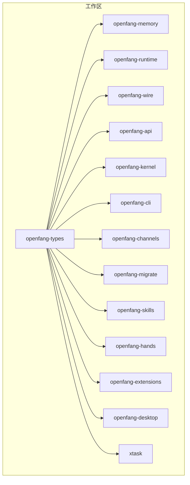
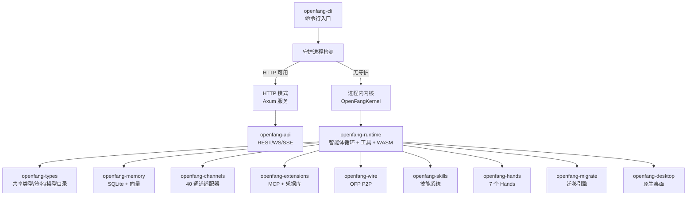
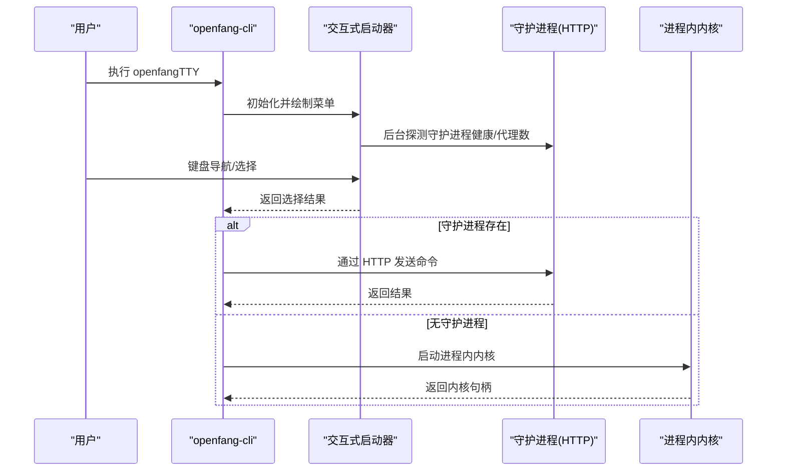
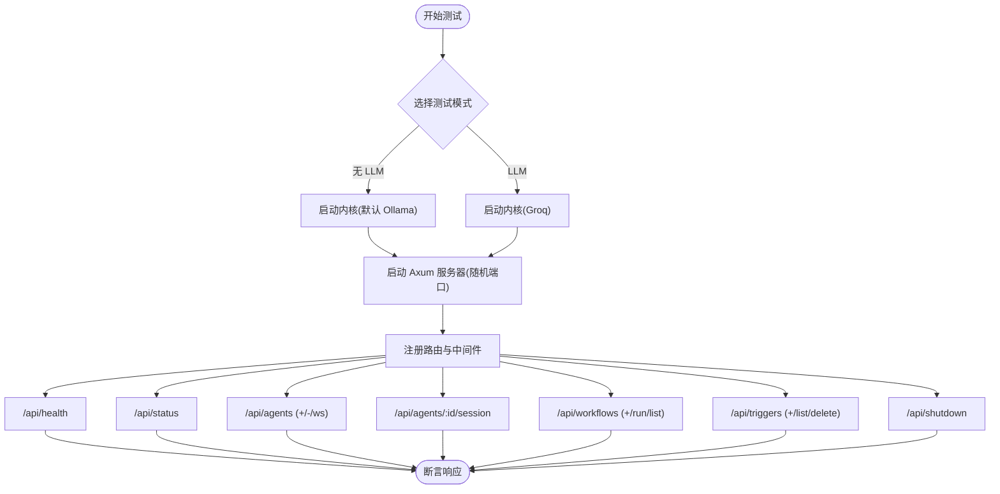
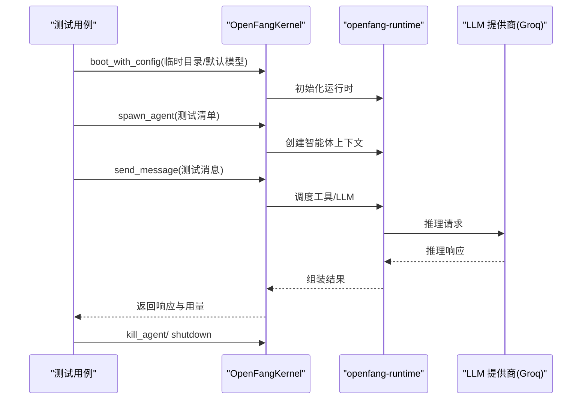
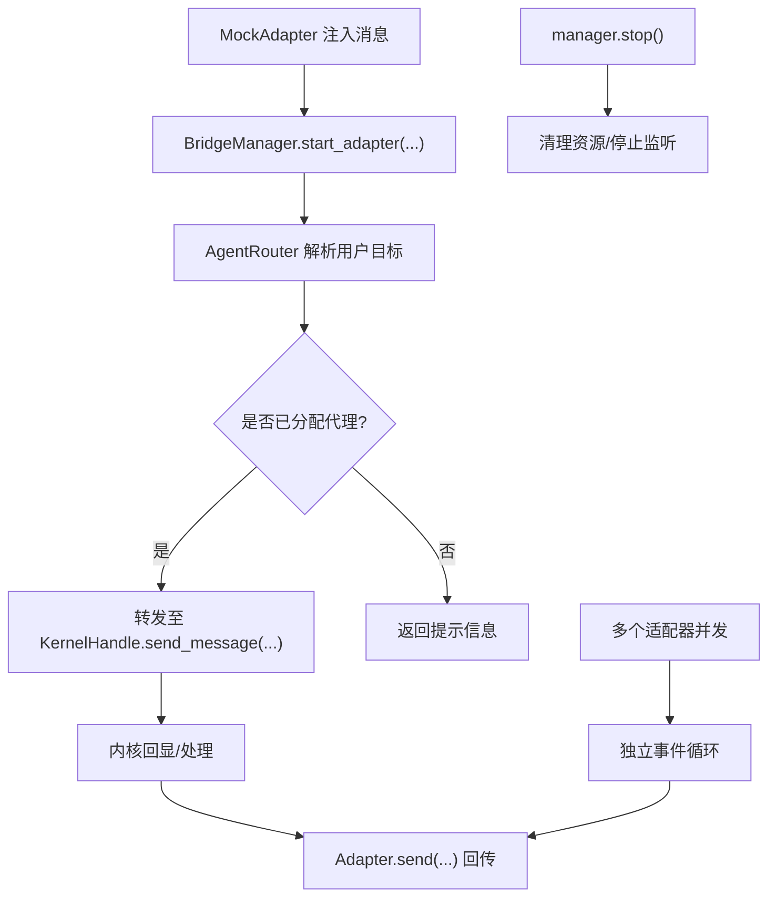
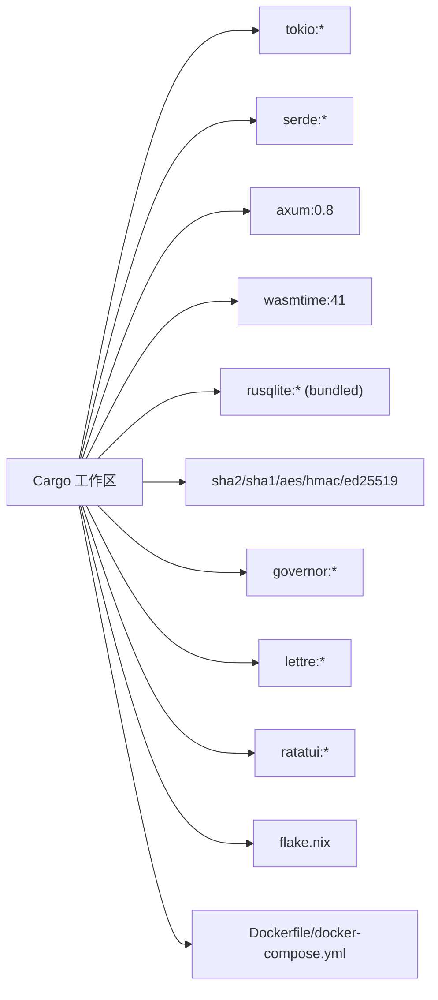

# 开发者指南

<cite>
**本文引用的文件**
- [README.md](file://README.md)
- [CONTRIBUTING.md](file://CONTRIBUTING.md)
- [Cargo.toml](file://Cargo.toml)
- [rust-toolchain.toml](file://rust-toolchain.toml)
- [rustfmt.toml](file://rustfmt.toml)
- [.github/pull_request_template.md](file://.github/pull_request_template.md)
- [.github/dependabot.yml](file://.github/dependabot.yml)
- [flake.nix](file://flake.nix)
- [docker-compose.yml](file://docker-compose.yml)
- [Dockerfile](file://Dockerfile)
- [crates/openfang-api/tests/api_integration_test.rs](file://crates/openfang-api/tests/api_integration_test.rs)
- [crates/openfang-kernel/tests/integration_test.rs](file://crates/openfang-kernel/tests/integration_test.rs)
- [crates/openfang-channels/tests/bridge_integration_test.rs](file://crates/openfang-channels/tests/bridge_integration_test.rs)
- [crates/openfang-cli/src/main.rs](file://crates/openfang-cli/src/main.rs)
- [crates/openfang-cli/src/launcher.rs](file://crates/openfang-cli/src/launcher.rs)
</cite>

## 目录
1. [简介](#简介)
2. [项目结构](#项目结构)
3. [核心组件](#核心组件)
4. [架构总览](#架构总览)
5. [详细组件分析](#详细组件分析)
6. [依赖关系分析](#依赖关系分析)
7. [性能考量](#性能考量)
8. [故障排查指南](#故障排查指南)
9. [结论](#结论)
10. [附录](#附录)

## 简介
本指南面向 OpenFang 开发者，覆盖从环境搭建到代码贡献、测试策略、构建与发布、持续集成与发布流程、工具链与 IDE 配置、代码风格与文档标准、调试与性能分析、以及社区协作与最佳实践。OpenFang 是一个用 Rust 构建的开源“智能体操作系统”，具备 14 个核心 Rust crate、137K+ LOC、1,767+ 测试、零 clippy 警告，并提供单二进制部署能力。

## 项目结构
仓库采用 Cargo 工作区组织，包含 14 个核心 crate 与相关测试、示例与脚本。顶层通过统一的工具链与格式化配置保证一致性；根目录提供 Docker Compose 与 Dockerfile 支持容器化运行；Nix flake 提供可复现的本地开发环境；GitHub Actions 配置 CI/CD 与依赖自动更新。

图示来源
- [Cargo.toml:1-17](file://Cargo.toml#L1-L17)

章节来源
- [Cargo.toml:1-162](file://Cargo.toml#L1-L162)
- [README.md:444-460](file://README.md#L444-L460)

## 核心组件
- openfang-types：共享类型、污点追踪、Ed25519 清单签名、模型目录、MCP/A2A 配置类型
- openfang-memory：基于 SQLite 的记忆基座、向量嵌入、使用统计、会话与 JSONL 备份
- openfang-runtime：智能体循环、3 个 LLM 驱动、38 个内置工具、WASM 沙箱、MCP 客户端/服务端、A2A 协议
- openfang-hands：7 个预置“手”（自主能力包）、HAND.toml 解析与生命周期管理
- openfang-extensions：扩展注册表（25 个 MCP 模板）、AES-256-GCM 凭据库、OAuth2 PKCE
- openfang-kernel：组装各子系统、工作流引擎、RBAC 认证、心跳监控、定时调度、配置热重载
- openfang-api：REST/WS/SSE API（Axum 0.8）、76 个端点、14 页 SPA 仪表盘、OpenAI 兼容 /v1/chat/completions
- openfang-channels：40 个通道适配器（Telegram、Discord、Slack、WhatsApp 等）、格式化器、速率限制
- openfang-wire：OFP（OpenFang 协议）：TCP P2P 网络、HMAC-SHA256 双向认证
- openfang-cli：Clap CLI、守护进程检测（HTTP 模式 vs 进程内回退）、MCP 服务器模式
- openfang-migrate：迁移引擎（从 OpenClaw 等框架导入）
- openfang-skills：技能系统（60 个内置技能、FangHub 市场、OpenClaw 兼容、提示注入扫描）
- openfang-desktop：Tauri 2.0 原生桌面应用（WebView + 系统托盘 + 单实例 + 通知）
- xtask：构建自动化任务

章节来源
- [CONTRIBUTING.md:128-148](file://CONTRIBUTING.md#L128-L148)

## 架构总览
OpenFang 采用模块化内核设计，通过 KernelHandle trait 在运行时避免循环依赖，实现跨智能体工具调用；共享内存以固定 UUID 提供跨智能体 KV 命名空间；CLI 自动检测守护进程，若存在则走 HTTP，否则启动进程内内核；能力驱动的安全模型在执行前进行能力检查。

图示来源
- [CONTRIBUTING.md:149-155](file://CONTRIBUTING.md#L149-L155)
- [crates/openfang-cli/src/main.rs:1-24](file://crates/openfang-cli/src/main.rs#L1-L24)

章节来源
- [CONTRIBUTING.md:149-155](file://CONTRIBUTING.md#L149-L155)
- [crates/openfang-cli/src/main.rs:1-24](file://crates/openfang-cli/src/main.rs#L1-L24)

## 详细组件分析

### 组件一：CLI 与守护进程交互
- CLI 在无参数且在 TTY 中运行时显示交互式启动器；支持检测守护进程状态、列出可用智能体数量、根据环境变量提示提供商配置；支持一键启动桌面应用。
- 启动器逻辑包含菜单项、状态渲染、键位导航与选择；后台线程探测守护进程健康与代理数量；退出时恢复终端状态。

图示来源
- [crates/openfang-cli/src/launcher.rs:187-281](file://crates/openfang-cli/src/launcher.rs#L187-L281)
- [crates/openfang-cli/src/launcher.rs:546-591](file://crates/openfang-cli/src/launcher.rs#L546-L591)

章节来源
- [crates/openfang-cli/src/main.rs:1-24](file://crates/openfang-cli/src/main.rs#L1-L24)
- [crates/openfang-cli/src/launcher.rs:187-281](file://crates/openfang-cli/src/launcher.rs#L187-L281)

### 组件二：API 层集成测试
- 使用真实内核与 Axum HTTP 服务器，对 /api/* 端点进行端到端测试；支持无 LLM 与 Groq 实测两种模式；验证健康检查、状态查询、智能体增删改查、会话读取、触发器与工作流 CRUD、鉴权中间件等。
- 测试中通过随机端口绑定、临时目录隔离、环境变量控制 LLM 密钥，确保可重复性与安全性。

图示来源
- [crates/openfang-api/tests/api_integration_test.rs:187-210](file://crates/openfang-api/tests/api_integration_test.rs#L187-L210)
- [crates/openfang-api/tests/api_integration_test.rs:212-230](file://crates/openfang-api/tests/api_integration_test.rs#L212-L230)
- [crates/openfang-api/tests/api_integration_test.rs:316-367](file://crates/openfang-api/tests/api_integration_test.rs#L316-L367)

章节来源
- [crates/openfang-api/tests/api_integration_test.rs:1-871](file://crates/openfang-api/tests/api_integration_test.rs#L1-L871)

### 组件三：内核集成测试（无外部服务）
- 通过进程内内核直接调用，绕过 HTTP，仅对内核与运行时进行端到端验证；要求设置至少一个 LLM API 密钥以进行真实推理；验证多智能体、不同模型、消息往返与用量统计。

图示来源
- [crates/openfang-kernel/tests/integration_test.rs:27-84](file://crates/openfang-kernel/tests/integration_test.rs#L27-L84)
- [crates/openfang-kernel/tests/integration_test.rs:86-163](file://crates/openfang-kernel/tests/integration_test.rs#L86-L163)

章节来源
- [crates/openfang-kernel/tests/integration_test.rs:1-164](file://crates/openfang-kernel/tests/integration_test.rs#L1-L164)

### 组件四：通道桥接集成测试
- 通过模拟适配器与模拟内核句柄，验证桥接管理器的完整分发流水线：文本消息路由、命令处理（/agents、/help、/agent、/status）、未分配用户错误提示、多适配器并发、生命周期停止等。

图示来源
- [crates/openfang-channels/tests/bridge_integration_test.rs:201-243](file://crates/openfang-channels/tests/bridge_integration_test.rs#L201-L243)
- [crates/openfang-channels/tests/bridge_integration_test.rs:496-545](file://crates/openfang-channels/tests/bridge_integration_test.rs#L496-L545)

章节来源
- [crates/openfang-channels/tests/bridge_integration_test.rs:1-546](file://crates/openfang-channels/tests/bridge_integration_test.rs#L1-L546)

## 依赖关系分析
- 工作区统一依赖：Tokio（全特性）、Serde、thiserror/anyhow、DashMap、Axum 0.8、WASM 时运行时 Wasmtime、SQLite（捆绑）、加密与安全（HMAC、Ed25519、AES-GCM、Argon2）、速率限制（Governor）、HTML/邮件（lettre、mailparse）、WebSocket（tokio-tungstenite）、TUI（Ratatui）等。
- 顶层 Cargo.toml 定义了工作区成员与公共依赖版本；flake.nix 为 Nix 用户提供可复现构建环境；Dockerfile 与 docker-compose.yml 支持容器化部署与环境变量注入。

图示来源
- [Cargo.toml:26-149](file://Cargo.toml#L26-L149)
- [flake.nix:14-51](file://flake.nix#L14-L51)
- [docker-compose.yml:14-22](file://docker-compose.yml#L14-L22)

章节来源
- [Cargo.toml:1-162](file://Cargo.toml#L1-L162)
- [flake.nix:1-56](file://flake.nix#L1-L56)
- [docker-compose.yml:1-26](file://docker-compose.yml#L1-L26)
- [Dockerfile:1-35](file://Dockerfile#L1-L35)

## 性能考量
- 构建性能：默认 release 使用全链接时间优化与单代码生成单元，体积更小但编译慢；提供 release-fast 配置（薄 LTO、8 代码生成单元、opt-level=2），适合本地快速迭代；最终发布仍建议使用完整 release。
- 内存与冷启动：基准数据表明 OpenFang 在冷启动与空闲内存占用方面优于同类框架；通过 WASM 沙箱与速率限制器降低资源滥用风险。
- I/O 与并发：使用 Tokio 全特性运行时、Axum + Tower 中间件栈、DashMap 提升并发读写性能；通道适配器采用速率限制与输出格式化，平衡吞吐与合规。
- 数据持久化：SQLite 捆绑版减少外部依赖；向量嵌入与会话压缩提升检索效率。

章节来源
- [README.md:121-186](file://README.md#L121-L186)
- [Cargo.toml:150-162](file://Cargo.toml#L150-L162)
- [CONTRIBUTING.md:59-67](file://CONTRIBUTING.md#L59-L67)

## 故障排查指南
- 环境变量缺失导致测试跳过：部分需要真实 LLM 的测试会在缺少密钥时优雅跳过；请设置至少一个提供商密钥后重试。
- 守护进程检测失败：CLI 后台线程探测守护进程健康与代理数；若长时间处于“检测中”，检查守护进程是否正常启动或网络连通性。
- 权限与能力：能力驱动的安全模型要求智能体清单声明所需工具；若出现权限不足，请在清单中补充 capabilities.tools 与内存访问范围。
- 通道适配器：确认适配器已在桥接管理器中注册并启动；检查用户路由与命令解析（/agents、/agent、/help、/status）是否按预期工作。
- API 鉴权：当启用鉴权时，/api/health 仍公开，其他端点需携带有效凭据；检查中间件注入的请求头与会话状态。

章节来源
- [crates/openfang-api/tests/api_integration_test.rs:316-321](file://crates/openfang-api/tests/api_integration_test.rs#L316-L321)
- [crates/openfang-cli/src/launcher.rs:199-217](file://crates/openfang-cli/src/launcher.rs#L199-L217)
- [crates/openfang-api/tests/api_integration_test.rs:680-789](file://crates/openfang-api/tests/api_integration_test.rs#L680-L789)

## 结论
本指南提供了 OpenFang 开发的全景视图：从环境搭建、代码风格、测试策略到构建与发布、CI/CD 与依赖管理、调试与性能分析、以及社区协作流程。遵循统一的工具链与测试标准，结合模块化架构与能力驱动安全模型，可高效地扩展与维护系统。

## 附录

### 开发环境搭建与工具链
- Rust 版本与工具：使用稳定通道与 rustfmt、clippy；推荐通过 rustup 安装。
- 代码格式化与静态检查：提交前必须通过 cargo fmt --all 与 clippy --workspace --all-targets -- -D warnings。
- 本地构建：cargo build --workspace；快速迭代可使用 release-fast 配置；最终发布使用 release。
- Nix：flake.nix 提供可复现构建与桌面应用依赖（GTK/WebKit 等）。
- Docker：Dockerfile 与 docker-compose.yml 支持容器化运行与环境变量注入。

章节来源
- [rust-toolchain.toml:1-4](file://rust-toolchain.toml#L1-L4)
- [rustfmt.toml:1-2](file://rustfmt.toml#L1-L2)
- [CONTRIBUTING.md:51-109](file://CONTRIBUTING.md#L51-L109)
- [flake.nix:14-51](file://flake.nix#L14-L51)
- [docker-compose.yml:14-22](file://docker-compose.yml#L14-L22)
- [Dockerfile:10-16](file://Dockerfile#L10-L16)

### 代码贡献规范
- 分支与 PR：特性分支命名清晰；一次 PR 专注单一功能/修复/重构；PR 描述清晰，包含变更说明与对比。
- 测试要求：所有测试必须通过；clippy 必须零警告；格式化必须通过；必要时进行端到端集成测试。
- 提交信息：使用祈使语气，简洁明确。
- 行为准则：遵循 Contributor Covenant。

章节来源
- [CONTRIBUTING.md:328-356](file://CONTRIBUTING.md#L328-L356)
- [CONTRIBUTING.md:359-372](file://CONTRIBUTING.md#L359-L372)

### 测试策略与执行
- 单元测试：每个 crate 的单元测试位于各自 tests/ 目录；优先使用 TempDir 与随机端口隔离。
- 集成测试：
  - API 层：使用真实内核与 Axum 服务器，覆盖健康检查、状态、智能体、会话、触发器、工作流、鉴权等。
  - 内核层：进程内内核直接调用，验证多智能体与不同模型。
  - 通道桥接：模拟适配器与内核句柄，验证消息分发、命令处理与生命周期。
- 性能测试：仓库包含负载测试样例（load_test.rs），可作为性能评估参考。

章节来源
- [crates/openfang-api/tests/api_integration_test.rs:1-871](file://crates/openfang-api/tests/api_integration_test.rs#L1-L871)
- [crates/openfang-kernel/tests/integration_test.rs:1-164](file://crates/openfang-kernel/tests/integration_test.rs#L1-L164)
- [crates/openfang-channels/tests/bridge_integration_test.rs:1-546](file://crates/openfang-channels/tests/bridge_integration_test.rs#L1-L546)

### 构建与发布流程
- 本地构建：cargo build --workspace；release-fast 用于快速迭代；release 用于最终产物。
- 容器化：Dockerfile 支持自定义 LTO 与代码生成单元；docker-compose.yml 暴露 4200 端口并挂载数据卷。
- 发布：仓库提供 release.yml（GitHub Actions）与依赖自动更新（dependabot）配置；PR 模板包含测试与安全检查清单。

章节来源
- [Cargo.toml:150-162](file://Cargo.toml#L150-L162)
- [Dockerfile:10-16](file://Dockerfile#L10-L16)
- [docker-compose.yml:14-22](file://docker-compose.yml#L14-L22)
- [.github/pull_request_template.md:11-20](file://.github/pull_request_template.md#L11-L20)
- [.github/dependabot.yml:1-18](file://.github/dependabot.yml#L1-18)

### 代码风格与文档标准
- 格式化：rustfmt 默认宽度 100；提交前运行 cargo fmt --all。
- Lint：clippy --workspace --all-targets -- -D warnings 必须零警告。
- 文档：公共类型与函数必须有文档注释（///）。
- 错误处理：使用 thiserror；避免在库代码中使用 unwrap，优先 ? 传播。
- 命名：类型 PascalCase；函数/方法 snake_case；常量 SCREAMING_SNAKE_CASE；crate 名称 openfang-{name}（kebab-case）。
- 依赖：优先复用工作区依赖；新增依赖需在 PR 中说明理由。
- 测试：新功能必须包含测试；使用 tempfile::TempDir 与随机端口。

章节来源
- [CONTRIBUTING.md:111-125](file://CONTRIBUTING.md#L111-L125)

### 持续集成与代码审查
- CI：GitHub Actions 工作流包含 ci.yml 与 release.yml；PR 必须通过所有自动化检查。
- 依赖更新：dependabot 自动发起 Cargo 与 GitHub Actions 的拉取请求，限制并发数量并打标签。
- 代码审查：至少一名维护者批准；及时响应反馈。

章节来源
- [.github/pull_request_template.md:11-20](file://.github/pull_request_template.md#L11-L20)
- [.github/dependabot.yml:1-18](file://.github/dependabot.yml#L1-18)

### 调试技巧与性能分析
- 日志与追踪：使用 tracing 与 tracing-subscriber（支持 JSON 输出）；Tower 中间件提供请求追踪与 CORS。
- 速率限制：governor 提供成本感知令牌桶限流；按 IP 与过期清理。
- 安全扫描：内置提示注入扫描、路径遍历防护、SSRF 保护、健康端点脱敏等。
- 性能分析：结合 release 与 release-fast 配置；利用负载测试样例评估吞吐与延迟。

章节来源
- [Cargo.toml:46-47](file://Cargo.toml#L46-L47)
- [Cargo.toml:86-88](file://Cargo.toml#L86-L88)
- [Cargo.toml:115](file://Cargo.toml#L115)
- [README.md:206-228](file://README.md#L206-L228)

### 社区贡献流程
- 讨论与问题：通过 GitHub Discussions 提问；Bug 或功能请求通过 Issues 提交；查看 docs/ 目录获取专题指南。
- 贡献步骤：Fork 仓库 → 新建特性分支 → 编写代码与测试 → 本地通过 clippy/fmt/test → 提交 PR → 等待审查与合并。

章节来源
- [CONTRIBUTING.md:367-372](file://CONTRIBUTING.md#L367-L372)