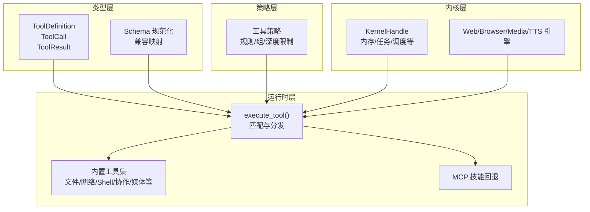
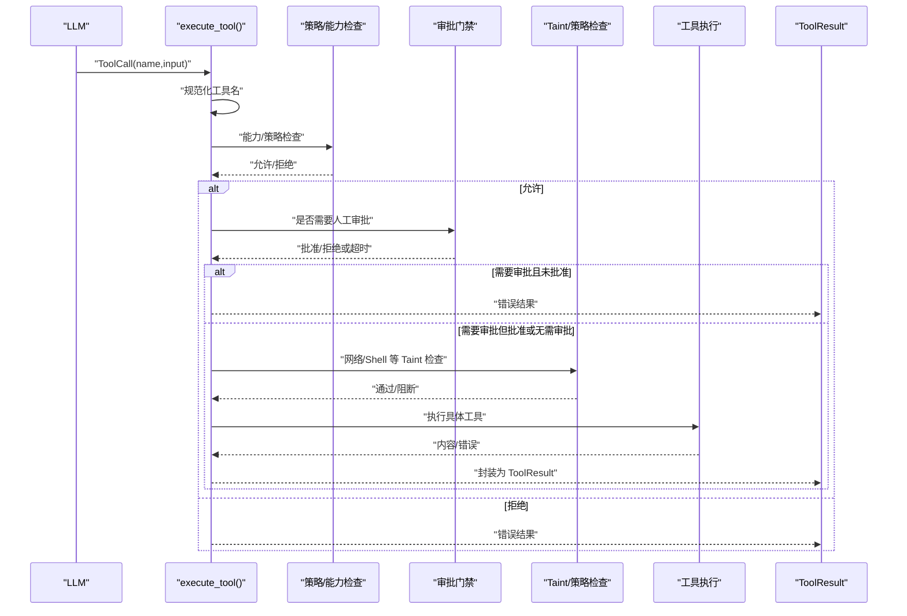
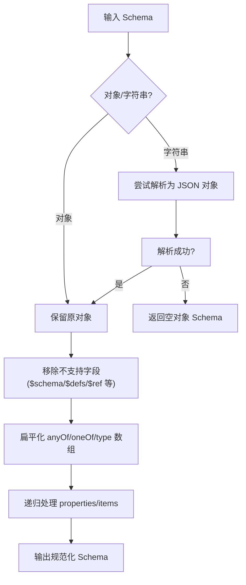
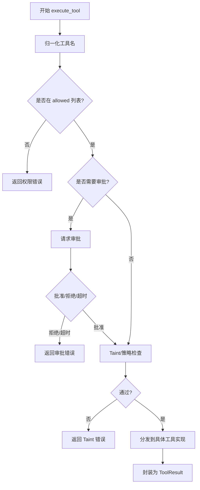
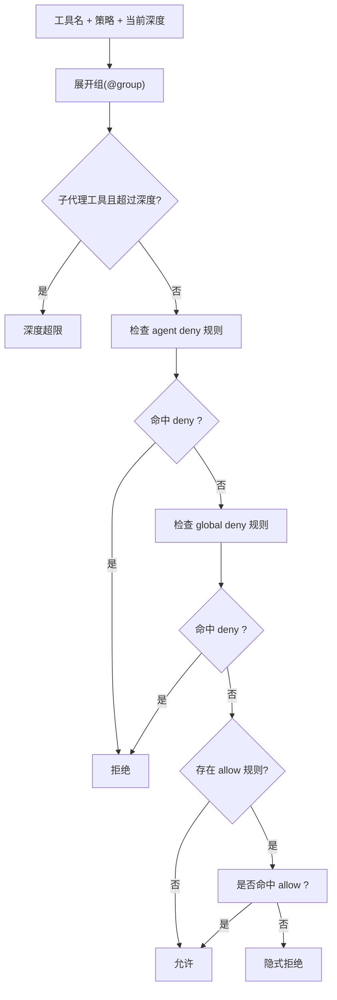
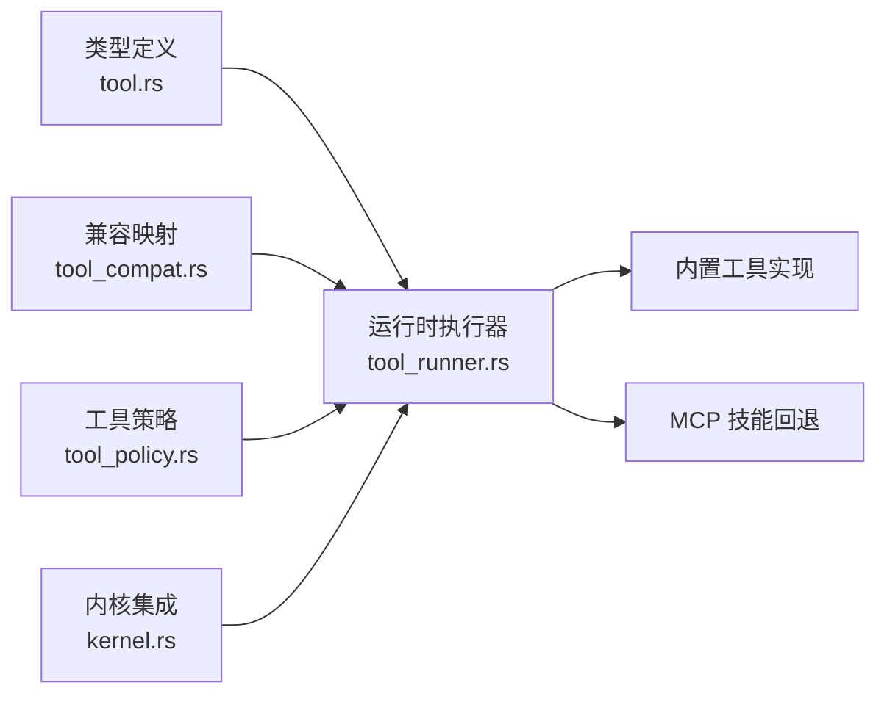

# 工具开发

<cite>
**本文引用的文件**
- [crates/openfang-types/src/tool.rs](file://crates/openfang-types/src/tool.rs)
- [crates/openfang-types/src/tool_compat.rs](file://crates/openfang-types/src/tool_compat.rs)
- [crates/openfang-runtime/src/tool_runner.rs](file://crates/openfang-runtime/src/tool_runner.rs)
- [crates/openfang-runtime/src/tool_policy.rs](file://crates/openfang-runtime/src/tool_policy.rs)
- [crates/openfang-kernel/src/kernel.rs](file://crates/openfang-kernel/src/kernel.rs)
- [crates/openfang-types/src/error.rs](file://crates/openfang-types/src/error.rs)
- [crates/openfang-runtime/src/loop_guard.rs](file://crates/openfang-runtime/src/loop_guard.rs)
- [crates/openfang-kernel/tests/integration_test.rs](file://crates/openfang-kernel/tests/integration_test.rs)
- [agents/orchestrator/agent.toml](file://agents/orchestrator/agent.toml)
</cite>

## 目录
1. [简介](#简介)
2. [项目结构](#项目结构)
3. [核心组件](#核心组件)
4. [架构总览](#架构总览)
5. [详细组件分析](#详细组件分析)
6. [依赖关系分析](#依赖关系分析)
7. [性能考量](#性能考量)
8. [故障排查指南](#故障排查指南)
9. [结论](#结论)
10. [附录](#附录)

## 简介
本指南面向在 OpenFang 平台上开发“工具”的工程师，系统阐述工具函数的实现要求、输入参数校验与返回值格式化规范；说明工具注册与执行流程（execute_tool 匹配块）、工具定义配置与兼容映射；解释工具权限管理、内核访问控制、错误处理模式；并提供工具测试编写、文档注释要求、性能优化建议、安全注意事项与调试方法。同时，结合内置工具实现与分类标准，给出可复用策略与最佳实践。

## 项目结构
OpenFang 将“工具”能力拆分为类型定义、运行时执行器、策略与权限、内核集成等模块，形成清晰分层：
- 类型层：定义工具调用、结果、输入模式与跨 Provider 的 Schema 规范化
- 运行时层：集中式工具执行器，负责能力检查、审批门禁、Taint 检测、多来源工具分发
- 策略层：基于规则组与深度限制的细粒度访问控制
- 内核层：为工具提供内核句柄、上下文资源与生命周期管理

图示来源
- [crates/openfang-types/src/tool.rs:6-36](file://crates/openfang-types/src/tool.rs#L6-L36)
- [crates/openfang-types/src/tool_compat.rs:40-50](file://crates/openfang-types/src/tool_compat.rs#L40-L50)
- [crates/openfang-runtime/src/tool_runner.rs:90-526](file://crates/openfang-runtime/src/tool_runner.rs#L90-L526)
- [crates/openfang-runtime/src/tool_policy.rs:36-145](file://crates/openfang-runtime/src/tool_policy.rs#L36-L145)
- [crates/openfang-kernel/src/kernel.rs:98-113](file://crates/openfang-kernel/src/kernel.rs#L98-L113)

章节来源
- [crates/openfang-types/src/tool.rs:1-650](file://crates/openfang-types/src/tool.rs#L1-L650)
- [crates/openfang-types/src/tool_compat.rs:1-215](file://crates/openfang-types/src/tool_compat.rs#L1-L215)
- [crates/openfang-runtime/src/tool_runner.rs:1-800](file://crates/openfang-runtime/src/tool_runner.rs#L1-L800)
- [crates/openfang-runtime/src/tool_policy.rs:1-479](file://crates/openfang-runtime/src/tool_policy.rs#L1-L479)
- [crates/openfang-kernel/src/kernel.rs:1-200](file://crates/openfang-kernel/src/kernel.rs#L1-L200)

## 核心组件
- 工具类型与 Schema 规范化
  - 定义工具调用、结果与输入模式，提供跨 Provider 的 Schema 规范化函数，确保 anyOf/oneOf、$ref/$defs、格式字段等在不同模型上的兼容性
- 工具执行器 execute_tool
  - 能力白名单检查、审批门禁、Taint 检测（网络抓取/Shell）、多来源分发（内置工具/MCP 技能）
- 工具策略与权限
  - 基于规则组与通配符的 deny-wins 策略，支持全局/代理级规则、深度限制与并发限制
- 内核集成
  - 提供 KernelHandle 以启用跨代理协作、共享内存、任务队列、调度等能力

章节来源
- [crates/openfang-types/src/tool.rs:6-36](file://crates/openfang-types/src/tool.rs#L6-L36)
- [crates/openfang-types/src/tool.rs:38-224](file://crates/openfang-types/src/tool.rs#L38-L224)
- [crates/openfang-runtime/src/tool_runner.rs:90-526](file://crates/openfang-runtime/src/tool_runner.rs#L90-L526)
- [crates/openfang-runtime/src/tool_policy.rs:36-145](file://crates/openfang-runtime/src/tool_policy.rs#L36-L145)
- [crates/openfang-kernel/src/kernel.rs:98-113](file://crates/openfang-kernel/src/kernel.rs#L98-L113)

## 架构总览
下图展示从 LLM 请求到工具执行的关键路径：名称归一化、能力检查、审批门禁、Taint 检查、执行与结果封装。

图示来源
- [crates/openfang-types/src/tool_compat.rs:40-50](file://crates/openfang-types/src/tool_compat.rs#L40-L50)
- [crates/openfang-runtime/src/tool_runner.rs:118-171](file://crates/openfang-runtime/src/tool_runner.rs#L118-L171)
- [crates/openfang-runtime/src/tool_runner.rs:182-266](file://crates/openfang-runtime/src/tool_runner.rs#L182-L266)
- [crates/openfang-runtime/src/tool_runner.rs:514-526](file://crates/openfang-runtime/src/tool_runner.rs#L514-L526)

章节来源
- [crates/openfang-runtime/src/tool_runner.rs:90-526](file://crates/openfang-runtime/src/tool_runner.rs#L90-L526)

## 详细组件分析

### 工具类型与 Schema 规范化
- 工具三元组
  - ToolDefinition：name/description/input_schema
  - ToolCall：id/name/input
  - ToolResult：tool_use_id/content/is_error
- Schema 规范化策略
  - 对特定 Provider（如 Gemini/Groq）移除不支持字段（$schema/$defs/$ref 等），扁平化 anyOf/oneOf 与 type 数组，处理 null 可空场景
  - 支持字符串形式的 inputSchema 解析与递归规范化
- 兼容映射
  - 将 OpenClaw/别名风格工具名映射到 OpenFang 标准名，并提供标准化函数

图示来源
- [crates/openfang-types/src/tool.rs:38-173](file://crates/openfang-types/src/tool.rs#L38-L173)
- [crates/openfang-types/src/tool.rs:175-224](file://crates/openfang-types/src/tool.rs#L175-L224)

章节来源
- [crates/openfang-types/src/tool.rs:6-36](file://crates/openfang-types/src/tool.rs#L6-L36)
- [crates/openfang-types/src/tool.rs:38-224](file://crates/openfang-types/src/tool.rs#L38-L224)
- [crates/openfang-types/src/tool_compat.rs:1-215](file://crates/openfang-types/src/tool_compat.rs#L1-L215)

### 工具执行器 execute_tool
- 名称归一化：通过兼容映射将 LLM 可能的别名转换为标准 OpenFang 名称
- 能力检查：仅允许在 allowed 列表中的工具执行
- 审批门禁：若工具需人工审批，先请求审批再执行
- Taint 检测：
  - 网络抓取：阻断含密钥/令牌/密码等敏感信息的 URL
  - Shell 执行：阻断元字符注入；在非 Full 策略下进行启发式模式检测
- 多来源分发：
  - 内置工具：文件/网络/Shell/协作/媒体/图像/浏览器/进程/Docker 等
  - MCP 工具：按前缀 mcp_{server}_{tool} 分发至已连接的 MCP 服务器
  - 技能工具：通过技能注册表回退执行
- 结果封装：统一包装为 ToolResult，错误路径自动标注 is_error

图示来源
- [crates/openfang-runtime/src/tool_runner.rs:90-526](file://crates/openfang-runtime/src/tool_runner.rs#L90-L526)

章节来源
- [crates/openfang-runtime/src/tool_runner.rs:90-526](file://crates/openfang-runtime/src/tool_runner.rs#L90-L526)

### 工具策略与权限
- 规则与组
  - ToolPolicyRule：pattern(effect)，支持通配符与组引用 @group
  - ToolGroup：命名工具模式集合
- 解析逻辑
  - deny-wins：agent 规则优先于 global 规则；deny 胜过 allow；无规则默认允许
  - 组展开：将工具名扩展为匹配的组名，便于统一授权
- 深度与并发限制
  - 子代理最大深度、叶子节点额外限制（如禁止 agent_spawn/agent_kill）
  - 提供按深度过滤工具列表的函数

图示来源
- [crates/openfang-runtime/src/tool_policy.rs:76-145](file://crates/openfang-runtime/src/tool_policy.rs#L76-L145)
- [crates/openfang-runtime/src/tool_policy.rs:249-275](file://crates/openfang-runtime/src/tool_policy.rs#L249-L275)

章节来源
- [crates/openfang-runtime/src/tool_policy.rs:36-145](file://crates/openfang-runtime/src/tool_policy.rs#L36-L145)
- [crates/openfang-runtime/src/tool_policy.rs:249-275](file://crates/openfang-runtime/src/tool_policy.rs#L249-L275)

### 内核集成与上下文
- KernelHandle：为工具提供跨代理通信、共享内存、任务队列、调度、知识图谱等能力
- 上下文资源：Web 搜索/抓取、浏览器自动化、媒体理解、TTS、进程管理、Docker 沙箱等
- 内置工具定义：集中导出所有内置工具的 ToolDefinition 列表，供 LLM 选择

章节来源
- [crates/openfang-kernel/src/kernel.rs:98-113](file://crates/openfang-kernel/src/kernel.rs#L98-L113)
- [crates/openfang-runtime/src/tool_runner.rs:528-800](file://crates/openfang-runtime/src/tool_runner.rs#L528-L800)

### 内置工具实现要点（节选）
- 文件系统：file_read/file_write/file_list/apply_patch
- 网络：web_fetch（SSRF 保护）、web_search（多 Provider 回退）
- Shell：shell_exec（元字符阻断 + 执行策略 + Taint 检测）
- 协作：agent_send/agent_spawn/agent_list/agent_kill、task_*、event_publish、schedule_*、knowledge_*、memory_*、agent_find
- 媒体：image_analyze、media_describe/transcribe、image_generate、text_to_speech/speech_to_text
- 浏览器：browser_navigate/click/type/screenshot/read_page/close/scroll/wait/run_js/back
- 其他：location_get、system_time、cron_*、channel_send、process_*、hand_*、a2a_*、docker_exec、canvas_present

章节来源
- [crates/openfang-runtime/src/tool_runner.rs:174-451](file://crates/openfang-runtime/src/tool_runner.rs#L174-L451)
- [crates/openfang-runtime/src/tool_runner.rs:528-800](file://crates/openfang-runtime/src/tool_runner.rs#L528-L800)

## 依赖关系分析
- 类型依赖：工具类型被运行时执行器与策略模块广泛使用
- 执行器依赖：策略（能力/审批/Taint）、内核句柄、上下文引擎（Web/Browser/Media/TTS/Process/Docker）
- 内核依赖：运行时工具定义、MCP 连接、技能注册表、浏览器/媒体/TTS 引擎

图示来源
- [crates/openfang-types/src/tool.rs:6-36](file://crates/openfang-types/src/tool.rs#L6-L36)
- [crates/openfang-types/src/tool_compat.rs:40-50](file://crates/openfang-types/src/tool_compat.rs#L40-L50)
- [crates/openfang-runtime/src/tool_runner.rs:90-526](file://crates/openfang-runtime/src/tool_runner.rs#L90-L526)
- [crates/openfang-runtime/src/tool_policy.rs:36-145](file://crates/openfang-runtime/src/tool_policy.rs#L36-L145)
- [crates/openfang-kernel/src/kernel.rs:98-113](file://crates/openfang-kernel/src/kernel.rs#L98-L113)

章节来源
- [crates/openfang-runtime/src/tool_runner.rs:90-526](file://crates/openfang-runtime/src/tool_runner.rs#L90-L526)
- [crates/openfang-runtime/src/tool_policy.rs:36-145](file://crates/openfang-runtime/src/tool_policy.rs#L36-L145)
- [crates/openfang-kernel/src/kernel.rs:98-113](file://crates/openfang-kernel/src/kernel.rs#L98-L113)

## 性能考量
- 执行策略与 Taint 检查成本
  - Shell 元字符检测与策略校验为常数时间，网络抓取与浏览器自动化涉及外部 IO，应避免重复调用相同参数
- 循环防护
  - 通过最近调用序列与参数哈希检测连续重复调用，防止无限循环
- 资源隔离
  - Docker 沙箱与进程管理可降低资源滥用风险；合理设置并发上限与超时
- 缓存与回退
  - Web 搜索/抓取具备缓存与多 Provider 回退，减少失败重试开销

章节来源
- [crates/openfang-runtime/src/loop_guard.rs:194-509](file://crates/openfang-runtime/src/loop_guard.rs#L194-L509)

## 故障排查指南
- 权限与能力
  - 若返回“权限不足”，检查 agent.toml 中 capabilities.tools 是否包含该工具
- 审批门禁
  - 若返回“需要人工审批且被拒绝/超时”，确认内核审批配置与交互流程
- Taint 检测
  - 网络抓取/Shell 执行被阻断时，检查输入参数中是否包含敏感信息或可疑模式
- 错误类型
  - 使用 OpenFangError 的 ToolExecution 等变体定位工具执行失败原因
- 集成测试参考
  - 参考内核集成测试，验证从内核启动、代理创建到消息往返的完整链路

章节来源
- [crates/openfang-types/src/error.rs:41-48](file://crates/openfang-types/src/error.rs#L41-L48)
- [crates/openfang-kernel/tests/integration_test.rs:27-84](file://crates/openfang-kernel/tests/integration_test.rs#L27-L84)

## 结论
OpenFang 的工具体系以类型安全、策略可控、安全优先为核心设计原则。开发者在实现自定义工具时，应遵循输入参数校验与返回值格式化规范，利用兼容映射与 Schema 规范化提升跨 Provider 的一致性，严格遵守能力检查、审批门禁与 Taint 检测，借助内核上下文与内置工具实现高效复用。通过完善的测试与文档注释，持续优化性能与安全性，构建稳定可靠的自动化能力。

## 附录

### 工具实现要求与规范
- 输入参数验证
  - 使用 JSON Schema 描述必填字段与类型约束；对敏感字段（URL、命令、密钥）进行 Taint 检测
  - 对 Shell 命令进行元字符阻断与执行策略校验
- 返回值格式化
  - 统一返回字符串内容；错误路径标注 is_error=true，便于上层识别
- 工具注册与定义
  - 在内置工具定义列表中新增 ToolDefinition，确保 name/description/input_schema 完整
  - 如为 MCP 或技能工具，确保前缀与回退路径正确
- 执行流程
  - 在 execute_tool 的匹配分支中新增工具处理逻辑；必要时接入 KernelHandle 与上下文资源

章节来源
- [crates/openfang-types/src/tool.rs:6-36](file://crates/openfang-types/src/tool.rs#L6-L36)
- [crates/openfang-types/src/tool.rs:38-224](file://crates/openfang-types/src/tool.rs#L38-L224)
- [crates/openfang-runtime/src/tool_runner.rs:90-526](file://crates/openfang-runtime/src/tool_runner.rs#L90-L526)
- [crates/openfang-runtime/src/tool_runner.rs:528-800](file://crates/openfang-runtime/src/tool_runner.rs#L528-L800)

### 工具权限管理与内核访问
- 能力清单
  - 在 agent.toml 的 capabilities.tools 中显式授予工具使用权限
- 审批门禁
  - 对高危工具启用审批流程，确保人机协同
- 内核句柄
  - 通过 KernelHandle 实现跨代理通信、共享内存、任务队列、调度等功能

章节来源
- [agents/orchestrator/agent.toml:58-64](file://agents/orchestrator/agent.toml#L58-L64)
- [crates/openfang-kernel/src/kernel.rs:98-113](file://crates/openfang-kernel/src/kernel.rs#L98-L113)
- [crates/openfang-runtime/src/tool_runner.rs:136-171](file://crates/openfang-runtime/src/tool_runner.rs#L136-L171)

### 错误处理模式
- 统一错误封装：execute_tool 将内部错误转换为 ToolResult.is_error=true 的错误消息
- OpenFangError：提供系统级错误类型，便于上层捕获与诊断
- 循环防护：检测重复调用并发出警告或阻断，防止死循环

章节来源
- [crates/openfang-types/src/error.rs:41-48](file://crates/openfang-types/src/error.rs#L41-L48)
- [crates/openfang-runtime/src/tool_runner.rs:514-526](file://crates/openfang-runtime/src/tool_runner.rs#L514-L526)
- [crates/openfang-runtime/src/loop_guard.rs:194-509](file://crates/openfang-runtime/src/loop_guard.rs#L194-L509)

### 工具测试编写与文档注释
- 测试建议
  - 单元测试覆盖输入参数边界、Schema 合规性、Taint 检测触发点
  - 集成测试参考内核集成测试，验证端到端链路
- 文档注释
  - 工具描述应简洁明确，说明用途、输入参数与典型返回
  - 对高风险工具（Shell/网络/进程）强调安全注意事项与最小权限原则

章节来源
- [crates/openfang-kernel/tests/integration_test.rs:27-84](file://crates/openfang-kernel/tests/integration_test.rs#L27-L84)

### 性能考虑因素
- 避免重复调用相同参数；对昂贵操作（网络/浏览器/媒体）增加缓存与超时
- 合理设置执行策略与并发上限；必要时启用 Docker 沙箱隔离
- 使用内置工具的多 Provider 回退与缓存机制，降低失败重试成本

章节来源
- [crates/openfang-runtime/src/loop_guard.rs:194-509](file://crates/openfang-runtime/src/loop_guard.rs#L194-L509)

### 安全注意事项
- Shell 元字符注入：始终阻断；在非 Full 策略下进行启发式检测
- 网络抓取：阻断含敏感信息的 URL；避免数据外泄
- 最小权限：仅授予必要的工具与环境变量；严格控制审批与深度限制

章节来源
- [crates/openfang-runtime/src/tool_runner.rs:27-75](file://crates/openfang-runtime/src/tool_runner.rs#L27-L75)
- [crates/openfang-runtime/src/tool_runner.rs:213-266](file://crates/openfang-runtime/src/tool_runner.rs#L213-L266)
- [crates/openfang-runtime/src/tool_policy.rs:249-275](file://crates/openfang-runtime/src/tool_policy.rs#L249-L275)

### 调试方法
- 日志与追踪：关注 execute_tool 的调试日志与策略决策路径
- 集成测试：通过内核集成测试快速验证工具链路
- 循环防护：观察警告/阻断提示，调整工具调用策略

章节来源
- [crates/openfang-runtime/src/tool_runner.rs:173-173](file://crates/openfang-runtime/src/tool_runner.rs#L173-L173)
- [crates/openfang-kernel/tests/integration_test.rs:27-84](file://crates/openfang-kernel/tests/integration_test.rs#L27-L84)
- [crates/openfang-runtime/src/loop_guard.rs:194-509](file://crates/openfang-runtime/src/loop_guard.rs#L194-L509)