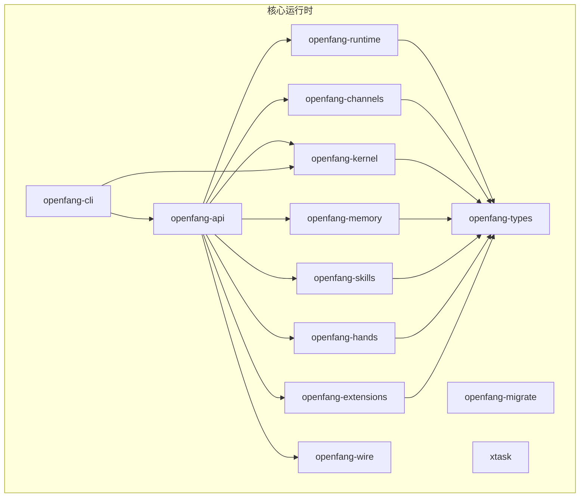
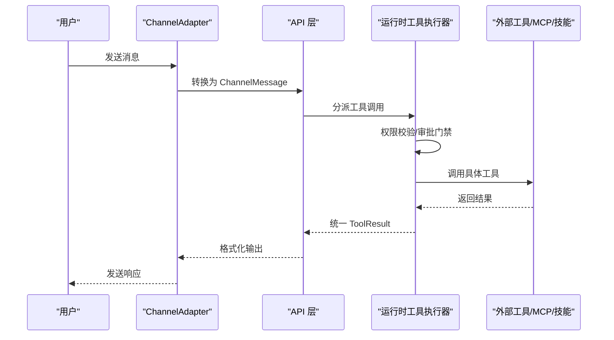
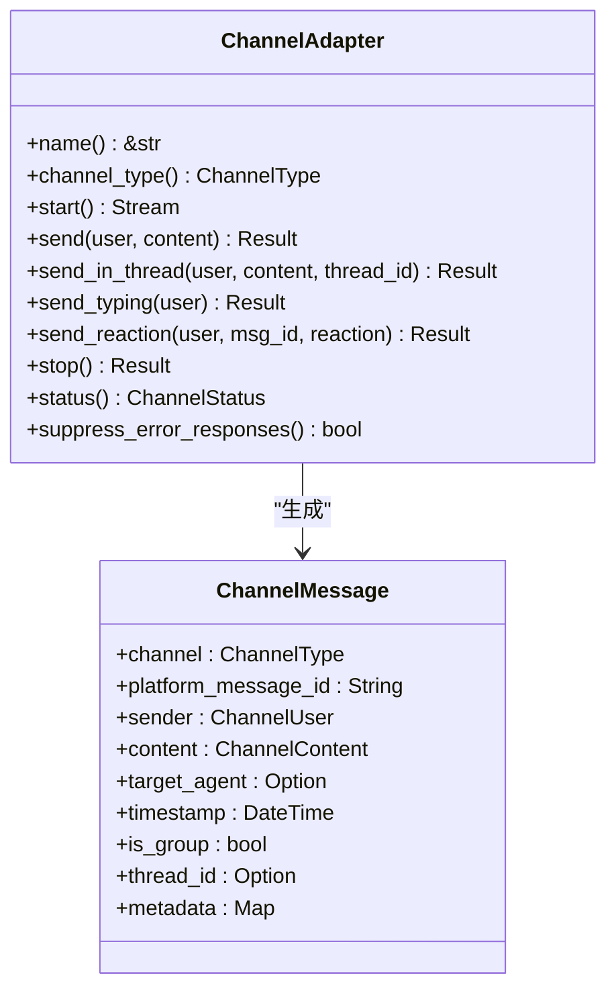
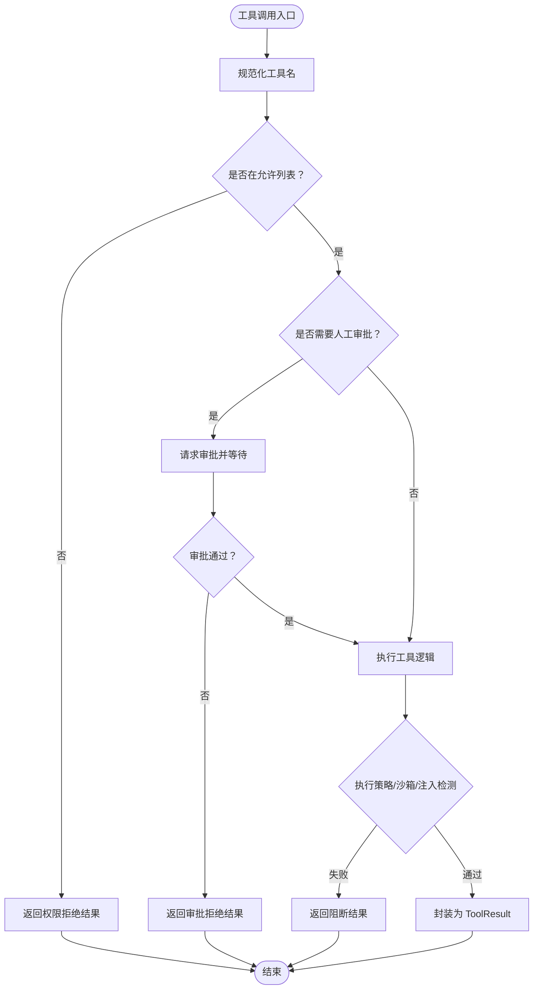
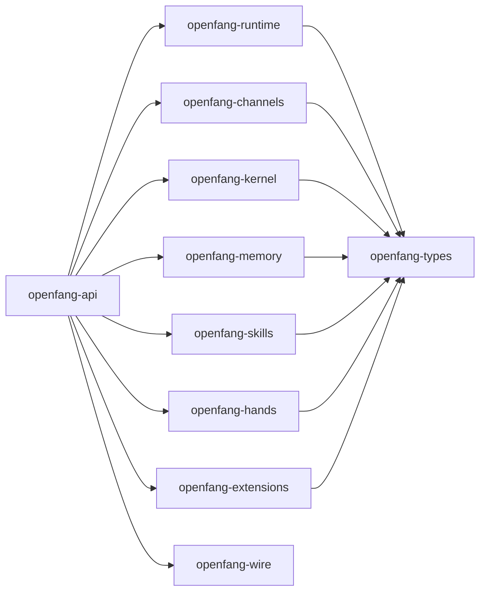

# 扩展开发指南

<cite>
**本文档引用的文件**
- [README.md](file://README.md)
- [CONTRIBUTING.md](file://CONTRIBUTING.md)
- [Cargo.toml](file://Cargo.toml)
- [crates/openfang-api/Cargo.toml](file://crates/openfang-api/Cargo.toml)
- [crates/openfang-channels/src/lib.rs](file://crates/openfang-channels/src/lib.rs)
- [crates/openfang-channels/src/types.rs](file://crates/openfang-channels/src/types.rs)
- [crates/openfang-channels/src/telegram.rs](file://crates/openfang-channels/src/telegram.rs)
- [crates/openfang-runtime/src/lib.rs](file://crates/openfang-runtime/src/lib.rs)
- [crates/openfang-runtime/src/tool_runner.rs](file://crates/openfang-runtime/src/tool_runner.rs)
- [crates/openfang-runtime/src/browser.rs](file://crates/openfang-runtime/src/browser.rs)
- [crates/openfang-types/src/lib.rs](file://crates/openfang-types/src/lib.rs)
- [crates/openfang-types/src/agent.rs](file://crates/openfang-types/src/agent.rs)
- [crates/openfang-types/src/tool.rs](file://crates/openfang-types/src/tool.rs)
- [crates/openfang-extensions/src/lib.rs](file://crates/openfang-extensions/src/lib.rs)
- [crates/openfang-hands/bundled/researcher/HAND.toml](file://crates/openfang-hands/bundled/researcher/HAND.toml)
</cite>

## 目录
1. [简介](#简介)
2. [项目结构](#项目结构)
3. [核心组件](#核心组件)
4. [架构总览](#架构总览)
5. [详细组件分析](#详细组件分析)
6. [依赖关系分析](#依赖关系分析)
7. [性能考虑](#性能考虑)
8. [故障排除指南](#故障排除指南)
9. [结论](#结论)
10. [附录](#附录)

## 简介
本指南面向希望为 OpenFang 开发扩展的工程师，涵盖以下主题：
- 新增智能体模板（agent.toml 编写与系统提示词设置）
- 消息渠道适配器开发：ChannelAdapter trait 实现、适配器注册、配置支持
- 工具开发流程：工具函数实现、注册到 execute_tool、工具定义添加
- 测试编写要求、文档更新、PR 提交流程
- 实际开发示例、最佳实践建议、常见问题解决方案

OpenFang 是用 Rust 构建的开源智能体操作系统，具备 14 个核心 crate，支持 40+ 消息渠道、内置 50+ 工具、能力门禁、审计链、沙箱与安全防护等特性。

## 项目结构
OpenFang 采用多 crate 的模块化组织方式，核心模块包括：
- openfang-types：共享类型与安全模型
- openfang-runtime：运行时、工具执行、浏览器自动化、驱动层
- openfang-channels：40+ 渠道适配器桥接层
- openfang-api：REST/WS/SSE API、仪表盘
- openfang-kernel：内核编排、工作流、调度、配额
- openfang-memory：内存子系统（SQLite + 向量）
- openfang-skills：技能系统与市场
- openfang-hands：自主 Hand 包
- openfang-extensions：MCP 集成、凭据存储、OAuth
- openfang-wire：P2P 协议
- openfang-cli：CLI 与桌面应用
- openfang-migrate：迁移引擎
- xtask：构建任务

图表来源
- [crates/openfang-api/Cargo.toml:8-38](file://crates/openfang-api/Cargo.toml#L8-L38)
- [crates/openfang-runtime/src/lib.rs:1-59](file://crates/openfang-runtime/src/lib.rs#L1-L59)
- [crates/openfang-channels/src/lib.rs:1-55](file://crates/openfang-channels/src/lib.rs#L1-L55)

章节来源
- [README.md:231-250](file://README.md#L231-L250)

## 核心组件
- 类型与安全模型（openfang-types）：定义 AgentManifest、ToolDefinition、能力门禁、JSON Schema 规范化、跨提供商兼容处理等
- 运行时（openfang-runtime）：工具执行引擎、浏览器自动化、LLM 驱动、A2A、MCP、进程沙箱、媒体理解
- 渠道适配器（openfang-channels）：统一 ChannelMessage 抽象，实现 40+ 平台适配器
- API 层（openfang-api）：REST/WS/SSE、OpenAI 兼容接口、仪表盘
- 内核（openfang-kernel）：工作流、调度、配额、心跳、触发器、配额
- 扩展系统（openfang-extensions）：MCP 模板、凭据存储、OAuth、健康检查
- 技能系统（openfang-skills）：技能注册表、市场、兼容性
- 自主 Hand（openfang-hands）：Hand.toml、SKILL.md、生命周期管理
- CLI/桌面（openfang-cli/openfang-desktop）：守护进程、TUI、MCP 服务模式

章节来源
- [crates/openfang-types/src/lib.rs:1-82](file://crates/openfang-types/src/lib.rs#L1-L82)
- [crates/openfang-runtime/src/lib.rs:1-59](file://crates/openfang-runtime/src/lib.rs#L1-L59)
- [crates/openfang-channels/src/lib.rs:1-55](file://crates/openfang-channels/src/lib.rs#L1-L55)
- [crates/openfang-api/Cargo.toml:8-38](file://crates/openfang-api/Cargo.toml#L8-L38)

## 架构总览
OpenFang 的扩展开发围绕“类型-运行时-适配器-工具”四条主线展开：
- 类型层：标准化工具定义、输入参数、能力声明，确保跨提供商兼容
- 运行时层：集中式工具执行器，负责权限校验、审批门禁、策略执行、错误包装
- 适配器层：将平台消息抽象为统一 ChannelMessage，并通过 API 层路由到内核
- 工具层：内置工具与 MCP/技能工具统一接入 execute_tool 分发器

图表来源
- [crates/openfang-channels/src/types.rs:215-280](file://crates/openfang-channels/src/types.rs#L215-L280)
- [crates/openfang-runtime/src/tool_runner.rs:99-526](file://crates/openfang-runtime/src/tool_runner.rs#L99-L526)

## 详细组件分析

### 智能体模板开发（agent.toml 与系统提示词）
- 模板位置：agents/<your-agent>/agent.toml
- 关键字段：
  - 基本信息：name、version、description、author、module
  - 调度与资源：schedule、resources（令牌/网络/成本配额）
  - 模型配置：provider、model、max_tokens、temperature、system_prompt
  - 能力与工具：capabilities.tools、memory_*、agent_*、shell、network
  - 技能与 MCP：skills、mcp_servers
  - 元数据与标签：metadata、tags
  - 可选增强：routing（按复杂度自动选型）、autonomous（24/7 代理守卫）

系统提示词设置要点：
- 将长篇系统提示放入 [model] 段落的 system_prompt 字段
- 使用分阶段操作手册风格，明确 Phase 0-7 的职责与输出格式
- 在提示词中加入“Guidelines”和“Constraints”，确保可执行与可审计

测试与验证：
- 使用 openfang agent spawn <path> 启动并交互
- 通过 openfang chat <agent> 或仪表盘进行端到端验证

章节来源
- [CONTRIBUTING.md:158-212](file://CONTRIBUTING.md#L158-L212)
- [crates/openfang-types/src/agent.rs:424-494](file://crates/openfang-types/src/agent.rs#L424-L494)
- [crates/openfang-types/src/agent.rs:370-403](file://crates/openfang-types/src/agent.rs#L370-L403)

### 消息渠道适配器开发（ChannelAdapter）
- ChannelAdapter trait 要求：
  - name()/channel_type()：标识适配器与通道类型
  - start()：返回异步消息流（Stream<Item = ChannelMessage>）
  - send()/send_in_thread()：发送内容（文本/图片/文件/语音/位置/命令）
  - send_typing()/send_reaction()：可选
  - stop()：清理资源
  - status()：可选健康状态
  - suppress_error_responses()：对公开广播类频道抑制内部错误回显

- 注册与集成：
  - 在 crates/openfang-channels/src/lib.rs 中新增模块导出
  - 在 API 层的 channel_bridge 中注册启动逻辑，使适配器随守护进程启动
  - 在 openfang-types 的配置结构中增加 [channels.<platform>] 支持

- 配置支持：
  - 为新平台在配置文件中添加对应节，如 [channels.myplatform]
  - 在 CLI 初始化向导中增加设置步骤

- 示例参考：
  - Telegram 适配器展示了长轮询、HTML 安全净化、线程回复、速率限制与健康检查

图表来源
- [crates/openfang-channels/src/types.rs:215-280](file://crates/openfang-channels/src/types.rs#L215-L280)
- [crates/openfang-channels/src/types.rs:74-96](file://crates/openfang-channels/src/types.rs#L74-L96)

章节来源
- [CONTRIBUTING.md:215-268](file://CONTRIBUTING.md#L215-L268)
- [crates/openfang-channels/src/lib.rs:1-55](file://crates/openfang-channels/src/lib.rs#L1-L55)
- [crates/openfang-channels/src/types.rs:12-27](file://crates/openfang-channels/src/types.rs#L12-L27)
- [crates/openfang-channels/src/telegram.rs:30-73](file://crates/openfang-channels/src/telegram.rs#L30-L73)

### 工具开发流程（execute_tool 注册与工具定义）
- 工具函数实现：
  - 在 openfang-runtime/src/tool_runner.rs 中新增 async 函数
  - 对敏感操作（shell_exec、web_fetch、browser_*）实施 taint 检查与策略校验
  - 使用 allowed_tools、exec_policy、kernel 句柄等参数进行能力与安全控制

- 注册到 execute_tool：
  - 在 execute_tool 的 match 分发中新增分支，映射到新工具名
  - 保持参数解析与错误包装一致（返回 ToolResult）

- 工具定义添加：
  - 在 builtin_tool_definitions() 中追加 ToolDefinition，包含 name、description、input_schema
  - input_schema 使用 JSON Schema，遵循跨提供商兼容规范（normalize_schema_for_provider）

- 能力与清单：
  - 在 agent.toml 的 [capabilities] 中授予工具使用权限
  - 若需要跨实例通信或内核访问，需传入 KernelHandle 并处理 None 场景

图表来源
- [crates/openfang-runtime/src/tool_runner.rs:99-526](file://crates/openfang-runtime/src/tool_runner.rs#L99-L526)
- [crates/openfang-types/src/tool.rs:45-173](file://crates/openfang-types/src/tool.rs#L45-L173)

章节来源
- [CONTRIBUTING.md:271-326](file://CONTRIBUTING.md#L271-L326)
- [crates/openfang-runtime/src/tool_runner.rs:174-512](file://crates/openfang-runtime/src/tool_runner.rs#L174-L512)
- [crates/openfang-types/src/tool.rs:5-14](file://crates/openfang-types/src/tool.rs#L5-L14)

### 扩展系统与 MCP 集成
- 扩展注册与安装：
  - openfang-extensions 提供集成模板、凭据存储、OAuth、健康检查与安装器
  - 在 integrations.toml 中记录已安装集成状态与配置覆盖

- MCP 工具分发：
  - execute_tool 支持以 mcp_<server>_<tool> 命名的工具转发
  - 通过已连接的 MCP 连接池查找服务器并调用工具

- OAuth 与凭据：
  - 支持本地回调、密钥加密存储、自动健康检查与重连

章节来源
- [crates/openfang-extensions/src/lib.rs:146-239](file://crates/openfang-extensions/src/lib.rs#L146-L239)
- [crates/openfang-runtime/src/tool_runner.rs:451-481](file://crates/openfang-runtime/src/tool_runner.rs#L451-L481)

### 自主 Hand 包开发
- Hand.toml 结构：
  - id/name/description/category/icon/tools
  - 可配置设置（settings）与仪表盘指标（dashboard.metrics）
  - 系统提示词（system_prompt）与工具集组合

- 开发流程：
  - 在 crates/openfang-hands/bundled/<name>/ 下创建目录与 HAND.toml
  - 添加 SKILL.md 作为领域知识注入
  - 通过 openfang hand activate <name> 启动并监控

章节来源
- [crates/openfang-hands/bundled/researcher/HAND.toml:1-398](file://crates/openfang-hands/bundled/researcher/HAND.toml#L1-L398)

## 依赖关系分析
- crate 间依赖：
  - openfang-api 依赖 openfang-kernel、openfang-runtime、openfang-channels 等
  - openfang-runtime 依赖 openfang-types、openfang-skills、openfang-memory 等
  - openfang-channels 依赖 openfang-types
  - openfang-extensions 依赖 openfang-types

图表来源
- [crates/openfang-api/Cargo.toml:8-38](file://crates/openfang-api/Cargo.toml#L8-L38)

章节来源
- [crates/openfang-api/Cargo.toml:8-38](file://crates/openfang-api/Cargo.toml#L8-L38)

## 性能考虑
- 工具执行：
  - 使用 execute_tool 的任务局部上下文跟踪调用深度，防止递归过深
  - 对 shell_exec 引入元字符检测与策略白名单，避免高开销与注入风险
- 渠道适配器：
  - 长轮询与指数退避，避免 API 限流与抖动
  - 文本分片与 HTML 净化，减少单次调用失败
- 浏览器自动化：
  - CDP 连接超时与命令超时控制，页面加载轮询上限，避免长时间占用
- 内存与序列化：
  - 统一 JSON Schema 规范化，减少跨提供商适配成本

## 故障排除指南
- 渠道适配器
  - 无法连接：检查 token/URL/代理配置；查看 status() 与 last_error
  - 消息未送达：确认 send()/send_in_thread() 是否正确实现；检查平台限制（长度、格式）
  - 错误回显：对广播类频道启用 suppress_error_responses()

- 工具执行
  - 权限拒绝：检查 agent.toml 的 capabilities.tools 与 allowed_tools
  - 审批拒绝：确认审批门禁与请求详情
  - 注入/策略阻断：查看 shell_exec/web_fetch 的 taint 检测与 exec_policy

- 浏览器自动化
  - CDP 连接失败：确认 Chromium 可用与端口开放；检查超时与读取循环
  - 页面加载超时：调整 PAGE_LOAD_POLL_INTERVAL 与最大轮询次数

章节来源
- [crates/openfang-channels/src/types.rs:255-280](file://crates/openfang-channels/src/types.rs#L255-L280)
- [crates/openfang-runtime/src/tool_runner.rs:136-171](file://crates/openfang-runtime/src/tool_runner.rs#L136-L171)
- [crates/openfang-runtime/src/browser.rs:92-158](file://crates/openfang-runtime/src/browser.rs#L92-L158)

## 结论
通过本指南，开发者可以：
- 快速创建符合 OpenFang 规范的智能体模板与系统提示词
- 正确实现 ChannelAdapter 并完成注册与配置
- 安全地扩展工具集并与现有运行时无缝集成
- 遵循测试与文档规范，保证质量与可维护性

## 附录

### 开发与测试清单
- 代码风格：cargo fmt --all；cargo clippy --workspace --all-targets -- -D warnings
- 单元测试：cargo test --workspace
- 集成测试：针对 LLM 的测试需设置环境变量（如 GROQ_API_KEY、ANTHROPIC_API_KEY）
- 构建：cargo build --workspace；快速发布使用 release-fast profile

章节来源
- [CONTRIBUTING.md:51-100](file://CONTRIBUTING.md#L51-L100)

### 提交流程
- 分支命名：feat/<适配器/工具/功能>、fix/<问题描述>
- 一次关注点单一：一个 PR 仅解决一个问题或实现一个功能
- CI 通过：所有测试、格式与 lint 通过
- 描述清晰：说明变更内容、动机与影响范围

章节来源
- [CONTRIBUTING.md:328-356](file://CONTRIBUTING.md#L328-L356)