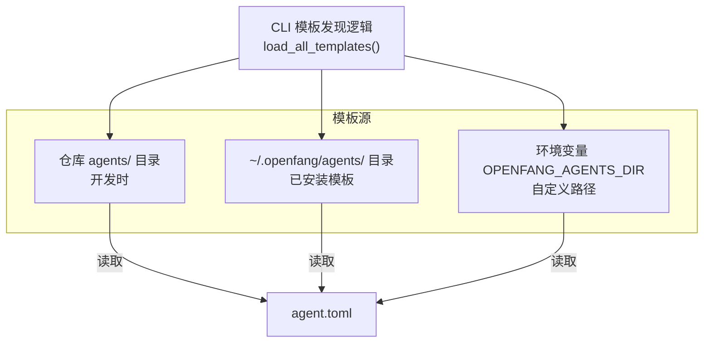
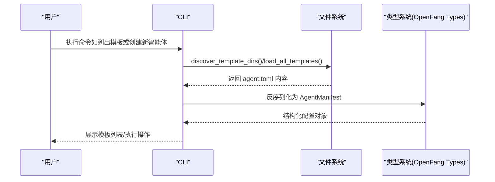
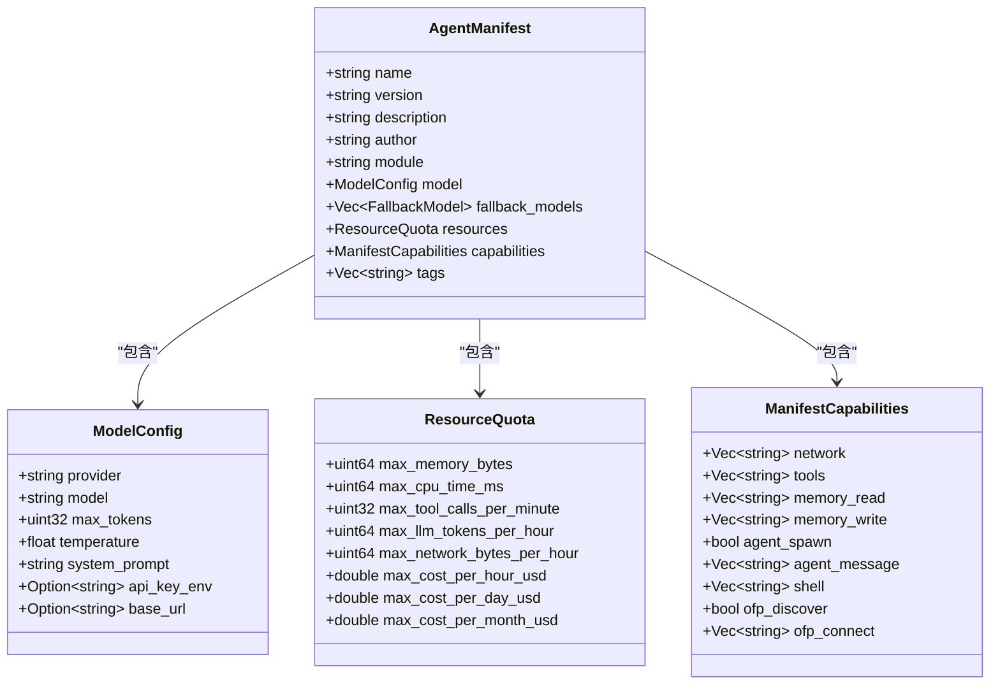

# 智能体模板开发

<cite>
**本文引用的文件**
- [agents/hello-world/agent.toml](file://agents/hello-world/agent.toml)
- [agents/architect/agent.toml](file://agents/architect/agent.toml)
- [agents/coder/agent.toml](file://agents/coder/agent.toml)
- [crates/openfang-types/src/agent.rs](file://crates/openfang-types/src/agent.rs)
- [crates/openfang-cli/src/templates.rs](file://crates/openfang-cli/src/templates.rs)
- [crates/openfang-cli/src/main.rs](file://crates/openfang-cli/src/main.rs)
- [crates/openfang-hands/bundled/browser/HAND.toml](file://crates/openfang-hands/bundled/browser/HAND.toml)
- [crates/openfang-hands/bundled/researcher/HAND.toml](file://crates/openfang-hands/bundled/researcher/HAND.toml)
- [crates/openfang-hands/bundled/clip/HAND.toml](file://crates/openfang-hands/bundled/clip/HAND.toml)
- [README.md](file://README.md)
</cite>

## 目录
1. [简介](#简介)
2. [项目结构](#项目结构)
3. [核心组件](#核心组件)
4. [架构总览](#架构总览)
5. [详细组件分析](#详细组件分析)
6. [依赖关系分析](#依赖关系分析)
7. [性能考虑](#性能考虑)
8. [故障排查指南](#故障排查指南)
9. [结论](#结论)
10. [附录](#附录)

## 简介
本指南面向希望在 OpenFang Agent OS 上开发与发布智能体模板的开发者。文档聚焦以下目标：
- agents/ 目录结构与模板组织方式
- agent.toml 文件格式与字段语义
- 元数据、模型配置、资源限制、能力声明与工具权限
- 模板测试方法、spawn 命令使用与调试技巧
- 不同类型智能体模板示例与模板分类标准
- 质量检查清单
- HANDS.md 的作用与编写规范（基于 HAND.toml 的实践）

## 项目结构
OpenFang 将“智能体模板”集中放置于仓库根目录下的 agents/ 子目录中，每个子目录代表一个独立的智能体模板，其中包含一个 agent.toml 配置文件。CLI 在加载模板时会从多个位置发现模板目录，并优先使用本地仓库中的模板，其次使用用户安装的模板目录，最后回退到内置模板。

**图表来源**
- [crates/openfang-cli/src/templates.rs:19-62](file://crates/openfang-cli/src/templates.rs#L19-L62)
- [crates/openfang-cli/src/templates.rs:64-111](file://crates/openfang-cli/src/templates.rs#L64-L111)

**章节来源**
- [crates/openfang-cli/src/templates.rs:15-62](file://crates/openfang-cli/src/templates.rs#L15-L62)
- [crates/openfang-cli/src/templates.rs:64-111](file://crates/openfang-cli/src/templates.rs#L64-L111)

## 核心组件
- 智能体模板（agent.toml）
  - 定义智能体名称、版本、描述、作者等元数据
  - 指定模型驱动（provider、model）、最大上下文长度、采样温度、系统提示词
  - 设置资源配额（如 LLM tokens/hour）
  - 声明能力与工具权限（network、tools、memory、agent_*、shell 等）
  - 可选：标签（tags）、备用模型链（fallback_models）
- 类型与配置模型（AgentManifest、ModelConfig、ResourceQuota、ManifestCapabilities）
  - 定义 agent.toml 的结构化解析与默认值
- CLI 模板发现与加载
  - 支持多源模板发现与回退策略
- HANDS（可选）：用于“自主手”（Hands）的 HAND.toml 与 SKILL.md
  - HAND.toml 描述工具、要求、设置、代理配置与仪表盘指标
  - SKILL.md 提供领域知识注入（本指南不展开 SKILL.md 内容）

**章节来源**
- [crates/openfang-types/src/agent.rs:424-494](file://crates/openfang-types/src/agent.rs#L424-L494)
- [crates/openfang-types/src/agent.rs:370-403](file://crates/openfang-types/src/agent.rs#L370-L403)
- [crates/openfang-types/src/agent.rs:247-282](file://crates/openfang-types/src/agent.rs#L247-L282)
- [crates/openfang-types/src/agent.rs:532-561](file://crates/openfang-types/src/agent.rs#L532-L561)
- [crates/openfang-cli/src/templates.rs:1-138](file://crates/openfang-cli/src/templates.rs#L1-L138)

## 架构总览
下图展示了从 CLI 发现模板到最终解析为 AgentManifest 的流程，以及与类型系统的映射关系。

**图表来源**
- [crates/openfang-cli/src/templates.rs:64-111](file://crates/openfang-cli/src/templates.rs#L64-L111)
- [crates/openfang-types/src/agent.rs:424-494](file://crates/openfang-types/src/agent.rs#L424-L494)

## 详细组件分析

### agent.toml 字段详解与示例
- 必填字段
  - name：智能体名称（字符串）
  - version：语义化版本（字符串）
  - description：简短描述（字符串）
  - author：作者标识（字符串）
  - module：模块路径（如 builtin:chat）
- 模型配置（[model]）
  - provider：提供商名称（字符串）
  - model：模型标识（字符串）
  - max_tokens：最大生成长度（整数）
  - temperature：采样温度（浮点数）
  - system_prompt：系统提示词（多行字符串）
  - 可选：api_key_env、base_url
  - 备用模型链（[[fallback_models]]）：按顺序尝试失败回退
- 资源限制（[resources]）
  - max_llm_tokens_per_hour：每小时 LLM token 上限
  - 可选：max_memory_bytes、max_cpu_time_ms、max_tool_calls_per_minute、max_network_bytes_per_hour、max_cost_per_hour_usd、max_cost_per_day_usd、max_cost_per_month_usd
- 能力与工具权限（[capabilities]）
  - tools：允许使用的工具列表（支持通配符）
  - network：网络访问白名单（支持通配符）
  - memory_read/memory_write：内存读写作用域（支持通配符）
  - agent_spawn：是否允许生成子智能体
  - agent_message：允许向指定智能体发消息
  - shell：允许执行的 shell 命令模式（支持通配符）
- 元数据与标签
  - tags：用于分类与检索的标签数组
- 示例参考
  - hello-world：基础聊天智能体，具备文件读取、网络搜索、记忆存储/召回等能力
  - architect：强调架构设计，具备更强的系统提示词与备用模型链
  - coder：强调编码能力，包含 shell 执行与网络访问

**章节来源**
- [agents/hello-world/agent.toml:1-30](file://agents/hello-world/agent.toml#L1-L30)
- [agents/architect/agent.toml:1-46](file://agents/architect/agent.toml#L1-L46)
- [agents/coder/agent.toml:1-48](file://agents/coder/agent.toml#L1-L48)
- [crates/openfang-types/src/agent.rs:370-403](file://crates/openfang-types/src/agent.rs#L370-L403)
- [crates/openfang-types/src/agent.rs:247-282](file://crates/openfang-types/src/agent.rs#L247-L282)
- [crates/openfang-types/src/agent.rs:532-561](file://crates/openfang-types/src/agent.rs#L532-L561)

### 模板分类标准与示例
- 分类维度
  - 功能领域：研发（coder）、架构（architect）、研究（researcher）、写作（writer）、客服（customer-support）、运维（devops-lead）、安全审计（security-auditor）等
  - 工具能力：最小（仅文件读写）、研究（网络搜索/抓取）、自动化（含 shell 执行）、全量（通配符）
  - 运行模式：交互式聊天（builtin:chat），或作为“自主手”（Hands）长期运行
- 示例
  - hello-world：入门级聊天助手，适合首次体验
  - architect：面向系统设计与技术规划
  - coder：面向代码阅读、实现与测试
  - researcher：面向深度研究与报告生成（可作为 HAND 使用）
  - browser：面向网页自动化（可作为 HAND 使用）
  - clip：面向视频剪辑与短视频生成（可作为 HAND 使用）

**章节来源**
- [README.md:78-108](file://README.md#L78-L108)
- [agents/hello-world/agent.toml:1-30](file://agents/hello-world/agent.toml#L1-L30)
- [agents/architect/agent.toml:1-46](file://agents/architect/agent.toml#L1-L46)
- [agents/coder/agent.toml:1-48](file://agents/coder/agent.toml#L1-L48)

### HANDS.md 的作用与编写规范
- 作用
  - HANDS.md 是“自主手”的领域知识参考文档，随 HAND.toml 一起打包，注入到运行时上下文中，指导智能体在特定任务域内的行为与策略
- 编写规范（基于 HAND.toml 实践）
  - 结构清晰：问题分解、搜索策略、信息收集、交叉验证、报告生成、状态统计
  - 可操作性：提供明确的步骤、命令示例与错误处理建议
  - 可度量性：通过 memory_store 更新指标，便于仪表盘展示
  - 安全性：对敏感动作（如购买）设置审批流程
- 示例参考
  - Browser Hand：网页自动化、表单填写、截图验证、购买审批
  - Researcher Hand：多轮研究、交叉引用、事实核查、报告输出
  - Clip Hand：视频下载、转录、片段提取、字幕烧录、发布到社交平台

**章节来源**
- [crates/openfang-hands/bundled/browser/HAND.toml:110-238](file://crates/openfang-hands/bundled/browser/HAND.toml#L110-L238)
- [crates/openfang-hands/bundled/researcher/HAND.toml:154-376](file://crates/openfang-hands/bundled/researcher/HAND.toml#L154-L376)
- [crates/openfang-hands/bundled/clip/HAND.toml:184-572](file://crates/openfang-hands/bundled/clip/HAND.toml#L184-L572)

### 模板测试方法与调试技巧
- 模板发现与加载
  - 使用 CLI 列出可用模板，确认模板被正确发现与解析
  - 若本地未找到，CLI 会回退到内置模板
- 本地开发与安装
  - 开发时优先在仓库 agents/ 下进行迭代
  - 可通过环境变量 OPENFANG_AGENTS_DIR 指定自定义模板目录
- 调试要点
  - 检查 agent.toml 语法与字段拼写
  - 验证模型 provider/model 是否可用，必要时设置 api_key_env
  - 逐步缩小工具权限范围以降低风险
  - 使用最小化 capabilities/tools 进行快速验证
  - 关注资源配额（如 max_llm_tokens_per_hour）避免超限
- 常见问题定位
  - 模板未显示：确认目录结构与 agent.toml 存在
  - 权限不足：检查 capabilities 中的 tools/network/memory 等声明
  - 资源受限：调整 resources 或减少并发工具调用

**章节来源**
- [crates/openfang-cli/src/templates.rs:15-62](file://crates/openfang-cli/src/templates.rs#L15-L62)
- [crates/openfang-cli/src/templates.rs:64-111](file://crates/openfang-cli/src/templates.rs#L64-L111)
- [crates/openfang-types/src/agent.rs:247-282](file://crates/openfang-types/src/agent.rs#L247-L282)

### spawn 命令使用与工作流
- 创建新智能体
  - 使用 CLI 的 agent 新建命令，选择模板后生成实例
  - 实例会继承模板的 AgentManifest 并可在运行时进一步定制
- 生命周期管理
  - 启动/停止/查看状态/聊天/终止等操作由 CLI 统一提供
- 与 HAND 的关系
  - HAND 通常以“自主手”形式长期运行，而普通智能体多为交互式
  - HAND 的配置与指标可通过 HAND.toml 与 SKILL.md 管理

**章节来源**
- [crates/openfang-cli/src/main.rs:107-125](file://crates/openfang-cli/src/main.rs#L107-L125)
- [README.md:407-430](file://README.md#L407-L430)

## 依赖关系分析
- CLI 依赖模板发现模块加载 agent.toml
- 类型系统负责将 TOML 解析为强类型结构（AgentManifest、ModelConfig、ResourceQuota、ManifestCapabilities）
- 模板字段与类型字段一一对应，确保配置一致性与可验证性

**图表来源**
- [crates/openfang-types/src/agent.rs:424-494](file://crates/openfang-types/src/agent.rs#L424-L494)
- [crates/openfang-types/src/agent.rs:370-403](file://crates/openfang-types/src/agent.rs#L370-L403)
- [crates/openfang-types/src/agent.rs:247-282](file://crates/openfang-types/src/agent.rs#L247-L282)
- [crates/openfang-types/src/agent.rs:532-561](file://crates/openfang-types/src/agent.rs#L532-L561)

## 性能考虑
- 资源配额
  - 合理设置 max_llm_tokens_per_hour、max_tool_calls_per_minute、max_network_bytes_per_hour，避免突发流量导致服务降级
- 模型选择
  - 对简单任务使用低成本模型；复杂任务启用 fallback_models 并控制成本上限
- 并发与超时
  - 工具调用与外部网络请求应设置合理超时，避免阻塞
- 日志与可观测性
  - 通过 memory_store 记录关键指标，结合仪表盘监控运行状态

## 故障排查指南
- 模板未被发现
  - 检查 agents/ 目录是否存在且包含 agent.toml
  - 确认 OPENFANG_AGENTS_DIR 环境变量指向有效路径
- 权限不足
  - 检查 capabilities.tools 与 shell 声明是否覆盖所需工具
  - network 与 memory 作用域需明确授权
- 资源超限
  - 调整 resources 配额或减少并发工具调用
- 模型不可用
  - 确认 provider/model 正确，必要时设置 api_key_env
- 错误恢复
  - 使用最小化配置先行验证，再逐步放开权限与能力

**章节来源**
- [crates/openfang-cli/src/templates.rs:15-62](file://crates/openfang-cli/src/templates.rs#L15-L62)
- [crates/openfang-types/src/agent.rs:247-282](file://crates/openfang-types/src/agent.rs#L247-L282)

## 结论
通过遵循本指南，开发者可以高效地创建、测试与发布智能体模板。重点在于：
- 明确的字段语义与合理的默认值
- 清晰的能力与工具权限声明
- 严格的资源配额与成本控制
- 丰富的示例与分类体系
- 与 HANDS 的协同（若适用）

## 附录

### 质量检查清单
- 配置完整性
  - name、version、description、author、module 是否齐全
  - [model] provider/model/system_prompt/max_tokens/temperature 是否合理
  - [resources] 是否设置关键限额
- 能力与权限
  - capabilities.tools 是否覆盖实际需求
  - network/memory/agent_* 与 shell 是否最小化授权
- 可靠性
  - 是否配置 fallback_models
  - 是否设置合理的 tags 以便检索
- 文档与示例
  - 是否提供简洁的 system_prompt 与示例场景
  - 是否有 HANDS.md（如为 HAND）

### 示例模板路径参考
- hello-world：[agents/hello-world/agent.toml:1-30](file://agents/hello-world/agent.toml#L1-L30)
- architect：[agents/architect/agent.toml:1-46](file://agents/architect/agent.toml#L1-L46)
- coder：[agents/coder/agent.toml:1-48](file://agents/coder/agent.toml#L1-L48)