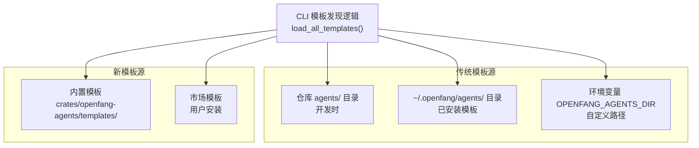
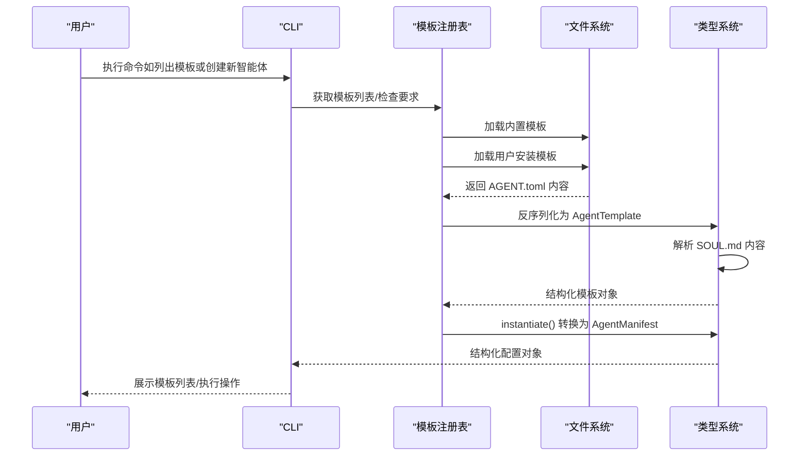
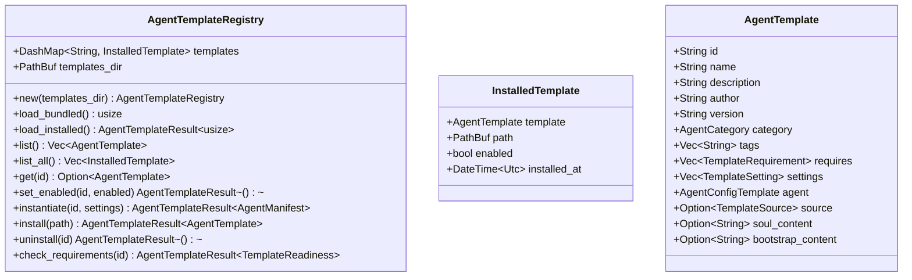
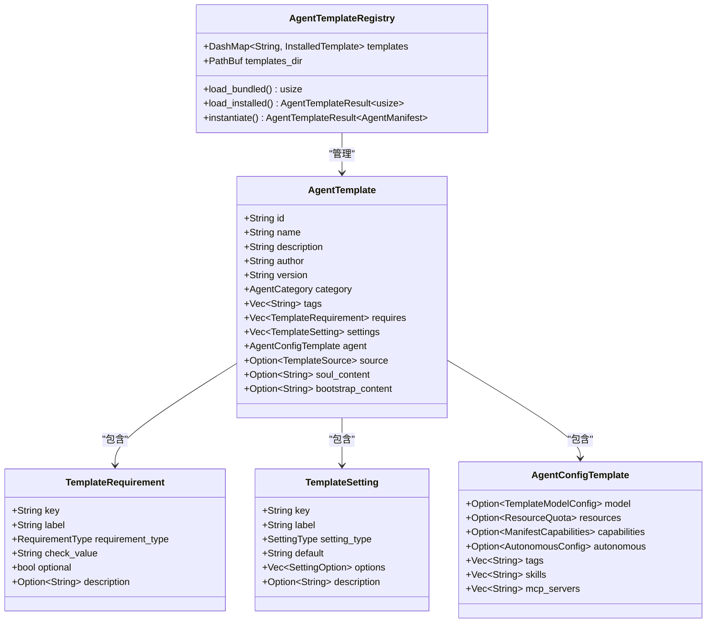

# 智能体模板开发

<cite>
**本文引用的文件**
- [crates/openfang-agents/src/lib.rs](file://crates/openfang-agents/src/lib.rs)
- [crates/openfang-agents/src/registry.rs](file://crates/openfang-agents/src/registry.rs)
- [crates/openfang-agents/templates/data-analyst/AGENT.toml](file://crates/openfang-agents/templates/data-analyst/AGENT.toml)
- [crates/openfang-agents/templates/devops-engineer/AGENT.toml](file://crates/openfang-agents/templates/devops-engineer/AGENT.toml)
- [crates/openfang-agents/templates/data-analyst/SOUL.md](file://crates/openfang-agents/templates/data-analyst/SOUL.md)
- [crates/openfang-cli/src/templates.rs](file://crates/openfang-cli/src/templates.rs)
- [agents/hello-world/agent.toml](file://agents/hello-world/agent.toml)
- [crates/openfang-types/src/agent.rs](file://crates/openfang-types/src/agent.rs)
- [crates/openfang-hands/bundled/browser/HAND.toml](file://crates/openfang-hands/bundled/browser/HAND.toml)
- [crates/openfang-hands/bundled/researcher/HAND.toml](file://crates/openfang-hands/bundled/researcher/HAND.toml)
- [crates/openfang-hands/bundled/clip/HAND.toml](file://crates/openfang-hands/bundled/clip/HAND.toml)
</cite>

## 更新摘要
**所做更改**
- 新增了完整的模板注册表系统文档
- 更新了 AgentTemplate 结构和模板格式说明
- 添加了 TemplateSource、TemplateRequirement、TemplateSetting 等核心类型说明
- 更新了模板分类标准和示例
- 新增了 HANDS.md 的编写规范章节
- 更新了模板测试和调试方法

## 目录
1. [简介](#简介)
2. [项目结构](#项目结构)
3. [核心组件](#核心组件)
4. [架构总览](#架构总览)
5. [详细组件分析](#详细组件分析)
6. [模板注册表系统](#模板注册表系统)
7. [模板格式与字段详解](#模板格式与字段详解)
8. [模板分类标准与示例](#模板分类标准与示例)
9. [HANDS.md 的作用与编写规范](#handsmd-的作用与编写规范)
10. [模板测试方法与调试技巧](#模板测试方法与调试技巧)
11. [spawn 命令使用与工作流](#spawn-命令使用与工作流)
12. [依赖关系分析](#依赖关系分析)
13. [性能考虑](#性能考虑)
14. [故障排查指南](#故障排查指南)
15. [结论](#结论)
16. [附录](#附录)

## 简介
本指南面向希望在 OpenFang Agent OS 上开发与发布智能体模板的开发者。文档聚焦以下目标：
- 新的模板开发框架：AgentTemplate 结构、模板注册表系统
- AGENT.toml 文件格式与字段语义
- 元数据、模型配置、资源限制、能力声明与工具权限
- 系统要求和可配置设置
- 模板测试方法、spawn 命令使用与调试技巧
- 不同类型智能体模板示例与模板分类标准
- 质量检查清单
- HANDS.md 的作用与编写规范

## 项目结构
OpenFang 将"智能体模板"分为两种结构：

### 传统模板结构（agents/ 目录）
传统的 agent.toml 配置文件，位于仓库根目录下的 agents/ 子目录中。

### 新模板结构（crates/openfang-agents/templates/ 目录）
新的模板开发框架，采用 AGENT.toml + SOUL.md + BOOTSTRAP.md 的组合结构。



**图表来源**
- [crates/openfang-cli/src/templates.rs:15-62](file://crates/openfang-cli/src/templates.rs#L15-L62)
- [crates/openfang-agents/src/registry.rs:31-63](file://crates/openfang-agents/src/registry.rs#L31-L63)

**章节来源**
- [crates/openfang-cli/src/templates.rs:15-62](file://crates/openfang-cli/src/templates.rs#L15-L62)
- [crates/openfang-agents/src/registry.rs:31-63](file://crates/openfang-agents/src/registry.rs#L31-L63)

## 核心组件
- **AgentTemplate 结构**：完整的智能体模板蓝图，包含元数据、系统要求、可配置设置和代理配置
- **模板注册表系统**：管理模板定义、跟踪安装状态、提供模板生命周期管理
- **TemplateSource**：模板来源枚举（Bundled、UserInstalled、Marketplace）
- **TemplateRequirement**：模板系统要求声明
- **TemplateSetting**：可配置设置定义
- **AgentConfigTemplate**：嵌入在模板中的代理配置
- **SOUL.md**：智能体的"灵魂"文档，提供系统提示词
- **BOOTSTRAP.md**：模板引导文档（可选）

**章节来源**
- [crates/openfang-agents/src/lib.rs:247-292](file://crates/openfang-agents/src/lib.rs#L247-L292)
- [crates/openfang-agents/src/lib.rs:90-101](file://crates/openfang-agents/src/lib.rs#L90-L101)
- [crates/openfang-agents/src/lib.rs:115-133](file://crates/openfang-agents/src/lib.rs#L115-L133)
- [crates/openfang-agents/src/lib.rs:154-167](file://crates/openfang-agents/src/lib.rs#L154-L167)
- [crates/openfang-agents/src/lib.rs:221-245](file://crates/openfang-agents/src/lib.rs#L221-L245)

## 架构总览
下图展示了从 CLI 发现模板到最终解析为 AgentManifest 的完整流程，包括新的模板注册表系统。



**图表来源**
- [crates/openfang-agents/src/registry.rs:31-63](file://crates/openfang-agents/src/registry.rs#L31-L63)
- [crates/openfang-agents/src/registry.rs:118-141](file://crates/openfang-agents/src/registry.rs#L118-L141)
- [crates/openfang-agents/src/lib.rs:320-365](file://crates/openfang-agents/src/lib.rs#L320-L365)

## 详细组件分析

### 模板注册表系统
模板注册表是新的模板管理系统的核心，负责管理所有模板的生命周期。

#### 主要功能
- **模板加载**：支持从内置、用户安装目录和市场加载模板
- **模板管理**：提供启用/禁用、安装、卸载功能
- **模板实例化**：将模板转换为可运行的 AgentManifest
- **要求检查**：验证模板的系统要求和可用性

#### 注册表结构


**图表来源**
- [crates/openfang-agents/src/registry.rs:14-20](file://crates/openfang-agents/src/registry.rs#L14-L20)
- [crates/openfang-agents/src/lib.rs:396-408](file://crates/openfang-agents/src/lib.rs#L396-L408)
- [crates/openfang-agents/src/lib.rs:247-292](file://crates/openfang-agents/src/lib.rs#L247-L292)

**章节来源**
- [crates/openfang-agents/src/registry.rs:14-20](file://crates/openfang-agents/src/registry.rs#L14-L20)
- [crates/openfang-agents/src/registry.rs:188-207](file://crates/openfang-agents/src/registry.rs#L188-L207)
- [crates/openfang-agents/src/registry.rs:325-361](file://crates/openfang-agents/src/registry.rs#L325-L361)

## 模板格式与字段详解

### AGENT.toml 字段结构
新的模板格式采用 TOML 格式，具有更丰富的配置选项。

#### 基本元数据字段
- **id**：模板唯一标识符（kebab-case）
- **name**：显示名称
- **description**：简短描述
- **author**：作者
- **version**：版本号，默认 "1.0.0"
- **category**：模板类别
- **icon**：表情符号图标
- **tags**：标签数组，用于发现和分类

#### 系统要求（requires）
声明模板运行所需的系统条件：
```toml
[[requires]]
key = "python"
label = "Python 3"
type = "binary"
check_value = "python3"
optional = false
description = "Required for data processing"
```

#### 可配置设置（settings）
定义用户可配置的参数：
```toml
[[settings]]
key = "output_format"
label = "Output Format"
type = "select"
default = "report"
description = "How to present analysis results"

[[settings.options]]
value = "report"
label = "Report (narrative with tables)"
```

#### 代理配置模板（agent）
嵌入在模板中的代理配置：
```toml
[agent.model]
provider = "default"
model = "default"
max_tokens = 8192
temperature = 0.3
prompt_file = "SOUL.md"

[agent.resources]
max_llm_tokens_per_hour = 400000

[agent.capabilities]
tools = ["file_read", "file_write", "shell_exec"]
network = ["*"]
memory_read = ["*"]
memory_write = ["self.*"]
shell = ["python *", "pip *"]
```

**章节来源**
- [crates/openfang-agents/src/lib.rs:247-292](file://crates/openfang-agents/src/lib.rs#L247-L292)
- [crates/openfang-agents/src/lib.rs:115-133](file://crates/openfang-agents/src/lib.rs#L115-L133)
- [crates/openfang-agents/src/lib.rs:154-167](file://crates/openfang-agents/src/lib.rs#L154-L167)
- [crates/openfang-agents/src/lib.rs:221-245](file://crates/openfang-agents/src/lib.rs#L221-L245)

### 模板类别与分类
模板支持多种分类类别：
- **General**：通用智能体
- **Coding**：编程相关
- **Research**：研究分析
- **Analysis**：数据分析
- **Writing**：写作创作
- **DevOps**：运维开发
- **Security**：安全审计
- **Communication**：沟通交流
- **Finance**：金融理财
- **Other**：其他类型

**章节来源**
- [crates/openfang-agents/src/lib.rs:55-88](file://crates/openfang-agents/src/lib.rs#L55-L88)

## 模板分类标准与示例

### 模板分类维度
- **功能领域**：研发（coder）、架构（architect）、研究（researcher）、写作（writer）、客服（customer-support）、运维（devops-lead）、安全审计（security-auditor）等
- **工具能力**：最小（仅文件读写）、研究（网络搜索/抓取）、自动化（含 shell 执行）、全量（通配符）
- **运行模式**：交互式聊天（builtin:chat），或作为"自主手"（Hands）长期运行
- **模板来源**：内置模板、用户安装模板、市场模板

### 新模板示例
#### 数据分析师模板（data-analyst）
- 支持 Python 生态系统
- 包含数据可视化和统计分析能力
- 可配置输出格式（报告、笔记本、代码）

#### DevOps 工程师模板（devops-engineer）
- 支持容器化和云平台部署
- 可配置云服务商（AWS、GCP、Azure、自托管）
- 具备基础设施管理和自动化能力

**章节来源**
- [crates/openfang-agents/templates/data-analyst/AGENT.toml:1-59](file://crates/openfang-agents/templates/data-analyst/AGENT.toml#L1-L59)
- [crates/openfang-agents/templates/devops-engineer/AGENT.toml:1-71](file://crates/openfang-agents/templates/devops-engineer/AGENT.toml#L1-L71)

## HANDS.md 的作用与编写规范

### HANDS.md 的作用
HANDS.md 是"自主手"的领域知识参考文档，随 AGENT.toml 一起打包，注入到运行时上下文中，指导智能体在特定任务域内的行为与策略。

### 编写规范
- **结构清晰**：问题分解、搜索策略、信息收集、交叉验证、报告生成、状态统计
- **可操作性**：提供明确的步骤、命令示例与错误处理建议
- **可度量性**：通过 memory_store 更新指标，便于仪表盘展示
- **安全性**：对敏感动作（如购买）设置审批流程

### 模板文件结构
- **SOUL.md**：智能体的核心能力和行为准则
- **BOOTSTRAP.md**：可选的引导说明文档
- **HANDS.md**：自主手的详细操作指南

**章节来源**
- [crates/openfang-agents/templates/data-analyst/SOUL.md:1-81](file://crates/openfang-agents/templates/data-analyst/SOUL.md#L1-L81)

## 模板测试方法与调试技巧

### 模板注册表测试
- **注册表初始化**：创建新的 AgentTemplateRegistry 实例
- **模板加载**：测试 load_bundled() 和 load_installed() 方法
- **模板查询**：验证 get()、list()、exists() 方法的正确性

### 模板实例化测试
- **基本实例化**：测试 instantiate() 方法的基本功能
- **设置应用**：验证用户设置如何影响最终的 AgentManifest
- **错误处理**：测试不存在的模板和禁用模板的处理

### 调试要点
- **模板来源**：检查 TemplateSource 枚举值（Bundled、UserInstalled、Marketplace）
- **系统要求**：使用 check_requirements() 验证模板的系统依赖
- **设置状态**：通过 get_settings_status() 检查可配置设置的可用性
- **文件完整性**：确保 AGENT.toml、SOUL.md、BOOTSTRAP.md 文件存在

**章节来源**
- [crates/openfang-agents/src/registry.rs:448-484](file://crates/openfang-agents/src/registry.rs#L448-L484)
- [crates/openfang-agents/src/lib.rs:320-365](file://crates/openfang-agents/src/lib.rs#L320-L365)
- [crates/openfang-agents/src/registry.rs:325-361](file://crates/openfang-agents/src/registry.rs#L325-L361)

## spawn 命令使用与工作流

### 创建新智能体
使用 CLI 的 agent 新建命令，选择模板后生成实例：
1. **模板选择**：通过 CLI 列出可用模板
2. **模板检查**：验证系统要求和设置状态
3. **实例化过程**：注册表将模板转换为 AgentManifest
4. **实例创建**：生成可运行的智能体实例

### 生命周期管理
- **启动/停止**：统一的智能体生命周期管理
- **状态监控**：实时监控智能体运行状态
- **配置更新**：动态更新智能体配置
- **日志查看**：查看智能体运行日志

**章节来源**
- [crates/openfang-cli/src/templates.rs:64-111](file://crates/openfang-cli/src/templates.rs#L64-L111)
- [crates/openfang-agents/src/registry.rs:188-207](file://crates/openfang-agents/src/registry.rs#L188-L207)

## 依赖关系分析
新的模板系统引入了更复杂的依赖关系：



**图表来源**
- [crates/openfang-agents/src/lib.rs:247-292](file://crates/openfang-agents/src/lib.rs#L247-L292)
- [crates/openfang-agents/src/lib.rs:115-133](file://crates/openfang-agents/src/lib.rs#L115-L133)
- [crates/openfang-agents/src/lib.rs:154-167](file://crates/openfang-agents/src/lib.rs#L154-L167)
- [crates/openfang-agents/src/registry.rs:14-20](file://crates/openfang-agents/src/registry.rs#L14-L20)

## 性能考虑
- **模板缓存**：注册表使用 DashMap 提供线程安全的模板缓存
- **延迟加载**：SOUL.md 和 BOOTSTRAP.md 仅在需要时加载
- **资源配额**：合理设置 max_llm_tokens_per_hour、max_tool_calls_per_minute
- **并发控制**：模板注册表支持高并发访问

## 故障排查指南
- **模板未被发现**：检查模板目录结构和文件完整性
- **注册表错误**：验证 AgentTemplateError 类型和错误信息
- **实例化失败**：检查模板的系统要求和配置有效性
- **设置应用问题**：验证 TemplateSetting 的类型和默认值

**章节来源**
- [crates/openfang-agents/src/lib.rs:33-49](file://crates/openfang-agents/src/lib.rs#L33-L49)
- [crates/openfang-agents/src/registry.rs:325-361](file://crates/openfang-agents/src/registry.rs#L325-L361)

## 结论
通过遵循本指南，开发者可以高效地创建、测试与发布智能体模板。新的模板开发框架提供了：
- **结构化的模板管理**：通过 AgentTemplate 结构和注册表系统
- **灵活的配置选项**：支持系统要求、可配置设置和代理配置
- **完善的生命周期管理**：从创建到卸载的完整流程
- **强大的扩展能力**：支持内置、用户安装和市场模板

## 附录

### 质量检查清单
- **模板完整性**
  - id、name、description、author、version 是否齐全
  - AGENT.toml、SOUL.md 文件是否存在
  - requires 和 settings 配置是否合理
- **功能测试**
  - 注册表加载测试
  - 模板实例化测试
  - 系统要求检查测试
- **文档规范**
  - SOUL.md 内容是否完整
  - BOOTSTRAP.md（如有）是否准确
  - 模板描述和标签是否恰当

### 示例模板路径参考
- **数据分析师模板**：crates/openfang-agents/templates/data-analyst/AGENT.toml
- **DevOps 工程师模板**：crates/openfang-agents/templates/devops-engineer/AGENT.toml
- **传统 hello-world 模板**：agents/hello-world/agent.toml