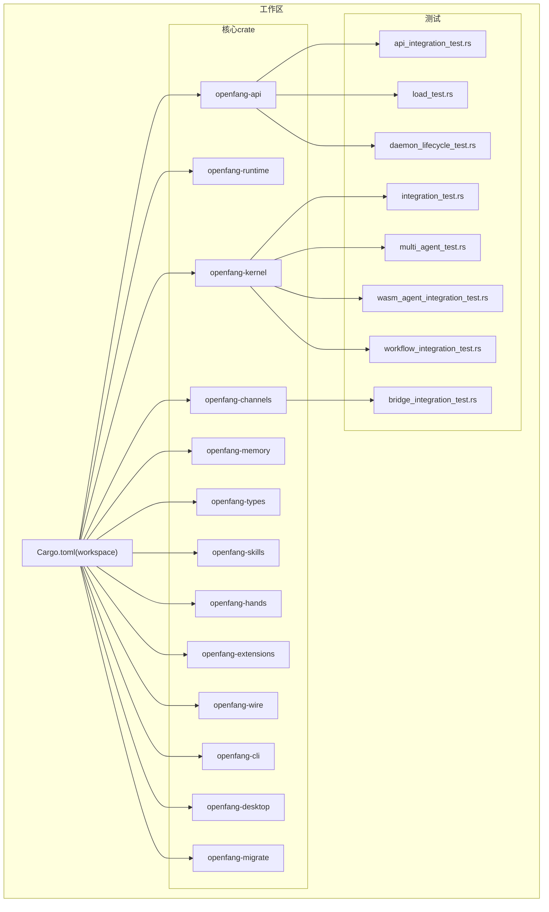
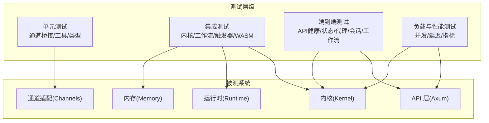
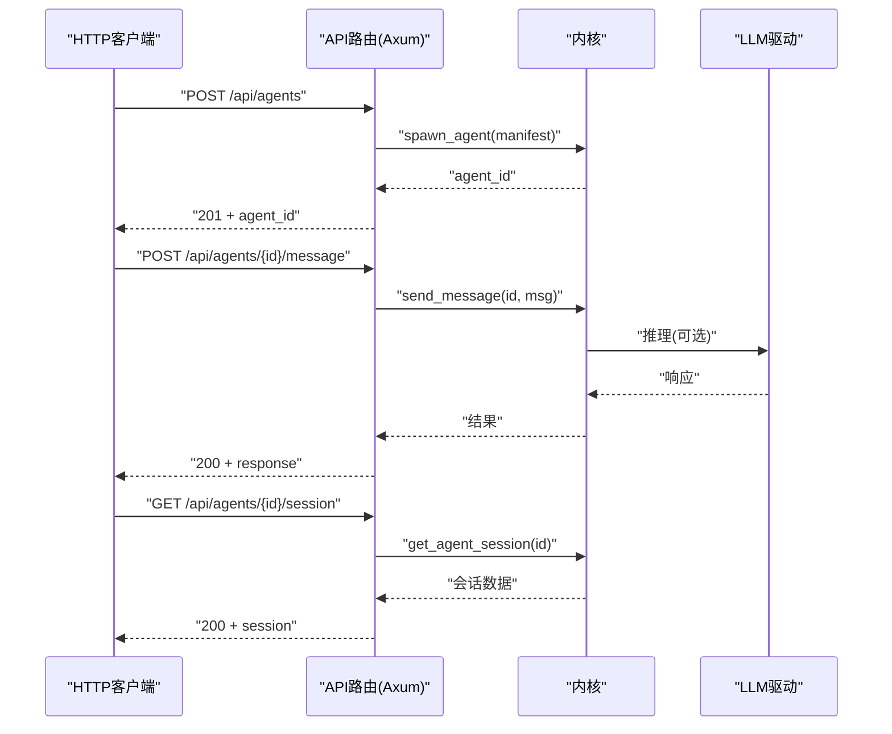
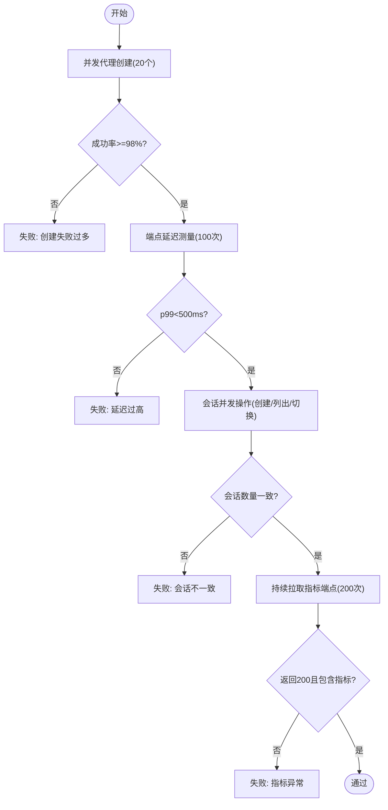
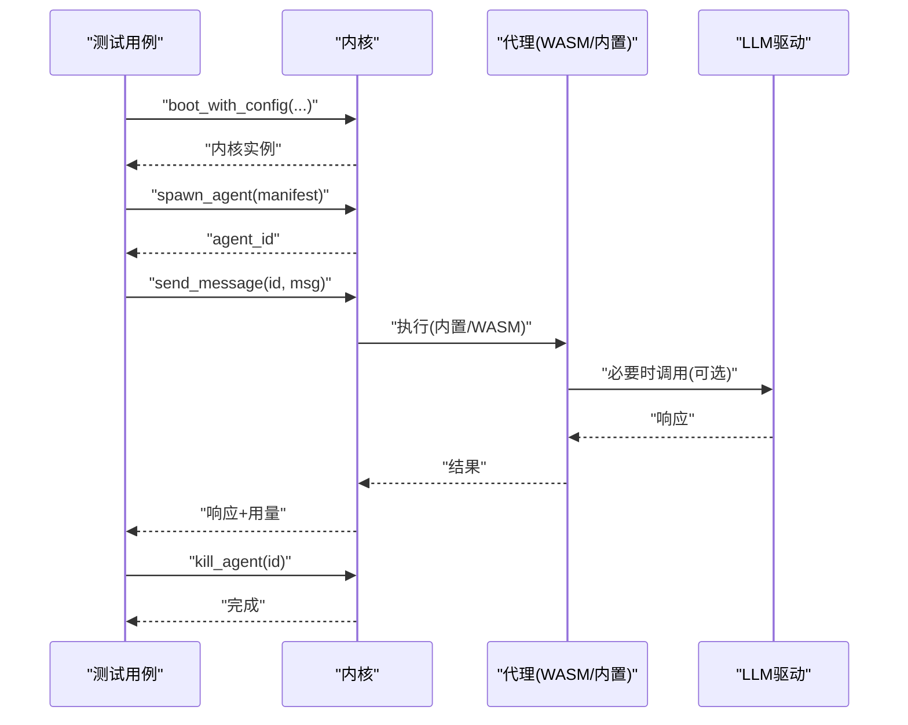
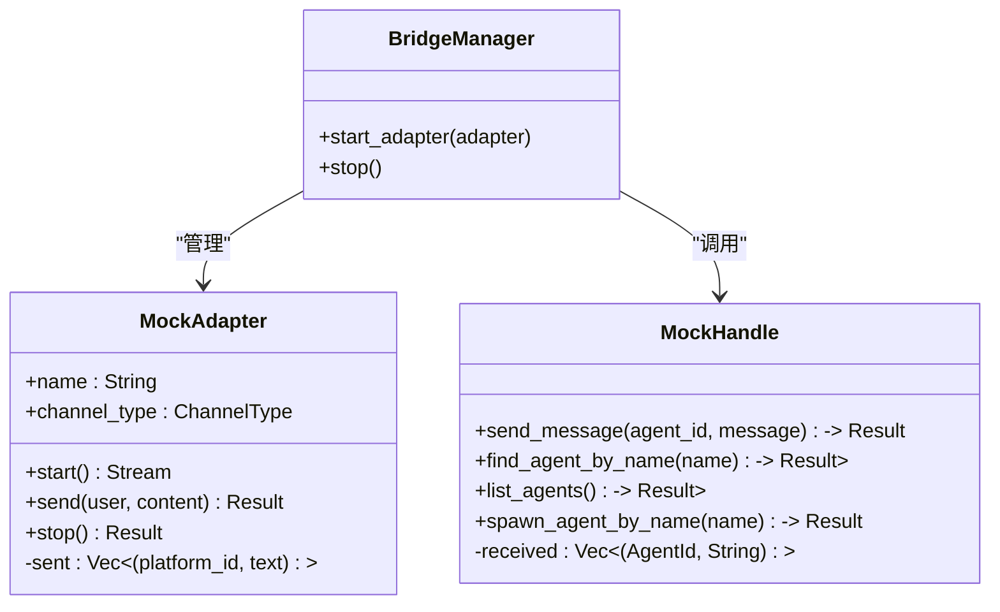
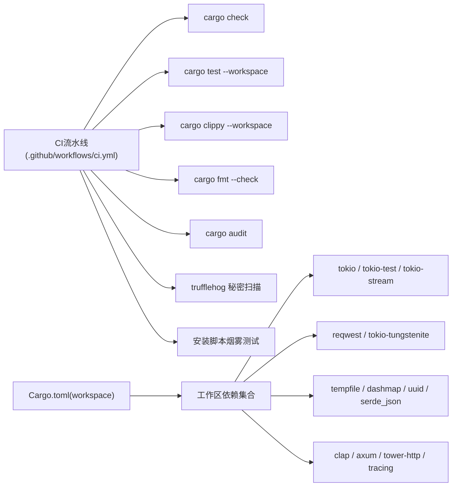

# 测试与文档

<cite>
**本文引用的文件**
- [README.md](file://README.md)
- [CONTRIBUTING.md](file://CONTRIBUTING.md)
- [.github/workflows/ci.yml](file://.github/workflows/ci.yml)
- [Cargo.toml](file://Cargo.toml)
- [crates/openfang-api/tests/api_integration_test.rs](file://crates/openfang-api/tests/api_integration_test.rs)
- [crates/openfang-api/tests/load_test.rs](file://crates/openfang-api/tests/load_test.rs)
- [crates/openfang-api/tests/daemon_lifecycle_test.rs](file://crates/openfang-api/tests/daemon_lifecycle_test.rs)
- [crates/openfang-kernel/tests/integration_test.rs](file://crates/openfang-kernel/tests/integration_test.rs)
- [crates/openfang-kernel/tests/multi_agent_test.rs](file://crates/openfang-kernel/tests/multi_agent_test.rs)
- [crates/openfang-kernel/tests/wasm_agent_integration_test.rs](file://crates/openfang-kernel/tests/wasm_agent_integration_test.rs)
- [crates/openfang-kernel/tests/workflow_integration_test.rs](file://crates/openfang-kernel/tests/workflow_integration_test.rs)
- [crates/openfang-channels/tests/bridge_integration_test.rs](file://crates/openfang-channels/tests/bridge_integration_test.rs)
</cite>

## 目录
1. [简介](#简介)
2. [项目结构](#项目结构)
3. [核心组件](#核心组件)
4. [架构总览](#架构总览)
5. [详细组件分析](#详细组件分析)
6. [依赖分析](#依赖分析)
7. [性能考虑](#性能考虑)
8. [故障排查指南](#故障排查指南)
9. [结论](#结论)
10. [附录](#附录)

## 简介
本指南面向扩展开发者与测试工程师，系统化阐述本仓库的测试与文档实践：覆盖单元测试、集成测试、端到端测试的编写与执行；明确测试文件组织、测试数据准备与模拟对象使用；说明文档更新与API文档生成流程；给出代码覆盖率与性能测试建议；总结安全测试要点；并提供CI/CD集成、测试报告分析与调试技巧。

## 项目结构
- 工作区采用多crate组织，核心模块包括内核(openfang-kernel)、运行时(openfang-runtime)、API(openfang-api)、通道适配(openfang-channels)等。
- 测试分布于各crate/tests目录，遵循“按功能域划分”的组织方式：API集成测试、内核集成测试、通道桥接测试、负载与性能测试等。
- CI通过GitHub Actions在多平台执行检查、测试、格式化、安全审计与安装脚本烟雾测试。

图示来源
- [Cargo.toml:1-160](file://Cargo.toml#L1-L160)
- [crates/openfang-api/tests/api_integration_test.rs:1-871](file://crates/openfang-api/tests/api_integration_test.rs#L1-L871)
- [crates/openfang-api/tests/load_test.rs:1-587](file://crates/openfang-api/tests/load_test.rs#L1-L587)
- [crates/openfang-api/tests/daemon_lifecycle_test.rs:1-275](file://crates/openfang-api/tests/daemon_lifecycle_test.rs#L1-L275)
- [crates/openfang-kernel/tests/integration_test.rs:1-164](file://crates/openfang-kernel/tests/integration_test.rs#L1-L164)
- [crates/openfang-kernel/tests/multi_agent_test.rs:1-202](file://crates/openfang-kernel/tests/multi_agent_test.rs#L1-L202)
- [crates/openfang-kernel/tests/wasm_agent_integration_test.rs:1-411](file://crates/openfang-kernel/tests/wasm_agent_integration_test.rs#L1-L411)
- [crates/openfang-kernel/tests/workflow_integration_test.rs:1-405](file://crates/openfang-kernel/tests/workflow_integration_test.rs#L1-L405)
- [crates/openfang-channels/tests/bridge_integration_test.rs:1-546](file://crates/openfang-channels/tests/bridge_integration_test.rs#L1-L546)

章节来源
- [Cargo.toml:1-160](file://Cargo.toml#L1-L160)
- [.github/workflows/ci.yml:1-139](file://.github/workflows/ci.yml#L1-L139)

## 核心组件
- 单元测试：针对独立函数或模块进行验证，强调隔离与可重复性。例如通道适配器的桥接逻辑在内存中通过异步通道与任务完成端到端验证。
- 集成测试：跨模块协作验证，如API层与内核交互、通道桥接、工作流与触发器注册、WASM代理执行与燃料耗尽保护。
- 端到端测试：启动真实内核与HTTP服务，通过HTTP客户端调用真实接口，覆盖健康检查、状态查询、代理生命周期、会话管理、工作流执行等完整链路。
- 负载与性能测试：并发代理创建、端点延迟测量、会话切换、指标端点稳定性等，评估系统在高并发下的吞吐与延迟表现。

章节来源
- [crates/openfang-channels/tests/bridge_integration_test.rs:1-546](file://crates/openfang-channels/tests/bridge_integration_test.rs#L1-L546)
- [crates/openfang-api/tests/api_integration_test.rs:1-871](file://crates/openfang-api/tests/api_integration_test.rs#L1-L871)
- [crates/openfang-api/tests/load_test.rs:1-587](file://crates/openfang-api/tests/load_test.rs#L1-L587)
- [crates/openfang-kernel/tests/integration_test.rs:1-164](file://crates/openfang-kernel/tests/integration_test.rs#L1-L164)
- [crates/openfang-kernel/tests/multi_agent_test.rs:1-202](file://crates/openfang-kernel/tests/multi_agent_test.rs#L1-L202)
- [crates/openfang-kernel/tests/wasm_agent_integration_test.rs:1-411](file://crates/openfang-kernel/tests/wasm_agent_integration_test.rs#L1-L411)
- [crates/openfang-kernel/tests/workflow_integration_test.rs:1-405](file://crates/openfang-kernel/tests/workflow_integration_test.rs#L1-L405)

## 架构总览
下图展示测试金字塔与关键测试路径：单元测试覆盖最小粒度逻辑；集成测试覆盖跨模块协作；端到端测试覆盖真实内核+HTTP服务；负载测试覆盖高并发场景。

图示来源
- [crates/openfang-channels/tests/bridge_integration_test.rs:1-546](file://crates/openfang-channels/tests/bridge_integration_test.rs#L1-L546)
- [crates/openfang-kernel/tests/integration_test.rs:1-164](file://crates/openfang-kernel/tests/integration_test.rs#L1-L164)
- [crates/openfang-api/tests/api_integration_test.rs:1-871](file://crates/openfang-api/tests/api_integration_test.rs#L1-L871)
- [crates/openfang-api/tests/load_test.rs:1-587](file://crates/openfang-api/tests/load_test.rs#L1-L587)

## 详细组件分析

### API 集成测试（HTTP 端到端）
- 目标：验证真实内核与Axum HTTP服务的协作，覆盖健康检查、状态查询、代理生命周期、会话管理、工作流与触发器等。
- 关键点：
  - 启动临时内核与随机端口HTTP服务器，使用reqwest发起请求。
  - 提供带/不带Bearer认证的测试环境，验证公共端点与受保护端点行为。
  - 使用不同LLM提供商配置，区分仅本地推理与需要真实API密钥的场景。
- 典型断言：HTTP状态码、响应体字段、请求ID头、会话消息计数、工作流步骤数量与令牌用量。

图示来源
- [crates/openfang-api/tests/api_integration_test.rs:1-871](file://crates/openfang-api/tests/api_integration_test.rs#L1-L871)

章节来源
- [crates/openfang-api/tests/api_integration_test.rs:1-871](file://crates/openfang-api/tests/api_integration_test.rs#L1-L871)

### 负载与性能测试
- 目标：评估系统在高并发下的吞吐与延迟，关注代理并发创建、端点延迟、会话管理、指标端点稳定性。
- 关键点：
  - 并发代理创建：20个协程同时发起创建请求，统计成功率与吞吐。
  - 延迟测量：对健康、状态、代理列表、工具、模型、指标、用量等端点进行多次请求，计算p50/p95/p99延迟。
  - 会话管理：并发创建、列出、切换会话，验证一致性与性能。
  - 指标端点：持续拉取Prometheus指标端点，确保稳定输出。
- 断言：p99延迟阈值、成功比例、会话数量一致性、指标内容存在性。

图示来源
- [crates/openfang-api/tests/load_test.rs:1-587](file://crates/openfang-api/tests/load_test.rs#L1-L587)

章节来源
- [crates/openfang-api/tests/load_test.rs:1-587](file://crates/openfang-api/tests/load_test.rs#L1-L587)

### 内核集成测试（LLM/多代理/WASM/工作流）
- LLM集成测试：启动内核与Groq配置，验证代理创建、消息发送、令牌用量统计、代理清理。
- 多代理测试：一次性启动多个不同角色与模型的代理，逐一发送消息，断言均能正确响应。
- WASM代理测试：使用真实WASM模块与燃料耗尽保护，验证执行、回退流式处理、错误传播。
- 工作流与触发器：在内核层面注册工作流与触发器，验证名称解析、ID解析、运行记录与状态。

图示来源
- [crates/openfang-kernel/tests/integration_test.rs:1-164](file://crates/openfang-kernel/tests/integration_test.rs#L1-L164)
- [crates/openfang-kernel/tests/multi_agent_test.rs:1-202](file://crates/openfang-kernel/tests/multi_agent_test.rs#L1-L202)
- [crates/openfang-kernel/tests/wasm_agent_integration_test.rs:1-411](file://crates/openfang-kernel/tests/wasm_agent_integration_test.rs#L1-L411)
- [crates/openfang-kernel/tests/workflow_integration_test.rs:1-405](file://crates/openfang-kernel/tests/workflow_integration_test.rs#L1-L405)

章节来源
- [crates/openfang-kernel/tests/integration_test.rs:1-164](file://crates/openfang-kernel/tests/integration_test.rs#L1-L164)
- [crates/openfang-kernel/tests/multi_agent_test.rs:1-202](file://crates/openfang-kernel/tests/multi_agent_test.rs#L1-L202)
- [crates/openfang-kernel/tests/wasm_agent_integration_test.rs:1-411](file://crates/openfang-kernel/tests/wasm_agent_integration_test.rs#L1-L411)
- [crates/openfang-kernel/tests/workflow_integration_test.rs:1-405](file://crates/openfang-kernel/tests/workflow_integration_test.rs#L1-L405)

### 通道桥接测试（Mock Adapter + Mock Kernel Handle）
- 目标：验证桥接器在进程内通过异步通道完成的消息分发、命令处理、用户路由与适配器生命周期。
- 关键点：
  - MockAdapter注入消息流，捕获发送响应；MockHandle回显消息、提供代理列表。
  - 覆盖文本消息、/agents、/help、/agent选择、/status、无代理分配等场景。
  - 多适配器并发运行，验证隔离与一致性。
- 断言：适配器收到的响应内容、内核句柄收到的消息、路由表变更、生命周期停止无悬挂。

图示来源
- [crates/openfang-channels/tests/bridge_integration_test.rs:1-546](file://crates/openfang-channels/tests/bridge_integration_test.rs#L1-L546)

章节来源
- [crates/openfang-channels/tests/bridge_integration_test.rs:1-546](file://crates/openfang-channels/tests/bridge_integration_test.rs#L1-L546)

### 守护进程生命周期测试
- 目标：验证守护进程启动、PID文件管理、健康检查、优雅关闭与清理。
- 关键点：
  - 序列化/反序列化DaemonInfo，读取磁盘文件，处理缺失与损坏JSON。
  - 启动HTTP服务后写入daemon.json，随后健康检查与状态查询。
  - 发送关机请求后清理文件，内核关闭。
- 断言：文件存在与内容匹配、健康/状态端点返回、延迟阈值、文件清理。

章节来源
- [crates/openfang-api/tests/daemon_lifecycle_test.rs:1-275](file://crates/openfang-api/tests/daemon_lifecycle_test.rs#L1-L275)

## 依赖分析
- 测试依赖统一从工作区根配置引入，避免版本漂移与循环依赖。
- 测试工具链：tokio、tokio-test、tempfile、reqwest、dashmap、uuid、serde_json、tokio-tungstenite等。
- CI依赖：Actions缓存、rust-toolchain、rustfmt、clippy、cargo-audit、trufflehog等。

图示来源
- [.github/workflows/ci.yml:1-139](file://.github/workflows/ci.yml#L1-L139)
- [Cargo.toml:1-160](file://Cargo.toml#L1-L160)

章节来源
- [.github/workflows/ci.yml:1-139](file://.github/workflows/ci.yml#L1-L139)
- [Cargo.toml:1-160](file://Cargo.toml#L1-L160)

## 性能考虑
- 并发策略：使用tokio::spawn并发执行请求，结合限流与超时控制，避免资源争用。
- 延迟测量：对关键端点进行多次采样，计算p50/p95/p99，设定合理阈值（如p99<500ms）。
- 资源隔离：使用tempfile::TempDir隔离文件系统，随机端口避免冲突。
- 指标监控：启用Prometheus指标端点，持续拉取以验证稳定性。
- 优化建议：减少不必要的HTTP往返、合并请求、使用连接池、避免阻塞操作。

## 故障排查指南
- 环境变量缺失：
  - LLM测试需设置GROQ_API_KEY等，未设置时测试跳过，避免失败。
- 端口冲突：
  - 使用随机端口绑定，避免固定端口占用。
- 文件权限与路径：
  - 使用tempfile::TempDir创建临时目录，确保读写权限。
- 调试技巧：
  - 使用--nocapture打印日志与中间结果。
  - 对并发场景增加短暂sleep等待异步任务完成。
  - 分离健康检查与业务请求，定位瓶颈。

章节来源
- [crates/openfang-api/tests/api_integration_test.rs:1-871](file://crates/openfang-api/tests/api_integration_test.rs#L1-L871)
- [crates/openfang-api/tests/load_test.rs:1-587](file://crates/openfang-api/tests/load_test.rs#L1-L587)
- [crates/openfang-channels/tests/bridge_integration_test.rs:1-546](file://crates/openfang-channels/tests/bridge_integration_test.rs#L1-L546)

## 结论
本仓库建立了完善的测试体系：单元测试保证模块质量，集成测试覆盖跨模块协作，端到端测试验证真实链路，负载测试保障高并发稳定性。配合CI流水线与安全审计，形成从开发到交付的可靠质量保障。建议在新增功能时同步补充相应层级的测试，并持续优化测试覆盖率与性能指标。

## 附录

### 测试编写要求与最佳实践
- 单元测试
  - 使用tempfile::TempDir隔离文件系统。
  - 使用随机端口避免冲突。
  - 使用tokio-test与tokio::test标注异步测试。
- 集成测试
  - 在内存中模拟外部依赖（如MockAdapter），验证跨模块协作。
  - 对关键路径进行断言（状态码、响应体字段、会话一致性）。
- 端到端测试
  - 启动真实内核与HTTP服务，使用reqwest发起请求。
  - 区分需要真实LLM密钥的场景与仅本地推理的场景。
- 负载测试
  - 设定p99延迟阈值与成功率目标。
  - 并发度逐步提升，观察系统边界。

章节来源
- [CONTRIBUTING.md:1-372](file://CONTRIBUTING.md#L1-L372)
- [crates/openfang-api/tests/api_integration_test.rs:1-871](file://crates/openfang-api/tests/api_integration_test.rs#L1-L871)
- [crates/openfang-api/tests/load_test.rs:1-587](file://crates/openfang-api/tests/load_test.rs#L1-L587)
- [crates/openfang-channels/tests/bridge_integration_test.rs:1-546](file://crates/openfang-channels/tests/bridge_integration_test.rs#L1-L546)

### 测试文件组织与命名
- 组织结构：每个crate/tests下按功能域命名，如api_integration_test.rs、load_test.rs、bridge_integration_test.rs等。
- 命名规范：使用_test.rs结尾，描述测试目的（如load、daemon_lifecycle、wasm_agent）。

章节来源
- [crates/openfang-api/tests/api_integration_test.rs:1-871](file://crates/openfang-api/tests/api_integration_test.rs#L1-L871)
- [crates/openfang-api/tests/load_test.rs:1-587](file://crates/openfang-api/tests/load_test.rs#L1-L587)
- [crates/openfang-api/tests/daemon_lifecycle_test.rs:1-275](file://crates/openfang-api/tests/daemon_lifecycle_test.rs#L1-L275)
- [crates/openfang-kernel/tests/integration_test.rs:1-164](file://crates/openfang-kernel/tests/integration_test.rs#L1-L164)
- [crates/openfang-kernel/tests/multi_agent_test.rs:1-202](file://crates/openfang-kernel/tests/multi_agent_test.rs#L1-L202)
- [crates/openfang-kernel/tests/wasm_agent_integration_test.rs:1-411](file://crates/openfang-kernel/tests/wasm_agent_integration_test.rs#L1-L411)
- [crates/openfang-kernel/tests/workflow_integration_test.rs:1-405](file://crates/openfang-kernel/tests/workflow_integration_test.rs#L1-L405)
- [crates/openfang-channels/tests/bridge_integration_test.rs:1-546](file://crates/openfang-channels/tests/bridge_integration_test.rs#L1-L546)

### 测试数据准备与模拟对象
- 测试数据：使用常量字符串或动态构造（如TEST_MANIFEST、LLM_MANIFEST），确保可复现。
- 模拟对象：MockAdapter捕获发送响应，MockHandle回显消息与提供代理列表，BridgeManager负责调度与生命周期管理。

章节来源
- [crates/openfang-api/tests/api_integration_test.rs:1-871](file://crates/openfang-api/tests/api_integration_test.rs#L1-L871)
- [crates/openfang-channels/tests/bridge_integration_test.rs:1-546](file://crates/openfang-channels/tests/bridge_integration_test.rs#L1-L546)

### 文档更新与API文档生成
- 文档更新：遵循README中的快速开始与开发说明，保持文档与代码一致。
- API文档：通过OpenAI兼容接口与REST/WS/SSE端点提供API参考，建议在PR中同步更新相关文档。

章节来源
- [README.md:1-521](file://README.md#L1-L521)

### 代码覆盖率与性能测试
- 覆盖率：建议在CI中引入覆盖率工具（如tarpaulin），为关键路径设定覆盖率门槛。
- 性能：结合负载测试与端到端测试，持续监控p99延迟与吞吐，识别瓶颈并优化。

### 安全测试
- 秘密扫描：CI中集成trufflehog，防止凭据误提交。
- 审计：cargo audit定期扫描依赖漏洞。
- 认证与授权：API端点支持Bearer认证与公开端点分离，测试中覆盖认证场景。

章节来源
- [.github/workflows/ci.yml:108-125](file://.github/workflows/ci.yml#L108-L125)
- [.github/workflows/ci.yml:96-106](file://.github/workflows/ci.yml#L96-L106)

### CI/CD 集成与测试报告
- CI任务：check、test、clippy、fmt、audit、secrets、install-smoke。
- 测试报告：建议在CI中收集测试日志与性能指标，便于问题定位与回归分析。

章节来源
- [.github/workflows/ci.yml:1-139](file://.github/workflows/ci.yml#L1-L139)