# 消息渠道适配器开发

<cite>
**本文档引用的文件**
- [lib.rs](file://crates/openfang-channels/src/lib.rs)
- [types.rs](file://crates/openfang-channels/src/types.rs)
- [bridge.rs](file://crates/openfang-channels/src/bridge.rs)
- [router.rs](file://crates/openfang-channels/src/router.rs)
- [formatter.rs](file://crates/openfang-channels/src/formatter.rs)
- [telegram.rs](file://crates/openfang-channels/src/telegram.rs)
- [slack.rs](file://crates/openfang-channels/src/slack.rs)
- [discord.rs](file://crates/openfang-channels/src/discord.rs)
- [channels.rs](file://crates/openfang-cli/src/tui/screens/channels.rs)
- [wizard.rs](file://crates/openfang-cli/src/tui/screens/wizard.rs)
- [channel_bridge.rs](file://crates/openfang-api/src/channel_bridge.rs)
- [routes.rs](file://crates/openfang-api/src/routes.rs)
- [bridge_integration_test.rs](file://crates/openfang-channels/tests/bridge_integration_test.rs)
</cite>

## 目录
1. [简介](#简介)
2. [项目结构](#项目结构)
3. [核心组件](#核心组件)
4. [架构概览](#架构概览)
5. [详细组件分析](#详细组件分析)
6. [依赖关系分析](#依赖关系分析)
7. [性能考虑](#性能考虑)
8. [故障排除指南](#故障排除指南)
9. [结论](#结论)
10. [附录](#附录)

## 简介

OpenFang 消息渠道适配器系统为构建统一的消息通信层提供了完整的框架。该系统支持40种不同的消息平台，包括Telegram、Slack、Discord等主流平台，以及企业级平台如Microsoft Teams、钉钉等。

本指南详细说明了如何开发新的消息渠道适配器，包括ChannelAdapter trait的实现要求、生命周期管理、消息处理机制、错误处理策略以及适配器注册流程。

## 项目结构

OpenFang 采用模块化设计，核心功能集中在 `openfang-channels` crate 中：

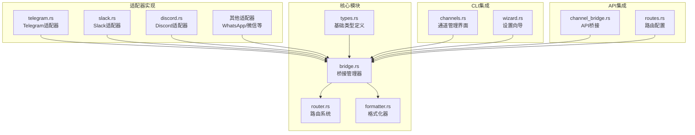

**图表来源**
- [lib.rs:1-55](file://crates/openfang-channels/src/lib.rs#L1-L55)
- [types.rs:1-478](file://crates/openfang-channels/src/types.rs#L1-L478)

**章节来源**
- [lib.rs:1-55](file://crates/openfang-channels/src/lib.rs#L1-L55)

## 核心组件

### ChannelAdapter Trait 接口

所有消息渠道适配器必须实现的统一接口：

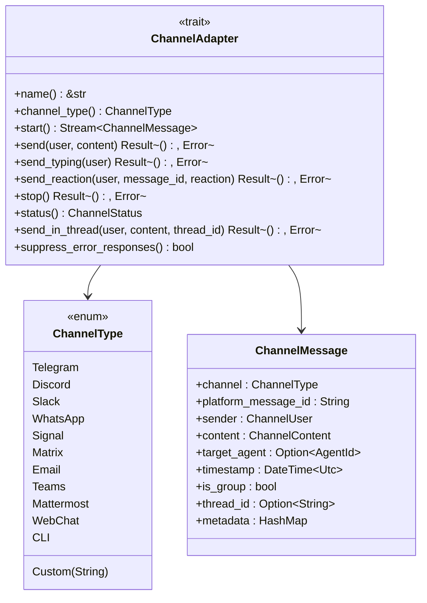

**图表来源**
- [types.rs:215-280](file://crates/openfang-channels/src/types.rs#L215-L280)
- [types.rs:12-27](file://crates/openfang-channels/src/types.rs#L12-L27)
- [types.rs:74-96](file://crates/openfang-channels/src/types.rs#L74-L96)

### BridgeManager 管理器

负责协调多个适配器实例的生命周期管理：

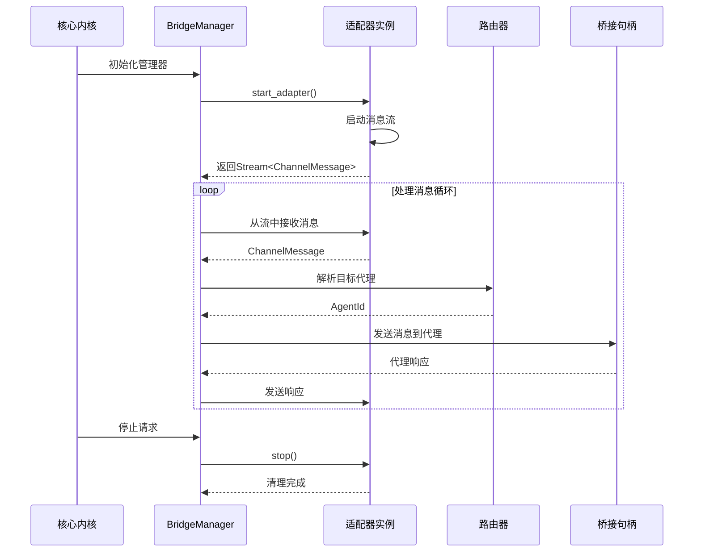

**图表来源**
- [bridge.rs:281-382](file://crates/openfang-channels/src/bridge.rs#L281-L382)

**章节来源**
- [types.rs:215-280](file://crates/openfang-channels/src/types.rs#L215-L280)
- [bridge.rs:281-382](file://crates/openfang-channels/src/bridge.rs#L281-L382)

## 架构概览

OpenFang 的消息渠道适配器架构采用分层设计，确保了高度的可扩展性和可维护性：

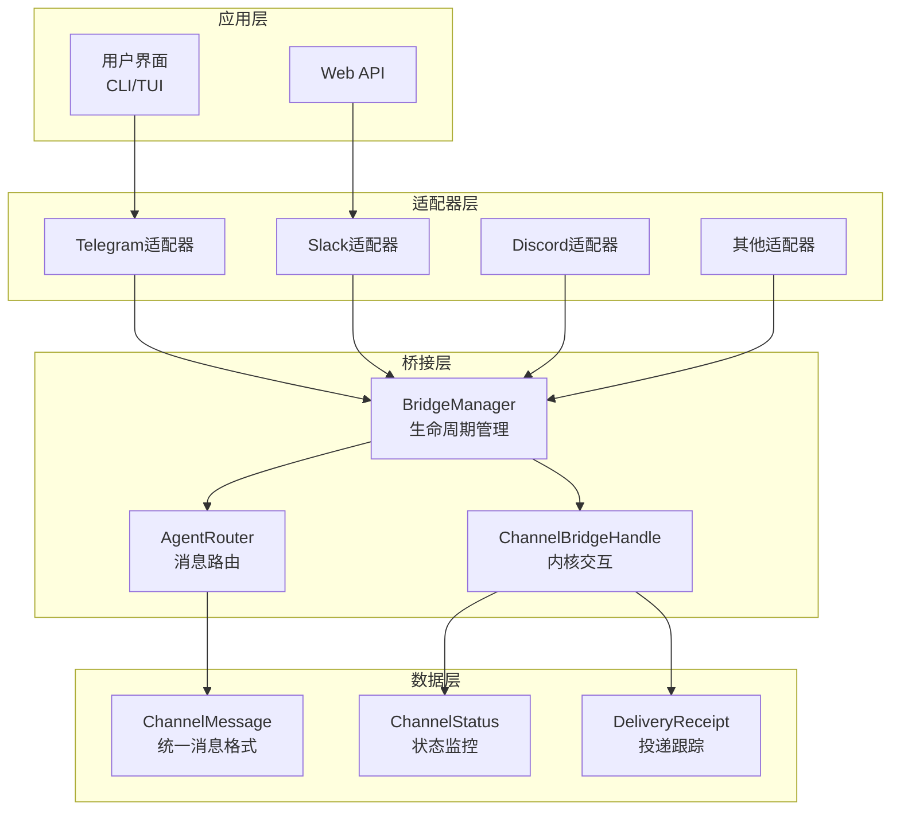

**图表来源**
- [bridge.rs:271-279](file://crates/openfang-channels/src/bridge.rs#L271-L279)
- [router.rs:28-45](file://crates/openfang-channels/src/router.rs#L28-L45)
- [types.rs:195-210](file://crates/openfang-channels/src/types.rs#L195-L210)

## 详细组件分析

### Telegram 适配器实现

Telegram 适配器使用长轮询方式监听消息更新：

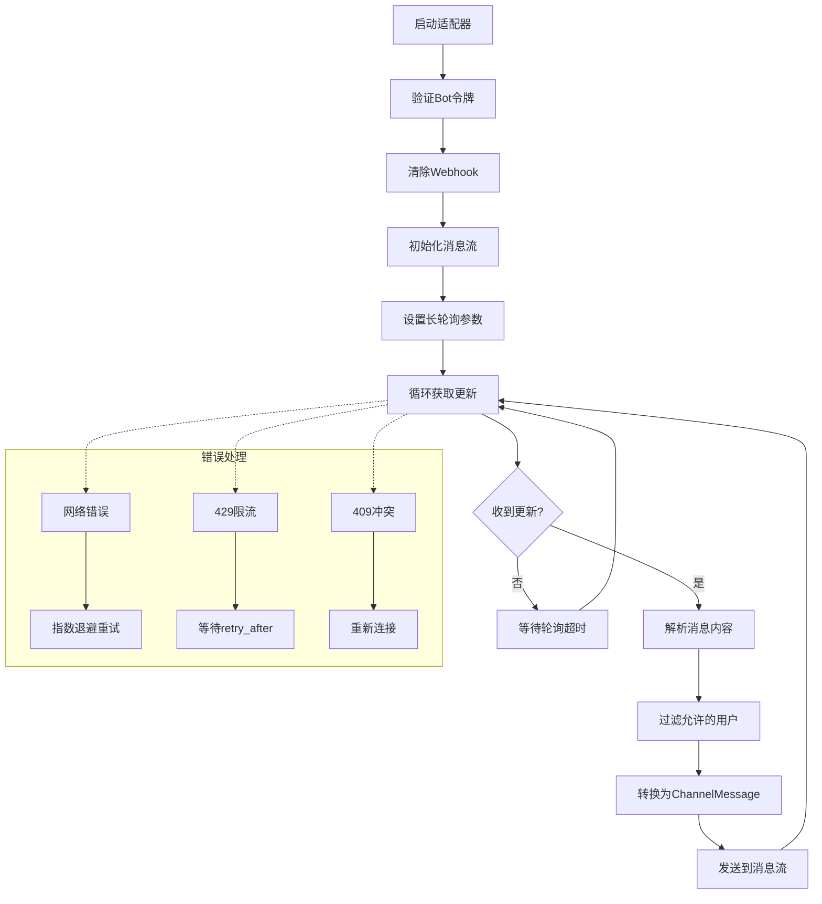

**图表来源**
- [telegram.rs:408-596](file://crates/openfang-channels/src/telegram.rs#L408-L596)

关键特性：
- **长轮询机制**：使用 `getUpdates` API，支持 `timeout` 参数
- **安全令牌管理**：使用 `Zeroizing` 确保令牌内存安全
- **消息分割**：自动处理超过4096字符限制的消息
- **HTML转义**：防止Telegram HTML解析错误
- **线程支持**：支持Telegram论坛主题回复

**章节来源**
- [telegram.rs:1-800](file://crates/openfang-channels/src/telegram.rs#L1-L800)

### Slack 适配器实现

Slack 适配器采用 Socket Mode WebSocket 连接：

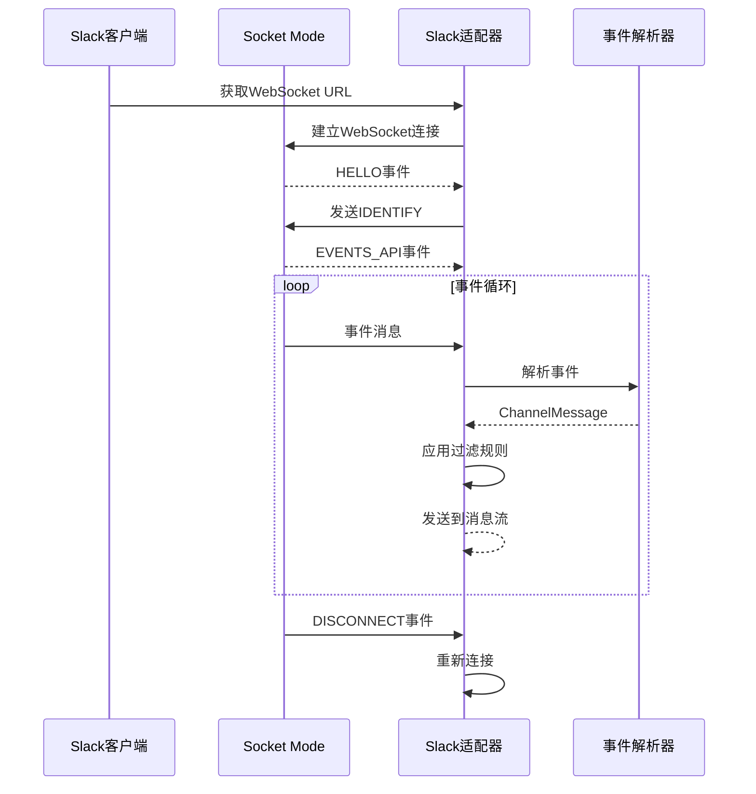

**图表来源**
- [slack.rs:146-338](file://crates/openfang-channels/src/slack.rs#L146-L338)

关键特性：
- **Socket Mode**：实时事件推送，无需Webhook
- **线程管理**：跟踪活跃对话线程
- **提及检测**：自动识别机器人被提及的消息
- **链接展开**：可选的链接预览功能
- **频道过滤**：支持白名单频道列表

**章节来源**
- [slack.rs:1-746](file://crates/openfang-channels/src/slack.rs#L1-L746)

### Discord 适配器实现

Discord 适配器使用官方 Gateway 协议：

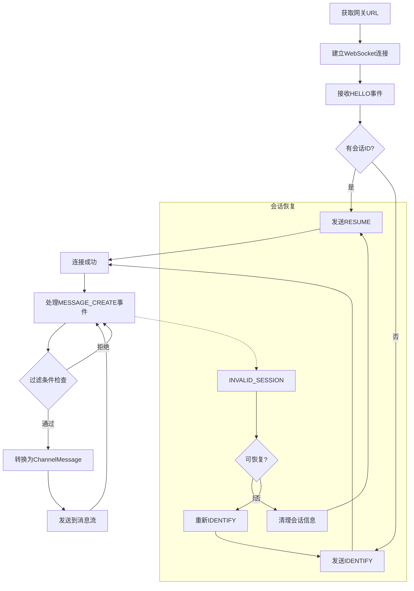

**图表来源**
- [discord.rs:148-407](file://crates/openfang-channels/src/discord.rs#L148-L407)

关键特性：
- **Gateway协议**：遵循Discord官方WebSocket协议
- **会话恢复**：支持断线自动恢复
- **机器人过滤**：可选择忽略其他机器人消息
- **提及检测**：支持多种提及格式
- **时间戳处理**：支持RFC3339格式解析

**章节来源**
- [discord.rs:1-905](file://crates/openfang-channels/src/discord.rs#L1-L905)

### 消息格式化系统

统一的消息格式化系统确保跨平台兼容性：

```mermaid
flowchart LR
A[原始Markdown] --> B{输出格式}
B --> |Markdown| C[直接传递]
B --> |Telegram HTML| D[HTML标签转换]
B --> |Slack Mrkdwn| E[Mrkdwn语法转换]
B --> |Plain Text| F[纯文本转换]
D --> G[支持标签：<b>,<i>,<code>,<pre>,<a>,<blockquote>]
E --> H[支持语法：*bold*, <url|text>]
F --> I[移除所有格式标记]
G --> J[最终格式化消息]
H --> J
I --> J
```

**图表来源**
- [formatter.rs:10-27](file://crates/openfang-channels/src/formatter.rs#L10-L27)

**章节来源**
- [formatter.rs:1-676](file://crates/openfang-channels/src/formatter.rs#L1-L676)

## 依赖关系分析

### 组件耦合度分析

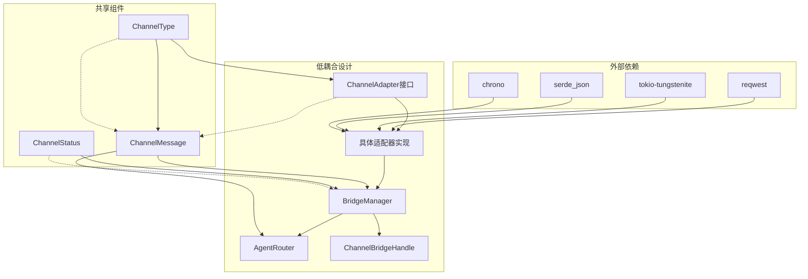

**图表来源**
- [bridge.rs:271-279](file://crates/openfang-channels/src/bridge.rs#L271-L279)
- [types.rs:12-27](file://crates/openfang-channels/src/types.rs#L12-L27)

### 适配器注册流程

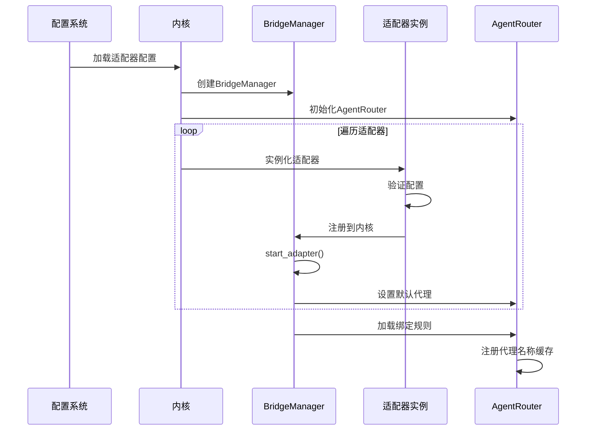

**图表来源**
- [channel_bridge.rs:1678-1752](file://crates/openfang-api/src/channel_bridge.rs#L1678-L1752)

**章节来源**
- [channel_bridge.rs:1678-1752](file://crates/openfang-api/src/channel_bridge.rs#L1678-L1752)

## 性能考虑

### 并发处理优化

BridgeManager 使用并发任务池来处理消息：

- **最大并发数**：32个并发任务，防止内存无限增长
- **信号量控制**：每个适配器实例独立的信号量
- **任务隔离**：每个消息处理都在独立的任务中执行
- **资源清理**：优雅关闭时等待所有任务完成

### 缓存策略

- **代理名称缓存**：DashMap存储代理名称到ID的映射
- **会话ID缓存**：Discord适配器缓存会话ID用于恢复
- **速率限制缓存**：按用户维度缓存最近的消息时间戳

### 错误恢复机制

- **指数退避**：网络错误时采用指数退避重试
- **会话恢复**：Discord适配器支持断线自动恢复
- **配置验证**：启动前验证所有必需配置项
- **降级模式**：部分功能在配置不完整时的降级处理

## 故障排除指南

### 常见问题诊断

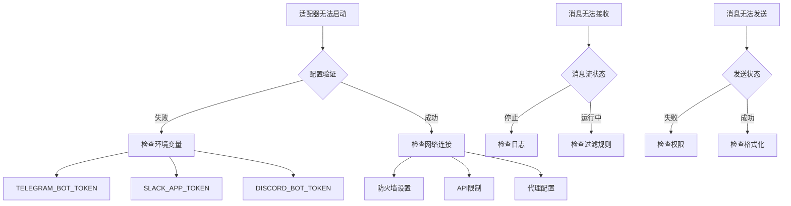

### 日志分析要点

- **启动阶段**：关注令牌验证和连接建立日志
- **运行阶段**：监控消息处理吞吐量和错误率
- **停止阶段**：确认资源正确释放和清理

**章节来源**
- [telegram.rs:75-97](file://crates/openfang-channels/src/telegram.rs#L75-L97)
- [slack.rs:71-92](file://crates/openfang-channels/src/slack.rs#L71-L92)
- [discord.rs:79-96](file://crates/openfang-channels/src/discord.rs#L79-L96)

## 结论

OpenFang 消息渠道适配器系统提供了完整的、可扩展的消息通信解决方案。通过标准化的 ChannelAdapter 接口和强大的桥接管理器，开发者可以快速集成新的消息平台。

关键优势：
- **统一接口**：所有适配器遵循相同的接口规范
- **高可用性**：内置错误恢复和重连机制
- **性能优化**：并发处理和资源管理
- **易于扩展**：模块化设计支持新平台快速集成

## 附录

### 开发模板

创建新适配器的基本步骤：

1. **实现 ChannelAdapter trait**
2. **定义配置结构**
3. **实现 start() 和 stop() 方法**
4. **处理消息解析和发送**
5. **添加错误处理和日志记录**
6. **编写单元测试**

### 测试策略

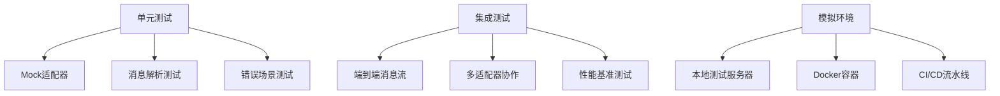

### 调试技巧

- **启用详细日志**：使用 `RUST_LOG` 环境变量
- **使用测试适配器**：参考 `bridge_integration_test.rs`
- **监控指标**：关注消息延迟和吞吐量
- **配置验证**：启动前进行配置完整性检查

**章节来源**
- [bridge_integration_test.rs:1-82](file://crates/openfang-channels/tests/bridge_integration_test.rs#L1-L82)