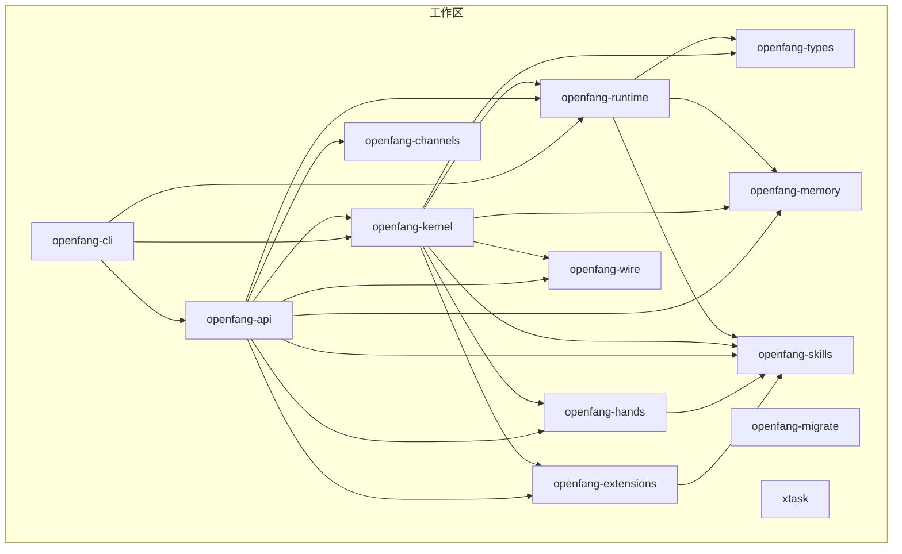
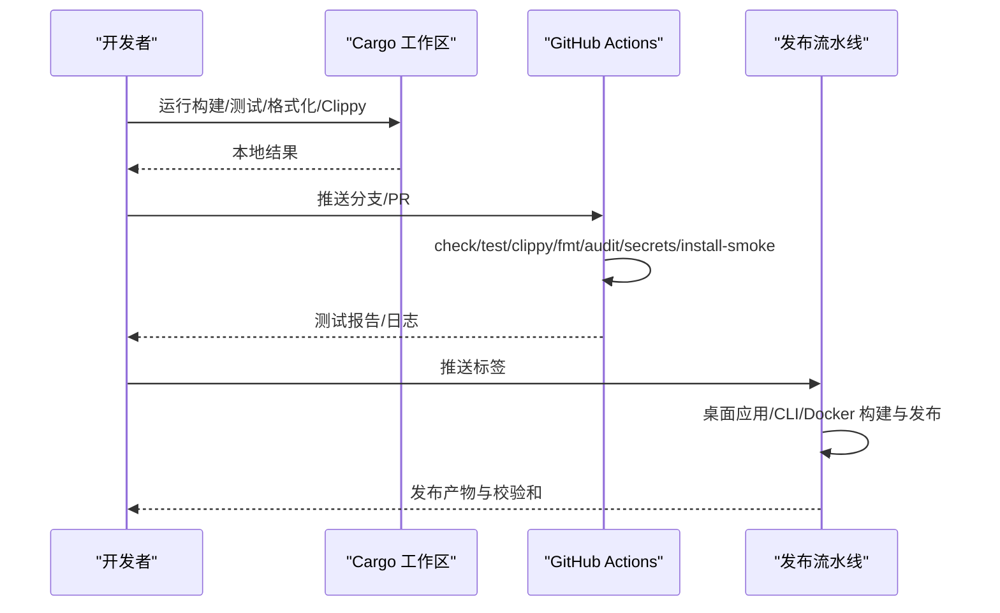
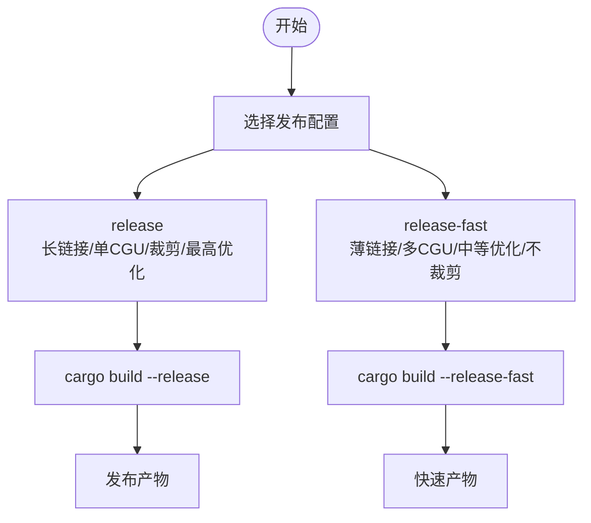
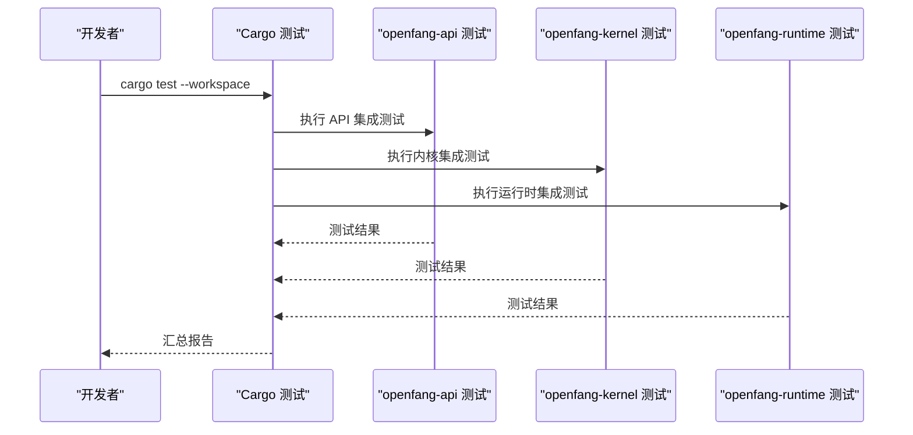
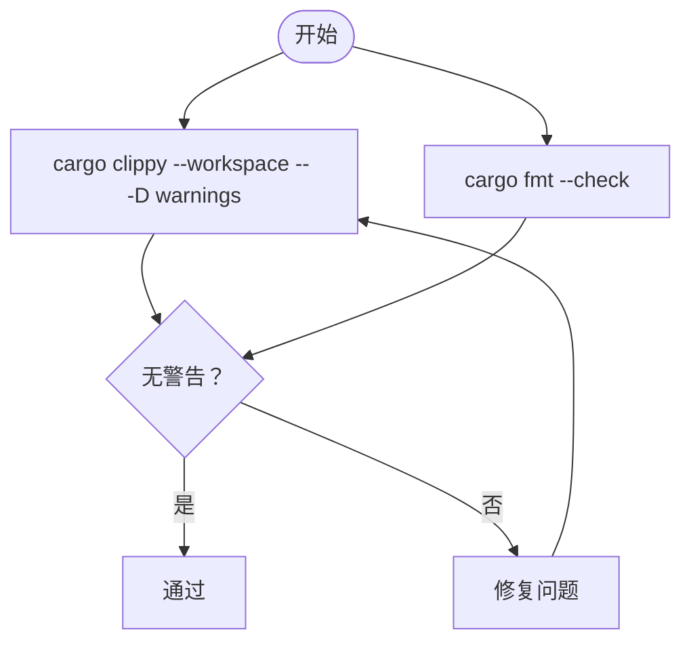
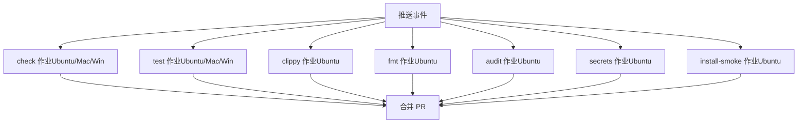
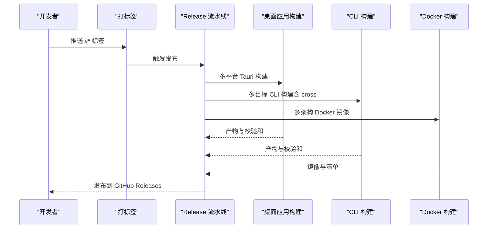
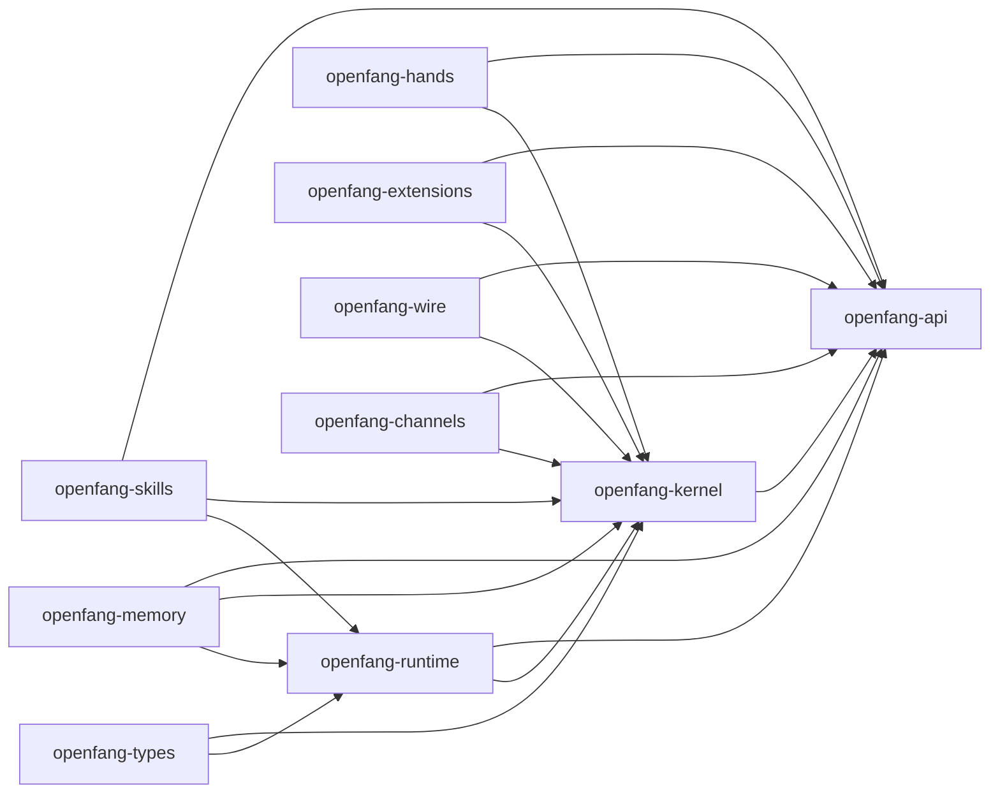

# 构建和测试

<cite>
**本文引用的文件**
- [Cargo.toml](file://Cargo.toml)
- [README.md](file://README.md)
- [rust-toolchain.toml](file://rust-toolchain.toml)
- [rustfmt.toml](file://rustfmt.toml)
- [.github/workflows/ci.yml](file://.github/workflows/ci.yml)
- [.github/workflows/release.yml](file://.github/workflows/release.yml)
- [Cross.toml](file://Cross.toml)
- [crates/openfang-api/Cargo.toml](file://crates/openfang-api/Cargo.toml)
- [crates/openfang-kernel/Cargo.toml](file://crates/openfang-kernel/Cargo.toml)
- [crates/openfang-runtime/Cargo.toml](file://crates/openfang-runtime/Cargo.toml)
</cite>

## 目录
1. [简介](#简介)
2. [项目结构](#项目结构)
3. [核心组件](#核心组件)
4. [架构总览](#架构总览)
5. [详细组件分析](#详细组件分析)
6. [依赖分析](#依赖分析)
7. [性能考虑](#性能考虑)
8. [故障排查指南](#故障排查指南)
9. [结论](#结论)
10. [附录](#附录)

## 简介
本指南面向 OpenFang 开发者与贡献者，系统性说明工作区构建、单 crate 构建、发布配置选择（含 release-fast）、测试策略（单元/集成/性能）、代码质量门禁（clippy、rustfmt）、覆盖率与基准测试方法，以及 CI 流程与自动化测试配置。目标是帮助你在本地与 CI 中稳定、高效地完成构建与验证。

## 项目结构
OpenFang 采用多 crate 工作区组织，核心 crate 包含内核、运行时、API、通道适配器、技能与手部能力、内存、类型定义、P2P 协议、扩展与迁移等模块；另有 CLI、桌面应用与任务工具 crate。工作区统一版本、特性与依赖，通过 Cargo.toml 的 workspace 配置集中管理。

图表来源
- [Cargo.toml:1-16](file://Cargo.toml#L1-L16)
- [crates/openfang-api/Cargo.toml:8-38](file://crates/openfang-api/Cargo.toml#L8-L38)
- [crates/openfang-kernel/Cargo.toml:8-36](file://crates/openfang-kernel/Cargo.toml#L8-L36)
- [crates/openfang-runtime/Cargo.toml:8-31](file://crates/openfang-runtime/Cargo.toml#L8-L31)

章节来源
- [Cargo.toml:1-16](file://Cargo.toml#L1-L16)

## 核心组件
- 工作区与发布配置
  - 工作区统一版本、特性与依赖，便于跨 crate 一致性管理。
  - 提供 release 与 release-fast 两种发布配置，后者以薄链接、更高代码生成单元与较低优化级别换取更快构建速度。
- 代码质量工具链
  - rust-toolchain.toml 指定稳定通道并启用 rustfmt 与 clippy 组件。
  - rustfmt.toml 设置最大行长，确保格式一致。
  - CI 使用 RUSTFLAGS="-D warnings" 将警告视为错误，保证仓库零 clippy 警告。
- 构建与测试命令
  - README 提供工作区构建、测试、clippy、格式化的常用命令，可直接用于本地开发。
- CI 与发布
  - CI 分为 check、test、clippy、fmt、audit、secrets、install-smoke 等作业，覆盖多平台。
  - Release 流水线产出桌面应用、CLI 二进制与 Docker 多架构镜像，并上传到 GitHub Releases。

章节来源
- [Cargo.toml:149-161](file://Cargo.toml#L149-L161)
- [rust-toolchain.toml:1-4](file://rust-toolchain.toml#L1-L4)
- [rustfmt.toml:1-2](file://rustfmt.toml#L1-L2)
- [README.md:447-459](file://README.md#L447-L459)
- [.github/workflows/ci.yml:9-139](file://.github/workflows/ci.yml#L9-L139)
- [.github/workflows/release.yml:15-240](file://.github/workflows/release.yml#L15-L240)

## 架构总览
下图展示构建与测试在本地与 CI 的关键流程关系：

图表来源
- [.github/workflows/ci.yml:13-139](file://.github/workflows/ci.yml#L13-L139)
- [.github/workflows/release.yml:15-240](file://.github/workflows/release.yml#L15-L240)

## 详细组件分析

### 工作区构建与单 crate 构建
- 工作区构建
  - 命令：cargo build --workspace --lib
  - 用途：一次性编译所有库 crate，适合快速验证依赖与接口一致性。
- 单 crate 构建
  - 命令：cargo build -p <crate-name> 或 cargo build --bin <bin-name>
  - 用途：聚焦特定模块（如 openfang-api、openfang-runtime）进行增量开发与调试。
- 发布配置选择
  - release：长链接（LTO=true）、单代码生成单元、符号裁剪（strip=true）、最高优化等级（opt-level=3），适合最终发布。
  - release-fast：继承 release，改为薄链接（LTO="thin"）、8 个代码生成单元、优化等级 2、不裁剪符号，提升构建速度，适合日常快速迭代与预发布打包。

图表来源
- [Cargo.toml:149-161](file://Cargo.toml#L149-L161)

章节来源
- [README.md:447-459](file://README.md#L447-L459)
- [Cargo.toml:149-161](file://Cargo.toml#L149-L161)

### 测试策略与执行方法
- 工作区测试
  - 命令：cargo test --workspace
  - 用途：对所有 crate 的测试进行并行或串行执行，覆盖单元与集成测试。
- 单 crate 测试
  - 命令：cargo test -p <crate-name> 或 cargo test --bin <bin-name>
  - 用途：针对特定模块进行快速回归。
- 测试类型
  - 单元测试：在各 crate 的 tests 目录或模块内编写，验证函数与组件行为。
  - 集成测试：通过 openfang-api、openfang-kernel、openfang-runtime 等 crate 的集成测试用例，验证端到端流程。
  - 性能测试：可在 CI 的 test job 中扩展，或在本地使用基准工具（见“性能基准测试方法”）。
- CI 中的测试
  - CI 的 test job 在 Ubuntu、macOS、Windows 上分别执行 cargo test --workspace，确保跨平台稳定性。

图表来源
- [.github/workflows/ci.yml:40-65](file://.github/workflows/ci.yml#L40-L65)
- [crates/openfang-api/Cargo.toml:40-44](file://crates/openfang-api/Cargo.toml#L40-L44)
- [crates/openfang-kernel/Cargo.toml:41-44](file://crates/openfang-kernel/Cargo.toml#L41-L44)
- [crates/openfang-runtime/Cargo.toml:35-38](file://crates/openfang-runtime/Cargo.toml#L35-L38)

章节来源
- [README.md:451-452](file://README.md#L451-L452)
- [.github/workflows/ci.yml:40-65](file://.github/workflows/ci.yml#L40-L65)

### 代码质量：Clippy 与 Rustfmt
- Clippy
  - 本地：cargo clippy --workspace --all-targets -- -D warnings
  - CI：cargo clippy --workspace -- -D warnings
  - 目标：仓库保持零 clippy 警告。
- Rustfmt
  - 本地：cargo fmt --all -- --check
  - CI：cargo fmt --check
  - 配置：max_width = 100
- 工具链
  - rust-toolchain.toml 指定稳定通道并启用 rustfmt 与 clippy 组件，确保团队工具链一致。

图表来源
- [.github/workflows/ci.yml:66-95](file://.github/workflows/ci.yml#L66-L95)
- [rust-toolchain.toml:1-4](file://rust-toolchain.toml#L1-L4)
- [rustfmt.toml:1-2](file://rustfmt.toml#L1-L2)

章节来源
- [README.md:454-458](file://README.md#L454-L458)
- [.github/workflows/ci.yml:66-95](file://.github/workflows/ci.yml#L66-L95)
- [rust-toolchain.toml:1-4](file://rust-toolchain.toml#L1-L4)
- [rustfmt.toml:1-2](file://rustfmt.toml#L1-L2)

### 测试覆盖率分析
- 方法建议
  - 使用 cargo-llvm-cov（推荐）或 tarpaulin 在本地与 CI 中生成覆盖率报告。
  - 在 CI 中新增一个作业，执行 cargo llvm-cov --workspace --lcov --output-path lcov.info，并上传到覆盖率服务（如 Coveralls、Codecov）。
- 注意事项
  - 为需要统计的 crate 启用 --cfg coverage 或相应编译标志。
  - 对于需要外部资源（数据库、网络）的测试，建议在隔离环境中运行并提供测试数据。

[本节为通用实践说明，未直接分析具体文件，故无章节来源]

### 性能基准测试方法
- 本地基准
  - 使用 criterion 或自定义基准测试，在 openfang-kernel、openfang-runtime 等关键模块添加基准用例，对比不同配置（release 与 release-fast）下的性能差异。
- CI 集成
  - 在 CI 中新增基准作业，仅在主分支或标签触发，输出基准报告并与历史数据对比。
- 关键指标
  - 冷启动时间、内存占用、吞吐量、延迟分布等。

[本节为通用实践说明，未直接分析具体文件，故无章节来源]

### CI 流程与自动化测试配置
- CI 作业概览
  - check：在三平台执行 cargo check，缓存依赖。
  - test：在三平台执行 cargo test --workspace。
  - clippy：在 Ubuntu 执行 clippy 并将警告视为错误。
  - fmt：在 Ubuntu 执行 rustfmt 校验。
  - audit：安装 cargo-audit 并执行安全审计。
  - secrets：使用 trufflehog 扫描潜在凭据泄露。
  - install-smoke：下载并语法检查安装脚本。
- 平台与依赖
  - Tauri 应用在 Linux 需要额外系统依赖，CI 中已自动安装。
  - 使用 dtolnay/rust-toolchain 与 Swatinem/rust-cache 提升构建效率。

图表来源
- [.github/workflows/ci.yml:13-139](file://.github/workflows/ci.yml#L13-L139)

章节来源
- [.github/workflows/ci.yml:13-139](file://.github/workflows/ci.yml#L13-L139)

### 发布流程与跨平台构建
- 桌面应用（Tauri）
  - 在 Linux、macOS、Windows 三个平台构建，生成 MSI/EXE、DMG/APP、AppImage/DEB 等产物，并生成自动更新清单。
- CLI 二进制
  - 支持 x86_64 与 aarch64 的 Linux、macOS、Windows，使用 cross 构建 aarch64-unknown-linux-gnu。
- Docker 多架构镜像
  - 使用 buildx 构建 amd64 与 arm64 镜像并推送到 GHCR。
- Cross.toml
  - 针对 aarch64-unknown-linux-gnu 目标在交叉编译前安装必要的系统依赖（如 OpenSSL）。

图表来源
- [.github/workflows/release.yml:15-240](file://.github/workflows/release.yml#L15-L240)
- [Cross.toml:1-6](file://Cross.toml#L1-L6)

章节来源
- [.github/workflows/release.yml:15-240](file://.github/workflows/release.yml#L15-L240)
- [Cross.toml:1-6](file://Cross.toml#L1-L6)

## 依赖分析
- 工作区依赖
  - 通过 workspace.dependencies 统一管理 tokio、serde、axum、reqwest、wasmtime 等核心依赖，确保版本一致与特性统一。
- crate 间依赖
  - openfang-runtime 依赖 openfang-types、openfang-memory、openfang-skills。
  - openfang-kernel 依赖 openfang-types、openfang-memory、openfang-runtime、openfang-skills、openfang-hands、openfang-extensions、openfang-wire、openfang-channels。
  - openfang-api 依赖 openfang-types、openfang-kernel、openfang-runtime、openfang-memory、openfang-channels、openfang-wire、openfang-skills、openfang-hands、openfang-extensions。
- 测试依赖
  - 各 crate 的 dev-dependencies 引入 tokio-test、tempfile 等，支持异步测试与临时文件管理。

图表来源
- [Cargo.toml:25-148](file://Cargo.toml#L25-L148)
- [crates/openfang-api/Cargo.toml:8-38](file://crates/openfang-api/Cargo.toml#L8-L38)
- [crates/openfang-kernel/Cargo.toml:8-36](file://crates/openfang-kernel/Cargo.toml#L8-L36)
- [crates/openfang-runtime/Cargo.toml:8-31](file://crates/openfang-runtime/Cargo.toml#L8-L31)

章节来源
- [Cargo.toml:25-148](file://Cargo.toml#L25-L148)
- [crates/openfang-api/Cargo.toml:8-38](file://crates/openfang-api/Cargo.toml#L8-L38)
- [crates/openfang-kernel/Cargo.toml:8-36](file://crates/openfang-kernel/Cargo.toml#L8-L36)
- [crates/openfang-runtime/Cargo.toml:8-31](file://crates/openfang-runtime/Cargo.toml#L8-L31)

## 性能考虑
- 发布配置权衡
  - release：追求最小体积与最高性能，适合最终发布。
  - release-fast：牺牲部分性能换取更快构建速度，适合频繁迭代与快速打包。
- 构建性能优化建议
  - 使用 cargo + rust-cache 缓存依赖与构建产物。
  - 在 CI 中按平台矩阵并行执行，减少总耗时。
  - 对于大型测试集，分批运行或按功能模块拆分测试套件。

[本节为通用指导，未直接分析具体文件，故无章节来源]

## 故障排查指南
- 构建失败（缺少系统依赖）
  - 症状：Linux 下 Tauri 构建报错。
  - 处理：参考 CI 中的系统依赖安装步骤，补齐 libwebkit2gtk-4.1-dev、libgtk-3-dev、libayatana-appindicator3-dev、librsvg2-dev、patchelf 等。
- 交叉编译失败（aarch64-unknown-linux-gnu）
  - 症状：cross build 报错。
  - 处理：根据 Cross.toml 的 pre-build 步骤安装 OpenSSL 相关依赖。
- 格式化/Clippy 不通过
  - 症状：fmt 或 clippy 报错。
  - 处理：按提示修复格式或逻辑问题；确保 rust-toolchain.toml 组件齐全。
- CI 秘密扫描失败
  - 症状：trufflehog 扫描发现可疑内容。
  - 处理：移除或加密敏感信息，避免提交到仓库。

章节来源
- [.github/workflows/ci.yml:28-38](file://.github/workflows/ci.yml#L28-L38)
- [Cross.toml:1-6](file://Cross.toml#L1-L6)
- [.github/workflows/ci.yml:75-83](file://.github/workflows/ci.yml#L75-L83)

## 结论
通过统一的工作区配置、明确的发布配置（release 与 release-fast）、严格的代码质量门禁（clippy、rustfmt）与完善的 CI/CD 流程，OpenFang 能够在多平台、多 crate 的复杂工程中保持高质量与高效率。建议在日常开发中优先使用 release-fast 快速迭代，发布前切换至 release 以获得最优产物。

## 附录
- 常用命令索引
  - 工作区构建：cargo build --workspace --lib
  - 工作区测试：cargo test --workspace
  - 单 crate 测试：cargo test -p <crate-name>
  - Clippy：cargo clippy --workspace --all-targets -- -D warnings
  - 格式化：cargo fmt --all -- --check
- CI 环境变量与参数
  - CARGO_TERM_COLOR=always
  - RUSTFLAGS="-D warnings"
- 发布目标与产物
  - 桌面应用：MSI/EXE、DMG/APP、AppImage/DEB
  - CLI：多平台二进制包与校验和
  - Docker：GHCR 多架构镜像

章节来源
- [README.md:447-459](file://README.md#L447-L459)
- [.github/workflows/ci.yml:9-12](file://.github/workflows/ci.yml#L9-L12)
- [.github/workflows/release.yml:12-14](file://.github/workflows/release.yml#L12-L14)