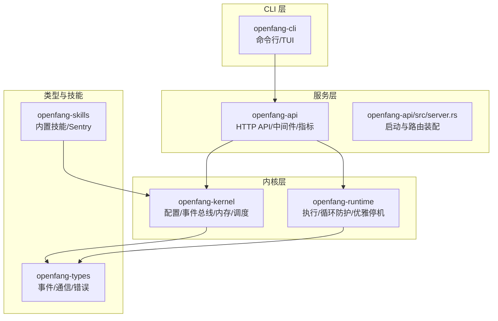
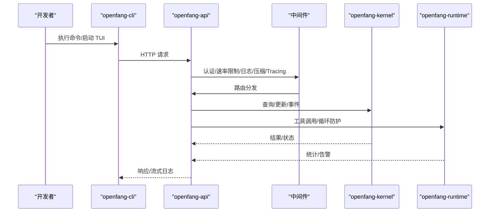
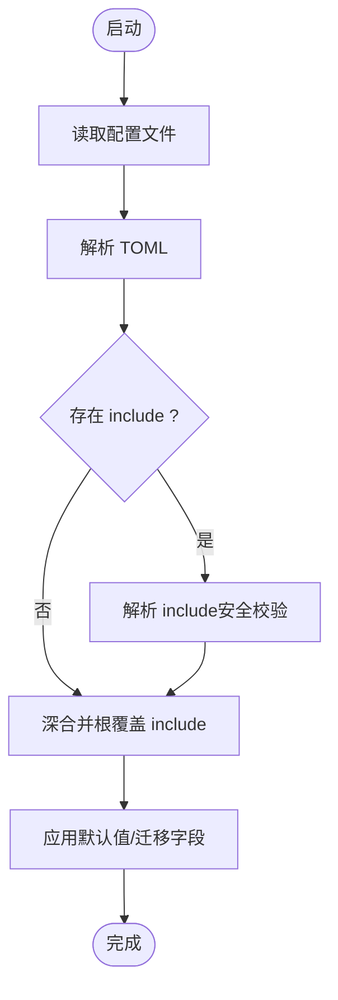
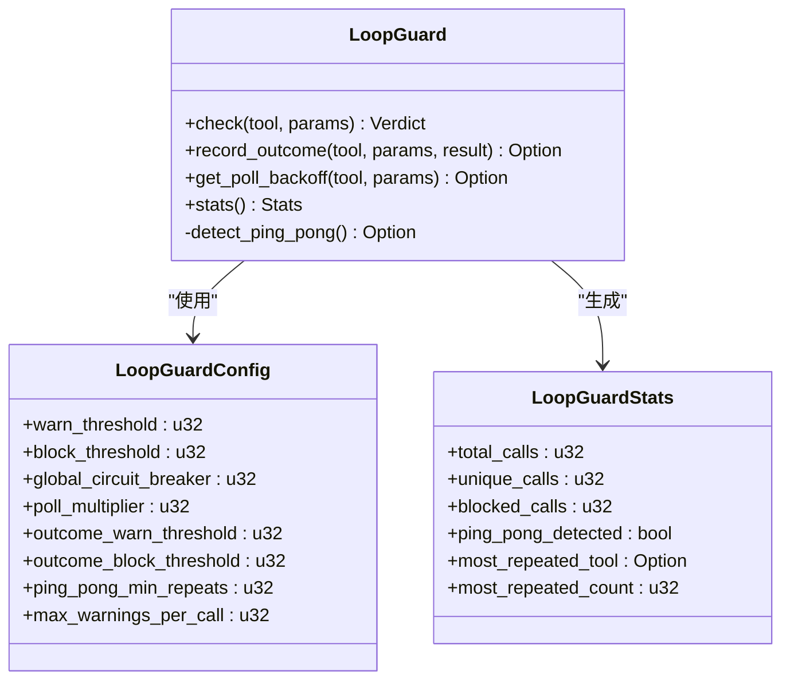
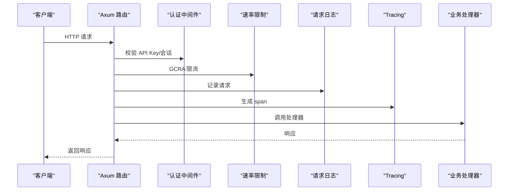
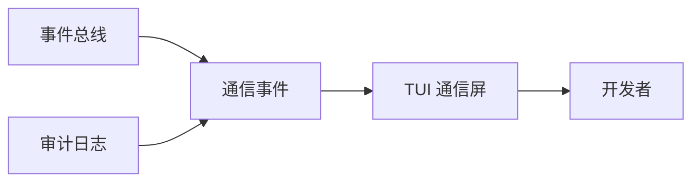
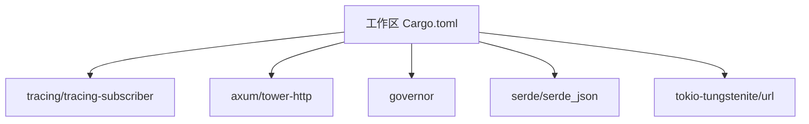
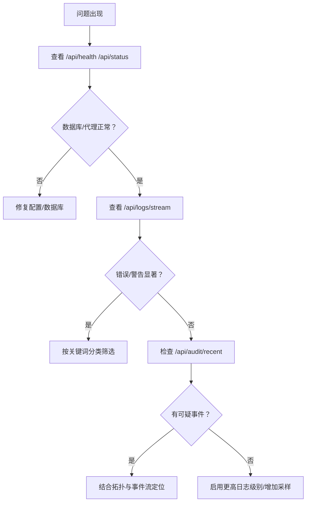

# 调试和性能分析

<cite>
**本文引用的文件**
- [Cargo.toml](file://Cargo.toml)
- [openfang.toml.example](file://openfang.toml.example)
- [crates/openfang-kernel/src/config.rs](file://crates/openfang-kernel/src/config.rs)
- [crates/openfang-cli/src/main.rs](file://crates/openfang-cli/src/main.rs)
- [crates/openfang-cli/src/tui/screens/logs.rs](file://crates/openfang-cli/src/tui/screens/logs.rs)
- [crates/openfang-runtime/src/loop_guard.rs](file://crates/openfang-runtime/src/loop_guard.rs)
- [crates/openfang-api/src/server.rs](file://crates/openfang-api/src/server.rs)
- [crates/openfang-api/src/routes.rs](file://crates/openfang-api/src/routes.rs)
- [crates/openfang-api/static/js/pages/hands.js](file://crates/openfang-api/static/js/pages/hands.js)
- [crates/openfang-kernel/src/kernel.rs](file://crates/openfang-kernel/src/kernel.rs)
- [crates/openfang-kernel/src/error.rs](file://crates/openfang-kernel/src/error.rs)
- [crates/openfang-types/src/event.rs](file://crates/openfang-types/src/event.rs)
- [crates/openfang-cli/src/tui/screens/comms.rs](file://crates/openfang-cli/src/tui/screens/comms.rs)
- [crates/openfang-runtime/src/graceful_shutdown.rs](file://crates/openfang-runtime/src/graceful_shutdown.rs)
- [crates/openfang-runtime/src/prompt_builder.rs](file://crates/openfang-runtime/src/prompt_builder.rs)
- [crates/openfang-api/tests/load_test.rs](file://crates/openfang-api/tests/load_test.rs)
- [crates/openfang-kernel/tests/multi_agent_test.rs](file://crates/openfang-kernel/tests/multi_agent_test.rs)
- [crates/openfang-skills/bundled/sentry/SKILL.md](file://crates/openfang-skills/bundled/sentry/SKILL.md)
</cite>

## 目录
1. [简介](#简介)
2. [项目结构](#项目结构)
3. [核心组件](#核心组件)
4. [架构总览](#架构总览)
5. [详细组件分析](#详细组件分析)
6. [依赖关系分析](#依赖关系分析)
7. [性能考量](#性能考量)
8. [故障排除指南](#故障排除指南)
9. [结论](#结论)
10. [附录](#附录)

## 简介
本指南面向 OpenFang 的开发者与运维工程师，系统性介绍调试与性能分析方法论与实操步骤。内容覆盖：
- 开发调试技巧：日志级别配置、断点设置、TUI 观测、事件流追踪
- 性能分析工具：CPU/内存分析、负载测试、指标采集与可视化
- 分布式调试：多智能体协作、网络通信观测、拓扑与事件流
- 常见瓶颈识别与优化策略：循环调用防护、内存合并、速率限制
- 工具链与 IDE 配置：日志过滤、远程调试、热重载
- 故障排除：健康检查、审计日志、根因分析

## 项目结构
OpenFang 采用多 crate 的工作区组织，核心与调试相关的模块包括：
- openfang-kernel：内核、配置加载、事件总线、内存管理、调度器
- openfang-runtime：运行时执行、工具循环防护、优雅停机、提示构建
- openfang-api：HTTP API、路由、中间件、指标导出、通道桥接
- openfang-cli：命令行、TUI、日志流、健康检查
- openfang-types：类型定义（事件、通信、错误等）
- openfang-skills：内置技能（含 Sentry 技能）

图表来源
- [crates/openfang-cli/src/main.rs](file://crates/openfang-cli/src/main.rs)
- [crates/openfang-api/src/server.rs](file://crates/openfang-api/src/server.rs)
- [crates/openfang-kernel/src/config.rs](file://crates/openfang-kernel/src/config.rs)
- [crates/openfang-runtime/src/loop_guard.rs](file://crates/openfang-runtime/src/loop_guard.rs)
- [crates/openfang-types/src/event.rs](file://crates/openfang-types/src/event.rs)
- [crates/openfang-skills/bundled/sentry/SKILL.md](file://crates/openfang-skills/bundled/sentry/SKILL.md)

章节来源
- [Cargo.toml](file://Cargo.toml)
- [crates/openfang-cli/src/main.rs](file://crates/openfang-cli/src/main.rs)
- [crates/openfang-api/src/server.rs](file://crates/openfang-api/src/server.rs)

## 核心组件
- 日志与配置
  - 配置加载与热重载：支持 include 深度限制、路径安全校验、默认值回退
  - CLI 读取配置 log_level 并影响日志输出
- 运行时防护
  - 循环调用检测：基于工具调用哈希、结果哈希、轮询工具阈值、Ping-Pong 检测
  - 优雅停机：阶段化关闭、广播与等待
- API 与可观测性
  - 中间件：认证、速率限制、安全头、请求日志、压缩、Tracing
  - 指标：Prometheus 暴露、令牌用量、工具调用计数、重启/崩溃统计
  - 事件与通信：事件总线、审计日志、通信拓扑与事件流
- 多智能体与网络
  - 代理列表、消息发送、会话管理、A2A 协议
  - 网络事件：连接/断开、消息接收、发现结果

章节来源
- [crates/openfang-kernel/src/config.rs](file://crates/openfang-kernel/src/config.rs)
- [crates/openfang-cli/src/main.rs](file://crates/openfang-cli/src/main.rs)
- [crates/openfang-runtime/src/loop_guard.rs](file://crates/openfang-runtime/src/loop_guard.rs)
- [crates/openfang-runtime/src/graceful_shutdown.rs](file://crates/openfang-runtime/src/graceful_shutdown.rs)
- [crates/openfang-api/src/server.rs](file://crates/openfang-api/src/server.rs)
- [crates/openfang-api/src/routes.rs](file://crates/openfang-api/src/routes.rs)
- [crates/openfang-types/src/event.rs](file://crates/openfang-types/src/event.rs)

## 架构总览
下图展示从 CLI 到 API、再到内核与运行时的整体调用链路，以及关键中间件与可观测性组件。

图表来源
- [crates/openfang-cli/src/main.rs](file://crates/openfang-cli/src/main.rs)
- [crates/openfang-api/src/server.rs](file://crates/openfang-api/src/server.rs)
- [crates/openfang-kernel/src/kernel.rs](file://crates/openfang-kernel/src/kernel.rs)
- [crates/openfang-runtime/src/loop_guard.rs](file://crates/openfang-runtime/src/loop_guard.rs)

## 详细组件分析

### 日志与配置系统
- 配置加载
  - 支持 include 文件深合并，带深度上限、绝对路径拒绝、路径穿越拦截、循环 include 检测
  - 默认回退到 info 级别，保证稳定性
- CLI 日志级别
  - 通过解析配置文件中的 log_level 字段决定日志输出级别
- TUI 日志分类
  - 基于 action/detail 关键词自动分类为 Error/Warn/Info，便于筛选

图表来源
- [crates/openfang-kernel/src/config.rs](file://crates/openfang-kernel/src/config.rs)
- [crates/openfang-cli/src/main.rs](file://crates/openfang-cli/src/main.rs)
- [crates/openfang-cli/src/tui/screens/logs.rs](file://crates/openfang-cli/src/tui/screens/logs.rs)

章节来源
- [crates/openfang-kernel/src/config.rs](file://crates/openfang-kernel/src/config.rs)
- [crates/openfang-cli/src/main.rs](file://crates/openfang-cli/src/main.rs)
- [crates/openfang-cli/src/tui/screens/logs.rs](file://crates/openfang-cli/src/tui/screens/logs.rs)

### 运行时循环防护与性能监控
- 循环防护
  - 基于工具名+参数的 SHA-256 哈希计数，支持“相同调用+相同结果”更敏感的阻断
  - 轮询工具（如 shell_exec）阈值放宽；Ping-Pong 模式检测（A-B-A-B 或 A-B-C-A-B-C）
  - 提供统计快照，暴露最重复工具、阻断次数、是否检测到 Ping-Pong
- 优雅停机
  - 阶段化关闭：运行中、排空、广播、等待代理、完成
  - 避免资源泄露与数据不一致

图表来源
- [crates/openfang-runtime/src/loop_guard.rs](file://crates/openfang-runtime/src/loop_guard.rs)

章节来源
- [crates/openfang-runtime/src/loop_guard.rs](file://crates/openfang-runtime/src/loop_guard.rs)
- [crates/openfang-runtime/src/graceful_shutdown.rs](file://crates/openfang-runtime/src/graceful_shutdown.rs)

### API 中间件与可观测性
- 中间件栈
  - 认证（API Key/会话）、速率限制（GCRA）、安全头、请求日志、压缩、Tracing
- 指标导出
  - Prometheus 指标：令牌用量、工具调用、重启/崩溃计数、代理数量、数据库连通性
- 日志流
  - SSE 实时日志流，便于远程调试与生产观测

图表来源
- [crates/openfang-api/src/server.rs](file://crates/openfang-api/src/server.rs)
- [crates/openfang-api/src/routes.rs](file://crates/openfang-api/src/routes.rs)

章节来源
- [crates/openfang-api/src/server.rs](file://crates/openfang-api/src/server.rs)
- [crates/openfang-api/src/routes.rs](file://crates/openfang-api/src/routes.rs)

### 多智能体与网络通信调试
- 代理与会话
  - 列表、聊天、重启、模型切换、工具/技能管理、文件上传/下载
- 通信拓扑与事件流
  - 事件总线历史、审计日志转为通信事件，支持实时流
  - TUI 展示节点/边拓扑、事件列表，辅助定位通信异常
- 网络事件
  - PeerConnected/PeerDisconnected、MessageReceived、DiscoveryResult

图表来源
- [crates/openfang-api/src/routes.rs](file://crates/openfang-api/src/routes.rs)
- [crates/openfang-cli/src/tui/screens/comms.rs](file://crates/openfang-cli/src/tui/screens/comms.rs)
- [crates/openfang-types/src/event.rs](file://crates/openfang-types/src/event.rs)

章节来源
- [crates/openfang-api/src/routes.rs](file://crates/openfang-api/src/routes.rs)
- [crates/openfang-cli/src/tui/screens/comms.rs](file://crates/openfang-cli/src/tui/screens/comms.rs)
- [crates/openfang-types/src/event.rs](file://crates/openfang-types/src/event.rs)

### 内存与周期性任务
- 内存合并
  - 定时衰减与合并，记录合并/衰减数量与耗时，避免内存膨胀
- 配置热重载
  - 检测配置文件修改，30 秒轮询，触发内核热重载并记录变更计划

章节来源
- [crates/openfang-kernel/src/kernel.rs](file://crates/openfang-kernel/src/kernel.rs)
- [crates/openfang-api/src/server.rs](file://crates/openfang-api/src/server.rs)

## 依赖关系分析
- 工作区与依赖
  - 工作区统一管理 Rust 版本、Tokio 全功能特性、Tracing 与订阅器、Axum/Tower 中间件栈
  - 通过 env-filter 与 JSON 输出支持结构化日志
- 关键外部库
  - tracing/tracing-subscriber：日志与追踪
  - axum/tower-http：中间件与 HTTP 能力
  - governor：速率限制
  - serde/serde_json：序列化
  - tokio-tungstenite/url：WebSocket 与网络通信

图表来源
- [Cargo.toml](file://Cargo.toml)

章节来源
- [Cargo.toml](file://Cargo.toml)

## 性能考量
- CPU 使用率分析
  - 使用系统级采样工具（perf/fxprof）结合火焰图定位热点函数
  - 在高并发场景下，关注 Tokio 任务调度与阻塞操作
- 内存泄漏检测
  - 使用 heaptrack/Valgrind/mimalloc 的堆快照对比，定位未释放对象
  - 关注大对象缓存与长生命周期集合（DashMap、VecDeque）
- 负载测试与基准
  - API 负载测试：并发读取、延迟分位数（p50/p95/p99），确保端点延迟达标
  - 多智能体集成测试：批量 Spawn 与消息发送，验证吞吐与稳定性
- 指标与可视化
  - Prometheus 指标：令牌用量、工具调用、重启/崩溃、代理数量
  - 前端页面格式化显示：时长与数字格式化，Toast 提示

章节来源
- [crates/openfang-api/tests/load_test.rs](file://crates/openfang-api/tests/load_test.rs)
- [crates/openfang-kernel/tests/multi_agent_test.rs](file://crates/openfang-kernel/tests/multi_agent_test.rs)
- [crates/openfang-api/src/routes.rs](file://crates/openfang-api/src/routes.rs)
- [crates/openfang-api/static/js/pages/hands.js](file://crates/openfang-api/static/js/pages/hands.js)

## 故障排除指南
- 健康检查与状态
  - /api/health 与 /api/status：数据库连通性、代理数量、重启/崩溃计数、版本与运行时长
  - /api/health/detail：详细健康信息与配置警告
- 审计与日志
  - /api/audit/recent：最近审计条目
  - /api/logs/stream：SSE 实时日志流，便于远程调试
  - TUI 日志分类：根据关键词自动归类，快速定位错误/警告
- 配置问题
  - include 深度超限、绝对路径、路径穿越、循环 include：均触发安全保护并回退默认
  - 配置热重载：30 秒轮询，检测到变更后应用并记录动作
- 错误类型与处理
  - KernelError：包装 OpenFangError 并追加内核上下文，便于定位
- 分布式与通信
  - 通信拓扑与事件流：结合事件总线与审计日志，定位消息丢失或转发异常
  - 网络事件：PeerConnected/Disconnected、MessageReceived、DiscoveryResult

图表来源
- [crates/openfang-api/src/routes.rs](file://crates/openfang-api/src/routes.rs)
- [crates/openfang-cli/src/tui/screens/logs.rs](file://crates/openfang-cli/src/tui/screens/logs.rs)
- [crates/openfang-kernel/src/error.rs](file://crates/openfang-kernel/src/error.rs)

章节来源
- [crates/openfang-api/src/routes.rs](file://crates/openfang-api/src/routes.rs)
- [crates/openfang-cli/src/tui/screens/logs.rs](file://crates/openfang-cli/src/tui/screens/logs.rs)
- [crates/openfang-kernel/src/error.rs](file://crates/openfang-kernel/src/error.rs)

## 结论
通过完善的日志与配置体系、运行时循环防护、中间件与指标导出、以及多智能体与网络通信可观测性，OpenFang 提供了从开发到生产的全链路调试与性能分析能力。建议在开发阶段开启更细粒度日志，在生产环境启用结构化日志与指标，并结合负载测试与火焰图持续优化性能瓶颈。

## 附录
- 配置文件示例与关键项
  - 默认模型、内存衰减、网络监听地址、会话压缩、MCP 服务器等
- Sentry 技能要点
  - 初始化时机、环境与版本标注、采样率、PII 清理、源映射与性能监控

章节来源
- [openfang.toml.example](file://openfang.toml.example)
- [crates/openfang-skills/bundled/sentry/SKILL.md](file://crates/openfang-skills/bundled/sentry/SKILL.md)