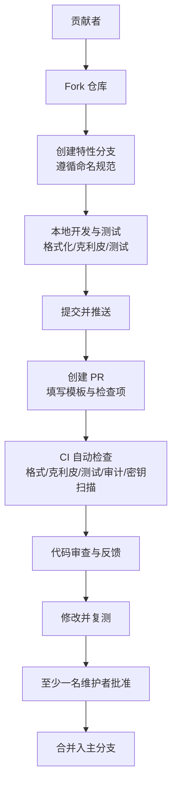
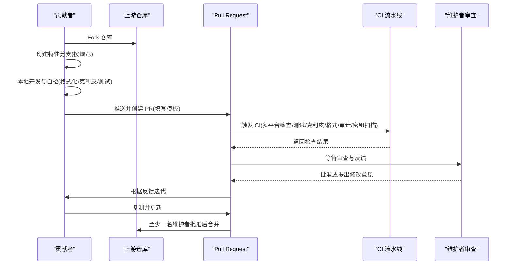
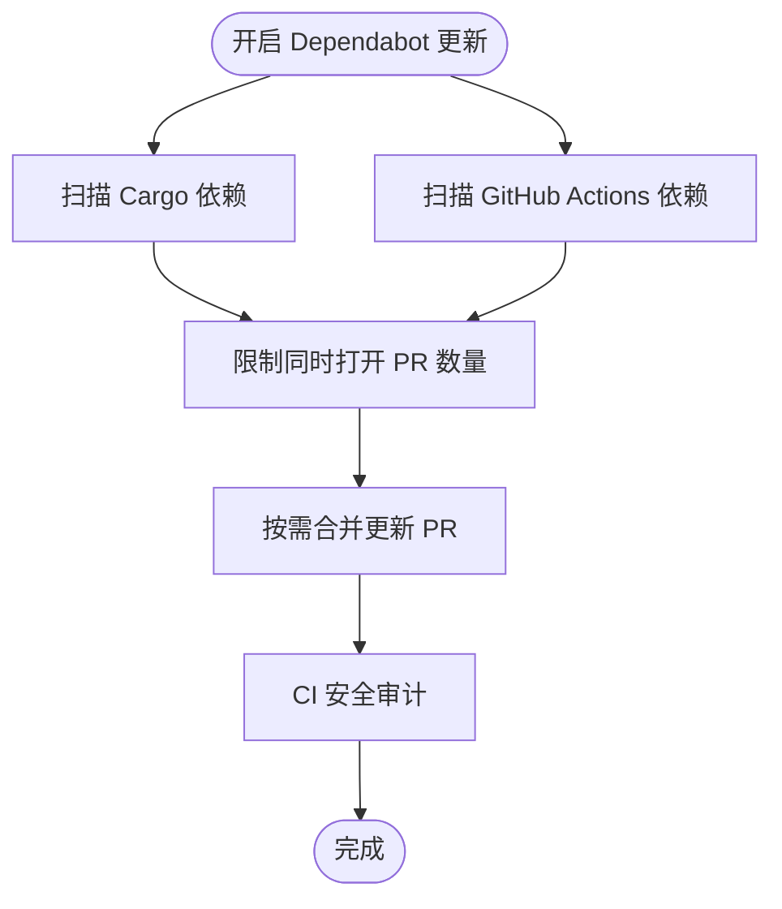

# 贡献流程

<cite>
**本文引用的文件**
- [CONTRIBUTING.md](file://CONTRIBUTING.md)
- [.github/pull_request_template.md](file://.github/pull_request_template.md)
- [.github/dependabot.yml](file://.github/dependabot.yml)
- [.github/ISSUE_TEMPLATE/bug_report.yml](file://.github/ISSUE_TEMPLATE/bug_report.yml)
- [.github/ISSUE_TEMPLATE/feature_request.yml](file://.github/ISSUE_TEMPLATE/feature_request.yml)
- [.github/workflows/ci.yml](file://.github/workflows/ci.yml)
- [.github/workflows/release.yml](file://.github/workflows/release.yml)
- [SECURITY.md](file://SECURITY.md)
</cite>

## 目录
1. [简介](#简介)
2. [项目结构](#项目结构)
3. [核心组件](#核心组件)
4. [架构总览](#架构总览)
5. [详细组件分析](#详细组件分析)
6. [依赖分析](#依赖分析)
7. [性能考虑](#性能考虑)
8. [故障排查指南](#故障排查指南)
9. [结论](#结论)
10. [附录](#附录)

## 简介
本指南面向所有希望为 OpenFang 做出贡献的开发者，覆盖从环境搭建、分支与 PR 流程、代码风格与测试要求，到 CI 检查、安全披露与社区协作等全流程规范。目标是帮助贡献者以一致、可重复的方式交付高质量变更，并确保合并前满足质量与安全门槛。

## 项目结构
- 贡献相关的核心入口与模板位于仓库根目录与 .github 目录：
  - 贡献总则与开发指引：[CONTRIBUTING.md]
  - PR 模板：[.github/pull_request_template.md]
  - 问题模板（缺陷/功能）：[.github/ISSUE_TEMPLATE/bug_report.yml], [.github/ISSUE_TEMPLATE/feature_request.yml]
  - 依赖自动更新配置：[.github/dependabot.yml]
  - CI/发布流水线：[.github/workflows/ci.yml], [.github/workflows/release.yml]
  - 安全策略：[SECURITY.md]

图表来源
- [.github/workflows/ci.yml:1-139](file://.github/workflows/ci.yml#L1-L139)
- [.github/pull_request_template.md:1-20](file://.github/pull_request_template.md#L1-L20)
- [CONTRIBUTING.md:328-356](file://CONTRIBUTING.md#L328-L356)

章节来源
- [CONTRIBUTING.md:19-49](file://CONTRIBUTING.md#L19-L49)
- [.github/workflows/ci.yml:1-139](file://.github/workflows/ci.yml#L1-L139)

## 核心组件
- 开发与测试
  - 构建与测试命令、快速发布构建、单 crate 测试、克利皮警告、代码格式化、医生检查等均在贡献指南中有明确说明。
- 代码风格
  - 格式化、克利皮零警告、文档注释、错误处理、命名规范、依赖复用、测试实践、序列化默认值等。
- 提交与 PR 流程
  - 分支命名、PR 描述要求、关注点分离、至少一名维护者批准、CI 必须全部通过。
- CI/自动化
  - 多平台检查、测试、克利皮、格式化、安全审计、密钥扫描、安装脚本烟雾测试。
- 问题与模板
  - 缺陷报告与功能请求模板字段与必填项。
- 安全策略
  - 支持版本、漏洞上报流程、预期响应时间、范围与安全架构要点。

章节来源
- [CONTRIBUTING.md:51-125](file://CONTRIBUTING.md#L51-L125)
- [CONTRIBUTING.md:328-356](file://CONTRIBUTING.md#L328-L356)
- [.github/workflows/ci.yml:13-139](file://.github/workflows/ci.yml#L13-L139)
- [.github/ISSUE_TEMPLATE/bug_report.yml:1-63](file://.github/ISSUE_TEMPLATE/bug_report.yml#L1-L63)
- [.github/ISSUE_TEMPLATE/feature_request.yml:1-25](file://.github/ISSUE_TEMPLATE/feature_request.yml#L1-L25)
- [SECURITY.md:1-95](file://SECURITY.md#L1-L95)

## 架构总览
下图展示贡献者从 Fork 到合并的关键步骤与自动化检查节点，映射到实际的 CI 工作流与 PR 模板。

图表来源
- [.github/workflows/ci.yml:1-139](file://.github/workflows/ci.yml#L1-L139)
- [.github/pull_request_template.md:1-20](file://.github/pull_request_template.md#L1-L20)
- [CONTRIBUTING.md:328-356](file://CONTRIBUTING.md#L328-L356)

## 详细组件分析

### 分支与 Fork 管理
- Fork 与分支
  - 从主分支派生特性分支，使用清晰语义的命名，如 feat/* 或 fix/*。
- 合并与同步
  - 在提交 PR 前，建议将上游主分支的最新更改 rebase 到你的分支，保持历史整洁。
- 依赖自动更新
  - 通过 Dependabot 对 Cargo 与 GitHub Actions 进行每周扫描与限制 PR 数量，降低维护负担。

章节来源
- [CONTRIBUTING.md:328-356](file://CONTRIBUTING.md#L328-L356)
- [.github/dependabot.yml:1-18](file://.github/dependabot.yml#L1-L18)

### PR 创建与描述规范
- 描述编写要求
  - 清晰说明变更内容与动机；如有前后对比，建议补充示例链接或截图。
- 关注点分离
  - 单一 PR 只聚焦于一个功能、一个修复或一次重构，避免混杂多种改动。
- PR 模板检查项
  - 克利皮零警告、工作区测试全部通过、必要时进行线上集成测试。
  - 安全相关检查：无新增不安全代码、无密钥泄露、边界输入验证。

章节来源
- [CONTRIBUTING.md:328-356](file://CONTRIBUTING.md#L328-L356)
- [.github/pull_request_template.md:1-20](file://.github/pull_request_template.md#L1-L20)

### 代码审查流程
- 审查要求
  - 至少需要一名维护者批准方可合并。
- 反馈处理
  - 及时响应审查意见，逐条回复并补充必要的测试或文档。
- 合并时机
  - CI 全部通过且审查已批准后，由维护者执行合并。

章节来源
- [CONTRIBUTING.md:328-356](file://CONTRIBUTING.md#L328-L356)

### CI 检查与自动化测试
- 触发条件
  - 推送到主分支或针对主分支的 PR 都会触发 CI。
- 检查矩阵
  - 多平台（Ubuntu/MacOS/Windows）上的检查、测试、克利皮、格式化、安全审计、密钥扫描。
- 通过标准
  - 所有作业必须成功，否则禁止合并。
- 安装脚本烟雾测试
  - 对线上安装脚本进行语法检查，确保可部署性。

章节来源
- [.github/workflows/ci.yml:1-139](file://.github/workflows/ci.yml#L1-L139)

### 提交信息格式
- 使用清晰的祈使语气，简洁描述一次提交的目的与影响，便于审阅与回溯。

章节来源
- [CONTRIBUTING.md:347-356](file://CONTRIBUTING.md#L347-L356)

### 问题报告模板使用
- 缺陷报告
  - 必填：问题描述、期望行为、复现步骤、版本、操作系统、日志/截图。
- 功能请求
  - 必填：功能描述、替代方案、上下文与参考。

章节来源
- [.github/ISSUE_TEMPLATE/bug_report.yml:1-63](file://.github/ISSUE_TEMPLATE/bug_report.yml#L1-L63)
- [.github/ISSUE_TEMPLATE/feature_request.yml:1-25](file://.github/ISSUE_TEMPLATE/feature_request.yml#L1-L25)

### 社区交流与讨论
- 讨论与提问
  - 通过 GitHub Discussions 进行一般性问题与想法讨论。
- 缺陷与需求
  - 通过 Issues 的缺陷报告与功能请求模板进行正式记录。

章节来源
- [CONTRIBUTING.md:367-372](file://CONTRIBUTING.md#L367-L372)

### 贡献认可与行为准则
- 行为准则
  - 遵循贡献者公约，营造包容、友善、无骚扰的社区环境。
- 贡献认可
  - 仓库未设置专门的贡献徽章或统计机制，贡献认可以社区致谢与版本公告为主。

章节来源
- [CONTRIBUTING.md:359-366](file://CONTRIBUTING.md#L359-L366)

## 依赖分析
- 依赖自动更新
  - Cargo 生态与 GitHub Actions 均启用 weekly 扫描，限制同时打开的 PR 数量，避免过多依赖引入造成维护压力。
- 安全审计
  - CI 中包含安全审计作业，确保关键依赖的已知漏洞被及时发现与处理。

图表来源
- [.github/dependabot.yml:1-18](file://.github/dependabot.yml#L1-L18)
- [.github/workflows/ci.yml:96-106](file://.github/workflows/ci.yml#L96-L106)

章节来源
- [.github/dependabot.yml:1-18](file://.github/dependabot.yml#L1-L18)
- [.github/workflows/ci.yml:96-106](file://.github/workflows/ci.yml#L96-L106)

## 性能考虑
- 本地迭代建议
  - 使用快速发布配置进行本地快速验证，最终产物再使用完整优化配置。
- CI 并行矩阵
  - 多平台并行检查与测试，缩短反馈周期；同时注意缓存命中率与系统依赖安装。

章节来源
- [CONTRIBUTING.md:59-68](file://CONTRIBUTING.md#L59-L68)
- [.github/workflows/ci.yml:14-65](file://.github/workflows/ci.yml#L14-L65)

## 故障排查指南
- CI 失败常见原因
  - 格式化不合规、克利皮警告、测试失败、安全审计异常、检测到潜在密钥泄露。
- 本地自检清单
  - 在提交前运行格式化、克利皮与工作区测试，确保本地状态与 CI 一致。
- 安全问题上报
  - 发现安全漏洞请勿开公开 Issue，按安全策略邮件上报并等待响应。

章节来源
- [.github/workflows/ci.yml:86-125](file://.github/workflows/ci.yml#L86-L125)
- [CONTRIBUTING.md:85-99](file://CONTRIBUTING.md#L85-L99)
- [SECURITY.md:9-31](file://SECURITY.md#L9-L31)

## 结论
遵循本指南可显著提升贡献效率与合并成功率。请始终以“单一关注点、清晰描述、严格自检、CI 通过、维护者批准”为准则，配合安全策略与社区行为准则，共同维护 OpenFang 的质量与生态健康。

## 附录
- 术语
  - PR：Pull Request
  - CI：持续集成
  - LTO：链接时优化
  - WASM：WebAssembly
- 参考路径
  - 贡献总则与开发指引：[CONTRIBUTING.md]
  - PR 模板与检查项：[.github/pull_request_template.md]
  - 问题模板（缺陷/功能）：[.github/ISSUE_TEMPLATE/bug_report.yml], [.github/ISSUE_TEMPLATE/feature_request.yml]
  - CI/发布流水线：[.github/workflows/ci.yml], [.github/workflows/release.yml]
  - 安全策略：[SECURITY.md]
  - 依赖自动更新：[.github/dependabot.yml]