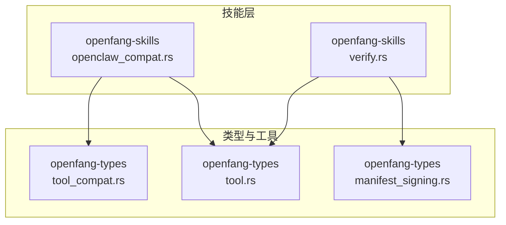
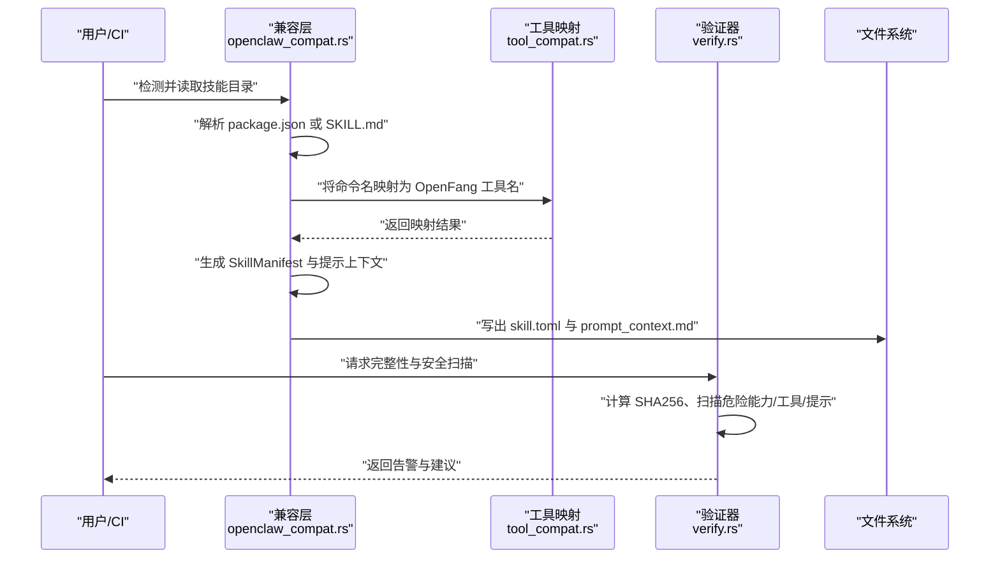
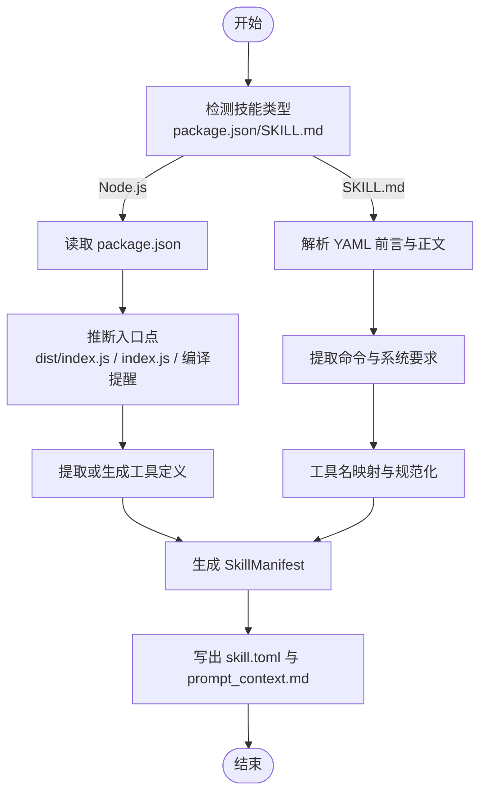
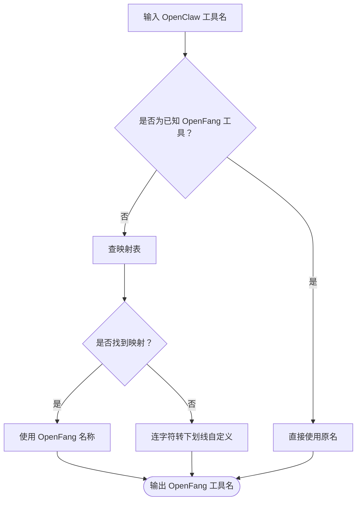
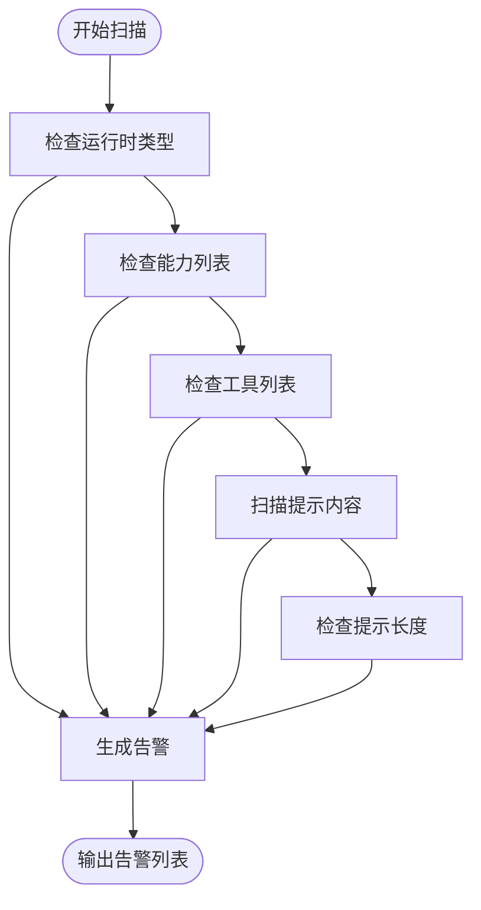
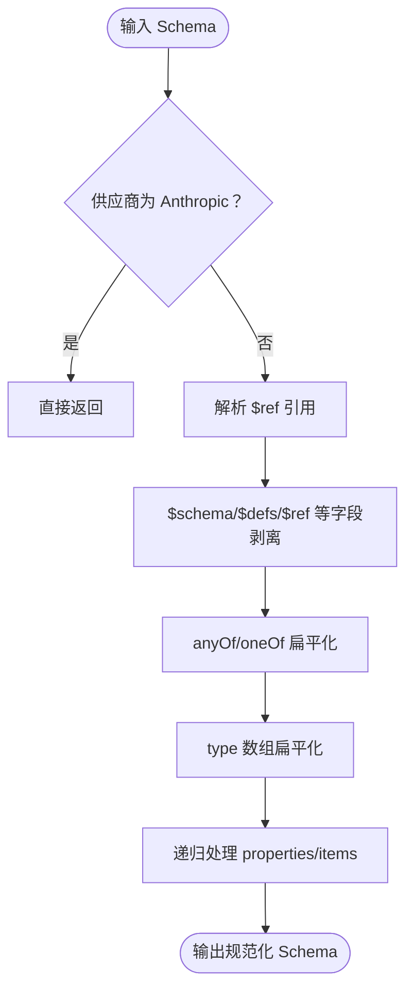
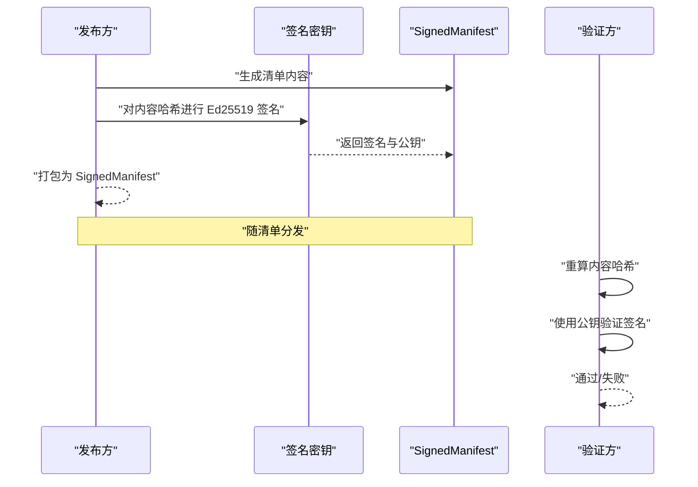
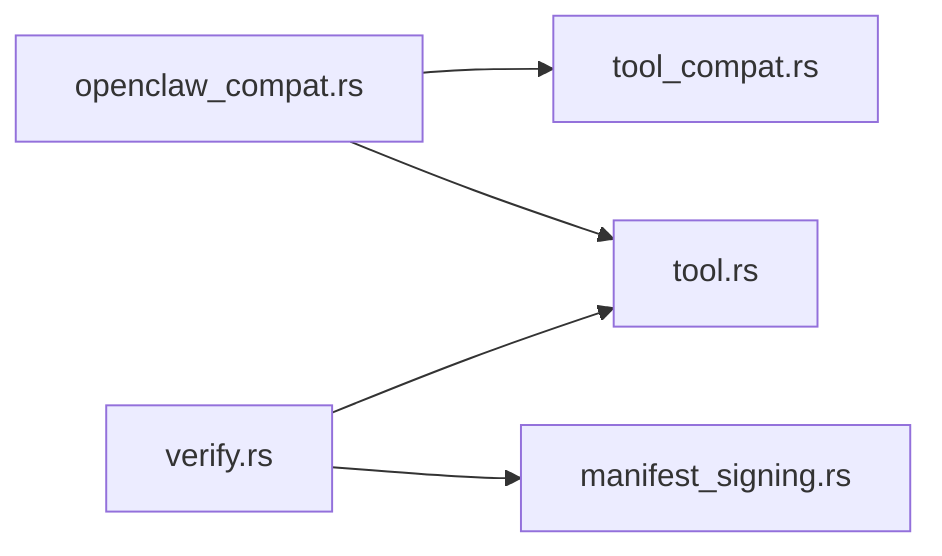

# 兼容性支持

<cite>
**本文引用的文件**
- [openfang-skills/src/openclaw_compat.rs](file://crates/openfang-skills/src/openclaw_compat.rs)
- [openfang-skills/src/verify.rs](file://crates/openfang-skills/src/verify.rs)
- [openfang-types/src/tool_compat.rs](file://crates/openfang-types/src/tool_compat.rs)
- [openfang-types/src/tool.rs](file://crates/openfang-types/src/tool.rs)
- [openfang-types/src/manifest_signing.rs](file://crates/openfang-types/src/manifest_signing.rs)
</cite>

## 目录
1. [简介](#简介)
2. [项目结构](#项目结构)
3. [核心组件](#核心组件)
4. [架构总览](#架构总览)
5. [详细组件分析](#详细组件分析)
6. [依赖关系分析](#依赖关系分析)
7. [性能考量](#性能考量)
8. [故障排除指南](#故障排除指南)
9. [结论](#结论)
10. [附录](#附录)

## 简介
本文件面向从 OpenClaw 迁移至 OpenFang 的用户与维护者，系统化阐述 OpenFang 技能兼容性体系的设计与实现，包括：
- 兼容层工作机制：如何识别并转换 OpenClaw 的两种技能格式（Node.js/TypeScript 模块与 SKILL.md 提示型技能）
- 迁移策略与转换规则：从 OpenClaw 工具名到 OpenFang 标准工具名的映射、运行时类型推断、提示上下文注入
- 验证与安全：完整性校验、SHA256 校验、安全扫描、提示内容注入风险检测
- 行为一致性与 API 兼容：跨供应商工具 Schema 规范化、签名与供应链完整性
- 版本管理与向后兼容：兼容层的版本标记、破坏性变更处理建议
- 实操指南：迁移步骤、工具使用、常见问题与最佳实践

## 项目结构
OpenFang 在 crates 中通过独立 crate 组织能力：
- openfang-skills：技能加载、兼容层转换、验证器
- openfang-types：通用类型、工具定义、工具 Schema 规范化、清单签名
- openfang-runtime：运行时驱动、工具执行、会话与沙箱等（与兼容性相关）

**图表来源**
- [openfang-skills/src/openclaw_compat.rs](file://crates/openfang-skills/src/openclaw_compat.rs)
- [openfang-skills/src/verify.rs](file://crates/openfang-skills/src/verify.rs)
- [openfang-types/src/tool_compat.rs](file://crates/openfang-types/src/tool_compat.rs)
- [openfang-types/src/tool.rs](file://crates/openfang-types/src/tool.rs)
- [openfang-types/src/manifest_signing.rs](file://crates/openfang-types/src/manifest_signing.rs)

**章节来源**
- [openfang-skills/src/openclaw_compat.rs](file://crates/openfang-skills/src/openclaw_compat.rs)
- [openfang-types/src/tool_compat.rs](file://crates/openfang-types/src/tool_compat.rs)

## 核心组件
- OpenClaw 兼容层：负责检测与转换两类 OpenClaw 技能，生成 OpenFang 的 SkillManifest，并可输出配套的提示上下文文件
- 工具名映射：将 OpenClaw 命令名标准化为 OpenFang 内置工具名，覆盖大小写、连字符、LLM 幻觉别名等
- 验证器：对技能进行完整性校验（SHA256）、安全扫描（危险运行时、能力、工具、提示内容），并给出告警等级
- 工具 Schema 规范化：针对不同大模型供应商（如 Gemini、Groq、Anthropic）差异，统一工具输入 Schema
- 清单签名：Ed25519 对技能清单进行签名与验证，保障供应链完整性

**章节来源**
- [openfang-skills/src/openclaw_compat.rs](file://crates/openfang-skills/src/openclaw_compat.rs)
- [openfang-skills/src/verify.rs](file://crates/openfang-skills/src/verify.rs)
- [openfang-types/src/tool_compat.rs](file://crates/openfang-types/src/tool_compat.rs)
- [openfang-types/src/tool.rs](file://crates/openfang-types/src/tool.rs)
- [openfang-types/src/manifest_signing.rs](file://crates/openfang-types/src/manifest_signing.rs)

## 架构总览
下图展示从 OpenClaw 技能到 OpenFang 可用技能的端到端流程，包括检测、解析、转换、验证与输出。

**图表来源**
- [openfang-skills/src/openclaw_compat.rs](file://crates/openfang-skills/src/openclaw_compat.rs)
- [openfang-types/src/tool_compat.rs](file://crates/openfang-types/src/tool_compat.rs)
- [openfang-skills/src/verify.rs](file://crates/openfang-skills/src/verify.rs)

## 详细组件分析

### OpenClaw 兼容层（openfang-skills/openclaw_compat.rs）
- 功能概览
  - 检测 OpenClaw 技能：Node.js/TypeScript 模块（package.json + index.js/ts）与 SKILL.md 提示型技能
  - 解析与转换：将 OpenClaw 的元数据与命令定义转换为 OpenFang 的 SkillManifest；SKILL.md 的正文作为提示上下文注入
  - 输出：生成 skill.toml 与 prompt_context.md，便于后续加载与审计
- 关键流程
  - Node.js 技能：读取 package.json，推断入口点（dist/index.js > index.js > TypeScript 需先编译），提取或生成工具定义
  - SKILL.md 技能：解析 YAML 前言与正文，提取 OpenClaw 元数据中的命令与系统要求，映射为 OpenFang 工具定义
  - 工具名映射：优先使用工具映射表，其次保留原名并规范化（连字符转下划线），最后若已是 OpenFang 工具名则直接复用
  - 运行时类型：若无可执行入口或命令，判定为 PromptOnly（提示型）
- 错误处理
  - 缺少必要文件、非法 JSON/YAML、TypeScript 未编译等场景均抛出明确错误，便于定位与修复

**图表来源**
- [openfang-skills/src/openclaw_compat.rs](file://crates/openfang-skills/src/openclaw_compat.rs)

**章节来源**
- [openfang-skills/src/openclaw_compat.rs](file://crates/openfang-skills/src/openclaw_compat.rs)

### 工具名映射（openfang-types/tool_compat.rs）
- 设计目标：在 OpenClaw 与 OpenFang 之间建立稳定的工具名桥梁，覆盖多种别名风格（大小写、连字符、LLM 幻觉别名）
- 能力范围
  - 映射表：将 OpenClaw 命令名映射到 OpenFang 内置工具名（如 Read/Bash/WebSearch 等）
  - 归一化：若已是 OpenFang 工具名则保持不变；否则尝试映射；未知名保持原样
  - 已知工具集：内置 23+ 工具名集合，用于快速判断是否为 OpenFang 原生工具
- 使用方式
  - 兼容层在转换过程中调用映射函数，生成 OpenFang 工具定义
  - 测试覆盖了所有映射路径与边界情况

**图表来源**
- [openfang-types/src/tool_compat.rs](file://crates/openfang-types/src/tool_compat.rs)

**章节来源**
- [openfang-types/src/tool_compat.rs](file://crates/openfang-types/src/tool_compat.rs)

### 验证与安全（openfang-skills/verify.rs）
- 完整性校验
  - SHA256 计算与比对：对二进制或文本内容进行哈希，支持大小写不敏感比较
- 安全扫描
  - 危险运行时：Node.js 运行时具有广泛文件系统与网络访问权限，标记为警告
  - 危险能力与工具：ShellExec、NetConnect(*)、shell_exec、file_write/delete 等高危项标记为严重或警告
  - 工具数量：异常多的工具需求可能隐藏风险，标记为信息级别
  - 提示内容扫描：检测注入类关键词（如“忽略先前指令”）、数据外泄模式（发送到 HTTP/HTTPS）、可疑 Shell 命令引用；过大提示内容也会被标记
- 结果语义
  - 告警分为 Info/Warning/Critical 三个等级，便于分级审批与处置

**图表来源**
- [openfang-skills/src/verify.rs](file://crates/openfang-skills/src/verify.rs)

**章节来源**
- [openfang-skills/src/verify.rs](file://crates/openfang-skills/src/verify.rs)

### 工具 Schema 规范化（openfang-types/tool.rs）
- 目标：解决不同大模型供应商对工具 Schema 的差异（如 anyOf、$ref、$schema、format、const 等关键字支持不一致）
- 处理策略
  - Anthropic：原样透传（支持 anyOf）
  - 其他供应商：递归规范化
    - 移除不受支持的关键字（如 $schema、$defs、$ref、additionalProperties、default、$id、$comment、examples、title、const、format 等）
    - 将 anyOf/oneOf 简单情形扁平化（如 ["string","null"] → type:"string"+nullable:true）
    - 将 type 数组扁平化（如 ["string","null"] → type:"string"+nullable:true）
    - 递归处理 properties/items
    - 将字符串形式的 JSON Schema 解析后再规范化
- 适用范围：工具输入 Schema 的跨供应商兼容

**图表来源**
- [openfang-types/src/tool.rs](file://crates/openfang-types/src/tool.rs)

**章节来源**
- [openfang-types/src/tool.rs](file://crates/openfang-types/src/tool.rs)

### 清单签名与供应链完整性（openfang-types/manifest_signing.rs）
- 目的：防止技能清单被篡改，确保来源可信
- 流程
  - 计算清单内容的 SHA-256
  - 使用 Ed25519 对摘要签名
  - 将签名、公钥、内容哈希打包为 SignedManifest
- 验证
  - 重新计算哈希并与嵌入哈希对比
  - 使用嵌入公钥验证签名有效性
- 应用场景：在加载前对技能清单进行完整性与真实性校验

**图表来源**
- [openfang-types/src/manifest_signing.rs](file://crates/openfang-types/src/manifest_signing.rs)

**章节来源**
- [openfang-types/src/manifest_signing.rs](file://crates/openfang-types/src/manifest_signing.rs)

## 依赖关系分析
- 兼容层依赖工具映射与工具类型定义，以确保生成的工具名称与 Schema 符合 OpenFang 标准
- 验证器依赖工具类型与清单签名模块，以进行能力扫描与完整性校验
- 工具 Schema 规范化为所有供应商提供统一输入接口，降低集成成本

**图表来源**
- [openfang-skills/src/openclaw_compat.rs](file://crates/openfang-skills/src/openclaw_compat.rs)
- [openfang-skills/src/verify.rs](file://crates/openfang-skills/src/verify.rs)
- [openfang-types/src/tool_compat.rs](file://crates/openfang-types/src/tool_compat.rs)
- [openfang-types/src/tool.rs](file://crates/openfang-types/src/tool.rs)
- [openfang-types/src/manifest_signing.rs](file://crates/openfang-types/src/manifest_signing.rs)

**章节来源**
- [openfang-skills/src/openclaw_compat.rs](file://crates/openfang-skills/src/openclaw_compat.rs)
- [openfang-skills/src/verify.rs](file://crates/openfang-skills/src/verify.rs)
- [openfang-types/src/tool_compat.rs](file://crates/openfang-types/src/tool_compat.rs)
- [openfang-types/src/tool.rs](file://crates/openfang-types/src/tool.rs)
- [openfang-types/src/manifest_signing.rs](file://crates/openfang-types/src/manifest_signing.rs)

## 性能考量
- 解析与转换
  - SKILL.md 解析为 O(n) 字符串扫描与 YAML 解析
  - Node.js 技能读取 package.json 与文件存在性检查为常数时间
- 验证与扫描
  - SHA256 计算为 O(n)，扫描提示内容按字符匹配，复杂度与内容长度线性相关
  - 安全扫描为线性扫描，开销较小
- 规范化工具 Schema
  - 递归遍历 JSON Schema，最坏情况下与属性层级与元素数量成正比，通常可接受

[本节为通用性能讨论，无需具体文件来源]

## 故障排除指南
- OpenClaw Node.js 技能无法加载
  - 症状：TypeScript 技能提示需先编译
  - 处理：在技能目录执行构建命令，确保 dist/index.js 存在
  - 参考：[openfang-skills/src/openclaw_compat.rs](file://crates/openfang-skills/src/openclaw_compat.rs)
- 缺少入口点
  - 症状：index.js 与 dist/index.js 均不存在
  - 处理：添加入口文件或先完成构建
  - 参考：[openfang-skills/src/openclaw_compat.rs](file://crates/openfang-skills/src/openclaw_compat.rs)
- SKILL.md 格式错误
  - 症状：缺少 YAML 分隔符或前言格式不正确
  - 处理：确保以 "---" 开头与结尾，且包含合法 YAML 前言
  - 参考：[openfang-skills/src/openclaw_compat.rs](file://crates/openfang-skills/src/openclaw_compat.rs)
- 工具名未映射
  - 症状：生成的工具名为自定义名称，可能不符合 OpenFang 规范
  - 处理：确认命令名是否符合映射表或是否应改为 OpenFang 内置工具名
  - 参考：[openfang-types/src/tool_compat.rs](file://crates/openfang-types/src/tool_compat.rs)
- 安全告警过高
  - 症状：出现大量警告或严重告警
  - 处理：减少危险能力/工具申请、避免 Node.js 运行时、清理提示内容中的可疑模式
  - 参考：[openfang-skills/src/verify.rs](file://crates/openfang-skills/src/verify.rs)
- 清单完整性校验失败
  - 症状：签名验证或哈希不匹配
  - 处理：重新生成签名或修正清单内容
  - 参考：[openfang-types/src/manifest_signing.rs](file://crates/openfang-types/src/manifest_signing.rs)

**章节来源**
- [openfang-skills/src/openclaw_compat.rs](file://crates/openfang-skills/src/openclaw_compat.rs)
- [openfang-types/src/tool_compat.rs](file://crates/openfang-types/src/tool_compat.rs)
- [openfang-skills/src/verify.rs](file://crates/openfang-skills/src/verify.rs)
- [openfang-types/src/manifest_signing.rs](file://crates/openfang-types/src/manifest_signing.rs)

## 结论
OpenFang 的 OpenClaw 兼容层通过“检测—解析—映射—转换—验证—输出”的闭环，实现了从 OpenClaw 到 OpenFang 的平滑迁移。配合工具 Schema 规范化与清单签名机制，既保证了行为一致性与 API 兼容，也强化了供应链安全。建议在迁移过程中严格遵循工具名映射与安全扫描流程，并在 CI 中集成完整性校验与安全扫描，以获得稳定可靠的技能生态。

[本节为总结性内容，无需具体文件来源]

## 附录

### 迁移步骤（从 OpenClaw 到 OpenFang）
- 准备阶段
  - 确认技能类型：Node.js/TypeScript 或 SKILL.md
  - 若为 Node.js：确保已构建产物（dist/index.js）可用
- 自动迁移
  - 使用兼容层检测并转换技能，生成 skill.toml 与 prompt_context.md
  - 参考：[openfang-skills/src/openclaw_compat.rs](file://crates/openfang-skills/src/openclaw_compat.rs)
- 审核与加固
  - 运行完整性校验与安全扫描，根据告警调整能力/工具/提示内容
  - 参考：[openfang-skills/src/verify.rs](file://crates/openfang-skills/src/verify.rs)
- 供应链安全
  - 对技能清单进行 Ed25519 签名，并在加载前验证
  - 参考：[openfang-types/src/manifest_signing.rs](file://crates/openfang-types/src/manifest_signing.rs)

### 工具使用要点
- 工具名映射
  - 优先使用 OpenFang 内置工具名；未知别名将被规范化为下划线风格
  - 参考：[openfang-types/src/tool_compat.rs](file://crates/openfang-types/src/tool_compat.rs)
- Schema 兼容
  - 不同供应商的 Schema 差异由工具类型模块自动处理
  - 参考：[openfang-types/src/tool.rs](file://crates/openfang-types/src/tool.rs)

### 已知兼容性问题与建议
- Node.js 运行时权限过宽：尽量采用提示型技能或最小化能力申请
- 提示内容注入风险：避免在提示中暴露系统指令或引导模型绕过约束
- 工具 Schema 不受支持：遵循工具类型模块的规范化策略，避免使用不受支持的关键字

[本节为通用指导，无需具体文件来源]