# 技能市场

<cite>
**本文引用的文件**
- [lib.rs](file://crates/openfang-skills/src/lib.rs)
- [registry.rs](file://crates/openfang-skills/src/registry.rs)
- [loader.rs](file://crates/openfang-skills/src/loader.rs)
- [verify.rs](file://crates/openfang-skills/src/verify.rs)
- [marketplace.rs](file://crates/openfang-skills/src/marketplace.rs)
- [clawhub.rs](file://crates/openfang-skills/src/clawhub.rs)
- [openclaw_compat.rs](file://crates/openfang-skills/src/openclaw_compat.rs)
- [manifest_signing.rs](file://crates/openfang-types/src/manifest_signing.rs)
- [routes.rs](file://crates/openfang-api/src/routes.rs)
- [server.rs](file://crates/openfang-api/src/server.rs)
- [types.rs](file://crates/openfang-api/src/types.rs)
- [Cargo.toml](file://Cargo.toml)
- [skill-development.md](file://docs/skill-development.md)
- [api-reference.md](file://docs/api-reference.md)
- [SKILL.md（ansible）](file://crates/openfang-skills/bundled/ansible/SKILL.md)
- [SKILL.md（api-tester）](file://crates/openfang-skills/bundled/api-tester/SKILL.md)
- [tool_compat.rs](file://crates/openfang-types/src/tool_compat.rs)
</cite>

## 目录
1. [简介](#简介)
2. [项目结构](#项目结构)
3. [核心组件](#核心组件)
4. [架构总览](#架构总览)
5. [详细组件分析](#详细组件分析)
6. [依赖关系分析](#依赖关系分析)
7. [性能考量](#性能考量)
8. [故障排查指南](#故障排查指南)
9. [结论](#结论)
10. [附录](#附录)

## 简介
本文件面向 OpenFang 技能市场系统，围绕 FangHub 市场的架构设计、技能发布与审核流程、上传规范与元数据要求、版本控制策略、搜索与分类、评分与下载、认证与签名验证、安全检查、市场 API 使用与批量操作、同步机制、依赖管理与兼容性检查、更新通知，以及市场运营、版权保护与质量控制等主题进行系统化说明。内容基于仓库中的代码与文档，力求对技术与非技术读者均友好。

## 项目结构
OpenFang 采用多 Crate 的工作区组织，技能市场相关能力主要集中在 openfang-skills、openfang-types、openfang-api 等模块中，并通过 openfang-cli 提供命令行入口。下图展示与技能市场直接相关的模块与文件：

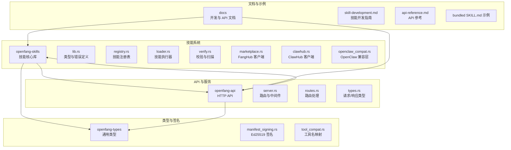

图表来源
- [Cargo.toml:1-161](file://Cargo.toml#L1-L161)
- [lib.rs:1-255](file://crates/openfang-skills/src/lib.rs#L1-L255)
- [registry.rs:1-553](file://crates/openfang-skills/src/registry.rs#L1-L553)
- [loader.rs:1-462](file://crates/openfang-skills/src/loader.rs#L1-L462)
- [verify.rs:1-295](file://crates/openfang-skills/src/verify.rs#L1-L295)
- [marketplace.rs:1-201](file://crates/openfang-skills/src/marketplace.rs#L1-L201)
- [clawhub.rs:1-911](file://crates/openfang-skills/src/clawhub.rs#L1-L911)
- [openclaw_compat.rs:1-708](file://crates/openfang-skills/src/openclaw_compat.rs#L1-L708)
- [manifest_signing.rs:1-167](file://crates/openfang-types/src/manifest_signing.rs#L1-L167)
- [server.rs:1-954](file://crates/openfang-api/src/server.rs#L1-L954)
- [routes.rs:1-11274](file://crates/openfang-api/src/routes.rs#L1-L11274)
- [types.rs:1-94](file://crates/openfang-api/src/types.rs#L1-L94)

章节来源
- [Cargo.toml:1-161](file://Cargo.toml#L1-L161)

## 核心组件
- 技能注册表：负责加载、列举、移除已安装技能；支持冻结模式以稳定运行环境；支持工作区技能覆盖全局技能。
- 技能加载器：解析 manifest 并按运行时类型（Python/Node/WASM/PromptOnly/Builtin）执行工具调用。
- 安全校验：SHA256 校验、清单安全扫描、提示词注入扫描、二进制依赖检查。
- 市场客户端：FangHub（GitHub Releases）与 ClawHub（自建生态）两种来源的搜索、浏览、详情、下载与安装流程。
- OpenClaw 兼容层：自动识别并转换 OpenClaw 的 SKILL.md 与 Node 包格式。
- 类型与签名：统一的技能与代理清单类型、Ed25519 签名与验证。
- API 服务：提供技能市场相关接口、批量安装、同步缓存、速率限制与安全中间件。

章节来源
- [lib.rs:1-255](file://crates/openfang-skills/src/lib.rs#L1-L255)
- [registry.rs:1-553](file://crates/openfang-skills/src/registry.rs#L1-L553)
- [loader.rs:1-462](file://crates/openfang-skills/src/loader.rs#L1-L462)
- [verify.rs:1-295](file://crates/openfang-skills/src/verify.rs#L1-L295)
- [marketplace.rs:1-201](file://crates/openfang-skills/src/marketplace.rs#L1-L201)
- [clawhub.rs:1-911](file://crates/openfang-skills/src/clawhub.rs#L1-L911)
- [openclaw_compat.rs:1-708](file://crates/openfang-skills/src/openclaw_compat.rs#L1-L708)
- [manifest_signing.rs:1-167](file://crates/openfang-types/src/manifest_signing.rs#L1-L167)
- [server.rs:1-954](file://crates/openfang-api/src/server.rs#L1-L954)
- [routes.rs:1-11274](file://crates/openfang-api/src/routes.rs#L1-L11274)
- [types.rs:1-94](file://crates/openfang-api/src/types.rs#L1-L94)

## 架构总览
技能市场系统由“本地技能注册表 + 多源市场客户端 + 执行与安全校验 + API 服务”构成。用户可通过 CLI 或 API 对技能进行安装、卸载、搜索与批量操作；系统在安装前执行严格的安全扫描与兼容性检查；运行期通过统一的工具接口暴露给代理使用。

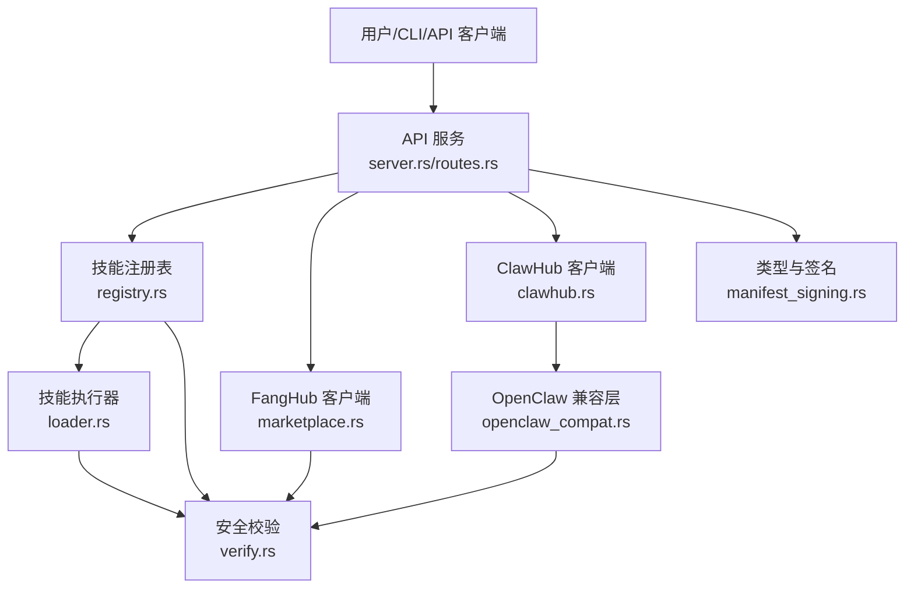

图表来源
- [server.rs:35-712](file://crates/openfang-api/src/server.rs#L35-L712)
- [routes.rs:1-11274](file://crates/openfang-api/src/routes.rs#L1-L11274)
- [registry.rs:1-553](file://crates/openfang-skills/src/registry.rs#L1-L553)
- [marketplace.rs:1-201](file://crates/openfang-skills/src/marketplace.rs#L1-L201)
- [clawhub.rs:1-911](file://crates/openfang-skills/src/clawhub.rs#L1-L911)
- [loader.rs:1-462](file://crates/openfang-skills/src/loader.rs#L1-L462)
- [verify.rs:1-295](file://crates/openfang-skills/src/verify.rs#L1-L295)
- [openclaw_compat.rs:1-708](file://crates/openfang-skills/src/openclaw_compat.rs#L1-L708)
- [manifest_signing.rs:1-167](file://crates/openfang-types/src/manifest_signing.rs#L1-L167)

## 详细组件分析

### 技能注册表与生命周期
- 加载策略：先加载内置（编译期嵌入）技能，再扫描用户目录下的技能；支持从工作区目录加载覆盖全局技能。
- 冻结模式：启动后可冻结注册表，阻止后续动态加载，确保运行稳定性。
- 工具聚合：按启用状态聚合所有技能提供的工具定义，供代理选择使用。
- 安全前置：在加载阶段对 OpenClaw 转换后的技能执行提示词注入扫描，阻断高危威胁。

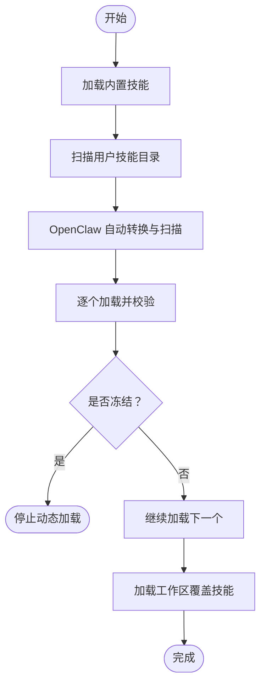

图表来源
- [registry.rs:56-196](file://crates/openfang-skills/src/registry.rs#L56-L196)
- [registry.rs:296-384](file://crates/openfang-skills/src/registry.rs#L296-L384)

章节来源
- [registry.rs:1-553](file://crates/openfang-skills/src/registry.rs#L1-L553)

### 技能执行器与运行时
- 支持 Python/Node/Shell/PromptOnly/Builtin 运行时；PromptOnly 技能仅注入提示词，不执行代码。
- 执行隔离：子进程执行，清理环境变量，避免泄露敏感信息。
- 输入输出协议：通过 stdin/stdout 传递 JSON，标准输出解析为结果或错误对象。

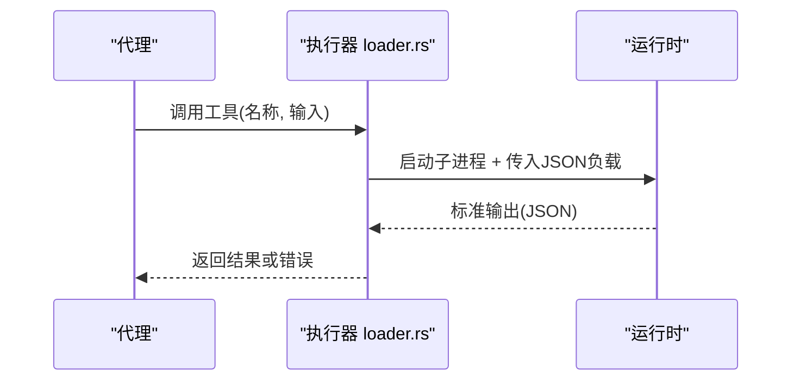

图表来源
- [loader.rs:10-51](file://crates/openfang-skills/src/loader.rs#L10-L51)
- [loader.rs:53-157](file://crates/openfang-skills/src/loader.rs#L53-L157)
- [loader.rs:159-256](file://crates/openfang-skills/src/loader.rs#L159-L256)
- [loader.rs:305-403](file://crates/openfang-skills/src/loader.rs#L305-L403)

章节来源
- [loader.rs:1-462](file://crates/openfang-skills/src/loader.rs#L1-L462)

### 安全校验与扫描
- 清单安全扫描：检测危险运行时类型、网络访问权限、危险工具需求等。
- 提示词注入扫描：识别覆盖指令、数据外泄、Shell 命令引用等高危模式。
- 二进制依赖检查：安装时检查宿主系统所需二进制是否存在。
- SHA256 校验：用于完整性验证（如 ClawHub 下载包）。

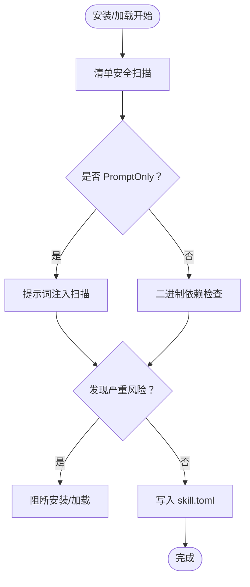

图表来源
- [verify.rs:46-103](file://crates/openfang-skills/src/verify.rs#L46-L103)
- [verify.rs:109-179](file://crates/openfang-skills/src/verify.rs#L109-L179)
- [clawhub.rs:502-657](file://crates/openfang-skills/src/clawhub.rs#L502-L657)

章节来源
- [verify.rs:1-295](file://crates/openfang-skills/src/verify.rs#L1-L295)
- [clawhub.rs:1-911](file://crates/openfang-skills/src/clawhub.rs#L1-L911)

### FangHub 市场客户端
- 搜索：基于 GitHub API 搜索组织内的仓库，按 star 排序返回结果。
- 安装：获取最新 Release 的 tarball，保存元数据（版本、来源、时间），便于后续追踪与回滚。

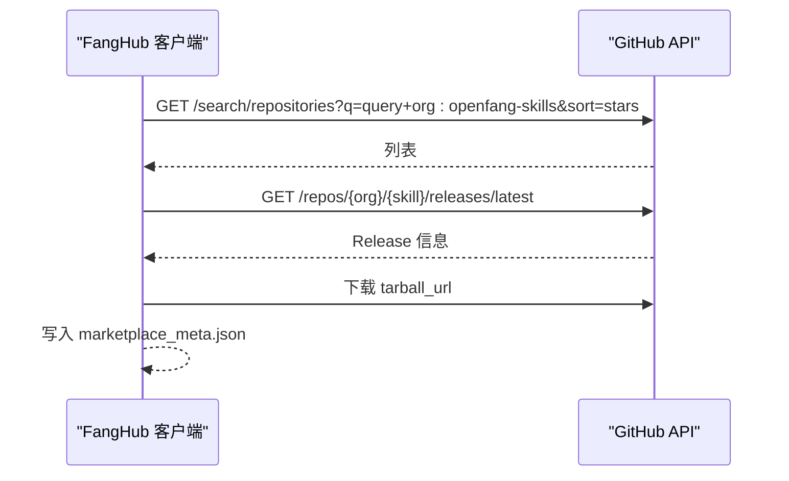

图表来源
- [marketplace.rs:46-89](file://crates/openfang-skills/src/marketplace.rs#L46-L89)
- [marketplace.rs:94-168](file://crates/openfang-skills/src/marketplace.rs#L94-L168)

章节来源
- [marketplace.rs:1-201](file://crates/openfang-skills/src/marketplace.rs#L1-L201)

### ClawHub 市场客户端
- API：提供搜索、浏览、详情、文件获取、下载等接口；内部实现指数退避重试与 Retry-After 支持。
- 安装流程：下载压缩包 → 计算 SHA256 → 自动识别格式（SKILL.md/Node 包）→ 转换为 OpenFang 清单 → 安全扫描 → 写入 skill.toml。
- 速率限制：对 429/5xx 自动重试，带抖动与上限延迟。

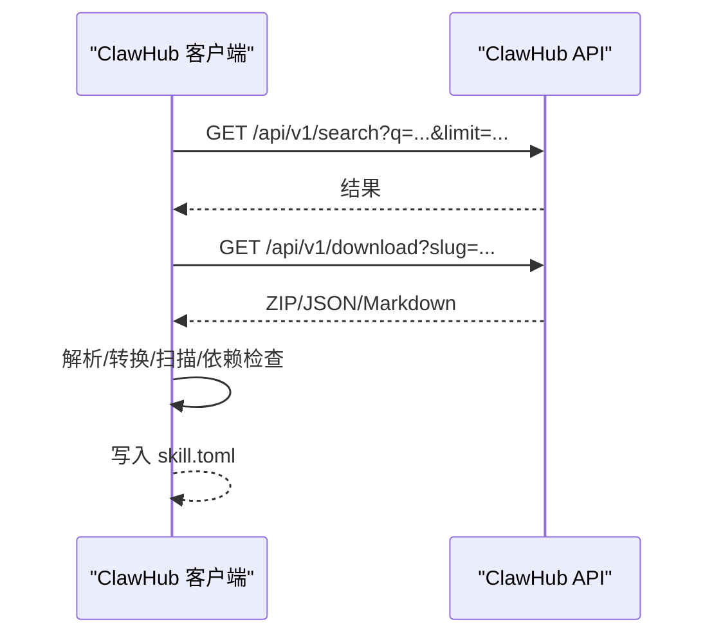

图表来源
- [clawhub.rs:392-412](file://crates/openfang-skills/src/clawhub.rs#L392-L412)
- [clawhub.rs:502-657](file://crates/openfang-skills/src/clawhub.rs#L502-L657)
- [clawhub.rs:276-382](file://crates/openfang-skills/src/clawhub.rs#L276-L382)

章节来源
- [clawhub.rs:1-911](file://crates/openfang-skills/src/clawhub.rs#L1-L911)

### OpenClaw 兼容层
- 自动检测：SKILL.md 与 Node 包格式。
- 转换逻辑：生成 OpenFang 清单、映射工具名、提取提示词正文、记录必要系统二进制。
- 工具名映射：将 OpenClaw 风格工具名标准化为 OpenFang 名称，保证跨生态一致性。

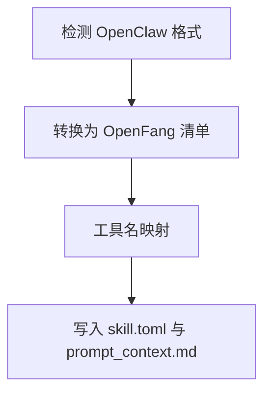

图表来源
- [openclaw_compat.rs:164-266](file://crates/openfang-skills/src/openclaw_compat.rs#L164-L266)
- [openclaw_compat.rs:368-435](file://crates/openfang-skills/src/openclaw_compat.rs#L368-L435)
- [tool_compat.rs:10-50](file://crates/openfang-types/src/tool_compat.rs#L10-L50)

章节来源
- [openclaw_compat.rs:1-708](file://crates/openfang-skills/src/openclaw_compat.rs#L1-L708)
- [tool_compat.rs:1-215](file://crates/openfang-types/src/tool_compat.rs#L1-L215)

### 类型与签名验证
- 统一类型：技能清单、工具定义、运行时类型、来源追踪等。
- Ed25519 签名：对代理清单进行内容哈希、签名与公钥嵌入，API 层可验证签名一致性。

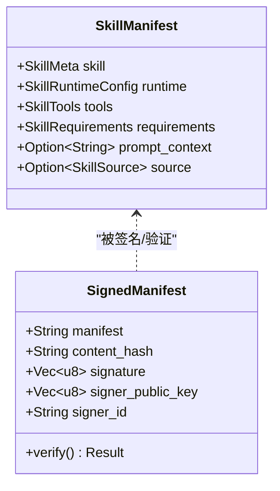

图表来源
- [lib.rs:104-179](file://crates/openfang-skills/src/lib.rs#L104-L179)
- [manifest_signing.rs:24-108](file://crates/openfang-types/src/manifest_signing.rs#L24-L108)

章节来源
- [lib.rs:1-255](file://crates/openfang-skills/src/lib.rs#L1-L255)
- [manifest_signing.rs:1-167](file://crates/openfang-types/src/manifest_signing.rs#L1-L167)

### API 与批量操作
- 路由：提供技能列表、安装、卸载、市场搜索、ClawHub 操作等接口。
- 中间件：认证、速率限制、安全头、日志与压缩。
- 批量与同步：API 层维护 ClawHub 响应缓存，减少重复请求；支持并发安装与状态查询。

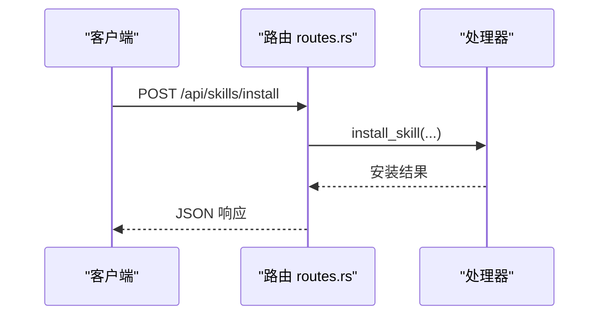

图表来源
- [server.rs:121-712](file://crates/openfang-api/src/server.rs#L121-L712)
- [routes.rs:1-11274](file://crates/openfang-api/src/routes.rs#L1-L11274)
- [types.rs:64-94](file://crates/openfang-api/src/types.rs#L64-L94)

章节来源
- [server.rs:1-954](file://crates/openfang-api/src/server.rs#L1-L954)
- [routes.rs:1-11274](file://crates/openfang-api/src/routes.rs#L1-L11274)
- [types.rs:1-94](file://crates/openfang-api/src/types.rs#L1-L94)

## 依赖关系分析
- openfang-skills 依赖 openfang-types 提供通用类型与工具映射。
- openfang-api 依赖 openfang-skills 与 openfang-types，提供技能市场相关 HTTP 接口。
- openfang-cli 作为命令行入口，调用 openfang-skills 的安装/卸载/搜索等能力。

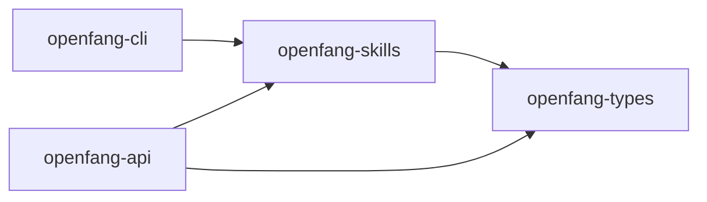

图表来源
- [Cargo.toml:1-16](file://Cargo.toml#L1-L16)
- [lib.rs:1-20](file://crates/openfang-skills/src/lib.rs#L1-L20)
- [server.rs:1-20](file://crates/openfang-api/src/server.rs#L1-L20)

章节来源
- [Cargo.toml:1-161](file://Cargo.toml#L1-L161)

## 性能考量
- 异步与并发：API 与市场客户端广泛使用异步运行时与并发请求，提升吞吐。
- 缓存与重试：ClawHub 客户端内置指数退避与 Retry-After 支持，降低限流影响。
- 子进程隔离：执行器对第三方代码在子进程中运行并清理环境，避免资源泄漏。
- 体积与加载：内置技能编译进二进制，减少首次加载开销；注册表支持冻结模式稳定内存占用。

## 故障排查指南
- 安装失败：检查网络与 API 限流；查看安全扫描警告；确认工具依赖是否满足。
- 执行错误：核对工具输入 JSON Schema；检查子进程返回的错误对象；确认运行时可用性。
- 注册表异常：确认技能目录权限；检查冻结状态；查看加载日志与告警。
- API 访问：确认鉴权设置与 CORS 配置；检查速率限制与安全头。

章节来源
- [verify.rs:1-295](file://crates/openfang-skills/src/verify.rs#L1-L295)
- [loader.rs:1-462](file://crates/openfang-skills/src/loader.rs#L1-L462)
- [server.rs:56-104](file://crates/openfang-api/src/server.rs#L56-L104)

## 结论
OpenFang 技能市场系统通过“注册表 + 多源市场 + 执行与安全校验 + API 服务”的架构，实现了从技能发现、安装、加载到执行的完整闭环。系统在安全性、兼容性与可扩展性方面具备良好设计，适合在生产环境中进行大规模技能分发与治理。

## 附录

### 技能上传规范与元数据要求
- 目录结构：skill.toml 必需；可包含 README.md 等文档。
- 清单字段：[skill]/[runtime]/[[tools.provided]]/[requirements] 等。
- 版本：语义化版本；变更需谨慎升级。
- 标签与描述：用于 FangHub 搜索与分类。

章节来源
- [skill-development.md:86-164](file://docs/skill-development.md#L86-L164)
- [lib.rs:104-179](file://crates/openfang-skills/src/lib.rs#L104-L179)

### 版本控制策略
- 语义化版本；破坏性变更升级主版本；功能新增保持次版本；修复补丁。
- 安装时记录来源与版本，便于审计与回滚。

章节来源
- [marketplace.rs:123-167](file://crates/openfang-skills/src/marketplace.rs#L123-L167)
- [clawhub.rs:502-657](file://crates/openfang-skills/src/clawhub.rs#L502-L657)

### 搜索、分类与评分
- FangHub：基于 GitHub 搜索与 star 数排序。
- ClawHub：支持搜索、浏览（按趋势/更新/下载/星数/评分）与详情。
- 分类与标签：技能清单中的 tags 字段参与搜索与展示。

章节来源
- [marketplace.rs:46-89](file://crates/openfang-skills/src/marketplace.rs#L46-L89)
- [clawhub.rs:123-150](file://crates/openfang-skills/src/clawhub.rs#L123-L150)
- [clawhub.rs:414-442](file://crates/openfang-skills/src/clawhub.rs#L414-L442)

### 下载与安装流程
- FangHub：获取最新 Release tarball，写入元数据。
- ClawHub：下载 ZIP/JSON/Markdown，自动识别与转换，执行安全扫描与依赖检查。

章节来源
- [marketplace.rs:94-168](file://crates/openfang-skills/src/marketplace.rs#L94-L168)
- [clawhub.rs:502-657](file://crates/openfang-skills/src/clawhub.rs#L502-L657)

### 认证、签名与安全检查
- API 鉴权：Bearer Token 或会话鉴权；未配置时 CORS 限制在本地。
- 清单签名：Ed25519 签名与验证，API 层可校验签名一致性。
- 安全扫描：清单安全、提示词注入、二进制依赖、子进程隔离。

章节来源
- [server.rs:56-104](file://crates/openfang-api/src/server.rs#L56-L104)
- [manifest_signing.rs:1-167](file://crates/openfang-types/src/manifest_signing.rs#L1-L167)
- [verify.rs:1-295](file://crates/openfang-skills/src/verify.rs#L1-L295)

### 市场 API 使用指南
- 路由概览：技能安装/卸载/搜索、ClawHub 操作、批量与同步缓存。
- 请求/响应类型：统一定义于 types.rs。
- 参考文档：API 参考与技能开发指南。

章节来源
- [server.rs:121-712](file://crates/openfang-api/src/server.rs#L121-L712)
- [routes.rs:1-11274](file://crates/openfang-api/src/routes.rs#L1-L11274)
- [types.rs:1-94](file://crates/openfang-api/src/types.rs#L1-L94)
- [api-reference.md:1-800](file://docs/api-reference.md#L1-L800)
- [skill-development.md:470-596](file://docs/skill-development.md#L470-L596)

### 依赖管理与兼容性检查
- 工具名映射：OpenClaw 工具名到 OpenFang 的标准化。
- 运行时兼容：Node/Python/WASM/PromptOnly/Builtin；PromptOnly 不执行代码。
- 二进制依赖：安装时检查宿主系统所需二进制。

章节来源
- [openclaw_compat.rs:1-708](file://crates/openfang-skills/src/openclaw_compat.rs#L1-L708)
- [tool_compat.rs:1-215](file://crates/openfang-types/src/tool_compat.rs#L1-L215)
- [loader.rs:1-462](file://crates/openfang-skills/src/loader.rs#L1-L462)
- [clawhub.rs:614-623](file://crates/openfang-skills/src/clawhub.rs#L614-L623)

### 更新通知与同步机制
- API 层维护 ClawHub 响应缓存，避免频繁触发限流。
- 注册表支持冻结模式，确保稳定运行期间不再动态加载新技能。

章节来源
- [server.rs:42-43](file://crates/openfang-api/src/server.rs#L42-L43)
- [registry.rs:44-54](file://crates/openfang-skills/src/registry.rs#L44-L54)

### 市场运营、版权保护与质量控制
- 版权保护：Ed25519 签名与内容哈希，保障清单完整性与来源可信。
- 质量控制：提示词注入扫描、清单安全扫描、二进制依赖检查、OpenClaw 自动转换与报告。
- 运营建议：使用标签与描述优化搜索；定期审查高危工具与权限；利用冻结模式稳定生产环境。

章节来源
- [manifest_signing.rs:1-167](file://crates/openfang-types/src/manifest_signing.rs#L1-L167)
- [verify.rs:1-295](file://crates/openfang-skills/src/verify.rs#L1-L295)
- [openclaw_compat.rs:1-708](file://crates/openfang-skills/src/openclaw_compat.rs#L1-L708)
- [clawhub.rs:1-911](file://crates/openfang-skills/src/clawhub.rs#L1-L911)