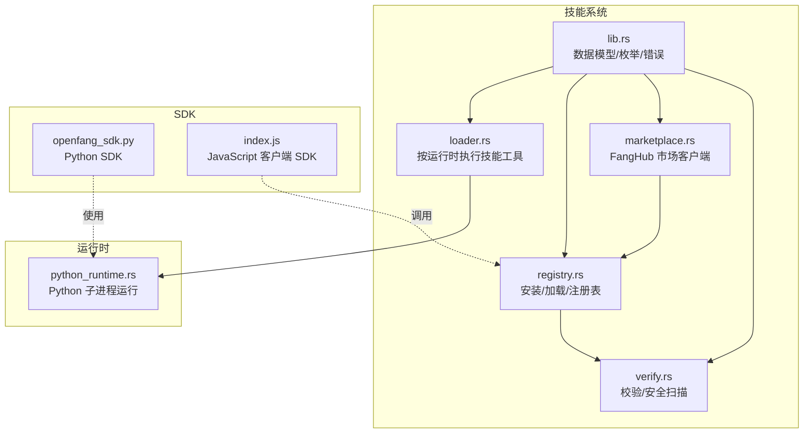
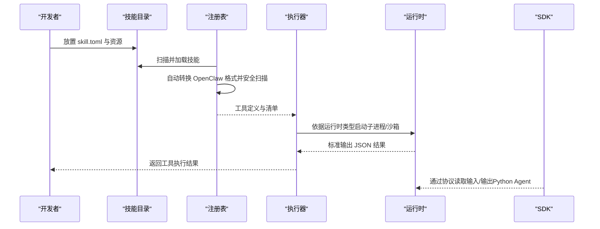
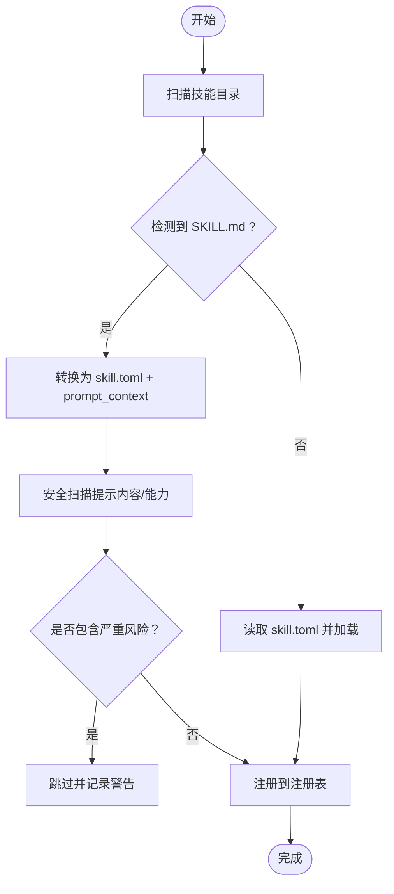
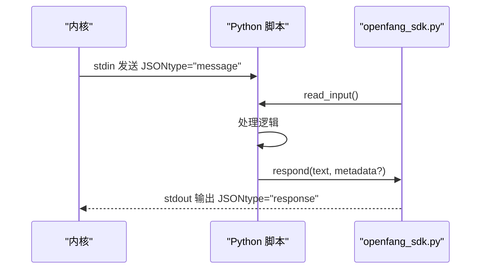
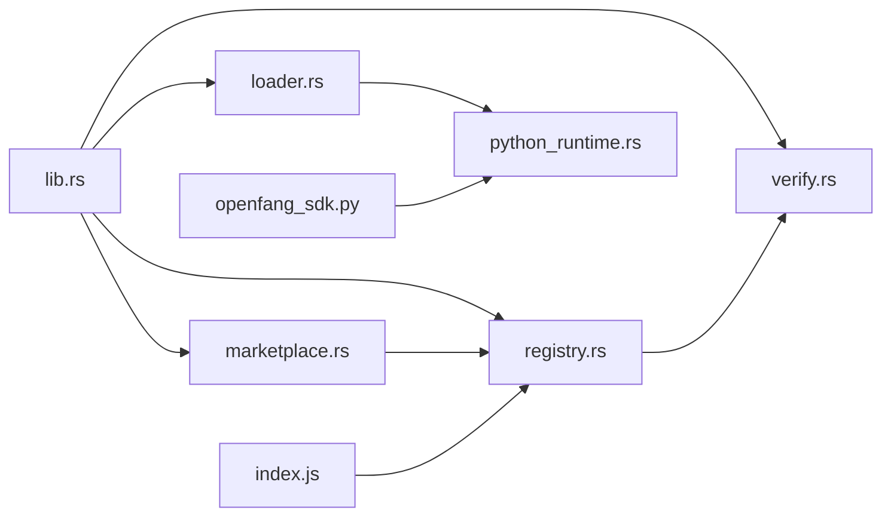

# 技能开发

<cite>
**本文引用的文件**
- [crates/openfang-skills/src/lib.rs](file://crates/openfang-skills/src/lib.rs)
- [crates/openfang-skills/src/loader.rs](file://crates/openfang-skills/src/loader.rs)
- [crates/openfang-skills/src/registry.rs](file://crates/openfang-skills/src/registry.rs)
- [crates/openfang-skills/src/marketplace.rs](file://crates/openfang-skills/src/marketplace.rs)
- [crates/openfang-skills/src/verify.rs](file://crates/openfang-skills/src/verify.rs)
- [crates/openfang-runtime/src/python_runtime.rs](file://crates/openfang-runtime/src/python_runtime.rs)
- [sdk/python/openfang_sdk.py](file://sdk/python/openfang_sdk.py)
- [sdk/javascript/index.js](file://sdk/javascript/index.js)
- [crates/openfang-skills/bundled/web-search/SKILL.md](file://crates/openfang-skills/bundled/web-search/SKILL.md)
</cite>

## 目录
1. [简介](#简介)
2. [项目结构](#项目结构)
3. [核心组件](#核心组件)
4. [架构总览](#架构总览)
5. [详细组件分析](#详细组件分析)
6. [依赖关系分析](#依赖关系分析)
7. [性能考量](#性能考量)
8. [故障排查指南](#故障排查指南)
9. [结论](#结论)
10. [附录](#附录)

## 简介
本指南面向在 OpenFang 上开发“技能”（Skill）的开发者，系统性讲解技能配置文件格式（SKILL.toml）、字段定义与验证规则；覆盖多运行时类型（Python、WASM、Node、Shell、PromptOnly）的开发差异与最佳实践；明确技能工具定义、输入输出模式与错误处理规范；介绍技能测试框架、调试工具与性能分析方法；提供技能开发模板、代码示例与 SDK 使用指南；并记录技能打包、发布与版本管理流程，以及常见问题、性能优化与安全注意事项。

## 项目结构
OpenFang 的技能系统由“技能清单（Manifest）解析与执行”“运行时适配层”“市场与分发”“注册表与加载”“安全校验”等模块组成。下图展示与技能开发直接相关的核心子模块及其职责：

图表来源
- [crates/openfang-skills/src/lib.rs:1-255](file://crates/openfang-skills/src/lib.rs#L1-L255)
- [crates/openfang-skills/src/loader.rs:1-462](file://crates/openfang-skills/src/loader.rs#L1-L462)
- [crates/openfang-skills/src/registry.rs:1-553](file://crates/openfang-skills/src/registry.rs#L1-L553)
- [crates/openfang-skills/src/marketplace.rs:1-201](file://crates/openfang-skills/src/marketplace.rs#L1-L201)
- [crates/openfang-runtime/src/python_runtime.rs:1-426](file://crates/openfang-runtime/src/python_runtime.rs#L1-L426)
- [sdk/python/openfang_sdk.py:1-148](file://sdk/python/openfang_sdk.py#L1-L148)
- [sdk/javascript/index.js:1-480](file://sdk/javascript/index.js#L1-L480)

章节来源
- [crates/openfang-skills/src/lib.rs:1-255](file://crates/openfang-skills/src/lib.rs#L1-L255)
- [crates/openfang-skills/src/loader.rs:1-462](file://crates/openfang-skills/src/loader.rs#L1-L462)
- [crates/openfang-skills/src/registry.rs:1-553](file://crates/openfang-skills/src/registry.rs#L1-L553)
- [crates/openfang-skills/src/marketplace.rs:1-201](file://crates/openfang-skills/src/marketplace.rs#L1-L201)
- [crates/openfang-runtime/src/python_runtime.rs:1-426](file://crates/openfang-runtime/src/python_runtime.rs#L1-L426)
- [sdk/python/openfang_sdk.py:1-148](file://sdk/python/openfang_sdk.py#L1-L148)
- [sdk/javascript/index.js:1-480](file://sdk/javascript/index.js#L1-L480)

## 核心组件
- 数据模型与枚举：定义技能元数据、运行时类型、工具定义、来源类型、要求声明、工具结果等。
- 执行器：根据运行时类型选择对应执行路径（Python/Node/Shell/PromptOnly），并进行环境隔离与错误处理。
- 注册表：扫描技能目录、自动转换 OpenClaw 格式、加载内置技能、提供工具查询与去重覆盖。
- 市场：通过 GitHub Releases 拉取技能包，写入元信息以便后续安装。
- 安全校验：对技能清单与提示内容进行安全扫描，阻断高危能力与注入风险。
- 运行时：为“Python Agent”提供专用运行时（非技能工具），定义协议、超时、环境变量白名单与脚本路径校验。
- SDK：Python SDK 提供读取输入、发送响应、日志与装饰器式 Agent 框架；JavaScript SDK 提供 REST 客户端封装。

章节来源
- [crates/openfang-skills/src/lib.rs:18-188](file://crates/openfang-skills/src/lib.rs#L18-L188)
- [crates/openfang-skills/src/loader.rs:9-51](file://crates/openfang-skills/src/loader.rs#L9-L51)
- [crates/openfang-skills/src/registry.rs:11-384](file://crates/openfang-skills/src/registry.rs#L11-L384)
- [crates/openfang-skills/src/marketplace.rs:10-182](file://crates/openfang-skills/src/marketplace.rs#L10-L182)
- [crates/openfang-skills/src/verify.rs:26-179](file://crates/openfang-skills/src/verify.rs#L26-L179)
- [crates/openfang-runtime/src/python_runtime.rs:27-344](file://crates/openfang-runtime/src/python_runtime.rs#L27-L344)
- [sdk/python/openfang_sdk.py:31-130](file://sdk/python/openfang_sdk.py#L31-L130)
- [sdk/javascript/index.js:29-333](file://sdk/javascript/index.js#L29-L333)

## 架构总览
技能从“本地目录/内置/市场”被加载到注册表，注册表聚合所有工具定义供代理使用；当代理需要调用某工具时，执行器根据技能声明的运行时类型选择对应实现，并通过标准输入/输出协议传递参数与接收结果。安全校验贯穿加载与自动转换阶段，确保提示内容与能力请求的安全性。

图表来源
- [crates/openfang-skills/src/registry.rs:105-196](file://crates/openfang-skills/src/registry.rs#L105-L196)
- [crates/openfang-skills/src/loader.rs:9-51](file://crates/openfang-skills/src/loader.rs#L9-L51)
- [crates/openfang-runtime/src/python_runtime.rs:119-313](file://crates/openfang-runtime/src/python_runtime.rs#L119-L313)

## 详细组件分析

### SKILL.toml 配置文件格式与字段定义
- 节点 skill：技能元信息
  - name：字符串，唯一标识
  - version：字符串，默认 0.1.0
  - description、author、license、tags：字符串或数组
- 节点 runtime：
  - type：运行时类型，可选值包括 python、wasm、node、shell、builtin、promptonly
  - entry：入口文件（相对路径）
- 节点 tools：
  - provided：数组，每个元素含 name、description、input_schema（JSON Schema）
- 节点 requirements：
  - tools：所需内置工具名列表
  - capabilities：所需主机能力列表
- 节点 prompt_context：仅在 promptonly 类型中生效，作为系统提示注入
- 节点 source：来源类型（native、bundled、openclaw、clawhub）

验证规则与约束
- runtime.type 缺省时默认为 promptonly
- tools.provided 中 name 必须唯一
- 当 runtime.type 为 promptonly 时，应提供 prompt_context
- requirements.tools 与 requirements.capabilities 用于安全扫描与能力授权
- 入口文件路径需存在且可访问

章节来源
- [crates/openfang-skills/src/lib.rs:103-149](file://crates/openfang-skills/src/lib.rs#L103-L149)
- [crates/openfang-skills/src/lib.rs:151-168](file://crates/openfang-skills/src/lib.rs#L151-L168)
- [crates/openfang-skills/src/lib.rs:170-188](file://crates/openfang-skills/src/lib.rs#L170-L188)

### 运行时类型差异与最佳实践
- Python
  - 通过子进程执行，stdin 传入 JSON，stdout 输出 JSON
  - 环境隔离：清空继承变量，仅保留 PATH、HOME 等必要项
  - 超时控制与错误捕获，失败时返回错误对象
  - 最佳实践：严格输入校验、最小权限原则、避免敏感信息泄露
- Node
  - 同 Python，但具备更广的文件系统与网络访问能力
  - 最佳实践：限制能力请求、最小化依赖、启用超时
- Shell
  - 通过 bash/sh 执行脚本，stdin 传参
  - 最佳实践：禁止危险命令、严格输入过滤、避免路径穿越
- WASM
  - 当前未实现，保留扩展接口
- Builtin
  - 内置编译进二进制的能力，由内核直接处理
- PromptOnly
  - 不执行代码，仅将 prompt_context 注入系统提示
  - 工具调用会被引导使用内置工具

章节来源
- [crates/openfang-skills/src/loader.rs:24-50](file://crates/openfang-skills/src/loader.rs#L24-L50)
- [crates/openfang-skills/src/loader.rs:53-157](file://crates/openfang-skills/src/loader.rs#L53-L157)
- [crates/openfang-skills/src/loader.rs:159-256](file://crates/openfang-skills/src/loader.rs#L159-L256)
- [crates/openfang-skills/src/loader.rs:305-403](file://crates/openfang-skills/src/loader.rs#L305-L403)

### 技能工具定义、输入输出模式与错误处理
- 工具定义
  - name：唯一工具名
  - description：向 LLM 描述用途
  - input_schema：JSON Schema，用于校验输入
- 输入输出协议（Python/Node/Shell）
  - 输入：JSON 对象，包含 tool 与 input 字段
  - 输出：JSON 对象，包含结果；若解析失败则回退为字符串包裹
  - 错误：子进程失败时返回包含 error 字段的结果对象
- PromptOnly
  - 返回提示性说明，建议改用内置工具

章节来源
- [crates/openfang-skills/src/lib.rs:82-91](file://crates/openfang-skills/src/lib.rs#L82-L91)
- [crates/openfang-skills/src/loader.rs:68-156](file://crates/openfang-skills/src/loader.rs#L68-L156)
- [crates/openfang-skills/src/loader.rs:180-255](file://crates/openfang-skills/src/loader.rs#L180-L255)
- [crates/openfang-skills/src/loader.rs:321-402](file://crates/openfang-skills/src/loader.rs#L321-L402)

### 注册表与加载流程
- 加载策略
  - 先加载内置（bundled）技能，再加载用户安装技能，后者可覆盖前者
  - 支持自动检测并转换 OpenClaw 的 SKILL.md 到 skill.toml + prompt_context
  - 加载后进行安全扫描，阻断包含严重注入风险的提示内容
- 工具聚合
  - 提供 all_tool_definitions 与按技能筛选的工具集合
- 工作区覆盖
  - 支持工作区目录下的技能优先覆盖全局安装

图表来源
- [crates/openfang-skills/src/registry.rs:105-196](file://crates/openfang-skills/src/registry.rs#L105-L196)
- [crates/openfang-skills/src/registry.rs:290-384](file://crates/openfang-skills/src/registry.rs#L290-L384)
- [crates/openfang-skills/src/verify.rs:105-179](file://crates/openfang-skills/src/verify.rs#L105-L179)

章节来源
- [crates/openfang-skills/src/registry.rs:56-103](file://crates/openfang-skills/src/registry.rs#L56-L103)
- [crates/openfang-skills/src/registry.rs:105-196](file://crates/openfang-skills/src/registry.rs#L105-L196)
- [crates/openfang-skills/src/registry.rs:290-384](file://crates/openfang-skills/src/registry.rs#L290-L384)

### 市场与分发（FangHub）
- 搜索：基于 GitHub 组织仓库搜索，按 star 排序
- 安装：拉取最新 Release 的 tarball 下载地址并写入元数据文件
- 注意：当前实现保存下载链接而非直接解压，完整流程需额外库支持

章节来源
- [crates/openfang-skills/src/marketplace.rs:46-168](file://crates/openfang-skills/src/marketplace.rs#L46-L168)

### 安全校验与风险控制
- 清单安全扫描
  - Node 运行时：警告
  - ShellExec、NetConnect(*) 等能力：严重/警告
  - 危险工具（如 shell_exec、file_write）：严重
- 提示内容扫描
  - 关键注入词（如忽略先前指令、系统提示覆盖）
  - 数据外泄模式（发送到 HTTP/HTTPS、上传）
  - Shell 命令引用
  - 过大提示内容（可能影响性能）
- 注册表加载阶段即执行扫描，阻断高危技能

章节来源
- [crates/openfang-skills/src/verify.rs:45-103](file://crates/openfang-skills/src/verify.rs#L45-L103)
- [crates/openfang-skills/src/verify.rs:105-179](file://crates/openfang-skills/src/verify.rs#L105-L179)
- [crates/openfang-skills/src/registry.rs:66-81](file://crates/openfang-skills/src/registry.rs#L66-L81)
- [crates/openfang-skills/src/registry.rs:126-153](file://crates/openfang-skills/src/registry.rs#L126-L153)

### Python 运行时（Agent）协议与 SDK
- 协议
  - 输入：stdin JSON，包含 type、agent_id、message、context
  - 输出：stdout JSON，包含 type、text（可带 metadata）
  - 超时控制、环境变量白名单、脚本路径校验
- SDK（Python）
  - read_input：从 stdin 或环境变量读取输入
  - respond：输出 JSON 响应
  - log：向 stderr 输出日志
  - Agent 类：装饰器式消息处理器框架

图表来源
- [crates/openfang-runtime/src/python_runtime.rs:8-18](file://crates/openfang-runtime/src/python_runtime.rs#L8-L18)
- [crates/openfang-runtime/src/python_runtime.rs:119-313](file://crates/openfang-runtime/src/python_runtime.rs#L119-L313)
- [sdk/python/openfang_sdk.py:31-57](file://sdk/python/openfang_sdk.py#L31-L57)
- [sdk/python/openfang_sdk.py:97-130](file://sdk/python/openfang_sdk.py#L97-L130)

章节来源
- [crates/openfang-runtime/src/python_runtime.rs:55-77](file://crates/openfang-runtime/src/python_runtime.rs#L55-L77)
- [crates/openfang-runtime/src/python_runtime.rs:119-313](file://crates/openfang-runtime/src/python_runtime.rs#L119-L313)
- [sdk/python/openfang_sdk.py:31-130](file://sdk/python/openfang_sdk.py#L31-L130)

### JavaScript SDK 使用
- 提供 OpenFang 客户端类，封装健康检查、版本、指标、配置、代理、会话、工作流、技能、渠道、工具、模型、提供商、内存、触发器、计划等资源
- 支持 SSE 流式事件迭代，便于实时渲染

章节来源
- [sdk/javascript/index.js:29-141](file://sdk/javascript/index.js#L29-L141)
- [sdk/javascript/index.js:145-479](file://sdk/javascript/index.js#L145-L479)

### 示例：内置 PromptOnly 技能
- bundled/web-search/SKILL.md 展示了如何以 Markdown 形式编写提示内容，注入到系统提示中，指导 LLM 行为

章节来源
- [crates/openfang-skills/bundled/web-search/SKILL.md:1-39](file://crates/openfang-skills/bundled/web-search/SKILL.md#L1-L39)

## 依赖关系分析
- 组件耦合
  - loader 依赖 lib.rs 的数据模型与枚举
  - registry 依赖 verify 进行安全扫描，依赖 openclaw_compat 进行格式转换
  - marketplace 依赖 registry 的安装结果
  - python_runtime 与 SDK 协同实现 Python Agent 协议
- 外部依赖
  - Python/Node/Bash 可执行程序
  - GitHub API（市场搜索与下载）

图表来源
- [crates/openfang-skills/src/lib.rs:1-255](file://crates/openfang-skills/src/lib.rs#L1-L255)
- [crates/openfang-skills/src/loader.rs:1-462](file://crates/openfang-skills/src/loader.rs#L1-L462)
- [crates/openfang-skills/src/registry.rs:1-553](file://crates/openfang-skills/src/registry.rs#L1-L553)
- [crates/openfang-skills/src/marketplace.rs:1-201](file://crates/openfang-skills/src/marketplace.rs#L1-L201)
- [crates/openfang-skills/src/verify.rs:1-295](file://crates/openfang-skills/src/verify.rs#L1-L295)
- [crates/openfang-runtime/src/python_runtime.rs:1-426](file://crates/openfang-runtime/src/python_runtime.rs#L1-L426)
- [sdk/python/openfang_sdk.py:1-148](file://sdk/python/openfang_sdk.py#L1-L148)
- [sdk/javascript/index.js:1-480](file://sdk/javascript/index.js#L1-L480)

章节来源
- [crates/openfang-skills/src/lib.rs:1-255](file://crates/openfang-skills/src/lib.rs#L1-L255)
- [crates/openfang-skills/src/loader.rs:1-462](file://crates/openfang-skills/src/loader.rs#L1-L462)
- [crates/openfang-skills/src/registry.rs:1-553](file://crates/openfang-skills/src/registry.rs#L1-L553)
- [crates/openfang-skills/src/marketplace.rs:1-201](file://crates/openfang-skills/src/marketplace.rs#L1-L201)
- [crates/openfang-skills/src/verify.rs:1-295](file://crates/openfang-skills/src/verify.rs#L1-L295)
- [crates/openfang-runtime/src/python_runtime.rs:1-426](file://crates/openfang-runtime/src/python_runtime.rs#L1-L426)
- [sdk/python/openfang_sdk.py:1-148](file://sdk/python/openfang_sdk.py#L1-L148)
- [sdk/javascript/index.js:1-480](file://sdk/javascript/index.js#L1-L480)

## 性能考量
- PromptOnly 技能通过系统提示注入行为，避免执行开销，适合通用知识与行为约束
- Python/Node/Shell 技能建议：
  - 控制超时时间，避免长时间阻塞
  - 限制输入大小与复杂度，遵循 JSON Schema
  - 减少外部网络请求与磁盘 IO
  - 使用缓存与去重，避免重复计算
- 注册表冻结（Stable Mode）后不再动态加载新技能，有助于稳定运行期性能

## 故障排查指南
- 运行时不可用
  - Python/Node/Bash 未安装或版本不满足要求
  - 解决：安装对应运行时并确保 PATH 可见
- 执行失败
  - 子进程退出码非 0 或 stderr 包含错误信息
  - 解决：查看 stderr 输出，修正脚本逻辑或依赖
- 环境泄漏
  - 子进程继承敏感环境变量
  - 解决：确认已清空环境变量并仅注入必要项
- 权限不足
  - 请求 ShellExec/NetConnect(*) 等高危能力未被授权
  - 解决：调整 requirements 或在宿主侧授予相应能力
- 提示内容被阻断
  - 包含注入/外泄/危险命令等模式
  - 解决：移除敏感模式，简化提示内容
- 市场安装异常
  - 下载失败或未找到 Release
  - 解决：检查网络与仓库状态，确认版本号

章节来源
- [crates/openfang-skills/src/loader.rs:74-118](file://crates/openfang-skills/src/loader.rs#L74-L118)
- [crates/openfang-skills/src/loader.rs:174-220](file://crates/openfang-skills/src/loader.rs#L174-L220)
- [crates/openfang-skills/src/loader.rs:326-364](file://crates/openfang-skills/src/loader.rs#L326-L364)
- [crates/openfang-skills/src/verify.rs:45-103](file://crates/openfang-skills/src/verify.rs#L45-L103)
- [crates/openfang-skills/src/verify.rs:105-179](file://crates/openfang-skills/src/verify.rs#L105-L179)
- [crates/openfang-skills/src/marketplace.rs:94-168](file://crates/openfang-skills/src/marketplace.rs#L94-L168)

## 结论
OpenFang 的技能体系以“清单驱动 + 多运行时 + 安全校验 + 市场分发”为核心，既保证了灵活性与扩展性，又通过严格的加载与扫描机制保障安全性。开发者应优先采用 PromptOnly 实现行为约束，必要时再选择 Python/Node/Shell 等运行时，并严格遵循输入输出协议与最小权限原则，配合 SDK 与测试工具提升质量与稳定性。

## 附录

### 开发模板与最佳实践清单
- 模板结构
  - skill.toml：定义元数据、运行时、工具、要求
  - 入口脚本：遵循对应运行时的输入输出协议
  - 可选：prompt_context.md（PromptOnly）
- 最佳实践
  - 明确 input_schema，严格输入校验
  - 最小化能力请求，避免 ShellExec/NetConnect(*)
  - 环境变量清空，仅注入必要项
  - 超时控制与错误处理
  - 使用注册表冻结机制在生产环境稳定运行

### SDK 使用要点
- Python SDK
  - 使用 read_input 获取输入，respond 输出响应
  - 使用 Agent 类组织消息处理逻辑
- JavaScript SDK
  - 通过 OpenFang 客户端访问 REST API
  - 使用 stream 进行 SSE 实时输出

章节来源
- [sdk/python/openfang_sdk.py:31-130](file://sdk/python/openfang_sdk.py#L31-L130)
- [sdk/javascript/index.js:29-141](file://sdk/javascript/index.js#L29-L141)