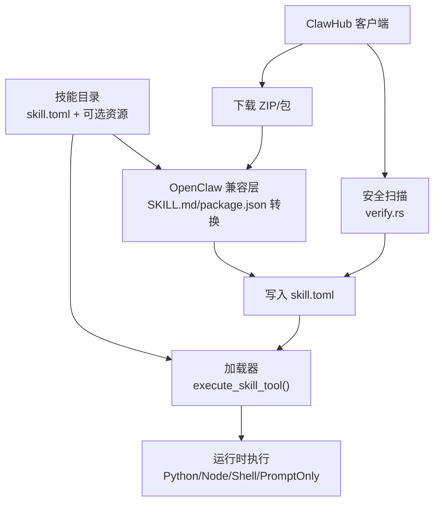
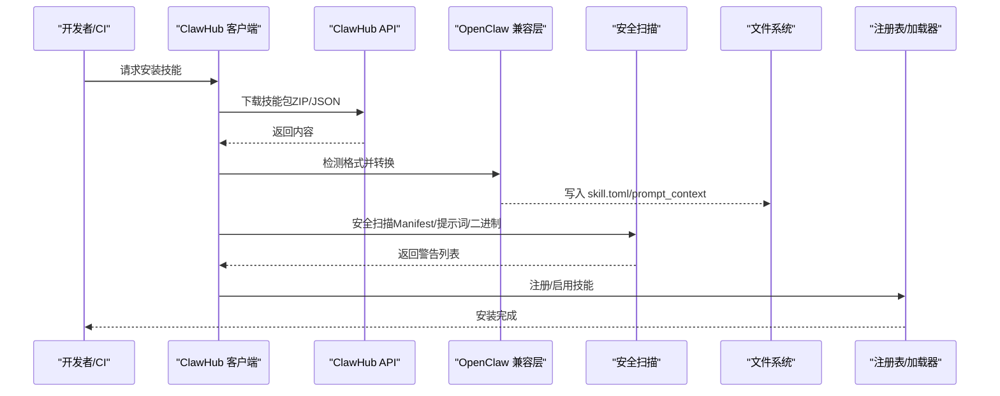
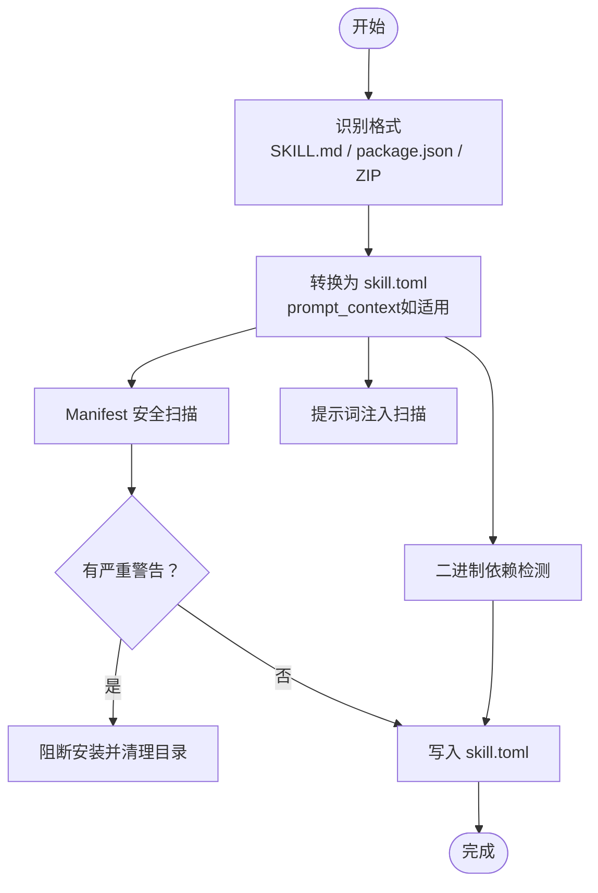
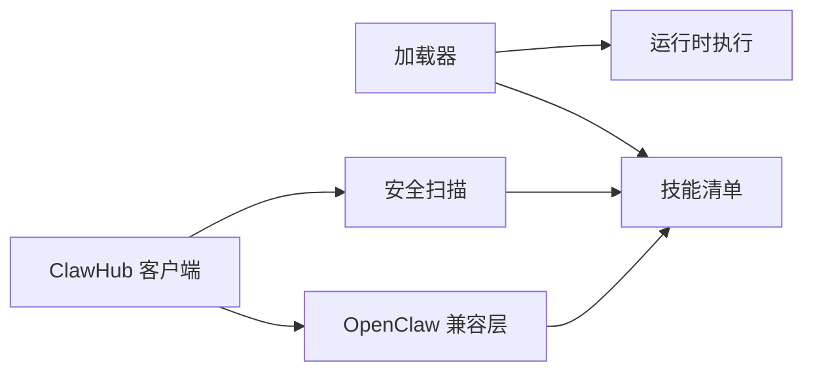

# 技能打包与发布

<cite>
**本文引用的文件**
- [lib.rs](file://crates/openfang-skills/src/lib.rs)
- [loader.rs](file://crates/openfang-skills/src/loader.rs)
- [marketplace.rs](file://crates/openfang-skills/src/marketplace.rs)
- [clawhub.rs](file://crates/openfang-skills/src/clawhub.rs)
- [verify.rs](file://crates/openfang-skills/src/verify.rs)
- [openclaw_compat.rs](file://crates/openfang-skills/src/openclaw_compat.rs)
- [HAND.toml（浏览器）](file://crates/openfang-hands/bundled/browser/HAND.toml)
- [HAND.toml（剪辑）](file://crates/openfang-hands/bundled/clip/HAND.toml)
- [HAND.toml（情报收集）](file://crates/openfang-hands/bundled/collector/HAND.toml)
- [SKILL.md（Ansible）](file://crates/openfang-skills/bundled/ansible/SKILL.md)
- [SKILL.md（代码评审）](file://crates/openfang-skills/bundled/code-reviewer/SKILL.md)
</cite>

## 目录
1. [简介](#简介)
2. [项目结构](#项目结构)
3. [核心组件](#核心组件)
4. [架构总览](#架构总览)
5. [详细组件分析](#详细组件分析)
6. [依赖关系分析](#依赖关系分析)
7. [性能考量](#性能考量)
8. [故障排查指南](#故障排查指南)
9. [结论](#结论)
10. [附录：发布流程与检查清单](#附录发布流程与检查清单)

## 简介
本指南面向技能开发者与维护者，系统阐述 OpenFang 技能的打包格式、文件结构、元数据规范、版本管理与兼容性策略、发布到 ClawHub 市场的流程与审核要点、安全扫描与签名校验、依赖管理、发布前检查清单、自动化发布与回滚策略，以及社区贡献与开源协议要求。

## 项目结构
OpenFang 的“技能”由统一的 manifest 驱动，支持多种运行时与来源：
- 统一技能模型：skill.toml 定义技能元数据、运行时类型、工具定义、能力需求、来源等。
- 运行时执行：按运行时类型调用 Python/Node/Shell 等子进程或提示词注入。
- 市场来源：支持从 ClawHub 下载并转换为 OpenFang 格式；也支持本地/内置/OpenClaw 兼容格式。
- 安全与验证：SHA256 校验、Manifest 安全扫描、提示词注入风险扫描、二进制依赖检测。

图示来源
- [lib.rs:104-123](file://crates/openfang-skills/src/lib.rs#L104-L123)
- [loader.rs:10-51](file://crates/openfang-skills/src/loader.rs#L10-L51)
- [clawhub.rs:502-657](file://crates/openfang-skills/src/clawhub.rs#L502-L657)
- [openclaw_compat.rs:164-266](file://crates/openfang-skills/src/openclaw_compat.rs#L164-L266)
- [verify.rs:46-103](file://crates/openfang-skills/src/verify.rs#L46-L103)

章节来源
- [lib.rs:104-123](file://crates/openfang-skills/src/lib.rs#L104-L123)
- [loader.rs:10-51](file://crates/openfang-skills/src/loader.rs#L10-L51)
- [clawhub.rs:502-657](file://crates/openfang-skills/src/clawhub.rs#L502-L657)
- [openclaw_compat.rs:164-266](file://crates/openfang-skills/src/openclaw_compat.rs#L164-L266)
- [verify.rs:46-103](file://crates/openfang-skills/src/verify.rs#L46-L103)

## 核心组件
- 技能模型与元数据
  - 技能元信息：名称、版本、描述、作者、许可证、标签。
  - 运行时配置：类型（Python/Node/Shell/WASM/Builtin/PromptOnly）、入口文件。
  - 工具定义：提供的工具名、描述、输入模式。
  - 能力与工具需求：声明对宿主工具与网络/系统能力的依赖。
  - 来源追踪：Native/Bundled/OpenClaw/ClawHub。
- 运行时执行
  - 按 manifest 中的 runtime.type 选择执行路径，并通过子进程隔离环境变量，避免泄露。
- 市场与来源
  - ClawHub 客户端：搜索、浏览、详情、文件获取、安装（含重试与速率限制处理）。
  - OpenClaw 兼容：SKILL.md 与 package.json 的解析与转换。
- 安全与验证
  - SHA256 校验、Manifest 安全扫描（危险能力/工具）、提示词注入扫描、二进制依赖检测。

章节来源
- [lib.rs:104-149](file://crates/openfang-skills/src/lib.rs#L104-L149)
- [loader.rs:10-51](file://crates/openfang-skills/src/loader.rs#L10-L51)
- [clawhub.rs:238-664](file://crates/openfang-skills/src/clawhub.rs#L238-L664)
- [openclaw_compat.rs:164-266](file://crates/openfang-skills/src/openclaw_compat.rs#L164-L266)
- [verify.rs:46-103](file://crates/openfang-skills/src/verify.rs#L46-L103)

## 架构总览
下图展示从市场下载到本地安装、转换、安全扫描与最终注册的全流程。

图示来源
- [clawhub.rs:502-657](file://crates/openfang-skills/src/clawhub.rs#L502-L657)
- [openclaw_compat.rs:577-638](file://crates/openfang-skills/src/openclaw_compat.rs#L577-L638)
- [verify.rs:46-103](file://crates/openfang-skills/src/verify.rs#L46-L103)
- [loader.rs:10-51](file://crates/openfang-skills/src/loader.rs#L10-L51)

## 详细组件分析

### 技能打包格式与文件结构
- 必需文件
  - skill.toml：技能清单，包含 [skill]、[runtime]、[[tools.provided]]、[requirements]、可选 [prompt_context]、[source]。
  - 运行时入口：根据 runtime.type 指定的 entry 文件（如 Python/Node/Shell 脚本）。
- 兼容格式
  - SKILL.md：用于 OpenClaw 提示型技能，前端 YAML + Markdown 正文，自动转换为 skill.toml 与 prompt_context。
  - package.json：OpenClaw Node 技能，自动转换为 skill.toml（runtime.type=node）。
- 示例参考
  - 浏览器手（Browser Hand）：以 HAND.toml 展示了工具清单、系统依赖、设置项与系统提示，便于理解技能能力边界与运行条件。
  - 剪辑手（Clip Hand）：同样以 HAND.toml 展示了多平台命令、外部二进制依赖与发布目标。
  - 情报收集手（Collector Hand）：展示了调度、知识图谱与事件发布等高级能力。

章节来源
- [lib.rs:104-123](file://crates/openfang-skills/src/lib.rs#L104-L123)
- [openclaw_compat.rs:164-266](file://crates/openfang-skills/src/openclaw_compat.rs#L164-L266)
- [openclaw_compat.rs:368-435](file://crates/openfang-skills/src/openclaw_compat.rs#L368-L435)
- [HAND.toml（浏览器）:1-14](file://crates/openfang-hands/bundled/browser/HAND.toml#L1-L14)
- [HAND.toml（剪辑）:1-6](file://crates/openfang-hands/bundled/clip/HAND.toml#L1-L6)
- [HAND.toml（情报收集）:1-6](file://crates/openfang-hands/bundled/collector/HAND.toml#L1-L6)

### 元数据规范与字段语义
- [skill] 字段
  - name：技能唯一标识（建议小写、连字符或下划线）。
  - version：语义化版本（默认 0.1.0）。
  - description、author、license、tags：用于发现与合规。
- [runtime]
  - type：python/node/shell/wasm/builtin/promptonly。
  - entry：相对路径的入口脚本或模块。
- [[tools.provided]]
  - name：工具名（全局唯一），建议 snake_case。
  - description：对 LLM 的说明。
  - input_schema：JSON Schema 描述输入参数。
- [requirements]
  - tools：需要的宿主工具名列表。
  - capabilities：需要的宿主能力（如网络访问、Shell 执行等）。
- [prompt_context]（仅 PromptOnly）
  - Markdown 文本，作为系统提示的一部分注入。
- [source]
  - 记录来源类型与版本信息（如 ClawHub 的 slug/version）。

章节来源
- [lib.rs:125-149](file://crates/openfang-skills/src/lib.rs#L125-L149)
- [lib.rs:151-160](file://crates/openfang-skills/src/lib.rs#L151-L160)
- [lib.rs:162-168](file://crates/openfang-skills/src/lib.rs#L162-L168)
- [lib.rs:170-179](file://crates/openfang-skills/src/lib.rs#L170-L179)

### 版本管理策略与向后兼容
- 语义化版本
  - 使用语义化版本号（主.次.补丁），遵循“破坏性变更/新增功能/修复”规则。
- 向后兼容
  - 工具输入 schema 应保持兼容：新增字段应设为可选；避免删除已存在字段。
  - 能力与工具需求变更需谨慎，优先通过新工具名或新能力提供替代。
- 升级与降级
  - 安装新版本时保留旧版本配置；卸载前确认无依赖。
  - PromptOnly 技能不涉及运行时升级，但需注意 prompt_context 的变更影响行为。

章节来源
- [lib.rs:147-149](file://crates/openfang-skills/src/lib.rs#L147-L149)
- [lib.rs:194-225](file://crates/openfang-skills/src/lib.rs#L194-L225)

### 更新机制设计
- 运行时执行
  - 按 manifest 中 runtime.type 选择对应执行器（Python/Node/Shell），通过子进程隔离环境变量，确保安全。
- PromptOnly 技能
  - 不执行代码，直接返回提示词引导使用宿主工具。

章节来源
- [loader.rs:10-51](file://crates/openfang-skills/src/loader.rs#L10-L51)
- [loader.rs:40-49](file://crates/openfang-skills/src/loader.rs#L40-L49)

### ClawHub 市场发布流程与审核标准
- 发布前准备
  - 准备 skill.toml 与运行时入口；若为 OpenClaw 格式，确保 SKILL.md 或 package.json 结构正确。
- 下载与转换
  - ClawHub 客户端下载 ZIP 包或 JSON 包，自动识别格式并转换为 skill.toml。
- 安全扫描
  - Manifest 安全扫描：检查危险 runtime 类型与能力/工具请求。
  - 提示词注入扫描：检测覆盖系统指令、数据外泄、可疑 Shell 命令等模式。
  - 二进制依赖检测：检查所需系统二进制是否存在。
- 审核与质量评估
  - 严重安全警告将阻断安装；一般警告需在安装后人工审阅。
  - 质量评估维度：工具定义清晰度、输入 schema 合理性、prompt_context 的可读性与安全性、依赖最小化。

图示来源
- [clawhub.rs:532-638](file://crates/openfang-skills/src/clawhub.rs#L532-L638)
- [verify.rs:46-103](file://crates/openfang-skills/src/verify.rs#L46-L103)
- [verify.rs:105-179](file://crates/openfang-skills/src/verify.rs#L105-L179)
- [openclaw_compat.rs:577-638](file://crates/openfang-skills/src/openclaw_compat.rs#L577-L638)

章节来源
- [clawhub.rs:492-657](file://crates/openfang-skills/src/clawhub.rs#L492-L657)
- [verify.rs:46-103](file://crates/openfang-skills/src/verify.rs#L46-L103)
- [verify.rs:105-179](file://crates/openfang-skills/src/verify.rs#L105-L179)

### 技能签名验证与安全扫描
- SHA256 校验
  - 对下载内容计算 SHA256 并与期望值比对（常用于供应链完整性）。
- Manifest 安全扫描
  - 检查危险能力（如 ShellExec、NetConnect(*)）、危险工具（shell_exec、file_write 等）。
- 提示词注入扫描
  - 检测覆盖系统指令、外泄、可疑 Shell 命令等模式，防止提示词注入攻击。
- 二进制依赖检测
  - 检查所需系统二进制是否可用，缺失时发出警告。

章节来源
- [verify.rs:30-43](file://crates/openfang-skills/src/verify.rs#L30-L43)
- [verify.rs:46-103](file://crates/openfang-skills/src/verify.rs#L46-L103)
- [verify.rs:105-179](file://crates/openfang-skills/src/verify.rs#L105-L179)
- [clawhub.rs:687-703](file://crates/openfang-skills/src/clawhub.rs#L687-L703)

### 依赖管理
- 宿主工具依赖
  - 在 requirements.tools 中声明；运行时通过宿主工具执行。
- 能力依赖
  - 在 requirements.capabilities 中声明；例如网络访问、Shell 执行等。
- 外部二进制依赖
  - OpenClaw 兼容层会提取并记录所需系统二进制；ClawHub 安装阶段进行检测并给出警告。

章节来源
- [lib.rs:93-101](file://crates/openfang-skills/src/lib.rs#L93-L101)
- [openclaw_compat.rs:184-188](file://crates/openfang-skills/src/openclaw_compat.rs#L184-L188)
- [clawhub.rs:614-622](file://crates/openfang-skills/src/clawhub.rs#L614-L622)

### 自动化发布与回滚策略
- 自动化发布
  - 使用 ClawHub 客户端的 install 接口，自动下载、转换、扫描、写入 manifest。
  - 支持重试与指数退避，应对 429/5xx 错误。
- 回滚策略
  - 安装失败或严重安全警告时清理技能目录，避免污染。
  - 建议保留上一个版本的 manifest 与日志，必要时手动恢复。

章节来源
- [clawhub.rs:276-382](file://crates/openfang-skills/src/clawhub.rs#L276-L382)
- [clawhub.rs:601-608](file://crates/openfang-skills/src/clawhub.rs#L601-L608)

### 社区贡献与开源协议
- 贡献指南
  - 提交前确保技能符合元数据规范、具备最小依赖、通过安全扫描。
  - 提供清晰的 README 与示例输入输出。
- 开源协议
  - OpenFang 采用 Apache-2.0 许可证；技能可自由选择兼容的开源许可证。
- 知识产权保护
  - 不得包含敏感信息或违反许可的第三方代码；遵守上游许可证条款。

章节来源
- [openclaw_compat.rs:330-332](file://crates/openfang-skills/src/openclaw_compat.rs#L330-L332)

## 依赖关系分析
- 组件耦合
  - 加载器依赖技能清单与运行时类型，耦合度低，扩展新运行时只需新增分支。
  - OpenClaw 兼容层负责格式转换，独立于加载器，便于维护。
  - 安全扫描模块独立，可被安装流程复用。
- 外部依赖
  - ClawHub API：搜索、浏览、详情、下载接口。
  - 子进程运行时：Python/Node/Shell 可执行文件。

图示来源
- [loader.rs:10-51](file://crates/openfang-skills/src/loader.rs#L10-L51)
- [openclaw_compat.rs:164-266](file://crates/openfang-skills/src/openclaw_compat.rs#L164-L266)
- [verify.rs:46-103](file://crates/openfang-skills/src/verify.rs#L46-L103)
- [clawhub.rs:502-657](file://crates/openfang-skills/src/clawhub.rs#L502-L657)

章节来源
- [loader.rs:10-51](file://crates/openfang-skills/src/loader.rs#L10-L51)
- [openclaw_compat.rs:164-266](file://crates/openfang-skills/src/openclaw_compat.rs#L164-L266)
- [verify.rs:46-103](file://crates/openfang-skills/src/verify.rs#L46-L103)
- [clawhub.rs:502-657](file://crates/openfang-skills/src/clawhub.rs#L502-L657)

## 性能考量
- 运行时隔离
  - 子进程执行时清空环境变量，仅保留必要的 PATH/HOME 等，降低上下文切换开销。
- I/O 与序列化
  - 通过 stdin/stdout 传递 JSON 输入输出，减少文件 IO。
- 二进制依赖
  - 提前检测系统二进制可用性，避免运行期失败重试带来的延迟。

章节来源
- [loader.rs:93-114](file://crates/openfang-skills/src/loader.rs#L93-L114)
- [loader.rs:197-216](file://crates/openfang-skills/src/loader.rs#L197-L216)
- [loader.rs:342-360](file://crates/openfang-skills/src/loader.rs#L342-L360)
- [clawhub.rs:687-703](file://crates/openfang-skills/src/clawhub.rs#L687-L703)

## 故障排查指南
- 运行时不可用
  - Python/Node/Shell 未安装或版本过低：安装满足最低版本要求的运行时。
- 执行失败
  - 检查入口文件是否存在、权限是否正确；查看子进程 stderr 输出。
- 安全阻断
  - 若出现“提示词注入”或“危险能力”警告，需修改技能内容或移除高危请求。
- 市场安装失败
  - 检查网络状态与 API 限流；重试或稍后再试。

章节来源
- [loader.rs:74-78](file://crates/openfang-skills/src/loader.rs#L74-L78)
- [loader.rs:174-178](file://crates/openfang-skills/src/loader.rs#L174-L178)
- [loader.rs:326-330](file://crates/openfang-skills/src/loader.rs#L326-L330)
- [verify.rs:113-133](file://crates/openfang-skills/src/verify.rs#L113-L133)
- [clawhub.rs:344-356](file://crates/openfang-skills/src/clawhub.rs#L344-L356)

## 结论
通过统一的技能模型、严格的格式与元数据规范、完善的运行时执行与安全扫描机制，OpenFang 能够稳定地管理来自不同来源的技能。ClawHub 市场提供了标准化的发布与安装流程，结合自动化重试与安全审查，显著降低了技能生态的风险与维护成本。

## 附录：发布流程与检查清单

### 发布前检查清单
- 清单
  - 技能目录包含 skill.toml 与运行时入口。
  - 工具定义与输入 schema 清晰、最小化。
  - 能力与工具需求合理，避免过度授权。
  - PromptOnly 技能的 prompt_context 无注入风险。
  - 外部二进制依赖明确并在安装文档中标注。
  - 许可证与作者信息完整。
  - 提供最小可复现示例与测试用例。
- 自动化
  - CI 中执行安全扫描与格式校验。
  - 生成并校验 SHA256 校验值（如需）。

章节来源
- [lib.rs:104-123](file://crates/openfang-skills/src/lib.rs#L104-L123)
- [verify.rs:46-103](file://crates/openfang-skills/src/verify.rs#L46-L103)
- [verify.rs:105-179](file://crates/openfang-skills/src/verify.rs#L105-L179)
- [openclaw_compat.rs:184-188](file://crates/openfang-skills/src/openclaw_compat.rs#L184-L188)

### 自动化发布流程（ClawHub）
- 步骤
  - 登录 ClawHub 平台，上传 ZIP 包或 JSON 包。
  - 填写元数据（名称、版本、描述、标签、许可证）。
  - 提交审核，等待自动扫描与人工复核。
  - 审核通过后，用户可通过 OpenFang 客户端安装。
- 回滚策略
  - 审核失败或安装失败时，系统清理技能目录并保留日志。
  - 建议保留上一版本的 skill.toml 以便快速回滚。

章节来源
- [clawhub.rs:492-657](file://crates/openfang-skills/src/clawhub.rs#L492-L657)
- [clawhub.rs:601-608](file://crates/openfang-skills/src/clawhub.rs#L601-L608)

### 示例参考（技能样例）
- SKILL.md（Ansible）
  - 提示型技能，强调幂等、角色组织、模板与密钥管理。
- SKILL.md（代码评审）
  - 强调安全、性能、风格检查清单与沟通方式。
- HAND.toml（浏览器/剪辑/情报收集）
  - 展示工具清单、系统依赖、设置项与系统提示，便于理解技能能力边界。

章节来源
- [SKILL.md（Ansible）:1-39](file://crates/openfang-skills/bundled/ansible/SKILL.md#L1-L39)
- [SKILL.md（代码评审）:1-46](file://crates/openfang-skills/bundled/code-reviewer/SKILL.md#L1-L46)
- [HAND.toml（浏览器）:1-14](file://crates/openfang-hands/bundled/browser/HAND.toml#L1-L14)
- [HAND.toml（剪辑）:1-6](file://crates/openfang-hands/bundled/clip/HAND.toml#L1-L6)
- [HAND.toml（情报收集）:1-6](file://crates/openfang-hands/bundled/collector/HAND.toml#L1-L6)