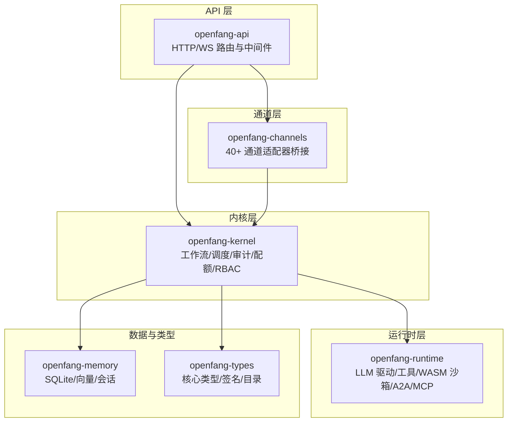
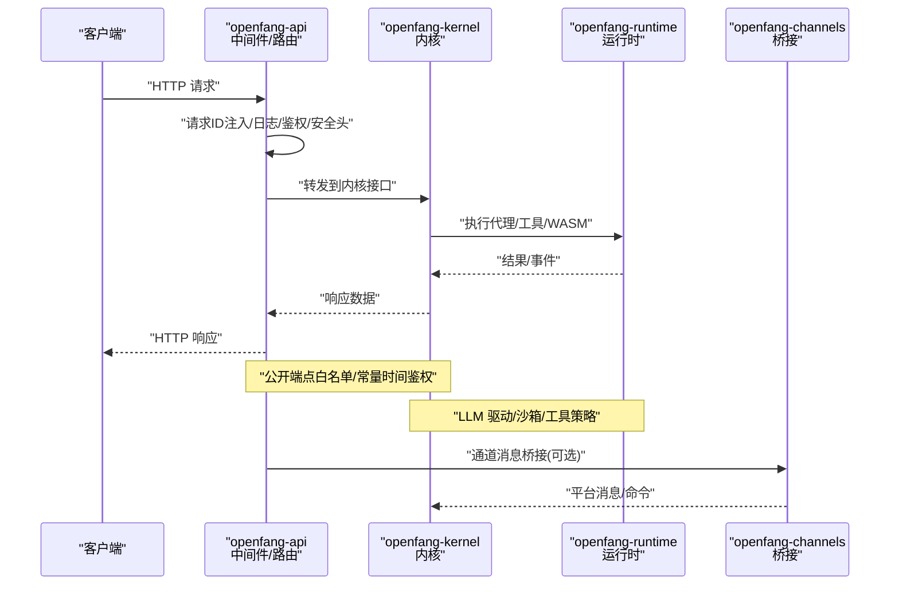
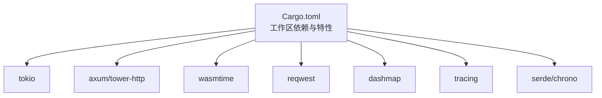

# 技能测试与调试

<cite>
**本文引用的文件**
- [README.md](file://README.md)
- [CONTRIBUTING.md](file://CONTRIBUTING.md)
- [Cargo.toml](file://Cargo.toml)
- [crates/openfang-api/tests/api_integration_test.rs](file://crates/openfang-api/tests/api_integration_test.rs)
- [crates/openfang-api/tests/load_test.rs](file://crates/openfang-api/tests/load_test.rs)
- [crates/openfang-api/tests/daemon_lifecycle_test.rs](file://crates/openfang-api/tests/daemon_lifecycle_test.rs)
- [crates/openfang-channels/tests/bridge_integration_test.rs](file://crates/openfang-channels/tests/bridge_integration_test.rs)
- [crates/openfang-kernel/tests/integration_test.rs](file://crates/openfang-kernel/tests/integration_test.rs)
- [crates/openfang-kernel/tests/multi_agent_test.rs](file://crates/openfang-kernel/tests/multi_agent_test.rs)
- [crates/openfang-kernel/tests/wasm_agent_integration_test.rs](file://crates/openfang-kernel/tests/wasm_agent_integration_test.rs)
- [crates/openfang-kernel/tests/workflow_integration_test.rs](file://crates/openfang-kernel/tests/workflow_integration_test.rs)
- [crates/openfang-api/src/middleware.rs](file://crates/openfang-api/src/middleware.rs)
- [crates/openfang-kernel/src/kernel.rs](file://crates/openfang-kernel/src/kernel.rs)
- [crates/openfang-runtime/src/lib.rs](file://crates/openfang-runtime/src/lib.rs)
</cite>

## 目录
1. [简介](#简介)
2. [项目结构](#项目结构)
3. [核心组件](#核心组件)
4. [架构总览](#架构总览)
5. [详细组件分析](#详细组件分析)
6. [依赖关系分析](#依赖关系分析)
7. [性能考量](#性能考量)
8. [故障排查指南](#故障排查指南)
9. [结论](#结论)
10. [附录](#附录)

## 简介
本指南面向 OpenFang 的技能测试与调试实践，围绕单元测试、集成测试、性能测试与负载测试、调试工具与日志分析、错误诊断流程、技能验证与安全检查、兼容性测试标准、测试用例编写与 Mock 使用、模拟环境搭建、常见问题排查、性能瓶颈识别与内存泄漏检测、测试自动化与持续集成、质量保证标准等主题，提供系统化、可操作的实践建议。内容基于仓库中现有的测试文件与核心模块，确保可落地、可复现。

## 项目结构
OpenFang 采用多 crate 工作区组织，核心与测试分布如下：
- openfang-api：HTTP/WebSocket API、中间件、认证与安全头、路由与端点
- openfang-kernel：内核编排、工作流、调度、配额计量、RBAC、事件总线、触发器
- openfang-runtime：运行时、LLM 驱动抽象、工具执行、WASM 沙箱、A2A/MCP
- openfang-channels：40+ 通道适配器桥接与消息分发
- openfang-memory：内存子系统（SQLite + 向量）
- openfang-types：核心类型、污点追踪、Ed25519 签名、模型目录
- openfang-skills：技能系统、FangHub 市场
- openfang-hands：7 个预置“手”（自主能力包）
- openfang-extensions：扩展注册、凭证库、OAuth2
- openfang-wire：P2P 协议
- openfang-cli、openfang-desktop：命令行与桌面应用
- openfang-migrate：迁移引擎
- xtask：构建自动化



图示来源
- [Cargo.toml:1-160](file://Cargo.toml#L1-L160)

章节来源
- [Cargo.toml:1-160](file://Cargo.toml#L1-L160)

## 核心组件
- 测试框架与运行环境
  - 使用 Rust 标准测试框架与 tokio 异步运行时；通过环境变量控制真实 LLM 调用（如 GROQ_API_KEY），未设置时测试跳过以避免失败。
  - 提供 release-fast 配置用于本地快速迭代构建，release 仅在最终二进制或 CI 使用。
- 中间件与安全
  - 请求 ID 注入与结构化日志、常量时间鉴权比较、安全响应头注入、公开端点白名单、会话 Cookie 验证。
- 内核与运行时
  - 内核装配各子系统并提供统一 API；运行时负责代理循环、驱动抽象、工具执行、WASM 沙箱与 A2A/MCP。
- 通道桥接
  - 通过 BridgeManager 将平台消息与内核交互，支持并发适配器与命令处理。

章节来源
- [CONTRIBUTING.md:38-47](file://CONTRIBUTING.md#L38-L47)
- [CONTRIBUTING.md:61-67](file://CONTRIBUTING.md#L61-L67)
- [crates/openfang-api/src/middleware.rs:18-44](file://crates/openfang-api/src/middleware.rs#L18-L44)
- [crates/openfang-api/src/middleware.rs:62-215](file://crates/openfang-api/src/middleware.rs#L62-L215)
- [crates/openfang-kernel/src/kernel.rs:60-164](file://crates/openfang-kernel/src/kernel.rs#L60-L164)
- [crates/openfang-runtime/src/lib.rs:1-59](file://crates/openfang-runtime/src/lib.rs#L1-L59)

## 架构总览
下图展示从 API 到内核、再到运行时与通道桥接的调用链路，以及关键中间件与安全层：



图示来源
- [crates/openfang-api/src/middleware.rs:18-44](file://crates/openfang-api/src/middleware.rs#L18-L44)
- [crates/openfang-api/src/middleware.rs:62-215](file://crates/openfang-api/src/middleware.rs#L62-L215)
- [crates/openfang-kernel/src/kernel.rs:60-164](file://crates/openfang-kernel/src/kernel.rs#L60-L164)
- [crates/openfang-runtime/src/lib.rs:1-59](file://crates/openfang-runtime/src/lib.rs#L1-L59)

## 详细组件分析

### API 集成测试与端点验证
- 目标：覆盖健康检查、状态查询、代理生命周期、消息发送、工作流与触发器 CRUD、认证与请求 ID 校验。
- 关键点：
  - 使用临时目录与随机端口启动真实内核与 Axum 服务器，直接发起 HTTP 请求进行端到端验证。
  - 公共健康端点返回最小信息，敏感字段不暴露；状态端点包含运行时统计。
  - 认证中间件对非公开端点进行鉴权，支持 Bearer Token 与 X-API-Key，以及会话 Cookie。
  - 请求 ID 头部为标准 UUID，便于跨服务追踪。
- 性能与稳定性：
  - 通过并发代理创建、并发读取、会话管理、工作流批量创建等测试评估吞吐与延迟。

章节来源
- [crates/openfang-api/tests/api_integration_test.rs:187-230](file://crates/openfang-api/tests/api_integration_test.rs#L187-L230)
- [crates/openfang-api/tests/api_integration_test.rs:316-367](file://crates/openfang-api/tests/api_integration_test.rs#L316-L367)
- [crates/openfang-api/tests/api_integration_test.rs:369-420](file://crates/openfang-api/tests/api_integration_test.rs#L369-L420)
- [crates/openfang-api/tests/api_integration_test.rs:421-496](file://crates/openfang-api/tests/api_integration_test.rs#L421-L496)
- [crates/openfang-api/tests/api_integration_test.rs:562-582](file://crates/openfang-api/tests/api_integration_test.rs#L562-L582)
- [crates/openfang-api/tests/api_integration_test.rs:680-789](file://crates/openfang-api/tests/api_integration_test.rs#L680-L789)
- [crates/openfang-api/tests/load_test.rs:148-201](file://crates/openfang-api/tests/load_test.rs#L148-L201)
- [crates/openfang-api/tests/load_test.rs:203-265](file://crates/openfang-api/tests/load_test.rs#L203-L265)
- [crates/openfang-api/tests/load_test.rs:267-323](file://crates/openfang-api/tests/load_test.rs#L267-L323)
- [crates/openfang-api/tests/load_test.rs:325-424](file://crates/openfang-api/tests/load_test.rs#L325-L424)
- [crates/openfang-api/tests/load_test.rs:426-490](file://crates/openfang-api/tests/load_test.rs#L426-L490)
- [crates/openfang-api/tests/load_test.rs:492-546](file://crates/openfang-api/tests/load_test.rs#L492-L546)
- [crates/openfang-api/tests/load_test.rs:548-587](file://crates/openfang-api/tests/load_test.rs#L548-L587)

### 内核集成测试与多代理/工作流
- 目标：内核引导、代理创建与消息传递、多代理舰队、WASM 代理、工作流与触发器端到端。
- 关键点：
  - 集成测试通过真实内核引导与 LLM（Groq）进行完整链路验证，未设置密钥则跳过。
  - 多代理测试验证不同模型实例并发执行与资源隔离。
  - WASM 代理测试覆盖模块加载、回显、燃料耗尽保护、缺失模块错误、主机调用与流式输出。
  - 工作流测试验证注册、按名称/ID 解析、运行与结果记录。
- 安全与兼容性：
  - 通过不同模型与驱动组合验证兼容性；WASM 沙箱保护防止无限循环与越界访问。

章节来源
- [crates/openfang-kernel/tests/integration_test.rs:27-84](file://crates/openfang-kernel/tests/integration_test.rs#L27-L84)
- [crates/openfang-kernel/tests/integration_test.rs:86-164](file://crates/openfang-kernel/tests/integration_test.rs#L86-L164)
- [crates/openfang-kernel/tests/multi_agent_test.rs:31-202](file://crates/openfang-kernel/tests/multi_agent_test.rs#L31-L202)
- [crates/openfang-kernel/tests/wasm_agent_integration_test.rs:149-197](file://crates/openfang-kernel/tests/wasm_agent_integration_test.rs#L149-L197)
- [crates/openfang-kernel/tests/wasm_agent_integration_test.rs:199-223](file://crates/openfang-kernel/tests/wasm_agent_integration_test.rs#L199-L223)
- [crates/openfang-kernel/tests/wasm_agent_integration_test.rs:225-246](file://crates/openfang-kernel/tests/wasm_agent_integration_test.rs#L225-L246)
- [crates/openfang-kernel/tests/wasm_agent_integration_test.rs:248-290](file://crates/openfang-kernel/tests/wasm_agent_integration_test.rs#L248-L290)
- [crates/openfang-kernel/tests/wasm_agent_integration_test.rs:292-326](file://crates/openfang-kernel/tests/wasm_agent_integration_test.rs#L292-L326)
- [crates/openfang-kernel/tests/wasm_agent_integration_test.rs:328-357](file://crates/openfang-kernel/tests/wasm_agent_integration_test.rs#L328-L357)
- [crates/openfang-kernel/tests/wasm_agent_integration_test.rs:359-410](file://crates/openfang-kernel/tests/wasm_agent_integration_test.rs#L359-L410)
- [crates/openfang-kernel/tests/workflow_integration_test.rs:63-172](file://crates/openfang-kernel/tests/workflow_integration_test.rs#L63-L172)
- [crates/openfang-kernel/tests/workflow_integration_test.rs:174-229](file://crates/openfang-kernel/tests/workflow_integration_test.rs#L174-L229)
- [crates/openfang-kernel/tests/workflow_integration_test.rs:231-296](file://crates/openfang-kernel/tests/workflow_integration_test.rs#L231-L296)
- [crates/openfang-kernel/tests/workflow_integration_test.rs:302-404](file://crates/openfang-kernel/tests/workflow_integration_test.rs#L302-L404)

### 通道桥接集成测试
- 目标：验证桥接管道的端到端工作，包括文本消息分发、命令处理（/agents、/help、/agent、/status）、用户路由更新、并发适配器与生命周期。
- 关键点：
  - 使用自定义 MockAdapter 与 MockHandle，通过 in-process 通道与任务验证消息流。
  - 支持多种命令与路由行为，确保无代理分配时的友好提示。
  - 并发适配器同时运行，互不干扰。

章节来源
- [crates/openfang-channels/tests/bridge_integration_test.rs:199-243](file://crates/openfang-channels/tests/bridge_integration_test.rs#L199-L243)
- [crates/openfang-channels/tests/bridge_integration_test.rs:245-287](file://crates/openfang-channels/tests/bridge_integration_test.rs#L245-L287)
- [crates/openfang-channels/tests/bridge_integration_test.rs:289-318](file://crates/openfang-channels/tests/bridge_integration_test.rs#L289-L318)
- [crates/openfang-channels/tests/bridge_integration_test.rs:320-358](file://crates/openfang-channels/tests/bridge_integration_test.rs#L320-L358)
- [crates/openfang-channels/tests/bridge_integration_test.rs:360-388](file://crates/openfang-channels/tests/bridge_integration_test.rs#L360-L388)
- [crates/openfang-channels/tests/bridge_integration_test.rs:390-419](file://crates/openfang-channels/tests/bridge_integration_test.rs#L390-L419)
- [crates/openfang-channels/tests/bridge_integration_test.rs:421-456](file://crates/openfang-channels/tests/bridge_integration_test.rs#L421-L456)
- [crates/openfang-channels/tests/bridge_integration_test.rs:458-494](file://crates/openfang-channels/tests/bridge_integration_test.rs#L458-L494)
- [crates/openfang-channels/tests/bridge_integration_test.rs:496-546](file://crates/openfang-channels/tests/bridge_integration_test.rs#L496-L546)

### 守护进程生命周期测试
- 目标：验证守护进程信息序列化/反序列化、文件存在性与损坏处理、健康与状态端点、优雅关闭与清理。
- 关键点：
  - 通过临时目录写入/读取 daemon.json，校验 PID、监听地址、版本与平台信息。
  - 启动后立即响应健康与状态端点，关闭后清理文件。

章节来源
- [crates/openfang-api/tests/daemon_lifecycle_test.rs:21-80](file://crates/openfang-api/tests/daemon_lifecycle_test.rs#L21-L80)
- [crates/openfang-api/tests/daemon_lifecycle_test.rs:82-189](file://crates/openfang-api/tests/daemon_lifecycle_test.rs#L82-L189)
- [crates/openfang-api/tests/daemon_lifecycle_test.rs:191-213](file://crates/openfang-api/tests/daemon_lifecycle_test.rs#L191-L213)
- [crates/openfang-api/tests/daemon_lifecycle_test.rs:215-275](file://crates/openfang-api/tests/daemon_lifecycle_test.rs#L215-L275)

### 中间件与安全检查
- 请求 ID 注入与结构化日志：每个请求生成唯一 UUID，并记录方法、路径、状态码与耗时。
- 鉴权中间件：公开端点白名单、POST/PUT/DELETE 均需鉴权；支持 Bearer Token、X-API-Key 与会话 Cookie，常量时间比较防时序攻击。
- 安全响应头：统一注入安全头，限制脚本/样式来源、禁止内联脚本、严格传输加密等。

章节来源
- [crates/openfang-api/src/middleware.rs:18-44](file://crates/openfang-api/src/middleware.rs#L18-L44)
- [crates/openfang-api/src/middleware.rs:62-215](file://crates/openfang-api/src/middleware.rs#L62-L215)
- [crates/openfang-api/src/middleware.rs:232-259](file://crates/openfang-api/src/middleware.rs#L232-L259)

### 运行时与内核类关系
```mermaid
classDiagram
class OpenFangKernel {
+config : KernelConfig
+registry : AgentRegistry
+capabilities : CapabilityManager
+event_bus : EventBus
+scheduler : AgentScheduler
+memory : MemorySubstrate
+workflows : WorkflowEngine
+triggers : TriggerEngine
+background : BackgroundExecutor
+audit_log : AuditLog
+metering : MeteringEngine
+default_driver : LlmDriver
+wasm_sandbox : WasmSandbox
+auth : AuthManager
+model_catalog : ModelCatalog
+skill_registry : SkillRegistry
+running_tasks : DashMap
+mcp_connections : Vec<McpConnection>
+mcp_tools : Vec<ToolDefinition>
+a2a_task_store : A2aTaskStore
+a2a_external_agents : Vec<(String, AgentCard)>
+web_ctx : WebToolsContext
+browser_ctx : BrowserManager
+media_engine : MediaEngine
+tts_engine : TtsEngine
+pairing : PairingManager
+embedding_driver : EmbeddingDriver?
+hand_registry : HandRegistry
+credential_resolver : CredentialResolver
+extension_registry : IntegrationRegistry
+extension_health : HealthMonitor
+effective_mcp_servers : Vec<McpServerConfigEntry>
+delivery_tracker : DeliveryTracker
+cron_scheduler : CronScheduler
+approval_manager : ApprovalManager
+bindings : Vec<AgentBinding>
+broadcast : BroadcastConfig
+auto_reply_engine : AutoReplyEngine
+hooks : HookRegistry
+process_manager : ProcessManager
+peer_registry : PeerRegistry
+peer_node : PeerNode
+booted_at : Instant
+whatsapp_gateway_pid : u32?
+channel_adapters : DashMap<String, ChannelAdapter>
+default_model_override : DefaultModelConfig?
+agent_msg_locks : DashMap<AgentId, Mutex<()>>
+self_handle : Weak<OpenFangKernel>
}
class StubDriver {
+complete(request) Result<CompletionResponse, LlmError>
}
OpenFangKernel --> StubDriver : "默认驱动(无配置时)"
```

图示来源
- [crates/openfang-kernel/src/kernel.rs:46-58](file://crates/openfang-kernel/src/kernel.rs#L46-L58)
- [crates/openfang-kernel/src/kernel.rs:60-164](file://crates/openfang-kernel/src/kernel.rs#L60-L164)

## 依赖关系分析
- 工作区依赖集中在根 Cargo.toml，统一版本与特性开关，确保一致性与可维护性。
- 关键外部依赖：tokio（异步）、axum/tower-http（HTTP/WS）、wasmtime（WASM）、reqwest（HTTP 客户端）、dashmap（并发）、tracing（日志）、serde/chrono（序列化/时间）等。
- 测试依赖：tokio-test、tempfile、futures、async-trait 等。



图示来源
- [Cargo.toml:24-147](file://Cargo.toml#L24-L147)

章节来源
- [Cargo.toml:24-147](file://Cargo.toml#L24-L147)

## 性能考量
- 并发与吞吐
  - 并发代理创建、并发读取、会话批量创建与切换、工作流批量创建、指标端点高并发拉取等测试覆盖。
  - 通过 p50/p95/p99 延迟评估关键端点性能，确保读取端点在高并发下保持低延迟。
- 资源与内存
  - 通道适配器使用 in-process 通道与任务，减少外部依赖带来的额外开销。
  - WASM 沙箱启用燃料计量与看门狗线程，防止无限循环导致资源耗尽。
- 构建与发布
  - release-fast 适合本地快速迭代；release 用于最终产物，启用全链接优化与单代码生成单元。

章节来源
- [crates/openfang-api/tests/load_test.rs:148-201](file://crates/openfang-api/tests/load_test.rs#L148-L201)
- [crates/openfang-api/tests/load_test.rs:203-265](file://crates/openfang-api/tests/load_test.rs#L203-L265)
- [crates/openfang-api/tests/load_test.rs:267-323](file://crates/openfang-api/tests/load_test.rs#L267-L323)
- [crates/openfang-api/tests/load_test.rs:325-424](file://crates/openfang-api/tests/load_test.rs#L325-L424)
- [crates/openfang-api/tests/load_test.rs:426-490](file://crates/openfang-api/tests/load_test.rs#L426-L490)
- [crates/openfang-api/tests/load_test.rs:492-546](file://crates/openfang-api/tests/load_test.rs#L492-L546)
- [crates/openfang-api/tests/load_test.rs:548-587](file://crates/openfang-api/tests/load_test.rs#L548-L587)
- [CONTRIBUTING.md:61-67](file://CONTRIBUTING.md#L61-L67)

## 故障排查指南
- 日志与追踪
  - 中间件统一注入请求 ID 并记录结构化日志，便于端到端追踪。
  - 使用 tracing-subscriber 的 env-filter 与 JSON 输出，便于生产日志采集与分析。
- 常见问题定位
  - 认证失败：检查 Bearer Token/X-API-Key 是否正确、是否使用常量时间比较的鉴权逻辑。
  - 公开端点被拒：确认路径是否在公开白名单、方法是否为 GET。
  - 健康与状态：守护进程健康端点与状态端点响应正常，关闭后清理 daemon.json。
  - LLM 驱动：无配置时使用 StubDriver 返回明确错误；设置真实密钥后恢复功能。
- 错误诊断流程
  - 步骤一：确认环境变量（如 GROQ_API_KEY）是否正确设置。
  - 步骤二：查看中间件日志中的请求 ID 与状态码。
  - 步骤三：检查公开端点白名单与鉴权中间件行为。
  - 步骤四：验证守护进程健康与状态端点。
  - 步骤五：针对 LLM/工具/WASM 场景分别检查对应测试用例的失败点。

章节来源
- [crates/openfang-api/src/middleware.rs:18-44](file://crates/openfang-api/src/middleware.rs#L18-L44)
- [crates/openfang-api/src/middleware.rs:62-215](file://crates/openfang-api/src/middleware.rs#L62-L215)
- [crates/openfang-api/tests/daemon_lifecycle_test.rs:82-189](file://crates/openfang-api/tests/daemon_lifecycle_test.rs#L82-L189)
- [crates/openfang-kernel/src/kernel.rs:46-58](file://crates/openfang-kernel/src/kernel.rs#L46-L58)

## 结论
本指南基于仓库现有测试与核心模块，总结了 OpenFang 在技能测试与调试方面的最佳实践：以真实 HTTP/内核/通道桥接测试为核心，结合中间件与安全中间件保障端到端可观测性与安全性；通过并发与负载测试评估性能；借助 WASM 沙箱与运行时工具策略实现可控的技能执行与安全边界。建议在开发与回归流程中持续运行这些测试，配合日志与指标监控，确保系统稳定与可维护性。

## 附录

### 测试用例编写指南
- 单元测试
  - 使用 tempfile::TempDir 进行文件系统隔离；随机端口绑定网络测试。
  - 对关键函数与模块进行独立验证，优先覆盖错误分支与边界条件。
- 集成测试
  - 通过真实内核与 HTTP 服务器进行端到端验证；必要时设置环境变量启用真实 LLM。
  - 对并发场景（代理创建、会话管理、工作流批量创建）进行压力验证。
- Mock 对象使用
  - 通道桥接测试中使用自定义 MockAdapter 与 MockHandle，验证消息分发与命令处理。
  - 运行时测试中使用 StubDriver 与固定响应模块，验证错误路径与燃料耗尽保护。
- 模拟环境搭建
  - 使用临时目录与随机端口启动内核与 API 服务；根据需要启用/禁用真实 LLM。
  - 通过环境变量控制测试行为（如 GROQ_API_KEY）。

章节来源
- [CONTRIBUTING.md:123-124](file://CONTRIBUTING.md#L123-L124)
- [crates/openfang-channels/tests/bridge_integration_test.rs:27-102](file://crates/openfang-channels/tests/bridge_integration_test.rs#L27-L102)
- [crates/openfang-kernel/tests/wasm_agent_integration_test.rs:109-121](file://crates/openfang-kernel/tests/wasm_agent_integration_test.rs#L109-L121)

### 调试工具与日志分析
- 中间件日志
  - 统一结构化日志格式，包含请求 ID、方法、路径、状态码与耗时。
  - 使用 tracing-subscriber 的 env-filter 与 JSON 输出，便于在生产环境采集与分析。
- 请求 ID 追踪
  - 所有响应注入 x-request-id 头部，便于跨服务串联日志与问题定位。
- 安全头与鉴权
  - 安全响应头统一注入，公开端点白名单与常量时间鉴权减少侧信道风险。

章节来源
- [crates/openfang-api/src/middleware.rs:18-44](file://crates/openfang-api/src/middleware.rs#L18-L44)
- [crates/openfang-api/src/middleware.rs:232-259](file://crates/openfang-api/src/middleware.rs#L232-L259)

### 错误诊断流程
- 环境变量检查：确认 GROQ_API_KEY 等是否正确设置。
- 中间件日志：查看请求 ID 与状态码，定位失败请求。
- 鉴权检查：确认公开端点白名单与鉴权中间件行为。
- 守护进程健康：验证健康与状态端点响应，关闭后清理 daemon.json。
- LLM 驱动：无配置时使用 StubDriver 返回明确错误；设置密钥后恢复功能。

章节来源
- [crates/openfang-api/src/middleware.rs:62-215](file://crates/openfang-api/src/middleware.rs#L62-L215)
- [crates/openfang-api/tests/daemon_lifecycle_test.rs:82-189](file://crates/openfang-api/tests/daemon_lifecycle_test.rs#L82-L189)
- [crates/openfang-kernel/src/kernel.rs:46-58](file://crates/openfang-kernel/src/kernel.rs#L46-L58)

### 性能测试方法
- 并发代理创建：验证内核并发创建代理的能力与成功率。
- 并发读取：对健康、状态、代理列表等只读端点进行高并发请求，评估 p50/p95/p99 延迟。
- 会话管理：批量创建、列出与切换会话，评估吞吐与延迟。
- 工作流批量：并发创建工作流并列出，评估注册与查询性能。
- 指标端点：高并发拉取 Prometheus 指标，评估稳定性与可用性。

章节来源
- [crates/openfang-api/tests/load_test.rs:148-201](file://crates/openfang-api/tests/load_test.rs#L148-L201)
- [crates/openfang-api/tests/load_test.rs:203-265](file://crates/openfang-api/tests/load_test.rs#L203-L265)
- [crates/openfang-api/tests/load_test.rs:267-323](file://crates/openfang-api/tests/load_test.rs#L267-L323)
- [crates/openfang-api/tests/load_test.rs:325-424](file://crates/openfang-api/tests/load_test.rs#L325-L424)
- [crates/openfang-api/tests/load_test.rs:426-490](file://crates/openfang-api/tests/load_test.rs#L426-L490)
- [crates/openfang-api/tests/load_test.rs:492-546](file://crates/openfang-api/tests/load_test.rs#L492-L546)
- [crates/openfang-api/tests/load_test.rs:548-587](file://crates/openfang-api/tests/load_test.rs#L548-L587)

### 常见问题排查清单
- 端点返回 401/403：检查 Bearer Token/X-API-Key 与会话 Cookie，确认公开端点白名单。
- 端点返回 400：检查请求体格式（如无效的代理 ID、非法 TOML 清单）。
- 404：检查资源是否存在（如不存在的代理 ID）。
- 健康端点异常：检查守护进程健康与状态端点响应，确认关闭后清理。
- LLM 无响应：检查密钥设置与驱动配置，确认使用 StubDriver 的错误提示。

章节来源
- [crates/openfang-api/tests/api_integration_test.rs:498-543](file://crates/openfang-api/tests/api_integration_test.rs#L498-L543)
- [crates/openfang-api/tests/api_integration_test.rs:545-559](file://crates/openfang-api/tests/api_integration_test.rs#L545-L559)
- [crates/openfang-api/tests/api_integration_test.rs:561-582](file://crates/openfang-api/tests/api_integration_test.rs#L561-L582)
- [crates/openfang-api/tests/daemon_lifecycle_test.rs:82-189](file://crates/openfang-api/tests/daemon_lifecycle_test.rs#L82-L189)

### 测试自动化与持续集成
- 本地开发
  - 使用 release-fast 快速构建与测试；通过环境变量启用真实 LLM。
- 回归测试
  - 运行 cargo test --workspace 确保所有测试通过；遵循零 clippy 警告与格式化要求。
- 文档与基准
  - 参考 README 中的基准与对比，作为回归性能参考。

章节来源
- [CONTRIBUTING.md:61-67](file://CONTRIBUTING.md#L61-L67)
- [CONTRIBUTING.md:69-75](file://CONTRIBUTING.md#L69-L75)
- [README.md:117-186](file://README.md#L117-L186)