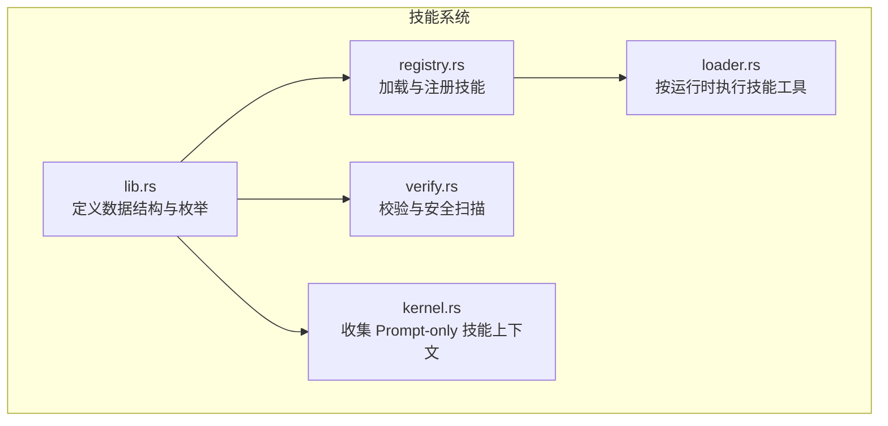
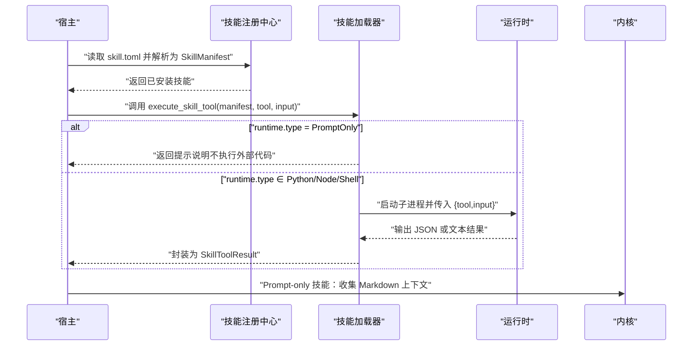
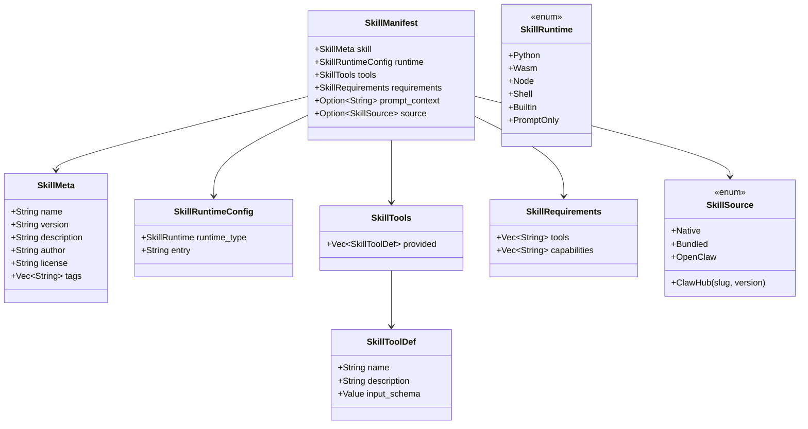
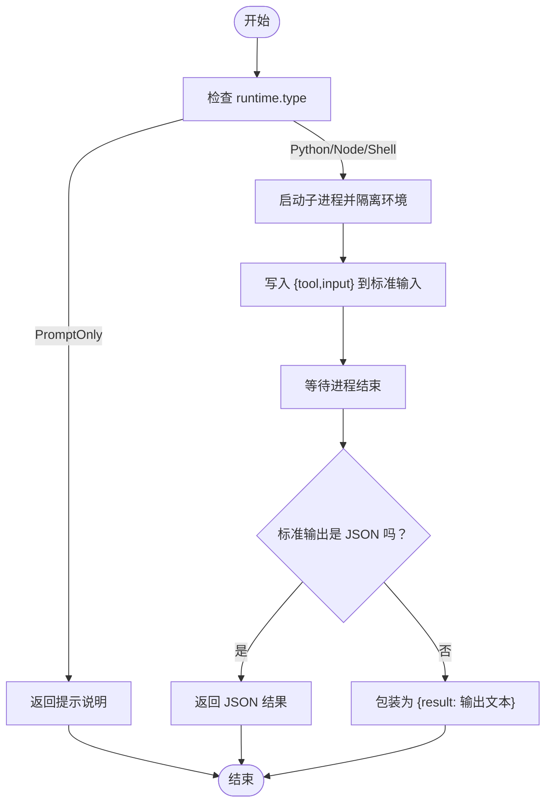
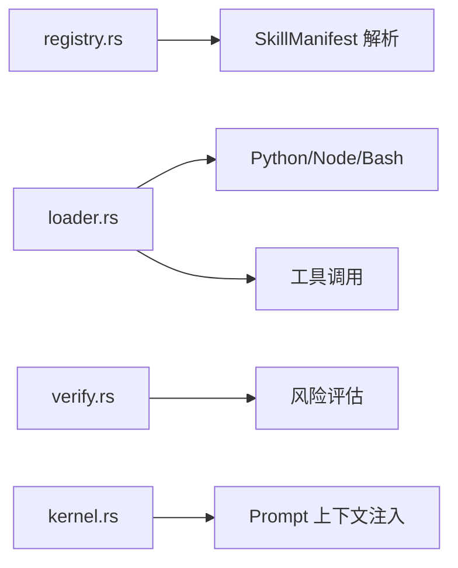

# 技能清单格式

<cite>
**本文引用的文件**
- [lib.rs](file://crates/openfang-skills/src/lib.rs)
- [loader.rs](file://crates/openfang-skills/src/loader.rs)
- [registry.rs](file://crates/openfang-skills/src/registry.rs)
- [verify.rs](file://crates/openfang-skills/src/verify.rs)
- [kernel.rs](file://crates/openfang-kernel/src/kernel.rs)
- [SKILL.md](file://crates/openfang-skills/bundled/web-search/SKILL.md)
- [HAND.toml](file://crates/openfang-hands/bundled/browser/HAND.toml)
- [HAND.toml](file://crates/openfang-hands/bundled/clip/HAND.toml)
- [HAND.toml](file://crates/openfang-hands/bundled/collector/HAND.toml)
</cite>

## 目录
1. [简介](#简介)
2. [项目结构](#项目结构)
3. [核心组件](#核心组件)
4. [架构总览](#架构总览)
5. [详细组件分析](#详细组件分析)
6. [依赖关系分析](#依赖关系分析)
7. [性能考量](#性能考量)
8. [故障排查指南](#故障排查指南)
9. [结论](#结论)
10. [附录](#附录)

## 简介
本文件系统化阐述 OpenFang 技能清单格式（SKILL.toml）与相关数据结构，覆盖以下内容：
- SKILL.toml 的完整结构：[skill]、[runtime]、[tools]、[requirements]、prompt_context、source 等段落的字段定义、类型、默认值与必填性
- 数据结构说明：SkillMeta、SkillRuntimeConfig、SkillTools、SkillRequirements、SkillManifest、SkillToolDef、SkillSource、SkillRuntime 等
- 字段约束、命名规范、版本管理策略
- 实际示例与最佳实践
- 常见配置错误与排错建议

## 项目结构
OpenFang 将“技能”（Skill）与“手”（Hand）两类可插拔能力抽象出来：
- 技能（Skill）：以 skill.toml 为清单，描述元数据、运行时、工具与需求，支持多种运行时（Python/Node/Shell/WASM/Builtin/PromptOnly）
- 手（Hand）：以 HAND.toml 为清单，描述工具、依赖、用户可配置项、代理参数等，用于构建“手”级能力

下图展示与技能清单解析与执行相关的核心模块：

图表来源
- [lib.rs:1-255](file://crates/openfang-skills/src/lib.rs#L1-L255)
- [registry.rs:186-232](file://crates/openfang-skills/src/registry.rs#L186-L232)
- [loader.rs:1-462](file://crates/openfang-skills/src/loader.rs#L1-L462)
- [verify.rs:1-295](file://crates/openfang-skills/src/verify.rs#L1-L295)
- [kernel.rs:5384-5412](file://crates/openfang-kernel/src/kernel.rs#L5384-L5412)

章节来源
- [lib.rs:1-255](file://crates/openfang-skills/src/lib.rs#L1-L255)
- [registry.rs:186-232](file://crates/openfang-skills/src/registry.rs#L186-L232)
- [loader.rs:1-462](file://crates/openfang-skills/src/loader.rs#L1-L462)
- [verify.rs:1-295](file://crates/openfang-skills/src/verify.rs#L1-L295)
- [kernel.rs:5384-5412](file://crates/openfang-kernel/src/kernel.rs#L5384-L5412)

## 核心组件
- 技能清单（SkillManifest）：从 skill.toml 解析出的完整技能定义，包含元数据、运行时配置、工具列表、主机需求、提示上下文与来源信息
- 运行时类型（SkillRuntime）：支持 Python、WASM、Node、Shell、Builtin、PromptOnly
- 工具定义（SkillToolDef）：每个技能提供的工具名称、描述与输入 JSON Schema
- 要求（SkillRequirements）：技能声明的内置工具与主机能力需求
- 源（SkillSource）：技能来源（本地、内嵌、OpenClaw、ClawHub）

章节来源
- [lib.rs:48-123](file://crates/openfang-skills/src/lib.rs#L48-L123)

## 架构总览
技能清单在系统中的生命周期如下：
- 注册中心加载 skill.toml 并解析为 SkillManifest
- 执行阶段根据 runtime.type 选择对应运行时，将工具名与输入通过标准输入传递给脚本
- Prompt-only 技能不执行外部代码，而是将其 Markdown 内容注入到系统提示词中
- 安全扫描对运行时类型、能力与工具进行风险评估

图表来源
- [registry.rs:199-222](file://crates/openfang-skills/src/registry.rs#L199-L222)
- [loader.rs:10-51](file://crates/openfang-skills/src/loader.rs#L10-L51)
- [kernel.rs:5384-5412](file://crates/openfang-kernel/src/kernel.rs#L5384-L5412)

## 详细组件分析

### 技能清单（SKILL.toml）字段定义与验证规则
- 清单文件位置：技能目录下的 skill.toml
- 解析入口：注册中心读取 skill.toml 并反序列化为 SkillManifest

字段与类型
- [skill] 段
  - name: 字符串，唯一技能名
  - version: 字符串，语义化版本，默认 0.1.0
  - description: 字符串，描述
  - author: 字符串，作者
  - license: 字符串，许可证
  - tags: 字符串数组，用于发现
- [runtime] 段
  - type: 运行时类型（python/wasm/node/shell/builtin/promptonly），默认 promptonly
  - entry: 入口文件（相对路径），默认空字符串
- [tools] 段
  - provided: 工具数组，每项包含 name、description、input_schema
- [requirements] 段
  - tools: 字符串数组，所需内置工具
  - capabilities: 字符串数组，所需主机能力
- prompt_context: 可选，Markdown 文本，注入系统提示词（仅 PromptOnly）
- source: 可选，技能来源（native/bundled/openclaw/clawhub）

默认值与必填性
- version 默认 0.1.0；其他字段如无特殊标注均为可选
- runtime.type 缺省时为 PromptOnly
- tools.provided 数组为空时代表该技能不提供任何工具

字段约束与命名规范
- name 必须唯一且符合标识符命名
- version 需遵循语义化版本规范
- input_schema 需满足 JSON Schema 规范
- capabilities 与 tools 名称需与宿主能力/工具清单一致

章节来源
- [lib.rs:103-149](file://crates/openfang-skills/src/lib.rs#L103-L149)
- [registry.rs:199-222](file://crates/openfang-skills/src/registry.rs#L199-L222)

### 数据结构说明
- SkillManifest：技能清单的完整结构
- SkillMeta：技能元数据
- SkillRuntimeConfig：运行时配置
- SkillTools：技能工具集合
- SkillRequirements：技能需求
- SkillToolDef：单个工具定义
- SkillSource：技能来源
- SkillRuntime：运行时类型枚举

图表来源
- [lib.rs:103-188](file://crates/openfang-skills/src/lib.rs#L103-L188)

章节来源
- [lib.rs:103-188](file://crates/openfang-skills/src/lib.rs#L103-L188)

### 运行时执行流程
- 当 runtime.type 为 PromptOnly：执行工具调用时返回提示说明，不执行外部代码
- 当 runtime.type 为 Python/Node/Shell：通过子进程执行 entry 脚本，并将 {tool,input} 作为 JSON 写入标准输入
- 子进程标准输出应为 JSON；若非 JSON，则包装为 {result: 输出文本}

图表来源
- [loader.rs:10-51](file://crates/openfang-skills/src/loader.rs#L10-L51)
- [loader.rs:54-157](file://crates/openfang-skills/src/loader.rs#L54-L157)
- [loader.rs:160-256](file://crates/openfang-skills/src/loader.rs#L160-L256)
- [loader.rs:306-403](file://crates/openfang-skills/src/loader.rs#L306-L403)

章节来源
- [loader.rs:10-51](file://crates/openfang-skills/src/loader.rs#L10-L51)
- [loader.rs:54-157](file://crates/openfang-skills/src/loader.rs#L54-L157)
- [loader.rs:160-256](file://crates/openfang-skills/src/loader.rs#L160-L256)
- [loader.rs:306-403](file://crates/openfang-skills/src/loader.rs#L306-L403)

### Prompt-only 技能上下文注入
- 内核会收集所有启用的 Prompt-only 技能的 Markdown 内容，并在系统提示词中注入
- 对于内嵌（bundled）技能，直接信任并包裹；对于第三方来源，加信任边界保护

章节来源
- [kernel.rs:5384-5412](file://crates/openfang-kernel/src/kernel.rs#L5384-L5412)

### 安全扫描与校验
- 运行时类型扫描：Node 运行时被标记为高风险
- 能力扫描：ShellExec、NetConnect(*) 等高危能力触发警告
- 工具扫描：shell_exec、file_write、file_delete 等危险工具触发警告
- 提示内容扫描：检测注入、数据外泄、可疑命令等模式

章节来源
- [verify.rs:45-103](file://crates/openfang-skills/src/verify.rs#L45-L103)
- [verify.rs:105-179](file://crates/openfang-skills/src/verify.rs#L105-L179)

### 实际示例与最佳实践
- 示例一：Python 技能（基于测试用例）
  - [示例 TOML 片段:195-225](file://crates/openfang-skills/src/lib.rs#L195-L225)
  - 说明：定义了 [skill]/[runtime]/[[tools.provided]]/[requirements] 四个段落
- 示例二：Prompt-only 技能（Markdown）
  - [示例 Markdown:1-39](file://crates/openfang-skills/bundled/web-search/SKILL.md#L1-L39)
  - 说明：适合注入系统提示词，无需运行时
- 示例三：手（Hand）配置（对比理解）
  - [浏览器手 HAND.toml:1-255](file://crates/openfang-hands/bundled/browser/HAND.toml#L1-L255)
  - [剪辑手 HAND.toml:1-599](file://crates/openfang-hands/bundled/clip/HAND.toml#L1-L599)
  - [情报手 HAND.toml:1-346](file://crates/openfang-hands/bundled/collector/HAND.toml#L1-L346)
  - 说明：Hand 侧重工具、依赖、用户设置与代理参数，与 Skill 的运行时与工具定义互补

章节来源
- [lib.rs:195-225](file://crates/openfang-skills/src/lib.rs#L195-L225)
- [SKILL.md:1-39](file://crates/openfang-skills/bundled/web-search/SKILL.md#L1-L39)
- [HAND.toml:1-255](file://crates/openfang-hands/bundled/browser/HAND.toml#L1-L255)
- [HAND.toml:1-599](file://crates/openfang-hands/bundled/clip/HAND.toml#L1-L599)
- [HAND.toml:1-346](file://crates/openfang-hands/bundled/collector/HAND.toml#L1-L346)

## 依赖关系分析
- 注册中心依赖 toml 解析与文件系统读取
- 加载器依赖运行时二进制（python/node/bash）与子进程管理
- 安全扫描依赖 JSON Schema 与字符串模式匹配
- 内核依赖 Prompt-only 技能的 Markdown 内容

图表来源
- [registry.rs:199-222](file://crates/openfang-skills/src/registry.rs#L199-L222)
- [loader.rs:10-51](file://crates/openfang-skills/src/loader.rs#L10-L51)
- [verify.rs:45-103](file://crates/openfang-skills/src/verify.rs#L45-L103)
- [kernel.rs:5384-5412](file://crates/openfang-kernel/src/kernel.rs#L5384-L5412)

章节来源
- [registry.rs:199-222](file://crates/openfang-skills/src/registry.rs#L199-L222)
- [loader.rs:10-51](file://crates/openfang-skills/src/loader.rs#L10-L51)
- [verify.rs:45-103](file://crates/openfang-skills/src/verify.rs#L45-L103)
- [kernel.rs:5384-5412](file://crates/openfang-kernel/src/kernel.rs#L5384-L5412)

## 性能考量
- Prompt-only 技能：通过注入上下文提升响应质量，避免额外进程开销
- Python/Node/Shell 技能：注意子进程启动与 I/O 成本，合理设置超时与资源限制
- 大型 Markdown 上下文：verify 会对过长内容给出信息级警告，建议控制长度以维持 LLM 性能

章节来源
- [loader.rs:54-157](file://crates/openfang-skills/src/loader.rs#L54-L157)
- [verify.rs:167-177](file://crates/openfang-skills/src/verify.rs#L167-L177)

## 故障排查指南
常见问题与定位要点
- 工具未找到：execute_skill_tool 会在 manifest 中查找工具名，不存在时报错
  - 参考：[loader.rs:16-22](file://crates/openfang-skills/src/loader.rs#L16-L22)
- 运行时不可用：Python/Node/Shell 未安装或找不到二进制
  - 参考：[loader.rs:74-78](file://crates/openfang-skills/src/loader.rs#L74-L78)、[loader.rs:174-178](file://crates/openfang-skills/src/loader.rs#L174-L178)、[loader.rs:326-330](file://crates/openfang-skills/src/loader.rs#L326-L330)
- 子进程失败：检查 stderr 输出，通常会被封装为错误结果返回
  - 参考：[loader.rs:136-143](file://crates/openfang-skills/src/loader.rs#L136-L143)、[loader.rs:237-243](file://crates/openfang-skills/src/loader.rs#L237-L243)、[loader.rs:382-389](file://crates/openfang-skills/src/loader.rs#L382-L389)
- 输入 JSON Schema 不匹配：确保 input_schema 与调用输入一致
  - 参考：[lib.rs:82-91](file://crates/openfang-skills/src/lib.rs#L82-L91)
- 安全扫描告警：Node 运行时、ShellExec/NetConnect、危险工具均会触发警告
  - 参考：[verify.rs:49-100](file://crates/openfang-skills/src/verify.rs#L49-L100)

章节来源
- [loader.rs:16-22](file://crates/openfang-skills/src/loader.rs#L16-L22)
- [loader.rs:74-78](file://crates/openfang-skills/src/loader.rs#L74-L78)
- [loader.rs:174-178](file://crates/openfang-skills/src/loader.rs#L174-L178)
- [loader.rs:326-330](file://crates/openfang-skills/src/loader.rs#L326-L330)
- [loader.rs:136-143](file://crates/openfang-skills/src/loader.rs#L136-L143)
- [loader.rs:237-243](file://crates/openfang-skills/src/loader.rs#L237-L243)
- [loader.rs:382-389](file://crates/openfang-skills/src/loader.rs#L382-L389)
- [lib.rs:82-91](file://crates/openfang-skills/src/lib.rs#L82-L91)
- [verify.rs:49-100](file://crates/openfang-skills/src/verify.rs#L49-L100)

## 结论
SKILL.toml 是 OpenFang 技能系统的“契约”，通过明确的字段与严格的默认值、类型与约束，实现了跨语言运行时与安全可控的工具扩展。结合 Prompt-only 上下文注入与全面的安全扫描，既能保证灵活性，又能有效降低风险。

## 附录

### 字段对照表（SKILL.toml）
- [skill]
  - name: 字符串，必填（建议）
  - version: 字符串，语义化版本，默认 0.1.0
  - description: 字符串
  - author: 字符串
  - license: 字符串
  - tags: 字符串数组
- [runtime]
  - type: 运行时类型，取值 python/wasm/node/shell/builtin/promptonly，默认 promptonly
  - entry: 字符串，入口文件（相对路径）
- [[tools.provided]]
  - name: 字符串，工具名
  - description: 字符串
  - input_schema: JSON Schema 对象
- [requirements]
  - tools: 字符串数组
  - capabilities: 字符串数组
- prompt_context: 可选，Markdown 文本
- source: 可选，来源（native/bundled/openclaw/clawhub）

章节来源
- [lib.rs:103-149](file://crates/openfang-skills/src/lib.rs#L103-L149)