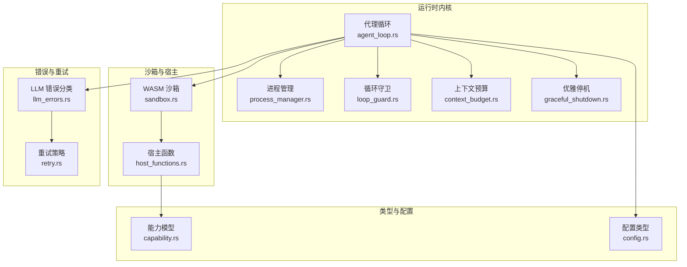
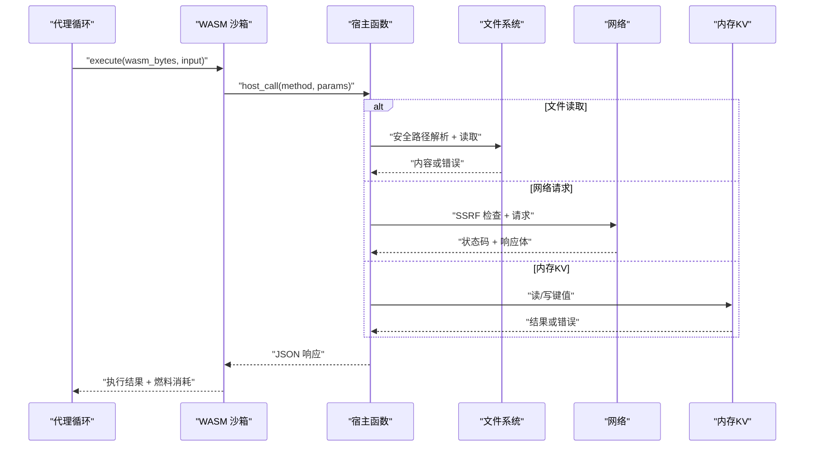
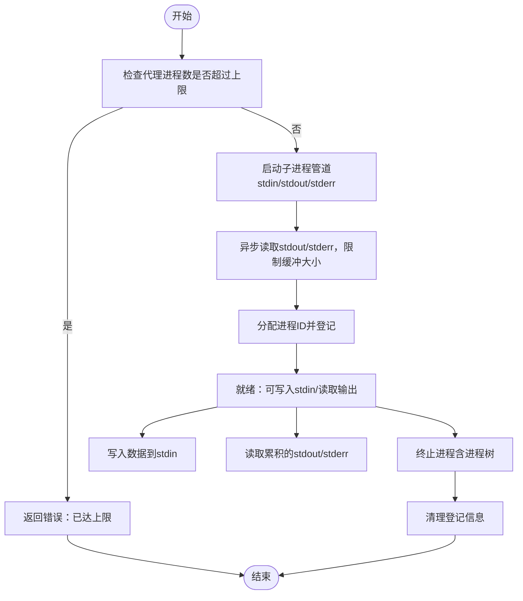
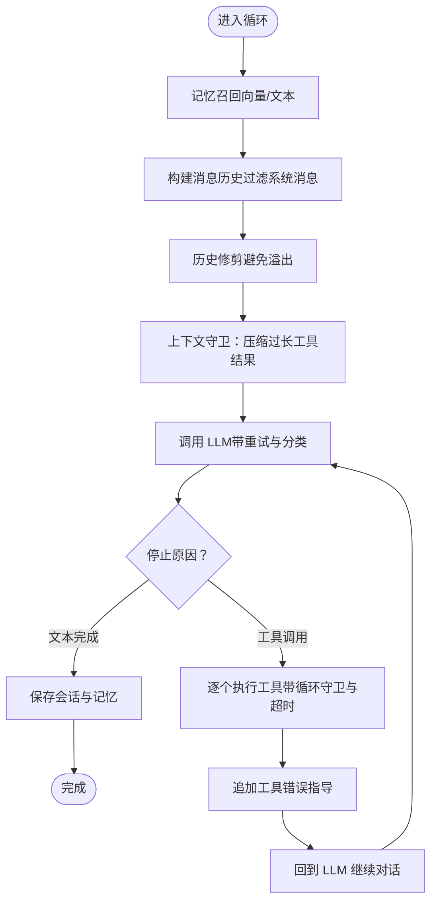
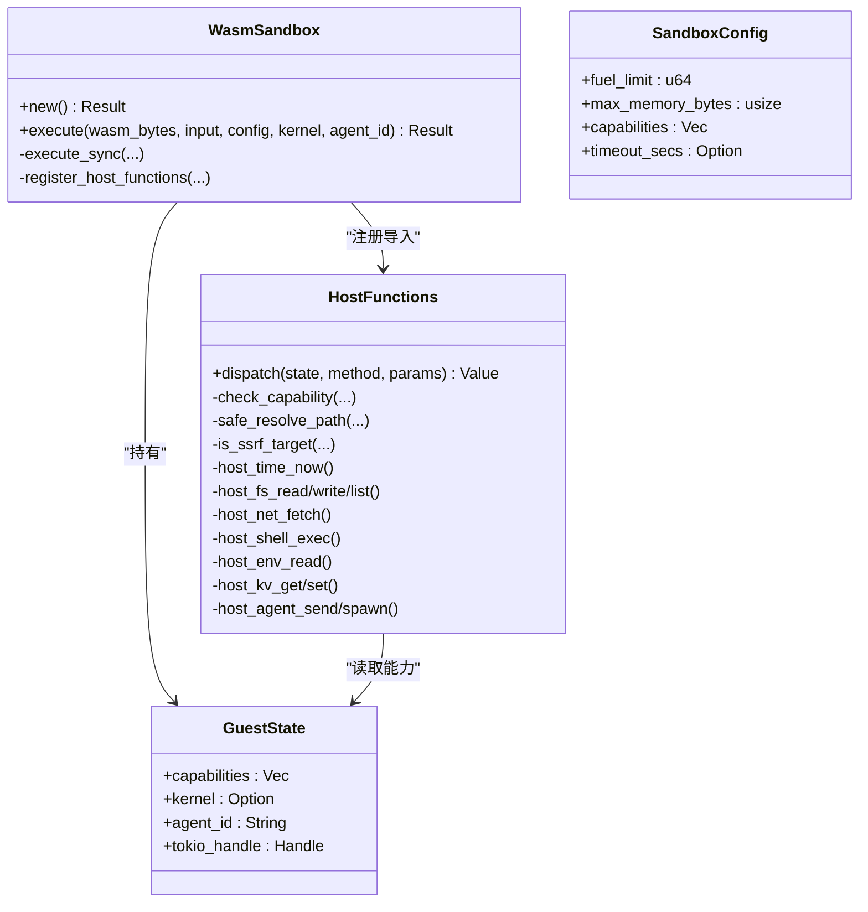
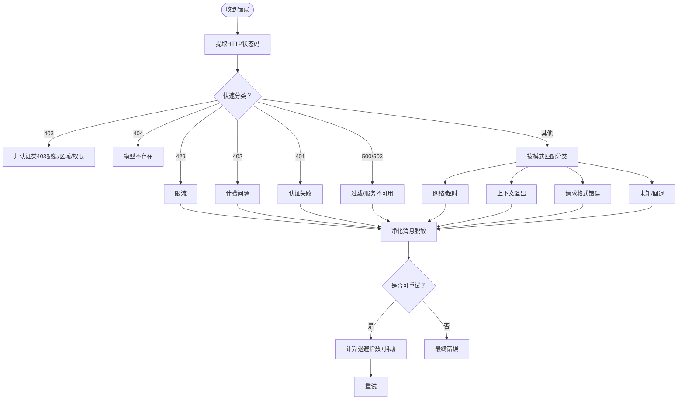
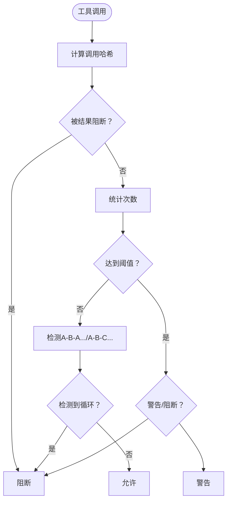
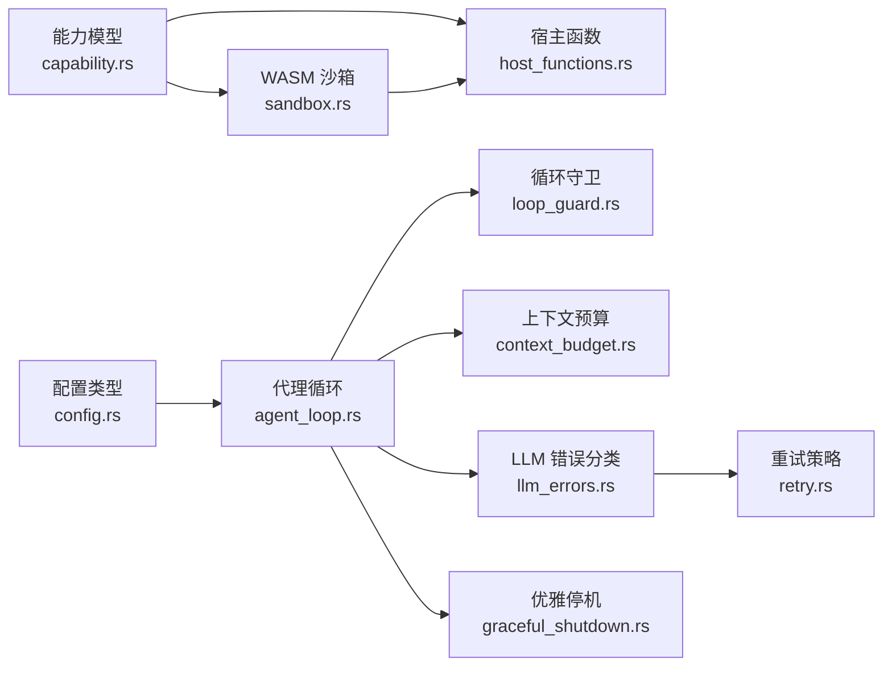

# Node.js 运行时

<cite>
**本文档引用的文件**
- [lib.rs](file://crates/openfang-runtime/src/lib.rs)
- [host_functions.rs](file://crates/openfang-runtime/src/host_functions.rs)
- [sandbox.rs](file://crates/openfang-runtime/src/sandbox.rs)
- [process_manager.rs](file://crates/openfang-runtime/src/process_manager.rs)
- [agent_loop.rs](file://crates/openfang-runtime/src/agent_loop.rs)
- [graceful_shutdown.rs](file://crates/openfang-runtime/src/graceful_shutdown.rs)
- [llm_errors.rs](file://crates/openfang-runtime/src/llm_errors.rs)
- [retry.rs](file://crates/openfang-runtime/src/retry.rs)
- [loop_guard.rs](file://crates/openfang-runtime/src/loop_guard.rs)
- [context_budget.rs](file://crates/openfang-runtime/src/context_budget.rs)
- [config.rs](file://crates/openfang-types/src/config.rs)
- [capability.rs](file://crates/openfang-types/src/capability.rs)
</cite>

## 目录
1. [简介](#简介)
2. [项目结构](#项目结构)
3. [核心组件](#核心组件)
4. [架构总览](#架构总览)
5. [详细组件分析](#详细组件分析)
6. [依赖关系分析](#依赖关系分析)
7. [性能考虑](#性能考虑)
8. [故障排除指南](#故障排除指南)
9. [结论](#结论)
10. [附录](#附录)

## 简介
本文件面向 OpenFang 的 Node.js 运行时（在该代码库中以 WASM 沙箱与能力控制系统为核心）进行技术文档整理，重点覆盖以下主题：
- 进程管理：持久化进程会话、输入输出读写、生命周期控制
- 事件循环处理：代理循环、工具调用、上下文预算与溢出恢复
- 内存监控机制：会话保存、记忆回溯、上下文压缩
- 与宿主函数的交互：能力检查、路径安全、SSRF 防护、网络请求
- API 接口设计：WASM 宿主调用协议、日志接口、错误分类与重试
- 数据序列化处理：JSON 请求/响应、内存读写边界校验
- 执行环境：WASM 引擎、燃料计量、时间片中断、沙箱隔离
- 模块加载与依赖管理：能力继承、工具注册、驱动抽象
- 安全限制：能力模型、路径遍历防护、SSRF 检测、Docker 沙箱
- 资源配额与超时控制：CPU 燃料、墙钟超时、循环守卫、速率限制
- 配置选项与性能调优：上下文窗口、重试策略、超时参数
- 错误处理策略：分类与净化、重试与退避、优雅停机
- 使用示例、开发模板与调试技巧：基于现有测试与配置的实践建议

## 项目结构
OpenFang Runtime 子系统围绕“代理循环 + 工具执行 + 沙箱隔离 + 能力控制”展开，关键模块如下：
- 进程管理：持久化子进程、标准流缓冲、清理与限额
- 代理循环：消息构建、记忆召回、LLM 调用、工具执行、会话保存
- 沙箱与宿主函数：WASM 引擎、能力检查、路径与网络安全、日志桥接
- 错误处理与重试：错误分类、净化、指数退避与抖动
- 资源与安全：循环守卫、上下文预算、优雅停机、速率限制

**图表来源**
- [agent_loop.rs:145-605](file://crates/openfang-runtime/src/agent_loop.rs#L145-L605)
- [process_manager.rs:56-255](file://crates/openfang-runtime/src/process_manager.rs#L56-L255)
- [loop_guard.rs:124-244](file://crates/openfang-runtime/src/loop_guard.rs#L124-L244)
- [context_budget.rs:23-50](file://crates/openfang-runtime/src/context_budget.rs#L23-L50)
- [sandbox.rs:94-143](file://crates/openfang-runtime/src/sandbox.rs#L94-L143)
- [host_functions.rs:16-49](file://crates/openfang-runtime/src/host_functions.rs#L16-L49)
- [llm_errors.rs:18-54](file://crates/openfang-runtime/src/llm_errors.rs#L18-L54)
- [retry.rs:16-41](file://crates/openfang-runtime/src/retry.rs#L16-L41)
- [graceful_shutdown.rs:84-95](file://crates/openfang-runtime/src/graceful_shutdown.rs#L84-L95)
- [capability.rs:12-72](file://crates/openfang-types/src/capability.rs#L12-L72)
- [config.rs:1-40](file://crates/openfang-types/src/config.rs#L1-L40)

**章节来源**
- [lib.rs:1-59](file://crates/openfang-runtime/src/lib.rs#L1-L59)

## 核心组件
- WASM 沙箱引擎：启用燃料计量与时间片中断，严格约束 CPU 与时间消耗
- 宿主函数能力检查：统一的权限门控，拒绝未授权操作
- 进程管理器：长时任务的 stdin/stdout/stderr 管理与限额控制
- 代理循环：消息历史、记忆召回、工具调用、会话保存与成本统计
- 循环守卫：检测重复/交替工具调用，防止死循环
- 上下文预算：动态裁剪工具结果，避免上下文溢出
- 错误分类与重试：对 LLM API 错误进行分类、净化与指数退避
- 优雅停机：有序关闭浏览器、MCP、后台任务与审计日志

**章节来源**
- [sandbox.rs:94-143](file://crates/openfang-runtime/src/sandbox.rs#L94-L143)
- [host_functions.rs:16-49](file://crates/openfang-runtime/src/host_functions.rs#L16-L49)
- [process_manager.rs:56-255](file://crates/openfang-runtime/src/process_manager.rs#L56-L255)
- [agent_loop.rs:145-605](file://crates/openfang-runtime/src/agent_loop.rs#L145-L605)
- [loop_guard.rs:124-244](file://crates/openfang-runtime/src/loop_guard.rs#L124-L244)
- [context_budget.rs:96-198](file://crates/openfang-runtime/src/context_budget.rs#L96-L198)
- [llm_errors.rs:18-54](file://crates/openfang-runtime/src/llm_errors.rs#L18-L54)
- [retry.rs:16-41](file://crates/openfang-runtime/src/retry.rs#L16-L41)
- [graceful_shutdown.rs:84-95](file://crates/openfang-runtime/src/graceful_shutdown.rs#L84-L95)

## 架构总览
WASM 沙箱通过能力模型实现最小权限原则，宿主函数在执行前进行能力检查；代理循环负责协调 LLM 与工具调用，并通过上下文预算与循环守卫保障稳定性。

**图表来源**
- [sandbox.rs:277-387](file://crates/openfang-runtime/src/sandbox.rs#L277-L387)
- [host_functions.rs:194-437](file://crates/openfang-runtime/src/host_functions.rs#L194-L437)

## 详细组件分析

### 进程管理器（持久化进程）
- 功能：启动/读写/杀死持久化子进程，维护 stdout/stderr 缓冲，按代理配额限制数量
- 关键点：最大并发限制、缓冲上限与滚动丢弃、进程树安全终止
- 典型场景：长期运行的 REPL、服务监听、文件监控

**图表来源**
- [process_manager.rs:67-255](file://crates/openfang-runtime/src/process_manager.rs#L67-L255)

**章节来源**
- [process_manager.rs:56-255](file://crates/openfang-runtime/src/process_manager.rs#L56-L255)

### 代理执行循环（Agent Loop）
- 功能：构建系统提示与用户消息，召回记忆，调用 LLM，执行工具，保存会话，统计令牌与成本
- 关键点：最大迭代次数、最大连续 MaxTokens、历史消息修剪、空响应保护、幻觉动作检测
- 钩子与回调：BeforePromptBuild、BeforeToolCall、AfterToolCall、AgentLoopEnd

**图表来源**
- [agent_loop.rs:145-605](file://crates/openfang-runtime/src/agent_loop.rs#L145-L605)
- [context_budget.rs:96-198](file://crates/openfang-runtime/src/context_budget.rs#L96-L198)
- [llm_errors.rs:241-392](file://crates/openfang-runtime/src/llm_errors.rs#L241-L392)

**章节来源**
- [agent_loop.rs:145-605](file://crates/openfang-runtime/src/agent_loop.rs#L145-L605)
- [context_budget.rs:96-198](file://crates/openfang-runtime/src/context_budget.rs#L96-L198)
- [llm_errors.rs:241-392](file://crates/openfang-runtime/src/llm_errors.rs#L241-L392)

### 沙箱与宿主函数（WASM 安全执行）
- 功能：编译/实例化 WASM，注入 host_call/host_log，执行 JSON 序列化与内存边界检查
- 关键点：fuel 与 epoch 中断、ABI 校验、能力检查、路径与 SSRF 防护
- 宿主方法：time_now、fs_*、net_fetch、shell_exec、env_read、kv_*、agent_*、未知方法错误

**图表来源**
- [sandbox.rs:33-92](file://crates/openfang-runtime/src/sandbox.rs#L33-L92)
- [sandbox.rs:94-143](file://crates/openfang-runtime/src/sandbox.rs#L94-L143)
- [host_functions.rs:16-49](file://crates/openfang-runtime/src/host_functions.rs#L16-L49)
- [host_functions.rs:55-67](file://crates/openfang-runtime/src/host_functions.rs#L55-L67)

**章节来源**
- [sandbox.rs:94-275](file://crates/openfang-runtime/src/sandbox.rs#L94-L275)
- [host_functions.rs:16-49](file://crates/openfang-runtime/src/host_functions.rs#L16-L49)

### 错误分类与重试（LLM 错误处理）
- 功能：将 LLM API 错误分类为限流、过载、超时、计费、认证、上下文溢出、格式、模型不存在等
- 关键点：状态码优先、模式匹配、HTML 错页识别、重试延时提取、净化与脱敏
- 重试策略：指数退避 + 抖动、最大尝试次数、可选 hint 延时

**图表来源**
- [llm_errors.rs:241-392](file://crates/openfang-runtime/src/llm_errors.rs#L241-L392)
- [retry.rs:123-202](file://crates/openfang-runtime/src/retry.rs#L123-L202)

**章节来源**
- [llm_errors.rs:18-54](file://crates/openfang-runtime/src/llm_errors.rs#L18-L54)
- [retry.rs:123-202](file://crates/openfang-runtime/src/retry.rs#L123-L202)

### 循环守卫（防死循环）
- 功能：检测相同工具/相同参数重复调用、相同结果重复返回、A-B-A-B 或 A-B-C 循环
- 关键点：SHA-256 哈希、结果哈希、轮询工具阈值放宽、全局电路 breaker、警告桶去噪
- 输出：允许、警告、阻断、电路 breaker

**图表来源**
- [loop_guard.rs:146-244](file://crates/openfang-runtime/src/loop_guard.rs#L146-L244)

**章节来源**
- [loop_guard.rs:124-244](file://crates/openfang-runtime/src/loop_guard.rs#L124-L244)

### 上下文预算与溢出恢复
- 功能：两层预算控制
  - 层1：单条工具结果字符上限（占上下文窗口 30%）
  - 层2：总工具结果头线（占 75%），按时间顺序压缩最旧结果
- 关键点：换行安全截断、多字节字符边界、可配置字符/令牌比率

**章节来源**
- [context_budget.rs:23-50](file://crates/openfang-runtime/src/context_budget.rs#L23-L50)
- [context_budget.rs:96-198](file://crates/openfang-runtime/src/context_budget.rs#L96-L198)

### 优雅停机
- 功能：有序关闭流程（停止接收新请求、广播停机、等待代理循环、关闭浏览器/MCP/后台、刷新审计、关闭数据库）
- 关键点：阶段化推进、超时控制、成功/失败记录、WebSocket 广播

**章节来源**
- [graceful_shutdown.rs:84-251](file://crates/openfang-runtime/src/graceful_shutdown.rs#L84-L251)

## 依赖关系分析

**图表来源**
- [config.rs:1-40](file://crates/openfang-types/src/config.rs#L1-L40)
- [capability.rs:12-72](file://crates/openfang-types/src/capability.rs#L12-L72)
- [host_functions.rs:16-49](file://crates/openfang-runtime/src/host_functions.rs#L16-L49)
- [sandbox.rs:94-143](file://crates/openfang-runtime/src/sandbox.rs#L94-L143)
- [agent_loop.rs:145-605](file://crates/openfang-runtime/src/agent_loop.rs#L145-L605)
- [loop_guard.rs:124-244](file://crates/openfang-runtime/src/loop_guard.rs#L124-L244)
- [context_budget.rs:96-198](file://crates/openfang-runtime/src/context_budget.rs#L96-L198)
- [llm_errors.rs:241-392](file://crates/openfang-runtime/src/llm_errors.rs#L241-L392)
- [retry.rs:123-202](file://crates/openfang-runtime/src/retry.rs#L123-L202)
- [graceful_shutdown.rs:84-251](file://crates/openfang-runtime/src/graceful_shutdown.rs#L84-L251)

**章节来源**
- [lib.rs:1-59](file://crates/openfang-runtime/src/lib.rs#L1-L59)

## 性能考虑
- 燃料与时间片：启用 Wasmtime 燃料计量与 epoch 中断，防止 CPU 瘫痪与无限循环
- 上下文预算：动态裁剪工具结果，降低 LLM 输入开销
- 重试退避：指数退避 + 抖动，缓解瞬时过载
- 进程池与缓冲：stdout/stderr 缓冲上限与滚动丢弃，避免内存膨胀
- 会话修剪：历史消息修剪与配对修复，减少无效令牌消耗

[本节为通用指导，无需具体文件引用]

## 故障排除指南
- LLM 错误分类与净化：根据分类采取重试/降级/提示用户
- 速率限制与过载：利用分类器建议延时，结合重试策略
- 认证失败：检查 API Key 配置与权限范围
- 上下文溢出：启用上下文预算与历史修剪
- 死循环/卡顿：启用循环守卫与全局电路 breaker
- 进程异常退出：检查进程树终止与缓冲溢出

**章节来源**
- [llm_errors.rs:241-392](file://crates/openfang-runtime/src/llm_errors.rs#L241-L392)
- [retry.rs:123-202](file://crates/openfang-runtime/src/retry.rs#L123-L202)
- [loop_guard.rs:146-244](file://crates/openfang-runtime/src/loop_guard.rs#L146-L244)
- [context_budget.rs:96-198](file://crates/openfang-runtime/src/context_budget.rs#L96-L198)
- [process_manager.rs:203-249](file://crates/openfang-runtime/src/process_manager.rs#L203-L249)

## 结论
OpenFang Runtime 通过“WASM 沙箱 + 能力模型 + 代理循环 + 上下文预算 + 循环守卫 + 错误分类与重试”的组合，实现了安全、可控、可观测的执行环境。其设计兼顾了安全性（路径/SSRF/能力检查）、稳定性（燃料/超时/电路 breaker）、可维护性（钩子/优雅停机）与可扩展性（模块化工具与驱动抽象）。

[本节为总结，无需具体文件引用]

## 附录

### 配置选项与调优要点
- 上下文窗口：依据模型能力设置，影响工具结果裁剪与总预算
- 重试策略：根据 LLM 错误类别调整最大尝试次数与退避参数
- 超时控制：WASM 时间片中断、工具执行超时、代理循环超时
- 进程配额：每代理最大进程数、超时清理策略
- 能力继承：父代理能力必须覆盖子代理能力，防止越权

**章节来源**
- [config.rs:1-40](file://crates/openfang-types/src/config.rs#L1-L40)
- [agent_loop.rs:34-49](file://crates/openfang-runtime/src/agent_loop.rs#L34-L49)
- [process_manager.rs:56-64](file://crates/openfang-runtime/src/process_manager.rs#L56-L64)
- [capability.rs:168-187](file://crates/openfang-types/src/capability.rs#L168-L187)

### 使用示例与开发模板
- 开发模板：参考沙箱测试用例（echo/proxy/无限循环），验证 host_call 与能力检查
- 调试技巧：利用 host_log 将 WASM 日志桥接到 Rust tracing；通过 LoopGuard 统计与 ping-pong 检测定位循环；使用优雅停机 API 观察阶段耗时

**章节来源**
- [sandbox.rs:390-607](file://crates/openfang-runtime/src/sandbox.rs#L390-L607)
- [loop_guard.rs:306-328](file://crates/openfang-runtime/src/loop_guard.rs#L306-L328)
- [graceful_shutdown.rs:190-251](file://crates/openfang-runtime/src/graceful_shutdown.rs#L190-L251)