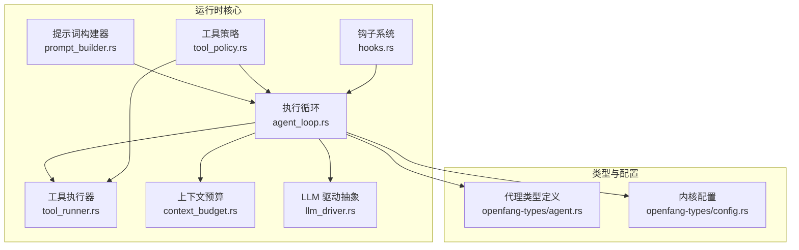
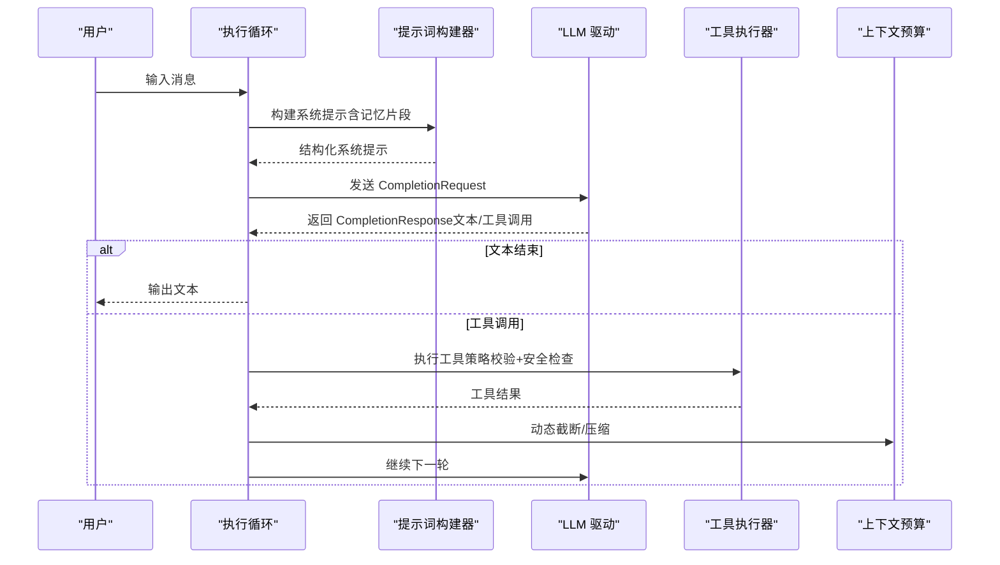
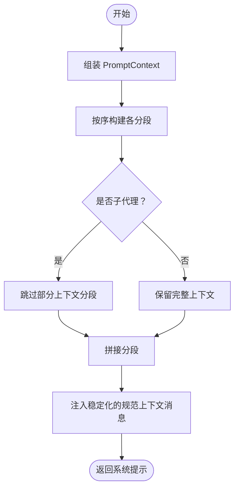
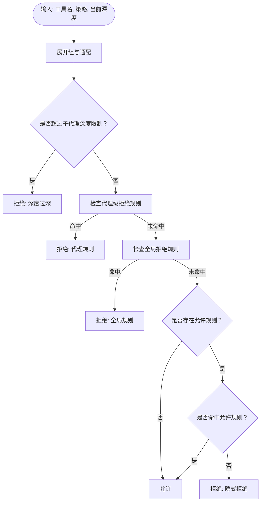
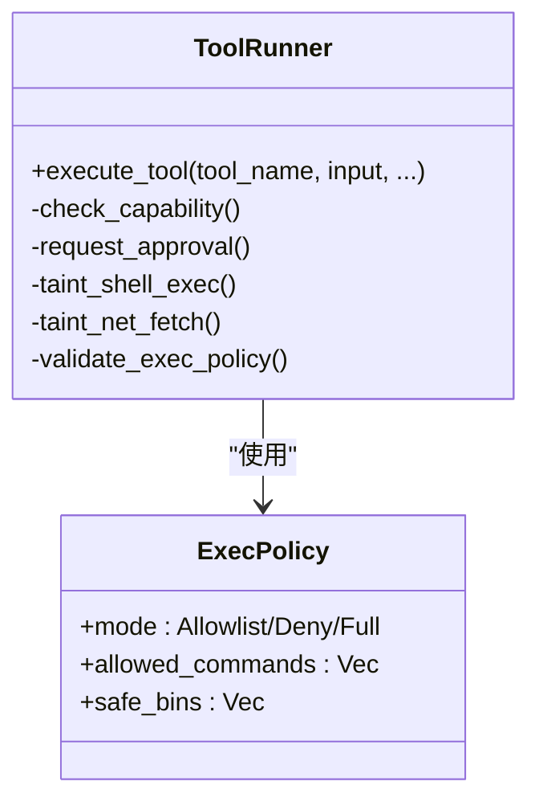
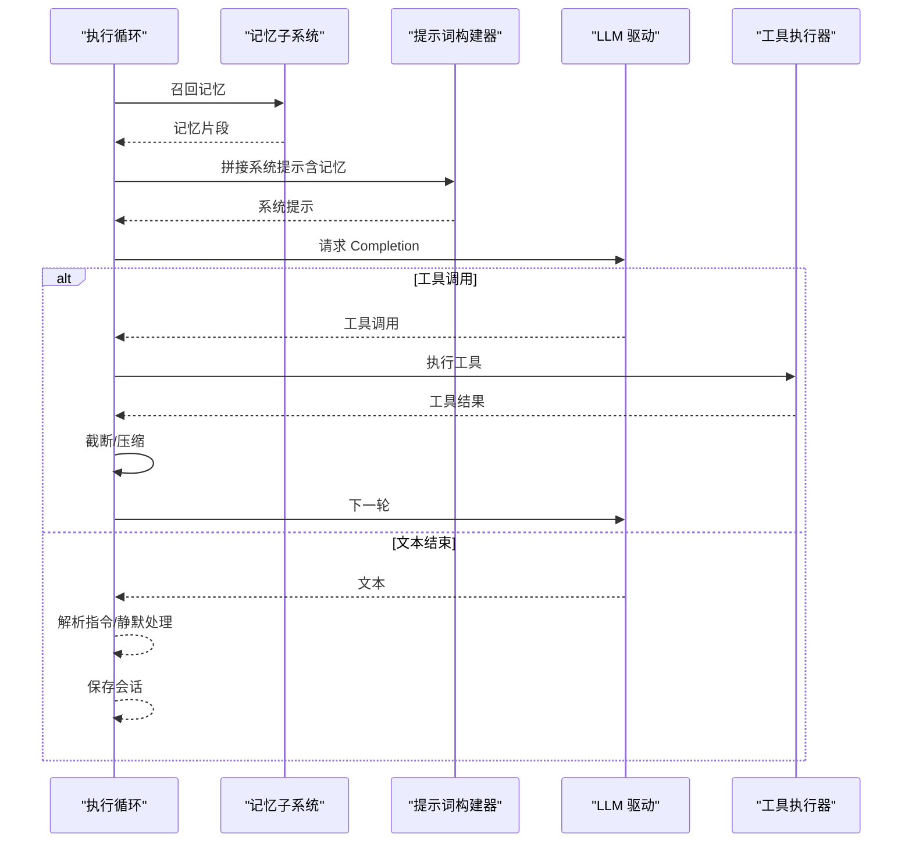
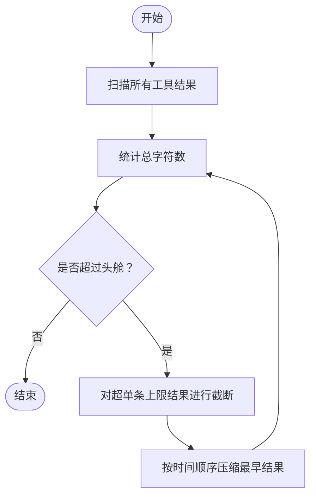
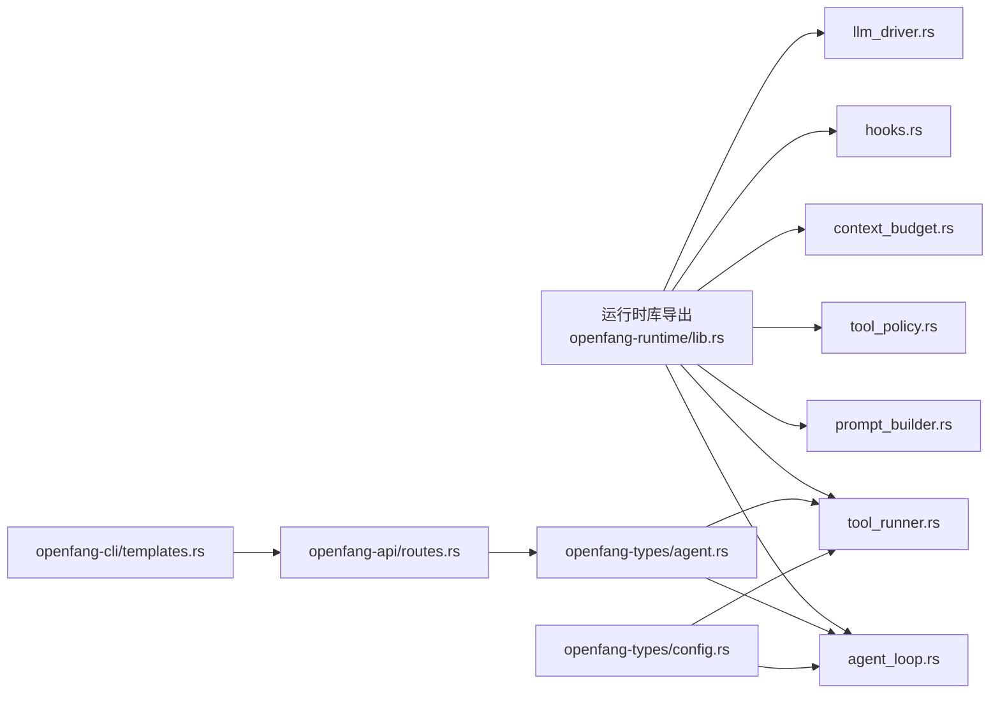

# PromptOnly 运行时

<cite>
**本文引用的文件**
- [lib.rs](file://crates/openfang-runtime/src/lib.rs)
- [prompt_builder.rs](file://crates/openfang-runtime/src/prompt_builder.rs)
- [agent_loop.rs](file://crates/openfang-runtime/src/agent_loop.rs)
- [tool_policy.rs](file://crates/openfang-runtime/src/tool_policy.rs)
- [tool_runner.rs](file://crates/openfang-runtime/src/tool_runner.rs)
- [context_budget.rs](file://crates/openfang-runtime/src/context_budget.rs)
- [llm_driver.rs](file://crates/openfang-runtime/src/llm_driver.rs)
- [hooks.rs](file://crates/openfang-runtime/src/hooks.rs)
- [agent.rs](file://crates/openfang-types/src/agent.rs)
- [config.rs](file://crates/openfang-types/src/config.rs)
- [routes.rs](file://crates/openfang-api/src/routes.rs)
- [templates.rs](file://crates/openfang-cli/src/templates.rs)
- [hello-world/agent.toml](file://agents/hello-world/agent.toml)
- [analyst/agent.toml](file://agents/analyst/agent.toml)
</cite>

## 目录
1. [简介](#简介)
2. [项目结构](#项目结构)
3. [核心组件](#核心组件)
4. [架构总览](#架构总览)
5. [详细组件分析](#详细组件分析)
6. [依赖关系分析](#依赖关系分析)
7. [性能考量](#性能考量)
8. [故障排查指南](#故障排查指南)
9. [结论](#结论)
10. [附录](#附录)

## 简介
本文件面向 OpenFang 的 PromptOnly 运行时，系统化阐述“纯提示词驱动”的智能体执行模式：如何通过可组合的系统提示（System Prompt）与工具策略，实现无需外部插件或复杂编排的稳定执行；如何在不引入额外工具的前提下完成信息检索、记忆调用与多轮对话；以及在保证安全与成本可控的同时，最大化提示词工程的收益。文档同时覆盖上下文构建机制、工具策略应用、运行时配置与性能调优、成本控制策略，并提供开发指南与最佳实践。

## 项目结构
OpenFang 将 PromptOnly 运行时能力集中在运行时子模块中，围绕以下关键模块协同工作：
- 提示词构建器：集中生成结构化系统提示，支持跨渠道、跨身份、跨技能注入。
- 执行循环：统一的工具调用循环，负责 LLM 调用、工具执行、结果截断与上下文管理。
- 工具策略：基于规则的访问控制与深度限制，确保安全与稳定性。
- 上下文预算：动态预算与压缩策略，避免超上下文与昂贵输出。
- 钩子系统：在关键节点进行拦截与扩展，支持安全与审计。
- 类型与配置：标准化的代理清单、执行策略与全局配置。

图表来源
- [prompt_builder.rs:64-206](file://crates/openfang-runtime/src/prompt_builder.rs#L64-L206)
- [agent_loop.rs:145-167](file://crates/openfang-runtime/src/agent_loop.rs#L145-L167)
- [tool_policy.rs:76-145](file://crates/openfang-runtime/src/tool_policy.rs#L76-L145)
- [tool_runner.rs:99-117](file://crates/openfang-runtime/src/tool_runner.rs#L99-L117)
- [context_budget.rs:23-56](file://crates/openfang-runtime/src/context_budget.rs#L23-L56)
- [hooks.rs:14-33](file://crates/openfang-runtime/src/hooks.rs#L14-L33)
- [llm_driver.rs:52-81](file://crates/openfang-runtime/src/llm_driver.rs#L52-L81)
- [agent.rs:424-530](file://crates/openfang-types/src/agent.rs#L424-L530)
- [config.rs:785-800](file://crates/openfang-types/src/config.rs#L785-L800)

章节来源
- [lib.rs:1-59](file://crates/openfang-runtime/src/lib.rs#L1-L59)

## 核心组件
- 提示词构建器（PromptBuilder）
  - 将代理身份、工具行为、记忆协议、技能摘要、MCP 概要、用户画像、通道特性、同侪代理、安全与操作指南等分段有序拼装，支持子代理模式下的节流与稳定性优化。
  - 关键点：分段构建、容量控制、代码块剥离、时间戳注入、通道格式提示、同侪代理可见性、首启协议注入。
- 执行循环（AgentLoop）
  - 统一的工具调用循环：记忆召回、系统提示拼接、消息历史修剪、LLM 请求、工具调用、结果截断、错误引导注入、幻觉检测与重试、会话持久化。
  - 关键点：最大迭代次数、最大连续 MaxTokens、历史消息上限、上下文溢出恢复、动态预算截断、循环守卫（LoopGuard）、钩子事件。
- 工具策略（ToolPolicy）
  - 多层访问控制：代理级规则优先于全局规则，显式拒绝优先于允许；支持通配与组展开；子代理深度限制与叶子节点限制。
  - 关键点：拒绝优先、组展开、深度限制、隐式拒绝。
- 工具执行器（ToolRunner）
  - 内置工具集与安全校验：文件系统、网络抓取、浏览器自动化、进程管理、Docker 沙箱、TTS/STT、手（Hand）工具等；执行前能力校验、审批门禁、环境变量白名单、策略与污点检查。
  - 关键点：能力白名单、审批请求、命令白名单、污点检查（Shell/网络）、浏览器 URL 污点检查。
- 上下文预算（ContextBudget）
  - 两层动态预算：单结果字符上限（占上下文窗口 30%）、总量头舱（占 75%）；扫描所有工具结果并按时间顺序压缩，保障长对话与大结果场景的稳定性。
  - 关键点：字符换算、逐条截断、总量压缩、边界安全。
- 钩子系统（Hooks）
  - 四类事件：BeforeToolCall（可阻断）、AfterToolCall（仅观察）、BeforePromptBuild（仅观察）、AgentLoopEnd（仅观察），用于安全拦截与审计。
  - 关键点：线程安全回调、事件载荷、阻断语义。
- LLM 驱动抽象（LlmDriver）
  - 统一的 CompletionRequest/CompletionResponse 抽象，支持流式事件与非流式响应；错误分类与重试策略。
  - 关键点：文本提取、内容判定、流事件映射。

章节来源
- [prompt_builder.rs:64-206](file://crates/openfang-runtime/src/prompt_builder.rs#L64-L206)
- [agent_loop.rs:145-605](file://crates/openfang-runtime/src/agent_loop.rs#L145-L605)
- [tool_policy.rs:76-145](file://crates/openfang-runtime/src/tool_policy.rs#L76-L145)
- [tool_runner.rs:99-526](file://crates/openfang-runtime/src/tool_runner.rs#L99-L526)
- [context_budget.rs:23-198](file://crates/openfang-runtime/src/context_budget.rs#L23-L198)
- [hooks.rs:14-33](file://crates/openfang-runtime/src/hooks.rs#L14-L33)
- [llm_driver.rs:52-107](file://crates/openfang-runtime/src/llm_driver.rs#L52-L107)

## 架构总览
PromptOnly 模式强调“以提示词为主、工具为辅”的执行路径。系统通过提示词构建器稳定化系统提示，结合上下文预算与循环守卫，确保在无工具或少量工具场景下的高吞吐与低开销；同时通过工具策略与工具执行器的安全校验，保障在需要工具时的最小权限与风险控制。

图表来源
- [agent_loop.rs:224-250](file://crates/openfang-runtime/src/agent_loop.rs#L224-L250)
- [prompt_builder.rs:69-206](file://crates/openfang-runtime/src/prompt_builder.rs#L69-L206)
- [llm_driver.rs:146-171](file://crates/openfang-runtime/src/llm_driver.rs#L146-L171)
- [tool_runner.rs:99-117](file://crates/openfang-runtime/src/tool_runner.rs#L99-L117)
- [context_budget.rs:100-198](file://crates/openfang-runtime/src/context_budget.rs#L100-L198)

## 详细组件分析

### 提示词构建器（PromptOnly 的核心）
- 分段构建与条件注入
  - 身份与描述、当前日期、工具行为、行为准则、可用工具、记忆协议、技能摘要、MCP 概要、身份文件、心跳清单、用户画像、通道特性、发送者身份、同侪代理、安全与操作指南、首启协议、工作区上下文等。
  - 子代理模式下跳过部分上下文以降低冗余与提升稳定性。
- 变量替换与格式化
  - 通道特性根据平台注入字符长度限制与格式建议；时间戳注入 Temporal Awareness；代码块剥离避免模型误读命令示例。
- 模板系统与可测试性
  - 通过结构化字段与固定分隔符，形成可测试的提示模板，便于回归与一致性验证。

图表来源
- [prompt_builder.rs:69-206](file://crates/openfang-runtime/src/prompt_builder.rs#L69-L206)
- [prompt_builder.rs:277-285](file://crates/openfang-runtime/src/prompt_builder.rs#L277-L285)

章节来源
- [prompt_builder.rs:7-62](file://crates/openfang-runtime/src/prompt_builder.rs#L7-L62)
- [prompt_builder.rs:69-206](file://crates/openfang-runtime/src/prompt_builder.rs#L69-L206)
- [prompt_builder.rs:277-285](file://crates/openfang-runtime/src/prompt_builder.rs#L277-L285)

### 工具策略（安全与治理）
- 规则优先级
  - 代理级规则优先于全局规则；拒绝优先于允许；存在允许规则时，未命中允许即隐式拒绝。
- 组展开与通配
  - 支持组名（@group）与通配符（*）匹配；组工具列表自动展开为具体工具名。
- 深度限制
  - 子代理最大深度与并发数限制；叶子节点进一步收紧关键工具（如 agent_spawn/agent_kill）。
- 典型场景
  - 仅允许 web_* 工具但拒绝 shell_exec；通过组展开批量授权；限制子代理递归深度防止滥用。

图表来源
- [tool_policy.rs:76-145](file://crates/openfang-runtime/src/tool_policy.rs#L76-L145)
- [tool_policy.rs:254-275](file://crates/openfang-runtime/src/tool_policy.rs#L254-L275)

章节来源
- [tool_policy.rs:18-50](file://crates/openfang-runtime/src/tool_policy.rs#L18-L50)
- [tool_policy.rs:76-145](file://crates/openfang-runtime/src/tool_policy.rs#L76-L145)
- [tool_policy.rs:254-275](file://crates/openfang-runtime/src/tool_policy.rs#L254-L275)

### 工具执行器（PromptOnly 场景下的最小工具集）
- 能力白名单
  - 仅允许在 allowed_tools 列表中的工具执行，防止模型幻觉调用未授权工具。
- 审批门禁
  - 对需人工审批的工具，先请求审批再执行；拒绝或超时则阻断。
- 安全检查
  - Shell 命令元字符注入检测；网络抓取 URL 污点检查（密钥、令牌、PII）；浏览器 URL 污点检查。
- 执行策略
  - 基于 ExecPolicy 的命令白名单；Full 模式跳过启发式污点检查（谨慎使用）。
- 典型工具（PromptOnly 常用）
  - web_search/web_fetch（信息检索与内容抽取）、memory_recall/memory_store（记忆检索与存储）、file_read/file_list（文件系统只读）、agent_list（同侪发现）。

图表来源
- [tool_runner.rs:99-117](file://crates/openfang-runtime/src/tool_runner.rs#L99-L117)
- [tool_runner.rs:213-266](file://crates/openfang-runtime/src/tool_runner.rs#L213-L266)
- [tool_runner.rs:451-512](file://crates/openfang-runtime/src/tool_runner.rs#L451-L512)
- [config.rs:785-800](file://crates/openfang-types/src/config.rs#L785-L800)

章节来源
- [tool_runner.rs:99-117](file://crates/openfang-runtime/src/tool_runner.rs#L99-L117)
- [tool_runner.rs:136-171](file://crates/openfang-runtime/src/tool_runner.rs#L136-L171)
- [tool_runner.rs:213-266](file://crates/openfang-runtime/src/tool_runner.rs#L213-L266)
- [tool_runner.rs:451-512](file://crates/openfang-runtime/src/tool_runner.rs#L451-L512)
- [config.rs:785-800](file://crates/openfang-types/src/config.rs#L785-L800)

### 执行循环（PromptOnly 的主流程）
- 记忆召回与系统提示拼接
  - 向量相似度召回（若嵌入驱动可用）；将召回的记忆片段追加到系统提示中。
- 消息历史与图像处理
  - 用户消息进入会话；图像块在发送给 LLM 前剥离以减少上下文膨胀。
- 规则与预算
  - 循环守卫（LoopGuard）防止无限工具链；上下文预算动态截断工具结果；历史消息上限保护。
- 幻觉检测与重试
  - 若模型声称执行动作但未调用工具，触发重提示；对空响应进行一次静默失败重试。
- 输出与指令解析
  - 解析回复指令（如静默、线程切换等）；NO_REPLY 特殊处理。

图表来源
- [agent_loop.rs:177-222](file://crates/openfang-runtime/src/agent_loop.rs#L177-L222)
- [agent_loop.rs:239-250](file://crates/openfang-runtime/src/agent_loop.rs#L239-L250)
- [agent_loop.rs:347-390](file://crates/openfang-runtime/src/agent_loop.rs#L347-L390)
- [agent_loop.rs:606-786](file://crates/openfang-runtime/src/agent_loop.rs#L606-L786)

章节来源
- [agent_loop.rs:177-222](file://crates/openfang-runtime/src/agent_loop.rs#L177-L222)
- [agent_loop.rs:239-250](file://crates/openfang-runtime/src/agent_loop.rs#L239-L250)
- [agent_loop.rs:347-390](file://crates/openfang-runtime/src/agent_loop.rs#L347-L390)
- [agent_loop.rs:606-786](file://crates/openfang-runtime/src/agent_loop.rs#L606-L786)

### 上下文预算（PromptOnly 的成本与稳定性保障）
- 两层预算
  - 单结果上限：占上下文窗口 30%；单次结果绝对上限：占 50%。
  - 总工具结果头舱：占上下文窗口 75%；超过后按时间顺序压缩最早结果。
- 边界安全
  - 字符边界安全截断；优先在换行处断开；多字节字符（中文/Emoji）安全处理。
- 测试覆盖
  - 包含小模型预算、超短预算、多字节字符、压缩逻辑等测试用例。

图表来源
- [context_budget.rs:100-198](file://crates/openfang-runtime/src/context_budget.rs#L100-L198)
- [context_budget.rs:200-226](file://crates/openfang-runtime/src/context_budget.rs#L200-L226)

章节来源
- [context_budget.rs:23-56](file://crates/openfang-runtime/src/context_budget.rs#L23-L56)
- [context_budget.rs:100-198](file://crates/openfang-runtime/src/context_budget.rs#L100-L198)
- [context_budget.rs:200-226](file://crates/openfang-runtime/src/context_budget.rs#L200-L226)

### 钩子系统（扩展与审计）
- 事件类型
  - BeforeToolCall（可阻断）、AfterToolCall（仅观察）、BeforePromptBuild（仅观察）、AgentLoopEnd（仅观察）。
- 使用场景
  - 在工具调用前进行二次拦截；在系统提示构建前注入观测；在循环结束后进行审计与统计。

章节来源
- [hooks.rs:14-33](file://crates/openfang-runtime/src/hooks.rs#L14-L33)

## 依赖关系分析
- 运行时模块导出
  - 运行时库统一导出核心模块，便于上层 API 与内核集成。
- 类型与配置
  - 代理清单（AgentManifest）定义了模型、资源、能力、工具配置、执行策略等；内核配置（ExecPolicy、ChannelOverrides 等）影响运行时行为。
- API 与 CLI
  - API 路由支持从模板生成代理清单；CLI 模板发现与选择用于快速部署 PromptOnly 代理。

图表来源
- [lib.rs:10-59](file://crates/openfang-runtime/src/lib.rs#L10-L59)
- [agent.rs:424-530](file://crates/openfang-types/src/agent.rs#L424-L530)
- [config.rs:785-800](file://crates/openfang-types/src/config.rs#L785-L800)
- [routes.rs:45-70](file://crates/openfang-api/src/routes.rs#L45-L70)
- [templates.rs:19-111](file://crates/openfang-cli/src/templates.rs#L19-L111)

章节来源
- [lib.rs:10-59](file://crates/openfang-runtime/src/lib.rs#L10-L59)
- [agent.rs:424-530](file://crates/openfang-types/src/agent.rs#L424-L530)
- [config.rs:785-800](file://crates/openfang-types/src/config.rs#L785-L800)
- [routes.rs:45-70](file://crates/openfang-api/src/routes.rs#L45-L70)
- [templates.rs:19-111](file://crates/openfang-cli/src/templates.rs#L19-L111)

## 性能考量
- 上下文窗口与截断
  - 通过动态预算与压缩，避免超上下文导致的失败与重试；合理设置 max_tokens 与 context_window_tokens。
- 工具调用与循环守卫
  - 严格限制工具调用次数与循环深度，防止“工具风暴”；对空响应与幻觉动作进行快速止损。
- 记忆与向量化召回
  - 向量化召回优于文本搜索，显著降低无关上下文；注意记忆数量与长度的上限。
- 成本控制
  - 通过资源配额（max_llm_tokens_per_hour、max_cost_*）与模型路由（简单/中等/复杂模型）降低总体成本。
- 缓存与稳定性
  - 将规范上下文作为用户消息注入，保持系统提示稳定以启用供应商缓存（如 Anthropic cache_control）。

章节来源
- [agent_loop.rs:342-345](file://crates/openfang-runtime/src/agent_loop.rs#L342-L345)
- [context_budget.rs:23-56](file://crates/openfang-runtime/src/context_budget.rs#L23-L56)
- [agent.rs:248-282](file://crates/openfang-types/src/agent.rs#L248-L282)
- [agent.rs:41-67](file://crates/openfang-types/src/agent.rs#L41-L67)

## 故障排查指南
- 幻觉动作与空响应
  - 现象：模型声称执行动作但未调用工具；或返回空文本。
  - 处理：启用幻觉检测重提示；对首次空响应进行一次静默重试；必要时增加系统提示明确禁止空响应。
- 工具调用被阻断
  - 现象：BeforeToolCall 钩子返回阻断原因；或工具不在 allowed_tools 中。
  - 处理：检查工具策略与能力白名单；确认审批门禁状态；调整 exec_policy 或允许列表。
- 上下文溢出
  - 现象：消息过多导致超上下文；工具结果过大。
  - 处理：启用上下文预算与压缩；减少一次性注入的记忆数量；缩短工具结果。
- 网络与 Shell 安全检查失败
  - 现象：URL 包含密钥、Shell 命令包含元字符。
  - 处理：修正输入参数；在 Full 模式下谨慎放行；使用允许列表策略。

章节来源
- [agent_loop.rs:498-514](file://crates/openfang-runtime/src/agent_loop.rs#L498-L514)
- [agent_loop.rs:454-478](file://crates/openfang-runtime/src/agent_loop.rs#L454-L478)
- [tool_runner.rs:213-266](file://crates/openfang-runtime/src/tool_runner.rs#L213-L266)
- [tool_runner.rs:50-75](file://crates/openfang-runtime/src/tool_runner.rs#L50-L75)
- [context_budget.rs:100-198](file://crates/openfang-runtime/src/context_budget.rs#L100-L198)

## 结论
PromptOnly 运行时通过“稳定系统提示 + 最小工具集 + 严格策略 + 动态预算”的组合，在不引入复杂编排的前提下实现了高稳定性与可控成本。提示词构建器确保上下文的一致性与可测试性；工具策略与执行器保障安全；执行循环与上下文预算维持性能与成本平衡。该模式特别适用于“信息检索 + 记忆 + 简单工具”的场景，既满足业务需求，又降低复杂度与风险。

## 附录

### PromptOnly 适用场景
- 信息检索与总结：web_search/web_fetch + memory_recall/memory_store。
- 问答与知识服务：仅依赖系统提示与记忆，无需复杂工具。
- 低风险自动化：最小权限工具集，配合审批与钩子拦截。

### 性能优势
- 稳定的系统提示可利用供应商缓存，降低重复计算。
- 动态预算与压缩减少上下文膨胀，提高吞吐。
- 工具调用最小化，降低 API 调用与执行成本。

### 局限性分析
- 工具能力受限：仅适合不需要复杂外部交互的任务。
- 依赖提示词质量：复杂任务可能需要更精细的提示词工程。
- 审批与策略约束：在需要快速决策的场景可能带来延迟。

### 提示词构建器工作原理
- 分段构建：按固定顺序拼接身份、工具、记忆、技能、MCP、身份文件、心跳、用户画像、通道、发送者、同侪代理、安全、操作指南、首启协议、工作区上下文等。
- 条件注入：子代理模式跳过部分上下文；通道特性注入格式与长度限制；时间戳注入 Temporal Awareness。
- 可测试性：通过结构化字段与固定分隔符，便于单元测试与回归。

章节来源
- [prompt_builder.rs:69-206](file://crates/openfang-runtime/src/prompt_builder.rs#L69-L206)
- [prompt_builder.rs:399-442](file://crates/openfang-runtime/src/prompt_builder.rs#L399-L442)

### 工具策略配置方法与执行规则
- 配置入口：AgentManifest 的 tool_allowlist/tool_blocklist/exec_policy；全局配置中的 ExecPolicy。
- 执行规则：代理级规则优先；拒绝优先；存在允许规则时未命中即隐式拒绝；支持组展开与通配。
- 安全检查：子代理深度限制；叶子节点工具限制；Shell/网络污点检查。

章节来源
- [agent.rs:487-494](file://crates/openfang-types/src/agent.rs#L487-L494)
- [config.rs:785-800](file://crates/openfang-types/src/config.rs#L785-L800)
- [tool_policy.rs:76-145](file://crates/openfang-runtime/src/tool_policy.rs#L76-L145)
- [tool_runner.rs:213-266](file://crates/openfang-runtime/src/tool_runner.rs#L213-L266)

### PromptOnly 运行时配置选项与调优
- 模型与系统提示
  - model.system_prompt：自定义系统提示；支持多行与模板注入。
  - fallback_models：备用模型链路，提升可用性。
- 资源配额
  - resources.max_llm_tokens_per_hour、max_cost_*：限制成本与用量。
- 执行策略
  - exec_policy：Allowlist/Deny/Full；allowed_commands、safe_bins 控制命令范围。
- 代理模板与部署
  - CLI 模板发现与选择；API 模板加载与生成。

章节来源
- [agent.rs:370-403](file://crates/openfang-types/src/agent.rs#L370-L403)
- [agent.rs:416-494](file://crates/openfang-types/src/agent.rs#L416-L494)
- [agent.rs:248-282](file://crates/openfang-types/src/agent.rs#L248-L282)
- [config.rs:785-800](file://crates/openfang-types/src/config.rs#L785-L800)
- [routes.rs:45-70](file://crates/openfang-api/src/routes.rs#L45-L70)
- [templates.rs:19-111](file://crates/openfang-cli/src/templates.rs#L19-L111)
- [hello-world/agent.toml:7-29](file://agents/hello-world/agent.toml#L7-L29)
- [analyst/agent.toml:7-50](file://agents/analyst/agent.toml#L7-L50)

### 开发指南与最佳实践
- 提示词工程
  - 明确角色与目标；分层注入上下文；为不同通道定制格式提示；使用时间戳增强 Temporal Awareness。
- 工具策略
  - 采用最小权限原则；优先使用允许列表；为子代理设置深度限制；定期审计策略命中情况。
- 成本控制
  - 合理设置 max_tokens 与 context_window_tokens；使用资源配额；启用模型路由；利用缓存。
- 安全与审计
  - 在 BeforeToolCall 钩子中进行二次拦截；启用审批门禁；记录 AfterToolCall 与 AgentLoopEnd 事件。
- 模板与部署
  - 使用 CLI 模板快速生成代理；通过 API 加载模板；在生产环境启用热重载与监控。

章节来源
- [hooks.rs:14-33](file://crates/openfang-runtime/src/hooks.rs#L14-L33)
- [agent_loop.rs:177-222](file://crates/openfang-runtime/src/agent_loop.rs#L177-L222)
- [agent.rs:248-282](file://crates/openfang-types/src/agent.rs#L248-L282)
- [templates.rs:19-111](file://crates/openfang-cli/src/templates.rs#L19-L111)
- [routes.rs:45-70](file://crates/openfang-api/src/routes.rs#L45-L70)