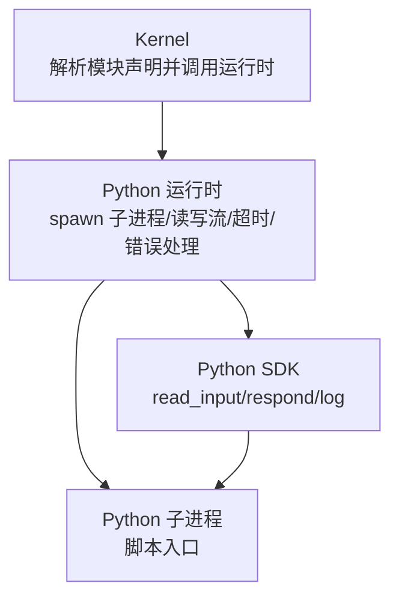
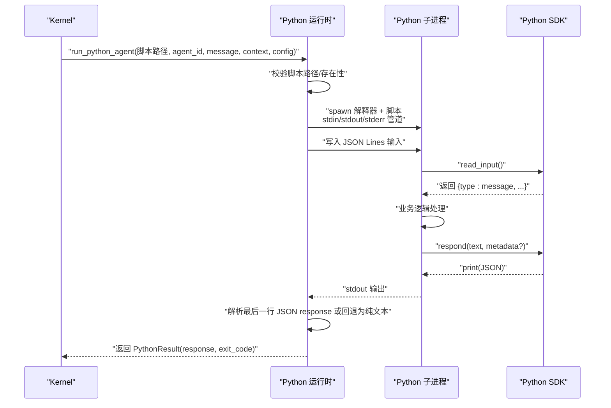
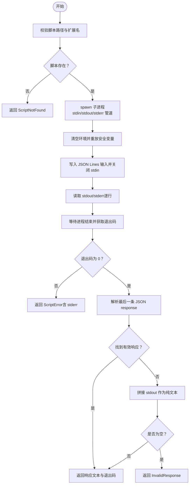
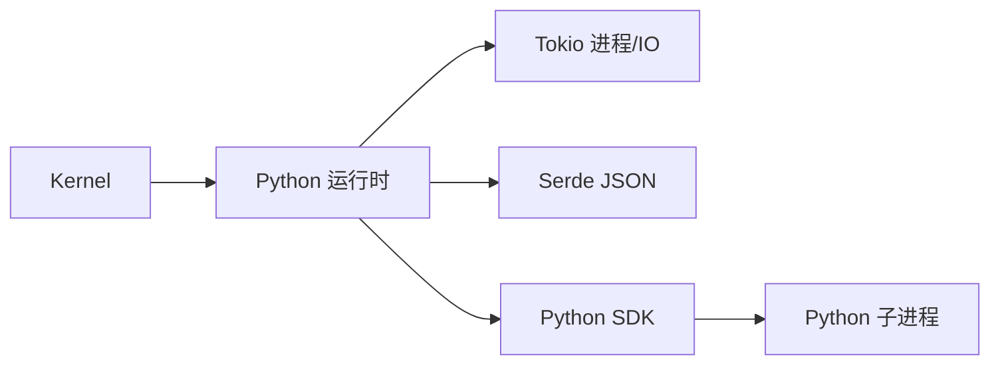

# Python 运行时

<cite>
**本文引用的文件**
- [crates/openfang-runtime/src/python_runtime.rs](file://crates/openfang-runtime/src/python_runtime.rs)
- [sdk/python/openfang_sdk.py](file://sdk/python/openfang_sdk.py)
- [sdk/python/examples/echo_agent.py](file://sdk/python/examples/echo_agent.py)
- [crates/openfang-kernel/src/kernel.rs](file://crates/openfang-kernel/src/kernel.rs)
- [crates/openfang-runtime/src/subprocess_sandbox.rs](file://crates/openfang-runtime/src/subprocess_sandbox.rs)
- [crates/openfang-types/src/config.rs](file://crates/openfang-types/src/config.rs)
</cite>

## 目录
1. [简介](#简介)
2. [项目结构](#项目结构)
3. [核心组件](#核心组件)
4. [架构总览](#架构总览)
5. [详细组件分析](#详细组件分析)
6. [依赖关系分析](#依赖关系分析)
7. [性能考量](#性能考量)
8. [故障排除指南](#故障排除指南)
9. [结论](#结论)
10. [附录](#附录)

## 简介
本文件面向 OpenFang 的 Python 运行时，系统性阐述其子进程管理机制、进程生命周期控制、环境变量安全处理、协议通信（stdin/stdout JSON Lines）规范、输入输出格式、错误处理策略、配置项（解释器路径、超时、工作目录、允许的环境变量），以及安全机制（路径验证、环境清理、权限控制）。同时提供使用示例、调试技巧、性能优化建议与常见问题排查。

## 项目结构
- Rust 运行时模块负责启动 Python 子进程、构建输入、读取输出、超时与错误处理，并进行严格的安全隔离。
- Python SDK 提供协议读写与装饰器式开发框架，简化消息读取、响应发送与日志输出。
- Kernel 将“python:”模块声明路由到运行时执行，并注入上下文与配置。

图表来源
- [crates/openfang-kernel/src/kernel.rs:2190-2227](file://crates/openfang-kernel/src/kernel.rs#L2190-L2227)
- [crates/openfang-runtime/src/python_runtime.rs:119-313](file://crates/openfang-runtime/src/python_runtime.rs#L119-L313)
- [sdk/python/openfang_sdk.py:31-57](file://sdk/python/openfang_sdk.py#L31-L57)

章节来源
- [crates/openfang-kernel/src/kernel.rs:2190-2227](file://crates/openfang-kernel/src/kernel.rs#L2190-L2227)
- [crates/openfang-runtime/src/python_runtime.rs:119-313](file://crates/openfang-runtime/src/python_runtime.rs#L119-L313)
- [sdk/python/openfang_sdk.py:31-57](file://sdk/python/openfang_sdk.py#L31-L57)

## 核心组件
- Python 运行时（Rust）
  - 负责：校验脚本路径、查找解释器、spawn 子进程、构造 JSON Lines 输入、读取 stdout/stderr、解析响应、超时与退出码处理、错误分类与返回。
  - 关键类型：PythonConfig、PythonResult、PythonError；关键函数：run_python_agent、validate_script_path、parse_python_output、find_python_interpreter。
- Python SDK（Python）
  - 负责：从 stdin 读取 JSON 输入、向 stdout 输出 JSON 响应、向 stderr 写日志、提供装饰器 Agent 框架。
  - 关键函数：read_input、respond、log、Agent.run。
- Kernel（Rust）
  - 负责：识别模块字符串“python:”，解析脚本路径，组装上下文，调用运行时执行。

章节来源
- [crates/openfang-runtime/src/python_runtime.rs:27-77](file://crates/openfang-runtime/src/python_runtime.rs#L27-L77)
- [crates/openfang-runtime/src/python_runtime.rs:119-313](file://crates/openfang-runtime/src/python_runtime.rs#L119-L313)
- [sdk/python/openfang_sdk.py:31-130](file://sdk/python/openfang_sdk.py#L31-L130)
- [crates/openfang-kernel/src/kernel.rs:2190-2227](file://crates/openfang-kernel/src/kernel.rs#L2190-L2227)

## 架构总览
下图展示从 Kernel 到 Python 运行时再到 Python 子进程的完整调用链与数据流。

图表来源
- [crates/openfang-kernel/src/kernel.rs:2190-2227](file://crates/openfang-kernel/src/kernel.rs#L2190-L2227)
- [crates/openfang-runtime/src/python_runtime.rs:119-313](file://crates/openfang-runtime/src/python_runtime.rs#L119-L313)
- [sdk/python/openfang_sdk.py:31-57](file://sdk/python/openfang_sdk.py#L31-L57)

## 详细组件分析

### Python 子进程管理与生命周期
- 启动流程
  - 查找解释器：优先尝试“python3”，否则回退“python”，若均不可用则报错。
  - 构造命令：设置 stdin/stdout/stderr 管道，可选设置工作目录。
  - 环境隔离：清空继承环境，仅重放必要变量（PATH、HOME、PYTHONPATH、VIRTUAL_ENV、Windows 特定变量、以及配置允许的变量）。
  - 写入输入：将 JSON Lines 输入写入子进程 stdin 并关闭以触发 EOF。
- 生命周期控制
  - 读取输出：按行读取 stdout，收集所有行；同时读取 stderr。
  - 等待退出：等待子进程结束，获取退出码。
  - 超时处理：在指定超时时间内未完成则终止子进程并返回超时错误。
  - 退出码检查：非零退出码视为脚本错误并携带 stderr。
- 输出解析
  - 从末尾向前扫描，寻找最后一个 JSON 行且 type 为 response，提取 text 字段。
  - 若无有效 JSON，则将所有 stdout 拼接为纯文本；若为空则返回无效响应错误。

图表来源
- [crates/openfang-runtime/src/python_runtime.rs:79-95](file://crates/openfang-runtime/src/python_runtime.rs#L79-L95)
- [crates/openfang-runtime/src/python_runtime.rs:148-211](file://crates/openfang-runtime/src/python_runtime.rs#L148-L211)
- [crates/openfang-runtime/src/python_runtime.rs:226-313](file://crates/openfang-runtime/src/python_runtime.rs#L226-L313)
- [crates/openfang-runtime/src/python_runtime.rs:315-339](file://crates/openfang-runtime/src/python_runtime.rs#L315-L339)

章节来源
- [crates/openfang-runtime/src/python_runtime.rs:79-95](file://crates/openfang-runtime/src/python_runtime.rs#L79-L95)
- [crates/openfang-runtime/src/python_runtime.rs:148-211](file://crates/openfang-runtime/src/python_runtime.rs#L148-L211)
- [crates/openfang-runtime/src/python_runtime.rs:226-313](file://crates/openfang-runtime/src/python_runtime.rs#L226-L313)
- [crates/openfang-runtime/src/python_runtime.rs:315-339](file://crates/openfang-runtime/src/python_runtime.rs#L315-L339)

### 协议通信与输入输出格式
- 输入（stdin，JSON Lines）
  - 结构字段：type、agent_id、message、context。
  - 发送时机：在写入 stdin 后立即换行并关闭，确保子进程收到完整输入。
- 输出（stdout，JSON Lines）
  - 标准响应：type 为 response，包含 text 字段；可选 metadata 字段。
  - 回退行为：若未找到标准响应 JSON，则将所有 stdout 拼接为纯文本返回。
- 日志（stderr）
  - 使用 SDK 的 log 函数输出日志，运行时会捕获 stderr 并在错误时返回，便于定位问题。

章节来源
- [crates/openfang-runtime/src/python_runtime.rs:8-18](file://crates/openfang-runtime/src/python_runtime.rs#L8-L18)
- [sdk/python/openfang_sdk.py:31-57](file://sdk/python/openfang_sdk.py#L31-L57)
- [sdk/python/openfang_sdk.py:55-57](file://sdk/python/openfang_sdk.py#L55-L57)

### 错误处理策略
- 错误类型（PythonError）
  - 脚本不存在、解释器不存在、spawn 失败、IO 错误、超时、脚本报错、响应无效等。
- 错误传播
  - 运行时将具体错误转换为统一枚举，上层 Kernel 捕获后包装为内部错误。
- 超时与退出码
  - 超时：终止子进程并返回超时错误。
  - 退出码非零：返回脚本错误并附带 stderr。

章节来源
- [crates/openfang-runtime/src/python_runtime.rs:27-44](file://crates/openfang-runtime/src/python_runtime.rs#L27-L44)
- [crates/openfang-kernel/src/kernel.rs:2208-2212](file://crates/openfang-kernel/src/kernel.rs#L2208-L2212)

### 配置选项
- PythonConfig 字段
  - interpreter：解释器路径，默认自动探测（优先 python3，其次 python）。
  - timeout_secs：执行超时（秒），默认 120。
  - working_dir：工作目录，可选。
  - allowed_env_vars：允许透传的环境变量列表（由清单能力声明）。
- 默认行为
  - 默认配置通过 find_python_interpreter 自动选择解释器，超时 120 秒，不设置工作目录，不透传额外变量。

章节来源
- [crates/openfang-runtime/src/python_runtime.rs:55-77](file://crates/openfang-runtime/src/python_runtime.rs#L55-L77)
- [crates/openfang-runtime/src/python_runtime.rs:97-112](file://crates/openfang-runtime/src/python_runtime.rs#L97-L112)

### 安全机制
- 路径验证
  - 禁止路径遍历（..）与非 .py 扩展名。
- 环境清理
  - 子进程启动前清空环境，仅重放 PATH、HOME、PYTHONPATH、VIRTUAL_ENV、Windows 特定变量，以及配置允许的变量。
- 权限控制
  - 通过最小化环境变量与白名单策略降低凭据泄露风险。
- 通用子进程沙箱
  - 运行时其他子进程场景也采用 env_clear + 安全变量 + 允许变量的模式，保持一致的安全基线。

章节来源
- [crates/openfang-runtime/src/python_runtime.rs:79-95](file://crates/openfang-runtime/src/python_runtime.rs#L79-L95)
- [crates/openfang-runtime/src/python_runtime.rs:159-200](file://crates/openfang-runtime/src/python_runtime.rs#L159-L200)
- [crates/openfang-runtime/src/subprocess_sandbox.rs:13-64](file://crates/openfang-runtime/src/subprocess_sandbox.rs#L13-L64)

### 使用示例
- 示例脚本
  - 使用 SDK 的 Agent 装饰器注册消息处理器，自动读取输入并输出响应。
- 运行方式
  - 在 Kernel 中将 agent.toml 的 module 设置为“python:相对路径/脚本.py”，Kernel 会调用运行时执行该脚本。

章节来源
- [sdk/python/examples/echo_agent.py:14-20](file://sdk/python/examples/echo_agent.py#L14-L20)
- [crates/openfang-kernel/src/kernel.rs:2190-2227](file://crates/openfang-kernel/src/kernel.rs#L2190-L2227)

## 依赖关系分析
- Kernel 依赖运行时模块中的 run_python_agent 与 PythonConfig。
- 运行时依赖 tokio 进程与 IO 工具、serde_json 进行序列化与解析。
- Python SDK 与子进程交互，遵循统一的 JSON Lines 协议。

图表来源
- [crates/openfang-kernel/src/kernel.rs:2190-2227](file://crates/openfang-kernel/src/kernel.rs#L2190-L2227)
- [crates/openfang-runtime/src/python_runtime.rs:119-313](file://crates/openfang-runtime/src/python_runtime.rs#L119-L313)

章节来源
- [crates/openfang-kernel/src/kernel.rs:2190-2227](file://crates/openfang-kernel/src/kernel.rs#L2190-L2227)
- [crates/openfang-runtime/src/python_runtime.rs:119-313](file://crates/openfang-runtime/src/python_runtime.rs#L119-L313)

## 性能考量
- 超时设置
  - 根据脚本复杂度调整 timeout_secs，避免长时间阻塞。
- 输出读取
  - 采用逐行缓冲读取，减少内存占用；注意 stderr 也会被收集，可能影响性能。
- 环境变量
  - 仅传递必要变量，避免过多环境导致启动缓慢或加载失败。
- I/O
  - 使用异步 IO 与超时组合，保证整体吞吐与稳定性。

## 故障排除指南
- “脚本未找到”
  - 检查脚本路径是否为 .py 文件且未包含路径遍历片段。
- “解释器未找到”
  - 确认系统已安装 Python 3，或在配置中显式指定 interpreter。
- “脚本超时”
  - 增大 timeout_secs；检查脚本是否存在死循环或外部依赖阻塞。
- “脚本退出码非零”
  - 查看 stderr 输出，定位异常原因；确保脚本正确处理异常并返回成功退出码。
- “无输出/无效响应”
  - 确保脚本按协议输出最后一行 JSON response；如无 JSON，将返回所有 stdout 文本。
- “环境变量泄漏/缺失”
  - 确认 allowed_env_vars 是否包含所需变量；运行时默认仅重放安全变量。

章节来源
- [crates/openfang-runtime/src/python_runtime.rs:27-44](file://crates/openfang-runtime/src/python_runtime.rs#L27-L44)
- [crates/openfang-runtime/src/python_runtime.rs:315-339](file://crates/openfang-runtime/src/python_runtime.rs#L315-L339)

## 结论
OpenFang 的 Python 运行时通过严格的路径与环境安全策略、清晰的 JSON Lines 协议、完善的超时与错误处理，实现了可控、可观测、可扩展的子进程执行模型。配合 Python SDK 的便捷开发体验，开发者可以快速构建安全可靠的 Python 代理脚本。

## 附录

### 协议与配置速查
- 输入 JSON 字段
  - type: "message"
  - agent_id: 字符串
  - message: 字符串
  - context: 对象
- 输出 JSON 字段
  - type: "response"
  - text: 字符串
  - metadata: 可选对象
- PythonConfig 字段
  - interpreter: 字符串（默认自动探测）
  - timeout_secs: 数字（秒，默认 120）
  - working_dir: 可选字符串
  - allowed_env_vars: 字符串数组

章节来源
- [crates/openfang-runtime/src/python_runtime.rs:55-77](file://crates/openfang-runtime/src/python_runtime.rs#L55-L77)
- [crates/openfang-runtime/src/python_runtime.rs:8-18](file://crates/openfang-runtime/src/python_runtime.rs#L8-L18)
- [sdk/python/openfang_sdk.py:47-52](file://sdk/python/openfang_sdk.py#L47-L52)