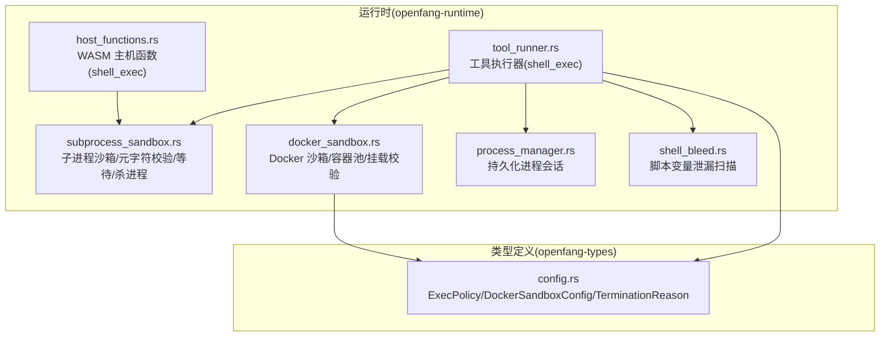
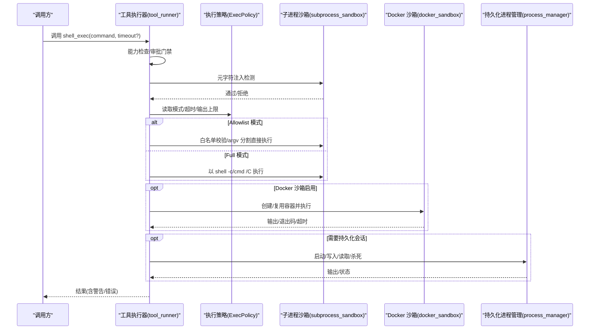
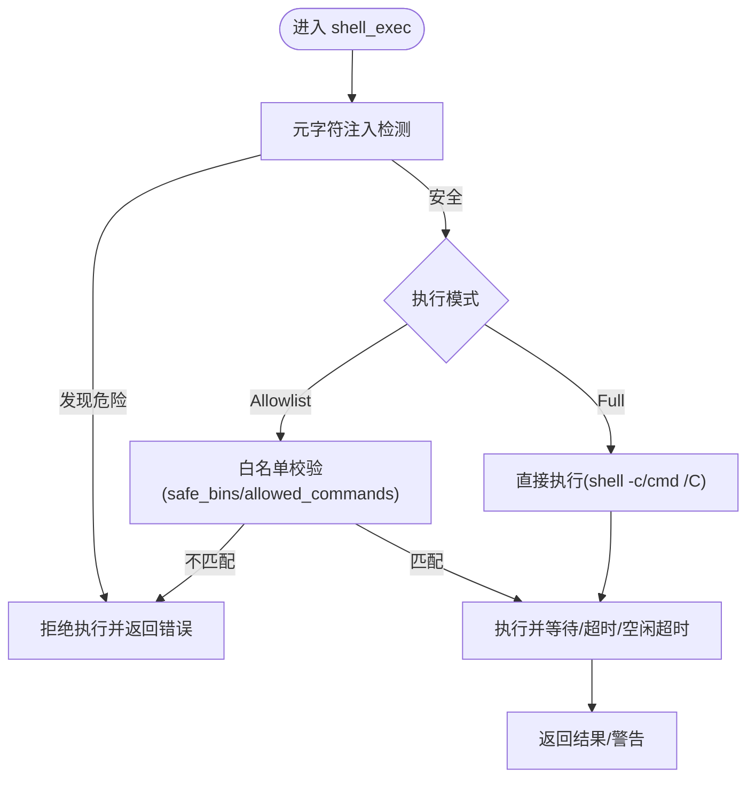
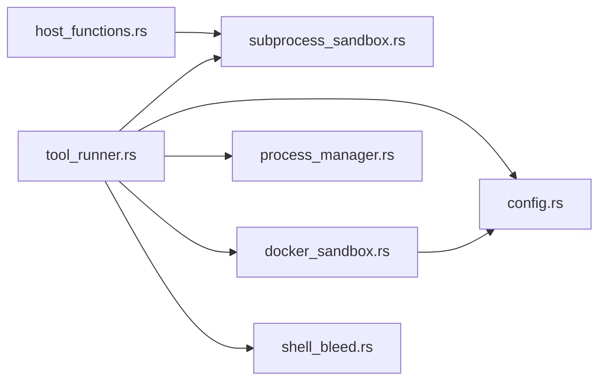
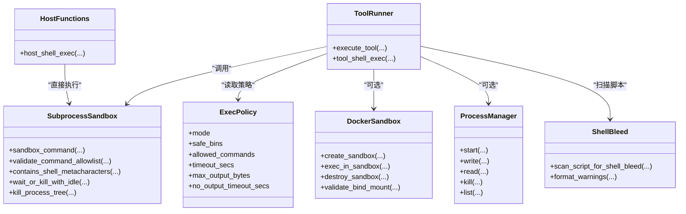

# Shell 脚本运行时

<cite>
**本文引用的文件**
- [tool_runner.rs](file://crates/openfang-runtime/src/tool_runner.rs)
- [subprocess_sandbox.rs](file://crates/openfang-runtime/src/subprocess_sandbox.rs)
- [docker_sandbox.rs](file://crates/openfang-runtime/src/docker_sandbox.rs)
- [process_manager.rs](file://crates/openfang-runtime/src/process_manager.rs)
- [shell_bleed.rs](file://crates/openfang-runtime/src/shell_bleed.rs)
- [host_functions.rs](file://crates/openfang-runtime/src/host_functions.rs)
- [config.rs](file://crates/openfang-types/src/config.rs)
- [SKILL.md](file://crates/openfang-skills/bundled/shell-scripting/SKILL.md)
- [loader.rs](file://crates/openfang-skills/src/loader.rs)
</cite>

## 目录
1. [简介](#简介)
2. [项目结构](#项目结构)
3. [核心组件](#核心组件)
4. [架构总览](#架构总览)
5. [组件详解](#组件详解)
6. [依赖关系分析](#依赖关系分析)
7. [性能考量](#性能考量)
8. [故障排除指南](#故障排除指南)
9. [结论](#结论)
10. [附录](#附录)

## 简介
本文件面向 OpenFang 的 Shell 脚本运行时，系统性阐述其安全策略（命令注入防护、权限控制）、执行环境与资源限制、输出捕获与超时控制、沙箱边界与白名单策略，并给出编写规范、最佳实践与性能优化建议。文档同时提供使用示例、调试方法与常见问题排查流程，帮助开发者在保证安全的前提下高效使用 Shell 执行能力。

## 项目结构
围绕 Shell 运行时的关键模块分布于 openfang-runtime 与 openfang-types 两个子 crate 中：
- openfang-runtime：工具执行器、子进程沙箱、Docker 沙箱、持久化进程管理、Shell 泄漏检测等
- openfang-types：执行策略、Docker 沙箱配置等类型定义

图示来源
- [tool_runner.rs](file://crates/openfang-runtime/src/tool_runner.rs)
- [subprocess_sandbox.rs](file://crates/openfang-runtime/src/subprocess_sandbox.rs)
- [docker_sandbox.rs](file://crates/openfang-runtime/src/docker_sandbox.rs)
- [process_manager.rs](file://crates/openfang-runtime/src/process_manager.rs)
- [shell_bleed.rs](file://crates/openfang-runtime/src/shell_bleed.rs)
- [host_functions.rs](file://crates/openfang-runtime/src/host_functions.rs)
- [config.rs](file://crates/openfang-types/src/config.rs)

章节来源
- [tool_runner.rs](file://crates/openfang-runtime/src/tool_runner.rs)
- [subprocess_sandbox.rs](file://crates/openfang-runtime/src/subprocess_sandbox.rs)
- [docker_sandbox.rs](file://crates/openfang-runtime/src/docker_sandbox.rs)
- [process_manager.rs](file://crates/openfang-runtime/src/process_manager.rs)
- [shell_bleed.rs](file://crates/openfang-runtime/src/shell_bleed.rs)
- [host_functions.rs](file://crates/openfang-runtime/src/host_functions.rs)
- [config.rs](file://crates/openfang-types/src/config.rs)

## 核心组件
- 工具执行器（shell_exec）：统一入口，负责能力检查、审批门禁、策略校验、污点检测、执行策略选择与结果封装
- 子进程沙箱：清理环境变量、校验可执行路径、元字符注入检测、命令白名单校验、等待/超时/空闲超时、进程树杀除
- Docker 沙箱：容器生命周期管理、资源限制、网络隔离、只读根文件系统、能力降级、绑定挂载校验、容器池复用
- 持久化进程管理：长驻进程会话、stdin 写入、stdout/stderr 缓冲读取、限额与清理
- Shell 泄漏检测：扫描脚本中对敏感变量的引用，给出警告与修复建议
- WASM 主机函数：能力受控的原生 shell_exec 调用
- 配置类型：执行策略、Docker 沙箱参数、终止原因枚举

章节来源
- [tool_runner.rs](file://crates/openfang-runtime/src/tool_runner.rs)
- [subprocess_sandbox.rs](file://crates/openfang-runtime/src/subprocess_sandbox.rs)
- [docker_sandbox.rs](file://crates/openfang-runtime/src/docker_sandbox.rs)
- [process_manager.rs](file://crates/openfang-runtime/src/process_manager.rs)
- [shell_bleed.rs](file://crates/openfang-runtime/src/shell_bleed.rs)
- [host_functions.rs](file://crates/openfang-runtime/src/host_functions.rs)
- [config.rs](file://crates/openfang-types/src/config.rs)

## 架构总览
下图展示从工具调用到实际执行的端到端流程，包括安全策略前置、策略判定、执行策略切换、资源与输出控制以及错误处理。

图示来源
- [tool_runner.rs](file://crates/openfang-runtime/src/tool_runner.rs)
- [subprocess_sandbox.rs](file://crates/openfang-runtime/src/subprocess_sandbox.rs)
- [docker_sandbox.rs](file://crates/openfang-runtime/src/docker_sandbox.rs)
- [process_manager.rs](file://crates/openfang-runtime/src/process_manager.rs)
- [config.rs](file://crates/openfang-types/src/config.rs)

## 组件详解

### 安全策略与命令注入防护
- 元字符注入检测：在任何执行模式下，均先进行元字符检测，阻断反引号命令替换、$() 变量扩展、管道、重定向、逻辑与/或、后台运行符、换行与空字节等
- 执行策略校验：Allowlist 模式下，先做元字符检测，再提取所有基础命令，逐一核对 safe_bins 或 allowed_commands；Full 模式允许任意命令但保留污点检测
- 污点检测：针对 shell_exec 的外部数据注入（如 curl、base64 -d、eval 等可疑模式）进行二次校验
- 环境变量隔离：子进程沙箱仅重放安全变量集，避免凭据泄露
- 可执行路径校验：禁止父目录组件（..），防止逃逸工作目录

图示来源
- [tool_runner.rs](file://crates/openfang-runtime/src/tool_runner.rs)
- [subprocess_sandbox.rs](file://crates/openfang-runtime/src/subprocess_sandbox.rs)
- [config.rs](file://crates/openfang-types/src/config.rs)

章节来源
- [tool_runner.rs](file://crates/openfang-runtime/src/tool_runner.rs)
- [subprocess_sandbox.rs](file://crates/openfang-runtime/src/subprocess_sandbox.rs)
- [config.rs](file://crates/openfang-types/src/config.rs)

### 权限控制机制
- 能力检查：工具执行前根据能力列表决定是否允许
- 审批门禁：需要人工审批的工具在执行前发起审批请求，支持超时与并发上限
- Docker 能力降级：默认丢弃全部能力，仅按需添加；只读根文件系统；网络隔离；CPU/内存/进程数限制
- 绑定挂载校验：绝对路径、禁止 ..、禁止敏感路径、禁止指向敏感路径的符号链接
- 可执行路径校验：禁止包含父目录组件

章节来源
- [tool_runner.rs](file://crates/openfang-runtime/src/tool_runner.rs)
- [docker_sandbox.rs](file://crates/openfang-runtime/src/docker_sandbox.rs)
- [subprocess_sandbox.rs](file://crates/openfang-runtime/src/subprocess_sandbox.rs)

### 执行环境、工作目录与环境变量传递
- 子进程环境：仅保留 PATH/HOME/TMP* 等安全变量，Windows 平台额外保留平台相关安全变量；可通过 allowed_env_vars 显式放行
- 工作目录：Docker 沙箱的工作目录由配置指定；直接执行模式下遵循当前工作目录
- 脚本执行：Shell 技能通过 -s 从 stdin 读取输入，隔离环境变量，避免凭据泄露

章节来源
- [subprocess_sandbox.rs](file://crates/openfang-runtime/src/subprocess_sandbox.rs)
- [loader.rs](file://crates/openfang-skills/src/loader.rs)
- [docker_sandbox.rs](file://crates/openfang-runtime/src/docker_sandbox.rs)

### 资源限制、超时控制与输出捕获
- 绝对超时：按工具输入或策略配置设置最大执行时间
- 空闲超时：无输出持续时间超过阈值则终止，防止僵尸进程
- 输出截断：超过阈值自动截断并提示总字节数
- 进程树杀除：优雅信号后强制 SIGKILL，跨平台兼容
- 容器资源：内存、CPU、PID 数、tmpfs、只读根文件系统

章节来源
- [subprocess_sandbox.rs](file://crates/openfang-runtime/src/subprocess_sandbox.rs)
- [docker_sandbox.rs](file://crates/openfang-runtime/src/docker_sandbox.rs)
- [config.rs](file://crates/openfang-types/src/config.rs)

### 沙箱边界、命令白名单与路径验证
- 沙箱边界：Docker 容器提供 OS 级隔离；未启用时仍通过子进程沙箱与策略限制降低风险
- 命令白名单：Allowlist 模式下仅允许 safe_bins 与 allowed_commands；Full 模式允许任意命令但保留污点检测
- 路径验证：禁止 .. 组件；Docker 绑定挂载禁止敏感路径与符号链接逃逸

章节来源
- [docker_sandbox.rs](file://crates/openfang-runtime/src/docker_sandbox.rs)
- [subprocess_sandbox.rs](file://crates/openfang-runtime/src/subprocess_sandbox.rs)
- [config.rs](file://crates/openfang-types/src/config.rs)

### Shell 脚本编写规范与最佳实践
- 基本原则：严格错误处理、变量引用加引号、函数化组织、最小权限与最小暴露
- 参数解析：优先使用 getopts 或 while/case 处理长选项与位置参数
- 清理与日志：使用 trap 确保退出清理；日志输出到标准错误，保持标准输出纯净
- 输入验证：在脚本开头校验必需环境变量、文件存在性与参数数量
- 避免高危模式：不解析 ls 输出、不使用 eval、不假设 GNU 工具可用

章节来源
- [SKILL.md](file://crates/openfang-skills/bundled/shell-scripting/SKILL.md)

### 性能优化建议
- 优先使用 Allowlist 模式下的直接 argv 执行，避免 shell 解释器带来的额外开销
- 合理设置超时与空闲超时，防止长时间占用资源
- 使用 Docker 沙箱时启用容器池复用，减少创建销毁成本
- 控制输出大小与缓冲区长度，避免内存膨胀
- 对长驻进程使用持久化管理器，限制每代理最大进程数

章节来源
- [tool_runner.rs](file://crates/openfang-runtime/src/tool_runner.rs)
- [docker_sandbox.rs](file://crates/openfang-runtime/src/docker_sandbox.rs)
- [process_manager.rs](file://crates/openfang-runtime/src/process_manager.rs)

### 使用示例与调试方法
- 示例：调用 shell_exec 执行命令，可传入 timeout_seconds 覆盖策略默认值
- 调试：开启详细日志；检查审批门禁与能力列表；确认执行模式与白名单配置；观察 Docker 容器状态与资源限制；利用持久化进程管理器查看会话状态
- 故障排查：若被拒绝，先检查元字符与白名单；若超时，调整策略或容器资源；若输出异常，检查截断与缓冲策略

章节来源
- [tool_runner.rs](file://crates/openfang-runtime/src/tool_runner.rs)
- [docker_sandbox.rs](file://crates/openfang-runtime/src/docker_sandbox.rs)
- [process_manager.rs](file://crates/openfang-runtime/src/process_manager.rs)

## 依赖关系分析

图示来源
- [tool_runner.rs](file://crates/openfang-runtime/src/tool_runner.rs)
- [subprocess_sandbox.rs](file://crates/openfang-runtime/src/subprocess_sandbox.rs)
- [docker_sandbox.rs](file://crates/openfang-runtime/src/docker_sandbox.rs)
- [process_manager.rs](file://crates/openfang-runtime/src/process_manager.rs)
- [shell_bleed.rs](file://crates/openfang-runtime/src/shell_bleed.rs)
- [host_functions.rs](file://crates/openfang-runtime/src/host_functions.rs)
- [config.rs](file://crates/openfang-types/src/config.rs)

章节来源
- [tool_runner.rs](file://crates/openfang-runtime/src/tool_runner.rs)
- [subprocess_sandbox.rs](file://crates/openfang-runtime/src/subprocess_sandbox.rs)
- [docker_sandbox.rs](file://crates/openfang-runtime/src/docker_sandbox.rs)
- [process_manager.rs](file://crates/openfang-runtime/src/process_manager.rs)
- [shell_bleed.rs](file://crates/openfang-runtime/src/shell_bleed.rs)
- [host_functions.rs](file://crates/openfang-runtime/src/host_functions.rs)
- [config.rs](file://crates/openfang-types/src/config.rs)

## 性能考量
- 执行策略选择：Allowlist 模式下的直接 argv 执行比 shell -c 更快且更安全
- 超时与空闲超时：合理设置避免资源长期占用
- 容器池复用：减少 Docker 创建/销毁开销
- 输出截断与缓冲：避免大输出导致内存压力
- 进程树杀除：确保僵尸进程及时清理

## 故障排除指南
- 命令被拒绝
  - 检查是否存在元字符或可疑注入模式
  - 确认执行模式与白名单配置
  - 若为 Full 模式，确认污点检测规则
- 超时或空闲超时
  - 调整策略中的 timeout_secs 与 no_output_timeout_secs
  - 检查 Docker 资源限制是否过严
- 输出过大或截断
  - 检查 max_output_bytes 与策略配置
  - 优化脚本输出或分块处理
- Docker 相关错误
  - 检查镜像名合法性、容器名清洗、网络与挂载配置
  - 确认绑定挂载未指向敏感路径或存在符号链接逃逸
- 进程无法清理
  - 使用进程管理器列出/杀死进程
  - 触发进程树杀除逻辑

章节来源
- [tool_runner.rs](file://crates/openfang-runtime/src/tool_runner.rs)
- [subprocess_sandbox.rs](file://crates/openfang-runtime/src/subprocess_sandbox.rs)
- [docker_sandbox.rs](file://crates/openfang-runtime/src/docker_sandbox.rs)
- [process_manager.rs](file://crates/openfang-runtime/src/process_manager.rs)
- [config.rs](file://crates/openfang-types/src/config.rs)

## 结论
OpenFang 的 Shell 脚本运行时通过“元字符检测 + 执行策略 + 污点检测 + 环境隔离 + 资源限制 + 沙箱隔离”的多层安全设计，在保障安全性的同时提供了灵活可控的执行能力。推荐优先采用 Allowlist 模式与子进程沙箱，必要时启用 Docker 沙箱以获得更强隔离；配合审批门禁与能力检查，实现最小权限与可审计的执行环境。

## 附录

### 关键流程类图（代码级）

图示来源
- [tool_runner.rs](file://crates/openfang-runtime/src/tool_runner.rs)
- [subprocess_sandbox.rs](file://crates/openfang-runtime/src/subprocess_sandbox.rs)
- [docker_sandbox.rs](file://crates/openfang-runtime/src/docker_sandbox.rs)
- [process_manager.rs](file://crates/openfang-runtime/src/process_manager.rs)
- [shell_bleed.rs](file://crates/openfang-runtime/src/shell_bleed.rs)
- [host_functions.rs](file://crates/openfang-runtime/src/host_functions.rs)
- [config.rs](file://crates/openfang-types/src/config.rs)