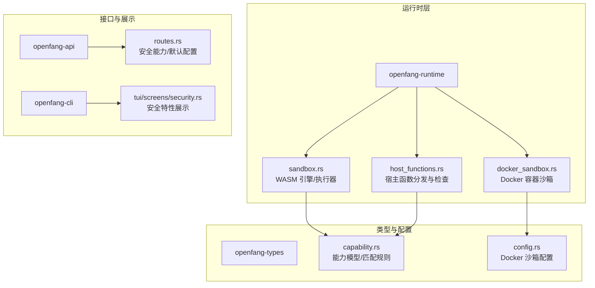
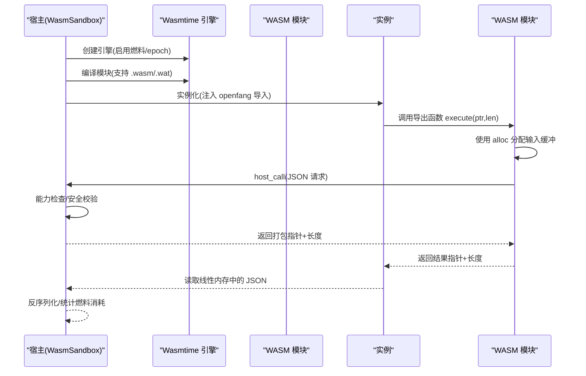
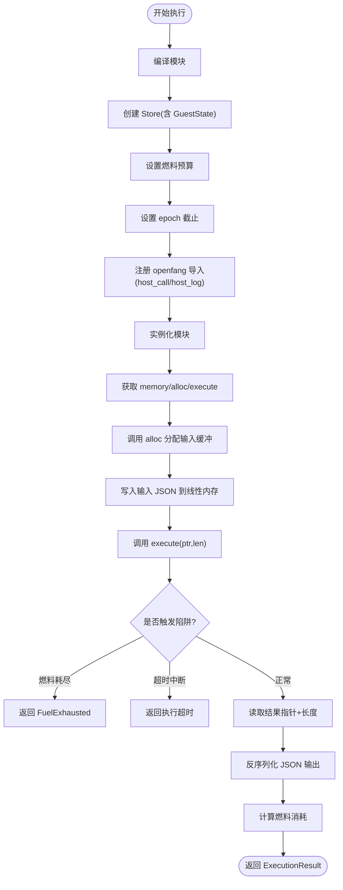
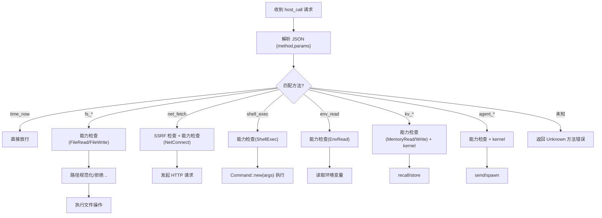
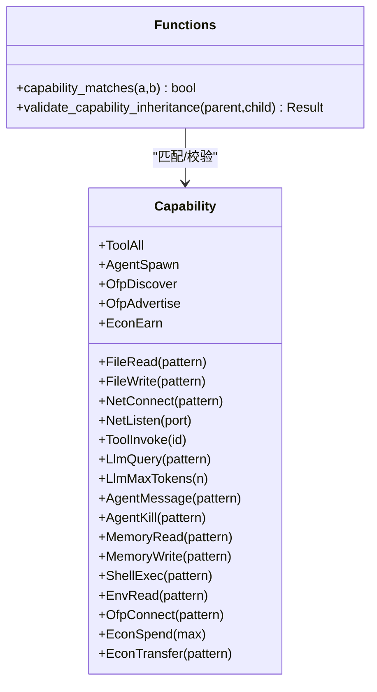
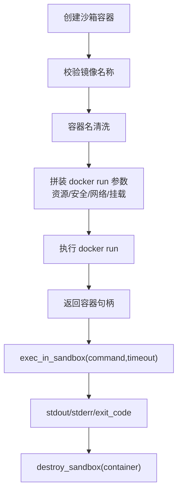
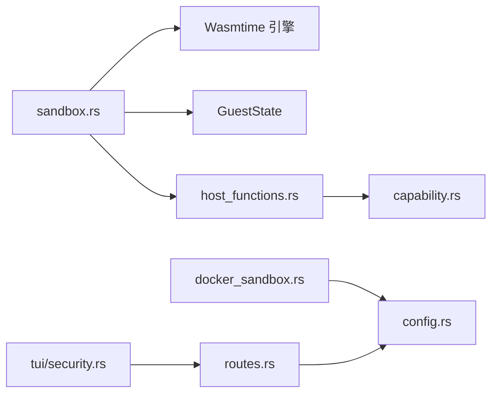

# WASM 沙箱

<cite>
**本文引用的文件**
- [crates/openfang-runtime/src/sandbox.rs](file://crates/openfang-runtime/src/sandbox.rs)
- [crates/openfang-runtime/src/host_functions.rs](file://crates/openfang-runtime/src/host_functions.rs)
- [crates/openfang-types/src/capability.rs](file://crates/openfang-types/src/capability.rs)
- [crates/openfang-runtime/src/docker_sandbox.rs](file://crates/openfang-runtime/src/docker_sandbox.rs)
- [crates/openfang-types/src/config.rs](file://crates/openfang-types/src/config.rs)
- [crates/openfang-api/src/routes.rs](file://crates/openfang-api/src/routes.rs)
- [crates/openfang-kernel/tests/wasm_agent_integration_test.rs](file://crates/openfang-kernel/tests/wasm_agent_integration_test.rs)
- [crates/openfang-runtime/src/audit.rs](file://crates/openfang-runtime/src/audit.rs)
- [crates/openfang-cli/src/tui/screens/security.rs](file://crates/openfang-cli/src/tui/screens/security.rs)
- [README.md](file://README.md)
</cite>

## 目录
1. [简介](#简介)
2. [项目结构](#项目结构)
3. [核心组件](#核心组件)
4. [架构总览](#架构总览)
5. [详细组件分析](#详细组件分析)
6. [依赖关系分析](#依赖关系分析)
7. [性能考量](#性能考量)
8. [故障排查指南](#故障排查指南)
9. [结论](#结论)
10. [附录](#附录)

## 简介
本文件系统性阐述 OpenFang 的 WASM 沙箱机制：包括执行环境的安全隔离、内存管理、资源限制；与 Docker 沙箱的对比与选型；模块加载与实例化流程、生命周期管理；沙箱内系统调用模拟、文件系统访问控制、网络请求限制；运行时配置参数、安全边界设置、性能监控指标；以及开发指南、调试方法与安全最佳实践。

## 项目结构
OpenFang 将 WASM 沙箱实现集中在运行时子系统（openfang-runtime），并以类型定义（openfang-types）提供能力模型与配置契约。API 层提供安全能力与默认配置的对外展示，CLI/TUI 提供安全特性的可视化呈现，内核测试覆盖 WASM 模块集成场景。

图示来源
- [crates/openfang-runtime/src/sandbox.rs:1-120](file://crates/openfang-runtime/src/sandbox.rs#L1-L120)
- [crates/openfang-runtime/src/host_functions.rs:1-60](file://crates/openfang-runtime/src/host_functions.rs#L1-L60)
- [crates/openfang-runtime/src/docker_sandbox.rs:1-60](file://crates/openfang-runtime/src/docker_sandbox.rs#L1-L60)
- [crates/openfang-types/src/capability.rs:1-75](file://crates/openfang-types/src/capability.rs#L1-L75)
- [crates/openfang-types/src/config.rs:509-590](file://crates/openfang-types/src/config.rs#L509-L590)
- [crates/openfang-api/src/routes.rs:5777-5817](file://crates/openfang-api/src/routes.rs#L5777-L5817)
- [crates/openfang-cli/src/tui/screens/security.rs:40-75](file://crates/openfang-cli/src/tui/screens/security.rs#L40-L75)

章节来源
- [crates/openfang-runtime/src/sandbox.rs:1-120](file://crates/openfang-runtime/src/sandbox.rs#L1-L120)
- [crates/openfang-types/src/capability.rs:1-75](file://crates/openfang-types/src/capability.rs#L1-L75)
- [crates/openfang-types/src/config.rs:509-590](file://crates/openfang-types/src/config.rs#L509-L590)
- [crates/openfang-api/src/routes.rs:5777-5817](file://crates/openfang-api/src/routes.rs#L5777-L5817)
- [crates/openfang-cli/src/tui/screens/security.rs:40-75](file://crates/openfang-cli/src/tui/screens/security.rs#L40-L75)

## 核心组件
- WASM 引擎与执行器：基于 Wasmtime，启用燃料计量与 epoch 中断，提供双层限流（CPU 指令预算 + 墙钟超时）。
- 宿主函数分发：统一通过 openfang.host_call/dispatch 调度，所有外部操作均进行能力检查与安全校验。
- 能力模型：Capability 枚举定义细粒度权限，支持通配符与模式匹配，继承校验防止越权。
- Docker 沙箱：容器级隔离，资源限制、网络隔离、能力降级、只读根文件系统等。
- 配置与默认值：WASM 默认超时与燃料上限、Docker 默认镜像、资源限制、网络模式等。

章节来源
- [crates/openfang-runtime/src/sandbox.rs:33-92](file://crates/openfang-runtime/src/sandbox.rs#L33-L92)
- [crates/openfang-runtime/src/host_functions.rs:16-49](file://crates/openfang-runtime/src/host_functions.rs#L16-L49)
- [crates/openfang-types/src/capability.rs:100-187](file://crates/openfang-types/src/capability.rs#L100-L187)
- [crates/openfang-runtime/src/docker_sandbox.rs:94-173](file://crates/openfang-runtime/src/docker_sandbox.rs#L94-L173)
- [crates/openfang-types/src/config.rs:509-590](file://crates/openfang-types/src/config.rs#L509-L590)

## 架构总览
WASM 沙箱在宿主侧以“引擎-模块-实例-导出函数”的方式运行，宿主通过链接器注入 openfang 模块的 host_call/host_log，并在实例化阶段完成导入绑定。执行时，WASM 模块通过 alloc 分配输入/输出缓冲，execute 导出函数接收 JSON 字节并返回打包指针与长度，宿主从线性内存读取结果并反序列化为 JSON。

图示来源
- [crates/openfang-runtime/src/sandbox.rs:146-275](file://crates/openfang-runtime/src/sandbox.rs#L146-L275)
- [crates/openfang-runtime/src/sandbox.rs:277-387](file://crates/openfang-runtime/src/sandbox.rs#L277-L387)

章节来源
- [crates/openfang-runtime/src/sandbox.rs:146-275](file://crates/openfang-runtime/src/sandbox.rs#L146-L275)

## 详细组件分析

### WASM 引擎与执行器（WasmSandbox）
- 引擎配置：启用 consume_fuel 与 epoch_interruption，确保确定性 CPU 计费与墙钟中断。
- 执行流程：编译 → 创建 Store(GuestState) → 设置燃料 → 设置 epoch 截止 → 注册 openfang 导入 → 实例化 → 获取 memory/alloc/execute → 写入输入 → 调用 execute → 读取输出 → 统计燃料。
- 错误处理：对 OutOfFuel 与 Interrupt 进行捕获并映射到特定错误类型。
- 并发模型：在阻塞线程池中执行，避免将 CPU 密集型 WASM 放入 Tokio 执行器。

图示来源
- [crates/openfang-runtime/src/sandbox.rs:146-275](file://crates/openfang-runtime/src/sandbox.rs#L146-L275)

章节来源
- [crates/openfang-runtime/src/sandbox.rs:94-143](file://crates/openfang-runtime/src/sandbox.rs#L94-L143)
- [crates/openfang-runtime/src/sandbox.rs:146-275](file://crates/openfang-runtime/src/sandbox.rs#L146-L275)

### 宿主函数与能力检查（host_functions.rs）
- 统一分发：dispatch(method,params) → 对应 handler。
- 能力检查：check_capability(granted, required) → capability_matches 匹配。
- 文件系统：fs_read/fs_write/fs_list，路径解析采用 safe_resolve_path/safe_resolve_parent，拒绝路径穿越。
- 网络：net_fetch，SSRF 检测（scheme 白名单、主机名黑名单、解析后私有地址检测）。
- Shell：shell_exec，命令直接传递给进程，避免 shell 注入。
- 环境变量：env_read，按需放行。
- 内存 KV：kv_get/kv_set，依赖 kernel 句柄。
- Agent 交互：agent_send/agent_spawn，支持能力继承校验。

图示来源
- [crates/openfang-runtime/src/host_functions.rs:16-49](file://crates/openfang-runtime/src/host_functions.rs#L16-L49)
- [crates/openfang-runtime/src/host_functions.rs:194-265](file://crates/openfang-runtime/src/host_functions.rs#L194-L265)
- [crates/openfang-runtime/src/host_functions.rs:271-328](file://crates/openfang-runtime/src/host_functions.rs#L271-L328)
- [crates/openfang-runtime/src/host_functions.rs:334-368](file://crates/openfang-runtime/src/host_functions.rs#L334-L368)
- [crates/openfang-runtime/src/host_functions.rs:374-386](file://crates/openfang-runtime/src/host_functions.rs#L374-L386)
- [crates/openfang-runtime/src/host_functions.rs:392-437](file://crates/openfang-runtime/src/host_functions.rs#L392-L437)
- [crates/openfang-runtime/src/host_functions.rs:443-492](file://crates/openfang-runtime/src/host_functions.rs#L443-L492)

章节来源
- [crates/openfang-runtime/src/host_functions.rs:16-49](file://crates/openfang-runtime/src/host_functions.rs#L16-L49)
- [crates/openfang-types/src/capability.rs:100-187](file://crates/openfang-types/src/capability.rs#L100-L187)

### 能力模型与继承校验（capability.rs）
- 能力枚举：文件、网络、工具、LLM、Agent 交互、内存、Shell、环境变量、OFP、经济等。
- 匹配规则：通配符“*”、前缀/后缀/中间通配、数值下界比较、布尔能力。
- 继承校验：validate_capability_inheritance 确保子能力是父能力的子集，防止越权。

图示来源
- [crates/openfang-types/src/capability.rs:10-72](file://crates/openfang-types/src/capability.rs#L10-L72)
- [crates/openfang-types/src/capability.rs:100-187](file://crates/openfang-types/src/capability.rs#L100-L187)

章节来源
- [crates/openfang-types/src/capability.rs:100-187](file://crates/openfang-types/src/capability.rs#L100-L187)

### Docker 沙箱（容器级隔离）
- 安全基线：cap-drop ALL、no-new-privileges、只读根文件系统、tmpfs、工作目录隔离。
- 资源限制：内存、CPU、PID 数量、超时。
- 网络隔离：默认 none 或自定义网络。
- 容器池：复用策略（按配置哈希与冷却时间）降低启动开销。
- 命令执行：严格校验命令与参数，超时控制。

图示来源
- [crates/openfang-runtime/src/docker_sandbox.rs:94-173](file://crates/openfang-runtime/src/docker_sandbox.rs#L94-L173)
- [crates/openfang-runtime/src/docker_sandbox.rs:175-224](file://crates/openfang-runtime/src/docker_sandbox.rs#L175-L224)
- [crates/openfang-runtime/src/docker_sandbox.rs:226-246](file://crates/openfang-runtime/src/docker_sandbox.rs#L226-L246)
- [crates/openfang-types/src/config.rs:509-590](file://crates/openfang-types/src/config.rs#L509-L590)

章节来源
- [crates/openfang-runtime/src/docker_sandbox.rs:94-173](file://crates/openfang-runtime/src/docker_sandbox.rs#L94-L173)
- [crates/openfang-types/src/config.rs:509-590](file://crates/openfang-types/src/config.rs#L509-L590)

### 配置参数与默认值
- WASM 沙箱：
  - 燃料上限：默认 1,000,000
  - 默认超时：30 秒（可配置）
  - 最大线性内存：预留字段（当前未强制）
- Docker 沙箱：
  - enabled=false
  - image="python:3.12-slim"
  - container_prefix="openfang-sandbox"
  - workdir="/workspace"
  - network="none"
  - memory_limit="512m"
  - cpu_limit=1.0
  - timeout_secs=60
  - read_only_root=true
  - cap_add=[]
  - tmpfs=["/tmp:size=64m"]
  - pids_limit=100
  - mode/off/non_main/all
  - scope/session/global
  - reuse_cool_secs=300
  - idle_timeout_secs=86400
  - max_age_secs=604800
  - blocked_mounts=[]

章节来源
- [crates/openfang-api/src/routes.rs:5800-5805](file://crates/openfang-api/src/routes.rs#L5800-L5805)
- [crates/openfang-types/src/config.rs:509-590](file://crates/openfang-types/src/config.rs#L509-L590)

## 依赖关系分析
- WasmSandbox 依赖 Wasmtime 引擎，使用 GuestState 传递能力、内核句柄与异步运行时句柄。
- 宿主函数依赖能力模型进行匹配与继承校验，部分功能依赖 kernel 句柄或 tokio 句柄。
- Docker 沙箱依赖配置类型，提供容器生命周期管理与池化复用。
- API 层暴露安全能力与默认配置，CLI/TUI 展示安全特性。

图示来源
- [crates/openfang-runtime/src/sandbox.rs:26-31](file://crates/openfang-runtime/src/sandbox.rs#L26-L31)
- [crates/openfang-runtime/src/host_functions.rs:9-14](file://crates/openfang-runtime/src/host_functions.rs#L9-L14)
- [crates/openfang-runtime/src/docker_sandbox.rs:6-9](file://crates/openfang-runtime/src/docker_sandbox.rs#L6-L9)
- [crates/openfang-api/src/routes.rs:5777-5817](file://crates/openfang-api/src/routes.rs#L5777-L5817)
- [crates/openfang-cli/src/tui/screens/security.rs:40-75](file://crates/openfang-cli/src/tui/screens/security.rs#L40-L75)

章节来源
- [crates/openfang-runtime/src/sandbox.rs:26-31](file://crates/openfang-runtime/src/sandbox.rs#L26-L31)
- [crates/openfang-runtime/src/host_functions.rs:9-14](file://crates/openfang-runtime/src/host_functions.rs#L9-L14)
- [crates/openfang-runtime/src/docker_sandbox.rs:6-9](file://crates/openfang-runtime/src/docker_sandbox.rs#L6-L9)

## 性能考量
- WASM 双重计量：燃料（CPU 指令预算）+ epoch（墙钟超时），兼顾确定性与公平性。
- 内存管理：线性内存增长但不释放页，建议模块侧谨慎分配与复用。
- 线程模型：CPU 密集型执行在阻塞线程池中进行，避免抢占。
- Docker 复用：容器池减少冷启动成本，结合冷却时间与空闲/最大年龄策略平衡资源占用。
- 监控与审计：审计链路记录关键动作，便于定位性能瓶颈与异常行为。

章节来源
- [crates/openfang-runtime/src/sandbox.rs:104-109](file://crates/openfang-runtime/src/sandbox.rs#L104-L109)
- [crates/openfang-runtime/src/docker_sandbox.rs:264-305](file://crates/openfang-runtime/src/docker_sandbox.rs#L264-L305)
- [crates/openfang-runtime/src/audit.rs:113-136](file://crates/openfang-runtime/src/audit.rs#L113-L136)

## 故障排查指南
- 燃料耗尽：检查模块是否存在无限循环或高复杂度逻辑，适当提高燃料上限或优化算法。
- 超时中断：确认 wall-clock 超时阈值，必要时延长 timeout_secs。
- 能力拒绝：核对授予的能力列表与模式匹配，确保路径、主机、命令等参数符合白名单。
- 路径穿越：确认传入路径未包含“..”，使用安全解析函数。
- SSRF 阻断：检查 URL scheme 与目标主机是否在允许范围，解析后的私有地址会被拦截。
- Docker 启动失败：检查镜像名称、网络模式、挂载路径与只读根配置，关注容器名清洗与参数校验日志。

章节来源
- [crates/openfang-runtime/src/sandbox.rs:234-247](file://crates/openfang-runtime/src/sandbox.rs#L234-L247)
- [crates/openfang-runtime/src/host_functions.rs:75-117](file://crates/openfang-runtime/src/host_functions.rs#L75-L117)
- [crates/openfang-runtime/src/host_functions.rs:125-160](file://crates/openfang-runtime/src/host_functions.rs#L125-L160)
- [crates/openfang-runtime/src/docker_sandbox.rs:94-173](file://crates/openfang-runtime/src/docker_sandbox.rs#L94-L173)

## 结论
OpenFang 的 WASM 沙箱通过“燃料+epoch”的双重计量与严格的宿主函数能力检查，提供了细粒度的安全边界与可控的资源限制。与 Docker 沙箱相比，WASM 更轻量、启动更快、隔离更聚焦于执行与 I/O；Docker 则提供更强的 OS 级隔离与资源隔离。在实际部署中，可根据任务性质与合规要求选择合适的沙箱方案，并结合监控与审计体系持续优化。

## 附录

### WASM 模块加载与实例化流程（步骤化）
- 加载：接受 .wasm 二进制或 .wat 文本，编译为 Module。
- 存储：创建 Store 并注入 GuestState（能力、内核句柄、Agent ID、Tokio 句柄）。
- 计费：设置燃料预算；设置 epoch 截止并启动看门狗线程。
- 链接：注册 openfang 模块的 host_call/host_log。
- 实例化：绑定导入，完成链接。
- 导出：获取 memory/alloc/execute。
- 输入：序列化 JSON，调用 alloc 分配缓冲，写入线性内存。
- 执行：调用 execute，读取返回的打包指针与长度。
- 输出：从线性内存读取 JSON，反序列化并统计燃料消耗。

章节来源
- [crates/openfang-runtime/src/sandbox.rs:155-275](file://crates/openfang-runtime/src/sandbox.rs#L155-L275)

### WASM 与 Docker 沙箱对比与选型建议
- WASM 沙箱
  - 优点：启动快、内存占用低、与宿主语言生态融合好、能力模型细粒度。
  - 适用：无副作用或受控副作用的计算、数据处理、工具调用。
- Docker 沙箱
  - 优点：OS 级隔离强、资源与网络完全隔离、适合复杂子进程。
  - 适用：需要真实系统调用、网络服务、文件系统完整访问的场景。
- 选型建议
  - 优先使用 WASM 沙箱，仅在确需 OS 级隔离或系统工具时启用 Docker 沙箱。
  - 对子代理/子进程场景，利用能力继承校验确保子能力不越权。

章节来源
- [crates/openfang-runtime/src/docker_sandbox.rs:1-635](file://crates/openfang-runtime/src/docker_sandbox.rs#L1-L635)
- [crates/openfang-types/src/capability.rs:168-187](file://crates/openfang-types/src/capability.rs#L168-L187)

### 开发指南与调试方法
- 开发指南
  - 仅授予最小能力集合，遵循“按需放行”原则。
  - 使用安全路径解析与 SSRF 检测，避免路径穿越与内部地址访问。
  - 在模块侧合理管理线性内存，避免碎片化与过度增长。
  - 利用 host_log 记录调试信息，注意级别控制。
- 调试方法
  - 逐步缩小燃料预算定位热点循环。
  - 观察超时中断与能力拒绝错误，修正能力声明与参数。
  - 使用审计链路回溯关键动作，结合监控指标定位异常。

章节来源
- [crates/openfang-runtime/src/host_functions.rs:350-384](file://crates/openfang-runtime/src/host_functions.rs#L350-L384)
- [crates/openfang-runtime/src/audit.rs:113-136](file://crates/openfang-runtime/src/audit.rs#L113-L136)

### 安全最佳实践
- 能力最小化：仅授予模块运行所需的精确能力与范围。
- 继承校验：子代理/子进程能力必须是父能力的子集。
- 路径与网络：严格路径规范化与 SSRF 检测，禁止访问私有地址与元数据端点。
- 环境变量：仅放行必要的敏感变量，避免泄露。
- 审计与追踪：启用审计链路与分布式追踪，保留可追溯证据。

章节来源
- [crates/openfang-types/src/capability.rs:168-187](file://crates/openfang-types/src/capability.rs#L168-L187)
- [crates/openfang-runtime/src/host_functions.rs:75-117](file://crates/openfang-runtime/src/host_functions.rs#L75-L117)
- [crates/openfang-runtime/src/host_functions.rs:125-160](file://crates/openfang-runtime/src/host_functions.rs#L125-L160)
- [README.md:206-228](file://README.md#L206-L228)